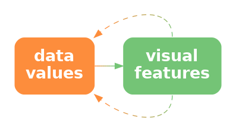
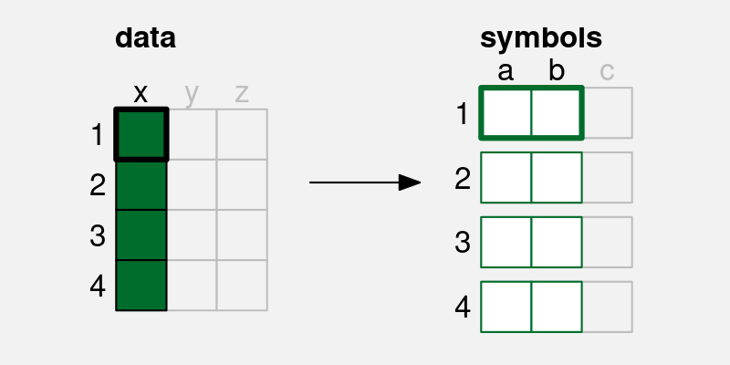

```{r}
#| echo: false
#| message: false
source("common.R")
```

# Combining Mappings

Most data visualisations involve more than one data variable.
For example, the bar plot in @fig-bar-gender involves data on the **gender** 
of offenders and data on the **count** of
offenders for each gender.

```{r}
#| echo: false
#| label: fig-bar-gender
#| fig-cap: A bar plot of the total number of male offenders and the total number of female offenders in New Zealand from 2011 to 2021.
ggplot(crimeGenderTotal) + 
    geom_col(aes(y=total, x=gender)) +
    scale_y_continuous(expand=expansion(c(0, .05))) +
    labs(title="Youth Offenders in New Zealand",
         subtitle="2011 to 2021") +
    theme(aspect.ratio=1,
          axis.title=element_blank())
```

In @fig-bar-gender, 
each data value is mapped to a **visual feature** of a data symbol
(@fig-visual-feature).  For example, 
the gender is encoded as the horizontal **position** of the bars
and the count of offenders is encoded as the **length** of the bars.

We have so far only looked at mappings from data values to visual features
in isolation.  For example, we know that the mapping from gender to 
position is effective because position is 
appropriate for qualitative data and position has sufficient capacity
to differentiate between two genders.
We also know that mapping the count
of offenders to length is effective because length
is appropriate for quantitative data and length provides an accurate
decoding.

In this chapter, we begin to consider what happens when mappings are
used in combination.  For a start, we will just extend our 
thinking to data visualisations that involve mapping **two** data variables
to **two** visual features, like gender and count to position and
length.
Furthermore, we will restrict ourselves to mappings 
where each pair of data values 
are encoded as a single data symbol (@fig-two-visual-features).
For example, in @fig-bar-gender,
each combination of gender and count produces a single
bar.

::: {#fig-two-visual-features}
::: {.content-visible when-format=pdf layout-ncol=2}
\includegraphics[scale=0.5]{Diagrams/data-vis.png}

\includegraphics[scale=0.7]{Mappings/mapping-1-2-1-2.png}
:::

::: {.content-visible when-format=html layout-ncol=2}


:::

A simple data visualisation maps **two** data values to
**two** visual features to create a data symbol.
Each pair of data values (`x` and `y`) is mapped to two visual
features (`a` and `b`) of a **single** data symbol.
:::

## Independent visual features

A bar plot involves encoding a qualitative variable as bar **position**
and a quantitative variable as bar **length** (e.g., @fig-bar).
We know that each visual feature is effective on its own---we can 
decode from positions to qualitative values and we can decode from
lengths to quantitative values---but another reason why the bar plot
is effective overall is because the two visual features act
independently.[^separable]
Our perception of the horizontal **length** of the bars is not
affected by the vertical **position** of the bars.[^independent-lie]

[^separable]:
    Independent visual features are called *separable*, in contrast to
    *integral* features that interact.
    An early use of these terms in the context of data visualisation
    (or at least *statistical graphics*) 
    is @carswell-wickens-88.

    A further distinction is made for *configural* visual features, which are
    combinations that interact, but still allow decoding of the
    individual visual features [@carswell1990perceptual].

    These ideas can be traced back to the much less readable 
    @garner1974processing.

[^independent-lie]:
    To be honest, there is an interaction between position and length
    because lengths that are further apart
    from each other vertically are harder to compare (@sec-distance-effect).
    However, compared to visual features that strongly interact, length
    and position are relatively independent.

@fig-bar-colour demonstrates that we can also add **colour** to the mix 
without creating any interactions between visual features.
The fact that the bottom two bars are blue and red does not
affect our ability to perceive that they have different lengths.

```{r}
#| echo: false
#| label: fig-bar-colour
#| fig-cap: A bar plot of the total number of male offenders and the total number of female offenders. The data symbols in this plot come from mapping gender to the vertical positions and colours of the bars and mapping the total number of offenders to the lengths of the bars.
ggplot(crimeGenderTotal) + 
    geom_col(aes(x=gender, y=total, fill=gender)) +
    scale_y_continuous(expand=expansion(c(0, .05))) +
    labs(title="Youth Offenders in New Zealand",
         subtitle="2011 to 2021") +
    theme(aspect.ratio=1,
          axis.title=element_blank(),
          legend.position="none")
```

> One reason why a bar plot is effective is because data values are
  encoded as visual features that can be decoded independently.

## Scatter plots {#sec-integral}

@tbl-rwc-2023 shows data gathered on the performance of all twenty
teams at the 2023 Rugby World Cup.  Most measures are positive, for example,
more **points** is better, but there are also a couple of
negative measures:  more **tackles** may just mean that the
team was weak and was always being attacked;  and more disciplinary **cards**
(either **y**ellow or **r**ed) is definitely a bad sign.

```{r}
#| echo: false
#| message: false
#| label: tbl-rwc-2023
#| tbl-cap: Performance measures for teams at the 2023 Rugby World Cup. Each measure is a per-game average because some teams played more games than others.  There are 20 teams in total, with only the first 6 shown here.
kable(head(RWCperGame), digits=1, row.names=FALSE)
```

@fig-scatter shows a scatter plot of the number of "clean breaks" per game
versus the number of "tries scored" 
per game for each team.  A clean break means that a
team has broken through the opposition defence and a "try scored" means 
that the team has earned 5 points.
A clean break implies an opportunity to score a try,
but does not guarantee that a try will be scored.

```{r}
#| echo: false
#| label: fig-scatter
#| fig-cap: A scatter plot of the number of times a team breaks through the opposition defence and the number of tries that a team scores (both are per-game averages) for teams at the 2023 Rugby World Cup.
gg <- ggplot(RWCperGame) +
    geom_point(aes(breaks, tries)) +
    scale_x_continuous(name="clean breaks") +
    scale_y_continuous(name="tries scored") +
    theme(aspect.ratio=1)
pushViewport(viewport(height=.8))
print(gg, newpage=FALSE)
popViewport()
```

The data symbol in a scatter plot is a data point, in this case a circle.
There are two mappings in the scatter plot in @fig-scatter:
the **quantitative** number of clean breaks is encoded as the horizontal
**position** of the data points and the **quantitative** number of tries 
scored is encoded as the vertical **position** of the data points.

We know from @sec-mapping-visual-features 
that we should be able to accurately decode the original data values
from the positions of the data points.
For example, we can easily see that one team scored a little over 
7.5 clean breaks per game and we can see that two teams scored about
6 tries per game.

However, there is something else going on in the scatter plot.
The two explicit encodings---horizontal and vertical position---**interact** 
to create an additional **emergent** visual feature:
**position in space** (@fig-interact).[^emergent-features]
For example, we can perceive not only horizontal and vertical
distances between data points, but also euclidean distances between
data points ("as the crow flies").

[^emergent-features]:
    The use of *emergent* visual features in this book, to describe
    the result of *integral* (or *configural*) 
    visual features interacting, 
    corresponds loosely to various usages of *emergent* in the literature.
    
    @maceachren1995how uses *emergent* in this way, but,
    for example, @Cragin2015-CRAEFA and @palmer1999vision 
    use *emergent* more to describe
    visual features that arise from combinations of separate visual
    objects (data symbols).

    "The arrangement of several dots in a line give
    rise to emergent properties, such as length, orientation, and
    curvature, that are different from the properties of the dots that
    compose it." [@palmer1999vision, fig. 2.1.5]
  
::: {#fig-interact}
::: {.content-visible when-format=pdf layout-ncol=2}
\includegraphics[scale=0.5]{Diagrams/data-vis-vis.png}
:::

::: {.content-visible when-format=html layout-ncol=2}

:::

If we encode data values as visual features and the visual features interact, 
the result can be additional visual features.  It is possible for the 
additional visual feature to be dominant relative to the original visual
features or even to obscure the original visual features.
:::

> One reason why a scatter plot is effective at conveying relationships
  between variables is because the mappings of data values to visual
  features---horizontal 
  position and vertical position---interact to produce an additional
  visual feature: position in space.

Furthermore, our visual system allows us to decode **visual summaries**
(see @sec-visual-summaries) from **position in space** 
(see @fig-visual-corr).[^ensemble-corr]
For example, in @fig-scatter we can easily see a positive 
**correlation** between the number of clean breaks and the number of
tries scored.  The points lie roughly along a line from bottom-left to
top-right.

We can also easily see **clusters** of data points;
the four data points in the top-right corner of the plot appear separate 
from the other data points because they share a similar
position in space (@sec-visual-model-groups).

[^ensemble-corr]:
    The ability to decode correlations from scatter plots is 
    another example of *ensemble* perception [@ensemble-scatter; 
    @rensink2017nature].

::: {#fig-visual-corr}
::: {.content-visible when-format=pdf layout-ncol=2}
\includegraphics[scale=0.5]{Diagrams/data-vis-vis-stat.png}
:::

::: {.content-visible when-format=html layout-ncol=2}

:::

If we encode data values as visual features and the visual features interact, 
the result can be emergent visual features.  The original visual features
allow us to decode raw data values and the emergent features
allow us to decode data summaries.
:::

> One reason why a scatter plot is effective at conveying relationships
  between variables is because we are able to decode visual summaries from
  a collection of positions in space.

Although a scatter plot is similar to a bar plot because they both
involve two encodings---position and length for a bar plot and 
horizontal position and vertical position for a scatter plot---there 
are additional decodings possible from the data symbols in a 
scatterplot because the additional visual feature of position in space
emerges from the combination of horizontal and vertical position.

## Visual features that interact

We have seen that some combinations of 
visual features, such as **position** and **length**
(@fig-bar-gender) and **position** and **hue** (@fig-bar-colour)
do not interact, while other combinations of features, such as
horizontal and vertical **position** (@fig-scatter) do interact.
What about other combinations of visual features?
@fig-separable shows all pairwise combinations of visual features
that we have considered (@fig-visual-features).[^separable-features]

[^separable-features]:
    @munzner2014visualization provides some examples of combinations
    of *visual channels* in Figure 5.10.
    @ware2021information gives a broader selection of combinations
    of *display attributes* in Figure 5.24.

The top row of @fig-separable 
shows that **position** can be combined independently with
every other visual feature, except itself (@sec-integral),
even when we vary both visual features at once.

For other combinations, we have an array of data symbols, with one
visual feature changing down rows and another visual feature changing
across columns.
If the visual features are independent, we should be able to decode
one visual feature from the rows and one visual feature from the columns.
For example, for the combination of **hue** and **pattern**,
we can clearly see columns of the same hue and rows of the same pattern.

If the visual features interact, we should not be able decode separate
visual features.  For example, for the combination of **chroma** and 
**luminance**, all we can see is an array of different shades;
there are no clear rows of different chroma or columns of different
luminance.

There are also combinations that
are not fully independent and have weak interactions between visual features.
For example,
the decoding of hue, chroma, and luminance is somewhat
affected by the area of the data symbol.
@size-matters provides a clearer demonstration of this effect.
Another weak interaction is between hue and luminance;  this still
allows for diverging colour palettes (@sec-divergent).

One clear message from @fig-separable is that all visual features
interact with themselves.  If we try to encode two separate data variables
as the same visual feature, it will be difficult to decode the
individual data variables.
We can also see that combinations of length, angle, area, and pattern 
produce interations, as do combinations of area, hue, chroma, and luminance.
However, combinations of one of hue, chroma, or luminance with any of 
position, length, angle, area, or pattern are independent.

```{r}
#| echo: false
#| label: fig-separable
#| fig-height: 8
#| fig-cap: All pairwise combinations of basic visual features.  Combinations that strongly interact have a thick black border, combinations that are clearly independent have no border, and combinations where there is weak interaction have a thin black border.
source("separable.R")
```

## Case study: Mosaic plots {#sec-mosaic}

@tbl-offenders shows a table of counts for offences committed
in New Zealand in 2021.
For each offence, we know the sex of the offender and what action was 
taken against the offender.

```{r}
#| echo: false
#| label: tbl-offenders
#| tbl-cap: Counts of offences committed in New Zealand in 2021 by the sex of the offender and the action taken against the offender. 
offenderTable <- with(offenders, table(Mop.Division, SEX))
kable(offenderTable)
```

@fig-spine shows a mosaic plot of the data in @tbl-offenders.[^mosaic]
This is an effective data visualisation for making several comparisons:
the overall proportion of male versus female offenders; 
within each sex, the proportion of different actions against offenders;
between sexes, the distribution of different actions;
and the overall proportions of combinations of sex and action against
offenders.

[^mosaic]:
    This two-dimensional mosaic plot could also be called a spine plot.
    Mosaic plot is the more general term that includes plots of more than
    two qualitative variables.

    Mosaic plots also provide a simple visual check for independence between
    factors.  For example, in @fig-spine we can see that the action taken is
    reasonably independent of the sex of the offender because the heights of the
    rectangles are similar for both Male and Female offenders (the conditional
    proportions are roughly the same).

For example, we can see that there are more male offenders than female
offenders, court action is more common than non-court action for both males and
female offenders, court action is more common for male offenders than
for female offenders, and the most common offences involve male offenders
and result in court action.

```{r}
#| echo: false
#| label: fig-spine
#| warning: false
#| fig-cap: A spine plot
offenders$action <- factor(offenders$Mop.Division, 
                           levels=rev(sort(unique(offenders$Mop.Division))))
gg <- ggplot(offenders) +
    geom_mosaic(aes(x=product(action, SEX), fill=action)) +
    scale_fill_npg(guide=guide_legend(reverse=TRUE)) +
    coord_cartesian(expand=FALSE) +
    theme(panel.border=element_blank(),
          axis.title=element_blank(),
          legend.title=element_blank(),
          aspect.ratio=1)
pushViewport(viewport(width=.8, height=.8))
print(gg, newpage=FALSE)
popViewport()
```

A mosaic plot is another example of a data visualisation that 
maps **data summaries** to data symbols rather than raw data.
The data symbols are rectangles, the proportions 
of male versus female offenders 
are encoded as the widths of the rectangles, and
the proportions of different actions
taken, within males and females, are encoded as 
the heights of the rectangles (see @tbl-offenders-summary).

```{r}
#| echo: false
#| label: tbl-offenders-summary
#| tbl-cap: The data summaries calculated from @tbl-offenders that are encoded as the widths and heights of the rectangles in @fig-spine.
#| tbl-subcap:
#|   - Widths
#|   - Heights
#| layout-nrows: 2
widths <- proportions(t(marginSums(offenderTable, 2)), 1)
heights <- proportions(offenderTable, 2)
props <- cbind(matrix(rep(widths, 3), nrow=3, byrow=TRUE), heights)
colnames(props) <- rep(colnames(props)[3:4], 2)
kable(props[,1:2], digits=2)
kable(props[,3:4], digits=2)
```

> One reason why a mosaic plot is effective is because it maps proportions
  and conditional proportions, rather than raw counts,
  to the visual features of rectangles.

A mosaic plot is also an example of a data visualisation 
that maps to visual features that **interact**.
The explicit mappings involve encoding proportions as the widths and heights
of the rectangles and we know from @sec-quant-features that 
this will allow accurate decoding from lengths to proportions.

> One reason why a mosaic plot is effective is because it maps 
  proportions to lengths.

However, the interaction of these mappings produces
an **emergent feature**, which is the **area** of the rectangles
(@fig-interact).  Importantly, these areas correspond to 
additional data summaries, in this case, the overall proportion of offences in
each combination of sex and action taken.

> One reason why a mosaic plot is effective is because the mappings     
  to length and height interact to produce area, which represents
  overall proportions.

One weakness of mosaic plots is that area is not the most
accurate visual feature (@sec-accuracy), so we are not able to decode
overall proportions from the rectangle areas as accurately 
as we are able to decode
the proportions that are represented by the separate widths and heights
of the rectangles.

Another weakness is that the lengths and heights of the rectangles are
unaligned (@sec-unaligned).  This compromises the accuracy of
comparisons of widths between
categories or the comparisons of heights between categories.
This weakness is greater if there are more categories and/or 
larger differences between categories than we see in @fig-spine.
For example, @fig-spine-weak shows a mosaic plot of the proportions
of offenders in different age groups and, within age groups,
the proportions of actions against the offender at a finer level of
detail than in @fig-spine.  If we attempt to compare the proportion of 
offences that result in "Formal Warnings" in younger age groups versus
older age groups, we are hampered by the fact that the pink rectangles
do not have a common vertical baseline.  As a side note, we are also
hampered in that case by the distance and distractors between the rectangles
(@sec-distance-effect); the ordering of the variables and the
ordering of categories can have an impact on the effectiveness of a mosaic
plot just like ordering the bars of a bar plot.

```{r}
#| echo: false
#| label: fig-spine-weak
#| warning: false
#| fig-cap: A spine plot with problems
#| fig-keep: last
actions <- c("Prosecution", "Formal Warning", "Informal Warning",
             "Community Justice Panel", "Alternative Action Plan",
             "No Further Action")
offendersMain <- subset(offenders, 
                        !(Age.Group %in% 
                          c("0-4", "5-9", "80yearsorover", "NotSpecified")) &
                        (Mop.Group %in% actions),
                        drop=TRUE)
offendersMain$Age.Group <- gsub("([0-9]+).+", "\\1", offendersMain$Age.Group)
offendersMain$Age.Group <- factor(offendersMain$Age.Group)
offendersMain$Mop.Group <- factor(offendersMain$Mop.Group, levels=rev(actions))
gg <- ggplot(offendersMain) +
    geom_mosaic(aes(x=product(Mop.Group, Age.Group), fill=Mop.Group)) +
    coord_cartesian(expand=FALSE) +
    scale_fill_npg(guide=guide_legend(reverse=TRUE)) +
    theme(panel.border=element_blank(),
          axis.title=element_blank(),
          legend.title=element_blank(),
          axis.text.x=element_text(size=6),
          aspect.ratio=.8)
pushViewport(viewport(width=1, height=1))
print(gg, newpage=FALSE)
popViewport()
grid.force()
grid.edit("axis.1-2-1-2::titleGrob::text", grep=TRUE, vjust=c(.5, .5, 1, 0, .5, .5))
grid.edit("axis.3-1-3-1::titleGrob::text", grep=TRUE, hjust=c(rep(.5, 13), .3))
```

These weaknesses are exacerbated for mosaic plots of more than two
variables.  For example, the mosaic plot in @fig-mosaic shows the
proportions of youth versus adult offenders, then, within age levels, the
proportions of male versus female offenders, then, within combinations
of age levels and sex, the proportions of different actions taken against the
offender.  Even though there are only very few levels for each variable, 
our ability to compare heights and widths of rectangles is impaired
by inconsistent baselines, distance between rectangles, and distractors.

```{r}
#| echo: false
#| label: fig-mosaic
#| warning: false
#| fig-cap: A mosaic plot of three variables
offenders$ageCat <- ifelse(offenders$youth, "Youth", "Adult")
gg <- ggplot(offenders) +
    geom_mosaic(aes(x=product(action, SEX, ageCat), fill=action),
                divider=mosaic("v")) +
    scale_fill_npg(guide=guide_legend(reverse=TRUE)) +
    coord_cartesian(expand=FALSE) +
    theme(panel.border=element_blank(),
          axis.title=element_blank(),
          legend.title=element_blank(),
          aspect.ratio=1)
pushViewport(viewport(width=1, height=1))
print(gg, newpage=FALSE)
popViewport()
```

A final weakness with mosaic plots is that the **shape** of the rectangles
changes as well as the **area**.
In @sec-dissonance we saw that changes in visual features should only 
reflect changes in the data.
@fig-area-shape shows that we can create different rectangles with the
same area, but different shapes.  There can be
rectangles within a mosaic plot with the same area, which
represents the same overall probability data value,
but with different shapes.  The different shapes are a visual signal
of differences in the data when in reality no difference exists.

```{r}
#| echo: false
#| label: fig-area-shape
#| fig-cap: Three different rectangles that all have the same area.
#| fig-height: 3
grid.newpage()
pushViewport(viewport(layout=grid.layout(1, 3, respect=TRUE)))
pushViewport(viewport(layout.pos.col=1))
grid.rect(width=.8, height=.2, gp=gpar(fill="black"))
popViewport()
pushViewport(viewport(layout.pos.col=2))
grid.rect(width=.4, height=.4, gp=gpar(fill="black"))
popViewport()
pushViewport(viewport(layout.pos.col=3))
grid.rect(width=.2, height=.8, gp=gpar(fill="black"))
popViewport()
```

## Case study: Interaction plots

@fig-interaction shows an interaction plot of the number of offenders
in different ethnic groups, comparing 2011 to 2021.
The raw data are shown in @tbl-interaction.

```{r}
#| echo: false
#| label: tbl-interaction
#| tbl-cap: The number of offenders in different ethnic groups in 2011 and in 2021.
crimeGroupSub <- subset(crimeGroup, year %in% c(2011, 2021))
kable(crimeGroupSub[c("group", "year", "count")],
      row.names=FALSE)
```

The purpose of the interaction plot is to show the *change* in the number
of offenders between 2011 and 2021 for each of the ethnic groups.
If the lines of the interaction plot were parallel we would conclude
that the same change has happened to all ethnic groups;  the fact that the 
lines are not parallel indicates that there have been different changes
in some ethnic groups compared to other ethnic groups.[^interaction-plot]

[^interaction-plot]:
  An interaction plot is typically used in a more experimental setting 
  where the x-axis might be different treatments and the groups might
  be different patient groups and the y-axis might be a measure
  of response to treatment.  The outcome is then whether the treatment
  has had the same effect for different patient groups (or not).

```{r}
#| echo: false
#| label: fig-interaction
#| fig-cap: An interaction plot showing the change in the number of offenders in different ethnic groups between 2011 and 2021.
ggplot(crimeGroupSub) +
    geom_line(aes(x=year, y=count, colour=group)) +
    scale_x_continuous(name=NULL, breaks=c(2011, 2021)) +
    theme(aspect.ratio=1)
```

The data symbols in @fig-interaction are straight line segments.
The year is encoded as the horizontal start and end **position** of the lines
and the number of offenders is encoded as the vertical start and end
**position** of the lines.  The ethnic group is encoded as the **colour**
of the lines.  These mappings are effective for decoding the
raw data values in @tbl-interaction from the end points and the colours
of the lines.

In addition, the explicit mappings generate
an **emergent feature**: the **angle** of the lines.
Furthermore, the angle of the lines allow us to decode
a **data summary**: the *change* in the number
of offenders between 2011 and 2021 (see @fig-visual-corr).

> An interaction plot is effective because it 
  allows us to decode changes in the data values from
  the angles of the lines.

It is more difficult to decode and compare
the *change* in the number of offenders
for each ethnic group in
a bar plot like the one shown in @fig-interaction-bar.
Partly this is because we have to decode the lengths of two bars
for each ethnic group rather than the slope of a single line.[^pinker]

[^pinker]:
    Pinker1990GraphComprehension (p. 111)
    discusses the problem of extracting
    different sorts of information from different data symbols,
    in particular bars versus lines.

```{r}
#| echo: false
#| label: fig-interaction-bar
#| fig-cap: A bar plot showing the number of offenders in different ethnic groups in 2011 and in 2021.
ggplot(crimeGroupSub) +
    geom_col(aes(x=year, y=count, fill=group), position="dodge") +
    scale_x_continuous(name=NULL, breaks=c(2011, 2021)) +
    scale_y_continuous(expand=expansion(c(0, .05))) +
    theme(aspect.ratio=1)
```

## Decoding combinations of visual features

Although there is some experimental support for reasonable
accuracy of correlation from scatter plot (with some bias - 
specifically underestimation),
there is not much experimental evidence for which is best 
for perceiving correlations Eg scatter plot vs parallel coords etc
[^emergent-accuracy]

[^emergent-accuracy]:
    Examples of studies that demonstrate a tendency to 
    underestimate correlation coefficient
    are @perception-correlation and @cui2024drawn.

## Dangers of combining mappings

@fig-nz-doctor-bar shows a plot of changes in 
health spending by successive New Zealand 
governments.[^nz-doctor]
In this data visualisation,
the average change in health spending over a government's entire term
is encoded as the **height** of a bar, 
with the duration of that government's term
encoded as the **width** of the bar.
Because height and width are visual features that interact, the result 
is an **area** for each government's term.
However, that area has no sensible interpretation;
what does a percent multiplied by a number of years mean?
The areas of the bars do not correspond to any property of the data values.

[^nz-doctor]:
    @fig-nz-doctor-bar is based on Figure 2 from @nz-doctor.

```{r}
#| echo: false
#| label: fig-nz-doctor-bar
#| fig-cap: A plot showing the differences in health spending for successive New Zealand governments using filled bars.
nzdoctor <- data.frame(year=c(1999, 1999:2023), 
                       block=rep(1:5, c(1, 9, 9, 6, 1)),
                       percent=rep(c(0, 4.7, 1.3, 4.6, -3), c(1, 9, 9, 6, 1)),
                       party=rep(rep(c(NA, rep(c("Labour", "National"), 2)),
                                 c(1, 9, 9, 6, 1))))
block <- function(data, coords) {
    blockCoords <- split(coords, coords$block)
    zero <- blockCoords[[1]]$y
    step <- diff(coords$x)[2]
    blockRect <- function(x) {
        l <- x$x[1]
        r <- l + diff(range(x$x)) + step
        b <- zero
        t <- x$y[1]
        polygonGrob(c(l, l, r, r), c(b, t, t, b),
                    gp=gpar(col=NA, fill=x$colour[1]))
    }
    blocks <- lapply(blockCoords[-1], blockRect)
    do.call(grobTree, blocks)
}
blockYear <- function(data, coords) {
    zero <- coords$y[1]
    step <- diff(coords$x)[2]
    years <- data$x[-1]
    textGrob(paste0(" ", years, "-", substring(years + 1, 3, 4)),
             coords$x[-1] + step/2, zero, hjust=0, rot=-90,
             gp=gpar(fontsize=10))
}
partyColours <- c(rgb(217, 42, 31, max=255),
                  rgb(46, 140, 204, max=255))
ggDoctor <- ggplot(nzdoctor) +
    grid_panel(block, aes(year, percent, colour=party, block=block)) +
    grid_panel(blockYear, aes(year, percent)) +
    scale_y_continuous(limits=c(-4, 6), expand=expansion(0), 
                       breaks=-4:6, 
                       labels=paste0(sprintf("%1.1f", -4:6), "%")) +
    scale_x_continuous(expand=expansion(add=c(0, 1))) +
    scale_colour_manual(values=partyColours) +
    labs(title=paste("New Zealand Real Terms", 
                     "Average Annual Health Spend Change Per Person",
                     sep="\n")) +
    theme(panel.border=element_blank(),
          axis.ticks=element_blank(),
          axis.text.x=element_blank(),
          axis.title.x=element_blank(),
          axis.title.y=element_blank())
pushViewport(viewport(width=.9, height=.9))
print(ggDoctor, newpage=FALSE)
```

The interaction of visual features can be a boon when the interaction
produces an emergent feature that can be decoded to properties
of the data (as in a scatter plot, or mosaic plot, or interaction plot).
However, it is possible to create a poor data visualisation
if we produce an emergent feature that has no correspondence with 
data values (@fig-data-vis-vis-lie).[^compatibility-principle]

[^compatibility-principle]:
    The idea that combining visual features that interact 
    is more appropriate for decoding data summaries (and vice versa)
    is similar to the *proximity compatibility principle* 
    [@proximity-compatibility].

    @Shah2002GraphComprehension use the following nice quote from earlier
    work [@MelodyCarswell01031987]:

    "Integrated, object-like displays (e.g., a line graph) are better for
    integrative tasks, whereas more separable formats (e.g., bar graphs) are
    better for less integrative or synthetic tasks such as point reading."

::: {#fig-data-vis-vis-lie}
::: {.content-visible when-format=pdf layout-ncol=2}
\includegraphics[scale=0.5]{Diagrams/data-vis-vis-lie.png}
:::

::: {.content-visible when-format=html layout-ncol=2}

:::

If we encode data values as visual features and the visual features interact, 
the result can be emergent visual features.  However, this is only
appropriate if the emergent features
correspond to some property of the data.
Otherwise, the decoding may lead to unhelpful and misleading interpretations.
:::

> A data visualisation can be misleading 
  if we encode data values using a combination of visual features that
  have a strong interaction, but the values that we 
  decode from the resulting emergent feature
  do not correspond to any meaningful summary of the data.

@fig-nz-doctor-line shows a different representation of the data.
In this case, the average change in health spending is encoded as the (vertical)
**position** of a line and the duration is encoded as the **length** of the
line.  These visual features do not interact, so we no longer
have a misleading emergent visual feature.

```{r}
#| echo: false
#| label: fig-nz-doctor-line
#| fig-cap: A plot showing the differences in health spending for successive New Zealand governments using horizontal lines.
seg <- function(data, coords) {
    segCoords <- split(coords, coords$seg)
    zero <- segCoords[[1]]$y
    step <- diff(coords$x)[2]
    segLine <- function(x) {
        l <- x$x[1]
        r <- l + diff(range(x$x)) + step
        y <- x$y[1]
        grobTree(## segmentsGrob(l, zero, l, y,
                 ##              gp=gpar(col=x$colour[1], lty="dotted")),
                 segmentsGrob(l, y, r, y, 
                              gp=gpar(col=x$colour[1], lwd=3)),
                 circleGrob(l, y, r=unit(1, "mm"), 
                            gp=gpar(col=x$colour[1], fill=x$colour[1], 
                                    lwd=3)),
                 circleGrob(r, y, r=unit(1, "mm"),
                            gp=gpar(col=x$colour[1], fill=figbg, lwd=3)))
    }
    segs <- lapply(segCoords[-1], segLine)
    do.call(grobTree, segs)
}
segNeg <- function(data, coords) {
    zero <- coords$y[1]
    polygonGrob(c(0, 0, 1, 1), c(0, zero, zero, 0),
             gp=gpar(col=NA, fill="white"))
}
segYear <- function(data, coords) {
    step <- diff(coords$x)[2]
    years <- data$x[-1]
    textGrob(paste0(" ", years, "-", substring(years + 1, 3, 4)),
             coords$x[-1] + step/2, 0, hjust=0, rot=-90,
             gp=gpar(fontsize=10))
}
border <- segmentsGrob(0, 0:1, 1, 0:1)
ggDoctorLine <- ggplot(nzdoctor) +
    grid_panel(segNeg, aes(year, percent)) +
    grid_panel(seg, aes(year, percent, colour=party, seg=block)) +
    geom_hline(yintercept=0, colour="grey") +
    grid_panel(segYear, aes(year, percent)) +
    ## grid_panel(border) +
    scale_y_continuous(limits=c(-4, 6), expand=expansion(0), 
                       breaks=-4:6, 
                       labels=paste0(sprintf("%1.1f", -4:6), "%")) +
    scale_x_continuous(expand=expansion(add=c(0, 1))) +
    scale_colour_manual(values=partyColours) +
    labs(title=paste("New Zealand Real Terms", 
                     "Average Annual Health Spend Change Per Person",
                     sep="\n")) +
    theme(panel.border=element_blank(),
          axis.ticks=element_blank(),
          axis.text.x=element_blank(),
          axis.title.x=element_blank(),
          axis.title.y=element_blank()) +
    coord_cartesian(clip="off")
pushViewport(viewport(width=.9, height=.9),
             viewport(y=1, 
                      height=unit(1, "npc") - 
                             grobWidth(textGrob(" 0000-00",
                                                gp=gpar(fontsize=10))), 
                      just="top"))
print(ggDoctorLine, newpage=FALSE)
```

## Case study: Redundant mappings {#sec-redundant}

@fig-fbref shows a bar plot of various performance metrics for the 
football player Lamine Yamal from July 2024.[^fbref]
The percentile values show how Yamal ranked against other similar players
on each metric.  He is a relatively good football player.

[^fbref]:
    @fig-fbref is based on an image produced by 
    the [FBREF](https://fbref.com/en/)
    web site for football statistics and history.

@fig-fbref is a typical bar plot in that it encodes
qualitative data values as the (vertical) position of the bars
and quantitative data values as the lengths of the bars.
However, there is also a third encoding in @fig-fbref:
the percentile values are also encoded as the colour of the bars.[^four-encode]

[^four-encode]:
    In fact, because the colours are from a diverging colour palette
    (@sec-divergent), there are arguably four encodings:
    whether the percentile is below 50 or above 50 is encoded as 
    a red or green hue and the amount above or below 50 is encoded as the 
    luminance/chroma of the bar.

```{r}
#| echo: false
#| label: fig-fbref
#| fig-cap: FBREF statistics for Lamine Yamal from July 2024.
stats <- c("Non-Penalty Goals",
           "npxG: Non-Penalty xG",
           "Shots Total",
           "Assists",
           "xAG: Exp. Assisted Goals",
           "npxG + xAG",
           "Shot-Creating Actions")
fbref <- data.frame(Statistic=factor(stats, levels=rev(stats)),
                    "Per 90"=c(0.16, 0.22, 2.56, 0.23, 0.27, 0.49, 4.44),
                    Percentile=c(29, 57, 68, 64, 84, 74, 71),
                    check.names=FALSE)
fbrefPlot <- function(cols, deutan=FALSE) {
    if (deutan) {
        red <- deutan(2)
        cols <- deutan(cols)
    } else {
        red <- 2
    }
    grid.newpage()
    layout <- grid.layout(8, 4,
                          widths=unit.c(max(stringWidth(paste0("   ", 
                                                               stats, " "))),
                                        stringWidth("  Per 90  "),
                                        stringWidth("    000"),
                                        unit(1, "null")),
                          heights=unit(1.8, "lines"))
    pushViewport(viewport(width=.8, height=.95, layout=layout))
    pushViewport(viewport(layout.pos.row=1:8))
    grid.rect(gp=gpar(fill="white"))
    popViewport()
    pushViewport(viewport(layout.pos.row=1))
    grid.rect(gp=gpar(fill="grey95"))
    popViewport()
    pushViewport(viewport(layout.pos.col=1, layout.pos.row=1))
    grid.text("Statistic", gp=gpar(col=red, fontface="bold"))
    popViewport()
    pushViewport(viewport(layout.pos.col=2, layout.pos.row=1))
    grid.text("Per 90", gp=gpar(col=red, fontface="bold"))
    popViewport()
    pushViewport(viewport(layout.pos.col=4, layout.pos.row=1))
    grid.text("Percentile", gp=gpar(col=red, fontface="bold"))
    popViewport()
    for (i in 1:nrow(fbref)) {
        pushViewport(viewport(layout.pos.row=i))
        grid.segments(0, 0, 1, 0, gp=gpar(col="grey", lwd=.5))
        popViewport()
        pushViewport(viewport(layout.pos.col=1, layout.pos.row=i + 1))
        grid.text(fbref$Statistic[i], unit(1, "npc") - unit(1, "mm"),
                  just="right",
                  gp=gpar(col=1))
        popViewport()
        pushViewport(viewport(layout.pos.col=2, layout.pos.row=i + 1))
        grid.text(fbref[["Per 90"]][i], unit(1, "npc") - unit(1, "mm"),
                  just="right",
                  gp=gpar(col=1))
        popViewport()
        pushViewport(viewport(layout.pos.col=3, layout.pos.row=i + 1))
        grid.text(fbref$Percentile[i], unit(1, "npc") - unit(2, "mm"), 
                  just="right",
                  gp=gpar(col=red))
        popViewport()
        pushViewport(viewport(layout.pos.col=4, layout.pos.row=i + 1,
                              xscale=c(0, 100)))
        grid.rect(0, .5, width=unit(fbref$Percentile[i], "native"), height=.6,
                  just="left",
                  gp=gpar(col=NA, fill=cols[fbref$Percentile[i]]))
        popViewport()
    }
    pushViewport(viewport(layout.pos.col=1))
    grid.segments(1, 0, 1, 1, gp=gpar(col="grey", lwd=.5))
    popViewport()
    pushViewport(viewport(layout.pos.col=2))
    grid.segments(1, 0, 1, 1, gp=gpar(col="grey", lwd=.5))
    popViewport()
    pushViewport(viewport(layout.pos.row=1:8))
    grid.rect(gp=gpar(fill=NA))
    popViewport()
}
cols <- hcl.colors(100, palette="Red-Green")
cols <- diverging_hcl(100, c(0, 160))
fbrefPlot(cols)
```

The additional encoding of percentile 
is **redundant** in the sense that we can already
decode the perentile from the length of the bars.
However, having the additional encoding means that we have two
ways to decode the percentile:  from the length and from
the colour (@fig-data-vis-redundant).

::: {#fig-data-vis-redundant}
::: {.content-visible when-format=pdf layout-ncol=2}
\includegraphics[scale=0.5]{Diagrams/data-vis-redundant.png}

\includegraphics[scale=0.7]{Mappings/mapping-1-1-1-2.png}
:::

::: {.content-visible when-format=html layout-ncol=2}



:::

A redundant encoding maps a single data value to multiple visual features.
Each data value (`x`) is mapped to not just one visual
feature (`a`), but also a second visual feature (`b`), of a single data symbol.
If we encode data values using multiple visual features,
then multiple decodings are possible. 
:::

The effectiveness of a redundant encoding partially depends upon 
the independence of the two visual features.
The features are only redundant if we are able to decode data values
from the two features separately, as we can with colour and length.

One useful application of redundant encoding is to accommodate
viewers with CVD (@sec-CVD).  Having a secondary decoding
alongside colour allows for the fact that the colour decoding
may fail for some viewers.
For example, @fig-fbref-cvd shows what @fig-fbref might look like to
a viewer with severe red-green colour blindness.
The distinction between red and green bars is gone and that
in turn confuses the decoding of the bar luminance (changes in luminance
are not monotonic with changes in length).
However, thanks to the redundant encoding, 
the simple comparison between bar lengths remains.

```{r}
#| echo: false
#| label: fig-fbref-cvd
#| fig-cap: FBREF statistics for Lamine Yamal from July 2024.  This is a version of @fig-fbref with the colours adjusted to simulate severe red-green colour blindness.
cols <- cols <- diverging_hcl(100, c(0, 160))
fbrefPlot(cols, deutan=TRUE)
```

One argument against using a redundant encoding is that we are 
introducing additional visual complexity.
Each individual visual feature
may not be as effective as it would be on its own because
it is not the *only* visual change (@sec-differences).
For example, @fig-fbref-simple shows a variation on @fig-fbref with
the redundant encoding removed---all of the bars are just the same dark grey.
It is arguably easier to decode the lengths of the bars in @fig-fbref
because the bars are less complex visual objects.
This is even more true when comparing with the confusing changes in
luminance of the bars in @fig-fbref-cvd.[^redundant]

[^redundant]:
    Redundant encodings are not universally supported in the
    literature either.
    For example, @VanderPlas03042017 provide evidence that 
    additional cues improve plot perception
    and @beyond-memorability report that 
    "redundancy helps effectively communicate the message".
    However, @what-works are less in favour:
    "redundant encoding should be avoided
    in most cases, except when used to make visualizations
    accessible for viewers with color-vision impairments."

```{r}
#| echo: false
#| label: fig-fbref-simple
#| fig-cap: FBREF statistics for Lamine Yamal from July 2024.  This is a version of @fig-fbref with the redundant colour encoding removed.
cols <- rep("grey20", 100)
fbrefPlot(cols)
```

## Summary

Almost all data visualisations involve *combinations* of mappings.
More than one set of data values are encoded as more than one
visual feature of data symbols.

The mappings involved in a bar plot---quantitative data values encoded as
lengths
and qualitative values encoded as position---are effective because we
are able to perceive some combinations of visual features,
such as length, position, and colour **independently**,
which means that we can effectively decode both position and length
from a bar plot.

A scatter plot is effective for perceiving relationships between
variables because the mappings of quantitative data values to both
horizontal and vertical positions **interact** to produce **position in space**
and our visual system is capable of producing useful **visual summaries**
from position in space, such as correlation.

Independence between visual features is useful when we want to decode
separate data values.
Interactions between visual features is useful when we want to produce 
an emergent feature that allows us to decode data summaries.

Conversely, independence between visual features is of no help if we
want to produce an emergent feature.
Furthermore, interaction between visual
features is unhelpful, or even misleading, if we cannot decode
any meaningful information from the emergent feature.

---

```{=latex}
\theendnotes
```
