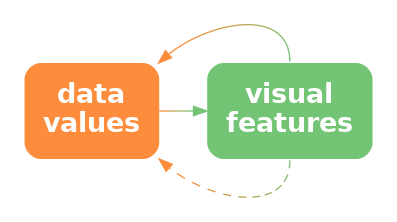
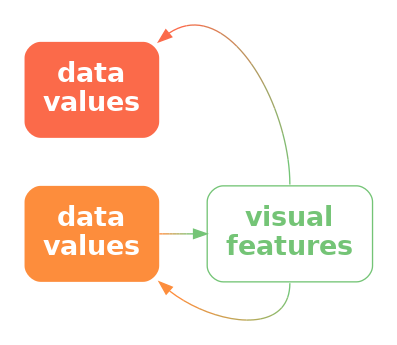

```{r}
#| echo: false
#| message: false
source("common.R")
```

# Congruent Encodings {#sec-congruence}

In previous chapters, we have seen that,
part of the reason why some well-known plots, like
bar plots, are effective is because they 
encode data values to the basic visual features of a data symbol.
For example, encoding the number of youth offenders as the 
**length** of a bar in a bar plot (@fig-bar-district).
We have also seen that basic visual features like **length**
are effective because we can accurately decode data values
from those visual features.

The purpose of this chapter is to show that,
in order to understand the effectiveness
of a data visualisation, we need to consider more
than just the accuracy or capacity of our encodings from 
data values to basic visual features.

## Implicit decodings {#sec-implicit}

@fig-line-implicit shows two lines, one longer than the other.
We can decode information from these lines without any explicit
encoding of data values.
For example, we can decode that one line is twice as long as the 
other without knowing anything about what "twice" represents
in terms of data values.
In other words, there is an **implicit decoding** from the lengths
of the lines to data values (@fig-implicit-decode).[^visual-type-callback]

[^visual-type-callback]:
    These implicit encodings are part of the reason why different visual
    features are appropriate for encoding quantitative verus
    qualitative data values.  The length of a data symbol is appropriate
    for encoding quantitative data values because we implicitly 
    decode amounts from length.

```{r}
#| echo: false
#| label: fig-line-implicit
#| fig-height: 1
#| fig-cap: We can decode the fact that one line is twice the length of another line without there having to be any explicit encoding of data values to the lengths of the two lines.
grid.newpage()
grid.circle(c(.3, .5), 2/3, unit(1, "mm"), gp=gpar(fill="black"))
grid.segments(.3, 2/3, .5, 2/3, gp=gpar(lwd=2))
grid.circle(c(.3, .7), 1/3, unit(1, "mm"), gp=gpar(fill="black"))
grid.segments(.3, 1/3, .7, 1/3, gp=gpar(lwd=2))
```

::: {#fig-implicit-decode}
::: {.content-visible when-format=pdf}
\includegraphics[scale=0.5]{Diagrams/implicit-decode.png}
:::

::: {.content-visible when-format=html}

:::

Some visual features have implicit encodings, which means that we
can decode information from the visual features without having explicitly
encoded any data values.
:::

When an implicit decoding exists,
we can produce a more effective encoding by building upon
the implicit decoding.
We can explicitly encode data values as visual features in such a way that
the decoding is **congruent** with the implicit decoding, in the sense
that the implicit decoding leads back to the same data values
that we explicitly encoded
(@fig-congruent-decode).[^congruence-lit]

[^congruence-lit]:
    @TVERSKY2002247 describe a *congruence principle*: 
    "the structure and content of the external representation 
    should correspond to the desired
    structure and content of the internal representation," where
    the "external representation" is a data visualisation and
    the "internal representation" corresponds to an implicit decoding.

    @all-scatterplots discuss measures of effectiveness beyond 
    accuracy and capacity and refers to 
    the congruence principle above as well as the idea of
    *congnitive fit*: "performance on a task will be enhanced when there is a
    cognitive fit (match) between the information emphasized in the
    representation type and that required by the task type" [@cognitive-fit].
    The latter was focused on a comparison of plots versus tables
    (plots for spatial comparisons and tables for more complex
    cognitive tasks involving symbolic reasoning),
    but it is analogous to the idea of congruent encodings.

    The idea of *cognitive affordance*,
    "the relationship between the design of an object and the 
    knowledge that is imparted upon the object's user", 
    (@cognitive-affordance) is also
    related to the idea of congruence.

::: {#fig-congruent-decode}
::: {.content-visible when-format=pdf}
\includegraphics[scale=0.5]{Diagrams/congruent-decode.png}
:::

::: {.content-visible when-format=html}

:::

If we explicitly encode data values as visual features in a way that
is consistent with an implicit decoding, we can more effectively
decode data values from visual features.
:::

## Part-to-whole {#sec-part-to-whole}

@fig-prop shows a pie chart of the proportions of total youth 
offenders between 2011 and 2021 in 
different ethnic groups and a bar plot of the same data.
We learned in @sec-accuracy that encoding
**quantitative** data values, like proportions, as **lengths**, like in the
bar plot, is more accurate than encoding the proportions as **angles**
or **areas**, like in the pie chart.

However, the superior representation of the
fact that Māori offenders make up approximately 50% of the total is
the pie chart rather than the bar plot.
Although it is easy to determine from the length of the bar and the scale 
on the x-axis in the bar plot that the bar for Māori is just below 0.5, 
it is even easier, without any guides at all, to see that the light blue
wedge in the pie chart is just under half a circle.
It is also easy to see that the red wedge is close to a third of a 
circle.[^part-to-whole]

[^part-to-whole]:
    This defence of pie charts has existed for a very long time
    [@merits-of-circles] and continues to receive empirical support
    in more recent times [@Simkin01061987].

    "The one thing that a pie chart has going for it ...
    is the fact that people immediately recognize a pie chart as
    a part-to-whole display."
    [@few2012show, p. 114]

```{r}
#| echo: false
#| label: fig-prop
#| fig.width: 4
#| fig-cap: Data visualisations of the proportion of offenders from different ethnic groups.  
#| fig-subcap:
#|   - A pie chart.
#|   - A bar plot.
#| layout-ncol: 2
ggplot(crimeGroupTotal) + 
    geom_col(aes(x=total/sum(total), y="", fill=group), colour="black") +
    coord_polar() +
    labs(title="Proportions of Youth Offenders 2011 to 2021") +
    theme(aspect.ratio=1,
          axis.title=element_blank(),
          axis.text.x=element_blank(),
          axis.ticks.y=element_blank())

gg <- ggplot(crimeGroupTotal) + 
    geom_col(aes(x=total/sum(total), y=group), colour="black") +
    scale_x_continuous(expand=expansion(c(0, .05))) +
    theme(aspect.ratio=1,
          axis.title=element_blank(),
          axis.ticks.y=element_blank())
grid.newpage()
pushViewport(viewport(height=.8, width=.8))
print(gg, newpage=FALSE)
popViewport()
```

The reason why the pie chart in @fig-prop is more effective
than a bar plot for conveying simple proportions like a quarter
or a third or a half is because 
the wedges in a pie chart have an implicit decoding to
fractions of a whole.
A semi-circle has a strong visual association with *half* of a circle
and thirds and quarters are similarly evocative.

> One reason why a pie chart can be effective is because 
  segments of a pie vividly convey simple fractions of a whole.

@fig-bar-part shows that if we place a bar representing a proportion bar 
within a reference rectangle that corresponds to a proportion of 1,
then we can also create a part-to-whole congruence with bars, though the effect
is not as strong as it is for pie wedges.

```{r}
#| echo: false
#| label: fig-bar-part
#| fig-cap: A bar plot of the proportion of offenders from different ethnic groups with reference rectangles to enhance the part-to-whole relationship.  
gg <- ggplot(crimeGroupTotal) + 
    geom_col(aes(x=1, y=group), colour="black", fill="grey80") +
    geom_col(aes(x=total/sum(total), y=group), colour="black") +
    scale_x_continuous(expand=expansion(0)) +
    theme(aspect.ratio=1,
          axis.title=element_blank(),
          axis.ticks.y=element_blank())
pushViewport(viewport(height=.8, width=.8))
print(gg, newpage=FALSE)
popViewport()
```

## More is more {#sec-more-is-more}

We saw in @sec-quant-features that 
visual features like **length** and **area** are 
appropriate for decoding quantitative values. 
For example, in @fig-more-is-more, the lengths of the bars
are appropriate for decoding the total number of offenders in 
different ethnic groups.

Part of the reason why **length** and **area** work so well is because
a **longer** bar implicitly conveys the idea of *more*.[^more-is-more]
By contrast, the **position** of data points in a dot plot of the same data,
as shown in @fig-more-is-more, do not inherently 
convey the same sense of *more*.
In a bar plot, the data symbols that correspond to larger data values
are actually larger data symbols;
the presentation of larger data values is more abstract in a dot plot.

[^more-is-more]:
    Kosslyn's Principle of Compatibility states that
    "A message is easiest to understand if its form is compatible with its 
    meaning", plus explicitly "More Is More" [@eye-and-mind].
    
    @wilke2019fundamentals has a similar Principle of Proportional Ink,
    which he attributes to @bergstrom_west_proportional_ink.
    A corollary is that bars in a bar plot should start at zero.

```{r}
#| echo: false
#| label: fig-more-is-more
#| fig.width: 4
#| fig-cap: A bar plot and a dot plot of the total number of offenders for different ethnic groups.
#| fig-subcap:
#|   - Bars.
#|   - Dots.
#| layout-ncol: 2

gg <- ggplot(crimeGroupTotal) + 
    geom_col(aes(x=total, y=group)) +
    scale_x_continuous(expand=expansion(c(0, .05))) +
    theme(aspect.ratio=1)
grid.newpage()
pushViewport(viewport(width=.9, height=.9))
print(gg, newpage=FALSE)
popViewport()

gg <- ggplot(crimeGroupTotal) + 
    geom_segment(aes(x=-Inf, xend=Inf, y=group, yend=group), 
                 linetype="dotted") +
    geom_point(aes(x=total, y=group)) +
    scale_x_continuous(name="total") +
    theme(aspect.ratio=1)
grid.newpage()
pushViewport(viewport(width=.9, height=.9))
print(gg, newpage=FALSE)
popViewport()
```

Another way that **length** can convey information more naturally than
**position** is visualising negative values.
For example @fig-neg-bar shows the total points differential
(points scored minus points conceded) for
Tier One nations at Rugby World Cups (see @tbl-rwc-all).
The *direction* of the bars very clearly indicates the change from
positive points differential to negative points differential.

```{r}
#| echo: false
#| label: fig-neg-bar
#| fig-cap: A bar plot of the total points differential for Tier One nations at Rugby World Cups.
rwcAlltime$team <- reorder(rwcAlltime$team, rwcAlltime$diff)
ggplot(rwcAlltime) +
    geom_col(aes(x=diff, y=team)) +
    scale_x_continuous(name="points differential") +
    theme(aspect.ratio=2/3)
```

By comparison, the change from positive to negative points differential
is much more abstract in a dot plot of the
same data (@fig-neg-dot).

```{r}
#| echo: false
#| label: fig-neg-dot
#| fig-cap: A dot plot of the total points differential for Tier One nations at Rugby World Cups.
ggplot(rwcAlltime) +
    geom_point(aes(x=diff, y=team)) +
    geom_segment(aes(x=-Inf, xend=Inf, y=team, yend=team), linetype="dotted") +
    annotate("segment", x=0, xend=0, y=-Inf, yend=Inf, linetype="solid") +
    scale_x_continuous(name="points differential") +
    theme(aspect.ratio=2/3)
```

> One reason why bar plots are effective is because larger data values are
  represented by larger data symbols.

A more subtle effect can be seen in @fig-bar-orientation,
which shows two different bar plots of the total number
of offenders in different ethnic groups.
In this case,
the vertical bars are more natural for conveying count data like this
because of the natural correspondence with stacks of items.[^vertical-bars]

[^vertical-bars]:
    Examples of mentions that vertical bars are preferred 
    because they are more familiar or 
    correspond naturally to increases include
    @kosslyn1994elements, @bar-orientation, and @kerns2021bar_tip_limit.

```{r}
#| echo: false
#| label: fig-bar-orientation
#| fig.width: 4
#| fig-cap: Data visualisations of the number of offenders from different ethnic groups.  
#| fig-subcap:
#|   - Horizontal bars.
#|   - Vertical bars.
#| layout-ncol: 2
ggplot(crimeGroupTotal) + 
    geom_col(aes(x=total, y=group)) +
    scale_x_continuous(expand=expansion(c(0, .05))) +
    scale_y_discrete(name=NULL) +
    force_panelsizes(rows = unit(2.5, "in"),
                     cols = unit(2.5, "in"))

temp <- crimeGroupTotal
temp$group <- gsub("/", "/\n", temp$group)
ggplot(temp) + 
    geom_col(aes(y=total, x=group)) +
    scale_x_discrete(name=NULL) +
    scale_y_continuous(expand=expansion(c(0, .05))) +
    force_panelsizes(rows = unit(2.5, "in"),
                     cols = unit(2.5, "in"))
```

## Same is same {#sec-same-same}

In @sec-differences we saw that the visual system is very
sensitive to *differences*, 
particularly when everything else remains the *same*.
This means that encoding *changes* in data values to *changes* in 
data symbols 
will be effective because the visual system will notice the differences
in the data symbols.
More specifically, if a **visual feature** of a data symbol
changes then the visual system will notice that change.
Furthermore, if a visual feature of a data symbol
changes while all other visual features of the data symbol remain the *same*,
the visual system will notice the change more easily (@sec-differences).
Put another way, visual differences are implicitly decoded as
changes in the data values *and* visual constancy is implicitly decoded as
no change in the data values.

For example, 
in a bar plot like @fig-bar, the data symbols are bars
and only the **lengths** of the bars and the vertical **positions** of
the bars are different.
The "widths" of the bars and the **colours** of the bars remain
the same.

> Another reason why bar plots are effective is because the bars
  differ in length, but are otherwise the same.

## Dissonant encodings {#sec-dissonance}

The fact that **length** and **area** implicitly convey amounts means
that care must be taken *not* to confuse that association.[^dissonant-illusion]
For example, @fig-bar-not-zero shows the number of times each team
entered the opposition's final third during a match at the 
2023 Women's World Cup.[^final-third]
The final third of the pitch is shown as darker green regions, broken
into five different zones, with a number of entries for each zone
and each team represented by a line with an arrow.

[^dissonant-illusion]:
    This is related to visual illusions (@sec-illusion).
    There are decodings that the visual system 
    performs whether we want it to or not,
    so we want to avoid conflicting with what the visual system
    does automatically.

[^final-third]:
    This data visualisation is an adaptation of a graphic shown during 
    the live television coverage of the match.

In @fig-bar-not-zero, longer lines correspond to a larger number of 
entries.  However, the bars start at the halfway line on the pitch
rather than at the final third of the pitch.
This means that the zero entries by South Africa into the second-from-right
zone is encoded as a non-zero-length line.
Apart from making comparisons of the line lengths very inaccurate,
this creates a confusing visual effect because the viewer
is expected to decode a non-zero length to a value of zero.

```{r}
#| echo: false
#| label: fig-bar-not-zero
#| fig-cap: The number of times each team entered the opposition's final third in the Women's World Cup match between the Netherlands and South Africa.
entries <- data.frame(team=rep(c("Netherlands", "South Africa"), each=5),
                      region=rep(1:5, 2),
                      count=c(10, 4, 1, 2, 3, 
                              4, 2, 2, 0, 2))
hue <- 120
grid.newpage()
pushViewport(viewport(width=.5, height=.9,
                      gp=gpar(lwd=1, fill=NA)),
             viewport(y=0, height=.75, just="bottom"))
grid.rect(gp=gpar(fill=hcl(hue, 70, 80)))
pushViewport(viewport(clip="on"))
grid.circle(y=0, r=10/80)
popViewport()
grid.rect(y=1, height=2/3, just="top", 
          gp=gpar(col=NA, fill=hcl(hue, 70, 60)))
grid.rect(y=1, height=2/3, just="top", 
          width=44/80, gp=gpar(col=NA, fill=hcl(hue, 70, 50)))
grid.rect(y=1, height=2/3, just="top", 
          width=20/80, gp=gpar(col=NA, fill=hcl(hue, 70, 40)))
## grid.rect(y=1, height=2/3, just="top")
grid.rect(y=1, height=6/50, width=20/80, just="top")
grid.rect(y=1, height=18/50, width=44/80, just="top")
pushViewport(viewport(clip=rectGrob(y=1 - 18/50, just="top")))
grid.circle(y=1 - 12/50, r=.2)
popViewport()
grid.circle(y=1 - 12/50, r=unit(1, "mm"), gp=gpar(fill="black"))
x <- unit(rep(c(9/80, 24/80, .5, 56/80, 71/80), 2), "npc") +
     unit(rep(c(-3, 3), each=5), "mm")
y <- 1/3 + (entries$count)/max(entries$count)*2/3
col <- rep(c("pink", "orange"), each=5)
grid.segments(x, 0, x, y, 
              arrow=arrow(type="closed"),
              gp=gpar(col=col, fill=col, lwd=1, 
                      linejoin="mitre", lineend="butt"))
grid.segments(x, 0, x, y - .05, 
              gp=gpar(col=col, fill=col, lwd=15, lineend="butt"))
grid.text(entries$count, x, unit(10, "mm"), gp=gpar(fontface="bold"))
grid.rect()
pushViewport(viewport(y=unit(1, "npc") + unit(10, "pt"), height=unit(20, "pt"),
                      just="bottom"))
grid.text("Final Third Entries",
          gp=gpar(fontsize=20))
popViewport()
pushViewport(viewport(y=unit(1, "npc") + unit(40, "pt"), height=unit(20, "pt"),
                      just="bottom"))
grid.rect(gp=gpar(fill=hcl(hue, 70, 40)))
grid.text(c("Netherlands", "South Africa"), 
          x=unit(0:1, "npc") + unit(c(2, -2), "mm"),
          hjust=c(0, 1),
          gp=gpar(col=c("pink", "orange"), fontface="bold"))
popViewport()
```

For any example of **congruence**, 
where a visual feature implicitly decodes to
a property of the data,
there is an opportunity for **dissonance** if the visual feature
is used inappropriately.  We can improve the effectiveness of 
a data visualisation by taking advantage of visual congruence
and we can reduce the effectiveness of a data visualisation 
if we create visual dissonance.[^dissonance]

[^dissonance]:
    The idea of visual dissonance is just a logical inversion of
    the idea of visual congruence.
    This idea is not named in any literature that I could find,
    though *semantic clashes* [@bertini_semantic_clashes] perhaps comes closest.

If we fail to make our explicit encodings 
congruent with any implicit encodings---if we create a
**dissonant** encoding---we can make it harder
and more confusing to decode a data visualisation because
there is more than one possible decoding
(@fig-dissonant-decode).


::: {#fig-dissonant-decode}
::: {.content-visible when-format=pdf}
\includegraphics[scale=0.5]{Diagrams/dissonant-decode.png}
:::

::: {.content-visible when-format=html}

:::

If we explicitly encode data values to visual features, but the
visual features have an implicit encoding to different data values,
we can cause confusion and make it harder to effectively
decode data values from visual features.
:::

We saw in @sec-same-same that we want to encode differences in data values
to differences in visual features *and* keep everything else the
same.  Failing to follow that approach will make it harder to 
perceive changes in the data values.
However, a worse error, and 
another source of visual dissonance arises if we change
visual features *without* any underlying 
change in the data values.[^kosslyn-same]

[^kosslyn-same]:
    Kosslyn's *Principle of Informative Changes*
    states that "People expect changes in properties to carry information"
    [@eye-and-mind].

@fig-listener-cakes shows a data visualisation of the relative number of 
people aged over 100 for females versus males.[^listener-cakes]
There are numerous problems with this data visualisation, but here
we will just focus on the horizontal **position** of the cake images.
The cakes for females are positioned to the left of the cakes for males,
which is acceptable because that difference in position reflects
a difference in the data---males versus females.
However, within each gender, the cakes are also staggered a small amount
to the left then to the right.
This visual difference in the cake positions does not correspond to
any difference in the data values.  We are tempted to seek meaning from the
the left-to-right staggering of the cakes when no meaning exists.

```{r}
#| echo: false
#| label: fig-listener-cakes
#| fig-cap:  A data visualisation of the number of females aged over 100 relative to the number of makes aged over 100.
#| warning: false
cake <- readPNG("Images/birthday-cake-cropped.png")
old <- data.frame(gender=c("Male", "Female"),
                  count=c(2, 5))
cakes <- function(data, coords) {
    grobTree(rasterGrob(cake, 
                        rep(coords$x, data$y + 1) + c(.05, -.05), 
                        unlist(mapply(function(x, y) {
                                          seq(0, x, length.out=y)
                                       },
                                       coords$y, data$y + 1)), 
                        just="bottom", 
                        height=.2))
}
ggplot(old) +
    geom_col(aes(x=gender, y=count), fill="transparent") +
    grid_panel(cakes, aes(x=gender, y=count - 1)) +
    scale_x_discrete(name=NULL, labels=c("Females 100+", "Males 100+")) +
    scale_y_continuous(expand=expansion(0, .05)) +
    theme(axis.title.y=element_blank(),
          axis.text.y=element_blank(),
          axis.ticks.y=element_blank(),
          panel.grid.major.y=element_line(linewidth=.5),
          aspect.ratio=1) +
    labs(title="For every five females age 100+,\nthere are two males aged 100+")
```

[^listener-cakes]:
  This plot is based on a data visualisation from the New Zealand Listener 
  October 14-20 2023.

> A data visualisation is *not* effective if it contains encodings
  that are dissonant because that can cause distraction and slower and/or
  incorrect **decoding** of data values from visual features.

## Case study:  Time's arrow

@fig-bar-order shows the results of a 2025 poll that asked what was the best
thing that the Trump
administration had done, comparing results in February to results in
September.
In terms of encodings, this bar plot makes good use of (vertical) **position** 
and (horizontal) **length** to encode different policy issues, the
difference in dates, and the percent of respondents who voted for
each policy.
However, when we look at the top two bars, there is a temptation
to read the pairs of bars in order from top to bottom.[^bar-order]
If we do not attend carefully to the legend, we may perceive a
*decrease* in the (relative) popularity of the immigration policy and
an *increase* in the popularity of DOGE.
This is a subtle example of visual dissonance.

[^bar-order]:
    The idea for this data visualisation, and whether to question the
    vertical ordering, comes from a 
    [PolicyViz Newsletter](https://jschwabish.substack.com/p/when-time-gets-flipped-rethinking).
    The original data source was a
    [Washington Post poll](https://www.washingtonpost.com/politics/interactive/2025/trump-best-worst-policies-positions-poll/)).

```{r}
#| echo: false
#| label: fig-bar-order
#| fig-cap: Bar plot of most popular Trump policies over time.
poll <- data.frame(percent=c(55, 39, 7, 30, 5, 2, 5, 2, 4, 2),
                   date=rep(c("September", "February"), 5),
                   policy=rep(c("Immigration", "Government cuts/Musk/DOGE", 
                                "International relations", 
                                "Trump's personality/conduct",
                                "Tariffs"), each=2))
poll$policy <- reorder(poll$policy, poll$percent)
levels(poll$policy) <- gsub(" ", "\n", levels(poll$policy))
ggplot(poll) +
    geom_col(aes(x=percent, y=policy, fill=date), position="dodge",
             width=.6) +
    annotate("segment", x=0, y=-Inf, xend=0, yend=Inf) +
    scale_x_continuous(position="top", breaks=seq(0, 50, 10),
                       expand=expansion(c(0, .05)), 
                       labels=function(x) paste0(x, "%"),
                       name=NULL) +
    scale_y_discrete(name=NULL) +
    scale_fill_discrete(name=NULL) +
    theme(legend.position="top",
          legend.location="plot",
          legend.justification=0,
          axis.ticks=element_blank(),
          panel.grid.major.x=element_line(colour="grey80"),
          aspect.ratio=2/3)
```

@fig-bar-order-vert shows another version of the bar plot, with the bars
running vertically. In this plot, the natural reading from left to right
leads to the correct interpretation:  the (relative) popularity of DOGE 
has declined while the popularity of the immigration policy has increased.
This is an example of visual congruence.


```{r}
#| echo: false
#| label: fig-bar-order-vert
#| fig-cap: Bar plot of most popular Trump policies over time.
ggplot(poll) +
    geom_col(aes(x=policy, y=percent, fill=date), position="dodge",
             width=.6) +
    annotate("segment", y=0, x=-Inf, yend=0, xend=Inf) +
    scale_y_continuous(position="left", breaks=seq(0, 50, 10),
                       expand=expansion(c(0, .05)), 
                       labels=function(x) paste0(x, "%"),
                       name=NULL) +
    scale_x_discrete(name=NULL) +
    scale_fill_discrete(name=NULL) +
    theme(legend.position="top",
          legend.location="plot",
          legend.justification=0,
          axis.ticks=element_blank(),
          panel.grid.major.y=element_line(colour="grey80"),
          aspect.ratio=2/3)
```

## Case study: Jittering {#sec-jitter}

We have data on the 
the number of points that were scored in every World Cup match
by Tier One nations (the top 10 rugby-playing nations).
@tbl-rwc-all shows a sample of these data.

@fig-jitter shows a dot plot of the number of points scored 
by teams from different hemispheres at Rugby World Cup matches.
In this data visualisation, the data symbols are dots,
the number of points scored is encoded as the horizontal **position** of
the dots, and the hemisphere is encoded as the vertical **position**
of the dots.
We saw a similar visualisation of these data in @fig-overplot,
which demonstrated the problem of overplotting of points
that share the same data value.

In @fig-jitter,
to ameliorate the overlapping of data points, a random amount of "jitter"
has been
added the vertical position
of the dots.  The filled interior of each dot is also semitransparent
so that we can see where some points still overlap.

```{r}
#| echo: false
#| label: fig-jitter
#| fig-cap: The number of points scored in Rugby World Cup games by teams from the northern and southern hemispheres.
ggplot(rwcAll) +
    geom_jitter(aes(x=scored, y=hemisphere), height=.2, width=0, alpha=.5) +
    scale_x_continuous(name="points scored")
```

The dot plot in @fig-jitter is effective for **decoding** to 
the number of points scored because each data value is encoded as the
horizontal position of a single data symbol.
Similarly, we can easily decode the hemisphere from each point.
The proximity of the data symbols from the same hemisphere means
that it is easy to perceive two "rows" of points (@sec-visual-model-groups).

On the other hand, the jittering means that there are visual differences
between the vertical positions of the dots, within the same hemisphere,
that do not correspond to
any differences in data values.  For example, there are two dots representing
matches where a team from the Northern hemisphere scored zero points.
The data values for these two dots are identical (zero points scored and
northern hemisphere), but they are visually different.
The randomness of the jittering may help to dilute any temptation
to seek meaning from the artificial visual difference, but the
addition of jittering is a potential source of confusion.

> Jittering data symbols is effective because it reduces the amount of overlap
  amongst data
  symbols, but jittering may also 
  reduce the effectiveness of a data visualisation because it introduces
  visual dissonance.

## Summary

::: {.content-visible when-format=html}

::: {.oldsummary .callout-note title='Précis *(click to expand/contract)*' icon=false collapse=true}
  












:::

:::



---

```{=latex}
\theendnotes
```
