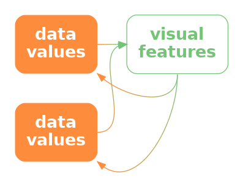

```{r}
#| echo: false
#| message: false
source("common.R")
```

# Encoding Composition {#sec-design}

@fig-yji shows a line plot of the rate of youth crime in New Zealand
for different ethnic groups
and a pie chart showing the proportions of different types of crime.[^yji]
There is a problem with this figure because 
the line plot and the pie chart share the same colour palette
even though they are visualising different variables (ethnicity
and crime type).
For example, the ethnic group European/Other is encoded as 
the orange colour of a line *and* the crime type Theft is also
encoded as an
orange colour, in this case the colour of a wedge.

[^yji]:        
    This data visualisation was 
    inspired by figures from the 
    [Youth Justice Indicators Report from 2021](https://www.justice.govt.nz/justice-sector-policy/research-data/justice-statistics/youth-justice-indicators/).

```{r}
#| echo: false
#| label: fig-yji
#| fig-cap: A line plot of number of offenders over time for different ethnic groups, plus a pie chart of the proportions of different types of crime.  Although each plot contains sensible encodings by itself, the overall figure is confusing because the same colours are used to encode different values in the different plots.
youthCols <- c("#bf0000", "#2b4689", "#e1b728", "#8fbb22",
               "#0087c0", "#bdaa7c", "#f15a22")
youthCols <- pal_npg()(7)
gg1 <- ggplot(subset(crimeGroup, group != "Unknown")) +
    geom_line(aes(year, rate, colour=group)) +
    scale_colour_manual(values=youthCols[1:3]) +
    crimeAgeLineTitle +
    theme(axis.title=element_blank(),
          legend.justification="left",
          legend.margin=margin(),
          legend.title=element_blank(),
          legend.position="top")
typeTotal <- subset(crimeTypeTotal, prop > .04)
typeTotal$type <- reorder(typeTotal$type, typeTotal$prop,
                          decreasing=TRUE)
levels(typeTotal$type) <- c(levels(typeTotal$type), "Other")
typeTotal <- rbind(typeTotal, 
                   data.frame(type="Other", total=NA,
                              prop=sum(subset(crimeTypeTotal, 
                                              prop <= .04)$prop)))
gg2 <- ggplot(typeTotal) +
    geom_col(aes(x=prop, y="", fill=type), colour=figbg) +
    scale_fill_manual(values=youthCols, 
                      guide=guide_legend(position="top", ncol=1)) +
    coord_polar(direction=-1) +
    theme_void() +
    theme(plot.margin=margin(4, 0, 0, 0, "pt"),
          legend.justification="centre",
          legend.margin=margin(),
          legend.title=element_blank(),
          legend.key.size=unit(2, "mm"))
grid.newpage()
pushViewport(viewport(layout=grid.layout(1, 2, widths=2:1)))
pushViewport(viewport(layout.pos.col=1))
print(gg1, newpage=FALSE)
popViewport()
pushViewport(viewport(layout.pos.col=2))
print(gg2, newpage=FALSE)
popViewport()
```

The conflicting encodings in @fig-yji
create a confusing data visualisation because the same visual feature
decodes to multiple data values (@fig-conflict-decode).
The colour orange decodes to *both* Eurpean/Other and Theft.
There is nothing invalid with the encodings in the line plot by itself
or with the encodings in the pie chart by itself, but the overall combination of
elements within @fig-yji is ineffective.

::: {#fig-conflict-decode}
::: {.content-visible when-format=pdf}
\includegraphics[scale=0.5]{Diagrams/conflict-decode.png}
:::

::: {.content-visible when-format=html}

:::

If we encode more than one data value to the same visual feature, it is unclear
which is the correct decoding.
:::

The problem in @fig-yji involves the coordination, or lack thereof,
between multiple elements of a data visualisation.
In this chapter we look at the arrangement and coordination
of the elements
of a data visualisation.[^CRAP-design]

[^CRAP-design]:
    We might describe the topic of this chapter as the overall
    *design* of a data visualisation.
    Much of what we discuss will have a basis in the properties
    of the visual system, but much will also echo the
    basic design principles espoused in Robin Willams'
    CRAP design principles [@williams2014nondesigners].

## Encoding structure {#sec-map-org}

@fig-rep-guide shows a scatter plot of the number of clean breaks and the
number of tries for countries
at the 2023 Rugby World Cup (@tbl-rwc-2023).
This data visualisation is similar to @fig-scatter, but with an
additional encoding of the hemisphere for each country as the colour
of the data points.

The legend in @fig-rep-guide encodes the colour
encoding:  which colour is used to encode each hemisphere (@sec-guides).
In @sec-guides, we described how the proximity of the labels "South"
and "North" to the coloured points in the legend allow us to
associate the colours with the different hemispheres and
the different values of hemisphere are encoded as the vertical
positions of the points and the text labels in the legend;
both the orange point and the label "South" have the same
vertical position.
 
```{r}
#| echo: false
#| label: fig-rep-guide
#| fig-cap: A scatter plot of the number of times a team breaks through the opposition defence and the number of tries that a team scores (both are per-game averages) for teams at the 2023 Rugby World Cup.
repcols <- pal_npg()(4)
gg <- ggplot(RWCperGame) +
    geom_point(aes(breaks, tries, colour=sphere)) +
    scale_colour_manual(values=repcols[c(1, 3)], name="hemisphere",
                        guide=guide_legend(reverse=TRUE)) +
    scale_x_continuous(name="clean breaks") +
    scale_y_continuous(name="tries scored") +
    theme(aspect.ratio=1,
          legend.key.size=unit(2, "mm"),
          legend.key.spacing.y=unit(2, "mm"))
grid.newpage()
pushViewport(viewport(height=.8))
print(gg, newpage=FALSE)
popViewport()
```

What about the horizontal position of the points and the text in
the legend?  These do not encode hemisphere values because they
are the same for both North and South.
What about the position of the legend title, the text "hemisphere"?

All of the elements of the legend are positioned together
and to the right of the main plot.
Their proximity to each other (and separation from
the main plot) mean that we see the legend as a separate
group (@sec-visual-model-groups).
This creates a visual organisation for the plot, which helps
the viewer to navigate and comprehend the different elements
of the plot.[^cog-load-theory]
This is analogous to reading a body of text, which is split into
paragraphs and sections with headings to help the reader
navigate the text.

[^cog-load-theory]:
    @cog-load report that 
    "if a learner found a visualization more readable, 
    they felt it required less
    mental effort to parse relevant information from it for learning."

One way to express this arrangement of the legend 
is that the **position** of the elements of the legend 
**encode** the **structure** of the overall data visualisation
(@fig-org-vis-decode).
Our visual system **decodes** the legend as a separate element
based on the proximity of the text and points in the legend.

::: {#fig-org-vis-decode}
::: {.content-visible when-format=pdf}
\includegraphics[scale=0.5]{Diagrams/conflict-decode.png}
:::

::: {.content-visible when-format=html}

:::

We can encode the structure of a data visualisation as position
so that elements that are part of the same structure are close to each other.

:::

One way in which a data visualisation can be effective is if it
provides information about
how to read the plot as a whole
as well as information about the data values.

Another way to think about it
is that each element of the data visualisation in 
@fig-rep-guide belongs to one of two groups:  the main plot or the legend.
There is a **qualitative** value---plot or legend---associated with
each element of the data visualisation.
These qualitative values are encoded as the **position** of the elements
within the data visualisation:  the plot is on the left 
and the legend is on the right.

Although we are no longer talking about encoding data values as
data symbols, we are still talking about encoding.
We are just encoding and decoding a different sort of information---the
structure or organisation of a data visualisation.

@fig-align shows a variation of @fig-rep-guide, with exactly 
the same plot elements, but in a slightly different arrangement.
There is greater separation of the legend from the main
plot.
The legend has also been moved so that its top is aligned
with the top of the main plot.
Similarly, the axis titles have been moved so that they
align with the top and right sides of the plot, and the
y-axis label has been rotated to horizontal.
More subtly, the right edge of the y-axis label is
aligned with the right edge of the y-axis tick labels
and the points in the legend are aligned with the left
edge of the legend title.

```{r}
#| echo: false
#| label: fig-align
#| fig-cap: A scatter plot of the number of times a team breaks through the opposition defence and the number of tries that a team scores (both are per-game averages) for teams at the 2023 Rugby World Cup.
#| fig-keep: last
repcols <- pal_npg()(10)[c(1, 2, 3, 9)]
gg <- ggplot(RWCperGame) +
    geom_point(aes(breaks, tries, colour=sphere)) +
    scale_colour_manual(values=repcols[c(1, 3)], name="hemisphere",
                        guide=guide_legend(reverse=TRUE)) +
    scale_x_continuous(name="clean breaks") +
    scale_y_continuous(name="tries scored") +
    theme(aspect.ratio=1,
          axis.title.x=element_text(hjust=1),
          axis.title.y=element_text(angle=0),
          legend.justification="top",
          legend.margin=margin(0, 10, 10, 40, "pt"),
          legend.key.size=unit(2, "mm"),
          legend.key.spacing.y=unit(2, "mm"))
pushViewport(viewport(height=.8))
print(gg, newpage=FALSE)
popViewport()
grid.force()
tickLabel <- grid.get("axis.1-3-1-3::titleGrob::text", grep=TRUE)
grid.edit("ylab::title::text", grep=TRUE,
          x=unit(1, "npc") + grobWidth(tickLabel), hjust=1)
```

All of these changes are aimed at making the data visualisation 
more orderly (@sec-simplicity).[^alignment]
The legend is more obviously a separate element
from the main plot and the axis titles more obviously 
connect to the main plot.
A more orderly arrangement of the visual elements 
will provide fewer distractions and lead to 
a more effective data visualisation 
because the important differences in the data
will be more readily perceived (@sec-differences).

[^alignment]:
    *Alignment* is also one of the CRAP design principles 
    [@williams2014nondesigners].

The strong alignment and regular patterns within facetted plots like
@fig-facet-after are another effective example of keeping everything else
the same in order to champion the changes in the data.
Conversely, another weakness of placing data symbols on maps, like in
@fig-map-alt-2,
is that the lack of regular positioning and alignment 
makes it harder to attend to the important differences between data symbols.

## Unintentional encodings {#sec-unintentional}

One important idea in this chapter is that we can encode more than just
data values or data summaries as visual representations.
For example, the previous section showed that we can encode different groups
of elements within a data visualisation using **position**---elements
that are positioned close together and/or aligned with each other
form visual groups.

Another way to say this is that we can decode the 
differences in the positions of different
elements to identify distinct groups of elements.

Yet another way to say this is that we can decode visual differences
regardless of whether they reflect differences in data values.

In other words, all visual differences in a data visualisation matter.

For example, consider the x-axis title 
in @fig-rep-guide. Although it has a similar horizontal position to the
rest of the x-axis, it has a unique vertical position within the 
data visualisation.  Similarly, the horizontal position of the y-axis title
is unique, as are the horizontal and vertical positions of the legend.
Because these positions are unique, we are tempted to decode
those differences---we seek the information that is encoded in those
differences.
Put simply, the unique positions of certain elements of the plot
make the data visualisation more complex.

@fig-align is a more orderly version of @fig-rep-guide and,
as a consequence, there are fewer visual differences,
so there is less to decode.  The data visualisation is less complex.

Although we may notice the differences 
in the unique placement of axis titles 
in @fig-rep-guide
and therefore attempt to
decode information from them,
the differences do not *deliberately* encode information.
These differences are **unintentional encodings**.

@fig-text-angle provides another simple example of unintentional
encoding.
In this bar plot there are text labels at different angles---the y-axis
title is rotated 90 degrees and the x-axis tick labels are rotated 45 degrees, 
but these differences in angle do not reflect any differences in the data.
Keeping all text in a data visualisation
horizontal, as in @fig-align, removes this source of distraction.

@fig-smoking shows a more problematic example.[^listener-smoking]
This bar plot shows the number of ex-smokers in New Zealand over time,
with each bar resembling a cigarette that is slowly burning down
(the grey area represents ash at the end of the cigarette).
The number of ex-smokers is encoded as the full height of each bar,
so we can decode the number of ex-smokers.
However, the grey area and the white area on each bar also changes
each year and those changes are not associated with any data value.
In other words, there are differences that we decode as a change
in something, but nothing is really changing.
This is at best confusing and could even lead to misinterpretation.[^bonus]

[^listener-smoking]: 
    @fig-smoking was inspired by
    a data visualisation in the New Zealand Listener
    January 11-17 2025.

[^bonus]:
    There is a connection between *unintentional encodings* and
    *chart junk* (@sec-junk).

    @fig-smoking also contains a little easter-egg bonus problem:
    the x-axis is uneven, with a 7-year jump followed by
    two five-year jumps.

```{r}
#| echo: false
#| label: fig-smoking
#| fig-cap: A bar plot of the number of ex-smokers in New Zealand over time.
smokers <- data.frame(year=factor(c(2006, 2013, 2018, 2023)),
                      count=c(637293, 702012, 832104, 1012422),
                      stub=100000,
                      white=5:2*100000)
ggplot(smokers) +
    scale_y_continuous(limits=c(0, NA), expand=expansion(c(0, .05))) +
    geom_col(aes(year, count), fill="grey40", colour="grey40", width=.4) +
    geom_col(aes(year, white), fill="whitesmoke", colour="grey40", width=.4) +
    geom_col(aes(year, stub), fill="#efa033", colour="grey40", width=.4) +
    xlab(NULL) +
    ylab(NULL) +
    ggtitle("Number of ex-smokers in New Zealand") +
    theme(aspect.ratio=1)
```

A choropleth map like @fig-map provides a more subtle example of an
unintentional encoding.  Each region in the choropleth map is different 
in multiple ways.
Each region has its own colour, which reflects 
the data values that are explicitly encoded and allows a decoding
of the crime rate for each region.
Each region also has its own position and shape, which reflect 
the geography of the physical world and allow a decoding of the
region itself.
However, each region also has its own size, which again reflects the geography
of the physical world, but is less useful for decoding the region itself
and permits an *unintentional* decoding of larger data values from
larger regions.  That is either a problem if it incorrectly
confuses the decoding of crime rate from the colour of each region
or it is a problem if it provides a distracting decoding of region size.

## Consistent encodings {#sec-repetition}

In @fig-rep-guide, the legend explains the encoding of the different
hemispheres, North versus South, as different colours.
This is achieved by drawing coloured data points in the legend
just like the data points in the main plot, plus, crucially, 
using the same encoding in the main plot and in the legend.
The green dots in the main plot correspond to North and the
green dot in the legend corresponds to North.
The encoding in the main plot is **consistent** with the
encoding in the legend.[^CRAP-rep]

[^CRAP-rep]:
    A consistent encoding aligns with 
    the CRAP design principle of *repetition*
    [@williams2014nondesigners].

Although it may seem obvious to have a consistent encoding
of colour in both the main plot and the legend, 
@fig-rep-double demonstrates that we can harness consistent
encodings to actually improve upon the original @fig-rep-guide.
In @fig-rep-double, the encoding of hemisphere as the colour of points
is not only consistent between the main plot and the legend,
but it has been extended to the colour of the legend text as well.
The visual grouping of elements that relate to the same hemisphere
is now stronger both within the legend and across the entire data visualisation
(@sec-visual-model-groups).

```{r}
#| echo: false
#| label: fig-rep-double
#| fig-cap: A scatter plot of the number of times a team breaks through the opposition defence and the number of tries that a team scores (both are per-game averages) for teams at the 2023 Rugby World Cup.
#| fig-keep: last
gg <- ggplot(RWCperGame) +
    geom_point(aes(breaks, tries, colour=sphere)) +
    scale_colour_manual(values=repcols[c(1, 3)], name="hemisphere",
                        guide=guide_legend(reverse=TRUE)) +
    scale_x_continuous(name="clean breaks") +
    scale_y_continuous(name="tries scored") +
    theme(aspect.ratio=1,
          legend.key.size=unit(2, "mm"),
          legend.key.spacing.y=unit(2, "mm"))
grid.newpage()
pushViewport(viewport(height=.8))
print(gg, newpage=FALSE)
popViewport()
grid.force()
keyText <- grid.grep("label::text", grep=TRUE, global=TRUE)
grid.edit(keyText[[1]], gp=gpar(col=repcols[3], fontface="bold"))
grid.edit(keyText[[2]], gp=gpar(col=repcols[1], fontface="bold"))
```

Another consistency in @fig-rep-double (and the original @fig-rep-guide)
is the use of the same data symbol in both the main plot and the legend.
Circular data symbols are used in both cases.
That consistency, like the use of consistent colours, 
might again appear obvious, but it is not always true.
For example, the data symbols in @fig-corr-mat
are circles, but the legend is a rectangular colour gradient.

@fig-corr-mat shows a correlation matrix 
of seven performance measures
for teams in the 2023 Rugby World Cup (@tbl-rwc-2023).
Variable names are encoded as the horizontal and vertical positions
of circles and the correlations between variables are encoded as the
colours of the circles.
We can see that many measures have quite a strong positive correlation
(dark red circles), but one measure (the number of tackles per game)
is negatively correlated with all other measures (though often only very
weakly).

```{r}
#| echo: false
#| label: fig-corr-mat
#| fig-keep: last
#| fig-cap: Correlations between pairs of measures of performance for teams in the 2023 Rugby World Cup.
corr <- pair_cor(RWCperGame[-(1:4)])
gg <- plot(corr) + 
    theme(panel.background=element_blank())
grid.newpage()
pushViewport(viewport(height=.9))
print(gg, newpage=FALSE)
popViewport()
grid.force()
grid.edit("polygon", gp=gpar(col="black"), grep=TRUE, global=TRUE)
## Clean up circles
polygons <- grid.grep("polygon", grep=TRUE, global=TRUE)
for (i in seq_along(polygons)) {
        temp <- grid.get(polygons[[i]])
        remove <- which(as.numeric(temp$x) == .5)
        grid.edit(polygons[[i]],
                  x=temp$x[-remove],
                  y=temp$y[-remove],
                  id=NULL, redraw=FALSE)
}
grid.refresh()
```

@fig-corr-mat-legend shows a variation of @fig-corr-mat with 
a legend that not only shares the same colour encoding, but
also shares the same data symbol.
It is much easier to compare the colour of one of the data symbol circles
in the main plot
with the colours of the circles in the legend because they are all circles.

```{r}
#| echo: false
#| label: fig-corr-mat-legend
#| fig-keep: last
#| fig-cap: Correlations between pairs of measures of performance for teams in the 2023 Rugby World Cup.
corr <- pair_cor(RWCperGame[-(1:4)], pal="Blue-Red 3")
gg <- plot(corr) +
    theme(panel.background=element_blank(),
          legend.position="none")
grid.newpage()
pushViewport(viewport(height=.9))
pushViewport(viewport(y=1/8, height=7/8, 
                      width=unit(7/8, "snpc"), just="bottom"))
print(gg, newpage=FALSE)
grid.force()
grid.edit("polygon", gp=gpar(col="black"), grep=TRUE, global=TRUE)
## Clean up circles
polygons <- grid.grep("polygon", grep=TRUE, global=TRUE)
for (i in seq_along(polygons)) {
        temp <- grid.get(polygons[[i]])
        remove <- which(as.numeric(temp$x) == .5)
        grid.edit(polygons[[i]],
                  x=temp$x[-remove],
                  y=temp$y[-remove],
                  id=NULL, redraw=FALSE)
}
grid.refresh()
grid.rect(gp=gpar(fill=NA))
pushViewport(viewport(y=0, height=(1/8)/(7/8), just="top", width=1,
                      layout=grid.layout(1, 7)))
cols <- hcl.colors(7, "Blue-Red 3")
textlab <- round(seq(-1, 1, length.out=7), 2)
textcols <- rep(c("white", "black", "white"), c(2, 3, 2))
for (i in 1:7) {
    pushViewport(viewport(layout.pos.col=i))
    grid.circle(r=.4, gp=gpar(col="black", fill=cols[i]))
    grid.text(textlab[i],
              gp=gpar(col=textcols[i],
                      fontsize=10))
    popViewport()
}
popViewport(2)
```

Figures @fig-pie-order and @fig-pie-repeat are other examples of this
consistent encoding between legends and the main plot.
The legends in those cases are drawn so that they mirror the
*positions* of the bars in the main plot as well as the 
colours of the bars in the main plot.

## Inconsistent encodings

@fig-trump-bill shows a bar plot of the impact of a proposed tax
bill during the second Trump administration.[^trump-bill]
Each bar represents the predicted 
change in annual income for a particular income bracket.
Lower incomes are to the left and higher incomes are to the right.
There are labels to describe each income bracket and there are
labels that describe each change in income.
Where the change in income is large, the label for change in income
is written within the bar (at the top of the bar), but for smaller
changes in income, the bar is too small to fit the label, so the
label is placed just above the bar.
For the two leftmost bars, the change in income is actually negative
and the change in income label is placed *below* the bar.
The labels that describe the income brackets are mostly below the
bars, but for the two leftmost bars the labels for the income brackets
are placed above the bars.

[^trump-bill]:
    This data visualisation was inspired by a plot from the 
    [Popular Information](https://popular.info/p/the-ugly-truth-about-trumps-big-beautiful)
    web site by Judd Legum.
    The data are from the 
    [Penn Wharton Budget Model](https://budgetmodel.wharton.upenn.edu/estimates/2025/5/16/distributional-effects-of-house-budget-reconciliation-as-of-thursday-may-15).

```{r}
#| echo: false
#| label: fig-trump-bill
#| fig-cap: A bar plot of the distributional effects of Trump's "Big, Beautiful Bill".
bill <- read.csv("Data/trump-bill.csv")
bill$Income.group <- factor(bill$Income.group,
                            levels=bill$Income.group)
bill$amountLabel <- c("-1K", "-705", "845", "3.2K", "6.1K",
                      "8.8K", "20K", "44.4K", "389.3K")
bill$groupLabel <- gsub(" [(]", "\n(", 
                        gsub("K to ", "K-", bill$Income.group))

ggplot(bill) +
    geom_col(aes(Income.group,
                 Average.change.in.after.tax.and.transfer.income),
             fill=c(rep("lightblue", 8), 4)) +
    geom_text(aes(Income.group,
                  Average.change.in.after.tax.and.transfer.income,
                  label=amountLabel),
              vjust=c(rep(2, 2), rep(-.5, 5), rep(1.5, 2)),
              colour=c(rep("black", 8), "white"),
              fontface=c(rep("bold", 2), rep("plain", 6), "bold")) +
    geom_text(aes(Income.group,
                  0,
                  label=groupLabel),
              lineheight=1,
              size=3,
              vjust=c(rep(-.5, 2), rep(1.5, 7)),
              fontface=c(rep("bold", 2), rep("plain", 6), "bold")) +
    scale_y_continuous(expand=expansion(c(0, .05)),
                       breaks=1000*seq(100, 300, 100), 
                       labels=paste0(seq(100, 300, 100), "K")) +
    scale_x_discrete(label=bill$groupLabel) +
    coord_cartesian(clip="off") +
    ylab(NULL) +
    xlab(NULL) +
    ggtitle("Dollar change in after-tax income in 2026, by income level") +
    theme(panel.border=element_blank(),
          panel.grid.major.y=element_line(colour="grey"),
          axis.ticks=element_blank(),
          axis.text.x=element_text(colour=NA))
```

In summary, there are two labels for each bar, one below the bar and one
above (or at the top of) the bar.
This consistent positioning of the labels encourages the viewer
to decode two groups of labels:  one group above the bars and one 
group below the bars.
However, this will mislead us into comparing, for example, "-1K" (a change
in income) for the
leftmost bar with
"4.3M" (an income bracket) for the rightmost bar.
The correct comparison
is between "-1K", which is
the change in for the lowest income bracket, and "389.3K", which
is the change in income for the highest income bracket.[^TMR]

[^TMR]:
  This is precisely the mistake that was made when this data visualisation
  was discussed on 
  [The Majority Report (~6:00)](https://www.youtube.com/watch?v=AQiukyzB6x0).  

Just as it makes no sense to change the encoding of data values
within a data visualisation or across multiple
data visualisations within the same document (@fig-yji),
it makes no sense to change the encoding of *structure* within a
data visualisation.
In this case, all labels above the bars should belong to the
same group of labels (changes in income) 
and all labels below the bars should belong to the same group
of labels (income brackets).

## Encoding importance

@fig-contrast shows a variation on @fig-rep-double
with many elements of the plot drawn in light grey.
The effect of this change is to create two visual groups,
one lighter and less saturated than the other.
This emphasises the main data symbols in the main plot and in the
legend, and de-emphasises the axes and labels.
Our attention is drawn to the darker and more saturated
elements first (@sec-attention), with the other elements in the background,
which we can focus on if we need the additional information.[^contrast]

[^contrast]: 
    The idea of making a clear visual distinction between
    different elements of a data visualisation mirrors
    the CRAP design principle of *contrast*
    [@williams2014nondesigners].

```{r}
#| echo: false
#| label: fig-contrast
#| fig-cap: A scatter plot of the number of times a team breaks through the opposition defence and the number of tries that a team scores (both are per-game averages) for teams at the 2023 Rugby World Cup.
#| fig-keep: last
subtle <- "grey"
gg <- ggplot(RWCperGame) +
    geom_point(aes(breaks, tries, colour=sphere)) +
    scale_colour_manual(values=repcols[c(1, 3)], name="hemisphere",
                        guide=guide_legend(reverse=TRUE)) +
    scale_x_continuous(name="clean breaks") +
    scale_y_continuous(name="tries scored") +
    theme(aspect.ratio=1,
          legend.key.size=unit(2, "mm"),
          legend.key.spacing.y=unit(2, "mm"),
          panel.border=element_rect(colour=subtle, fill=NA),
          axis.title=element_text(colour=subtle),
          axis.text=element_text(colour=subtle),
          axis.ticks=element_line(colour=subtle),
          legend.title=element_text(colour=subtle))
pushViewport(viewport(height=.8))
print(gg, newpage=FALSE)
popViewport()
grid.force()
keyText <- grid.grep("label::text", grep=TRUE, global=TRUE)
grid.edit(keyText[[1]], gp=gpar(col=repcols[3], fontface="bold"))
grid.edit(keyText[[2]], gp=gpar(col=repcols[1], fontface="bold"))
```

By comparison, in @fig-rep-double there is a similar visual impact
from all elements of the plot, so it is less clear where to look first.
All of the elements of the data visualisation compete for our 
attention.  @fig-distract emphasises this point by making all axis and
legend text black and adding black grid lines.  The data symbols are
now lost amongst the non-data elements of the plot.[^data-ink-ratio]

[^data-ink-ratio]:
    This is like a more subtle for of Tukey's *data-ink ratio*
    [@tufte1983visual].  Instead of removing any drawing that we do
    not want to distract the viewer, we make less important information
    less visible.

```{r}
#| echo: false
#| label: fig-distract
#| fig-cap: A scatter plot of the number of times a team breaks through the opposition defence and the number of tries that a team scores (both are per-game averages) for teams at the 2023 Rugby World Cup.
gg <- ggplot(RWCperGame) +
    geom_point(aes(breaks, tries, colour=sphere)) +
    scale_colour_manual(values=repcols[c(1, 3)], name="hemisphere",
                        guide=guide_legend(reverse=TRUE)) +
    scale_x_continuous(name="clean breaks") +
    scale_y_continuous(name="tries scored") +
    theme(aspect.ratio=1,
          panel.border=element_rect(colour="black", linewidth=1),
          panel.grid.major=element_line(colour="black"),
          panel.grid.minor=element_line(colour="black"),
          axis.text=element_text(colour="black"))
grid.newpage()
pushViewport(viewport(height=.8))
print(gg, newpage=FALSE)
popViewport()
```

The use of colour in @fig-contrast
is another example of encoding (qualitative) *non-data values* as visual 
features.
In this case, we are encoding the **importance** of different
visual elements as visual features
(@fig-imp-vis-decode).
We decode the differences in colour to a group of more important elements
and a group of less important elements.

::: {#fig-imp-vis-decode}
::: {.content-visible when-format=pdf}
\includegraphics[scale=0.5]{Diagrams/imp-vis-decode.png}
:::

::: {.content-visible when-format=html}

:::

We can encode the importance of elements within a data visualisation as 
visual features 
so that elements that are more important are more visible.
:::

@fig-highlight shows a similar application of importance.
In this case, we are highlighting two data points (New Zealand
and South Africa).
The distinct colour and larger size of the two points encodes the 
importance of those points and
draws attention to those points, with the other data points 
de-emphasised.

```{r}
#| echo: false
#| label: fig-highlight
#| fig-cap: A scatter plot of the number of times a team breaks through the opposition defence and the number of tries that a team scores (both are per-game averages) for teams at the 2023 Rugby World Cup.
#| fig-keep: last
dimcols <- lighten(repcols[c(1, 3)], 0)
gg <- ggplot(RWCperGame) +
    geom_point(aes(breaks, tries, colour=sphere), shape=1,
               data=subset(RWCperGame, 
                           !country %in% c("New Zealand", "South Africa"))) +
    geom_point(aes(breaks, tries), colour=repcols[1], size=3,
               data=subset(RWCperGame, 
                           country %in% c("New Zealand", "South Africa"))) +
    geom_text(aes(breaks, tries, label=country), hjust=1.15,
              fontface="bold", colour=repcols[1], size=3,
              data=subset(RWCperGame, 
                          country %in% c("New Zealand", "South Africa"))) +
    scale_colour_manual(values=dimcols, name="hemisphere",
                        guide=guide_legend(reverse=TRUE)) +
    scale_x_continuous(name="clean breaks") +
    scale_y_continuous(name="tries scored") +
    theme(aspect.ratio=1,
          panel.border=element_rect(colour=subtle, fill=NA),
          axis.title=element_text(colour=subtle),
          axis.text=element_text(colour=subtle),
          axis.ticks=element_line(colour=subtle),
          legend.title=element_text(colour=subtle))
pushViewport(viewport(height=.8))
print(gg, newpage=FALSE)
popViewport()
grid.force()
keyText <- grid.grep("label::text", grep=TRUE, global=TRUE)
grid.edit(keyText[[1]], gp=gpar(col=dimcols[2], fontface="bold"))
grid.edit(keyText[[2]], gp=gpar(col=dimcols[1], fontface="bold"))
```

## Unimportant encodings

When we encode importance, we are relying on basic properties of the
visual system to draw attention to specific elements of a plot
(@sec-attention).
As we saw in @sec-illusion, those basic properties of the visual
system can also work against us.
Our attention will be drawn to large and bright elements of a data
visualisation automatically.
For example, in @fig-tiger, our eye is drawn to the tiger's eye,
which distracts us from the more important heights of the
bars.  There are clear overlaps here with the ideas of clutter and
chart junk (@sec-junk).

As with many of the most effective approaches to encoding
information, we have a lot to gain by aligning our encodings
with the natural decodings that our visual system provides, but
we have a lot to lose if our encodings are misaligned with our desired
goals.

```{r}
#| echo: false
#| label: fig-tiger
#| results: hide
#| fig-cap: A bar plot of the estimated population of Bengal Tigers in Bhutan. The background image in this plot distracts attention from the most important data symbols.
runonce <- function() {
    PostScriptTrace("Images/tiger.ps", "Images/tiger.ps.xml")
}
tiger <- grImport::readPicture("Images/tiger.ps.xml")
# drop the first element (just a bounding rect?)
tiger <- tiger[-1]
# Produce a plot of tiger populations with picture as background
# Source: http://www.globaltiger.org/population.htm
year <- c(1993, 1996, 1998, 2001)
minpop <- c(20, 50, 50, 115)
maxpop <- c(50, 240, 240, 150)
tigers <- data.frame(year, maxpop)
setGeneric("greyify",
           function(object, ...) {
               standardGeneric("greyify")
           })
setMethod("greyify", signature(object="PictureStroke"),
          function(object, ...) {
              linesGrob(object@x, object@y, default.units="native",
                        gp=gpar(lwd=min(object@lwd, 1), col="grey"), ...)
          })
setMethod("greyify", signature(object="PictureFill"),
          function(object, ...) {
              rgbcol <- hex2RGB(object@rgb)
              luvcol <- as(rgbcol, "LUV")
              # Extract just Luminance component as grey level
              # Rescale to [0.75, 1] to lighten "black" to "grey75"
              greycol <- 0.75 + coords(luvcol)[,1]*0.25/100
              polygonGrob(object@x, object@y, default.units="native",
                          gp=gpar(col=NA, fill=grey(greycol)), ...)
          })
tigerbg <- function(data, coords) {
    nudge <- .07
    bars <- rectGrob(coords$x, 0, width=.1, height=coords$y, just="bottom",
                     gp=gpar(fill=NA))
    grobTree(grImport::pictureGrob(tiger, x=.5 - nudge, FUN=greyify),
             grobTree(grImport::pictureGrob(tiger, x=.5 - nudge),
                      vp=viewport(clip=bars)),
             bars)
}
gg <- ggplot(tigers, aes(year, maxpop)) +
    geom_col(width=1) +
    grid_panel(tigerbg) +
    scale_x_continuous(breaks=year) +
    scale_y_continuous(expand=expansion(c(0, .05))) +
    xlab(NULL) +
    ylab(NULL) +
    ggtitle("Population of Bengal Tigers",
            "in Bhutan (estimated)") +
    theme(aspect.ratio=1)
grid.newpage()
pushViewport(viewport(width=.9, height=.9))
print(gg, newpage=FALSE)
popViewport()
```

## Summary

::: {.content-visible when-format=html}

::: {.oldsummary .callout-note title='Précis *(click to expand/contract)*' icon=false collapse=true}
  


























:::

:::



---

```{=latex}
\theendnotes
```
