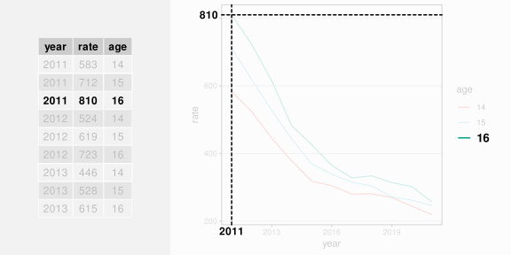
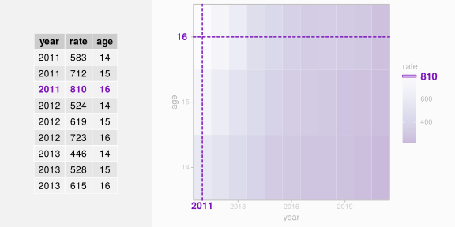
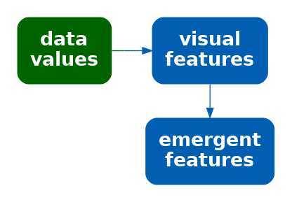
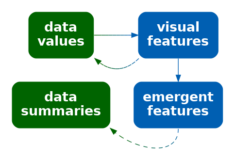
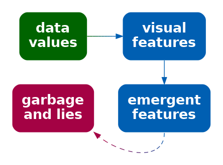
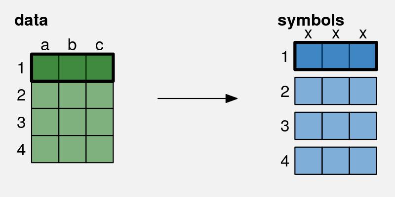
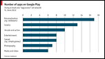
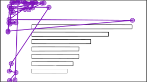
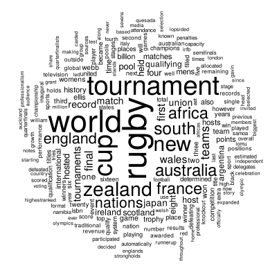

```{r}
#| echo: false
#| message: false
library(png)
library(dplyr)
library(reshape2)
library(tidyr)
library(knitr)
library(kableExtra)
library(reshape2)
library(ggplot2)
library(gggrid)
library(scales)
library(colorspace)
library(rcartocolor)
library(ggsci)
library(grid)
library(ggmosaic)
library(GGally)
library(ggforce)
library(ggChernoff)
library(ggimage)
library(ggh4x)
library(sf)
library(grImport)
library(grImport2)
library(rsvg)
library(ggtext)
library(xdvir)
```

```{r}
#| echo: false
figbg <- "#F2F2F2"
highlight <- "#7D12BA" ## Match text code colour (more precise than "purple")
## Set default colour palettes
scale_colour_discrete <- function(...) {
    scale_colour_npg(...)
}
scale_colour_ordinal <- function(...) {
    scale_colour_brewer(palette="Purples", ...)
}
scale_colour_continuous <- function(...) {
    scale_colour_distiller(palette="Purples", direction=1, ...)
}
scale_fill_discrete <- function(...) {
    scale_fill_npg(...)
}
scale_fill_ordinal <- function(...) {
    scale_fill_brewer(palette="Purples", ...)
}
scale_fill_continuous <- function(...) {
    scale_fill_distiller(palette="Purples", direction=1, ...)
}
## Set default line width
update_geom_defaults("line", list(linewidth=1))
## Set default theme
theme_set(theme_bw())
## Match the table odd row fill
theme_update(plot.background=element_rect(colour=NA, 
                                          fill=figbg),
             panel.background=element_blank(),
             panel.grid.minor=element_blank(),
             panel.grid.major=element_blank(),
             legend.background=element_blank())
```

```{r}
#| echo: false
source("rwc.R")
source("youth-crime.R")
crimeAgeSimple <- subset(crimeAge, age %in% c("14", "15", "16"))
```

```{r}
#| echo: false
#| purl: false
knitr::opts_chunk$set(dev='svg', 
                      dev.args=list(bg=figbg),
                      fig.width=8, fig.height=4,
                      out.width="100%")
```

# Executive Summary

```{r}
#| echo: false
#| purl: false
enc <- function(x) {
    paste0('<span class="encode">', x, '</span>')
}
dec <- function(x) {
    paste0('<span class="decode">', x, '</span>')
}
```

::: {.exec-summary}

* Creating a data visualisation involves an 
  `r enc("**encoding**")` of
  <span style="color: #1A6000">**data values**</span> 
  as <span style="color: #005A8F">**visual features**</span>.

  For example, numeric <span style="color: #1A6000">**counts**</span> 
  are `r enc("**encoded**")` 
  as the <span style="color: #005A8F">**heights of bars**</span>
  to create a bar plot.

* Reading a data visualisation involves a 
  `r dec("**decoding**")` of
  <span style="color: #005A8F">**visual features**</span> 
  to obtain <span style="color: #1A6000">**data values**</span>.

  For example, the <span style="color: #005A8F">**heights of bars**</span>
  in a bar plot
  are `r dec("**decoded**")` 
  to obtain <span style="color: #1A6000">**counts**</span>.

* The <span style="color: #8D324A">**effectiveness**</span> 
  of a data visualisation depends on the
  effectiveness of the `r dec("**decoding**")`.

  For example, a bar plot is effective for comparing 
  <span style="color: #1A6000">**counts**</span>
  because the visual system is effective at comparing the 
  <span style="color: #005A8F">**heights of bars**</span>.

* More `r enc("**complex encodings**")` produce more 
  <span style="color: #005A8F">**complex visual features**</span>.

  For example, a scatter plot `r enc("**encodes**")`
  <span style="color: #1A6000">**two numeric variables**</span>
  as the x- and y-locations of points, 
  which produces the 
  <span style="color: #005A8F">**position in space of points**</span>.

* More <span style="color: #005A8F">**complex visual features**</span> 
  lead to more `r dec("**complex decodings**")`.

  For example, the 
  <span style="color: #005A8F">**position in space of points**</span>
  in a scatter plot
  is `r dec("**decoded**")` 
  as the <span style="color: #1A6000">**correlation**</span> 
  between two numeric variables.
  
* An <span style="color: #8D324A">**effective data visualisation**</span>
  <span class="encode">**encodes**</span> data values to
  visual features that facilitate an effective 
  <span class="decode">**decoding**</span> from visual features
  back to data values.

:::

::: {.actual-quote}

Visualization is essentially a mapping process from computer representations
to perceptual representations, choosing encoding techniques to maximize human
understanding and communication. [@owen1999]
:::


# Introduction

A data visualisation presents data values in a visual
format.  In an effective data visualisation, this allows
properties of the data to be perceived very rapidly and without 
conscious effort.
For example, @tbl-crime shows data on the crime rate for
youth offenders in New Zealand, for the ages 14 to 16, for 
each year from 2011 to 2021.  With this purely text-based, tabular
presentation of the data, it requires considerable time and effort
to determine any trends in the crime rates.

```{r}
#| echo: false
#| message: false
#| label: tbl-crime
#| tbl-cap: A table of the number of youth offenders aged 14 to 16 from 2011 to 2021.  It is difficult to perceive trends in the crime rates from this purely text-based, tabular presentation of the data.

crimeTable <- dcast(crimeAgeSimple[c("age", "year", "rate")],
                    age ~ year)
kable(crimeTable, digits=0)
```

By contrast, with a simple line 
plot data visualisation like @fig-crime we can perceive the trends
in crime rates easily and immediately.
It is also easy to perceive more detailed properties like the fact that
the trend in crime rates for 16-year-olds is not completely monotonic
and the fact that
the crime rate for 15-year-olds (the blue line) is always greater than
the crime rate for 14-year-olds (the red line) 
and less than the crime rate for 16-year-olds (the green line).

```{r}
#| echo: false
#| label: crime-age-line
#| output: false
ggplot(crimeAgeSimple) +
    geom_line(aes(x=year, y=rate, colour=ageFactor))
```

```{r}
#| echo: false
#| label: fig-crime
#| fig-cap: A line plot of the crime rate amongst youth offenders aged 14 to 16 from 2011 to 2021.  Detecting trends in the crime rates is very fast and easy with this data visualisation.
gg <- 
<<crime-age-line>>
gg +
    scale_colour_discrete(name="age") +
    theme(panel.grid.major.y=element_line(colour="black", linewidth=.1),
          aspect.ratio=1)
```

@fig-crime-heatmap shows a different data visualisation of the same data,
this time a heatmap.
If we use a data visualisation
like @fig-crime-heatmap, detecting overall trends becomes more difficult and
perceiving detailed changes in the crime rates is very much harder.
Not all data visualisations are equally effective.

```{r}
#| echo: false
#| label: fig-crime-heatmap
#| fig-cap: A heatmap of the crime rate amongst youth offenders aged 14 to 16 from 2011 to 2021.
ggplot(crimeAgeSimple) +
    geom_tile(aes(year, age, fill=rate), colour=NA) +
    scale_x_continuous(expand=expansion(0)) +
    scale_y_continuous(expand=expansion(0), breaks=14:16) +
    theme(aspect.ratio=1)
```

Although @fig-crime is very effective for the questions
that we have considered so far, it is far less effective if we are interested
in a different question, for example, whether the *total* crime
rate is completely monotonic.  Does the *sum* of the red, blue, and green
lines always decrease year on year?
A single data visualisation cannot be effective for all possible questions.

Suppose that we are interested in what the *exact* crime rate was 
for 16-year-olds in 2011.  Neither @fig-crime nor @fig-crime-heatmap is
the best option for answering this quesion.  The best option in this
case is actually @tbl-crime. 

What makes a data visualisation effective?
Why are some data visualisations more effective than others?
The purpose of this document is to provide explanations for
why, when, and how data visualisation works.  

## How will it help?

You may have heard that statisticians hate pie charts.[^pie-chart-hate]
But do you know why?  Do pie charts have any redeeming features?

Conversely, bar plots are extremely popular, but why are they so good?
Knowing more about why different plots work for different situations
will help us to make better decisions about when to use what sort of
data visualisation.

[^pie-chart-hate]:
  @tufte1983visual [p178]:
  "the only worse design than a pie chart is several of them ... pie charts
  should never be used." 
  There are some other good references and choice quotes, but also
  some dissenting voices (see DataVis resources).

Understanding how data visualisation works will enable us to:

* Decide which data visualisations we should use.
* Justify our choice of data visualisation.
* Critically analyse data visualisations created by others.
* Reason about how to improve the effectiveness of a data visualisation.
* Reason about whether a novel visualisation will be effective.

## Scope {#sec-scope}

The focus of this document is **static** data visualisations for
**presentation**.  The assumption is that our data values have 
an interesting property and we want to produce a display
that makes it easy and efficient for viewers to perceive that property.
Some of the information that we cover will also
apply to interactive graphics and to exploratory graphics, but the
specific requirements of those types of data visualisation will not be 
addressed.[^interactive]

[^interactive]:
  link to interactive graphics books like Cook & Swayne and 
  Theus and Unwin.

This document is also focused on what **vision science**
has to tell us about effective data visualisation.
We will consider factors that influence how rapidly and how
accurately information can be extracted from a data visualisation.
This will include findings from a broad range of research, encompassing
Statistics, Computer Science, and Psychology.[^summary]

[^summary]:
  This document is not only a synthesis, but also a *simplification* of
  lot of different terms, theories, and results from the literature
  of vision science.
  The aim is to provide an overview that is similar in scope to
  more expert frameworks like [@kosslyn1989understanding], but 
  more consumable by a less expert audience.
  The goal of this document is to provide a
  description that is sufficiently straightforward for the non-expert to 
  consume, hopefully without making too many experts roll in their
  graves or send them to an early one.
  In most cases, it will be easy to see for ourselves that a visual
  effect is real through a simple diagram or data visualisation, but
  references to the relevant theories and experiments in the literature
  will be provided in footnotes like this one.

However, this document does not cover all fields of research
that impact on data visualisation.
We will not, for example, address the ethical use of data visualisation,
beyond a basic assumption that we want to faithfully represent
the properties of the data.[^ethics]

[^ethics]:
  link to Alberto Cairo at least.
  franconeri et al 2021 has some Cairo refs
  For resources on this important topic, see ...
  There is also the issue of presenting the right data (at the right
  level of detail), even if
  we are pure of heart.
  Nice example Cairo's How Charts Lie p94-95.
  also mention "story-telling" or "narratives" ?  or "task taxonomies" ?
  how data vis can have emotional affects ?
  link to "Data Feminism" D'Ignazio and Klein

It is also important to acknowledge that vision science cannot yet tell us
everything about how data visualisation works.
However, what is known will help us to have some understanding of 
why some data visualisations are so effective and others are less 
effective.

## Terminology {#sec-terminology}

Data visualisations come in a wide variety of forms (see @fig-3-plots),
with each form having its own name:  scatter plots, line plots, bar plots,
histograms, etc.
There are also many different names for the different components 
of a data visualisation:  lines, bars, points, 
axes, scales, legends, keys, titles, sub-titles, etc.

```{r}
#| echo: false
title <- "Crime per Year"
subtitle <- "Children aged 14-16"
scatter <- ggplot(crimeYear) + 
    geom_line(aes(yearDate, total), linewidth=.5) +
    labs(title=title, subtitle=subtitle) +
    scale_x_date(name="year") +
    theme(plot.subtitle=element_text(size=8))
bar <- ggplot(crimeYear) + 
    geom_col(aes(yearDate, total), width=200) +
    labs(title=title, subtitle=subtitle) +
    scale_x_date(name="year") +
    theme(plot.subtitle=element_text(size=8))
title2 <- "Crime by Severity"
n <- nrow(crimeLevelTotal)
crimeLevelTotal$xmin <- c(0, cumsum(crimeLevelTotal$total)[-n])
crimeLevelTotal$xmax <- cumsum(crimeLevelTotal$total)
crimeLevelTotal$ymin <- .5
crimeLevelTotal$ymax <- 1
pie <- ggplot(crimeLevelTotal) + 
    geom_rect(aes(xmin=xmin, ymin=ymin, xmax=xmax, ymax=ymax, fill=level), 
              colour="black", linewidth=.1) +
    coord_polar() +
    scale_y_continuous(limits=c(0, 1)) +
    scale_fill_grey() +
    labs(title=title2, subtitle=subtitle) +
    theme(panel.border=element_blank(),
          axis.text.x=element_blank(),
          axis.ticks.y=element_blank(),
          axis.text.y=element_blank(),
          plot.subtitle=element_text(size=8))
```

```{r}
#| echo: false
#| results: hide
svg("Figures/line-plot.svg", bg=figbg, width=3, height=3)
print(scatter, newpage=FALSE)
dev.off()
svg("Figures/bar-plot.svg", bg=figbg, width=3, height=3)
print(bar, newpage=FALSE)
dev.off()
svg("Figures/donut-plot.svg", bg=figbg, width=3, height=3)
print(pie, newpage=FALSE)
dev.off()
```

::: {#fig-3-plots layout-ncol=3}


Three examples of data visualisations: a
line plot, a bar plot, and a donut chart.
:::

In this document, we will reduce that complexity in two ways.
First of all, we will not distinguish between different forms
of data visualisation;  scatter plots, bar plots, line plots, and
histograms are all just **data visualisations**.
Secondly, we will distinguish
between only three 
core components of a data visualisation: **data symbols**,
**guides**, and **labels**.[^terminology]

[^terminology]:  
  Gathering axes and legends together under the 
  generic label of "guides" is from the Grammar of Graphics [@wilkinson2005].

Data symbols
: Data symbols are the geometric shapes that represent data values,
for example, the lines in a line plot, the bars in a bar plot, and the
segments of an annulus in a donut plot (see @fig-data-symbols).
We will spend a lot of time looking at how data symbols work.

```{r}
#| echo: false
#| results: hide
#| message: false
scatterGeom <- scatter +
    geom_line(aes(yearDate, total), linewidth=1, colour=highlight) +
    theme(panel.border=element_rect(colour="grey"),
          plot.title=element_text(colour="grey"),
          plot.subtitle=element_text(colour="grey"),
          axis.ticks=element_line(colour="grey"),
          axis.text=element_text(colour="grey"),
          axis.title=element_text(colour="grey"))
barGeom <- bar + 
    geom_col(aes(yearDate, total), fill=highlight, width=250) +
    theme(panel.border=element_rect(colour="grey", fill=NA),
          plot.title=element_text(colour="grey"),
          plot.subtitle=element_text(colour="grey"),
          panel.grid.major.y=element_line(colour="grey80"),
          axis.ticks=element_line(colour="grey"),
          axis.text=element_text(colour="grey"),
          axis.title=element_text(colour="grey"))
pieGeom <- pie + 
    geom_rect(aes(xmin=xmin, ymin=ymin, xmax=xmax, ymax=ymax), 
              fill=highlight, colour="grey", linewidth=.1) +
    scale_fill_manual(values=grey(.6 + .4*1:n/(n + 1))) +
    theme(plot.title=element_text(colour="grey"),
          plot.subtitle=element_text(colour="grey"),
          axis.ticks=element_line(colour="grey"),
          axis.text=element_text(colour="grey"),
          axis.title=element_text(colour="grey"),
          axis.ticks.y=element_blank(),
          axis.text.y=element_blank(),
          legend.text=element_text(colour="grey"),
          legend.title=element_text(colour="grey"))
```
```{r}
#| echo: false
#| results: hide
svg("Figures/line-plot-geom.svg", bg=figbg, width=3, height=3)
print(scatterGeom, newpage=FALSE)
dev.off()
svg("Figures/bar-plot-geom.svg", bg=figbg, width=3, height=3)
print(barGeom, newpage=FALSE)
dev.off()
svg("Figures/donut-plot-geom.svg", bg=figbg, width=3, height=3)
print(pieGeom, newpage=FALSE)
dev.off()
```

::: {#fig-data-symbols layout-ncol=3}


Three examples of data symbols: a line, some bars, and segments of an annulus.
:::

Guides
: Guides are the elements of a data visualisation that explain
how data values are represented, for example the axes on a line plot
or bar plot and the legend on a donut plot (see @fig-guides).
We will see later that **guides have a lot in common with data symbols**
(see @sec-guides).

```{r}
#| echo: false
#| results: hide
#| message: false
scatterGuide <- scatter +
    geom_line(aes(yearDate, total), linewidth=1, colour="grey90") +
    theme(panel.border=element_rect(colour="grey"),
          plot.title=element_text(colour="grey"),
          plot.subtitle=element_text(colour="grey"),
          axis.line=element_line(colour=highlight),
          axis.ticks=element_line(colour=highlight),
          axis.text=element_text(colour=highlight),          
          axis.title=element_text(colour="grey"))
barGuide <- bar + 
    geom_col(aes(yearDate, total), fill="grey90", col="grey90", width=200) +
    theme(panel.border=element_rect(colour="grey", fill=NA),
          plot.title=element_text(colour="grey"),
          plot.subtitle=element_text(colour="grey"),
          panel.grid.major.y=element_line(colour=highlight),
          axis.line=element_line(colour=highlight),
          axis.ticks=element_line(colour=highlight),
          axis.text=element_text(colour=highlight),          
          axis.title=element_text(colour="grey"))
pieGuide <- pie + 
    geom_rect(aes(xmin=xmin, ymin=ymin, xmax=xmax, ymax=ymax), 
              fill="grey90", colour="grey", linewidth=.5) +
    scale_fill_manual(values=colorRampPalette(c(highlight, lighten(highlight, .5)))(n)) +
    theme(plot.title=element_text(colour="grey"),
          plot.subtitle=element_text(colour="grey"),
          axis.ticks=element_line(colour="grey"),
          axis.text=element_text(colour="grey"),
          axis.title=element_text(colour="grey"),
          axis.ticks.y=element_blank(),
          axis.text.y=element_blank(),
          legend.text=element_text(colour=highlight),
          legend.title=element_text(colour="grey"))
```
```{r}
#| echo: false
#| results: hide
svg("Figures/line-plot-guide.svg", bg=figbg, width=3, height=3)
print(scatterGuide, newpage=FALSE)
dev.off()
svg("Figures/bar-plot-guide.svg", bg=figbg, width=3, height=3)
print(barGuide, newpage=FALSE)
dev.off()
svg("Figures/donut-plot-guide.svg", bg=figbg, width=3, height=3)
print(pieGuide, newpage=FALSE)
dev.off()
```

::: {#fig-guides layout-ncol=3}


Three examples of guides: axes, grid lines, and a legend.
:::

Labels
: Labels are the 
text elements that provide context and background information
about a data visualisation (e.g., titles and captions).
Labels may also guide the viewer to the important properties of 
the data.
Notice that **not all text elements are labels**.

```{r}
#| echo: false
#| results: hide
#| message: false
scatterLabel <- scatter +
    geom_line(aes(yearDate, total), linewidth=1, colour="grey90") +
    theme(panel.border=element_rect(colour="grey"),
          plot.title=element_text(colour=highlight, face="bold"),
          plot.subtitle=element_text(colour=highlight, face="bold"),
          axis.ticks=element_line(colour="grey"),
          axis.text=element_text(colour="grey"),          
          axis.title=element_text(colour=highlight, face="bold"))
barLabel <- bar + 
    geom_col(aes(yearDate, total), fill="grey90", col="grey90", width=200) +
    theme(panel.border=element_rect(colour="grey", fill=NA),
          plot.title=element_text(colour=highlight, face="bold"),
          plot.subtitle=element_text(colour=highlight, face="bold"),
          panel.grid.major.y=element_line(colour="grey80"),
          axis.ticks=element_line(colour="grey"),
          axis.text=element_text(colour="grey"),          
          axis.title=element_text(colour=highlight, face="bold"))
pieLabel <- pie + 
    geom_rect(aes(xmin=xmin, ymin=ymin, xmax=xmax, ymax=ymax), 
              fill="grey90", colour="grey", linewidth=.1) +
    scale_fill_manual(values=grey(.6 + .4*1:n/(n + 1))) +
    theme(plot.title=element_text(colour=highlight, face="bold"),
          plot.subtitle=element_text(colour=highlight, face="bold"),
          axis.ticks=element_line(colour="grey"),
          axis.text=element_text(colour="grey"),
          axis.title=element_text(colour="grey"),
          axis.ticks.y=element_blank(),
          axis.text.y=element_blank(),
          legend.text=element_text(colour="grey"),
          legend.title=element_text(colour=highlight, face="bold"))
```
```{r}
#| echo: false
#| results: hide
svg("Figures/line-plot-label.svg", bg=figbg, width=3, height=3)
print(scatterLabel, newpage=FALSE)
dev.off()
svg("Figures/bar-plot-label.svg", bg=figbg, width=3, height=3)
print(barLabel, newpage=FALSE)
dev.off()
svg("Figures/donut-plot-label.svg", bg=figbg, width=3, height=3)
print(pieLabel, newpage=FALSE)
dev.off()
```

::: {#fig-labels layout-ncol=3}


Examples of labels: the titles and sub-titles on all three plots;
the axis titles on the line plot and the bar plot; and the legend
title on the donut plot.
:::

## Mappings

Although we have reduced a data visualisation to just three components,
data symbols, 
guides, and labels, there are still many possible variations.
Which data symbols are being used?  How are
the axes labelled?  What colours are being used?
As much as possible, we are going to further reduce the design
of a data visualisation to a single question:
What **mappings** are being used?[^mappings]

Much of this document is focused on considering how data values are being
mapped, or **encoded**, into a visual representation.
For example, in the line plot of crime rates for
different ages in New Zealand in @fig-crime,
the data values are `year`, crime `rate`, and `age` 
(see @tbl-crime) and
the data symbols are a set of coloured lines.

[^mappings]: 
  The idea of characterising a data visualisation as a set
  of "mappings" from data values to visual representations is
  also from the Grammar of Graphics [@wilkinson2005].

We can describe this data visualisation in terms of a set of mappings
(see @fig-mappings-1):

* Each `year` value is encoded as a horizontal **position** along the
  x-axis and each `rate` value is encoded as a vertical **position** 
  along the y-axis.
  For example, the `year` 2011 maps to a location near the left edge
  of the plot and the `rate` 810 maps to a position 
  near the top edge of the plot.  
  The combined values of
  `year` and `rate` 
  are encoded as the locations through which we draw
  the coloured lines.

* Each `age` value is encoded as a **colour**.
  For example, the `age` 16 maps to a green colour.
  The `age` values are encoded as the colours of the lines.

::: {#fig-mappings-1 layout="[[1, -1], [1]]"}




The data visualisation in @fig-crime can be described as a mapping
of `year`, `rate`, and `age` to `x` and `y` positions and `colour`.
:::

The heatmap of the same data (see @fig-crime-heatmap) provides a different
visual representation because it involves different data symbols,
rectangles this time, and a different 
set of encodings (see @fig-mappings-2):

* Each `year` value is encoded as a horizontal **position** along the
  x-axis and each `age` value is encoded as a vertical **position** 
  along the y-axis.
  For example, the `year` 2011 maps to a location near the left edge
  of the plot and the `age` 16 maps to a position 
  near the top edge of the plot.  
  The combined values of
  `year` and `rate` 
  are encoded as the locations at which we draw
  the coloured rectangles.

* Each `rate` value is encoded as a **colour**.
  For example, the `rate` 810 maps to white, while lower `rate` values
  map to progressively darker shades of purple.
  The `rate` values are encoded as the colours of the rectangles.  

::: {#fig-mappings-2 layout="[[1, -1], [1]]"}




The data visualisation in @fig-crime-heatmap can be described as a mapping
of `year`, `rate`, and `age` to `x` position, `colour`, and `y` position.
:::

We will look at a variety of different encodings from data values
to data symbols (@fig-mappings).  Understanding why some
encodings work better than others will help us to understand why
some data visualisations are more effective than others.

::: {#fig-mappings}


A data visualisation is largely defined by the **mappings** that it uses
to transform **data values** into **data symbols**.
:::

## Summary 

Data visualisations can be incredibly effective for presenting
important properties of data values.  However, any one data visualisation
may only be effective for certain data values and for certain data 
properties.

The goal of this document is to explain why some data visualisations
are more effective than others;  how data visualisation works. 

The important elements of a data visualisation are **data symbols**,
which are visual representations of the data values, **guides**, 
which explain how data values
are encoded as data symbols, and **labels**, which provide
context and guidance.

We can characterise a data visualisation in terms of the **mappings**
that it uses to **encode** data values as data symbols.


# The Visual System {#sec-visual-system}

**TODO**
connect every visual system topic to visual decoding.
introduce "pre-attentive decoding" versus "learned decoding".
Possibly rename sections, e.g., "visual differences" -> "decoding differences"

**TODO**
Add position to visual features in visual model 

Understanding why some mappings are more effective than others will
depend upon an understanding of how the human visual system works.
The effectiveness of an **encoding** from data values to data symbols
will depend on how well we can **decode** from the data symbols
to the properties of the data (@fig-decode).

::: {#fig-decode}


The effectiveness of a data visualisation will depend on how
well our visual system can **decode** from the data symbols to the
properties of the data.
:::

In this section we will establish a very simple model of the visual system 
that we can refer to as we discuss different mappings.[^simple-visual-models]

[^simple-visual-models]:
  Simple descriptions of the human visual system can be found in many articles
  and books on
  data visualisation, for example, @Sönning2023, 
  @franconeri2021, and @cairo2012functional.
  See @ware2021information for a more in-depth,
  but still very accessible description.
  The @wikipedia-visual-system is also good.

## The eye {#sec-eye}

In order for us to perceive a data visualisation, light must emit from the
data visualisation (on screen) or reflect off the 
data visualisation (in print) 
and enter the eye.  Light passes through the pupil, 
is focused by the lens, and is projected onto the retina at the back of
the eye.  The retina contains around 100 million light-sensitive
nerve cells and signals from those are combined into about 1 million
nerve fibres in the optic nerve, which passes signals on to the brain
(see @fig-eye).
A very large amount of visual information is gathered by the 
eye and passed on to the brain.

```{r}
#| echo: false
#| eval: false
#| label: eye-basic
## grid.newpage()
eyeball <- circleGrob(r=.3, gp=gpar(lwd=3, fill="grey90"))
eyeballNot <- as.path(grobTree(eyeball, rectGrob(width=1.5)), rule="evenodd")
pushViewport(viewport(width=unit(1, "snpc"), height=unit(1, "snpc"),
                      gp=gpar(lineheight=.9, fill=NA)))
grid.text("light", x=unit(0, "npc") - unit(2, "mm"), just="right")
grid.segments(0, .5,
              unit(.17, "npc") - unit(2, "mm"), .5,
              gp=gpar(lwd=3, fill="black"), 
              arrow=arrow(type="closed", length=unit(3, "mm")))
grid.draw(eyeball)
grid.define(circleGrob(r=.1), name="cornea", gp=gpar(lwd=3))
grid.define(circleGrob(r=.07), name="lens", gp=gpar(lwd=3, fill="white"))
pushViewport(viewport(clip=eyeballNot))
pushViewport(viewport(x=.22, width=.5))
grid.use("cornea")
popViewport(2)
pushViewport(viewport(x=.22, width=.5))
grid.use("lens")
popViewport()
grid.text("lens", x=unit(.25, "npc") + unit(2, "mm"), just="left")
pushViewport(viewport(clip=rectGrob(x=.5, height=.1, just="left")))
grid.circle(r=.28, gp=gpar(lwd=3))
popViewport()
grid.text("retina", x=.75, just="right")
pushViewport(viewport(clip=polygonGrob(c(.5, 1, 1), c(.5, -.2, 1.2))))
grid.circle(r=.28, gp=gpar(lwd=3))
popViewport()
pushViewport(viewport(clip=eyeballNot))
grid.segments(.5, .5, 1, .35, 
              gp=gpar(lwd=3, fill="black"),
              arrow=arrow(type="closed", length=unit(3, "mm")))
popViewport()
grid.text("optic\nnerve", y=.35, 
          x=unit(1, "npc") + unit(2, "mm"), just="left")
```

```{r}
#| echo: false
#| eval: false
#| label: eye-basic-2
## grid.newpage()
eyeball <- circleGrob(r=.3, gp=gpar(lwd=3, fill="grey90"))
eyeballNot <- as.path(grobTree(eyeball, rectGrob(width=1.5)), rule="evenodd")
pushViewport(viewport(width=unit(1, "snpc"), height=unit(1, "snpc"),
                      gp=gpar(lineheight=.9, fill=NA)))
grid.text("light", x=unit(0, "npc") - unit(2, "mm"), just="right")
grid.segments(0, .5,
              unit(.17, "npc") - unit(2, "mm"), .5,
              gp=gpar(lwd=3, fill="black"), 
              arrow=arrow(type="closed", length=unit(3, "mm")))
grid.draw(eyeball)
grid.define(circleGrob(r=.1), name="cornea", gp=gpar(lwd=3))
grid.define(circleGrob(r=.07), name="lens", gp=gpar(lwd=3, fill="white"))
pushViewport(viewport(clip=eyeballNot))
pushViewport(viewport(x=.22, width=.5))
grid.use("cornea")
popViewport(2)
pushViewport(viewport(x=.22, width=.5))
grid.use("lens")
popViewport()
pushViewport(viewport(clip=rectGrob(x=.5, height=.1, just="left")))
grid.circle(r=.28, gp=gpar(lwd=3))
popViewport()
grid.text("cones", x=.75, just="right")
pushViewport(viewport(clip=polygonGrob(c(.5, 1, 1), c(.5, .65, 1.2))))
grid.circle(r=.28, gp=gpar(lwd=3))
popViewport()
grid.text("rods", x=.7, y=.65, just="right")
pushViewport(viewport(clip=polygonGrob(c(.5, 1, 1), c(.5, .3, -.2))))
grid.circle(r=.28, gp=gpar(lwd=3))
popViewport()
grid.text("rods", x=.7, y=.35, just="right")
pushViewport(viewport(clip=eyeballNot))
grid.segments(.5, .5, 1, .35, 
              gp=gpar(lwd=3, fill="black"),
              arrow=arrow(type="closed", length=unit(3, "mm")))
popViewport()
grid.text("brain\nthis\nway", y=.35, 
          x=unit(1, "npc") + unit(2, "mm"), just="left")
```

```{r}
#| echo: false
#| results: hide
svg("Figures/eye-basic.svg", bg=figbg, width=4, height=3)
<<eye-basic>>
dev.off()
svg("Figures/eye-basic-2.svg", bg=figbg, width=4, height=3)
<<eye-basic-2>>
dev.off()
```

::: {#fig-eye}


A very simple diagram of the human eye.  Light enters via the pupil and
is focused by the lens onto retina.  Light-sensitive neurons pass 
signals via the optic nerve to the brain.
:::

## Visual focus

@fig-eye-2 shows a slightly more detailed view of the structure of the eye
(compared to @fig-eye).  The retina contains two types of light-sensitive
cells:  **cones** and **rods**.  The cones are sensitive to colour and are 
concentrated very densely at the centre of the retina, in an area called
the **fovea**.  Rods only detect the amount of light (monochrome vision) and 
are spread more sparsely towards the periphery of the retina.

This arrangement means that, despite the experience of a complete, detailed
field of view, we only get detailed and colourful information from
a small foveal region (less than 5 degrees of visual angle).  
The information from our peripheral vision is
colourless and low-resolution.

::: {#fig-eye-2}


A slightly less simple diagram of the human eye.  There are two kinds
of light-sensitive cells in the
retina.  Cones are colour-sensitive and focused very densely at the
centre of the retina.  Rods are only light-sensitive and are spread
less densely towards the periphery of the retina.
:::

Furthermore, when we view an image, we do not simply stare at the centre
and see everything. Instead, we perform a series of **fixations**, which are
brief periods of focus on one area of the image, with **saccades** in between,
which are rapid changes in the location of our focus.
@fig-extinction demonstrates that where we look within an image
makes a difference.[^extinction]

[^extinction]:
  Explain that this is NOT just a fovea vs periphery illusion---there is
  currently no complete explanation for this effect---but it 
  serves to show that we are getting different information from different
  regions of the field of view.

```{r}
#| echo: false
#| label: fig-extinction
#| fig-cap: The extinction illusion. Look at one corner of the image and then switch focus to a different corner of the image.  What happens to the white dots?
tile <- grobTree(rectGrob(gp=gpar(col=NA, fill="black")),
                 segmentsGrob(0, 0, 1, 1, gp=gpar(col="grey50", lwd=8)),
                 segmentsGrob(0, 1, 1, 0, gp=gpar(col="grey50", lwd=8)),
                 circleGrob(c(0, 0, .5, 1, 1), c(0, 1, .5, 1, 0),
                            r=unit(2, "mm"),
                            gp=gpar(col="black", lwd=2, fill="white")),
                 vp=viewport(width=unit(2, "cm"), height=unit(2, "cm")))
pat <- pattern(tile,
               width=unit(2, "cm"),
               height=unit(2, "cm"),
               extend="repeat")
grid.newpage()
grid.rect(gp=gpar(col=NA, fill=pat))
## grid.segments(0, .5, 1, .5, gp=gpar(col="white", lwd=170))
## grid.segments(.5, 0, .5, 1, gp=gpar(col="white", lwd=170))
```

@fig-fixations shows eye-tracking data from one person viewing
an image for 10 seconds.[^MASSVIS]
The original image is shown on the left and eye-tracking data is shown
on the right, with hollow
black circles showing the position of the coloured circles
in the original image.
In the eye-tracking image, 
the fixations are shown as purple circles and the saccades  are shown as lines
between the circles.  For example, we can see that the viewer has 
fixated multiple times upon the large, colourful circles in the
original image.

[^MASSVIS]:
  The plot was originally from The Economist, but this image was taken
  from the resources provided on the 
  [MASSVIS project web site](http://massvis.mit.edu/).  
  The eye tracking data were taken from the same web site.

::: {#fig-fixations layout-ncol=2 layout-valign="bottom"} 

{#fig-fixations-1 fig-align="left"}

{#fig-fixations-2 fig-align="left"}

Eye tracking data (on the right) 
from the MASSVIS project that shows fixations (circles) and 
saccades (lines between circles) for one person viewing an image for 
10 seconds.  A thumbnail of 
the original image is shown on the left.[^MASSVIS-permissions]
:::

**ADD**
footnote that refers to Tufte's "within the eyespan"
page 67 of "Envisioning Information"
(talking about small multiples):
"Information slices are positioned within the eyespan, so that viewers
make comparisons at a glance - uninterrupted visual reasoning."

## Visual memory

When we switch focus to different areas of an image, 
we may need to remember information from a previous area of focus.
The most important feature of this visual memory is that it is 
very limited.  We can only hold in memory a small number of 
items at once.

::: {#fig-memory}

```{r}
#| echo: false
#| output: asis
cat(readLines("Memory/memory-1.svg", warn=FALSE), sep="\n")
cat(readLines("Memory/memory-3.svg", warn=FALSE), sep="\n")
cat(readLines("Memory/memory-5.svg", warn=FALSE), sep="\n")
```

Three memory tasks.  The task is to remember the colours of the circles.  Within each box, click on each of the coloured circles, which will produce a colour wheel.  Click (in the same order) on the colour wheel where it matches the colour of the original circles.  This will present the results as small black dots representing the original circle colours and open dots representing the matching clicks, plus a (maximum) error (in degrees).  The task should be harder (and less accurate) with more circles.
:::

**ADD** footnotes to cite Ware 4th ed p397-405 and p423-425

## Visual processing {#sec-visual-processing}

Processing of the 
signals from the optic nerve occurs in several areas of the brain.
Very basic **visual features** are extracted first, such as 
**position** (spatial arrangements), **angle** (orientations), **colour**,
and simple **patterns** (spatial frequencies).
This low-level information is passed on and built upon 
to produce higher-level representations, such as regions and **shapes**.
Information is then also integrated from prior knowledge to assist with
the identification of **objects**---things like trees, animals, and faces.

::: {#fig-visual-processing}


A very simple model of visual processing. 
:::

Lower-level processing occurs subconsciously and more rapidly than higher-level
processing, which can require conscious effort.  Furthermore, lower-level
processing occurs in parallel and can involve many instances of visual 
features at once, whereas higher-level processing will only focus on 
a small number of
items or a single item at once.
On the other hand, lower-level visual features are rapidly
discarded as our attention shifts, while higher-level visual objects are more
persistent and may become part of long-term memories
(see @fig-visual-model).

::: {#fig-visual-model}


Some of the properties of visual processing. 
:::

@fig-visual-model-demo shows an image that is made up of
many small items:  tiny triangles with different **lengths**,
orientations (**angles**), and **colours**.
The orientations of the triangles represents wind direction and the 
length of the triangles represents wind strength;  blue triangles
are over the sea and green triangles are over land.[^NOMADS]
The visual system can very quickly
perceive many small **visual features** at once.
There is no need to concentrate separately
on every individual triangle in the image.
At a higher level of processing, darker and lighter **regions** are
identified as well as regions of different colours.
For example, a band of lighter wind forms a line from the top-left
corner at a roughly 45-degree angle.
At a higher level of processing again, at least for the denizens of Oceania,
the green regions are recognised as a very familiar **object**: the
outline of New Zealand.

The small lines convey a lot of simple pieces of information---what
is the wind strength and direction at each location---though
we have to focus on a particular spot in order to extract that information.
The darker and lighter regions convey several more complex ideas like
regions of stronger and lighter winds.
The green regions combine to convey the single complex and abstract
concept of New Zealand.

[^NOMADS]:
  @fig-visual-model-demo is based on wind data from the
  National Oceanic and Atmospheric Administration's Operational Model Archive 
  and Distribution System ([NOMADS](https://nomads.ncep.noaa.gov/)).
  The data were accessed and processed using 
  the {rNOMADS} package [@rNOMADS], with raw data interpolated to a finer
  grid.

::: {#fig-visual-model-demo}


A visualisation of wind strength and wind direction 
that is made up of lots of small lines of different
lengths and different angles and different colours.
:::

**ADD** footnote cite to Ware (4th) p229-330

## Visual differences {#sec-differences}

The ability to gather a large amount of basic features from an image
very quickly
is supplemented by rapid visual processing that combines and 
summarises the information.  These subconscious
processes extract some properties from an image without any mental effort.

For example, in @fig-pop-colour-1 we can detect the one teal dot amongst the
24 orange dots without effort. @fig-pop-colour-2 shows that this task remains
effortless even if the number of distractors is much larger.[^pre-attentive]

[^pre-attentive]:
  Mention "pre-attentive" 
  plus citations.

```{r}
#| echo: false
spread <- function(n, shift=1/n, seed=12345678) {
    set.seed(seed)
    xy <- grid(n)
    xd <- runif(n^2)
    yd <- runif(n^2)
    list(x=xy$x + shift*xd, y=xy$y + shift*yd)
}

grid <- function(n) {
    x <- rep(seq(0, 1, length.out=n), n)
    y <- rep(seq(0, 1, length.out=n), each=n)
    list(x=x, y=y)
}

resample <- function(x, ...) x[sample.int(length(x), ...)]

dots <- function(n, different=1, cols2=colsnpg, spread=FALSE, mix=FALSE, r2) {
    n2 <- n^2
    if (missing(r2)) {
        if (n < 10) {
            r2 <- c(3, 3)
        } else {
            r2 <- c(1.5, 1.5)
        }
    }
    if (spread) {
        xy <- spread(n)
        wh <- .9
    } else {
        xy <-grid(n)
        wh <- .8
    }
    draw <- function(xy, cols2, r2) {
        N <- length(xy$x)
        cols <- rep(cols2[1], N)
        r <- rep(r2[1], N)
        sub <- TRUE ## xy$x < xy$y
        i <- resample((1:N)[sub], different)
        cols[i] <- cols2[2]
        r[i] <- r2[2]
        grid.circle(xy$x, xy$y, default.units="native", r=unit(r, "mm"), 
                    gp=gpar(col=cols, fill=cols))
    }
    pushViewport(viewport(width=unit(.8, "snpc"), height=unit(.8, "snpc")))
    grid.rect()
    pushViewport(viewport(width=wh, height=wh,
                          xscale=range(xy$x), yscale=range(xy$y)))
    if (mix) {
        split <- sample(1:n2, round(n2/2))
        draw(lapply(xy, function(x) x[split]), rep(cols2[2], 2), r2)
        draw(lapply(xy, function(x) x[-split]), rep(cols2[1], 2), rev(r2))
    } else {
        draw(xy, cols2, r2)
    }
    popViewport(2)
}

mult2 <- c(1, -1)
pch2 <- c(4, 3)
lwd2 <- c(3, 3)
size2 <- c(4, 4)
len <- 1
lines <- function(n, col=FALSE, diffm=1, diffc=1, cols2=colsnpg, spread=FALSE) {
    n2 <- n^2
    if (n < 10) {
        size2 <- c(6, 6)
    } else {
        size2 <- c(4, 4)
    }
    if (spread) {
        xy <- spread(n)
        wh <- .9
    } else {
        xy <-grid(n)
        wh <- .8
    }
    mult <- rep(mult2[1], n2)
    pch <- rep(pch2[1], n2)
    lwd <- rep(lwd2[1], n2)
    size <- rep(size2[1], n2)
    sub <- TRUE ## xy$x < xy$y
    i <- resample((1:n2)[sub], diffm)
    mult[i] <- mult2[2]
    pch[i] <- pch2[2]
    lwd[i] <- lwd2[2]
    size[i] <- size2[2]
    pushViewport(viewport(width=unit(.8, "snpc"), height=unit(.8, "snpc")))
    grid.rect()
    pushViewport(viewport(width=wh, height=wh,
                          xscale=range(xy$x), yscale=range(xy$y)))
    if (col) {
        cols <- rep(cols2[1], n2)
        i <- c(resample(i, 1), resample((1:n2)[-i], diffc))
        cols[i] <- cols2[2]
    } else {
        cols <- "black"
    }
    if (FALSE) {
        grid.segments(unit(xy$x, "native") + unit(len, "mm"), 
                      unit(xy$y, "native") + mult*unit(len, "mm"), 
                      unit(xy$x, "native") - unit(len, "mm"), 
                      unit(xy$y, "native") - mult*unit(len, "mm"),
                      gp=gpar(col=cols, lwd=2))
    } else {
        grid.points(unit(xy$x, "native"), unit(xy$y, "native"),
                    pch=pch, gp=gpar(col=cols, lwd=lwd),
                    size=unit(size, "mm"))
    }
    popViewport(2)
}
```

```{r}
#| echo: false
#| label: fig-pop-colour
#| layout-ncol: 2
#| fig.height: 6
#| fig-cap: Amongst a collection of dots, we effortlessly perceive one dot that has a different colour.
#| fig-subcap:
#|   - One teal dot amongst 24 orange dots.
#|   - One teal dot amongst 99 orange dots.
colsnpg <- pal_npg()(2)

grid.newpage()
dots(5)

grid.newpage()
dots(10)
```

This ability to identify an item that is different from all other items
within an image
also
applies to other basic features like size, as shown
in @fig-diff-size.

```{r}
#| echo: false
#| label: fig-diff-size
#| layout-ncol: 2
#| fig.height: 6
#| fig-cap: Amongst a collection of dots, we effortlessly perceive one dot that differs only by size.
#| fig-subcap:
#|   - One larger dot amongst 24 smaller dots.
#|   - One larger dot amongst 99 smaller dots.
colssame <- rep("black", 2)

grid.newpage()
dots(5, cols2=colssame, r2=c(3, 5))

grid.newpage()
dots(10, cols2=colssame, r2=c(1.5, 3))
```

If an item differs on more than one visual feature, the effect is 
even stronger (@fig-diff-salience).
The visual system is very sensitive to items that are **different** in terms
of basic **visual features**.

```{r}
#| echo: false
#| label: fig-diff-salience
#| layout-ncol: 2
#| fig.height: 6
#| fig-cap: Amongst a collection of dots, we effortlessly perceive one dot that differs by both colour and size.
#| fig-subcap:
#|   - One larger teal dot amongst 24 smaller orange dots.
#|   - One larger teal dot amongst 99 smaller orange dots.
#col1 <- coords(as(sRGB(t(col2rgb(colsnpg[1])/255)), "polarLUV"))
#colssimilar <- hcl(c(col1[3], col1[3] + 10), col1[2], c(col1[1], col1[1] - 10))
colssimilar <- c(colsnpg[1], darken(colsnpg[1]))

grid.newpage()
dots(5, cols2=colsnpg, r2=c(3, 5))

grid.newpage()
dots(10, cols2=colsnpg, r2=c(1.5, 3))
```

On the other hand, if the distractor items are both similar on one
visual feature, but different on another, and if the arrangement
of the items is less structured, then finding a particular item of interest
becomes much harder.  For example, if we look for the
single larger 
teal dot in @fig-diff-serial,
it is much harder to find than it is in @fig-diff-salience.
The visual system's sensitivity to **different** items is much
greater when all other items are the **same**.

```{r}
#| echo: false
#| label: fig-diff-serial
#| layout-ncol: 2
#| fig.height: 6
#| fig-cap: We have to work much harder when there is more going on.
#| fig-subcap:
#|   - One larger teal dot amongst 24 dots that differ by colour and/or size.
#|   - One larger teal dot amongst 99 dots that differ by colour and/or size.
grid.newpage()
dots(5, cols2=colsnpg, r2=c(3, 5), spread=TRUE, mix=TRUE)

grid.newpage()
dots(10, cols2=colsnpg, r2=c(1.5, 3), spread=TRUE, mix=TRUE)
```

## Visual attention {#sec-attention}

Where we focus within an image
is not random.[^attention]
The figures from @sec-differences show that
our attention is automatically drawn to the **larger**, **brighter**, and
more **colourful** items within an image.
This happens due to very early visual processing and without
conscious thought.

[^attention]:
  Citation to bottom-up vs top-down.

Where we focus within an image, and what information we extract,
is also affected by conscious goals---what are we looking for?[^filtering]
For example, when you were looking for the larger teal dot in @fig-diff-serial,
did you notice that there was also a single small orange dot?
Now that your attention has been drawn to that task, it will
be easier to find the smaller orange dot.

[^filtering]:
  Citation to mentions of attention
  filtering visual input differently

## Visual similarities {#sec-visual-model-groups}

In @fig-diff-serial, we can see several groups of items:
orange dots, teal dots, large dots, and small dots.
These separate groups of items are identified based on their 
**similarity**---each group of items have the same size and the same colour.

As with the detection of differences that we saw in @sec-differences,
the grouping of similar items within an image happens automatically and
without conscious effort.
Furthermore, there are other visual properties 
that mean we automatically perceive items as groups:
items that are close together (items that have similar
**positions**) are seen as a group;
items that are connected by lines
are seen as a group;
and items that are enclosed by a border or background 
are seen as a group.[^gestalt]

[^gestalt]:
  mention Gestalt "school" or whatever, plus citations.
  enclosure == common region

For example, in @fig-gestalt-group there are several matrices of dots.
In each matrix, we can see either rows of dots or columns of dots 
by manipulating visual features that affect our perception of groups:
dots that are closer together for a group;
dots that are the same colour form a group;
dots that are connected by lines form a group.

```{r}
#| echo: false
#| label: fig-gestalt-group
#| fig.height: 2
#| fig-cap: In each matrix of dots, we clearly see either rows or columns. In the pair of matrices on the left, making the dots slightly closer together horizontally produces rows, and making the dots slightly closer vertically produces columns.  In the middle pair of matrices, using the same colour on each row produces rows, and using the same colour on each column produces columns.  In the pair of matrices on the right, drawing vertical lines produces columns and drawing horizontal lines produces rows.
vp2 <- viewport(width=.9, y=unit(3, "lines"), 
                height=unit(1, "npc") - unit(6, "lines"), 
                just="bottom")
pushViewport(viewport(width=.8, 
                      layout=grid.layout(1, 5, widths=c(1, .5), 
                                         respect=TRUE),
                      gp=gpar(cex=1.5)))
pushViewport(viewport(layout.pos.col=1),
             vp2)
grid.circle(unit(.15, "npc") + rep(3.5*unit(-2:2, "mm"), 5), 
            unit(.5, "npc") + rep(5*unit(-2:2, "mm"), each=5), 
            r=unit(1, "mm"), gp=gpar(fill="black"))
grid.circle(unit(.85, "npc") + rep(5*unit(-2:2, "mm"), 7), 
            unit(.5, "npc") + rep(3.5*unit(-2:2, "mm"), each=7), 
            r=unit(1, "mm"), gp=gpar(fill="black"))
grid.text("proximity", y=unit(-2, "lines"), just="top")
popViewport(2)
pushViewport(viewport(layout.pos.col=3),
             vp2)
grid.circle(unit(.2, "npc") + rep(4*unit(-2:2, "mm"), 5), 
            unit(.5, "npc") + rep(4*unit(-2:2, "mm"), each=5), 
            r=unit(1, "mm"), 
            gp=gpar(col=rep(colsnpg, each=5), fill=rep(colsnpg, each=5)))
grid.circle(unit(.8, "npc") + rep(4*unit(-2:2, "mm"), 5), 
            unit(.5, "npc") + rep(4*unit(-2:2, "mm"), each=5), 
            r=unit(1, "mm"), 
            gp=gpar(col=rep(colsnpg, length.out=5), 
                    fill=rep(colsnpg, length.out=5)))
grid.text("similarity", y=unit(-2, "lines"), just="top")
popViewport(2)
pushViewport(viewport(layout.pos.col=5),
             vp2)
grid.circle(unit(.2, "npc") + rep(4*unit(-2:2, "mm"), 5), 
            unit(.5, "npc") + rep(4*unit(-2:2, "mm"), each=5), 
            r=unit(1, "mm"), 
            gp=gpar(fill="black"))
grid.segments(unit(.2, "npc") + 4*unit(-2:2, "mm"),
              unit(.5, "npc") + 4*unit(-2, "mm"), 
              unit(.2, "npc") + 4*unit(-2:2, "mm"),
              unit(.5, "npc") + 4*unit(2, "mm"),
              gp=gpar(lwd=1.5))
grid.circle(unit(.8, "npc") + rep(4*unit(-2:2, "mm"), 5), 
            unit(.5, "npc") + rep(4*unit(-2:2, "mm"), each=5), 
            r=unit(1, "mm"), 
            gp=gpar(fill="black"))
grid.segments(unit(.8, "npc") + 4*unit(-2, "mm"),
              unit(.5, "npc") + 4*unit(-2:2, "mm"), 
              unit(.8, "npc") + 4*unit(2, "mm"),
              unit(.5, "npc") + 4*unit(-2:2, "mm"),
              gp=gpar(lwd=2))
grid.text("connection", y=unit(-2, "lines"), just="top")
popViewport(2)
```

These grouping effects are very powerful and can even be used to override
each other in some combinations.  @fig-gestalt-group shows that an enclosing
border can be stronger than a connecting line, connecting lines can be 
stronger than closeness, and closeness can be stronger than similar colours.

```{r}
#| echo: false
#| label: fig-gestalt-order
#| fig-cap: For each set of four dots, we automatically perceive two pairs of dots.  On the left, the enclosing grey rectangles produce an upper pair and a lower pair.  Second from left, the lines produce a left pair and a right pair.  Second from right, closeness produces an upper pair and a lower pair.  On the right, colour produces a left pair and a right pair.
#| fig.height: 2
cols <- rep(colsnpg, each=2)
vp2 <- viewport(width=.9, y=unit(2, "lines"), 
                height=unit(1, "npc") - unit(4, "lines"), 
                just="bottom")
pushViewport(viewport(layout=grid.layout(16, 4)))
pushViewport(viewport(layout.pos.col=1),
             vp2, viewport(width=unit(1, "snpc"), height=unit(1, "snpc")))
grid.roundrect(.5, .2, .6, .3, 
               gp=gpar(col=NA, fill="grey"))
grid.roundrect(.5, .8, .6, .3, 
               gp=gpar(col=NA, fill="grey"))
grid.segments(c(.4, .6), .2, c(.4, .6), .8,
              gp=gpar(lwd=3))
grid.circle(c(.4, .4, .6, .6), c(.2, .8, .2, .8),
            r=unit(2, "mm"), gp=gpar(fill="black"))
grid.text("enclosure", y=0, just="top")
popViewport()
grid.text(">", x=1, y=0, just="top")
popViewport(2)
pushViewport(viewport(layout.pos.col=2),
             vp2, viewport(width=unit(1, "snpc"), height=unit(1, "snpc")))
grid.segments(c(.4, .6), .2, c(.4, .6), .8,
              gp=gpar(lwd=3))
grid.circle(c(.4, .4, .6, .6), c(.2, .8, .2, .8),
            r=unit(2, "mm"), gp=gpar(fill="black"))
grid.text("connection", y=0, just="top")
popViewport()
grid.text(">", x=1, y=0, just="top")
popViewport(2)
pushViewport(viewport(layout.pos.col=3),
             vp2, viewport(width=unit(1, "snpc"), height=unit(1, "snpc")))
grid.circle(c(.4, .4, .6, .6), c(.2, .8, .2, .8),
            r=unit(2, "mm"), gp=gpar(col=cols, fill=cols))
grid.text("proximity", y=0, just="top")
popViewport()
grid.text(">", x=1, y=0, just="top")
popViewport(2)
pushViewport(viewport(layout.pos.col=4),
             vp2, viewport(width=unit(1, "snpc"), height=unit(1, "snpc")))
grid.circle(c(.4, .4, .6, .6), c(.4, .6, .4, .6),
            r=unit(2, "mm"), gp=gpar(col=cols, fill=cols))
grid.text("similarity", y=0, just="top")
popViewport(3)
```

## Summary

The human visual system captures a very large amount of information from the
visual field.  

Detailed information is only available at the centre of the visual field
so multiple fixations are required to capture detailed information
from multiple locations within an image.

Large numbers of simple features are rapidly extracted,
while more complex visual items take longer and require more 
congnitive effort, but persist for longer.

Large, bright, colourful items automatically stand out.

Items are automatically grouped in terms of similarity 
(of basic visual features), proximity, connection, and enclosure.

The main point is that the visual system is *very* good at 
perceiving certain visual features.

An effective data visualisation will make use of the things that
the visual system is good at.


# Visual Features {#sec-mapping-visual-features}

We have established that the mappings from data values to data symbols
are fundamental to a data visualisation.  However, there are many 
possible ways to map data values into visual representations;
there are many
possible encodings to choose from.

We have also begun to explore the visual system and we have identified
three levels of visual processing:  visual features, visual shapes,
and visual objects.

In this section, we begin to explore different sorts of encodings,
starting with 
the simplest, where
each **data value** is **encoded** as 
a basic **visual feature** of a data symbol
(@fig-visual-feature).  

::: {#fig-visual-feature layout-ncol=2}


A simple data visualisation encodes each data value as a **visual feature**
of a data symbol.  Each data value (`a`) is mapped to a visual
feature (`x`) of a single data symbol.
:::

## Bar plots

In order to demonstrate mapping data values to visual features,
we will work with a data visualisation of
the `total` number of
crimes for different ethnic `group`s.  The data values are shown
in @tbl-crime-group-total.

```{r}
#| echo: false
#| message: false
#| label: tbl-crime-group-total
#| tbl-cap: A table of the total number of offenders aged 14 to 16 from 2011 to 2021 for different ethnic groups.  
crimeGroupTotalTable <- subset(crimeGroupTotal, select=c("group", "total"))
kable_styling(kable(crimeGroupTotalTable),
              bootstrap_options=c("basic", "hover"), 
              full_width=FALSE)
```

A bar plot of these data is shown in @fig-bar.
This is a very effective way to visualise the `total` values,
particularly if we are interested in comparing the raw totals.
With this data visualisation, it is very easy to answer 
questions like the following:

* Which ethnic group has the largest total number of offenders?
* Which ethnic group has the smallest total number of offenders?
* Is the total number of offenders higher for `Māori` or `Pasifika`?
* Is the total number of offenders for `European/Other` more or less
  than half the total for `Māori`?

```{r}
#| echo: false
#| label: fig-bar
#| fig-cap: A bar plot of the total number of offenders for different ethnic groups. The data symbols in this plot are the horizontal bars.
ggplot(crimeGroupTotal) + 
    geom_col(aes(x=total, y=group)) +
    scale_x_continuous(expand=expansion(c(0, .05))) +
    theme(aspect.ratio=1)
```

Why is the data visualisation in @fig-bar so effective?
To help answer that question, we need to look at the encoding that
is being used to map the data values to data symbols.
  
## Visual features

The data symbols in @fig-bar 
are a set of rectangles or bars.
However, the important visual feature of the rectangles is their
**length**;  the thickness of the bars does not relate to the data 
values at all (see @fig-length).
The `total` number of crimes for each ethnic group 
is encoded as the length of a rectangle.  Each data value
is mapped to the length of one rectangle.[^length-vs-position]

[^length-vs-position]:
  In the classic Cleveland and McGill formulation, the encoding is 
  data value to **position** of bar end.
  I prefer to use length, but it does not matter too much because both
  position and length are good.
  NOTE the reading that questions whether people use the decoding that
  the data vis author intended
  Hill and Imokhai (2025)

```{r}
#| echo: false
#| label: fig-length
#| fig-cap: A bar plot of number of crimes for different ethnic groups. The data values, the `total` number of crimes, have been mapped to the **lengths** of the bars (the purple lines).
ggplot(crimeGroupTotal) + 
    geom_col(aes(x=total, y=group), fill="grey") +
    scale_x_continuous(expand=expansion(c(0, .05))) +
    geom_segment(aes(xend=total, y=group, yend=group), x=0, 
                 color=highlight, linewidth=1,
                 arrow=arrow(angle=15, length=unit(3, "mm"), ends="both")) +
    theme(panel.border=element_rect(colour="grey", fill=NA),
          plot.title=element_text(colour="grey"),
          plot.subtitle=element_text(colour="grey"),
          axis.ticks=element_line(colour="grey"),
          axis.text=element_text(colour="grey"),
          axis.title=element_text(colour="grey"),
          aspect.ratio=1)
```

There is another mapping being used in @fig-bar:
The crime `group` is encoded as the vertical **positions** of the bars
(see @fig-position).  Each `group` value is mapped to the 
vertical position of one rectangle.

```{r}
#| echo: false
#| label: fig-position
#| fig-cap: A bar plot of number of crimes for different ethnic groups. The data values, the ethnic `group`s, have been mapped to the **positions** of the bars (the purple dots).
ggplot(crimeGroupTotal) + 
    geom_col(aes(x=total, y=group), fill="grey") +
    scale_x_continuous(expand=expansion(c(0, .05))) +
    geom_point(aes(y=group), x=0, color=highlight, size=3) +
    coord_cartesian(clip="off") +
    theme(panel.border=element_rect(colour="grey", fill=NA),
          plot.title=element_text(colour="grey"),
          plot.subtitle=element_text(colour="grey"),
          axis.ticks=element_line(colour="grey"),
          axis.text=element_text(colour="grey"),
          axis.title=element_text(colour="grey"),
          aspect.ratio=1)
```

**Length** and **position** are examples of basic visual features.
One way to make an effective data visualisation is to encode
data values as the basic visual features of a data symbol.
This is effective because basic visual features are 
identified rapidly and without conscious effort by our visual system.
@fig-visual-features shows some other examples of basic visual 
features.[^visual-features]

[^visual-features]:
  Acknowledge that a much larger list has been considered and evaluated
  by different researchers.
  For example p26 of "Better data visualizations" Jonathan Schwabish.
  There should also be some stuff from research articles in DataVis/README

```{r}
#| echo: false
#| label: fig-visual-features
#| fig-cap: Some examples of basic visual features are **position**, **length**, **angle**, **area**, **colour**, and **shape**.[^list-of-features]
grid.newpage()
pushViewport(viewport(width=unit(1, "snpc"),
                      layout=grid.layout(6, 2, widths=1:2), gp=gpar(cex=1.5)))
pushViewport(viewport(layout.pos.row=1, layout.pos.col=2))
grid.text("position", x=0, just="right")
grid.segments(.2, .5, .8, .5, gp=gpar(lwd=2))
grid.segments(.2, .4, .2, .6, gp=gpar(lwd=2))
grid.segments(.8, .4, .8, .6, gp=gpar(lwd=2))
grid.circle(c(.3, .6), .7, r=unit(1, "mm"), gp=gpar(fill="black"))
popViewport()
pushViewport(viewport(layout.pos.row=2))
grid.rect(gp=gpar(col=NA, fill="grey90"))
popViewport()
pushViewport(viewport(layout.pos.row=2, layout.pos.col=2))
grid.text("length", x=0, just="right")
grid.rect(.2, c(.3, .7), c(.1, .4), .2, just="left", gp=gpar(fill="black"))
popViewport()
pushViewport(viewport(layout.pos.row=3, layout.pos.col=2))
grid.text("angle", x=0, just="right")
grid.lines(c(.55, .45, .55) - .2, c(.6, .4, .4), gp=gpar(lwd=2))
grid.lines(c(.55, .45, .55) + .2, c(.8, .4, .4), gp=gpar(lwd=2))
popViewport()
pushViewport(viewport(layout.pos.row=4))
grid.rect(gp=gpar(col=NA, fill="grey90"))
popViewport()
pushViewport(viewport(layout.pos.row=4, layout.pos.col=2))
grid.text("area", x=0, just="right")
grid.circle(c(.3, .7), .5, r=unit(c(1, 3), "mm"), gp=gpar(fill="black"))
popViewport()
pushViewport(viewport(layout.pos.row=5, layout.pos.col=2))
grid.text("colour", x=0, just="right")
grid.circle(c(.3, .7), .5, r=unit(2, "mm"), gp=gpar(fill=2:3))
popViewport()
pushViewport(viewport(layout.pos.row=6))
grid.rect(gp=gpar(col=NA, fill="grey90"))
popViewport()
pushViewport(viewport(layout.pos.row=6, layout.pos.col=2))
grid.text("shape", x=0, just="right")
grid.points(c(.3, .7), c(.5, .5), size=unit(4, "mm"), pch=3:4, gp=gpar(lwd=2))
popViewport()
```

[^list-of-features]:
  Talk about this being a quite small list;  munzner has more,
  and Wolfe and Horowitz 2004 suggest 20? (see Pomerantz and Cragin (2014))

> One reason why a bar plot is an effective data visualisation is 
  because it involves a mapping from data values
  to the basic visual features of data symbols---the
  the positions and lengths of bars---and basic visual features 
  are processed rapidly and subconsciously by our visual system.

## Quantitative features {#sec-quant-features}

As we discussed in @sec-visual-system, the real purpose of encoding
data values as data symbols is to make use of the visual system
to **decode** the data values from the data symbols.  
In this section, we are considering
mappings from data values to basic visual features, so we
need to consider how well we are able to **decode** from 
**visual features** to **data values** (@fig-visual-feature-decode).

::: {#fig-visual-feature-decode}


When we encode data values as visual features, we want to map 
to a visual feature that allows us to decode the data values from
the visual fearure.
:::

One issue to consider is whether a visual feature is able to
represent all of the information in the data values.[^matching-data-type]
Some types of data contain more information than others:

[^matching-data-type]:
  The idea of matching the type of data---nominal, ordinal, interval, or
  ratio---as well as the categorisation of visual feature types
  is described in @zhang1996representational.  @munzner2014visualization,
  following @mackinlay1986automatic,
  refers to this idea as "expressiveness"
  (vs "effectiveness" which is more about accuracy).

* **Quantitative** data consists of numeric values, which naturally
  possess not only an ordering, but information about the size
  of differences between values.  For example, 
  the `year` 2020 comes after the year 2010 and there is a gap
  of 10 years in between.  This is also referred to as **interval** data.
  **Ratio** data is quantitative data that also contains a 
  "zero" reference value, so there is also information
  about absolute size and ratios of differences.
  For example, 200 offenders is twice as many as 100 offenders.

* **Qualitative** data consists of categorical values that are typically
  character values.  **Ordinal** data consists of categories that
  are ordered, but there is no information about the size of differences.
  For example, a "high" crime level is more severe than a "medium"
  crime level, which is more severe than a "low" crime level, but 
  we cannot measure the size of the differences.
  **Nominal** data consists of just group labels,
  e.g., ethnic groups, and the only information we have is that the
  categories are different from each other.

@fig-quant-features shows that **position**, **length**, **angle**,
and **area** are visual features that are capable of representing
**quantitative** data values.
For example, a bar that is twice as high as another bar 
comfortably represents a data value that is twice as much as another
data value.
All but **position** also possess
a natural representation of zero.  

```{r}
#| echo: false
#| label: fig-quant-features
#| fig-height: 3
#| fig-cap: The visual features position, length, area, and angle are all appropriate visual features for visualising quantitative data values.
## grid.newpage()
vp2 <- viewport(width=.9, y=unit(3, "lines"), 
                height=unit(1, "npc") - unit(6, "lines"), 
                just="bottom")
pushViewport(viewport(layout=grid.layout(1, 5)))
pushViewport(viewport(layout.pos.col=1),
             vp2)
## grid.segments(1, 0, 1, 1)
grid.segments(unit(1, "npc") - unit(2, "mm"), c(0, .5, 1), 
              unit(1, "npc") + unit(2, "mm"), c(0, .5, 1),
              arrow=arrow(type="closed", angle=15, length=unit(2, "mm")), 
              gp=gpar(fill="black"))
grid.text(c("(zero) 0", "(amount) 10", "(twice) 20"),
          unit(1, "npc") - unit(4, "mm"), c(0, .5, 1),
          just="right")
popViewport(2)
pushViewport(viewport(layout.pos.col=2),
             vp2)
grid.segments(.5, 0, .5, 1, gp=gpar(lty="dotted"))
grid.points(rep(.5, 3), c(0, .5, 1), pch=16, size=unit(4, "mm"))
grid.text("position", y=unit(-1, "lines"))
popViewport(2)
pushViewport(viewport(layout.pos.col=3),
             vp2)
grid.rect(1:3/4, 0, .2, c(0, .5, 1), gp=gpar(fill="black"), just="bottom")
grid.text("length", y=unit(-1, "lines"))
popViewport(2)
pushViewport(viewport(layout.pos.col=4),
             vp2)
grid.circle(.5, c(0, .5, 1), r=unit(sqrt(.5*c(0.001, .5, 1)), "cm"),
            gp=gpar(fill="black"))
grid.text("area", y=unit(-1, "lines"))
popViewport(2)
pushViewport(viewport(layout.pos.col=5),
             vp2)
grid.lines(unit(.5, "npc") + unit(c(-4, -4, 4), "mm"),
           unit(1, "npc") + unit(c(4, -4, -4), "mm"),
           gp=gpar(lwd=3))
grid.lines(unit(.5, "npc") + unit(c(2, -4, 4), "mm"),
           unit(.5, "npc") + unit(c(2, -4, -4), "mm"),
           gp=gpar(lwd=3))
grid.segments(unit(.5, "npc") + unit(-4, "mm"), 0,
              unit(.5, "npc") + unit(4, "mm"), 0,
              gp=gpar(lwd=3))
grid.text("angle", y=unit(-1, "lines"))
popViewport(2)
```

By contrast, @fig-not-quant shows that **colour** and **shape** are
*not* capable of representing quantitative values.  For example,
the colour blue is not twice the colour green and
a plus sign is not 10 more than a triangle.
In effect, these visual representations *lose* information.

```{r}
#| echo: false
#| label: fig-not-quant
#| fig-height: 3
#| fig-cap: The visual features **colour** and **shape** are not capable of visualising quantitative data values.
vp2 <- viewport(width=.9, y=unit(3, "lines"), 
                height=unit(1, "npc") - unit(6, "lines"), 
                just="bottom")
pushViewport(viewport(layout=grid.layout(1, 5)))
pushViewport(viewport(layout.pos.col=1),
             vp2)
## grid.segments(1, 0, 1, 1)
grid.segments(unit(1, "npc") - unit(2, "mm"), c(0, .5, 1), 
              unit(1, "npc") + unit(2, "mm"), c(0, .5, 1),
              arrow=arrow(type="closed", angle=15, length=unit(2, "mm")), 
              gp=gpar(fill="black"))
grid.text(c("(zero) 0", "(amount) 10", "(twice) 20"),
          unit(1, "npc") - unit(4, "mm"), c(0, .5, 1),
          just="right")
popViewport(2)
pushViewport(viewport(layout.pos.col=2),
             vp2)
cols <- hcl.colors(3, "harmonic")
grid.points(rep(.5, 3), c(0, .5, 1), pch=21, size=unit(7, "mm"),
            gp=gpar(col="black", fill=cols))
grid.text("colour", y=unit(-1, "lines"))
popViewport(2)
pushViewport(viewport(layout.pos.col=3),
             vp2)
grid.points(rep(.5, 3), c(0, .5, 1), pch=2:4, size=unit(5, "mm"),
            gp=gpar(lwd=2))
grid.text("shape", y=unit(-1, "lines"))
popViewport(2)
```

The bar plot in @fig-bar visualises the `total` number of offenders, 
which are quantitative data values.  These quantitative values are
encoded as the
**lengths** of bars, which is a visual feature that is capable of
conveying all of the information in quantitative values.

> One reason why a bar plot is effective for visualising
  **quantitative data values** is because the quantitative data values,
  the counts,
  are mapped to a **quantitative visual feature**, the lengths of the bars.

## Qualitative features {#sec-qual-features}

If we have **qualitative** data, then we are primarily concerned with
conveying differences between data values.
@fig-qual-features shows that **position**, **colour**, and **shape**
are capable of representing qualitative data values.  For example,
blue is clearly different from green, which is clearly different from 
brown.

```{r}
#| echo: false
#| label: fig-qual-features
#| fig-height: 3
#| fig-cap: The visual features **colour**, **shape**, and **position** are capable of representing different groups.
vp2 <- viewport(width=.9, y=unit(3, "lines"), 
                height=unit(1, "npc") - unit(6, "lines"), 
                just="bottom")
pushViewport(viewport(layout=grid.layout(1, 5)))
pushViewport(viewport(layout.pos.col=1),
             vp2)
## grid.segments(1, 0, 1, 1)
grid.segments(unit(1, "npc") - unit(2, "mm"), c(.2, .5, .8), 
              unit(1, "npc") + unit(2, "mm"), c(.2, .5, .8),
              arrow=arrow(type="closed", angle=15, length=unit(2, "mm")), 
              gp=gpar(fill="black"))
grid.text(c("Group A", "Group B", "Group C"),
          unit(1, "npc") - unit(4, "mm"), c(.2, .5, .8),
          just="right")
popViewport(2)
pushViewport(viewport(layout.pos.col=2),
             vp2)
cols <- hcl.colors(3, "harmonic")
grid.points(rep(.5, 3), c(.2, .5, .8), pch=21, size=unit(5, "mm"),
            gp=gpar(col="black", fill=cols))
grid.text("colour", y=unit(-1, "lines"))
popViewport(2)
pushViewport(viewport(layout.pos.col=3),
             vp2)
grid.points(rep(.5, 3), c(.2, .5, .8), pch=2:4, size=unit(5, "mm"),
            gp=gpar(lwd=2))
grid.text("shape", y=unit(-1, "lines"))
popViewport(2)
pushViewport(viewport(layout.pos.col=4),
             vp2)
grid.rect(rep(.2, 3), c(.2, .5, .8), width=c(.6, .6, .6), height=.1,
          just="left", gp=gpar(fill="black"))
grid.text("position", y=unit(-1, "lines"))
popViewport(2)
```

By contrast, @fig-not-qual shows that **length**, **area**, and **angle**
are not appropriate for representing qualitative data values.  In this
case, the visual features imply an inherent order, which is misleading
because that *adds* information that is not present in the data values.

```{r}
#| echo: false
#| label: fig-not-qual
#| fig-height: 3
#| fig-cap: The visual features **length**, **area**, and **angle** are not appropriate for representing qualitative data values because they imply an ordering of data values that have no inherent order.
vp2 <- viewport(width=.9, y=unit(3, "lines"), 
                height=unit(1, "npc") - unit(6, "lines"), 
                just="bottom")
pushViewport(viewport(layout=grid.layout(1, 5)))
pushViewport(viewport(layout.pos.col=1),
             vp2)
## grid.segments(1, 0, 1, 1)
grid.segments(unit(1, "npc") - unit(2, "mm"), c(.2, .5, .8), 
              unit(1, "npc") + unit(2, "mm"), c(.2, .5, .8),
              arrow=arrow(type="closed", angle=15, length=unit(2, "mm")), 
              gp=gpar(fill="black"))
grid.text(c("Group A", "Group B", "Group C"),
          unit(1, "npc") - unit(4, "mm"), c(.2, .5, .8),
          just="right")
popViewport(2)
pushViewport(viewport(layout.pos.col=2),
             vp2)
grid.rect(1:3/4, 0, .2, c(.2, .5, .8), just="bottom", gp=gpar(fill="black")) 
grid.text("length", y=unit(-1, "lines"))
popViewport(2)
pushViewport(viewport(layout.pos.col=3),
             vp2)
grid.circle(.5, c(.2, .5, .8), r=unit(sqrt(.5*c(.2, .5, .8)), "cm"),
            gp=gpar(fill="black"))
grid.text("area", y=unit(-1, "lines"))
popViewport(2)
pushViewport(viewport(layout.pos.col=4),
             vp2)
grid.lines(unit(.5, "npc") + unit(c(0, 0), "mm"),
           unit(.8, "npc") + unit(c(4, -4), "mm"),
           gp=gpar(lwd=3))
grid.lines(unit(.5, "npc") + unit(c(-4, 4), "mm"),
           unit(.5, "npc") + unit(c(-4, 4), "mm"),
           gp=gpar(lwd=3))
grid.segments(unit(.5, "npc") + unit(-4, "mm"), .2,
              unit(.5, "npc") + unit(4, "mm"), .2,
              gp=gpar(lwd=3))
grid.text("angle", y=unit(-1, "lines"))
popViewport(2)
```

The bar plot in @fig-bar encodes the ethnic `group`s, which are
qualitative data values, as the **position** of bars, which is
a qualitative visual feature.

> One reason why a bar plot is effective for visualising
  **qualitative data values** is because the qualitative data values,
  the groups, 
  are mapped to a **qualitative visual feature**, the positions of the bars.

## Accuracy {#sec-accuracy}

Another issue that impacts on how well we can **decode** the data values from
a visual feature (@fig-visual-feature-decode)
is the **accuracy** with which we can perceive quantitative values
from visual features.  For example, how well can we perceive the size of the
difference between the length of two bars?[^accuracy-research]

[^accuracy-research]:
  The pioneering work on the accuracy of different visual features
  for statistical graphics was carried out by @cleveland1984graphical.
  Their results have been replicated several times in subsequent 
  studies, including @heer2010crowdsourcing.
  The rankings were extended to a larger set of visual features
  by @mackinlay1986automatic, although somewhat only by inference from other
  psychophyscial results, rather than by direct experiment.
  An argument for ranking the accuracy of visual features can also be
  made from Steven's Law [@stevens1957psychophysics], which states that
  the perception
  of the magnitude of different stimuli follows a power law.
  For example, the 
  perception of length has a power of approximately one (linear), which
  suggests that we accurately perceive the magnitude of lengths,
  while area has a power less than one, which
  suggests that we underestimate the magnitude of areas.

It is easy to demonstrate that judgements of this sort are harder
for some visual features than others.
For example, @fig-accuracy-demo presents sets of three bars, which differ
by **length**, circles, which differ by **area**, and polygons, which
differ by **shape** (number of sides).
Judging the relative sizes of the bars is easier than judging the
relative sizes of the circles and comparing the polygons is 
extremely difficult.

```{r}
#| echo: false
#| label: fig-accuracy-demo
#| fig-cap: A demonstration of differences in accuracy between basic visual features. For each set of symbols, how much larger (or brighter) are the larger (or brighter) symbols?
colWidth <- .2
pushViewport(viewport(layout=grid.layout(1, 3)))
pushViewport(viewport(layout.pos.col=1), 
             viewport(width=.8, height=.8))
grid.rect(c(.25, .5, .75), 0, width=colWidth, height=c(.3, .6, .9), 
          just="bottom", gp=gpar(fill="black"))
popViewport(2)
pushViewport(viewport(layout.pos.col=2), 
             viewport(width=unit(.8, "snpc"), height=unit(.8, "snpc")))
grid.circle(c(.25, .5, .75), y=c(.1, .5, .9), 
            r=sqrt(c(.0125, .025, .0375)), gp=gpar(fill="black"))
popViewport(2)
pushViewport(viewport(layout.pos.col=3), 
             viewport(width=unit(.8, "snpc"), height=unit(.8, "snpc")))
regpoly <- function(x, y, n, offset=0) {
    t <- seq(0, 2*pi, length.out=n+1)[-(n+1)] + offset
    x <- x + .125*cos(t)
    y <- y + .125*sin(t)
    grid.polygon(x, y, gp=gpar(fill=NA))
}
regpoly(.25, .1, 3, 0)
regpoly(.5, .5, 6, pi/2)
regpoly(.75, .9, 9, pi/2)
popViewport(2)
```

This issue has been studied experimentally and 
@fig-accuracy shows the established ordering of the accuracy
of basic visual features,
with more accurate visual features at the top.[^candm]
A data visualisation that encodes
data values as visual features near the top of this
ranking will be more effective than one that encodes data values
as visual features near the bottom.

[^candm]:
  In @cleveland1984graphical, 
  comparisons of bars were treated as **position** judgements
  rather than **length** judgements, unless the bars were unaligned
  (see @sec-unaligned), so this table is a slightly fuzzy representation
  of their results.  However, the general ordering of visual features
  is basically consistent with @cleveland1984graphical.
  **NEED** to mention that these rankings are based on perceiving
  part-of-whole (what proportion of A is B?).
  Cite studies that look at rankings relative to other tasks
  McColeman et al (2021)
  Davis et al (2022)

```{r}
#| echo: false
#| label: fig-accuracy
#| fig-cap: An ordering of basic visual features in terms of their accuracy, with more accurate at the top.
grid.newpage()
pushViewport(viewport(width=unit(1, "snpc"),
                      layout=grid.layout(6, 2, widths=1:2), gp=gpar(cex=1.5)))
pushViewport(viewport(layout.pos.row=1, layout.pos.col=2))
grid.text("position", x=0, just="right")
grid.segments(.2, .5, .8, .5, gp=gpar(lwd=2))
grid.segments(.2, .4, .2, .6, gp=gpar(lwd=2))
grid.segments(.8, .4, .8, .6, gp=gpar(lwd=2))
grid.circle(c(.3, .6), .7, r=unit(1, "mm"), gp=gpar(fill="black"))
popViewport()
pushViewport(viewport(layout.pos.row=2))
grid.rect(gp=gpar(col=NA, fill="grey90"))
popViewport()
pushViewport(viewport(layout.pos.row=2, layout.pos.col=2))
grid.text("length", x=0, just="right")
grid.rect(.2, c(.3, .7), c(.1, .4), .2, just="left", gp=gpar(fill="black"))
popViewport()
pushViewport(viewport(layout.pos.row=3, layout.pos.col=2))
grid.text("angle", x=0, just="right")
grid.lines(c(.55, .45, .55) - .2, c(.6, .4, .4), gp=gpar(lwd=2))
grid.lines(c(.55, .45, .55) + .2, c(.8, .4, .4), gp=gpar(lwd=2))
popViewport()
pushViewport(viewport(layout.pos.row=4))
grid.rect(gp=gpar(col=NA, fill="grey90"))
popViewport()
pushViewport(viewport(layout.pos.row=4, layout.pos.col=2))
grid.text("area", x=0, just="right")
grid.circle(c(.3, .7), .5, r=unit(c(1, 3), "mm"), gp=gpar(fill="black"))
popViewport()
pushViewport(viewport(layout.pos.row=5, layout.pos.col=2))
grid.text("colour", x=0, just="right")
grid.circle(c(.3, .7), .5, r=unit(2, "mm"), 
            gp=gpar(fill=hcl(240, c(40, 70), c(40, 70))))
popViewport()
pushViewport(viewport(layout.pos.row=6))
grid.rect(gp=gpar(col=NA, fill="grey90"))
popViewport()
pushViewport(viewport(layout.pos.row=6, layout.pos.col=2))
grid.text("shape", x=0, just="right")
grid.points(c(.3, .7), c(.5, .5), size=unit(4, "mm"), 
            pch=c(4, 8), gp=gpar(lwd=2))
popViewport()
```

The bar plot in @fig-bar encodes the `total` number of offenders, which are
quantitative values, as the **lengths** of bars, which is an
**accurate** visual feature.  This means that viewers can make
accurate comparisons between
the lengths of the bars.

> One reason why a bar plot is effective for visualising
  **quantitative data values** is because the quantitative data values,
  counts or proportions,
  are encoded as a very **accurate visual feature**, the lengths of the bars.

## Capacity {#sec-capacity}

When we are visualising **qualitative** data values, we are no longer
concerned with accurately perceiving the size of differences;
all we are concerned with is perceiving whether two values are 
different.  For example, can we perceive a difference between two colours?

The issue in this scenario is the **capacity** of a visual feature:
how many different categories can be represented (and still perceived
as clearly different from each other).

@fig-colour-cap shows that **colour** has a limited capacity.
A small number of different colours are very easy to differentiate,
but the differences become harder to perceive with a greater number
of colours.[^colour-capacity]

[^colour-capacity]:
  "Do not use more than 10 colors for coding symbols if reliable
   identification is required, especially if the symbols are to be
   used against a variety of backgrounds."
  Ware 4th ed [G4.18] p 126.
  Also cite the study that shows how capacity depends on whether
  points are spread out or arranged regularly ?

```{r}
#| echo: false
#| label: fig-colour-cap
#| fig-height: 3
#| fig-cap: Mapping qualitative data values to colour works well for a small number of colours, but less well for a large number of colours.  It is quite easy to distinguish between the three colours on the left and even between the seven colours in the middle, but it becomes harder for the eleven colours on the right.
hpie <- function(n) {
    t <- rev(seq(0, 2*pi, length.out=100*n) + pi/2)
    cols <- scales::hue_pal()(n)
    for (i in 1:n) {
        index <- 1:100 + (i-1)*100
        x <- cos(t[index])
        y <- sin(t[index])
        grid.polygon(c(.5, .5 + .3*x), c(.5, .5 + .3*y), 
                     gp=gpar(col=figbg, lwd=4, fill=cols[i]))
        grid.text(letters[i], .5 + mean(.25*x), .5 + mean(.25*y),
                  gp=gpar(cex=1))
    }
}
pushViewport(viewport(layout=grid.layout(1, 3, respect=TRUE)))
pushViewport(viewport(layout.pos.col=1))
hpie(3)
popViewport()
pushViewport(viewport(layout.pos.col=2))
hpie(7)
popViewport()
pushViewport(viewport(layout.pos.col=3))
hpie(11)
popViewport()
```

By contrast, @fig-pos-cap shows that **position** has a very large
capacity.  We can easily differentiate between locations even as the
number of locations becomes large.

```{r}
#| echo: false
#| label: fig-pos-cap
#| fig-height: 3
#| fig-cap: Mapping qualitative data values to position works well for both a small number of positions and for a large number of positions.
bars <- function(n) {
    h <- 3
    y <- unit(.5, "npc") + unit((h + 3)*(seq(1:n) - n/2), "mm")
    grid.rect(.5, y, .3, unit(h, "mm"), gp=gpar(fill="grey"))
    grid.text(rev(letters[1:n]), unit(.35, "npc") - unit(.5, "lines"), y)
}
pushViewport(viewport(layout=grid.layout(1, 3, respect=TRUE)))
pushViewport(viewport(layout.pos.col=1))
bars(3)
popViewport()
pushViewport(viewport(layout.pos.col=2))
bars(7)
popViewport()
pushViewport(viewport(layout.pos.col=3))
bars(11)
popViewport()
```

The bar plot in @fig-bar encodes the ethnic `group` as the
**position** of bars, which makes it easy to differentiate between
the different ethnic groups.

> One reason why a bar plot is effective for visualising
  **qualitative data values** is because the qualitative data values,
  the groups,
  are encoded as a visual feature that has excellent **capacity**, 
  the positions of the bars.

**Need** to also mention limited capacity of point shapes?
Footnote: "Evaluation of symbol contrast in scatterplots"
Li et al (2009).
Cleveland "The Elements of Graphing Data" 1994 [p239]
suggests set of discriminable data point shapes:  o, +, <, s, w,
which is small, though no explicit mention of capacity limit.)

## Case study: Dot plots {#sec-dot-plots}

We have seen that, for several reasons,
@fig-bar is an effective way to visualise
the `total` number of offenders for different ethnic `group`s.
@fig-dot shows an alternative representation of these data in the
form of a dot plot [@cleveland1985graphical]. 

```{r}
#| echo: false
#| label: fig-dot
#| fig-cap: A dot plot of the number of crimes for different ethnic groups. The data symbols in this plot are the data points.
ggplot(crimeGroupTotal) + 
    geom_segment(aes(x=-Inf, xend=Inf, y=group, yend=group), 
                 linetype="dotted") +
    geom_point(aes(x=total, y=group), size=3) +
    scale_x_continuous(name="total") +
    theme(aspect.ratio=1)
```

Like the bar plot, 
this is a very effective data visualisation, and for very similar 
reasons.  This data visualisation uses a different data symbol, 
data points instead of bars, but each data value is encoded as the
basic visual feature of one data symbol.
Furthermore, the quantitative data values (the totals)
are encoded as the horizontal 
**position** of the points, which is a visual feature
that is capable of representing numeric values and it is a very accurate
visual feature, and the qualitative data values (the groups)
are encoded as the vertical **position** of the points, which
is a visual feature with a high capacity.

It could be argued that the dot plot in @fig-dot is even *more* effective
than the bar plot in @fig-bar for perceiving the differences 
between `total`s because **position** ranks higher than **length**
in @fig-accuracy.  On the other hand, if we want to compare 
totals in terms of their ratios, @fig-bar is superior because it
includes a representation of zero.

## Case study: Pie charts

@fig-pie shows yet another visualisation of the `total` number of offenders
for different ethnic `group`s, this time a pie chart.
This is a less effective representation of the data than the
bar plot in @fig-bar or the dot plot in @fig-dot and we can use
familiar reasoning to see why.

```{r}
#| echo: false
#| label: fig-pie
#| fig-cap: A pie chart of the number of crimes for different ethnic groups. The data symbols in this plot are the pie wedges.
ggplot(crimeGroupTotal) + 
    geom_col(aes(x=total, y="", fill=group), colour="black") +
    coord_polar() +
    theme(aspect.ratio=1,
          axis.title.y=element_blank(),
          axis.ticks.y=element_blank())
```

The data symbols in @fig-pie are wedges or segments of a circle
and, on the positive side, the data values are encoded as basic
visual features of these symbols:
The `total` values are encoded as the **angle** and/or **area** of the wedges
and the `group` values are encoded as the **colour** of the wedges.
Although **colour** is an appropriate visual feature to represent
**qualitative** data, and it has sufficient capacity to differentiate
between only four groups, the encoding of quantitative values as **angle**
and/or **area** leads to less accurate perception of the differences
between totals (compared to the lengths and positions encodings that
were employed in the
bar plot and the dot plot).

## Summary

A bar plot is a very common data visualisation for representing 
numeric values, particularly counts,
for several different groups.
There are several reasons why bar plots work so well:

* A bar plot encodes data values 
  as basic visual features, which are perceived rapidly and
  without conscious effort.
* A bar plot encodes the quantitative counts as a quantitative visual feature
  (length) and the qualitative groups as a qualitative visual feature
  (position).
* A bar plot encodes the counts to a visual feature that is perceived
  very accurately (length) and the groups to a visual feature
  that has a high capacity (position).

Dot plots are also very effective for the same scenario for the same
reasons, except that a dot plot uses **position** instead of length
to represent the quantitative values.

Pie charts by comparison have some weaknesses:

* A pie chart encodes quantitative counts as **angle** and/or **area**, 
  which is less accurate.
* A pie chart encodes qualitative groups as **colour**, 
  which has a lower capacity.

# Length {#sec-quantitative}

@fig-bar-district shows a bar plot of the total number of offenders
in each police district in New Zealand (for ages 14 to 16 and
from 2011 to 2021).  For the reasons outlined in @sec-mapping-visual-features,
this data visualisation is effective for
comparing the number of offenders in different police districts.

```{r}
#| echo: false
#| label: fig-bar-district
#| fig-cap: A bar plot of the number of offenders for different police districts, with the districts ordered from North to South.
crimeTemp <- crimeDistrictTotal
crimeTemp$district <- factor(crimeTemp$district,
		             levels=rev(c("Northland", "Waitematā",
			              "Auckland City",
			              "Counties/Manukau", "Waikato",
				      "Bay of Plenty",
				      "Eastern", "Central",
				      "Wellington",
				      "Tasman", "Canterbury",
				      "Southern")))
ggplot(crimeTemp) +
    geom_col(aes(x=total, y=district), width=.9) +
    scale_x_continuous(expand=expansion(c(0, .05))) +
    theme(aspect.ratio=1)
```

@fig-bar-district-ordered shows a bar plot of the same data, but with the
bars ordered from longest to shortest.  This data visualisation uses
the same mappings as @fig-bar-district---police districts are encoded
as the vertical positions of the bars and the total counts
are encoded as the lengths of the bars---which means that it is also
effective for comparing the total number of offenders between 
police districts.

```{r}
#| echo: false
#| label: fig-bar-district-ordered
#| fig-cap: A bar plot of the number of offenders for different police districts, with the districts ordered from largest number of offenders to smallest.
crimeDistrictTotal$districtOrdered <- 
    with(crimeDistrictTotal, reorder(district, total))
ggplot(crimeDistrictTotal) +
    geom_col(aes(x=total, y=districtOrdered), width=.9) +
    scale_x_continuous(expand=expansion(c(0, .05))) +
    scale_y_discrete(name="district") +
    theme(aspect.ratio=1)
```

However, @fig-bar-district-ordered is *more* effective than @fig-bar-district
for some comparisons.  For example, it is easier to compare the Northland
district with the Tasman district in @fig-bar-district-ordered.
The fact that two data visualisations with the same mappings
can have a different effectiveness suggests that there is more to know about
how different visual features work.

This section covers some more details about how **quantitative**
visual features work.

## The distance effect {#sec-distance-effect}

In @sec-accuracy, we saw that **position** and **length** were the most
accurate visual features (see @fig-accuracy).  However, this accuracy
decreases if the two visual features that are being compared are
not in close proximity (see @fig-distance-effect).[^distance-effect]

[^distance-effect]:
  The first demonstration of the "distance effect" is attributed to 
  @cleveland1984graphical.  It has since been replicated several times,
  for example, by @talbot2014four.

This helps to explain why @fig-bar-district-ordered is more effective
than @fig-bar-district for some comparisons (e.g., Northland versus Tasman).

```{r}
#| echo: false
#| label: fig-distance-effect
#| fig-cap: Two bars are easier to compare if they are close to each other (top row).  If there is a distance between the bars and/or there are distractors (other bars) in between then comparisons are less accurate (bottom row).  On both the top and bottom row, the black bar on the left is slightly higher than the black bar on the right.
pushViewport(viewport(width=.6, layout=grid.layout(2, 1)))
pushViewport(viewport(layout.pos.row=1),
             viewport(width=.8, height=.8))
grid.segments(0, .2, 1, .2, gp=gpar(col="grey"))
grid.rect(.425, .2, .1, .6, just="bottom", gp=gpar(fill="black"))
grid.rect(.575, .2, .1, .55, just="bottom", gp=gpar(fill="black"))
popViewport(2)
pushViewport(viewport(layout.pos.row=2),
             viewport(width=.8, height=.8))
grid.segments(0, .2, 1, .2, gp=gpar(col="grey"))
grid.rect(.125, .2, .1, .6, just="bottom", gp=gpar(fill="black"))
grid.rect(seq(.275, .725, .150), .2, .1, runif(4, .2, .8), 
          just="bottom", gp=gpar(col=NA, fill="grey"))
grid.rect(.875, .2, .1, .55, just="bottom", gp=gpar(fill="black"))
popViewport(2)
```

> One reason for ordering the bars in a bar plot from longest to shortest 
  is because, for some common comparisons, 
  the ordering places the bars that are being
  compared closer 
  together, which improves the accuracy of the comparison.

## Unaligned length {#sec-unaligned}

@fig-unaligned-length shows that it is harder to accurately compare
the **lengths** of two bars if they are **unaligned** and do not share a 
common baseline.  This also applies to the accuracy of comparing **positions**.

```{r}
#| echo: false
#| label: fig-unaligned-length
#| fig-cap: It is easier to compare the lengths of the two bars on the left because they are **aligned**;  they share a common base.  The two bars on the right are harder to compare because they are **unaligned**.
pushViewport(viewport(x=0, width=.5, just="left"))
pushViewport(viewport(width=unit(.8, "snpc")))
grid.segments(.2, .1, .2, .9, gp=gpar(col="grey"))
grid.rect(.2, c(.3, .7), c(.5, .6), .2, just="left", gp=gpar(fill="black"))
popViewport(2)
pushViewport(viewport(x=.5, width=.5, just="left"))
pushViewport(viewport(x=.4, width=unit(.8, "snpc")))
grid.segments(.2, .1, .2, .5, gp=gpar(col="grey"))
grid.segments(.4, .5, .4, .9, gp=gpar(col="grey"))
grid.rect(c(.2, .4), c(.3, .7), c(.5, .6), .2, just="left",
          gp=gpar(fill="black"))
popViewport(2)
```

@fig-stacked-bar shows an alternative visualisation of the data on 
the total number of offenders in different ethnic groups.
The bar plot of these data that we saw in @fig-bar encoded ethnic groups
as the **positions** of the bars so that the bars were arranged
vertically with a common left-hand edge.
In @fig-stacked-bar, the ethnic groups are 
encoded as different **colours** and the bars are "stacked" 
horizontally.[^stacking-as-position]

[^stacking-as-position]:
  In a stacked bar plot, groups are encoded as the
  positions of the bars and counts are encoded as the lengths
  of the bars, but the positions are in the same
  dimension as the lengths (in this case, both position and length
  are horizontal).  In a side-by-side bar plot,
  the position of the bars is in the opposite dimension to the
  lengths of the bars.

Although the total number of offenders has been encoded as the same
visual feature in both @fig-stacked-bar and @fig-bar, the **lengths**
of the bars, comparing those lengths is much harder in @fig-stacked-bar
because the lengths are **unaligned**.

```{r}
#| echo: false
#| label: fig-stacked-bar
#| fig-cap: A stacked bar plot of the total number of offenders in each ethnic group.
gg <- ggplot(crimeGroupTotal) +
    geom_col(aes(total, y="", fill=group), position="stack") +
    scale_x_continuous(expand=expansion(0)) +
    scale_y_discrete(name=NULL, expand=expansion(0)) +
    theme(axis.ticks.y=element_blank())
pushViewport(viewport(width=.8, height=.6))
print(gg, newpage=FALSE)
popViewport()
```

> One reason why stacked bar plots are less effective for some
  comparisons is because we are forced to compare the unaligned lengths 
  of the bars.

## Case study:  Stacked versus side-by-side bar plots {#sec-stacked-vs-side}

Stacking bars, which creates unaligned lengths, is something that
arises when we use a bar plot to show a quantitative variable broken
down by more than one qualitative variable.
For example, @tbl-crime-group-year shows data on the number of offenders
in different ethnic groups for individual years (from 2011 to 2021).
This is a more detailed version of the data from @tbl-crime-group-total.

```{r}
#| echo: false
#| message: false
#| label: tbl-crime-group-year
#| tbl-cap: A table of the number of offenders per year aged 14 to 16 for different ethnic groups from 2011 to 2021.  There are 44 rows of data, but just the first 6 rows are shown here.
crimeGroupTable <- subset(crimeGroup, select=c("group", "count", "year"))
kable(head(crimeGroupTable, row.names=FALSE))
```

@fig-stacked-bar-year shows the number of offenders (quantitative)
for each ethnic group (qualitative) and
for each year from 2011 to 2021 (treated here as
qualitative, or at least discrete).
In this data visualisation, the number of offenders is mapped to 
the lengths of the bars, the years are mapped to the horizontal
**position** of the bars, the ethnic groups are mapped to 
the colours of the bars, and the bars are stacked vertically.

The problem that we face in this situation is that there are 
four bars to show for each year.  Stacking the bars is one solution, but 
as we have just seen, this makes some comparisons more difficult.
For example, we can easily see that the number of offenders in the 
unknown group increased after 2016, but it is much harder to see what
has happened to the European/Other group since 2016.

```{r}
#| echo: false
#| label: fig-stacked-bar-year
#| fig-cap: A stacked bar plot of the number of offenders in each ethnic group for each year from 2011 to 2021. 
ggplot(crimeGroup) +
    geom_col(aes(year, count, fill=group), position="stack") +
    scale_y_continuous(expand=expansion(c(0, .05)))
```

An alternative visualisation is shown in @fig-side-bar-year.
This has placed the four ethnic groups side-by-side for each year.
It is now easier to see the changes over time for the European/Other 
group because all bars are now aligned.  Unfortunately, as we saw in
@sec-distance-effect, some comparisons are more difficult
because the bars are now further apart
and have distractors in between.

```{r}
#| echo: false
#| label: fig-side-bar-year
#| fig-cap: A side-by-side bar plot of the number of offenders in each ethnic group for each year from 2011 to 2021. 
ggplot(crimeGroup) +
    geom_col(aes(year, count, fill=group), position="dodge") +
    scale_y_continuous(expand=expansion(c(0, .05)))
```

Yet another variation is shown in @fig-side-bar-group.
This time we have placed all years side-by-side for each ethnic group.
This provides the clearest view of the changes over time for each ethnic
group because the relevant bars are close together and aligned.
However, there are other comparisons that are considerably more difficult 
because of the distance between the relevant bars, for example,
comparing between ethnicities for a specific year.

```{r}
#| echo: false
#| label: fig-side-bar-group
#| fig-cap: A side-by-side bar plot of the number of offenders in each ethnic group for each year from 2011 to 2021. 
ggplot(crimeGroup) +
    geom_col(aes(group, count, fill=group, group=year), position="dodge",
             colour=figbg) +
    scale_y_continuous(expand=expansion(c(0, .05)))
```

There is no single best visualisation in general for this situation because
different visualisations each have their strengths and weaknesses.
If a particular sort of comparison is to be emphasised, then one 
data visualisation might stand out, but there is also the option of
providing more than one data visualisation in order to cover 
more comparisons.

## Perception is relative {#sec-perception-relative}

@fig-relative shows that the perception of differences between the lengths
of bars is relative;
it is easier to detect smaller differences when the visual features
that we are comparing are smaller.[^Weber]
It is easier to see that the pair of bars on the left have different
lengths and harder to see that the pair of bars on the right have 
different lengths.  All three pairs of bars have different lengths,
but the absolute size of the difference is the same, so the size
of the difference relative to the bar lengths gets smaller as the bars
get longer.

[^Weber]:
  The idea of perception of differences being relative is a very old result 
  from Psychology 
  known as Weber's Law [@weber1834tastsinn; @boring1942sensation].

```{r}
#| echo: false
#| label: fig-relative
#| fig-cap: A demonstration that perception of differences is relative. The pairs of bars all differ by the same absolute amount, but the difference is more easily perceived when comparing the shorter bars.  In the shorter bars, the absolute difference between the bars is a larger difference relative to the length of the bars.
colWidth <- .2
offset <- c(0, .05)
pushViewport(viewport(height=.8, layout=grid.layout(1, 3)))
pushViewport(viewport(layout.pos.col=1), 
             viewport(width=.8, height=.8))
grid.rect(c(.35, .65), offset, width=colWidth, height=c(.1, .15), 
          just="bottom", gp=gpar(fill="black"))
popViewport(2)
pushViewport(viewport(layout.pos.col=2), 
             viewport(width=.8, height=.8))
grid.rect(c(.35, .65), offset, width=colWidth, height=c(.5, .55), 
          just="bottom", gp=gpar(fill="black"))
popViewport(2)
pushViewport(viewport(layout.pos.col=3), 
             viewport(width=.8, height=.8))
grid.rect(c(.35, .65), offset, width=colWidth, height=c(.8, .85), 
          just="bottom", gp=gpar(fill="black"))
popViewport(2)
```

@fig-relative-ref shows that we can make it easier to judge
the differences by providing reference marks.  Each pair
of black bars is the same and each pair of bars differs in length
by the same small amount.  The difference between the bars in each 
pair is difficult to perceive because the difference is small relative
to the lengths of the bars.  The
reference marks in the middle and right-hand pair of bars
provide shorter lengths to compare, so we are able
to more easily perceive the small differences.  For example, for the
pair of bars on the right, we can compare the lengths of the short white
gaps rather than comparing the longer black bars.

```{r}
#| echo: false
#| label: fig-relative-ref
#| fig-cap: A demonstration that reference marks can make it easier to perceive small differences.  Each pair of black bars is the same and each pair differs by a small amount.  In the middle pair, grid lines make it easier to compare the distances from the ends of the bars to the nearest grid line and, in the right-hand pair, a border added to each bar, where the two borders are the same length, makes it easier to compare the white gaps rather than the bars themselves.
pushViewport(viewport(height=.8, layout=grid.layout(1, 3)))
pushViewport(viewport(layout.pos.col=1), 
             viewport(width=.8, height=.8))
grid.rect(c(.35, .65), offset, width=colWidth, height=c(.8, .85), 
          just="bottom", gp=gpar(fill="black"))
popViewport(2)
pushViewport(viewport(layout.pos.col=2), 
             viewport(width=.8, height=.8))
grid.segments(.2, seq(0, 1, .1), .8, seq(0, 1, .1), gp=gpar(col="black"))
grid.rect(c(.35, .65), offset, width=colWidth, height=c(.8, .85), 
          just="bottom", gp=gpar(fill="black"))
popViewport(2)
pushViewport(viewport(layout.pos.col=3), 
             viewport(width=.8, height=.8))
grid.rect(c(.35, .65), offset, width=colWidth, height=.95, 
          just="bottom")
grid.rect(c(.35, .65), offset, width=colWidth, height=c(.8, .85), 
          just="bottom", gp=gpar(fill="black"))
popViewport(2)
```

@fig-bar-district-grid shows a bar plot of the number of offenders in each 
police district (@fig-bar-district) with some grid lines added.
Although it is difficult to compare the bars for Northland and Tasman
because they are quite far apart and there are distractors in between
(@sec-distance-effect), the addition of the grid lines makes it easier
to perform the comparison because we are able to compare the distances
from the ends of the bars to the nearest grid line.  Those distances are
much shorter than the bars so it is easier to perceive the small
difference.

```{r}
#| echo: false
#| label: fig-bar-district-grid
#| fig-cap: A bar plot of the number of offenders for different police districts, with the districts ordered from North to South.  This is very similar to @fig-bar-district, just with some grid lines added.
crimeTemp <- crimeDistrictTotal
crimeTemp$district <- factor(crimeTemp$district,
		             levels=rev(c("Northland", "Waitematā",
			              "Auckland City",
			              "Counties/Manukau", "Waikato",
				      "Bay of Plenty",
				      "Eastern", "Central",
				      "Wellington",
				      "Tasman", "Canterbury",
				      "Southern")))
ggplot(crimeTemp) +
    geom_col(aes(x=total, y=district), width=.9) +
    scale_x_continuous(expand=expansion(c(0, .05))) +
    theme(panel.grid.major.x=element_line(colour="black", linewidth=.1),
          aspect.ratio=1)
```

> One reason why grid lines are effective is because they allow
  comparisons of smaller lengths or distances, which means that
  it is easier to perceive smaller changes.

## Summary

Bar plots are effective because they encode
**quantitative** values as **lengths**,
which are accurate visual features.

However, comparisons between the bars in a bar plot can be difficult if
the bars are far apart, especially if there are distractors in between.

Furthermore, **stacked bars** are more difficult to compare because
they require comparing **unaligned** lengths.

Finally, it is easier to perceive differences between shorter bars than
between longer bars because the perception of differences is **relative**.

**Grid lines** can help with comparisons because they make the distances
being compared smaller, so smaller differences are easier to detect.

# Colour

@fig-pie-hue shows a pie chart of the number of offenders for different
levels of crime seriousness (between 2011 and 2021).
In this data visualisation, the crime level, 
which is a **qualitative** variable,
is encoded as **colour**, which is appropriate for representing
qualitative values (see @sec-qual-features).  It is easy to identify
different crime levels because it is easy to perceive differences between
the colours of the wedges in the pie chart.

```{r}
#| echo: false
#| label: fig-pie-hue
#| fig-cap: A data visualisation of the number of offenders for different levels of crime seriousness.
ggplot(crimeLevelTotal) +
    geom_col(aes(x=total, y="", fill=level)) +
    coord_polar() +
    scale_fill_npg(guide=guide_legend(reverse=TRUE)) +
    theme(axis.title=element_blank(),
          axis.ticks=element_blank())
```

@fig-pie-ordinal show another pie chart of the same data, again encoding
the **qualitative** level as **colour**.
It is again easy to differentiate between different crime levels because we
can easily perceive differences between the colours of the wedges.
However, @fig-pie-ordinal is *more* effective than @fig-pie-hue because
we can *also* perceive an ordering of the wedges from more serious crimes,
which are darker wedges, to less serious crimes, which are lighter wedges.

```{r}
#| echo: false
#| label: fig-pie-ordinal
#| fig-cap: A data visualisation of the number of offenders for different levels of crime seriousness.
ggplot(crimeLevelTotal) +
    geom_col(aes(x=total, y="", fill=level), colour="black") +
    coord_polar() +
    scale_fill_ordinal(guide=guide_legend(reverse=TRUE)) +
    theme(axis.title=element_blank(),
          axis.ticks=element_blank())
```

The fact that there can be two data visualisations,
@fig-pie-hue and @fig-pie-ordinal,
with the same mappings,
the **qualitative**
level of crime is encoded as the visual feature **colour**,
but the two data visualisations 
have different effectiveness suggests that there is still
more to learn about how different visual features work.

This section covers some more details about how **qualitative** visual
features work.

## Hue, chroma, and luminance {#sec-colour}

We have so far taken a very simplistic approach to **colour**,
treating it as if it is a single **qualitative** visual feature
(see @sec-qual-features).
However, the perception of colour can be divided into 
three separate visual features:  **hue**, **chroma**, and **luminance**
(see @fig-hcl).[^tricolour]
Hue describes what we normally refer to as the colour name: reds, oranges,
yellows, greens, blues, and purples.
Chroma describes the colourfulness, from bright to dull,
and luminance describes the lightness, from dark to light.
Our visual system is capable to perceiving changes in hue and changes in
chroma and changes in luminance.

[^tricolour]:
  The three-dimensional experience of colour arises from the fact that there
  are three different sorts of cones in the retina (see @sec-eye),
  each sensitive to a different range of light wavelengths:
  The L cones respond to long wavelengths (reds); the M cones respond
  to medium wavelengths (greens); and the S cones respond to short
  wavelengths (blues).
  The neural connections that combine the messages from the retina are also 
  divided into three pathways: light-dark, which represents the sum of L, M, 
  and S cones;
  red-green, which represents the difference between L and M cones;
  and blue-yellow, which represents the difference between S cones and the
  sum of L and M cones.
  For more information, see @ware2021information.

We have described colour as a **qualitative** visual feature so far, but that 
really strictly only applies to **hue**.  For example, 
@fig-stacked-bar used different hues to represent different ethnic groups.
Hue is excellent for the perception of differences.

```{r}
#| echo: false
#| label: fig-hcl
#| fig-cap: "The perception of colour can be divided into three components: differences in **hue**, the colours of the rainbow; differences in **chroma**, from bright and colourful to dull and grey; and differences in **luminance**, from light to dark."
vp2 <- viewport(width=.9, y=unit(3, "lines"),
                height=unit(1, "npc") - unit(6, "lines"),
                just="bottom")
pushViewport(viewport(width=.8, height=.8, layout=grid.layout(1, 3)))
pushViewport(viewport(layout.pos.col=1),
             vp2)
pushViewport(viewport(width=unit(1, "snpc"), height=unit(1, "snpc")))
n <- 7
t <- seq(0, 2*pi, length.out=n+1)[-1]
x <- .5 + .3*cos(t)
y <- .5 + .3*sin(t)
grid.circle(x, y, r=.1,
            gp=gpar(col="black", fill=hcl(t/pi*180, 70, 70)))
popViewport()
grid.text("hue", y=unit(-2, "lines"))
popViewport(2)
pushViewport(viewport(layout.pos.col=2),
             vp2)
grid.circle(.5, 0:4/4, r=.1, 
            gp=gpar(col="black", fill=hcl(300, 100*1:5/6, 70))) 
grid.text("chroma", y=unit(-2, "lines"))
popViewport(2)
pushViewport(viewport(layout.pos.col=3),
             vp2)
grid.circle(.5, 0:4/4, r=.1, 
            gp=gpar(col="black", fill=hcl(300, 70, 100*5:1/6))) 
grid.text("luminance", y=unit(-2, "lines"))
popViewport(2)
```

## Ordinal visual features {#sec-ordinal}

**Chroma** and **luminance** are both **nominal** visual features
in that they can be used to visualise different groups, but they
are also **ordinal** visual features because we can perceive
an ordering from a set of colours that differ in terms of either chroma
or luminance or both.  A set of colours that transitions from darker
to lighter and/or brighter to duller conveys an ordering from larger
to smaller.

This helps to explain why @fig-pie-ordinal is more effective
than @fig-pie-hue.  In @fig-pie-ordinal, the colours differ
mostly in terms of luminance and chroma so we are able to perceive
changes from larger values to smaller values because the
colours transition from darker to lighter.

In this sense, **chroma** and **luminance** are able to convey
more information than **hue** because they can represent **nominal**
differences *and* **ordinal** differences, whereas hue can only
represent nominal differences.  

On the other hand, @fig-lum-cap shows that chroma and luminance are
even more limited than hue in terms of **capacity**.  We can only use
chroma and/or luminance to represent **nominal** data when there
are very few different groups to represent.

```{r}
#| echo: false
#| label: fig-lum-cap
#| fig-height: 3
#| fig-cap: Mapping qualitative values to luminance and chroma works well for representing nominal data values, but only for a very small number of values. The three values on the left are easily distringuishable, but it becomes difficult to clearly distinguish between adjacent colours in the middle and almost impossible for the colours on the right.  This figure can be compared with @fig-colour-cap, which demonstrates the capacity of hue for representing nominal data values.
clpie <- function(n) {
    t <- rev(seq(0, 2*pi, length.out=100*n) + pi/2)
    cols <- hcl.colors(n+1, "Purples")[-(n+1)]
    textcols <- c("white", "black")[rep(1:2, c(floor(n/3), n - floor(n/3)))]
    for (i in 1:n) {
        index <- 1:100 + (i-1)*100
        x <- cos(t[index])
        y <- sin(t[index])
        grid.polygon(c(.5, .5 + .3*x), c(.5, .5 + .3*y), 
                     gp=gpar(col=figbg, lwd=4, fill=cols[i]))
        grid.text(letters[i], .5 + mean(.25*x), .5 + mean(.25*y),
                  gp=gpar(cex=1, col=textcols[i]))
    }
}
pushViewport(viewport(layout=grid.layout(1, 3, respect=TRUE)))
pushViewport(viewport(layout.pos.col=1))
clpie(3)
popViewport()
pushViewport(viewport(layout.pos.col=2))
clpie(7)
popViewport()
pushViewport(viewport(layout.pos.col=3))
clpie(11)
popViewport()
```

## Perception is relative {#sec-colour-relative}

We saw in @sec-perception-relative that perception of **lengths** is 
relative.  For example, smaller differences in length are easier
to see when the lengths themselves are short (see @fig-relative).

There is a similar rule for the perception of **colours**. 
Our perception of a colour is affected by neighbouring 
colours.[^contrast-effect]
This effect is demonstrated in @fig-contrast-effect:
the same colour when surrounded by a darker background appears lighter
than it does when surrounded by a lighter background.

[^contrast-effect]:
  This relative perception of colours is useful for being able
  to adapt to a wide range of lighting conditions.
  See @ware2021information for a more detailed discussion.

```{r}
#| echo: false
#| label: fig-contrast-effect
#| fig-height: 3
#| fig-cap: The perception of colours is relative. In the top row, the inner rectangles are exactly the same shade of grey on the left and exactly the same shade of purple on the right.  The perception of the inner rectangles is affected by the surrounding colour, so the same shade appears darker against a light background and darker against a light background.  The bottom row draws a line connecting the two inner rectangles to show that they really are the same shade.
pushViewport(viewport(layout=grid.layout(2, 2, widths=2, respect=TRUE)))
pushViewport(viewport(layout.pos.col=1, layout.pos.row=1),
             viewport(width=.8, height=.8))
grid.rect(x=.25, width=.5, gp=gpar(col=NA, fill="grey20"))
grid.rect(x=.25, width=.25, height=.5, gp=gpar(col=NA, fill="grey60"))
grid.rect(x=.75, width=.5, gp=gpar(col=NA, fill="grey80"))
grid.rect(x=.75, width=.25, height=.5, gp=gpar(col=NA, fill="grey60"))
popViewport(2)
pushViewport(viewport(layout.pos.col=1, layout.pos.row=2),
             viewport(width=.8, height=.8))
grid.rect(x=.25, width=.5, gp=gpar(col=NA, fill="grey20"))
grid.rect(x=.25, width=.25, height=.5, gp=gpar(col=NA, fill="grey60"))
grid.rect(x=.75, width=.5, gp=gpar(col=NA, fill="grey80"))
grid.rect(x=.75, width=.25, height=.5, gp=gpar(col=NA, fill="grey60"))
grid.segments(.25, .5, .75, .5, gp=gpar(col="grey60", lwd=20))
popViewport(2)
purples <- pal_brewer(palette="Purples")(4)[-1]
pushViewport(viewport(layout.pos.col=2, layout.pos.row=1),
             viewport(width=.8, height=.8))
grid.rect(x=.25, width=.5, gp=gpar(col=NA, fill=purples[1]))
grid.rect(x=.25, width=.25, height=.5, gp=gpar(col=NA, fill=purples[2]))
grid.rect(x=.75, width=.5, gp=gpar(col=NA, fill=purples[3]))
grid.rect(x=.75, width=.25, height=.5, gp=gpar(col=NA, fill=purples[2]))
popViewport(2)
pushViewport(viewport(layout.pos.col=2, layout.pos.row=2),
             viewport(width=.8, height=.8))
grid.rect(x=.25, width=.5, gp=gpar(col=NA, fill=purples[1]))
grid.rect(x=.25, width=.25, height=.5, gp=gpar(col=NA, fill=purples[2]))
grid.rect(x=.75, width=.5, gp=gpar(col=NA, fill=purples[3]))
grid.rect(x=.75, width=.25, height=.5, gp=gpar(col=NA, fill=purples[2]))
grid.segments(.25, .5, .75, .5, gp=gpar(col=purples[2], lwd=20))
popViewport(2)
popViewport()
```

This effect also applies to the perception of hue.
@fig-pie-contrast shows a pie chart of the number of offenders in each
police district, with police district mapped to the **colour** of the
wedges.  There are two issues with the perception of the wedge colours:
each wedge is affected by its neighbour so that, for example, some of 
the blue wedges look more green at the boundary with their more blue 
neighbour and more blue at the boundary with their more green neighbour;
furthermore, the colours in the legend are perceived differently from
the corresponding colours in the wedges because the legend colours are
surrounded by a light grey, rather than sharing a boundary with
a neighbouring colour.

```{r}
#| echo: false
#| label: fig-pie-contrast
#| fig-cap: This pie chart demonstrates that the perception of hues is relative. The colours within each wedge appear to have a subtle gradient within the wedge because the perception of the wedge colour is affected differently by the neighbouring wedge colours.
ggplot(crimeDistrictTotal) + 
    geom_col(aes(x=total, y="", fill=district)) +
    coord_polar() +
    scale_fill_hue() +
    theme(aspect.ratio=1,
          axis.title.y=element_blank(),
          axis.ticks.y=element_blank())
```

The pie chart in @fig-pie-contrast is *not* an effective data visualisation
because it encodes qualitative data values with many different groups
as colour hue.  This exceeds the **capacity** of the **hue** visual feature;
it is difficult to clearly distinguish between all of the different hues
(see @sec-capacity).

Although it does not make the use of hue any more appropriate,
for the purposes of demonstration,
we can solve the colour perception problems in @fig-pie-contrast
by adding a white border to all of the wedges
(see @fig-pie-contrast-solved).
Now all of the wedges and all of the squares in the legend are
perceived relative to a surrounding white border.

```{r}
#| echo: false
#| label: fig-pie-contrast-solved
#| fig-cap: The hues in this pie chart are perceived more accurately than those in @fig-pie-contrast because each wedge is surrounded by a white border.
ggplot(crimeDistrictTotal) + 
    geom_col(aes(x=total, y="", fill=district), colour="white", linewidth=1) +
    coord_polar() +
    scale_fill_hue() +
    theme(aspect.ratio=1,
          axis.title.y=element_blank(),
          axis.ticks.y=element_blank())
```

## Colour palettes

**Need** Discussion of different solutions to 
different problems, e.g., highlighting (DO want one colour
to stand out from the others).

Example:  787 2025 Lab 8 challenge.  Trying to colour code
many different categories of crime.  Use fewer colours, but repeat.
OR use colour palette, but NOT in hue order (interleave instead) so
get greater contrast between adjacent colours.
Footnote attribute this to
"Reflections on the Uses and Available Choices of Categorical Colorschemes"
  Bartolomeo et al (2025)

## Case study: Divergent colour palettes

The Rugby World Cup is a competition that is held every four years, with the
first event taking place in 1987.
We have data on the total number of points that were scored and conceded
in World Cup matches
for Tier One nations (the top 10 rugby-playing nations) at each World Cup.
@tbl-rwc-all-year shows a sample of these data.[^rwc]

[^rwc]:
  Attribution to kaggle data set.

```{r}
#| echo: false
#| message: false
#| label: tbl-rwc-all-year
#| tbl-cap: A table of the total number of points scored and conceded by Tier One nations in Rugby World Cup matches at each World Cup.  Each row represents thetotal points scored by one team in one World Cup.  There are 100 rows in total, with just the first 6 rows shown here.
kable(head(rwcAllyear[,c("team", "year", "scored", "conceded", "diff")]), digits=0)
```

@fig-neg-tile shows a heatmap of the points differential 
(points scored for minus points scored against) for Tier One
nations at each Rugby World Cup.  The data symbols are rectangles, or "tiles".
The teams are encoded as the vertical **positions** of the tiles and
the years are encoded as the horizontal **positions** of the tiles.
These are both effective mappings and we can easily **decode** to
teams or years.
The points differentials are encoded as the **colour** of the tiles,
but in a slightly complicated way.  Positive data values map to a shade
of purple, while negative values map to a shade of brown.
In both cases, we have a constant **hue**, with increasing **chroma** and
decreasing **luminance** as the data values get further away from zero.

The use of two **hues** creates two different groups (positive and negative
values), while the changes in **chroma** and **luminance** convey
changes in absolute magnitude (if only for ordinal comparisons).

```{r}
#| echo: false
#| label: fig-neg-tile
#| fig-cap: A heatmap of the total points differentials for Tier One nations at individual Rugby World Cups.  South Africa was excluded from the 1987 and 1991 tournament due to its apartheid policies.[^gggrid-bite]
edge <- function(data, coords) {
    polygonGrob(c(0, 0,
                  coords$x[data$absent][2] + .05, 
                  coords$x[data$absent][2] + .05, 
                  0, 0, 1, 1),
                c(1, 
                  coords$y[data$absent][1] + .05, 
                  coords$y[data$absent][1] + .05, 
                  coords$y[data$absent][1] - .05, 
                  coords$y[data$absent][1] - .05,
                  0, 0, 1),
                gp=gpar(fill=NA))
}
ggplot(rwcAllyear) +
    geom_tile(aes(x=year, y=team, fill=diff)) +
    scale_fill_continuous_diverging(palette="Purple-Brown", rev=TRUE,
                                    na.value="transparent") +
    scale_x_continuous(breaks=unique(rwcAllyear$year), expand=expansion(0)) +
    scale_y_discrete(expand=expansion(0)) +
    grid_panel(edge, aes(x=year, y=team, absent=absent)) +
    theme(panel.border=element_blank(),
          aspect.ratio=1)
```

[^gggrid-bite]:
  The {gggrid} package [@pkg-gggrid]
  was used to take the "bite" out of the panel
  border in @fig-neg-tile where South Africa was excluded.

> A diverging colour palette is effective because it creates two distinct
  visual features:  a nominal hue to differentiate between two groups and 
  changes in chroma and/or luminance to encode ordinal values within each group.

## Summary

**Colour** is really three visual features:  **hue**, **chroma**, 
and **luminance**.

**Hue** is excellent for representing **nominal** data values.

**Chroma** and **luminance** can be used to represent **ordinal**
data values, but they have a very limited capacity.


# Congruent Mappings {#sec-congruence}

So far we have seen numerous examples of **explicit** mappings
from data values to visual features. We **encode** data values
as visual features so that the viewers of a data visualisation can
**decode** the data values from the visual features 
(@fig-visual-feature-decode).

In this section, we acknowledge that some visual features come
with **implicit** mappings.  In some cases, we are able to **decode**
values from a visual feature based on prior experience and learning,
rather than due to an explicit encoding (@fig-implicit-decode).

::: {#fig-implicit-decode}


Some visual features have implicit encodings, which means that we
can decode values from the visual features without having explicitly
encoded values as visual features.
:::

For example, @fig-implicit shows three coloured circles.
Without any explicit encoding, we can decode the red circle as "stop",
the orange circle as "slow", and the green circle as "go".

```{r}
#| echo: false
#| label: fig-implicit
#| fig.width: 4
#| fig.height: 1
#| fig-cap: An example of visual features that contain implicit mappings.  
## https://www.color-hex.com/color-palette/35021
traffic <- c("#cc3232", "#e7b416", "#2dc937")
grid.newpage()
grid.roundrect(width=unit(10, "mm"), height=.9, gp=gpar(fill="black"))
grid.circle(y=c(.75, .5, .25), r=unit(2, "mm"),
            gp=gpar(col=traffic, fill=traffic))
```

When an implicit encoding exists,
we can produce a more effective mapping by building upon
the implicit decoding.
We can explicitly encode data values as visual features in such a way that
the decoding is **congruent** with the implicit decoding, in the sense
that the implicit decoding leads back to the original data values
that we explicitly encoded
(@fig-congruent-decode).[^congruence-lit]

[^congruence-lit]:
  @TVERSKY2002247 discusses congruence at least in the sense of 
  matching the spatial properties of data values to the spatial
  arrangement of visual features.  The concept is also discussed in
  @DBLP:journals/corr/abs-2008-11310.

::: {#fig-congruent-decode}


If we explicitly map data values to visual features in a way that
is consistent with an implicit mapping, we can more effectively
decode data values from visual features.
:::

## Part-to-whole

@fig-prop shows a pie chart of the proportions of total youth 
offenders between 2011 and 2021 in 
different ethnic groups and a bar plot of the same data.
We learned in @sec-accuracy that encoding
**quantitative** proportions as **lengths**, like in the
bar plot, is more accurate than encoding the proportions as **angles**
or **areas**, like in the pie chart.

However, the superior represenation of the
fact that Māori offenders make up approximately 50% of the total is
the pie chart rather than the bar plot.

Although it is easy to determine from the length of the bar and the scale 
on the x-axis in the bar plot that the bar for Māori is just below 0.5, 
it is even easier, without any guides at all, to see that the light blue
wedge in the pie chart is just under half a circle.
It is also easy to see that the red wedge is close to a third of a circle.

```{r}
#| echo: false
#| label: fig-prop
#| fig.width: 4
#| fig-cap: Data visualisations of the proportion of offenders from different ethnic groups.  
#| fig-subcap:
#|   - A pie chart.
#|   - A bar plot.
#| layout-ncol: 2
ggplot(crimeGroupTotal) + 
    geom_col(aes(x=total/sum(total), y="", fill=group), colour="black") +
    coord_polar() +
    labs(title="Proportions of Youth Offenders 2011 to 2021") +
    theme(aspect.ratio=1,
          axis.title=element_blank(),
          axis.text.x=element_blank(),
          axis.ticks.y=element_blank())

gg <- ggplot(crimeGroupTotal) + 
    geom_col(aes(x=total/sum(total), y=group), colour="black") +
    scale_x_continuous(expand=expansion(c(0, .05))) +
    theme(aspect.ratio=1,
          axis.title=element_blank(),
          axis.ticks.y=element_blank())
grid.newpage()
pushViewport(viewport(height=.8, width=.8))
print(gg, newpage=FALSE)
popViewport()
```

The reason why the pie chart in @fig-prop is more effective
than a bar plot for conveying simple proportions like a quarter
or a third or a half is because 
the wedges in a pie chart have an implicit decoding to
fractions of a whole.
A semi-circle has a strong visual association with *half* of a circle
and thirds and quarters are similarly evocative.

> One reason why a pie chart can be effective is because 
  segments of a pie vividly convey simple fractions of a whole.

@fig-bar-part shows that if we place a bar representing a proportion bar 
within a reference rectangle that corresponds to a proportion of 1,
then we can also create a part-to-whole congruence with bars, though the effect
is not as strong as it is for pie wedges.

```{r}
#| echo: false
#| label: fig-bar-part
#| fig-cap: A bar plot of the proportion of offenders from different ethnic groups with reference rectangles to enhance the part-to-whole relationship.  
gg <- ggplot(crimeGroupTotal) + 
    geom_col(aes(x=1, y=group), colour="black", fill="grey80") +
    geom_col(aes(x=total/sum(total), y=group), colour="black") +
    scale_x_continuous(expand=expansion(0)) +
    theme(aspect.ratio=1,
          axis.title=element_blank(),
          axis.ticks.y=element_blank())
pushViewport(viewport(height=.8, width=.8))
print(gg, newpage=FALSE)
popViewport()
```

## More is more {#sec-more-is-more}

We saw in @sec-quant-features that 
visual features like **length** and **area** are 
appropriate for conveying quantitative values. 
For example, in @fig-more-is-more, the lengths of the bars
are appropriate for conveying the total number of offenders in 
different ethnic groups.

Part of the reason why **length** and **area** work so well is because
a **longer** bar naturally conveys the idea of **more**.
By contrast, the **position** of data points in a dot plot of the same data,
as shown in @fig-more-is-more, do not inherently 
convey the same sense of *more*.
In a bar plot, the data symbols that correspond to larger data values
are actually larger data symbols;
the presentation of larger data values is more abstract in a dot plot.

```{r}
#| echo: false
#| label: fig-more-is-more
#| fig.width: 4
#| fig-cap: A bar plot and a dot plot of the total number of offenders for different ethnic groups.
#| fig-subcap:
#|   - Bars.
#|   - Dots.
#| layout-ncol: 2

gg <- ggplot(crimeGroupTotal) + 
    geom_col(aes(x=total, y=group)) +
    scale_x_continuous(expand=expansion(c(0, .05))) +
    theme(aspect.ratio=1)
grid.newpage()
pushViewport(viewport(width=.9, height=.9))
print(gg, newpage=FALSE)
popViewport()

gg <- ggplot(crimeGroupTotal) + 
    geom_segment(aes(x=-Inf, xend=Inf, y=group, yend=group), 
                 linetype="dotted") +
    geom_point(aes(x=total, y=group)) +
    scale_x_continuous(name="total") +
    theme(aspect.ratio=1)
grid.newpage()
pushViewport(viewport(width=.9, height=.9))
print(gg, newpage=FALSE)
popViewport()
```

The Rugby World Cup is a competition that is held every four years, with the
first event taking place in 1987.
We have data on the total number of points that were scored and conceded in World Cup matches
for Tier One nations (the top 10 rugby-playing nations).
@tbl-rwc-all-time shows these data.[^rwc]

```{r}
#| echo: false
#| message: false
#| label: tbl-rwc-all-time
#| tbl-cap: A table of the total number of points scored and conceded for Tier One nations in Rugby World Cup matches.  
kable(rwcAlltime[,c("team", "scored", "conceded", "diff")], digits=0)
```

Another way that **length** can convey information more naturally than
**position** is visualising negative values.
For example @fig-neg-bar shows the total points differential
(points scored minus points conceded) for
Tier One nations at Rugby World Cups (see @tbl-rwc-all).
The *direction* of the bars very clearly indicates the change from
positive points differential to negative points differential.

```{r}
#| echo: false
#| label: fig-neg-bar
#| fig-cap: A bar plot of the total points differential for Tier One nations at Rugby World Cups.
rwcAlltime$team <- reorder(rwcAlltime$team, rwcAlltime$diff)
ggplot(rwcAlltime) +
    geom_col(aes(x=diff, y=team)) +
    scale_x_continuous(name="points differential") +
    theme(aspect.ratio=2/3)
```

By comparison, the change from positive to negative points differential
is much more abstract in a dot plot of the
same data (@fig-neg-dot).

```{r}
#| echo: false
#| label: fig-neg-dot
#| fig-cap: A dot plot of the total points differential for Tier One nations at Rugby World Cups.
ggplot(rwcAlltime) +
    geom_point(aes(x=diff, y=team)) +
    geom_segment(aes(x=-Inf, xend=Inf, y=team, yend=team), linetype="dotted") +
    annotate("segment", x=0, xend=0, y=-Inf, yend=Inf, linetype="solid") +
    scale_x_continuous(name="points differential") +
    theme(aspect.ratio=2/3)
```

> One reason why bar plots are effective is because larger data values are
  represented by larger data symbols.

A more subtle effect can be seen in @fig-bar-orientation,
which shows two different bar plots of the total number
of offenders in different ethnic groups.
In this case,
the vertical bars are more natural for conveying count data like this
because of the natural correspondence with stacks of items.[^vertical-bars]

[^vertical-bars]:
  horizontal bars (distances) versus vertical bars (amounts) 
  look up Tversky and kosslyn
  OTOH, horizontal bars are more accurate than vertical bars (citation please!)

```{r}
#| echo: false
#| label: fig-bar-orientation
#| fig.width: 4
#| fig-cap: Data visualisations of the number of offenders from different ethnic groups.  
#| fig-subcap:
#|   - Horizontal bars.
#|   - Vertical bars.
#| layout-ncol: 2
ggplot(crimeGroupTotal) + 
    geom_col(aes(x=total, y=group)) +
    scale_x_continuous(expand=expansion(c(0, .05))) +
    scale_y_discrete(name=NULL) +
    force_panelsizes(rows = unit(2.5, "in"),
                     cols = unit(2.5, "in"))

temp <- crimeGroupTotal
temp$group <- gsub("/", "/\n", temp$group)
ggplot(temp) + 
    geom_col(aes(y=total, x=group)) +
    scale_x_discrete(name=NULL) +
    scale_y_continuous(expand=expansion(c(0, .05))) +
    force_panelsizes(rows = unit(2.5, "in"),
                     cols = unit(2.5, "in"))
```

## Same is same {#sec-same-same}

In @sec-differences we saw that the visual system is very
sensitive to **differences**, 
particularly when everything else remains the **same**.
This means that mapping *changes* in data values to *changes* in 
data symbols 
will be effective because the visual system will notice the differences
in the data symbols.
More specifically, if a **visual feature** of a data symbol
changes then the visual system will notice that change.
Furthermore, if a visual feature of a data symbol
changes while all other visual features of the data symbol remain the **same**,
the visual system will notice the change more easily.

For example, 
in a bar plot like @fig-bar, the data symbols are bars
and only the **lengths** of the bars and the vertical **positions** of
the bars are different.
The "widths" of the bars and the **colours** of the bars remain
the same.

> Another reason why bar plots are effective is because the bars
  differ in length, but are otherwise the same.

## Dissonant mappings {#sec-dissonance}

@fig-stroop provides a demonstration of the Stroop Effect.[^stroop]
The task is to name the colour of each word.
This task is difficult to do because there are two decodings involved and 
the two decodings are inconsistent.
Each set of letters has an implicit decoding based on the
learned meaning of the word that the letters spell out,
plus a decoding based on the actual colour of the letters.

[^stroop]:
  citation please!

```{r}
#| echo: false
#| label: fig-stroop
#| fig-cap:  The Stroop effect. Try to name the *colour* of each word.
#| fig-height: 1
grid.newpage()
pushViewport(viewport(width=.5))
grid.text(c("red", "green", "blue"), 1:3/4, 
          gp=gpar(col=c("green", "blue", "red"), fontsize=20, fontface="bold"))
```

The Stroop Effect shows that, if we fail to make our explicit encodings 
congruent with any implicit encodings - if we create a
**dissonant** mapping - we can make it harder
and more confusing to decode a data visualisation because
there is more than one possible decoding
(@fig-dissonant-decode).

::: {#fig-dissonant-decode}


If we explicitly map data values to visual features, but the
visual features have an implicit mapping to different data values,
we can cause confusion and make it harder to effectively
decode data values from visual features.
:::

The fact that **length** and **area** naturally convey amounts means
that care must be taken *not* to confuse that association.
For example, @fig-bar-not-zero shows the number of times each team
entered the opposition's final third during a match at the 
2023 Women's World Cup.
The final third of the pitch is shown as darker green regions, broken
into five different zones, with a number of entries for each zone
and for each team represented by a line with an arrow.

In @fig-bar-not-zero, longer lines correspond to a larger number of 
entries.  However, the bars start at the halfway line on the pitch
rather than at the final third of the pitch.
This means that the zero entries by South Africa into the second-from-right
zone is represented by a non-zero-length line.
Apart from making comparisons of the line lengths very inaccurate,
this creates a confusing visual effect because the viewer
is expected to associate a non-zero length with a value of zero.

```{r}
#| echo: false
#| label: fig-bar-not-zero
#| fig-cap: The number of times each team entered the opposition's final third in the Women's World Cup match between the Netherlands and South Africa.[^final-third]
entries <- data.frame(team=rep(c("Netherlands", "South Africa"), each=5),
                      region=rep(1:5, 2),
                      count=c(10, 4, 1, 2, 3, 
                              4, 2, 2, 0, 2))
hue <- 120
grid.newpage()
pushViewport(viewport(width=.5, height=.9,
                      gp=gpar(lwd=1, fill=NA)),
             viewport(y=0, height=.75, just="bottom"))
grid.rect(gp=gpar(fill=hcl(hue, 70, 80)))
pushViewport(viewport(clip="on"))
grid.circle(y=0, r=10/80)
popViewport()
grid.rect(y=1, height=2/3, just="top", 
          gp=gpar(col=NA, fill=hcl(hue, 70, 60)))
grid.rect(y=1, height=2/3, just="top", 
          width=44/80, gp=gpar(col=NA, fill=hcl(hue, 70, 50)))
grid.rect(y=1, height=2/3, just="top", 
          width=20/80, gp=gpar(col=NA, fill=hcl(hue, 70, 40)))
## grid.rect(y=1, height=2/3, just="top")
grid.rect(y=1, height=6/50, width=20/80, just="top")
grid.rect(y=1, height=18/50, width=44/80, just="top")
pushViewport(viewport(clip=rectGrob(y=1 - 18/50, just="top")))
grid.circle(y=1 - 12/50, r=.2)
popViewport()
grid.circle(y=1 - 12/50, r=unit(1, "mm"), gp=gpar(fill="black"))
x <- unit(rep(c(9/80, 24/80, .5, 56/80, 71/80), 2), "npc") +
     unit(rep(c(-3, 3), each=5), "mm")
y <- 1/3 + (entries$count)/max(entries$count)*2/3
col <- rep(c("pink", "orange"), each=5)
grid.segments(x, 0, x, y, 
              arrow=arrow(type="closed"),
              gp=gpar(col=col, fill=col, lwd=1, 
                      linejoin="mitre", lineend="butt"))
grid.segments(x, 0, x, y - .05, 
              gp=gpar(col=col, fill=col, lwd=15, lineend="butt"))
grid.text(entries$count, x, unit(10, "mm"), gp=gpar(fontface="bold"))
grid.rect()
pushViewport(viewport(y=unit(1, "npc") + unit(10, "pt"), height=unit(20, "pt"),
                      just="bottom"))
grid.text("Final Third Entries",
          gp=gpar(fontsize=20))
popViewport()
pushViewport(viewport(y=unit(1, "npc") + unit(40, "pt"), height=unit(20, "pt"),
                      just="bottom"))
grid.rect(gp=gpar(fill=hcl(hue, 70, 40)))
grid.text(c("Netherlands", "South Africa"), 
          x=unit(0:1, "npc") + unit(c(2, -2), "mm"),
          hjust=c(0, 1),
          gp=gpar(col=c("pink", "orange"), fontface="bold"))
popViewport()
```

[^final-third]:
  This data visualisation is an adaptation of a graphic shown during 
  television coverage of the match.

For any example of **congruence**, 
where a visual feature naturally corresponds to
a property of the data,
there is an opportunity for **dissonance** if the visual feature
is used inappropriately.  We can improve the effectiveness of 
a data visualisation by taking advantage of visual congruence
and we can reduce the effectiveness of a data visualisation 
if we create visual dissonance.

We saw in @sec-same-same that we want to map differences in data values
to differences in visual features *and* keep everything else the
same.  Failing to follow that approach will make it harder to 
perceive changes in the data values.
However, a worse error, and 
another source of visual dissonance arises if we change
visual features *without* any underlying change in the data values.

@fig-listener-cakes shows a data visualisation of the relative number of 
people aged over 100 for females versus males.
There are numerous problems with this data visualisation, but here
we will just focus on the horizontal **position** of the cake images.
The cakes for females are positioned to the left of the cakes for males,
which is acceptable because that difference in position reflects
a difference in the data---males versus females.
However, within each gender, the cakes are also staggered a small amount
to the left then to the right.
This visual difference in the cake positions does not correspond to
any difference in the data values.  We are tempted to seek meaning from the
the left-to-right staggering of the cakes when no meaning exists.

We will see other examples of visual changes that do not relate to
changes in the data in @sec-mosaic and @sec-word-cloud.

```{r}
#| echo: false
#| label: fig-listener-cakes
#| fig-cap:  A data visualisation of the number of females aged over 100 relative to the number of makes aged over 100.[^listener-cakes]
#| warning: false
cake <- readPNG("Images/birthday-cake-cropped.png")
old <- data.frame(gender=c("Male", "Female"),
                  count=c(2, 5))
cakes <- function(data, coords) {
    grobTree(rasterGrob(cake, 
                        rep(coords$x, data$y + 1) + c(.05, -.05), 
                        unlist(mapply(function(x, y) {
                                          seq(0, x, length.out=y)
                                       },
                                       coords$y, data$y + 1)), 
                        just="bottom", 
                        height=.2))
}
ggplot(old) +
    geom_col(aes(x=gender, y=count), fill="transparent") +
    grid_panel(cakes, aes(x=gender, y=count - 1)) +
    scale_x_discrete(name=NULL, labels=c("Males 100+", "Females 100+")) +
    scale_y_continuous(expand=expansion(0, .05)) +
    theme(axis.title.y=element_blank(),
          axis.text.y=element_blank(),
          axis.ticks.y=element_blank(),
          panel.grid.major.y=element_line(linewidth=.5),
          aspect.ratio=1) +
    labs(title="For every five females age 100+,\nthere are two males aged 100+")
```

[^listener-cakes]:
  This plot is based on a data visualisation from the New Zealand Listener 
  October 14-20 2023.

> A data visualisation is *not* effective if it contains mappings
  that are dissonant because that can cause distraction and slower and/or
  incorrect **decoding** of data values from visual features.

## Case study: Jittering

We have data on the number of points that were scored in every World Cup match
for Tier One nations (the top 10 rugby-playing nations).
@tbl-rwc-all shows a sample of these data.[^rwc]

```{r}
#| echo: false
#| message: false
#| label: tbl-rwc-all
#| tbl-cap: A table of the number of points scored by Tier One nations in Rugby World Cup matches, along with the global hemisphere of origin.  Each row represents the points scored by one team in one match.  There are 294 rows in total, with just the first 6 rows shown here.
kable(head(rwcAll[,c("team", "hemisphere", "scored")]), digits=0)
```
@fig-jitter shows a scatterplot of the number of points scored 
by teams from different hemispheres at Rugby World Cup matches
(see @tbl-rwc-all).
In this data visualisation, the data symbols are dots,
the number of points scored is encoded as the horizontal **position** of
the dots, and the hemisphere is encoded as the vertical **position**
of the dots.

To ameliorate the overlapping of data points, a random amount of "jitter"
has been
added the vertical position
of the dots.  The filled interior of each dot is also semitransparent
so that we can see where points overlap.

```{r}
#| echo: false
#| label: fig-jitter
#| fig-cap: The number of points scored in Rugby World Cup games by teams from the northern and southern hemispheres.
ggplot(rwcAll) +
    geom_jitter(aes(x=scored, y=hemisphere), height=.2, width=0, alpha=.5) +
    scale_x_continuous(name="points scored")
```

The scatter plot in @fig-jitter is effective for **decoding** to 
the number of points scored because each data value is encoded as the
horizontal position of a single data symbol.
Similarly, we can easily decode the hemisphere from each point.
The proximity of the data symbols from the same hemisphere means
that it is easy to perceive two "rows" of points.

On the other hand, the jittering means that there are visual differences
between the vertical positions of the dots, within the same hemisphere,
that do not correspond to
any differences in data values.  For example, there are two dots representing
matches where a team from the Northern hemisphere scored zero points.
The data values for these two dots are identical (zero points scored and
northern hemisphere), but they are visually different.
The randomness of the jittering may help to dilute any temptation
to seek meaning from the artificial visual difference, but the
addition of jittering may cause confusion.

> Jittering data symbols is effective because it reduces the amount of overlap
  amongst data
  symbols, but jittering may also 
  reduce the effectiveness of a data visualisation because it introduces
  visual dissonance.

## Dangers of implicit mappings

A colour can have multiple implicit mappings, e.g., red -> hot and
red -> angry and red -> stop (and red -> prosperity in Chinese culture).[^Arcia]

[^Arcia]:
  Cite "Sometimes more is more: iterative participatory design of infographics 
  for engagement of community members with varying levels of health literacy"
  Arcia et al (2016)
  where people interpret icons
  in multiple ways, e.g., specifically "pineapple" rather than generic "fruit".

::: {#fig-ambiguous-decode}


A visual feature may have more than one implicit encoding, which means that we
may decode more than one value from the visual feature.
:::

## Summary

The effectiveness of a data visualisation may depend on more than
just the accuracy and capacity of visual features.

A **congruent** mapping is one where data values are **explicitly** encoded in
a way that is consistent with an **implicit** encoding of the visual feature.

Some data visualisations are effective because they are visually congruent:
data symbols that are larger for larger data values are more effective;
data symbols that only change if the data values change are more effective.

A **dissonant** mapping is one where data values are **explicitly**
encoded in a way that is inconsistent with an **implicit** encoding..

Some data visualisations are *not* effective because they are visually
dissonant.

# Mapping Summaries {#sec-summaries}

**TODO**
Visual tasks are just different decoding?
Different decoding have different difficulty
Like visual summary
Even ratio of two bars is visual task

**TODO**
Visual tasks are just different decoding
Even compare two heights is different to extracting single data value
A sort of data summary
Correlation from scatter plot more complex example
Effectiveness of data vis depends on encoding and decoding that is necessary 
to perform task? 

In @sec-mapping-visual-features we described a data visualisation as
a mapping that **encodes** data values as the visual features of a data symbol
(@fig-visual-feature).
For example, a bar plot,
like @fig-bar, maps the total number of youth offenders to the **lengths**
of bars.

We also emphasised the importance of the **decoding** from visual 
features to data values.  For example, the effectiveness of the bar plot
in @fig-bar relies on our ability to accurately perceive the lengths
of the bars, particularly relative to each other.

In the simple scenario of a bar plot, the data values are total counts
(e.g., @tbl-crime-group-total), which are encoded as the lengths of bars, which
in turn allows us to decode lengths to retrieve 
the total counts (@fig-visual-feature-decode).

In this section, we explore some data visualisations that are effective 
because they map **data summaries** instead of 
raw data values.[^info-vis-ref-model]

[^info-vis-ref-model]:
  MUST make reference to the Information Visualization Reference Model 
  of Card et al (1999) that differentiates data transforms from visual
  mappings from view transforms (the last particularly for interactive
  graphics?), PLUS the design-centric extension by Wu and Chang (2024),
  which teases out design-specific transforms as well (the data prep
  for a box plot being a good example).  These papers provide a formal
  basis for some of the hand-waving that I do in this section, particularly
  on mapping back to data summaries rather than raw data.
  Could also reference Ackoff's "From Data to Wisdom" for difference
  between data and information (data summaries).

## Box plots

@fig-boxplot shows box plots of the number of 
points scored by all teams at Rugby World Cup matches
(@tbl-rwc-all),
with a separate
box plot for teams from different hemispheres.
This is an effective data visualisation for
comparing the distributions of points scored between hemispheres
because
we are able to easily see differences between the median values
of the countries (the thick vertical lines)
and differences between the interquartile ranges
of the countries (the horizontal rectangles).
For example, we can see that the median points scored
by southern hemisphere teams is larger than the median for northern
hemisphere teams and the interquartile range of points scored 
is also wider for southern hemisphere teams.

```{r}
#| echo: false
#| label: fig-boxplot
#| fig-cap: Box plots of the number of points scored in all Rugby World Cup games by Tier One nations.
gg <- ggplot(rwcAll) +
    geom_boxplot(aes(scored, hemisphere)) +
    scale_x_continuous(name="points scored") +
    theme(axis.title.y=element_blank())
pushViewport(viewport(width=.8, height=.8))
print(gg, newpage=FALSE)
popViewport()
```

Box plots are quite different from bar plots and dot plots because
the data symbol is a much more complicated shape:
there is a vertical line to represent the median, a
rectangle to represent the interquartile range (lower quartile
to upper quartile), and horizontal lines to represent the extremes of
the data values, from the the quartiles to the minimum and maximum 
values.  Points are also included for "outliers" if data values
lie further than 1.5 times the interquartile range beyond the 
quartiles.[^boxplots]

[^boxplots]:
  Need to acknowledge that there are many variations, even on the simple
  box plot, e.g., notches, definitions of the box, let alone violin plots, etc.

Another important difference with a box plot is that it maps
**data summaries**, rather than raw data values,
to visual features of the data symbol
(@fig-stat-vis-decode).
For example, the median values are mapped to the horizontal **positions** of 
thick vertical lines and the interquartile ranges are mapped to the
**lengths** of horizontal rectangles.

::: {#fig-stat-vis-decode}


A data visualisation may map data summaries, 
rather than the raw data, to visual features.
This is effective for mapping back to the data summaries, but it
is not effective for mapping back to the raw data.
:::

To be explicit, the data values that are being **encoded** 
as visual features in 
@fig-boxplot are *not* the raw data values in @tbl-rwc-all;
the values that are being encoded to visual features in @fig-boxplot 
are the **data summaries** shown in @tbl-rwc-all-stats.
These are the values that we can **decode** from the boxplots
in @fig-boxplot.

```{r}
#| echo: false
#| message: false
#| label: tbl-rwc-all-stats
#| tbl-cap: A table of the five-number summaries for the number of points scored by Tier One nations in Rugby World Cup matches, along with the country name.  These data summaries are the values that are mapped to visual features to produce the box plots in @fig-boxplot.
rwcStats <- do.call(rbind, 
                    lapply(split(rwcAll, rwcAll$hemisphere), 
                           function(x) fivenum(x$scored)))
colnames(rwcStats) <- c("minimum", "lower quartile", "median", 
                        "upper quartile", "maximum")
kable(rwcStats, digits=1)
```

@fig-boxplot is effective for allowing us to compare summaries like the 
medians between different hemispheres because, although the box plot data
symbol is relatively complicated, a box plot still just encodes the data
summaries to simple visual features. 
We know from 
@sec-mapping-visual-features that
**position** and **length** 
are effective for **decoding** the data summaries from the visual features
(@fig-stat-vis-decode).

Notice how, even though @tbl-rwc-all-stats contains very few values,
it is much easier to perceive the differences between the two rows of values
using the data visualisation in @fig-boxplot rather than the table of
values in @tbl-rwc-all-stats.
Once again, we can see the power of mapping values to basic visual features.
The only differences from previous sections
is that we are mapping **data summaries** rather than raw data values
and we are mapping 
to the visual features of a more complicated data symbol.

> A box plot is effective at conveying information about the
  distribution of data values because it maps **data summaries**
  about the distribution, like the median
  and interquartile range, to basic visual features.

## Visual summaries {#sec-visual-summaries}

@fig-rwc-dotplot shows stacked dot plots of the number of points scored by 
countries from the different hemispheres in Rugby World Cup matches.
This data visualisation uses the same data as @fig-boxplot, but it
maps raw data values rather than data summaries and it uses much simpler
data symbols (data points).
This data visualisation encodes the
number of points scored maps as the horizontal **position** of
a data point and it encodes the hemisphere as the vertical
**position** of a data point.

Because this data visualisation encodes raw data values as visual features, 
it is possible to decode raw data values from the visual features
(@fig-visual-feature-decode).
For example, it is possible to see that the lowest score (zero points)
for a northern
hemisphere team ocurred twice.  It is also possible to see that
there are scores that have never occurred in any matches:
1, 2, 4, and 5.
These features are not visible in the boxplots
in @fig-boxplot.

```{r}
#| echo: false
#| label: fig-rwc-dotplot
#| fig-cap: Stacked dotplots of the number of points scored by Tier One nations at Rugby World Cup matches.
gg <- ggplot(rwcAll) +
    geom_segment(aes(x=-Inf, xend=Inf, y=hemisphere, yend=hemisphere),
                 colour="grey", linewidth=.1) +
    geom_dotplot(aes(scored, hemisphere), binwidth=1, dotsize=.8, fill=NA) +
    scale_x_continuous(name="points scored", breaks=seq(0, 100, 10)) +
    theme(axis.title.y=element_blank())
pushViewport(viewport(width=.8, height=.8))
print(gg, newpage=FALSE)
popViewport()
```

The fact that we can decode raw data values from a dot plot is
not news.  That is easy because we have encoded
raw data values as accurate visual features
(see @sec-dot-plots).
However, @fig-rwc-dotplot also demonstrates that, in addition to decoding
raw data values from visual features, 
our visual system allows us to decode
**data summaries** from visual features.

For example, we can see that the southern hemisphere teams score slightly
more points on average than the northern hemisphere teams;
the data symbols for southern-hemisphere teams appear shifted to the right
of the data symbols for northern-hemisphere teams.
In other words, we can perceive **visual summaries**;
we can perceive **data summaries** from collections of visual features.
For example, we can visually average the **positions** of the data points.

In @fig-rwc-dotplot, we have encoded raw data values as visual
features, which has enabled us to decode raw data values from individual
visual features.
In addition, **visual summaries** of the visual features
enable us to decode **data summaries** from collections of visual features
(@fig-data-vis-stat-decode).[^ensembles]

[^ensembles]:
  Need some references to articles about ensembles in data vis lit
  (ideally NOT the scatter plot one cos want to use that later for 
   scatter plots).
  ALSO must relate this to Gestalt section in visual model ?

::: {#fig-data-vis-stat-decode}


A data visualisation that maps data values to visual features allows us
to map *back* to data values, but it may *also* allow us to map back to
summaries of the data, such as measures of central tendency or variability.
:::

> A dot plot is effective not just for perceiving raw data values, but
  also for perceving 
  data summaries like clusters and outliers, and central tendency
  and spread.

## Case study: Histograms

@fig-hist shows a histogram of the number of points scored by Tier One
nations at the Rugby World Cups (@tbl-rwc-all).
A histogram is similar to a box plot in two ways:
a histogram is a data visualisation that can be used to convey the
distribution of a variable; and
a histogram is a data visualisation that maps data summaries,
rather than raw values, to visual features (@fig-stat-vis-decode).

However, a histogram differs from a box plot in two main ways:
the data symbol for a histogram is simpler than a box plot,
because it consists of just rectangles or bars;
and the data summaries for a histogram are more complicated than
those for a box plot.

The raw data values for the histogram in @fig-hist
are the points scored in each game
by each country (@tbl-rwc-all).
To get the data summaries for the histogram, the raw data values are
binned;  we break the range of the data into equal-sized intervals
and count how many data values lie in each interval.
The centre of each interval is then encoded as the horizontal **position**
of a bar
and the count of data values in each interval is encoded as the **length**
of a bar.

```{r}
#| echo: false
#| label: fig-hist
#| fig-cap: A histogram of the points scored per game by Tier One nations at Rugby World Cups.
breaks <- seq(0, 105, by=5)
gg <- ggplot(rwcAll) +
    geom_histogram(aes(scored), colour="black", fill="grey", breaks=breaks) +
    scale_x_continuous(name="points scored") +
    scale_y_continuous(expand=expansion(c(0, .05)))
pushViewport(viewport(height=.8, width=.8))
print(gg, newpage=FALSE)
popViewport()
```

To be explicit, the values that are being mapped to visual features
in @fig-hist
are not raw data values, but data summaries---intervals and counts---as
shown in @tbl-hist-stats.

```{r}
#| echo: false
#| message: false
#| label: tbl-hist-stats
#| tbl-cap: A table of intervals the cover the range of the number of points scored by Tier One nations in Rugby World Cup matches, along with the count of the number of points scored that fall within each interval.  These data summaries are the values that are mapped to visual features to produce the histogram in @fig-boxplot.
hist <- hist(rwcAll$scored, breaks=breaks, plot=FALSE)
histStats <- rbind(interval=paste0(hist$breaks[-length(hist$breaks)], "-",
                                   hist$breaks[-1]),
                   count=hist$counts)
kable(histStats, align="r")
```

As with a box plot, encoding data summaries as accurate
visual features means that we can easily decode
data summaries from the visual features.
For a histogram, this means that
we can easily compare the lengths of the bars,
which means we can easily compare the relative counts of data values
within each interval.
For example, the longest bars represent the intervals that contain a
relatively large count of data values, which tells us about
the mode of the data (or the number of modes in the data).
In @fig-hist we can see that the 
largest number of data values occur around 15 to 20 points
and we can see that the number
of data values in each interval drops more rapidly above the highest bar
than below the highest bar.  The latter tells us about
the spread and/or skewness of the data.

> A histogram is effective at conveying information about the distribution
  of data values because it maps data summaries to basic visual features
  and those data summaries can be compared to provide information about
  the distribution of the data.

## The dangers of summaries {#sec-summary-caveats}

The benefit of a data visualisation that encodes
**data summaries** as visual features is that it allows us to decode
data summaries very easily.  For example, although we can perceive
a general idea of central tendency from the dots in @fig-rwc-dotplot
(see @sec-visual-summaries),
it is much easier and more accurate to perceive
median values from the thick vertical lines in @fig-boxplot.

The flipside is that a data visualisation that encodes
**data summaries** as visual features
is *not* effective for decoding raw data values.
For example, we cannot see from the box plot in
@fig-boxplot that the scores 1, 2, 4, and 5 never occurred, while
this is clear from @fig-rwc-dotplot because the dot plot does map
the raw data values to data symbols.

> Box plots and 
  histograms are *not* effective at conveying raw data values because they
  do not map raw data values to data symbols.

Another point to consider with a data visualisation that is based on
data summaries is
whether the data summaries provide reasonable summaries of the data.
For example, @fig-boxplot-concede shows box plots of the number of 
points *conceded* by each team in Rugby World Cup games.
The box plot for southern hemisphere teams suggests a unimodal 
distribution with a slight right skew.

```{r}
#| echo: false
#| label: fig-boxplot-concede
#| fig-cap: Box plots of the number of points conceded in all Rugby World Cup games by Tier One nations.
gg <- ggplot(rwcAll) +
    geom_boxplot(aes(conceded, hemisphere)) +
    scale_x_continuous(name="points conceded") +
    theme(axis.title.y=element_blank())
pushViewport(viewport(width=.8, height=.8))
print(gg, newpage=FALSE)
popViewport()
```

However, the dot plots in @fig-rwc-dotplot-concede tell a different story.
This data visualisation shows some evidence that the number of points
conceded by southern-hemisphere teams
may be bimodal, with some teams only conceding very few points
(0, 3, or 6)
in a number of games.
The data summaries for a box plot assume a unimodal distribution,
so a box plot will only ever tell a unimodal story, and that
is only reasonable if the data are unimodal.

```{r}
#| echo: false
#| label: fig-rwc-dotplot-concede
#| fig-cap: Stacked dotplots of the number of points conceded by Tier One nations at Rugby World Cup matches.
gg <- ggplot(rwcAll) +
    geom_segment(aes(x=-Inf, xend=Inf, y=hemisphere, yend=hemisphere),
                 colour="grey", linewidth=.1) +
    geom_dotplot(aes(conceded, hemisphere), binwidth=1, dotsize=.8, fill=NA) +
    scale_x_continuous(name="points conceded", breaks=seq(0, 100, 10)) +
    theme(axis.title.y=element_blank())
pushViewport(viewport(width=.8, height=.8))
print(gg, newpage=FALSE)
popViewport()
```

> A data visualisation that is based on data summaries
  can only be effective if the data summaries are sensible
  summaries of the data.

  A box plot is *not* effective if a five-number summary is not a 
  sensible summary of the data values.

A further complication arises with histograms because we have to
*choose* the intervals that are used to calculate the data summaries
and that choice can have a large influence on the data summaries.
For example, @fig-hist-thin shows a histogram of the same data that
we used for @fig-hist, but with a greater number of narrower intervals.
This visualisation tells a slightly different story than @fig-hist.
The most common score is now 6 points and we see features
like gaps at 1, 2, 4, and 5 points and a stronger suggestion of 
bimodality.  There are also point totals that appear strangely low,
like 11 and 14.

Unlike a box plot, where the data summaries are essentially fixed
calculations, for a histogram we get to choose the data summaries
to some extent, which means that we get to choose the story that
the data visualisation tells.  @fig-hist tells a simpler story,
but @fig-hist-thin tells a story that includes some important details.

When using a histogram for exploring a data set, it is a good idea
to try out more than one choice of intervals in order to avoid missing
an important story.
When using a histogram to present a story about a data set,
there is a responsibility to present a story that does not 
exclude important details.

```{r}
#| echo: false
#| label: fig-hist-thin
#| fig-cap: A histogram of the points scored per game by Tier One nations at Rugby World Cups.  This histogram uses the same data as @fig-hist, but bins the data using narrower intervals.
gg <- ggplot(rwcAll) +
    geom_histogram(aes(scored), colour="black", fill="grey", 
                   binwidth=1, boundary=.5) +
    scale_x_continuous(name="points scored", breaks=seq(0, 100, 10)) 
pushViewport(viewport(height=.8, width=.8))
print(gg, newpage=FALSE)
popViewport()
```

## Case study: How charts lie

In this document, we assume that the purpose of a data visualisation
is to faithfully and honestly encode data values and the goal
is to produce a data visualisation that provides the most effective decoding 
of visual features (see @sec-scope).

Nevertheless, less honest representations of data can also be 
described in terms of mappings, particularly mappings of data
summaries.

For example, ... @fig-bars-at-zero[^bars-at-zero]
This does not encode the raw data as the lengths of the bars, but
the raw data - 34.  The top rate under Obama would be 39.6.
Also does not help that the y-axis scale is not shown!

[^bars-at-zero]: 
  This is a reproduction of a chart from Alberto Cairo's "How Charts Lie"
  (p12-13), which itself was a reproduction of a chart shown by Fox News.
  (plus mention other classic how charts lie books like
  Huff's How to Lie With Statistics ?)
  Also link to Wilke's Principle of Proportional Ink?

```{r}
#| echo: false
#| warning: false
#| label: fig-bars-at-zero
#| fig-cap: A bar plot of the increase in the top tax rate in the United States of America from President George W. Bush to President Barack Obama.
years <- c("Now", "Jan. 2013")
tax <- data.frame(year=factor(years, levels=years),
                  rate=c(35, 39.6))
barlabs <- function(data, coords) {
    grobTree(textGrob(paste0(data$y[1], "%"), x=coords$x[1],
                      y=unit(coords$y, "npc") + unit(1, "lines")),
             textGrob("?", x=coords$x[2],
                      gp=gpar(col=figbg, fontsize=100, fontface="bold")))
}
ggplot(tax) +
    geom_col(aes(year, rate, fill=year)) +
    scale_fill_manual(values=c("black", highlight)) +
    grid_panel(segmentsGrob(0, 0, 1, 0, gp=gpar(lwd=3),
               vp=viewport(clip=FALSE))) +
    grid_panel(textGrob("If Bush\ntax cuts\nexpire",
               x=0, y=1, just=c(0, 1),
               gp=gpar(fontsize=30, fontface="bold", lineheight=.8))) +
    grid_panel(textGrob("Top tax rate:",
               x=0, y=.5, just="left",
               gp=gpar(fontsize=20, fontface="bold"))) +
    grid_panel(barlabs, aes(year, rate)) +
    coord_cartesian(ylim=c(34, NA)) +
    scale_y_continuous(expand=expansion(0)) +
    theme_minimal() +
    theme(plot.margin=unit(c(2, 0, 1, 0), "lines"),
          panel.grid=element_blank(),
          title=element_blank(),
          axis.text.y=element_blank(),
          axis.text.x=element_text(size=20, face="bold", 
                                   colour=c("black", highlight)),
          legend.position="none",
          aspect.ratio=.8)
```

A data visualisation that encodes distorted data 
or one that leaves out an important subset of the data
is encoding unhelpful values to visual features.
It is only then possible to decode from visual features
to unhelpful data values.

::: {#fig-lie-vis-decode}


A data visualisation may map an unrepresentative or "cooked" version
of the data, 
rather than the raw data, to visual features.
Visual decoding leads back to the lies rather than the real data.
:::


## Cognitive load

On page 46 of his book "How the World Really Works" [@smil2022how],
Vaclav Smil writes that:

::: {.actual-quote}

"rising food production reduced the malnutrition rate from 2 in 3 people
in 1950 to 1 in 11 by 2019"

:::

In order to comprehend the change in malnutrition rate, we are required
to compare "2 in 3" to "1 in 11".  This requires mental effort to calculate
the ratios or fractions and then compare them.
It is easier to compare the rates if we 
hold the denominator constant, comparing "2 in 3" to "2 in 22".
It is easier still if we calculate the fractions, comparing 0.667 to 0.091.
And it is easier still to compare those fractions visually
(@fig-cog-load).

```{r}
#| echo: false
#| label: fig-cog-load
#| fig-cap: A bar plot comparing two fractions.
fractions <- data.frame(year=factor(c(1950, 2019)), frac=c(2/3, 1/11))
ggplot(fractions) +
    geom_col(aes(year, frac)) +
    scale_y_continuous(expand=expansion(c(0, .05))) +
    xlab(NULL) +
    ylab(NULL) +
    labs(title="Proportion of Population Suffering from Malnutrition") +
    theme(aspect.ratio=1)
```

The point is that we can reduce the cognitive load that is
required of the viewer if we make the mental
calculations that are required easier.  We can reduce
the cognitive load further if we present the results of
the calculation directly and even further
if we encode the results of the calculation
as simple visual features.

Conversely, we can add to the cognitive load if we make the visual
calculations harder.
For example, @fig-cog-load-hi shows a bar plot of the original 
"2 in 3" versus "1 in 11" data values.
We now need to perceive the proportion of blue bars relative to red bars
and compare those proportions, which is clearly more work than just 
comparing the two bars in @fig-cog-load.

```{r}
#| echo: false
#| label: fig-cog-load-hi
#| fig-cap: A bar plot comparing two fractions.
counts <- data.frame(year=factor(c(1950, 1950, 2019, 2019)), 
                     group=factor(c("yes", "out of", "yes", "out of"),
                                  levels=c("out of", "yes")),
                     count=c(2, 3, 1, 11))
fills <- pal_npg()(2)
ggplot(counts) +
    geom_col(aes(year, count, fill=group), position="dodge") +
    scale_y_continuous(expand=expansion(c(0, .05))) +
    xlab(NULL) +
    ylab(NULL) +
    labs(title=paste0('<span style="color: ', fills[2], '">X</span> ',
                      'people out of ',
                      '<span style="color: ', fills[1], '">Y</span> ',
                      'suffer from Malnutrition')) +
    theme(legend.position="none",
          aspect.ratio=1,
          plot.title=element_markdown())
```

We ideally want to present data in a way that
imposes the least cognitive load on the viewer.
The solution will be different for different questions, but 
if the question involves comparing data summaries, then
one way that we 
can make the viewer's life easier is by calculating summaries
of the data and encoding data summaries as visual features.

It is possible in some cases to rely on visual summaries, but 
we need to be careful
not to set a visual task that requires too much mental effort.

## Case study: Line of best fit

Nice example of a complex calculation, the results of which are
what gets visualised.
Also example of performing the calculation numerically 
rather than asking the viewer to perform it visually.

## Summary

Data summaries, such as measures of central tendency, measures of
variability, and tables of counts, provide information about
the distribution of a set of data values.

Some data visualisations, like box plots and histograms,
are effective because they map **data summaries** to visual features.
This makes it easy to perceive and compare data summaries.

Care must be taken to use data summaries that appropriately summarise
the data values.

When we map raw data values to visual features, like in a dot plot,
the perception of individual visual features allows us to 
perceive and compare raw data values, but, in addition,
**visual summaries** of *collections* of
visual features allow us to perceive and compare data summaries.

A box plot that maps data summaries to visual features is more effective
for perceiving data summaries 
than a dot plot that relies on visual summaries.
However, a dot plot is more effective for perceiving raw data values.

# Combining Mappings

Most data visualisations involve more than one data variable.
For example, the bar plot in @fig-bar involves data on the **ethnic
group** of offenders and data on the **count** of
offenders in each ethnic group.

In @fig-bar, each data value is mapped to a **visual feature** of a data symbol
(@fig-visual-feature).  For example, 
the ethnic group is encoded as the vertical **position** of the bars
and the count of offenders is encoded as the **length** of the bars.

We have so far only looked at mappings from data values to visual features
in isolation.  For example, we know that the mapping from ethnic group to 
position is effective because position is 
appropriate for qualitative data and position has sufficient capacity
to differentiate between four ethnic groups.
We also know that mapping the count
of offenders to length is effective because length
is appropriate for quantitative data and length provides an accurate
decoding.
Furthermore, the lengths of the bars are all aligned (they
have a common baseline) and the bars only differ in ways that
reflect differences in the data (the bars all have the same width and colour).

In this section, we begin to consider what happens when mappings are
used in combination.  For a start, we will just extend our 
thinking to data visualisations that involve mapping **two** data variables
to **two** visual features, like ethnic group and count to position and
length.
Furthermore, we will restrict ourselves to mappings 
where each pair of data values 
are encoded as a single data symbol (@fig-two-visual-features).
For example, each combination of ethnic group and count produces a single
bar.

::: {#fig-two-visual-features layout-ncol=2}


A simple data visualisation maps **two** data values to
**two** visual features to create a data symbol.
Each pair of data values (`a` and `b`) is mapped to two visual
features (`x` and `y`) of a **single** data symbol.
:::

## Independent visual features

A bar plot involves encoding a qualitative variable as bar **position**
and a quantitative variable as bar **length** (e.g., @fig-bar).
We know that each visual feature is effective on its own---we can 
decode from positions to qualitative values and we can decode from
lengths to quantitative values---but another reason why the bar plot
is effective overall is because the two visual features act
independently.[^separable]
Our perception of the horizontal **length** of the bars is not
affected by the vertical **position** of the bars.[^independent-lie]

[^separable]:
  Refer to the literature that talks about separable and integral AND 
  configural visual features.

[^independent-lie]:
  Technically, there is an interaction because lengths that are further apart
  from each other vertically are harder to compare (see @sec-distance-effect).
  However, compared to visual features that strongly interact, length
  and position are reasonably independent.

@fig-bar-colour demonstrates that we can also add **colour** to the mix 
without creating any interactions between visual features.
The fact that the bottom two bars are blue and red does not
affect our ability to perceive that they have different lengths.

```{r}
#| echo: false
#| label: fig-bar-colour
#| fig-cap: A bar plot of the total number of offenders for different ethnic groups. The data symbols in this plot come from mapping ethnic group to the vertical positions and colours of the bars and mapping the total number of offenders to the lengths of the bars.
ggplot(crimeGroupTotal) + 
    geom_col(aes(x=total, y=group, fill=group)) +
    scale_x_continuous(expand=expansion(c(0, .05))) +
    theme(aspect.ratio=1,
          legend.position="none")
```

> One reason why a bar plot is effective is because data values are
  encoded as visual features that can be decoded independently.

## Scatter plots {#sec-integral}

@tbl-rwc-2023 shows data gathered on the performance of all twenty
teams at the 2023 Rugby World Cup.  Most measures are positive, for example,
more **points** is better, but there are also a couple of
negative measures:  more **tackles** may just mean that the
team was weak and was always being attacked;  and more disciplinary **cards**
(either **y**ellow or **r**ed) is definitely a bad sign.

```{r}
#| echo: false
#| message: false
#| label: tbl-rwc-2023
#| tbl-cap: Performance measures for all twenty teams at the 2023 Rugby World Cup. Each measure is a per-game average because some teams played more games than others.
kable(RWCperGame, digits=1, row.names=FALSE)
```

@fig-scatter shows a scatter plot of the number of "clean breaks" per game
versus the number of "tries scored" 
per game for each team.  A clean break means that a
team has broken through the opposition defence and a "try scored" means 
that the team has earned 5 points.
A clean break implies an opportunity to score a try,
but does not guarantee that a try will be scored.

```{r}
#| echo: false
#| label: fig-scatter
#| fig-cap: A scatter plot of the number of times a team breaks through the opposition defence and the number of tries that a team scores (both are per-game averages).
gg <- ggplot(RWCperGame) +
    geom_point(aes(breaks, tries)) +
    scale_x_continuous(name="clean breaks") +
    scale_y_continuous(name="tries scored") +
    theme(aspect.ratio=1)
pushViewport(viewport(height=.8))
print(gg, newpage=FALSE)
popViewport()
```

The data symbol in a scatter plot is a data point, in this case a circle.
There are two mappings in the scatter plot in @fig-scatter:
the **quantitative** number of clean breaks is encoded as the horizontal
**position** of the data points and the **quantitative** number of tries 
scored is encoded as the vertical **position** of the data points.

We know from @sec-mapping-visual-features 
that we should be able to accurately decode the original data values
from the positions of the data points.
For example, we can easily see that one team scored a little over 
7.5 clean breaks per game and we can see that two teams scored about
6 tries per game.

However, there is something else going on in the scatter plot.
The two explicit encodings---horizontal and vertical position---**interact** 
to create an additional visual feature:[^integral]
**position in space** (@fig-interact).[^emergent-features]
For example, we can perceive not only horizontal and vertical
distances between data points, but also euclidean distances between
data points ("as the crow flies").

[^emergent-features]:
  Relate this to mentions in literature of "emergent features", e.g.,
  @pomerantz1994emergent.  Acknowledge that my use is a little loose
  because the use in the literature is really about separate data symbols
  combining to create emergent features (like clusters?).
  MacEachren 1995 uses emergent in exactly this way!?
  "Vision Science: Photons to Phenomenology" Stephen Palmer,
  Figure 2.1.5 caption "The arrangement of several dots in a line give
  rise to emergent properties, such as length, orientation, and
  curvature, that are different from the properties of the dots that
  compose it."
  

[^integral]:
  Need citations to literature that mention integral visual features.

::: {#fig-interact layout-ncol=2}



If we map data values to visual features and the visual features interact, 
the result can be additional visual features.  It is possible for the 
additional visual feature to be dominant relative to the original visual
features or even to obscure the original visual features.
:::

> One reason why a scatter plot is effective at conveying relationships
  between variables is because the mappings of data values to visual
  features---horizontal 
  position and vertical position---interact to produce an additional
  visual feature: position in space.

Furthermore, our visual system allows us to decode **visual summaries**
(see @sec-visual-summaries) from **position in space** 
(see @fig-visual-corr).[^ensemble-corr]
For example, in @fig-scatter we can easily see a positive 
**correlation** between the number of clean breaks and the number of
tries scored.  We can also easily see **clusters** of data points;
the four data points in the top-right corner of the plot appear separate 
from the other data points because they share a similar
position in space (see @sec-visual-model-groups).

[^ensemble-corr]:
  Citations to literature on ensembles again, this time specifically to
  correlation in scatter plots.
  Talk about how, although there is some experimental support for reasonable
  accuracy of correlation from scatter plot (with some bias),
  there is not much experimental evidence for which is best 
  for perceiving correlations Eg scatter plot vs parallel coords etc
  Cite Cleveland (1994) for white space margin affecting strength of relation?

::: {#fig-visual-corr layout-ncol=2}



If we map data values to visual features and the visual features interact, 
the result can be emergent visual features.  The original visual features
allow us to map back to the raw data values and the emergent features
allow us to map back to data summaries.
:::

Although a scatter plot is similar to a bar plot because they both
involve two encodings---position and length for a bar plot and 
horizontal position and vertical position for a scatter plot---there 
are additional decodings possible from the data symbols in a 
scatterplot because the additional visual feature of position in space
emerges from the combination of horizontal and vertical position.

> One reason why a scatter plot is effective at conveying relationships
  between variables is because we are able to decode visual summaries from
  a collection of positions in space.

**TODO**
Admit a range rather than a dichotomy
Munzner has good examples?

## Case study: Mosaic plots {#sec-mosaic}

@tbl-offenders shows a table of counts for offences committed
in New Zealand in 2021.
For each offence, we know the sex of the offender and what action was 
taken against the offender.

```{r}
#| echo: false
#| label: tbl-offenders
#| tbl-cap: Counts of offences committed in New Zealand in 2021 by the sex of the offender and the action taken against the offender. 
offenderTable <- with(offenders, table(Mop.Division, SEX))
kable(offenderTable)
```

@fig-spine shows a mosaic plot of the data in @tbl-offenders.[^mosaic]
This is an effective data visualisation for making several comparisons:
the overall proportion of male versus female offenders; 
within each sex, the proportion of different actions against offenders;
between sexes, the distribution of different actions;
and the overall proportions of combinations of sex and action against
offenders.

[^mosaic]:
  This two-dimensional mosaic plot could also be called a spine plot.
  Mosaic plot is the more general term that includes plots of more than
  two qualitative variables.

For example, we can see that there are more male offenders than female
offenders, court action is more common than non-court action for both males and
female offenders, court action is more common for male offenders than
for female offenders, and the most common offences involve male offenders
and result in court action.

```{r}
#| echo: false
#| label: fig-spine
#| warning: false
#| fig-cap: A spine plot
offenders$action <- factor(offenders$Mop.Division, 
                           levels=rev(sort(unique(offenders$Mop.Division))))
gg <- ggplot(offenders) +
    geom_mosaic(aes(x=product(action, SEX), fill=action)) +
    scale_fill_npg(guide=guide_legend(reverse=TRUE)) +
    coord_cartesian(expand=FALSE) +
    theme(panel.border=element_blank(),
          axis.title=element_blank(),
          legend.title=element_blank(),
          aspect.ratio=1)
pushViewport(viewport(width=.8, height=.8))
print(gg, newpage=FALSE)
popViewport()
```

A mosaic plot is another example of a data visualisation that 
maps **data summaries** to data symbols rather than raw data.
The data symbols are rectangles, the proportions 
of male versus female offenders 
are encoded as the widths of the rectangles, and
the proportions of different actions
taken, within males and females, are encoded as 
the heights of the rectangles (see @tbl-offenders-summary).

```{r}
#| echo: false
#| label: tbl-offenders-summary
#| tbl-cap: The data summaries calculated from @tbl-offenders that are encoded as the widths and heights of the rectangles in @fig-spine.
#| tbl-subcap:
#|   - Widths
#|   - Heights
#| layout-nrows: 2
widths <- proportions(t(marginSums(offenderTable, 2)), 1)
heights <- proportions(offenderTable, 2)
props <- cbind(matrix(rep(widths, 3), nrow=3, byrow=TRUE), heights)
colnames(props) <- rep(colnames(props)[3:4], 2)
kable(props[,1:2], digits=2)
kable(props[,3:4], digits=2)
```

> One reason why a mosaic plot is effective is because it maps proportions
  and conditional proportions, rather than raw counts,
  to the visual features of rectangles.

A mosaic plot is also an example of a data visualisation 
that maps to visual features that **interact**.
The explicit mappings involve encoding proportions as the widths and heights
of the rectangles and we know from @sec-quant-features that 
this will allow accurate decoding from lengths to proportions.

> One reason why a mosaic plot is effective is because it maps 
  proportions to lengths.

However, the interaction of these mappings produces
an **emergent feature**, which is the **area** of the rectangles
(@fig-interact).  Importantly, these areas correspond to 
additional data summaries, in this case, the overall proportion of offences in
each combination of sex and action taken.

> One reason why a mosaic plot is effective is because the mappings     
  to length and height interact to produce area, which represents
  overall proportions.

One weakness of mosaic plots is that area is not the most
accurate visual feature (@sec-accuracy), so we are not able to decode
overall proportions from the rectangle areas as accurately 
as we are able to decode
the proportions that are represented by the separate widths and heights
of the rectangles.

Another weakness is that the lengths and heights of the rectangles are
unaligned (@sec-unaligned).  This compromises the accuracy of
comparisons of widths between
categories or the comparisons of heights between categories.
This weakness is greater if there are more categories and/or 
larger differences between categories than we see in @fig-spine.
For example, @fig-spine-weak shows a mosaic plot of the proportions
of offenders in different age groups and, within age groups,
the proportions of actions against the offender at a finer level of
detail than in @fig-spine.  If we attempt to compare the proportion of 
offences that result in "Formal Warnings" in younger age groups versus
older age groups, we are hampered by the fact that the pink rectangles
do not have a common vertical baseline.  As a side note, we are also
hampered in that case by the distance and distractors between the rectangles
(see @sec-distance-effect); the ordering of the variables and the
ordering of categories can have an impact on the effectiveness of a mosaic
plot just like ordering the bars of a bar plot.

```{r}
#| echo: false
#| label: fig-spine-weak
#| warning: false
#| fig-cap: A spine plot with problems
#| fig-keep: last
actions <- c("Prosecution", "Formal Warning", "Informal Warning",
             "Community Justice Panel", "Alternative Action Plan",
             "No Further Action")
offendersMain <- subset(offenders, 
                        !(Age.Group %in% 
                          c("0-4", "5-9", "80yearsorover", "NotSpecified")) &
                        (Mop.Group %in% actions),
                        drop=TRUE)
offendersMain$Age.Group <- gsub("([0-9]+).+", "\\1", offendersMain$Age.Group)
offendersMain$Age.Group <- factor(offendersMain$Age.Group)
offendersMain$Mop.Group <- factor(offendersMain$Mop.Group, levels=rev(actions))
gg <- ggplot(offendersMain) +
    geom_mosaic(aes(x=product(Mop.Group, Age.Group), fill=Mop.Group)) +
    coord_cartesian(expand=FALSE) +
    scale_fill_npg(guide=guide_legend(reverse=TRUE)) +
    theme(panel.border=element_blank(),
          axis.title=element_blank(),
          legend.title=element_blank(),
          axis.text.x=element_text(size=6),
          aspect.ratio=.8)
pushViewport(viewport(width=1, height=1))
print(gg, newpage=FALSE)
popViewport()
grid.force()
grid.edit("axis.1-2-1-2::titleGrob::text", grep=TRUE, vjust=c(.5, .5, 1, 0, .5, .5))
grid.edit("axis.3-1-3-1::titleGrob::text", grep=TRUE, hjust=c(rep(.5, 13), .3))
```

These weaknesses are exacerbated for mosaic plots of more than two
variables.  For example, the mosaic plot in @fig-mosaic shows the
proportions of youth versus adult offenders, then, within age levels, the
proportions of male versus female offenders, then, within combinations
of age levels and sex, the proportions of different actions taken against the
offender.  Even though there are only very few levels for each variable, 
our ability to compare heights and widths of rectangles is impaired
by inconsistent baselines, distance between rectangles, and distractors.

```{r}
#| echo: false
#| label: fig-mosaic
#| warning: false
#| fig-cap: A mosaic plot of three variables
offenders$ageCat <- ifelse(offenders$youth, "Youth", "Adult")
gg <- ggplot(offenders) +
    geom_mosaic(aes(x=product(action, SEX, ageCat), fill=action),
                divider=mosaic("v")) +
    scale_fill_npg(guide=guide_legend(reverse=TRUE)) +
    coord_cartesian(expand=FALSE) +
    theme(panel.border=element_blank(),
          axis.title=element_blank(),
          legend.title=element_blank(),
          aspect.ratio=1)
pushViewport(viewport(width=1, height=1))
print(gg, newpage=FALSE)
popViewport()
```

A final weakness with mosaic plots is that the **shape** of the rectangles
changes as well as the **area**.
In @sec-dissonance we saw that changes in visual features should only 
reflect changes in the data.

@fig-area-shape shows that we can create different rectangles with the
same area, but different shapes.  There can be
rectangles within a mosaic plot with the same area, which
represents the same overall probability data value,
but with different shapes.  The different shapes are a visual signal
of differences in the data when in reality no difference exists.

```{r}
#| echo: false
#| label: fig-area-shape
#| fig-cap: Three different shapes that all have the same area.
#| fig-height: 3
grid.newpage()
pushViewport(viewport(layout=grid.layout(1, 3, respect=TRUE)))
pushViewport(viewport(layout.pos.col=1))
grid.rect(width=.8, height=.2, gp=gpar(fill="black"))
popViewport()
pushViewport(viewport(layout.pos.col=2))
grid.rect(width=.4, height=.4, gp=gpar(fill="black"))
popViewport()
pushViewport(viewport(layout.pos.col=3))
grid.rect(width=.2, height=.8, gp=gpar(fill="black"))
popViewport()
```

## Case study: Interaction plots

@fig-interaction shows an interaction plot of the number of offenders
in different ethnic groups, comparing 2011 to 2021.
The raw data are shown in @tbl-interaction.

```{r}
#| echo: false
#| label: tbl-interaction
#| tbl-cap: The number of offenders in different ethnic groups in 2011 and in 2021.
crimeGroupSub <- subset(crimeGroup, year %in% c(2011, 2021))
kable(crimeGroupSub[c("group", "year", "count")],
      row.names=FALSE)
```

The purpose of the interaction plot is to show the *change* in the number
of offenders between 2011 and 2021 for each of the ethnic groups.
If the lines of the interaction plot were parallel we would conclude
that the same change has happened to all ethnic groups;  the fact that the 
lines are not parallel indicates that there have been different changes
in some ethnic groups compared to other ethnic groups.[^interaction-plot]

[^interaction-plot]:
  An interaction plot is typically used in a more experimental setting 
  where the x-axis might be different treatments and the groups might
  be different patient groups and the y-axis might be a measure
  of response to treatment.  The outcome is then whether the treatment
  has had the same effect for different patient groups (or not).

```{r}
#| echo: false
#| label: fig-interaction
#| fig-cap: An interaction plot showing the change in the number of offenders in different ethnic groups between 2011 and 2021.
ggplot(crimeGroupSub) +
    geom_line(aes(x=year, y=count, colour=group)) +
    scale_x_continuous(name=NULL, breaks=c(2011, 2021)) +
    theme(aspect.ratio=1)
```

The data symbols in @fig-interaction are straight line segments.
The year is encoded as the horizontal start and end **position** of the lines
and the number of offenders is encoded as the vertical start and end
**position** of the lines.  The ethnic group is encoded as the **colour**
of the lines.  These mappings are effective for decoding the
raw data values in @tbl-interaction from the end points and the colours
of the lines.

In addition, the explicit mappings generate
an **emergent feature**: the **angle** of the lines.
Furthermore, the angle of the lines allow us to decode
a **data summary**: the *change* in the number
of offenders between 2011 and 2021 (see @fig-visual-corr).

> An interaction plot is effective because it 
  allows us to decode changes in the data values from
  the angles of the lines.

It is more difficult to perceive the *change* in the number of offenders
for each ethnic group in
a bar plot like the one shown in @fig-interaction-bar.
Partly this is because we have to decode the lengths of two bars
for each ethnic group rather than the slope of a single line.

```{r}
#| echo: false
#| label: fig-interaction-bar
#| fig-cap: A bar plot showing the number of offenders in different ethnic groups in 2011 and in 2021.
ggplot(crimeGroupSub) +
    geom_col(aes(x=year, y=count, fill=group), position="dodge") +
    scale_x_continuous(name=NULL, breaks=c(2011, 2021)) +
    scale_y_continuous(expand=expansion(c(0, .05))) +
    theme(aspect.ratio=1)
```

## Dangers of combining mappings

@fig-nz-doctor-bar shows a plot of changes in 
health spending by successive New Zealand 
governments.[^nz-doctor]
In this data visualisation,
the average change in health spending over a government's entire term
is encoded as the **height** of a bar, 
with the duration of that government's term
encoded as the **width** of the bar.
Because height and width are visual features that interact, the result 
is an **area** for each government's term.
However, that area has no sensible interpretation;
what does a percent multiplied by a number of years mean?
The areas of the bars do not correspond to any property of the data values.

[^nz-doctor]:
  @fig-nz-doctor-bar is based on Figure 2 from @nz-doctor.

```{r}
#| echo: false
#| label: fig-nz-doctor-bar
#| fig-cap: A plot showing the differences in health spending for successive New Zealand governments using filled bars.
nzdoctor <- data.frame(year=c(1999, 1999:2023), 
                       block=rep(1:5, c(1, 9, 9, 6, 1)),
                       percent=rep(c(0, 4.7, 1.3, 4.6, -3), c(1, 9, 9, 6, 1)),
                       party=rep(rep(c(NA, rep(c("Labour", "National"), 2)),
                                 c(1, 9, 9, 6, 1))))
block <- function(data, coords) {
    blockCoords <- split(coords, coords$block)
    zero <- blockCoords[[1]]$y
    step <- diff(coords$x)[2]
    blockRect <- function(x) {
        l <- x$x[1]
        r <- l + diff(range(x$x)) + step
        b <- zero
        t <- x$y[1]
        polygonGrob(c(l, l, r, r), c(b, t, t, b),
                    gp=gpar(col=NA, fill=x$colour[1]))
    }
    blocks <- lapply(blockCoords[-1], blockRect)
    do.call(grobTree, blocks)
}
blockYear <- function(data, coords) {
    zero <- coords$y[1]
    step <- diff(coords$x)[2]
    years <- data$x[-1]
    textGrob(paste0(" ", years, "-", substring(years + 1, 3, 4)),
             coords$x[-1] + step/2, zero, hjust=0, rot=-90,
             gp=gpar(fontsize=10))
}
partyColours <- c(rgb(217, 42, 31, max=255),
                  rgb(46, 140, 204, max=255))
ggDoctor <- ggplot(nzdoctor) +
    grid_panel(block, aes(year, percent, colour=party, block=block)) +
    grid_panel(blockYear, aes(year, percent)) +
    scale_y_continuous(limits=c(-4, 6), expand=expansion(0), 
                       breaks=-4:6, 
                       labels=paste0(sprintf("%1.1f", -4:6), "%")) +
    scale_x_continuous(expand=expansion(add=c(0, 1))) +
    scale_colour_manual(values=partyColours) +
    labs(title=paste("New Zealand Real Terms", 
                     "Average Annual Health Spend Change Per Person",
                     sep="\n")) +
    theme(panel.border=element_blank(),
          axis.ticks=element_blank(),
          axis.text.x=element_blank(),
          axis.title.x=element_blank(),
          axis.title.y=element_blank())
pushViewport(viewport(width=.9, height=.9))
print(ggDoctor, newpage=FALSE)
```

The interaction of visual features can be a boon when the interaction
produces an emergent feature that can be decoded to properties
of the data (as in a scatter plot, or mosaic plot, or interaction plot).  
However, it is possible to create a poor data visualisation
if we produce an emergent feature that has no correspondence with 
data values (@fig-data-vis-vis-lie).[^compatibility-principle]

[^compatibility-principle]:
  This is the "compatibility principle" ? of Carswell and Wickens ?

::: {#fig-data-vis-vis-lie layout-ncol=2}



If we encode data values as visual features and the visual features interact, 
the result can be emergent visual features.  However, this is only
appropriate if the emergent features
correspond to some property of the data.
Otherwise, the decoding may lead to unhelpful and misleading interpretations.
:::

@fig-nz-doctor-line shows a different representation of the data.
In this case, the average change in health spending is encoded as the (vertical)
**position** of a line and the duration is encoded as the **length** of the
line.  These visual features do not interact, so we no longer
have a misleading emergent visual feature.

```{r}
#| echo: false
#| label: fig-nz-doctor-line
#| fig-cap: A plot showing the differences in health spending for successive New Zealand governments using horizontal lines.
seg <- function(data, coords) {
    segCoords <- split(coords, coords$seg)
    zero <- segCoords[[1]]$y
    step <- diff(coords$x)[2]
    segLine <- function(x) {
        l <- x$x[1]
        r <- l + diff(range(x$x)) + step
        y <- x$y[1]
        grobTree(## segmentsGrob(l, zero, l, y,
                 ##              gp=gpar(col=x$colour[1], lty="dotted")),
                 segmentsGrob(l, y, r, y, 
                              gp=gpar(col=x$colour[1], lwd=3)),
                 circleGrob(l, y, r=unit(1, "mm"), 
                            gp=gpar(col=x$colour[1], fill=x$colour[1], 
                                    lwd=3)),
                 circleGrob(r, y, r=unit(1, "mm"),
                            gp=gpar(col=x$colour[1], fill=figbg, lwd=3)))
    }
    segs <- lapply(segCoords[-1], segLine)
    do.call(grobTree, segs)
}
segNeg <- function(data, coords) {
    zero <- coords$y[1]
    polygonGrob(c(0, 0, 1, 1), c(0, zero, zero, 0),
             gp=gpar(col=NA, fill="white"))
}
segYear <- function(data, coords) {
    step <- diff(coords$x)[2]
    years <- data$x[-1]
    textGrob(paste0(" ", years, "-", substring(years + 1, 3, 4)),
             coords$x[-1] + step/2, 0, hjust=0, rot=-90,
             gp=gpar(fontsize=10))
}
border <- segmentsGrob(0, 0:1, 1, 0:1)
ggDoctorLine <- ggplot(nzdoctor) +
    grid_panel(segNeg, aes(year, percent)) +
    grid_panel(seg, aes(year, percent, colour=party, seg=block)) +
    geom_hline(yintercept=0, colour="grey") +
    grid_panel(segYear, aes(year, percent)) +
    ## grid_panel(border) +
    scale_y_continuous(limits=c(-4, 6), expand=expansion(0), 
                       breaks=-4:6, 
                       labels=paste0(sprintf("%1.1f", -4:6), "%")) +
    scale_x_continuous(expand=expansion(add=c(0, 1))) +
    scale_colour_manual(values=partyColours) +
    labs(title=paste("New Zealand Real Terms", 
                     "Average Annual Health Spend Change Per Person",
                     sep="\n")) +
    theme(panel.border=element_blank(),
          axis.ticks=element_blank(),
          axis.text.x=element_blank(),
          axis.title.x=element_blank(),
          axis.title.y=element_blank()) +
    coord_cartesian(clip="off")
pushViewport(viewport(width=.9, height=.9),
             viewport(y=1, 
                      height=unit(1, "npc") - 
                             grobWidth(textGrob(" 0000-00",
                                                gp=gpar(fontsize=10))), 
                      just="top"))
print(ggDoctorLine, newpage=FALSE)
```


## Summary

The mappings involved in a bar plot---quantitative data values encoded as
lengths
and qualitative values encoded as position---are effective because we
are able to perceive some combinations of visual features,
such as length, position, and colour **independently**.

A scatter plot is effective for perceiving relationships between
variables because the mappings of quantitative data values to both
horizontal and vertical positions **interact** to produce **position in space**
and our visual system is capable of producing useful **visual summaries**
of position in space, such as correlation.

The effectiveness of a mosaic plot also depends upon the **interaction**
of visual features:  marginal and conditional
proportions are mapped to widths and heights,
which produce **area** to represent overall proportions.

Care must be taken to avoid generating emergent features that do not
represent any meaningful property of the data.

# Visual Shapes {#sec-visual-shapes}

All of the data visualisations that we have considered so far
have mapped a **single data value** from one or more variables
to a **single data symbol** (@fig-multivariate-symbol-a).
For example, a bar plot like @fig-bar maps one category and one count to one
bar.  A scatter plot like @fig-scatter maps one data value from a
quantitative variable and one data value from another quantitative variable
to one data point.

In this section, we consider data visualisations that map **multiple
data values** from one or more variables to a **single data symbol**
(@fig-multivariate-symbol-b).
In this section, we begin to consider more complex data symbols.

::: {#fig-multivariate-symbol layout-ncol=2}

{#fig-multivariate-symbol-a}

{#fig-multivariate-symbol-b}

\(a) A simple data symbol, like a bar in a bar plot or a data point in a
scatter plot involves mapping **one** data value from each of two variables 
to two visual features of 
**one** data symbol;  a single pair of data values
produces a single data symbol (this is a reproduction of the diagram in 
@fig-two-visual-features).
\(b) A more complex data symbol is produced if we map
**multiple** data values from each of two variables
to two visual features of a **single** data symbol.
Multiple data values from `a` and `b` are mapped to the visual
features, `x` and `y`, of a single data symbol.
Multiple pairs of values produce a single data symbol.
:::

## Line plots {#sec-line-plots}

@fig-line shows a line plot of the number of offenders per year 
in different ethnic 
groups from 2011 to 2021 (see @tbl-crime-group-year).
This data visualisation is very effective for perceiving changes
over time in the number of offenders within each group as well as
comparing the changes over time between groups.

```{r}
#| echo: false
#| label: fig-line
#| fig-cap: A line plot of the number of offenders per year in different ethnic groups from 2011 to 2021.
gg <- ggplot(crimeGroup) +
    geom_line(aes(year, count, colour=group)) +
    scale_x_continuous(name=NULL) +
    scale_colour_npg(name="ethnic group") +
    theme(aspect.ratio=1)
pushViewport(viewport(width=.8, height=.8))
print(gg, newpage=FALSE)
popViewport()
```

There are some familiar mappings in this data visualisation: year
is mapped to horizontal **position**, the number of offenders
is mapped to vertical **position**, and the ethnic group is mapped
to **colour**.
However, the **data symbols** in this data visualisation, the coloured lines,
are different
from any previous examples that we have seen.
Although there are 44 rows of data, there are only 4 data symbols.
Multiple rows of data are used to create each data symbol.
Each coloured line in @fig-line represents 11 pairs of year and count values.

This contrasts with visualisations like bar plots that use simpler data symbols.
For example, the bar plot of the same data in @fig-side-bar-year has
44 bars.

@fig-line is effective at conveying changes over time because the
coloured lines create **visual shapes** (@fig-data-vis-shape)
and those visual shapes convey information about collections of data
values.
For example, we can perceive slopes and curves and peaks and valleys
in each of the coloured lines.[^Visual_Pattern_Rec]

[^Visual_Pattern_Rec]:
  "VISUAL PATTERN RECOGNITION"
  Few (2006)
  Makes this same point
  [p 10]
  Demonstration of difference between density plot (mostly see a shape) and
  histogram (mostly see bar heights).


::: {#fig-data-vis-shape layout-ncol=2}


If we map multiple data values to multiple visual features of
a single data symbol, like in a line plot, 
we create a smaller number of more complex data symbols, **visual shapes**,
that contain a larger amount of information.
:::

In terms of the simple visual processing model from @sec-visual-processing,
these more complicated shapes can convey more sophisticated information,
at the expense of more cognitive effort, and with a limit on how many
shapes we can process simultaneously
(see @fig-visual-model).
In other words, the more complex data symbols allow us to 
map back to **data summaries** (@fig-data-vis-shape-decode).
For example, in @fig-line we are able to perceive overall trends in the number
of offenders, periods of more rapid change versus periods of slower
change, and local maxima and minima.

In terms of @sec-congruence, 
the use of lines for data symbols is also **congruent** with
trends in the data;  we naturally associate slopes with increases
and decreases in data values.[^line-trends]

[^line-trends]:
  According to Zacks and Tversky 1999
  people use "trend words" (increasing/decreasing) versus "discrete words"
  (higher/lower than) AND are faster to judge absolute values from bars
  but angle from line graphs.

::: {#fig-data-vis-shape-decode layout-ncol=2}


If we map data values to a **visual shape**
that contains a large amount of information,
then we may be able to map back to more sophisticated **data summaries**.
:::

> One reason why line plots are effective is because they encode multiple
  data values into a complex data symbol that creates a visual shape,
  from which we are able to decode data summaries.

On the other hand, the more complex data symbols in a line plot,
that contain multiple data values, are less effective at conveying
the *individual* raw data values. 
The coloured lines in @fig-line are not simple shapes
from which it is easy to perceive basic **visual features**.
This means that, although we may be able to map back to data summaries,
it is not easy to map back to the raw data values
(@fig-data-vis-shape-decode).
For example, compare the ease with which we can
determine the number of European/Other
offenders in 2013 from @fig-line versus @fig-side-bar-year.

This deficiency is significant because the main mappings in a line plot
are from **quantitative** data values to (horizontal and vertical) **position**.
We know from @sec-mapping-visual-features that these should be very
effective mappings that allow us to accurately map back to the raw data values.
However, in a line plot, we are not mapping a single data value to a
basic visual feature of a single, simple shape.  Instead, a single data value 
is being mapped, along with many other values,
to a basic visual feature of a complicated shape.  In effect, the
individual data values lose their individual identity.

> One reason why a line plot is *not* effective for mapping back to
  raw data values is because each raw data value is not mapped to its
  own data symbol.

The creation of complex data symbols from multiple data values
bears some similarity to the creation of emergent features by
combining visual features (@sec-integral).  In both cases,
we have *explicit* encodings from data values to basic visual features,
but we also produce an *implicit* additional visual effect.
The difference here is that with complex data symbols, we are collapsing
multiple data values into a data symbol, so we run a higher risk
of losing the ability to perceive individual data values.

There is also a similarity between complex data symbols and visual summaries 
(@sec-visual-summaries).  In both cases, we gain the ability to decode
data summaries from collections of data values.
Again, the difference is that with visual summaries, we are summarising
many simple data symbols that each represent individual data values, 
whereas with a complex data symbol we decode the
data summary from a single data symbol that obscures the individual data values.

## Case study:  Scatter plots with lines

@fig-line-points shows a data visualisation of the number of offenders
per year in different ethnic groups (@tbl-crime-group-year).
This is very similar to @fig-line, but we have added a data point
at every horizontal and vertical **position**.

Like @fig-line, we can decode overall trends from the line data symbols,
but we can also decode individual data values more easily because
now every individual data value is also mapped to its own data symbol.

```{r}
#| echo: false
#| label: fig-line-points
#| fig-cap: A plot of the number of offenders per year in different ethnic groups from 2011 to 2021 with both lines and points.
gg <- ggplot(crimeGroup) +
    geom_line(aes(year, count, colour=group)) +
    geom_point(aes(year, count, colour=group), 
               pch=21, fill=figbg, stroke=1) +
    scale_x_continuous(name=NULL) +
    scale_colour_npg(name="ethnic group") +
    theme(aspect.ratio=1)
pushViewport(viewport(width=.8, height=.8))
print(gg, newpage=FALSE)
popViewport()
```

## Case study: Density plots

@fig-density shows a density plot of the number of points scored by Tier One
nations at the Rugby World Cups (@tbl-rwc-all).
As with a histogram (@fig-hist), this data visualisation is effective
for conveying the distribution of data values.
For example, we can perceive that there is evidence of 
a single mode and right skew.

```{r}
#| echo: false
#| label: fig-density
#| fig-cap: A density plot of the points scored per game by Tier One nations at Rugby World Cups.
gg <- ggplot(rwcAll) +
    geom_density(aes(scored), colour="black", linewidth=1) +
    scale_x_continuous(name="points scored") +
    theme(axis.title.y=element_blank(),
          axis.text.y=element_blank(),
          axis.ticks.y=element_blank())
pushViewport(viewport(height=.8, width=.8))
print(gg, newpage=FALSE)
popViewport()
```

Also like a histogram, a density plot actually maps **data summaries**,
density estimates
rather than raw data values,
to visual features (see @tbl-density-stats).
In the case of a histogram, the data summary values are counts within bins
(see @tbl-hist-stats) and each data summary produces a separate bar.
However, a density plot encodes
all of the data summary values to a single data symbol, a line, to create
a **visual shape**.
The density estimates are mapped to the horizontal and vertical **positions**
of a single line data symbol.
The visual shape allows us to perceive summaries of the density estimates.
For example, whether there is a single maximum density and how the density
changes to either side of that peak.

```{r}
#| echo: false
#| message: false
#| label: tbl-density-stats
#| tbl-cap: A table of density estimates at a sample of values over the range of the number of points scored by Tier One nations in Rugby World Cup matches.  These data summaries are the values that are mapped to visual features to produce the density plot in @fig-density.  There are 512 rows of values, but only the first 6 are shown here.
d <- density(rwcAll$scored, from=min(rwcAll$scored), to=max(rwcAll$scored))
dStats <- cbind(scored=d$x, density=d$y)
kable(head(dStats), digits=c(2, 4))
```

@fig-data-stat-vis-shape-stat shows the path from raw data values to
data summaries (density estimates), which are encoded
as the visual features (horizontal
and vertical position) of a visual shape (a line)
in a density plot and
the summary information that we can decode from the visual shape.
We cannot decode the raw data values from a density plot, nor
can we very easily decode the data summaries (the density estimates).
The only real purpose of the data symbol in a density plot is to 
allow us to decode **summaries** of the data summaries, which are
visual features of the density estimates.

::: {#fig-data-stat-vis-shape-stat layout-ncol=2}


A density plot maps data summaries to visual features to create a visual
shape from which we can map back to **summaries** of the data summaries.
:::

> A density plot is effective because it conveys high-level features of
  density estimates of the raw data.

A final commonality between density plots and histograms is that we get to
choose how the data summaries are calculated from the raw data values.
In the case of a density plot, we must choose a "kernel" and a "bandwidth",
both of which affect the smoothness of the density estimates.
This means that we may need to explore more than one kernel
and bandwidth (see @sec-summary-caveats).

**TODO** density plots better for showing multiple distributions?
Because gestalt continuity?

```{r}
#| echo: false
#| label: fig-multiple-density
#| fig-cap: Density plots of the points scored per game by Tier One nations at Rugby World Cups, broken down by hemisphere.
gg <- ggplot(rwcAll) +
    geom_density(aes(scored, colour=hemisphere), linewidth=1) +
    scale_x_continuous(name="points scored") +
    theme(axis.title.y=element_blank(),
          axis.text.y=element_blank(),
          axis.ticks.y=element_blank())
pushViewport(viewport(height=.8, width=.8))
print(gg, newpage=FALSE)
popViewport()
```
```{r}
#| echo: false
#| label: fig-multiple-hist
#| fig-cap: Histograms of the points scored per game by Tier One nations at Rugby World Cups, broken down by hemisphere.
breaks <- seq(0, 105, by=5)
gg <- ggplot(rwcAll) +
    geom_histogram(aes(scored, colour=hemisphere, fill=hemisphere), 
                   breaks=breaks, alpha=.2, position="identity") +
    scale_x_continuous(name="points scored") +
    scale_y_continuous(expand=expansion(c(0, .05)))
pushViewport(viewport(height=.8, width=.8))
print(gg, newpage=FALSE)
popViewport()
```

## The dangers of visual shapes

Need a caveat that more complex shapes does NOT necessarily mean 
useful mappings back to data summaries - could just end up with a mess
(@fig-data-vis-shape-lie).

::: {#fig-data-vis-shape-lie layout-ncol=2}


Mapping data values to the visual features of a complex shape 
may not be effective if the complex shape decodes to unhelpful
or misleading information.
:::

## Case study: loess curves

Another example of data -> summary -> features -> shapes -> summaries

## Summary

Mapping multiple data values to a single data symbol produces
a **visual shape**, like a line on a line plot.

Data summaries, such as trends over time, can can be decoded 
from a visual shape.
However, decoding raw data values from a visual shape may be harder, cmopared
to decoding raw data values from a simple data symbol like a bar.


# Multiple Mappings

@fig-multiple shows a data visualisation of the performance measures
for teams in the 2023 Rugby World Cup (@tbl-rwc-2023).
This visualisation is different from anything we have seen previously
because it involves multiple mappings.
The data symbol in this case is a simple data point, but we have
mapped data values to *five* different visual features of each data point.
The number of clean breaks is encoded as the horizontal **position** of 
the data points and
the number of tries is encoded as the vertical **position** of the data points.
The number of points scored is encoded as the **size** of the points, the
hemisphere is encoded as the **shape** of the points, and the number of runs
is encoded as the **colour** of the points.

```{r}
#| echo: false
#| label: fig-multiple
#| fig-cap: A data visualisation of the performance measures for teams in the 2023 Rugby World Cup.
ggplot(RWCperGame) + 
    geom_point(aes(x=breaks, y=tries, 
               shape=sphere, size=points, fill=runs)) +
    scale_x_continuous(name="clean breaks") +
    scale_y_continuous(name="tries scored") +
    scale_shape_manual(values=c(21, 24)) +
    scale_size_continuous(guide=guide_legend(position="top")) +
    theme(aspect.ratio=1,
          legend.frame=element_rect(colour="black", linewidth=.2))
```

@fig-multiple is effective in some ways because some of the mappings
involve effective visual features. For example, we can easily map back from
horizontal and vertical positions to the number of clean breaks and the
number of tries.  We can also map back from the emergent feature of **position
in space** (@sec-integral) to a correlation between clean breaks and tries.

However, other mappings are less effective.  For example, it is 
less easy to accurately map back from size 
to the number of points scored and even
harder to map back from colour to the number of runs.
In addition, we are hampered by the fact that many different
visual features are changing at once, so it is harder
to perceive individual differences (see @sec-differences).

One goal of visualising multiple variables like we have in 
@fig-multiple is to discover or display multivariate relationships
between the variables.  For example, we can see that there are four 
teams in the top-right corner of the plot that are all relatively
large and relatively dark in colour, which suggests that there is a
group of teams that run more, make more clean breaks, score more tries,
and score more points compared to the other teams.

This section looks at some of the different approaches to visualising
several variables at once.  How do we perceive multivariate relationships?
And can we still perceive individual data values at the same time?

## Parallel coordinates plots

One issue with @fig-multiple is that it attempts to map each data variable
to a separate visual feature.  Once we have used both horizontal
and vertical **position**, we have to start using less accurate and less
appropriate visual features, like **area** and **colour** for
quantitative data values (see @sec-mapping-visual-features).
If we attempted to map all of the variables in @tbl-rwc-2023, we could
actually run out of visual features to use (@fig-visual-features).

An alternative approach is to map more of the data variables
to the same visual feature.  For example, @fig-parallel shows 
a parallel coordinates plot of the data from @fig-multiple.
In this visualisation, all of the quantitative variables have been
encoded as **position**, with just hemisphere (qualitative) encoded as colour.

```{r}
#| echo: false
#| label: fig-parallel
#| fig-cap: A data visualisation of the performance measures for teams in the 2023 Rugby World Cup.
gg <- ggparcoord(RWCperGame, 
           columns=c(11, 5, 10, 7), groupColumn="sphere",
           scale="uniminmax", alpha=.5) +
    scale_x_discrete(expand=expansion(.02)) +
    scale_colour_discrete(guide=guide_legend(reverse=TRUE))
pushViewport(viewport(width=.8, height=.8))
print(gg, newpage=FALSE)
popViewport()
```

A parallel coordinates plot maps data summaries rather than raw data values
(@sec-summaries).  For example, all data values are standardised to a range
between 0 and 1.  @tbl-parallel-stats shows some of the values that
are actually mapped to visual features in @fig-parallel.
Each variable is encoded as a different 
horizontal **position** and the values within each variable are encoded as
vertical **position**.  In this way, all quantitative data values
are encoded as **position**.

In addition, the hemisphere is encoded as **colour** and a 
separate line data symbol is drawn for each country.
This means that a visual shape is drawn for each country
(@sec-visual-shapes).

```{r}
#| echo: false
#| message: false
#| label: tbl-parallel-stats
#| tbl-cap: The data summaries that are mapped to visual features in @fig-parallel.
vars <- subset(RWCperGame, 
               select=c("country", "sphere", 
                        "runs", "breaks", "tries", "points"))
vars[3:6] <- apply(vars[3:6], 2, 
                   function(x) {
                       (x - min(x))/diff(range(x))
                   })
vars$country <- reorder(vars$country, vars$points)
long <- melt(vars, id.vars=1:2)
kable(head(long), digits=2)
```

On one hand, a parallel coordinates plot appears to
makes sense because it encodes multiple
data values to **position**, which is an accurate visual feature
for quantitative data.
However, this advantage is immediately squandered because the values that
are encoded are not the raw data values
(@fig-stat-vis-decode), so a parallel coordinates plot
is not effective for decoding raw data values from the positions of the lines.
Furthermore, the data symbols are lines, so each data symbol encodes
multiple data values (@sec-line-plots), which makes it difficult to decode
even individual data summary values from the lines.

The effectiveness of a parallel coordinates plot comes from the visual
shapes produced by the lines.  For example, in @fig-parallel,
we are able to identify a group of four lines at the top of the plot
that are separate from the other lines.  This grouping across
at least three variables (clean breaks, tries, and points) is easier
to see compared to @fig-multiple.  We can also more clearly see
that there are two teams that have similar numbers of runs to the top four,
but then are mixed in with the other teams on the other variables.
Furthermore, the fact that many of the lines are reasonably horizontal
rather than criss-crossing each other wildly suggests that there is 
an overall correlation between all four quantitative variables, not
just in the top four teams.

::: {#fig-mappings-1-n-1-n layout-ncol=2}



In a parallel coordinates plot, a single row of data---one data value from 
each of several variables---is mapped to
a visual shape (a line).
:::

> A parallel coordinates plot can be effective at identifying 
  high-dimensional groups or correlations
  because it maps multiple data values from different variables
  to a single visual shape.

## Small multiples[^small-multiples]

[^small-multiples]:
  Tufte's small multiples

One difficulty with @fig-parallel is that many of the lines overlap
each other, which makes it difficult to separately perceive 
individual visual shapes.  @fig-profile shows an alternative
approach to visualising the same data, called 
a profile plot.  Similar to a parallel coordinates plot, 
a visual shape is drawn for each country, but 
the shape in this case is a filled in polygon, effectively the lines
in @fig-parallel with the area below them (down to zero) filled in.

Again, this sort of data visualisation 
can be effective because of the overall shapes.
For example, we can see a group of
four shapes that are larger than the others.
We can also see that Argentina and Fiji appear
very similar, which was not apparent in previous plots.

```{r}
#| echo: false
#| label: fig-profile
#| fig-cap: A data visualisation of the performance measures for teams in the 2023 Rugby World Cup.
gg <- ggplot(long) +
    geom_area(aes(as.numeric(variable), value, fill=sphere)) +
    scale_x_continuous(expand=expansion(0)) +
    scale_y_continuous(expand=expansion(0)) +
    coord_cartesian(clip="off") +
    facet_wrap(vars(country), strip.position="bottom") +
    theme(panel.border=element_blank(),
          strip.background=element_blank(),
          axis.title=element_blank(),
          axis.text=element_blank(),
          axis.ticks=element_blank(),
          aspect.ratio=1)
pushViewport(viewport(width=1, height=1))
print(gg, newpage=FALSE)
popViewport()
```

@fig-profile uses the same data summaries as @fig-parallel
(@tbl-parallel-stats), and similar mappings: each variable is encoded as
a different horizontal **position** and the values within each variable
are encoded as vertical **position** and hemisphere is mapped to 
**colour**.  The data symbol is also similar:  multiple data values 
are mapped to a single data symbol, in this case a polygon.

The difference in @fig-profile is that, rather than having all of the
data symbols on the same plot, each data symbol is drawn in its
own **position in space**.  This makes it easy to view each distinct
data symbol.

The cluster of four larger shapes in @fig-profile is also easier to see because
the countries have been ordered by the number of points scored 
(the right-hand height of the shape).  As we have seen before,
ordering data symbols can make a big difference (@sec-distance-effect).

## Facetting[^facetting]

[^facetting]: 
  trellis multi-panels, ggplot2 facets, GoG ??

@fig-facet-before shows a line plot of the number of youth offenders per year
in different Police Districts of New Zealand.
This visualisation makes use of several effective mappings. 
For example, we encode
year as horizontal **position** and we encode count as
vertical **position**.
However, there is also a weaker mapping:  the Police District.
We encode districts as **colour**, but because there are 12 different districts,
we are exceeding the capacity of colour (@sec-capacity).  It is not
easy to differentiate all of the different colours (not helped by 
overplotting of the lines).

A better mapping for Police District would be **position**, which has
a much higher capacity, but position
has already been taken by year and count.

```{r}
#| echo: false
#| label: fig-facet-before
#| fig-cap: A data visualisation of the number of offenders per year in different Police Districts of New Zealand, from 2011 to 2021.
ggplot(crimeDistrict) +
    geom_line(aes(year, count, colour=district)) +
    scale_colour_manual(values=carto_pal(12, "Safe")) +
    theme(aspect.ratio=1)
```

@fig-facet-after shows one solution: a facetted plot.
Each district has been encoded as a **position in space**
and we draw a separate plot for each district.  This makes
it very easy to distinguish the individual districts.

One downside is that comparisons between districts are more difficult
because counts and/or years are **unaligned** (@sec-unaligned).
In this case, we have mitigated that problem by drawing a grey line
for all districts in each plot.  Similar to grid
lines, this makes it easier to compare the line for each district
to other districts (@sec-perception-relative).

```{r}
#| echo: false
#| label: fig-facet-after
#| fig-cap: A data visualisation of the number of offenders per year in different Police Districts of New Zealand, from 2011 to 2021.
crimeDistrict$district <- 
    reorder(crimeDistrict$district, crimeDistrict$count, max)
crime2 <- crimeDistrict
crime2$district2 <- crime2$district
crime2$district <- NULL
ggplot(crimeDistrict) +
    geom_line(aes(year, count, group=district2), data=crime2, 
              col="grey", linewidth=.2) +
    geom_line(aes(year, count)) +
    facet_wrap(vars(district)) +
    theme(aspect.ratio=.8)
```

We have again ordered the panels so that districts are near to other districts
with a similar starting count of offenders (@sec-distance-effect).

## Case study: Scatterplot matrices

@fig-splom shows a scatter plot matrix 
of the performance measures
for teams in the 2023 Rugby World Cup (@tbl-rwc-2023).

This is another example of reusing **position** to encode data values.
Each combination of variables is encoded as a separate scatter plot
at a different position in space
and, within each scatter plot, two variables are encoded as horizontal
and vertical position.

Within each scatter plot, there is an emergent feature of position in
space, which allows us to decode the correlation between different
pairs of variables.  Although this only allows us to see pairwise
correlations between variables, we can also get a glimpse of 
higher-level correlations across several of the scatterplots.

For example,
looking down the diagonal of the matrix,
we can see that: the number of runs is correlated loosely with
the number of clean breaks; the number of clean breaks is more
strongly correlated with the number of tries; and the number of tries is
very strongly correlated with the number of points.

If we look down the first column of the matrix, we
can see that:  the number of runs is correlated loosely
with the number of clean breaks, a little more loosely with the number
of tries and a little more loosely still with the number of points.

```{r}
#| echo: false
#| label: fig-splom
#| fig-cap: A scatter plot matrix of the quantitative performance measures for teams in the 2023 Rugby World Cup.
quants <- c("runs", "breaks", "tries", "points")
mat <- subset(RWCperGame, 
              select=c(quants, "sphere"))
## https://stackoverflow.com/questions/3735286/create-a-matrix-of-scatterplots-pairs-equivalent-in-ggplot2
mat <- mutate(mat, id = rownames(mat)) 

## Prepare data to be plotted on the x axis
x_vars <- pivot_longer(data = mat,
             cols = 1:4,
             names_to = "variable_x",
             values_to = "x")

## Prepare data to be plotted on the y axis  
y_vars <- pivot_longer(data = mat,
                       cols = 1:4,
                       names_to = "variable_y",
                       values_to = "y") 

## Join data for x and y axes and make plot
all <- full_join(x_vars, y_vars, 
          by = c("id", "sphere"),
          relationship = "many-to-many")
all$variable_x <- factor(all$variable_x, levels=quants)
all$variable_y <- factor(all$variable_y, levels=quants)
all <- subset(all, 
              variable_x != variable_y &
              variable_x != "points" &
              variable_y != "runs" &
              !(variable_x == "tries" & variable_y == "breaks"))
ggplot(all) + 
    aes(x = x, y = y, color = sphere) +
    geom_point() +
    facet_grid(variable_y ~ variable_x, scales="free") +
    theme(axis.title=element_blank(),
          aspect.ratio=1)
```

## Summary

When we need to visualise multiple variables at once, it is not
effective to map each different variable to a different visual feature.

An alternative is to reuse the same visual feature for multiple
different variables.
In particular, we can reuse **position**.  


**TODO** 
Mention that multivariate visualisation is an area where dynamic and
interactive graphics can be useful, e.g., GGobi ?

# Visual Objects

@fig-scatter-country shows a scatter plot of the number of clean breaks and the
number of tries for countries
at the 2023 Rugby World Cup (@tbl-rwc-2023).
This data visualisation is similar to @fig-scatter, but it adds an
extra mapping.  Country names are encoded as the **shape** of the data symbols.
This is a reasonable mapping, despite the large number of different
countries, because each different shape only appears once.
We are able to distinguish all countries from each other and,
thanks to the legend, we can identify individual countries.

```{r}
#| echo: false
#| label: fig-scatter-country
#| fig-cap: A scatter plot with a different shape per country
ggplot(RWCperGame) +
    geom_point(aes(breaks, tries, shape=country), fill="grey", size=3) +
    scale_shape_manual(values=(1:25)[-c(15:18, 20)], 
                       guide=guide_legend(ncol=2), name=NULL) +
    theme(aspect.ratio=2/3)
```

@fig-flags shows another scatter plot of the number of clean breaks and the
number of tries for countries
at the 2023 Rugby World Cup, but this time with flags as the data symbols.
In one sense, this is just a variation on @fig-flags because the country
names are encoded as the **shape** of a data symbol. 
Each data symbol is a shape that allows us to distinguish between the
different countries.

The difference between the data symbols in @fig-scatter-country and 
the data symbols on @fig-flags is that the flags are not only more
complicated shapes, but they are familiar shapes.
The flags convey differences, but they
also convey the more sophisticated concept of the country
names.
In the terms of @sec-visual-processing, 
the flags are **visual objects** that might take longer to
process, but convey more information.

```{r}
#| echo: false
#| label: fig-flags
#| fig-cap: A scatter plot with flags as data symbols
size <- 10
flagGroup <- function(data, coords) {
    width <- unit(size, "mm")
    height <- data$ar * width
    grobTree(rectGrob(coords$x, coords$y, 
                      width, height, 
                      gp=gpar(fill="white")),
             rasterGrob(readPNG(data$path), 
                        coords$x, coords$y, width))
}
flag_key <- function(data, ...) {
    i <- data$shape
    data <- rwcFlags[i, ]
    width <- unit(size, "mm")
    height <- data$ar * width
    grobTree(rectGrob(.5, .5,
                      width, height, 
                      gp=gpar(fill="white")),
             rasterGrob(readPNG(data$path), 
                        .5, .5, width))
}
ggplot(rwcFlags) +
    grid_group(flagGroup, 
               aes(breaks, tries, path=path, ar=ar, 
                   shape=country),
               inherit.aes=FALSE,
               show.legend=TRUE, key_glyph=flag_key) +
    scale_shape_manual(values=1:nrow(rwcFlags), guide=guide_legend(ncol=2)) +
    theme(legend.key.width=unit(size, "mm"),
          legend.key.height=unit(max(rwcFlags$ar)*size + 1, "mm"),
          aspect.ratio=2/3)
```

@fig-flags-direct demonstrates this point by repeating the scatter plot,
but removing the legend.  We are still able to identify not only 
that the data symbols represent different things, but we can identify
(at least some of) the country names as well.

::: {#fig-data-obj-decode layout-ncol=2}


If we encode data values as familiar visual objects, it is possible to
decode more sophisticated data values and the decoding will
occur without an explanatory legend.
:::

In terms of @sec-congruence, the flags have **implicit** mappings
(@fig-implicit-decode).
We can **decode** the flags to data values, in this case country
names, even without an explicit encoding, because we 
have learned the association between flags and the countries
that they represent.

```{r}
#| echo: false
#| label: fig-flags-direct
#| fig-cap: A scatter plot with flags as data symbols
flagPanel <- function(data, coords) {
    width <- unit(size, "mm")
    height <- data$ar * width
    flags <- lapply(1:nrow(data),
                    function(i) {
                        grobTree(rectGrob(coords$x[i], coords$y[i], 
                                          width, height[i], 
                                          gp=gpar(fill="white")),
                                 rasterGrob(readPNG(data$path[i]), 
                                            coords$x[i], coords$y[i], width))
                    })
    do.call(grobTree, flags)
}
ggplot(rwcFlags) +
    grid_panel(flagPanel, 
               aes(breaks, tries, path=path, ar=ar)) +
    theme(aspect.ratio=2/3)
```

Just to make the point completely clear, @fig-scatter-country-no-legend
shows @fig-scatter-country without a legend.
Although we can still perceive that the data symbols are different
from each other,
there is nothing about the shape of the data symbols in 
@fig-scatter-country-no-legend that conveys the country names.
We can clearly see that @fig-flags-direct contains more information
than @fig-scatter-country-no-legend.

```{r}
#| echo: false
#| label: fig-scatter-country-no-legend
#| fig-cap: A scatter plot with a different shape per country
ggplot(RWCperGame) +
    geom_point(aes(breaks, tries, shape=country), fill="grey", size=3) +
    scale_shape_manual(values=(1:25)[-c(15:18, 20)], 
                       guide="none") +
    theme(aspect.ratio=2/3)
```

> A plot that uses visual objects as data symbols can be effective
  because the visual objects can convey more information
  and more complex information.

@fig-flags-direct also demonstrates a weakness of **visual objects**.
The flags work well for identifying the country names *only if*
we are familiar with all of the different flags.
For example, it may only be Australians and New Zealanders who can 
reliably identify the difference between their two flags.

> A plot that uses visual objects as data symbols may *not* be effective
  if the visual objects are only familiar to some people.

## Case study: Choropleth maps {#sec-choropleth}

@fig-map shows a choropleth map of the
average crime rate, over the period from 2011 to 2021, 
in each police district of New Zealand.
The data values for this map are shown in @tbl-map-data.

```{r}
#| echo: false
#| label: tbl-map-data
#| tbl-cap: The average crime rate over the period 2011 to 2021 for each police district of New Zealand.
kable(crimeDistrictTotal[c("district", "rate")], digits=2)
```

The data symbol in @fig-map is a polygon representing the geographic
boundary of each police district.  This implicitly entails an encoding of
a police district as the **position** of a polygon.
Crime rate is encoded as the fill colour of each polygon.

The use of polygons as data symbols is effective because
the polygons form familiar shapes with familiar spatial arrangements
(familiar to a New Zealand audience at least).
The polygons are **visual objects** that convey the concepts
of districts within New Zealand.
The spatial arrangements are also a form of visual **congruence**;
the arrangements mirror the real-world spatial relationships 
between the regions
(see @sec-congruence).

```{r}
#| echo: false
#| label: fig-map
#| fig-cap: A choropleth map of the average crime rate over the period 2011 to 2021 for each police district.
districts <- 
    st_read("Data/YouthCrime/SHP/nz-police-district-boundaries-29-april-2021.shp",
            quiet=TRUE)
centroids <- st_coordinates(st_centroid(st_geometry(districts)))
districts$X <- centroids[,1]
districts$Y <- centroids[,2]
districts <- inner_join(districts, crimeDistrictTotal,
                        by=join_by(D_MACRON == district))
ggplot(districts) +
    geom_sf(aes(fill=rate)) +
    scale_fill_continuous(name="crime rate") +
    theme(axis.ticks=element_blank(),
          axis.text=element_blank())
```

> A choropleth map is effective because it maps geographic regions to
  familiar visual objects that resemble the real world regions.

A weakness of @fig-map is that it encodes the **quantitative** crime rate
as colour (chroma and/or luminance).
This means that we can only decode ordinal comparisons
between regions (see @sec-ordinal).  For example, we can
see that the highest crime rate occurs in the district to the east
of the North Island, but it is difficult to perceive how much higher
that crime rate is compared to the next highest crime rate.

> A choropleth map is *only* effective for making ordinal comparisons
  between geographic regions because it encodes quantitative values as
  colour.

@fig-district-bar shows a bar plot of the same data,
which demonstrates the advantages and disadvantages of
the choropleth map in @fig-map.
In @fig-district-bar, it is much easier to compare the crime rate
values because crime rates are encoded as bar **length**. However,
it is much harder to associate the different regions with their
spatial arrangements because all we have are the region names.
Each police district is encoded as the vertical position of a bar,
with no correspondence to the spatial
arrangement of the regions in the real world.

```{r}
#| echo: false
#| label: fig-district-bar
crimeDistrictBar <- crimeDistrictTotal
crimeDistrictBar$district <- 
    reorder(crimeDistrictBar$district, 
            crimeDistrictBar$total/crimeDistrictBar$avgPop)
ggplot(crimeDistrictBar) +
    geom_col(aes(total/avgPop, district)) +
    scale_x_continuous(name="crime rate", expand=expansion(c(0, .05))) +
    scale_y_discrete(name=NULL) + 
    theme(aspect.ratio=1)
```

Another potential weakness with choropleth maps is the fact that
regions differ in terms of **area**.
We know from @sec-more-is-more that larger data symbols are
associated with larger data values.
The larger polygons accurately
reflect the fact that some 
police districts are geographically larger than others, 
but there is potential for larger polygons
to be erroneously decoded as larger crime rates.

Two alternative approaches are shown in @fig-map-alt.
These both retain the region shapes of the map, but map
crime rates to the **area** of circles or the **length** of bars.
These data symbols have a spatial arrangement that corresponds 
to the real-world arrangement of police districts
and they provide a better decoding of crime rates from data symbols
compared to
the colours in the choropleth map
(although area is still not the most accurate visual feature and the lengths
are unaligned; see @sec-accuracy).


```{r}
#| echo: false
#| label: fig-map-alt
#| layout-ncol: 2
#| fig-cap: Alternative map-based representations of the average crime rate over the period 2011 to 2021 for each police district.
#| fig.width: 4
#| fig-subcap:
#|   - Dots as data symbols.
#|   - Bars as data symbols.
ggplot(districts) +
    geom_sf() +
    geom_point(aes(X, Y, size=rate)) +
    scale_fill_continuous(name="crime rate") +
    theme(axis.title=element_blank(),
          axis.ticks=element_blank(),
          axis.text=element_blank())

w <- 2
h <- 4
therm <- function(data, coords) {
    grobTree(rectGrob(coords$x, coords$y, 
                      width=unit(w, "mm"), height=unit(h, "mm"),
                      just="bottom",
                      gp=gpar(fill="white")),
             rectGrob(coords$x, coords$y, 
                      width=unit(w, "mm"), 
                      height=unit(h*data$height/max(data$height), "mm"),
                      just="bottom",
                      gp=gpar(fill="black")))
}
thermKey <- function(data, coords) {
    vp <- vpTree(viewport(.8, .2,
                          layout=grid.layout(5, 1, 
                                             widths=unit(1, "cm"),
                                             heights=unit(h, "mm")),
                          gp=gpar(fontsize=9),
                          name="layout"),
                 vpList(vpStack(viewport(layout.pos.row=5, name="c1"),
                                viewport(x=0, width=unit(w, "mm"), name="k1")),
                        vpStack(viewport(layout.pos.row=3, name="c2"),
                                viewport(x=0, width=unit(w, "mm"), name="k2")),
                        vpStack(viewport(layout.pos.row=1, name="c3"),
                                viewport(x=0, width=unit(w, "mm"), name="k3"))))
    grobTree(rectGrob(gp=gpar(fill="white"), 
                      vp="layout::c1::k1"),
             textGrob(0, unit(1, "npc") + unit(1, "mm"), hjust=0,
                      vp="layout::c1::k1"),
             rectGrob(gp=gpar(fill="white"), 
                      vp="layout::c2::k2"),
             rectGrob(y=0, height=.5, just="bottom",
                      gp=gpar(fill="black"), 
                      vp="layout::c2::k2"),
             textGrob(round(max(districts$rate)/2, 2), 
                      unit(1, "npc") + unit(1, "mm"), hjust=0,
                      vp="layout::c2::k2"),
             rectGrob(gp=gpar(fill="black"), 
                      vp="layout::c3::k3"),
             textGrob(round(max(districts$rate), 2), 
                      unit(1, "npc") + unit(1, "mm"), hjust=0,
                      vp="layout::c3::k3"),
             textGrob("rate", 
                      y=unit(1, "lines") + unit(2, "mm"), vjust=0,
                      gp=gpar(fontsize=10),
                      vp="layout::c3::k3"),
             childrenvp=vp)
}
ggplot(districts) +
    geom_sf() +
    grid_panel(therm, aes(X, Y, height=rate)) +
    grid_panel(thermKey) +
    scale_fill_continuous(name="crime rate") +
    theme(axis.title=element_blank(),
          axis.ticks=element_blank(),
          axis.text=element_blank())
```

## Chart junk

@fig-junk shows a version of @fig-map with two cartoon villians
added in the top-left and bottom-right corners.[^crims]
These sorts of annotations are often, derisively, referred to as **chart junk**,
with the suggestion that they add no value and make it harder to 
extract the important information.[^chart-junk]

[^crims]:
  Attribution for the original public domain image.

[^chart-junk]:
  Mention Tufte, Stephen Few?
  see DataVis/README for links to the debate.

```{r}
#| echo: false
#| label: fig-junk
#| fig-cap: A choropleth map of the average crime rate over the period 2011 to 2021 for each police district (like @fig-map), with cartoon villian images added.
#| fig.keep: last
runonce <- function() {
    PostScriptTrace("Images/criminal.eps", "Images/criminal.xml")
}
bbox <- st_bbox(districts$geometry)
bboxDF <- data.frame(t(as.numeric(bbox)))
names(bboxDF) <- names(bbox)
## [-1] to remove the background
crimPic <- grImport::readPicture("Images/criminal.xml")[-1]
dx <- diff(crimPic@summary@xscale)
dy <- diff(crimPic@summary@yscale)
ar <- dy/dx
crim <- function(data, coords) {
    vp <- viewport(x=coords$xmin + .2, y=.7, width=.4, 
                   height=unit(ar*.4, "snpc"))
    crimDef <- defineGrob(grImport::pictureGrob(crimPic, exp=0), 
                          vp=vp,
                          name="crim")
    crimTL <- useGrob("crim", vp=vp)
    crimBR <- useGrob("crim",
                      transform=function(group, ...) {
                          viewportTransform(group, flip=groupFlip(flipX=TRUE))
                      },
                      vp=viewport(x=coords$xmax - .2, 
                                  y=unit(coords$ymin, "npc") + 
                                    unit(ar*.2, "snpc"),
                                  width=.4, height=unit(ar*.4, "snpc")))
    grobTree(crimDef, crimTL, crimBR)
}
ggplot(districts) +
    geom_sf(aes(fill=rate), colour="black", linewidth=.5) +
    grid_panel(crim, aes(xmin=xmin, xmax=xmax, ymin=ymin), data=bboxDF) +
    scale_y_continuous(expand=expansion(0)) +
    scale_fill_continuous(name="crime rate", 
                          guide=guide_colourbar(display="gradient")) +
    theme(panel.border=element_blank(),
          axis.ticks=element_blank(),
          axis.text=element_blank(),
          legend.margin=margin(0, 0, 0, 0),
          legend.justification="bottom")
grid.force()
grid.edit("bar::rect", grep=TRUE, gp=gpar(col="black"))
```

The cartoon villians are an example of **visual objects**.
They (crudely) convey the concepts of crime and criminals.
However, they are *not* **data symbols** because there is no mapping 
from the raw data to the cartoon villians.  Their position is
unrelated to the data, their colour is unrelated to the data, and
their size is unrelated to the data.
The best that can be said is that they relate to the **metadata**,
the general topic of the data visualisation.
Annotations like this are closer in purpose to **labels** (see @sec-labels).

In @sec-differences we learned that we should keep things simple and only
present visual changes that correspond to changes in the data.
In @sec-attention we learned that our attention is drawn to the larger
and brighter items within an image.
The cartoon villians are relatively large, complex, and colourful
and bear no connection to the raw data, so there is a good chance
that they will distract from the visual features that do convey data values.

> Chart junk is *not* effective because it is impossible to decode
  data values from chart junk (no data values have been encoded)
  and because chart junk distracts from the visual
  elements that do represent data values.

However, 
it is important to point out that not all **visual objects** are chart junk.
For example, the data symbols in @fig-junk, the map regions, are also
**visual objects**, but they differ from the cartoon villians because 
they are related to the data values.

Furthermore, **visual objects** that have no connection to the raw
data may still have some positive effects.
For example, the cartoon villians are not devoid of information;
they convey the concept of crime 
more dramatically than the simple text label "crime rate".
The more complex and interesting images may attract attention to
the data visualisation as a whole and there is some evidence
that such annotations improve the memorability of a data 
visualisation.[^junk-pro]

[^junk-pro]:
  Links to studies that try to show benefits of chart junk.
  Rahman et al (2024)
  Mention affect (emotion) study?

> Chart junk can be effective because it has a greater
  emotional impact and is more memorable.

Overall, visual objects that are not related to data values
are *not* effective for decoding data values,
so any other benefits have to be weighed against that cost.[^junk-summary]

[^junk-summary]:
  There is a really nice summary of when chart junk might be acceptable
  somewhere in DataVis/README

## Case study: Pictograms

@fig-pic shows a pictogram of the number of pet dogs and pet cats 
globally.[^statista]
The data symbols in this plot are images, or **icons**, of a cat and a dog,
with the number of pets encoded as the height of each icon.[^pictograms]
Icons are an example of **visual objects**;  they 
are effective at conveying categories because they
visually resemble physical objects, in this case, cats and dogs.

[^statista]:
  reference to Statista https://www.statista.com/statistics/1044386/dog-and-cat-pet-population-worldwide/

[^pictograms]:  
  different terminology: icons, glyphs, pictograms
  Vehement opposition to these from some quarters

Unfortunately, because the cat and dog images are not simple shapes, it
is harder to accurately perceive the heights of the images, so it is
harder to decode the number of cats and dogs.
Even worse, we actually perceive the size, or **area**, of the images.
The dog image is wider than the cat image so the number of dogs is
visually over-emphasised.

```{r}
#| echo: false
## https://www.statista.com/statistics/1044386/dog-and-cat-pet-population-worldwide/
pets <- data.frame(pet=c("dog", "cat"), count=c(471, 373))
## https://openclipart.org/download/319840/cat-silhouette.svg
## https://openclipart.org/download/276049/Dog.svg
runonce <- function() {
    rsvg_svg("Images/cat.svg", "Images/cat-cairo.svg")
    rsvg_svg("Images/dog-crop-manual.svg", "Images/dog-cairo.svg")
}
## cat <- readPNG("Images/cat.png")
## dog <- readPNG("Images/dog.png")
cat <- grImport2::readPicture("Images/cat-cairo.svg")
dog <- grImport2::readPicture("Images/dog-cairo.svg")
```

```{r}
#| echo: false
#| label: fig-pic
#| fig-cap: A data visualisation of the number of pet cats and pet dogs worldwide.
petGlyph <- function(data, coords) {
    grobTree(grImport2::pictureGrob(cat, coords$x[2], 0, height=coords$y[2], 
                         just="bottom", expansion=0),
             grImport2::pictureGrob(dog, coords$x[1], 0, height=coords$y[1], 
                         just="bottom", expansion=0))
}
ggplot(pets) + 
    grid_panel(petGlyph, aes(x=pet, y=count)) +
    scale_y_continuous(limits=c(0, NA), expand=expansion(c(0, .05))) +
    scale_x_discrete(expand=expansion(c(1, 1))) +
    coord_cartesian(clip="off") +
    xlab("") +
    ylab("millions") +
    theme(axis.text.x=element_blank(),
          axis.ticks.x=element_blank(),
          aspect.ratio=1/2)
```

@fig-pic-alt shows two alternative uses of icons that attempt to resolve
some of the problems in @fig-pic.  In @fig-pic-alt-1, the images are
distorted so that they have the same width and so that only the height
of the images changes.  There is also a bar
to help with the perception of **length**.
While the bar makes it much easier to decode the
number of pets,
the distortion is not effective because it hinders the perception of
the icon.

@fig-pic-alt-2 uses a bar to represent the number of pets and just
has a small version of the icon at the base of each bar.
We know that the bar is effective for decoding the number
of pets and the small icons are effective as labels for the bars.

```{r}
#| echo: false
#| layout-ncol: 2
#| fig.width: 4
#| label: fig-pic-alt
#| fig-cap: Two alternative uses of icons.
#| fig-subcap:
#|   - distorted icons
#|   - icon labels
petStretch <- function(data, coords) {
    grobTree(rectGrob(coords$x[2], width=unit(3, "cm"),
                      0, height=coords$y[2], 
                      just="bottom", gp=gpar(col=NA, fill="grey80")),
             grImport2::pictureGrob(cat, coords$x[2], width=unit(3, "cm"),
                         0, height=coords$y[2], 
                         just="bottom", expansion=0, distort=TRUE),
             rectGrob(coords$x[1], width=unit(3, "cm"),
                      0, height=coords$y[1], 
                      just="bottom", gp=gpar(col=NA, fill="grey80")),
             grImport2::pictureGrob(dog, coords$x[1], width=unit(3, "cm"),
                         0, height=coords$y[1], 
                         just="bottom", expansion=0, distort=TRUE))
}
ggplot(pets) + 
    grid_panel(petStretch, aes(x=pet, y=count)) +
    scale_y_continuous(limits=c(0, NA), expand=expansion(c(0, .05))) +
    scale_x_discrete(expand=expansion(c(.5, .5))) +
    coord_cartesian(clip="off") +
    xlab("") +
    ylab("millions") +
    theme(axis.text.x=element_blank(),
          axis.ticks.x=element_blank(),
          aspect.ratio=1)

petKey <- function(data, coords) {
    grobTree(grImport2::pictureGrob(cat, coords$x[2], 0, height=.2, 
                         just="bottom", expansion=0),
             grImport2::pictureGrob(dog, coords$x[1], 0, height=.2, 
                         just="bottom", expansion=0))
}
ggplot(pets) + 
    geom_col(aes(x=pet, y=count), width=.5, fill="grey80") +
    grid_panel(petKey, aes(x=pet, y=count)) +
    scale_y_continuous(limits=c(0, NA), expand=expansion(c(0, .05))) +
    scale_x_discrete(expand=expansion(c(.5, .5))) +
    coord_cartesian(clip="off") +
    xlab("") +
    ylab("millions") +
    theme(axis.text.x=element_blank(),
          axis.ticks.x=element_blank(),
          aspect.ratio=1)
```

@fig-pic-icon shows two more alternatives to @fig-pic.
@fig-pic-icon-2 is just a standard bar plot.  We know that
this is effective for decoding the number of pets.

@fig-pic-icon-1 uses repetitions of the icons to represent
the number of pets, still within a bar.
In this case, each icon represents 100 million
pets.
The ability to count icons is effective for decoding
the overall counts.[^icon-plots]

[^icon-plots]:
  cite the study that reckons using icons can help with perceiving counts.
  More effective when each icon represents 1 (and so there are no fractional
  icons) ?


```{r}
#| echo: false
#| layout-ncol: 2
#| fig.width: 4
#| label: fig-pic-icon
#| fig-cap: Two more alternative data visualisations of the pet data.
#| fig-subcap: 
#|   - Icons are repeated to represent the number of pets.
#|   - A basic bar plot
petIcon <- function(data, coords) {
    height <- .2
    ncat <- coords$y[2] %/% height + 1
    ndog <- coords$y[1] %/% height + 1
    cats <- do.call(grobTree, 
                    lapply(1:ncat,
                           function(i) {
                               grobTree(rectGrob(coords$x[2], 
                                                 (i - 1)*height,
                                                 height + .05, height,
                                                 just="bottom",
                                                 gp=gpar(col=NA, 
                                                         fill="grey80")),
                                        grImport2::pictureGrob(cat, 
                                                    coords$x[2], 
                                                    (i - 1)*height, 
                                                    height=height, 
                                                    just="bottom",
                                                    expansion=0,
                                                    clip="inherit"))
                           }))
    catPile <- grobTree(cats,
                        vp=viewport(clip=rectGrob(y=0, height=coords$y[2], 
                                    just="bottom")))
    dogs <- do.call(grobTree, 
                    lapply(1:ndog,
                           function(i) {
                               grobTree(rectGrob(coords$x[1], 
                                                 (i - 1)*height,
                                                 height + .05, height,
                                                 just="bottom",
                                                 gp=gpar(col=NA, 
                                                         fill="grey80")),
                                        grImport2::pictureGrob(dog, 
                                                    coords$x[1], 
                                                    (i - 1)*height,  
                                                    height=height, 
                                                    just="bottom",
                                                    expansion=0,
                                                    clip="inherit"))
                           }))
    dogPile <- grobTree(dogs,
                        vp=viewport(clip=rectGrob(y=0, height=coords$y[1], 
                                    just="bottom")))
    grobTree(catPile, dogPile)
}
ggplot(pets) + 
    grid_panel(petIcon, aes(x=pet, y=count)) +
    scale_y_continuous(limits=c(0, NA), expand=expansion(c(0, .05))) +
    scale_x_discrete(expand=expansion(c(.5, .5))) +
    coord_cartesian(clip="off") +
    xlab("") +
    ylab("millions") +
    theme(axis.text.x=element_blank(),
          axis.ticks.x=element_blank(),
          aspect.ratio=1)

ggplot(pets) + 
    geom_col(aes(x=pet, y=count), width=.5, fill="grey80") +
    scale_y_continuous(limits=c(0, NA), expand=expansion(c(0, .05))) +
    scale_x_discrete(expand=expansion(c(.5, .5))) +
    coord_cartesian(clip="off") +
    xlab("") +
    ylab("millions") +
    theme(axis.text.x=element_blank(),
          axis.ticks.x=element_blank(),
          aspect.ratio=1)
```


## Case study: Chernoff faces

@fig-chernoff visualises the 2023 Rugby World Cup data (@tbl-rwc-2023) using
Chernoff faces.
The data symbol in this visualisation is a little unusual; each
country is represented by a combination of circles, curves, and lines
that together produce a **visual object** that resembles a face.
The mappings in this visualisation are also a little unusual.
The number of points scored is encoded as the **curvature** of the
smile, the number of tries is encoded as the **angle** of the eye brows,
and the number of clean breaks is encoded as the horizontal **position** of 
the eyes.

```{r}
#| echo: false
#| label: fig-chernoff
#| fig-cap: A Chernoff faces plot of the ...
rwcChernoff <- RWCperGame
rwcChernoff$country <- reorder(rwcChernoff$country, rwcChernoff$points)
ggplot(rwcChernoff) +
    geom_chernoff(aes(x="", y="", smile=points, brow=tries, 
                      eyes=breaks),
                  size=20, fill="white") +
    facet_wrap(vars(country), strip.position="bottom") +
    coord_cartesian(clip="off") +
    theme(panel.border=element_blank(),
          strip.background=element_blank(),
          axis.title=element_blank(),
          axis.text=element_blank(),
          axis.ticks=element_blank(),
          legend.position="none",
          aspect.ratio=1)
```

The mappings in a Chernoff face are *not* very accurate (see @sec-accuracy;
**curvature** is ranked *below* colour in terms of accuracy),[^curvature] so
Cheroff faces are *not* very effective for 
decoding raw data values.

[^curvature]:
  Link to a resource that has a comprehensive list of visual channels
  and includes curvature.

However, the familiarity of Chernoff faces means that we are easily
able to perceive common combinations of the facial features.
For example, we can see several sad, worried
faces at the top-left of @fig-chernoff
and several happy, perhaps even smug, faces at the bottom-right.
We can perceive countries that share similar combinations
of performance measures.
In other words, we can perceive multi-dimensional correlations
and multi-dimensional groupings in the data.

In this case, the happier faces have been arranged to
correspond to the more successful teams and the 
teams have been ordered from least points scored to most points scored.
The resulting proximity helps with perceiving groups of similar faces.

> A Chernoff face is effective at conveying multi-dimensional relationships
  because the data symbol is a familiar visual object from which we can
  easily perceive simple human emotions.

## The dangers of visual objects

One issue with more complex data visualisations 
is that their effectiveness depends on a larger amount of
learning and experience. 
If the viewer does not have the knowledge required to 
decode a visual object, then the data visualisation will fail.
We saw an example of this in @fig-flags-direct, where the 
familiarity of different country
flags will vary with nationality and age, for example.

An extreme version of this problem is the use of not just complex
or unusual
data symbols, but entirely novel data visualisations.[^novel-plot]

[^novel-plot]:
  Kosslyn's Principle of appropriate knowledge ?

Andrews curve of RWCperGame statistics
(analogue of @fig-parallel).
**Cite Andrews article.**
Can see the three distinct groups of countries more easily in this
than in parallel plot, but hard to understand exactly what
you are seeing.
Plus NO chance of recovering original data values
(another example of visualising data summary).

```{r}
#| echo: false
#| label: fig-andrews
#| warning: false
#| results: hide
#| fig-cap: An Andrews plot of the performance measures for teams in the 2023 Rugby World Cup.
## remotes::install_github("gbasulto/drewcurves")
library(drewcurves)
drew <- drewcurves(RWCperGame[c(2, 11, 5, 10, 7)], # RWCperGame[-1]
                   group=1, # sphere
                   return_dataframe=TRUE)
gg <- ggplot(drew) +
    geom_line(aes(t, value, colour=sphere, group=key), alpha=.5) +
    theme(axis.title=element_blank(),
          axis.text=element_blank(),
          axis.ticks=element_blank())
pushViewport(viewport(width=.8, height=.8))
print(gg, newpage=FALSE)
popViewport()
```

Another example of this problem are the hurrican "cones of uncertainty"
that Cairo highlights in Chapter 5 of How Charts Lie.

## Summary

If we encode data values as familiar visual objects, it becomes possible
to decode more complex concepts based on prior learning and experience.

This may obviate the need for legends.

# Text

**Can really base this on Brath's book "Visualising with Text"**

**TODO** Add section on tables.  Wainer?
At least some table guidelines are essentially advocating for
using pre-attentive visual features of text!
See Tables section in Text article

**TODO** - **MUST** add that text has spectacular congruence!
Or at least, text has inherent semantics, so you must respect that
or you will create visual dissonance (refer back to red-green-blue figure
in visual dissonance section). 
And the congruence is incredible strong so it is an effective
encoding - similarly, any dissonance is extreme (to the point of
being just plain wrong if not fraudulent).
Refer back to intro to congruence section.

**Also**, text is very flexible - it can convey data, information,
knowledge, understanding, and wisdom. 
Most other graphical elements are much more limited.

**REFER** back to the executive summary as example of encoding
categories as text visual features (colour, slant, weight).

**TODO**  (in footnote) Refer to Borkin et al (2016) and Kong et al (2018) for
importance and potential influence of titles, plus
"Titles in Data Visualization: Empirical Evidence"
https://filwd.substack.com/p/titles-in-data-visualization-empirical
Basic messages are that people look a lot at titles and 
people can be swayed by titles and titles (and text generally)
make plots memorable.

@fig-no-text is a version of @fig-crime with all of the text
removed.  Although we can see that some values, or rather three sets of values,
haved decreased, we cannot tell what the values are or by how much they
have decreased.  If there was ever any doubt, @fig-no-text makes it 
clear that text
is doing a lot of important work in a data visualisation.

```{r}
#| echo: false
#| label: fig-no-text
#| fig-cap:  A line plot with all text removed.  Without text, it is impossible to know what data values are represented in this plot.
ggplot(crimeAgeSimple) +
    geom_line(aes(x=year, y=rate, colour=ageFactor)) +
    theme(text=element_text(colour="transparent"),
          axis.text=element_text(colour="transparent"),
          panel.grid.major.y=element_line(colour="black", linewidth=.1),
          aspect.ratio=1)
```

Eye-tracking studies also show that people spend a lot of time looking
at the text within a data visualisation.  For example, in @fig-fixations,
there are more fixations in the regions that
contain text than anywhere else.

::: {#fig-fixations-text layout-ncol=2 layout-valign="bottom"}  

{#fig-fixations-text-1 fig-align="left"}

{#fig-fixations-text-2 fig-align="left"}

Eye tracking data from the MASSVIS project that shows fixations (circles) and 
saccades (lines between circles) for one person viewing an image for 
10 seconds.  [^MASSVIS-permissions]
:::

[^MASSVIS-permissions]:
  Only a thumbnail version of the original image is shown in order to comply
  with terms of use of the MASSVIS data set.

This section looks at the role text plays in making data visualisations work.

## Data symbols

@fig-bar-text is a version of @fig-bar with white text added to each bar
showing the exact number of offenders in each ethnic group.
This is an example of using text as a **data symbol**.

```{r}
#| echo: false
#| label: fig-bar-text
#| fig-cap: A bar plot of the total number of offenders for different ethnic groups. The data symbols in this plot are the horizontal bars *and* the text values at the end of each bar.
ggplot(crimeGroupTotal) + 
    geom_col(aes(x=total, y=group)) +
    geom_text(aes(label=paste0(total, " "), x=total, y=group), 
              hjust=1, colour="white", fontface="bold") +
    scale_x_continuous(expand=expansion(c(0, .05))) +
    theme(aspect.ratio=1,
          axis.title.y=element_blank())
```

Just as data values are mapped to the visual features of the
bar data symbols in @fig-bar-text, 
data values are also mapped to the
visual features of the text data symbols.
For example, 
the ethnic groups are encoded as the vertical **position** of the bars
*and* as the vertical **position** of the text.
The data values for the number of offenders in each ethnic group
are encoded as the **length** of the bars,
but they are also encoded as the horizontal **position**
of the text *and* as the **shape** of the text---the letters and digits 
that make up the text.

Compared to the bar data symbols in @fig-bar-text, the text data symbols
are much more complex shapes.
In terms of the simple visual processing model from @sec-visual-processing,
the text data symbols are **visual objects**.
This means that text can convey more sophisticated information,
at the expense of more cognitive effort, and with a limit on how many
shapes we can process simultaneously
(see @fig-visual-model).[^verbal-processing]

[^verbal-processing]:
  Talk about there being separate verbal processing areas in the brain.
  Text has to come in as visual, so undergoes visual processing,
  but text is also processed separately for its language value.
  Cite Ware p315-316

The value of text data symbols is that they allow us to decode
data values very well (@fig-decode).
In terms of the criteria that we discussed in @sec-mapping-visual-features,
text is appropriate for both **quantitative** and **qualitative** data values,
text is extremely **accurate**, and text has a very large **capacity**.

> Text data symbols are effective because they can be used to represent
  any sort of data and they allow a very accurate
  decoding of data values.

**NOTE** that this accuracy is excellent for a single value 
but even for comparing two values it can get messy
Eg what proportion of 1234 is 123?
Even worse with words
Example of cognitive effort 

The weaknesses of text are that comparing values requires more cognitive
effort compared to comparing simple visual features (like the
lengths of bars), plus our visual system cannot generate
**visual summaries** of large amounts of text (@sec-visual-summaries).
This is why a table of numbers, like @tbl-crime,
is ineffective for perceiving groups of values or trends in values.

> It is harder to compare data values that are mapped to 
  text because it requires more effort to decode data 
  values and to perform mental calculations.

> Large numbers of text data symbols are *not* effective because
  the visual system cannot decode visual summaries from the text.

## Guides {#sec-guides}

@fig-crime-guides is a version of @fig-crime with the guides highlighted
in purple.  There are tick marks and tick labels on the x-axis and y-axis,
there are horizontal grid lines, and there is a legend to show the
mapping from the different ages to different colours.

```{r}
#| echo: false
#| label: fig-crime-guides
#| fig-cap: A line plot of the crime rate amongst youth offenders aged 14 to 16 from 2011 to 2021. The guides in this plot have been highlighted in purple.
ggplot(crimeAgeSimple) +
    geom_line(aes(x=year, y=rate, colour=ageFactor), linewidth=.1) +
    geom_line(aes(x=year, y=rate, group=ageFactor), colour="grey90") +
    scale_colour_manual(name="age",
                        values=pal_brewer(palette="Purples")(5)[-(1:2)]) +
    theme(panel.border=element_rect(colour="grey"),
          plot.title=element_text(colour="grey"),
          plot.subtitle=element_text(colour="grey"),
          panel.grid.major.y=element_line(colour=highlight),
          axis.line=element_line(colour="grey"),
          axis.ticks=element_line(colour=highlight),
          axis.text=element_text(colour=highlight, face="bold"),          
          axis.title=element_text(colour="grey"),
          legend.text=element_text(colour=highlight, face="bold"),
          legend.title=element_text(colour="grey"),
          aspect.ratio=1)
```

The first thing to note about the guides in @fig-crime-guides is that they
are all composed of **data symbols**, with **data values** mapped to
**visual features** of the data symbols (@sec-mapping-visual-features).
This is perhaps easiest to see with
the grid lines.  Each grid line is a data symbol where a data value,
a rate of offending, 
has been encoded as the vertical **position** of the line.
Similarly, each tick mark on the y-axis
is a line data symbol where a rate of offending
has been encoded as the vertical **position** of the line
and each tick mark on the x-axis is a line data symbol where a 
year has been encoded as the horizontal **position** of the line.
Finally, each of the tick labels on the y-axis is a text data symbol
where a rate of offending has been encoded as the vertical **position**
of the text *and* as the **shape** of the text.  Similar mappings
apply to the
x-axis tick labels.
The legend is also made up of line data symbols and text data symbols,
this time with age data values encoded as the **colour** of lines
and the **shape** of text.

**TODO** also gestalt continuity because they are aligned?

The fact that guides typically involve **text** data symbols
makes sense because a guide typically presents only a small number of known
data values that we want to decode as accurately as possible.
This is the situation where text excels.   

Viewed as groups of data symbols, the guides on a data visualisation
make sense:  the guides provide a very accurate way to decode data values
from **positions** and **colours** on the plot.

> Guides are effective because they encode known data values 
  as data symbols and because decode data values from those data symbols 
  extremely well.
  
## Labels {#sec-labels}

@fig-crime-labels shows a version of @fig-crime with the labels 
highlighted in purple.  In this data visualisation, the only
labels are axis titles and the legend title.  An overall plot title
and a plot caption are other examples of labels (see @sec-terminology).

```{r}
#| echo: false
#| label: fig-crime-labels
#| fig-cap: A line plot of the crime rate amongst youth offenders aged 14 to 16 from 2011 to 2021. The labels in this plot have been highlighted in purple.
ggplot(crimeAgeSimple) +
    geom_line(aes(x=year, y=rate, colour=ageFactor), linewidth=.1) +
    geom_line(aes(x=year, y=rate, group=ageFactor), colour="grey90") +
    scale_colour_manual(name="age",
                        values=grey(0:2/4)) +
    theme(plot.title=element_text(colour=highlight, face="bold"),
          plot.subtitle=element_text(colour=highlight, face="bold"),
          panel.border=element_rect(colour="grey"),
          panel.grid.major.y=element_line(colour="grey", linewidth=.2),
          axis.ticks=element_line(colour="grey"),
          axis.text=element_text(colour="grey"),
          axis.title=element_text(colour=highlight, face="bold"),
          legend.text=element_text(colour="grey"),
          legend.title=element_text(colour=highlight, face="bold"),
          aspect.ratio=1)
```

The difference between labels and the other components of a data visualisation,
the data symbols and the guides, is that labels relate to **metadata** 
rather than raw data values.  Labels contain information like
descriptions of variables and 
units of measurement and references to data sources.
These are all important pieces of information, but they are more complex,
more abstract, and far fewer in number than data values, so it again
makes sense that the best way to present this information 
is via text.

::: {#fig-label-mapping layout-ncol=2}


Labels can be viewed as mappings from metadata to text as a visual
representation,
the benefit of which is that the mapping *back* to metadata has
extremely high-fidelity.
:::


**TODO** Another purpose of labels is to direct attention ...

top-down

Do text labels with colours that match the data symbols we want
the viewer to attend to.

## Case study:  Word clouds {#sec-word-cloud}

@fig-wordcloud shows a word cloud data visualisation based on the
text of the [Wikipedia page on the Rugby World Cup](https://en.wikipedia.org/wiki/Rugby_World_Cup) [@wiki-rwc].
This visualisation shows the frequency with which different words
appear on the Wikipedia page.  The data values that are being visualised
are shown in @tbl-wiki-rwc.

::: {#fig-wordcloud}



A word cloud of the frequency of words in the Wikipedia page for the Rugby World Cup.  This image was produced using the R package {wordcloud} [@pkg-wordcloud].
:::

This data visualisation is unusual because it consists entirely of text
**data symbols**.
The mappings in @fig-wordcloud include encoding each word as the **shape** of 
a text data symbol and encoding frequency as the **size**
of a text data symbol.
There is no need for a guide for the mapping from words to text shape because
there is an implicit decoding (@fig-implicit-decode);  
we can decode each text data symbol
into a word data value because that decoding has already been learned.

There is no guide for the mapping from word frequency to text size,
but the visualisation is still effective at conveying the *relative* 
frequencies.  The larger words occurred more frequently.

```{r}
#| echo: false
#| message: false
#| label: tbl-wiki-rwc
#| tbl-cap: A table of the number of times different words occur in the Wikipedia page for the Rugby World Cup (for words that appear more than once).  There are 287 different words, but only the first 6 are shown here.
kable(head(wikiRWC), row.names=FALSE)
```

The mapping of frequencies to **size** does not provide the best **accuracy**
for decoding frequencies because the data symbols are not simple shapes, 
so we cannot identify the exact frequency
of any one word, we cannot identify the quantitative difference in frequency 
between pairs of words, and we cannot easily perceive the distribution
of frequencies across words.
A word cloud is only effective
for approximate 
ordinal comparisons of word frequencies (@sec-mapping-visual-features).

Frequency is also mapped to **position in space**, with more frequent
words placed towards the centre of the word cloud.
This is an example of redundant mapping; more frequent words are both
larger *and* more central.

**TODO** link back to redundant mappings

Another benefit of encoding frequency as position in space
is the efficient use of space.
For example, @fig-wordcloud-bar shows 
the same data presented as a bar plot with 
the frequency of each word mapped to a separate bar.  Although 
the accuracy is improved for comparing frequencies, the bar plot
does not have as much room for the words themselves.

```{r}
#| echo: false
#| label: fig-wordcloud-bar
#| fig-cap: A bar plot of the frequency of different words in the Wikipedia page for the Rugby World Cup.
temp <- subset(wikiRWC, freq > 1)
padding <- 300 - nrow(temp)
maxlen <- max(nchar(temp$word))
temp$word <- sprintf(paste0("%", maxlen, "s"), temp$word)
temp <- rbind(temp, 
              data.frame(word=sapply(1:padding, 
                                     function(i) 
                                         paste(rep(" ", i), collapse="")),
                         freq=rep(0, padding)))
temp$word <- reorder(temp$word, temp$freq)
temp$group <- rep(1:6, each=50)
ggplot(temp) + 
    geom_col(aes(freq, word)) + 
    scale_x_continuous(breaks=c(0, 4, 8, 20, 40, 60),
                       expand=expansion(add=c(0, 5))) +
    facet_row(vars(group), scales="free", space="free") +
    theme(axis.text.y=element_text(size=7),
          axis.title=element_blank(),
          axis.ticks.y=element_blank(),
          strip.background=element_blank(),
          strip.text=element_blank())
```

One weakness of the word cloud is that the **angle** of words changes
with no corresponding change in the data values.

**TODO** link this back to congruence and same=same (different=different).

> A word cloud is effective for conveying relative frequencies of words
  because it maps words to text data symbols and it maps word frequency
  to both size and position in space.

## Case study:  Tables

@tbl-rwc-table shows a subset of the 2023 Rugby World Cup data set
(@tbl-rwc-2023).  We have established earlier in this section that
visualising data values in a table provides an excellent 
basis for accurately decoding individual data values, 
but imposes a larger cognitive burden
for comparing values, and is a very poor for extracting visual
summaries, such as trends.

For example, it is very difficult to determine from @tbl-rwc-table
whether there is any relationship between the values in the 
four numeric columns.

```{r}
#| echo: false
#| message: false
#| label: tbl-rwc-table
#| tbl-cap: Performance measures for the top 8 teams at the 2023 Rugby World Cup. Each measure is a per-game average because some teams played more games than others.
rwc8 <- subset(RWCperGame, country %in% topNations,
               select=c("country", "sphere", 
                        "runs", "breaks", "tries", "points"))
rwc8mess <- data.frame(lapply(rwc8, function(x) sapply(x, format, digits=4)))
kable(rwc8mess, row.names=FALSE)
```

However, there are standard guidelines for
formatting tables of values that can improve the readability of
a table, for example, @schwabish.
@tbl-rwc-table-tidy shows the same data as @tbl-rwc-table, but with
all numeric columns right-aligned, a consistent number of decimal 
places in each column, fewer decimal places than the data 
actually possess, and the rows have been ordered from the highest number of
points per game to the lowest.

It is easier to see some structure in @tbl-rwc-table.
For example, the number of tries appears to decrease as well as the 
number of points.
We can also see some evidence of the number of breaks decreasing as 
well, though it is weaker.

There are some familiar explanations for the improvement in the
table display. 
The reduction in detail, with fewer decimal places, means that
there is less complexity in the visual field.
The consistent number of decimal places means that less is
changing, so differences are easier to detect
(@sec-differences).
Finally, the consistent baseline provided by right-alignment
means that the text **length** provides a crude comparison,
particularly in the column showing the number of clean breaks.
However, it is worth noting that some of the **accuracy** of the text
has been sacrificed in order to make some of these gains.

**TODO** provide links from ALL of these points to previous sections.

```{r}
#| echo: false
#| message: false
#| label: tbl-rwc-table-tidy
#| tbl-cap: Performance measures for the top 8 teams at the 2023 Rugby World Cup. This is a version of @tbl-rwc-table with some standard table design guidelines applied.
rwc8tidy <- rwc8
rwc8tidy$runs <- round(rwc8tidy$runs)
rwc8tidy <- rwc8tidy[order(rwc8tidy$points, decreasing=TRUE),]
kable(rwc8tidy, digits=1, row.names=FALSE)
```

For comparison, @fig-rwc-table shows a scatter plot of the data from 
@tbl-rwc-table.  The data symbol is a circle,
with the number of tries mapped to horizontal **position**,
the number of points mapped to vertical **position**,
the number of clean breaks mapped to **size**,
and the number of runs mapped to **colour** (shade).
The relationships between tries and points and between
breaks and both tries and points are still easier to perceive
in this plot than in @tbl-rwc-table-tidy, but @tbl-rwc-table-tidy,
even with its rounding,
still provides better accuracy, particularly for breaks and runs.

```{r}
#| echo: false
#| label: fig-rwc-table
#| fig-cap:  A scatter plot of the performance measures for the top 8 teams at the 2023 Rugby World Cup.
ggplot(rwc8) +
    geom_point(aes(tries, points, size=breaks, colour=runs)) +
    scale_colour_gradient(low="grey80", high="black") +
    theme(aspect.ratio=1)
```

## Stem-and-leaf plots

**TODO**
Must adapt this to HDVW style, both in terms of visual style
AND in terms of approach (how data vis works)

Quote from John Tukey about stem-and-leaf plots:

\begin{quotation}
\say{If we are going to make a mark, it may as well be a meaningful one.
The simplest - and most useful - meaningful mark is a digit}
\end{quotation}

    Attributed to "Some Graphic and Semigraphic Displays" in 
    T. A. Bancroft, ed. Statistical Papers in Honor of George W. Snedecor
    (Ames, Iowa, 1972), p. 296.

Even just glyphs are relatively complex visual objects that can
be adjusted (via aesthetics) in multiple ways.
As text gets larger it can represent more complex info.
As text gets larger, can apply aesthetics to just subsets,
e.g., glyphs within words, words within sentences (bold for emphasis).
Similar to more complex visual objects like Chernoff faces.
Brath calls this "proportional encoding" ?

```{r}
#| echo: false
#| label: fig-tries-hist
#| fig-cap: A histogram of the number of tries scored. The bars are horizontal for easy comparison with the stem-and-leaf plot.
#| fig.keep: last
ggplot(RWCperGame) +
    geom_histogram(aes(y=round(tries, 1), colour=sphere, fill=sphere), 
                   breaks=0:8, closed="left") +
    labs(title="Rugby World Cup 2023") +
    ylab("tries scored") +
    scale_x_continuous(expand=expansion(c(0, .05))) +
    scale_y_continuous(breaks=0:8) +
    scale_colour_manual(values=c("grey40", "grey40")) +
    scale_fill_manual(values=c("grey40", "grey40")) +
    theme(plot.background=element_rect(colour=NA, fill="grey95"),
          legend.background=element_rect(colour=NA, fill="grey95"),
          legend.title=element_text(colour=NA),
          legend.text=element_text(colour=NA),
          aspect.ratio=1,
          axis.title.x=element_blank(),
          panel.background=element_blank(),
          panel.border=element_rect(colour="black", fill=NA),
          panel.grid=element_blank())
grid.force()
keyRect <- grid.grep("key::rect", grep=TRUE, global=TRUE)
grid.edit(keyRect[[1]], gp=gpar(col=NA, fill=NA))
grid.edit(keyRect[[2]], gp=gpar(col=NA, fill=NA))
ggTriesHist <- grid.grab()
grid.newpage()
pushViewport(viewport(height=.8))
grid.draw(ggTriesHist)
popViewport()
```

```{r echo=FALSE}
stemAndLeaf <- 
    gsub("^  ", "",
         capture.output(stem(RWCperGame$tries, scale=2))[-c(1:3, 12)])
```

```{r}
#| echo: false
#| label: fig-tries-stem
#| fig-cap: A stem-and-leaf plot of the number of tries scored.
## Try to get stem background same size as ggplot background
pushViewport(viewport(height=.8))
grid.rect(width=.912, gp=gpar(col=NA, fill="grey95"))
grid.text("Rugby World Cup 2023", x=.3, just="left",
          y=unit(1, "npc") - unit(1, "line"), gp=gpar(cex=1.5))
stemAndLeafTeX <- paste("\\begin{verbatim}",
                        paste(rev(stemAndLeaf), collapse="\n"),
                        "\\end{verbatim}", sep="\n")
grid.latex(stemAndLeafTeX,
           x=.3, hjust="left", gp=gpar(fontsize=16))
grid.text("tries scored", 
          x=.3, just="left", 
          y=unit(2, "lines"))
popViewport()
```

Figure @fig-tries-hist shows a histogram of the
number of tries scored by teams in the 2023 Rugby World Cup.
The information being presented is the frequency of tries-scored
values within a sequence of ranges, or bins: 0 to 1, 1 to 2, and so on.

The length of each bar encodes the frequency for one of the bins.

Figure @fig-tries-stem shows a stem-and-leaf 
diagram of the same data (with tries scored rounded to one decimal place).

We have pre-attentive decoding in play because the number of digits for
each stem creates a length.
We also have learned decoding in play because we are able to see
exact data values for individual teams.

```{r echo=FALSE}
nc <- nchar(stemAndLeaf) - 4
lengths <- cumsum(nc)
stemAndLeafBold <- character(length(stemAndLeaf))
stemSphere <- RWCperGame$sphere[order(RWCperGame$tries)]
maxLen <- max(nc)
index <- 1
for (i in 1:length(stemAndLeaf)) {
    l <- lengths[i]
    index <- index:l
    hemi <- stemSphere[index]
    north <- hemi == "North"
    stem <- substring(stemAndLeaf[i], 1, 4)
    if (nchar(stem) < nchar(stemAndLeaf[i])) {
        char <- strsplit(substring(stemAndLeaf[i], 5), "")[[1]]
        char[north] <- paste0("\\textbf{", char[north], "}")
    } else {
        char <- ""
    }
    stemAndLeafBold[i] <- paste0(stem, paste(char, collapse=""))
    index <- l + 1
}
```

```{r echo=FALSE}
stemBold <- function() {
    grid.rect(width=.912, gp=gpar(col=NA, fill="grey95"))
    grid.text("Rugby World Cup 2023", x=.3, just="left",
              y=unit(1, "npc") - unit(1, "line"), gp=gpar(cex=1.5))
    alltt <- LaTeXpackage("alltt", "\\usepackage{alltt}")
    stemAndLeafBoldTeX <- paste("\\setmonofont{Latin Modern Mono Light}",
                            "\\begin{alltt}",
                            paste(rev(stemAndLeafBold), collapse="\n"),
                            "\\end{alltt}", sep="\n")
    grid.latex(stemAndLeafBoldTeX, packages=alltt,
               x=.3, hjust="left", gp=gpar(fontsize=16))
    grid.text("tries scored", 
              x=.3, just="left", 
              y=unit(2, "lines"))
    grid.text(expression("South versus "*bold("North")), 
              x=.3, just="left",
              y=unit(1, "line"))
}
```

```{r echo=FALSE}
nc <- nchar(stemAndLeaf) - 4
lengths <- cumsum(nc)
stemAndLeafColour <- character(length(stemAndLeaf))
maxLen <- max(nc)
index <- 1
for (i in 1:length(stemAndLeaf)) {
    l <- lengths[i]
    index <- index:l
    hemi <- stemSphere[index]
    north <- hemi == "North"
    stem <- substring(stemAndLeaf[i], 1, 4)
    if (nchar(stem) < nchar(stemAndLeaf[i])) {
        char <- strsplit(substring(stemAndLeaf[i], 5), "")[[1]]
        char[north] <- paste0("\\textcolor{salmon}{", char[north], "}")
        char[!north] <- paste0("\\textcolor{teal}{", char[!north], "}")
    } else {
        char <- ""
    }
    stemAndLeafColour[i] <- paste0(stem, paste(char, collapse=""))
    index <- l + 1
}
```

```{r echo=FALSE}
library(gridtext)
NScols <- pal_npg()(2)
colsTeX <- paste0("\\definecolor{", c("salmon", "teal"), "}",
               apply(col2rgb(NScols), 2,
               function(x) {
                   paste0("{RGB}{", paste(x, collapse=", "), "}")
               }), collapse="\n")
stemColour <- function() {
    grid.rect(width=.912, gp=gpar(col=NA, fill="grey95"))
    grid.text("Rugby World Cup 2023", x=.3, just="left",
              y=unit(1, "npc") - unit(1, "line"), gp=gpar(cex=1.5))
    alltt <- LaTeXpackage("alltt", "\\usepackage{alltt}")
    stemAndLeafColourTeX <- paste(colsTeX,
                            "\\begin{alltt}",
                            paste(rev(stemAndLeafColour), collapse="\n"),
                            "\\end{alltt}", sep="\n")
    grid.latex(stemAndLeafColourTeX, packages=list(alltt, "xcolor"),
               x=.3, hjust="left", gp=gpar(fontsize=16))
    grid.text("tries scored", 
              x=.3, just="left", 
              y=unit(2, "lines"))
    grid.draw(richtext_grob(paste0('<span style="color: ', NScols[2], 
                                   '">South</span> versus ',
                                   '<span style="color: ', NScols[1], 
                                   '">North</span>'), 
                            x=.3, hjust=0,
                            y=unit(1, "line")))
}
```

```{r}
#| echo: false
#| label: fig-tries-stem-weight
#| fig-cap: A stem-and-leaf plot of the number of tries scored with hemisphere encoded as font weight.
grid.newpage()
pushViewport(viewport(height=.8))
stemBold()
popViewport()
```

```{r}
#| echo: false
#| label: fig-tries-stem-colour
#| fig-cap: A stem-and-leaf plot of the number of tries scored with hemisphere encoded as colour.
grid.newpage()
pushViewport(viewport(height=.8))
stemColour()
popViewport()
```

Figure @fig-tries-stem-weight and
Figure @fig-tries-stem-colour show
variations on the stem-and-leaf plot using text-specific (weight)
and general (colour) pre-attentive features on individual digits.
=> even more detail available \cite{brath2014design}.

Of course, the main downside is that this is limited to small data sets.

## Summary

**MUST** (in footnote)
Acknowledge Ware:
G8.18 (p327)
"When a large number of data points must be represented in a visualization,
use sybmols instead of words or pictorial icons."
G8.19 (p327)
"Use words directly on the chart where the number of symbolic objects
in each category is relatively few and where space is available."

# Mapping Structure

@fig-rep-none shows a scatter plot of the number of clean breaks and the
number of tries for countries
at the 2023 Rugby World Cup (@tbl-rwc-2023).
This data visualisation is similar to @fig-scatter.

How to put all of the components of a plot together on an image.

Start with example of plot where legend and data symbols do not match!

```{r}
#| echo: false
#| label: fig-rep-none
#| fig-cap: A scatter plot with a discordant legend.
cols <- scales::hue_pal()(4)
gg <- ggplot(RWCperGame) +
    geom_point(aes(breaks, tries, colour=sphere)) +
    scale_colour_manual(values=cols[c(2, 4)]) +
    geom_point(aes(breaks, tries), data=subset(RWCperGame, sphere == "North"),
               colour=cols[1]) +
    geom_point(aes(breaks, tries), data=subset(RWCperGame, sphere == "South"),
               colour=cols[3]) +
    scale_x_continuous(name="clean breaks") +
    scale_y_continuous(name="tries scored") +
    theme(aspect.ratio=1)
pushViewport(viewport(height=.8))
print(gg, newpage=FALSE)
popViewport()
```

Much more subtle example from 
787resources/Examples/2024-11-premier-league-momentum-plot
where the purple label could be below (?)
Would need to extract the data values from the plot somehow
to reproduce it (initial attempts with AI have failed).

Refer CRAP design in footnote, but use gestalt principles to lead in to
contrast, repetition (similarity), alignment (continuity), 
and proximity (proximity!).

+ "Gestalt principles"
  Todorovic (2008)

  Summaries of the main Gestalt principles.

  Like a peer-reviewed Wikipedia ?

  Possible link to alignment ... ?

  "good Gestalt principle: elements tend to be grouped together if they are
   parts of a pattern which is a good Gestalt, meaning as simple, orderly,
   balanced, unified, coherent, regular, etc as possible"


# Review

Add review at the end that reinforces the threads like visual feature, shape,
object and mappings


List of questions to evaluate a data vis:

* What are my data variables
* What visual features are they mapped to
* What type of data
* Can the visual features represent the data
* Mapping data or data summary
* Do visual features interact
* Is there emergent features
* Is the data symbol a visual shape
* Is that appropriate
* A visual object
* Is that appropriate

And so on ...


# TODO

+ **replace "mapping" with "encoding" and "mapping back" with "decoding" 
  everywhere!**

+ **remember** to use "data symbol" instead of "geometric shape" or
  some other term like "mark"

+ add review at end of each section and/or preview to start of 
  each section to reinforce the building concepts.

+ "Testing Statistical Charts: What Makes a Good Graph?"
  Vanderplas, Cook, and Hofmann (2020)

  "Going forward, we must do a better job of translating the academic research
   into practice, making it easier for academics and nonacademics alike to
   create useful, well-designed graphics."

  That's what this document is trying to do!

  Put this in a footnote ?

* Need to refine the apologies at the start - trying to provide a simple
  set of principles for explaining data vis.  Some detail smoothed,
  some detail left out.

* Add another apology (in scope?) that I am ignoring the "fun" or "joy" of
  data vis and point to some people like Jonathon Schwabish and
  Flowing Data

* Add texture (at least) to list of standard visual features

* When talk about visual types, point out that qualitative are good
  for group membership - these items are *the same* - as well as
  being good for differences.
  And link back to gestalt grouping in visual system(?)
  Or more like the fundamental tasks that they support are **same**
  as well as different.
  Quantitative are actually not so good at **same** (?)

* When talk about basic data types and what you can do with them,
  maybe introduce the explicit idea of "comparison" and all tasks
  basically being based on comparison (with some examples of breaking
  down tasks).
  There is a nice simple list of tasks (rather than some overblown
  task taxonomy) in 
  "Low-Level Components of Analytic Activity in Information Visualization"
  Amar et al (2005)
  which describes comparison as a "fundamental cognitive action" that
  underlies all data vis tasks.

* Check whether HDVW covers all of the types of tasks in 
  "Low-Level Components of Analytic Activity in Information Visualization"
  Amar et al (2005)

* Add gestalt simplicity and/or symmetry in visual-model?
  tend to see symmetric elements as part of the same group.
  tend to see the simplest explanation (simple shapes combined rather
  than some complex mess).
  tendency to prefer order and simplicity.
  and link back to it from simple vs complex data symbols and a layout section
  and discussions of ordering variables (to make simpler shapes)?
  gestalt continuity could go in too?

+ "Rethinking the Ranks of Visual Channels"
  McColeman et al (2021)
  Make a bigger deal (at least in footnotes) of the lack of experimental
  results for tasks other than A:B (especially with 
  higher-level visual objects).
  
* "Low-Level Components of Analytic Activity in Information Visualization"
  Amar et al (2005)
  Set of 10 data visualisation tasks
  I like the way these all correspond to a numerical summary.
  Could use that in my data summaries/visual summaries section?
 
* Point out early in visual features that a bar plot is quite simple
  The differences are in the bars so those differences are easy to spot
  Refer back to visual model
  Also refer back from same is same
  Also refer back from wherever discuss data ink ratio perhaps not by that name

* memory limits:  wherever mention, add footnote that acknowledges 
  some controversy (different models and number of items limit
  vs continuous resource limit), with ref to e.g.,
  "Psychophysical scaling reveals a unified theory of visual memory strength"
  Schurgin et al (2020)
  and the binary map model 

* MUST acknowledge the mapping of differences to angles in a line plot
  (essentially an emergent feature!?).

* In colour, mention "In Color Perception, Size Matters"
  Stone (2012)
  "In designing colors for digital visualization systems. one of the most
   critical factors is the interaction between size and color appearance."

* Add Adobe aesthetic colour palette guidelines.  https://color.adobe.com/
  Add order of colours in color palette for bar plot. Bartolomeo et al (2025)
  To colour section.
  Or to design section if that makes more sense.

* Adam's section 4.4 Scaling and Encoding makes important points
  about the mapping from data values to visual properties
  (particularly mappings to positions). He breaks the transformation
  into three separate functions!  So something needs to be said
  about the complexity of some mappings.  Note that Adam is focused
  on efficiency - e.g., his three functions are less complex than grid's
  nested viewports.

* Move the rwcAll table from jittering to more is more

* REMOVE the `code` formatting of data variable names in 
  mapping-visual-features.qmd
  (and anywhere else)

* add link (in footnote) to Pinker 1990, p. 111 about 
  the importance of data type (from section on Quantitative features)

* Add the purpose of each type of plot as they are introduced so that 
  explanation of effectiveness is relative to it's purpose
  Eg a bar plot is effective at... Because... 

* add footnote link to Simkin and Hastie (1987) to part-to-whole for pie charts
  (they found empirical evidence that people judge proportions better on 
  pie charts than bar charts)

* Add citations to MacEachren and Bertin (e.g., in choropleth maps)

* Add (at least in footnotes) the 
  data > info > knowledge > understanding > wisdom 
  hierarchy (Ackoff, 1989).
  It corresponds quite nicely to the 
  visual feature > shape > object hierarchy ?
  Do this in text.qmd ?
  => text can be used for range of things, not just data or metadata

* acknowledge (in footnote) 
  that there is not a one-to-one correspondence between
  visual features that are initially perceived by visual system and
  the visual channels of Cleveland and Mcgill, but it is a useful
  simplification to elide them

* Add case study: interaction plots to visual-shapes ?
  => get to talk about line plots actually being slopes/angles (emergent
     features) and can add links to carswell and wickens (1990) that
     line plots (between two lines) are configural

* Interesting case study might be matrix versus two columns with 
  connecting lines.
  I find the latter better but can I explain why? 
  Example from the brath and banissi article linking text aesthetics to 
  standard aesthetics like length

* somehow mention primacy of position in space in visual-model (with cite) ?

* add mention in multiple mappings about implicit borders around
  small multiples and add footnote link to gestalt closure.
  OR add gestalt closure to visual-model and refer back to it
  AND refer back to it from the jittering case study ?

* add citation for extinction illusion

* add citation to MASSVIS for fixation images

* Add mention that mosaic plots can easily show independence or lack of ?

* add mention of anscombe's quartet to summaries.qmd to compare
  numerical with visual summaries.

* Need to talk about "mapping importance" - use basic ideas of visual
  attention, e.g., colour, to make sure that the most important items get the
  most attention.

* add plot of differences between lines in crimegroup line plot ?
  (do NOT perceive vertical difference)
  citation?  see franconeri 2021

* add footnote about visual feature vs visual channel vs visual dimension
  terminology soup.

* Lines imply continuity (at least) if not linear interpolation
  (density plot this is absolutely ok)

* need citations for more is more and dark is more and part-to-whole.

* Need some citations to the literature in visual-shapes.qmd

  + "Understanding Charts and Graphs"
  Kosslyn (1989)
    [somewhere after p 205]
    + Lines are objects
    "For example, if one wants a reader to see an interaction, a line graph is
     better than a bar graph: not only is a line a single perceptual unit, and
     hence there will be less to hold in short-term memory, but we are good at
     detecting slope differences-which convey the relevant information (see
     Pinker, 1988)."

  Link to "emergent features" and "gestalts" in, e.g.,  
  Pomerantz and Cragin (2014) ?

  Also link to "configural displays" (David Peebles (2008)) and
  "display proximity" (Barnett & Wickens, 1988; Carswell & Wickens, 1987;
  Wickens & Andre, 1990)
  "According to the proximity compatibility principle (Wickens &
  Carswell, 1995), representations with high display proximity fa-
  cilitate high mental proximity tasks requiring the integration of
  information from multiple sources. The relationship between dis-
  play and mental proximity has been revealed in several studies
  (e.g., Barnett & Wickens, 1988; Bennett & Flach, 1992; Bennett,
  Toms, & Woods, 1993; Carswell & Wickens, 1987; Wickens &
  Andre, 1990; Wickens & Carswell, 1995) and it is argued that the
  advantage comes when emergent features (Pomerantz & Pristach,
  1989) of the representation indicate additional information about
  the domain."
  He also mentions line plots as being in between separable bar plots
  and configural radar plots.

  Some useful stuff in Franconeri et al (2021) ?

* how mappings can go wrong?  
  As an umbrella for some topics below, e.g., visual illusions?
  The main point is that an effective data visualisation will AVOID
  the things that the visual system is bad at.

* Must talk about the role of **scales** in encodings
  (not all encodings are linear, not all encodings are obvious!)

* add types of cones to colour chapter?

* CVD

* visual illusions (put in a section on "how mappings go wrong"?)

* redundant encodings
  Use same diagram as congruent mappings

* non-linear scales.
  separate "position" section?
  NOTE that there ARE some situations where non-linear position.
  scales are ok, e.g., log-log.
  Length is still dodgy. 
  You DO still get ordinal info, even if cannot decode sizes of differences.
  Non-linearity might actually be ok on non-position scales, e.g., 
  a colour scale for numeric data, where differences are smaller at
  one end;  all you are after, if you are using colour, is ordinal,
  so changing colours more swiftly at one end of the scale is ok (?)
  At least some 'colorspace' functions allow non-linear palettes.

* Example where using legend is BETTER than direct labelling:
  facetted bar plot.  Instead of multiple repeated sets of axis labels,
  just use coloured bars, plus single legend.

* big data (or even medium data) - need better name
  => overlapping and summary plots like boxplots (then violin plots)

* use of white space around points in scatter plot

* visual objects
  pictures as data points
  icons 
  higher-level => gain more complex information transfer
  BUT lose visual summaries (cos not just simple shapes with simple features)?
  case study: chernoff faces

* deliberately losing information (e.g., luminance scale for quant)

  "Why Shouldn’t All Charts Be Scatter Plots?
   Beyond Precision-Driven Visualizations"
  Bertini et al (2021)
  Claims that ordinal comparisons more common in practice than
  quantitative comparisons (?)


* clutter
  link back to visual objects ?
  put within visual-objects?

* Layout/graphic design as Mapping Structure
  Case study crap design
  
  Highlighting as Mapping Importance

* layout (arrangement of elements of plot)
  come at it from visual-model perspective.
  alignment, proximity, repetition are all gestalt
  (contrast is just make things different that should be different + vice versa)
  overriding theme is organisation and visual simplicity
  alignment is continuity ?

  One way to look at this is that, when you map data values to a data symbol
  you leave some (often several) visual features of the data symbol 
  undetermined.  How to choose values for those other visual features ?

  Could also have a bit in here about highlighting to direct attention
  and back ref to visual attention in visual-model

  As example do facetted crime district line plots with panel per year
  (or even just single line plot)
  PLUS map of regions PLUS colour scale to match panel strip fill colour
  (or line colours) with region fill colour on map

  Another example is @fig-junk where the left edge and right and bottom
  edges of the criminal are aligned with the left and right and bottom edges 
  of the regions AND the borders on the regions are thicker and black
  so that the criminals and the regions match each other better.
  ALSO the legend has a border so ALL lines are the same
  (keep everything the same that should NOT be attended to;
   differences are seen as significant).

* somewhere in intro (?) as a footnote (?)
  cite Sonning (2022), which goes into great detail about how
  to do a line plot right;  this document aims to provide a simpler
  set of concepts that can be applied to any data vis by a less
  expert reader.

* Mention that little is known about the accuracy of visual objects
  (though they must have good capacity because they are more abstract, right?)

  In general, there needs to be more explicit acknowledgement of the lack
  of experimental results for complex data vis scenarios.
  c.f., "Testing Statistical Charts: What Makes a Good Graph?"
  Vanderplas, Cook, and Hofmann (2020) p 71.


* aspect ratio section (in combine?)

* bubble plots (area not effective => something better?)

* Add citation for distance effect

* Add back-ref in Labels in Text to visual attention in visual-model 

* Add annotation example in text that just labels with text each country
  in @fig-scatter 

* Need citation for more-is-more (kosslyn?)
  AND for representing negative values
  AND for dark is more
  AND for same is same (Principle of unambiguity ?)

* Dark is more

  @fig-neg-tile also demonstrates another example of visual congruence because
  darker colours are naturally associated with larger data 
  values.

* Proper citation for stroop effect ?

* Use reordering of @fig-side-bar-year (so that they start tallest to smallest)
  THEN should see change in that pattern later on more easily?
  Use this as an example of "visual shape" in a bar plot.
  Revisit heatmaps - regions/shapes of colours?

* Cite "Testing Statistical Charts: What Makes a Good Graph?"
  Vanderplas, Cook, and Hofmann (2020) 
  when mention that there are many fewer studies of higher-level
  mappings between data and data vis
  (partly just because it is harder to study!).

* Could also mention in the "scope" that we are assuming that the data
  we have is sufficient for the question(s) of interest and contains
  no "substantive" problems (in the sense of Healy Chapter 1).

* Need citation for contrast effect

* Need citation for chernoff faces

* case study of density plots
  (revisit histograms in terms of shape as well; point out that 
   density plots are preferred to histograms?
   revisit boxplots too and talk about violin plots?)

* check have not missed any major pros or cons for choropleth maps
  https://www.practicalreporting.com/blog/2024/8/21/ive-stopped-using-colored-region-choropleth-maps-should-you

* add citation for choropleth maps

* case study for spinograms

* add mention of underestimation of correlation in scatter plots
  (with citation) in a footnote

* add examples of making the WRONG thing important (e.g., use thick lines
  on bar borders or bright colours on unimportant elements) ?

* Case study: Heatmaps

Heatmaps
are a common way of representing three-dimensional data where 
two of the data variables are either qualitative 
or have been measured on a regular grid.
The latter two variables naturally map to horizontal and vertical
**position** to produce an array of
rectangles, while the third variable maps to **colour**
(see @fig-mappings-2).

The mappings from data values to visual features for a heatmap
are ...

colour is not quant but can convey trends

get contrast effect but again not typically trying to match cells

get regions/shapes of colour => higher-level structures

talk about colour palettes that have deliberate colour boundaries
to emphasise structure - combination of order and category

* citation for data statistics to GoG

* citation for ensembles in statistics.qmd

* citation for "stacked dot plot" in statistics.qmd
  and/or use a different name

* case study: barycentric plots (ternary plots)

## Case study: SinaPlots

A SinaPlot is a nice combination of decode for raw data and for data summary.
[^sina]
@fig-sina is actually a combination of a SinaPlot and a violin plot.

[^sina]:
  @Sidiropoulos03072018

```{r}
#| echo: false
#| label: fig-sina
#| fig-cap: A SinaPlot of the points scored per game by Tier One nations at Rugby World Cups.
gg <- ggplot(rwcAll, aes(scored, y="")) +
    geom_violin() +
    geom_sina() +
    scale_x_continuous(name="points scored")
pushViewport(viewport(height=.8, width=.8))
print(gg, newpage=FALSE)
popViewport()
```

* attributions for data sources

* add example (section?) to combine.qmd 
  where either separable is NOT appropriate
  or integral is NOT appropriate.  In the mosaic plot case, the interaction
  is beneficial.
  See "dangers of combining mappings"

* do we mention effectiveness of luminance in heatmap for ensemble perception
  of regions?

* must say that chroma and luminance and hue are all integral ?

* add direct labelling to text chapter?
  some sort of ggrepel version of the flags example in visual-objects?
  relate visual objects (other than text) to direct labelling?

* model fits like lm straight line and ref Hadley's data-space vs model-space
  "data models" to mirror "data statistics"
  (revisit box plots as VERY simple models? also talk about failing
   assumptions of these models, like unimodal for boxplot)

* kiviat plots or radar plots or spider plots
  (David Peebles (2008))

* End game/summary: 
  Present process by which a data vis can be broken down.
  What data symbols are being used?  (simple or complex)
  What mappings are being used? 
  What do we want to map back to? (data or summaries)
  If mapping back to raw data, are the mappings accurate?
  What can be mapped back to?
  Are mappings congruent with data?
  ...

  * Use heatmap as case study?

  * do the side-by-side pie chart idea as an example of reasoning your
    way to a new visualisation.

  * Move the discussion/revisit of tables from text section to here ?

  * Another possible application of data vis knowledge:
    Analyse one of the weird boxplot variations that look a bit like a ziggurat?


* This nice quote ...

  > Graphics are for comparison - comparison of one kind or another - not for
    access to individual amounts. (Tukey 1993)

  ... points out that reading individual values off a plot is not usually
  the point of a data vis, though it is still a precursor to making
  a comparison.  In some ways, ordinal comparisons are more important
  than interval or ratio?


* Answer why "a picture is worth a thousand words"
  Because 1000 words is 1000 fixations, identifying 1000 visual objects,
  and then interpreting their combined meaning ...

* citations to stuff on pictographs and glyphs and icon-based plots
  (in clutter section?)

* add citations for R packages used in plots and diagrams.
  General one for R and ggplot2, then specific ones for specific plots
  Add citation to {ggsci} for default (discrete) palette

* Add citation for surjective, injective, bijective in a footnote 
  somewhere

  Adam has a nice example in his thesis Figure 4.5, a simpler 
  version of which is a line or bar plot that contains a "total"
  line or bar - the visual objects do not map neatly, and disjointly
  to subsets of the data - there is overlap.  This makes mapping 
  back to the data harder or at least more ambiguous ?

* Get visualisation of uncertainty in somewhere ?
  Variability is a data summary, which we map to a visual feature.
  Box plots already do this.
  Only opportunity to demonstrate gradients as a visual feature?

* Use the Data Rocks advice to generate a colour palette for this document ?
  
  https://buttondown.com/datarocksnz/archive/design-matters-6-the-ultimate-dashboard-colour/

* An index that links to all of the places that different sorts of plots
  are discussed ?

* Check all references, especially the ones generated by chatgpt !
&nbsp;

* add how-to-cite

* add docker container to build in
