```{r}
#| echo: false
#| message: false
library(dplyr)
library(knitr)
library(kableExtra)
library(reshape2)
library(ggplot2)
library(scales)
library(colorspace)
library(ggsci)
library(grid)
```

```{r}
#| echo: false
figbg <- "#F2F2F2"
highlight <- "#7D12BA" ## Match text code colour (more precise than "purple")
## Set default colour palettes
scale_colour_discrete <- function(...) {
    scale_colour_npg(...)
}
scale_fill_discrete <- function(...) {
    scale_fill_npg(...)
}
scale_fill_ordinal <- function(...) {
    scale_fill_brewer(palette="Purples", ...)
}
scale_fill_continuous <- function(...) {
    scale_fill_distiller(palette="Purples", ...)
}
## Set default line width
update_geom_defaults("line", list(linewidth=1))
## Set default theme
theme_set(theme_bw())
## Match the table odd row fill
theme_update(plot.background=element_rect(colour=NA, 
                                          fill=figbg),
             panel.background=element_blank(),
             panel.grid.minor=element_blank(),
             panel.grid.major=element_blank(),
             legend.background=element_blank())
```

```{r}
#| echo: false
source("youth-crime.R")
crimeAgeSimple <- subset(crimeAge, age %in% c("14", "15", "16"))
```

```{r}
#| echo: false
#| purl: false
knitr::opts_chunk$set(dev='svg', 
                      dev.args=list(bg=figbg),
                      fig.width=8, fig.height=4,
                      out.width="100%")
```

# Introduction

A data visualisation presents data values in a visual
format.  In an effective data visualisation, this allows
properties of the data to be perceived very rapidly and without 
conscious effort.
For example, @tbl-crime shows data on the crime rate for
youth offenders in New Zealand, for the ages 14 to 16, for 
each year from 2011 to 2021.  With this purely text-based, tabular
presentation of the data, it requires considerable effort
and time to determine any trends in the crime rates.

```{r}
#| echo: false
#| message: false
#| label: tbl-crime
#| tbl-cap: A table of the number of youth offenders aged 14 to 16 from 2011 to 2021.  It is difficult to perceive trends in the crime rates from this purely text-based, tabular presentation of the data.

crimeTable <- dcast(crimeAgeSimple[c("age", "year", "rate")],
                    age ~ year)
kable(crimeTable, digits=0)
```

By contrast, with a simple line 
plot data visualisation like @fig-crime we can perceive the trends
in crime rates easily and immediately.
It is also easy to perceive more detailed features like the fact that
the trend in crime rates for 16-year-olds is not completely monotonic
and the fact that
the crime rate for 15-year-olds (the blue line) is always greater than
the crime rate for 14-year-olds (the red line) 
and less than the crime rate for 16-year-olds (the green line).

```{r}
#| echo: false
#| label: crime-age-line
#| output: false
ggplot(crimeAgeSimple) +
    geom_line(aes(x=year, y=rate, colour=ageFactor))
```

```{r}
#| echo: false
#| label: fig-crime
#| fig-cap: A line plot of the crime rate amongst youth offenders aged 14 to 16 from 2011 to 2021.  Detecting trends in the crime rates is very fast and easy with this data visualisation.
gg <- 
<<crime-age-line>>
gg +
    scale_colour_discrete(name="age") +
    theme(panel.grid.major.y=element_line(colour="black", linewidth=.1),
          aspect.ratio=1)
```

On the other hand, if we use a data visualisation
like @fig-crime-heatmap, detecting overall trends becomes more difficult and
perceiving detailed changes in the crime rates is very much harder.
Not all data visualisations are equally effective.

```{r}
#| echo: false
#| label: fig-crime-heatmap
#| fig-cap: A heatmap of the crime rate amongst youth offenders aged 14 to 16 from 2011 to 2021.
ggplot(crimeAgeSimple) +
    geom_tile(aes(year, age, fill=rate), colour=NA) +
    scale_x_continuous(expand=expansion(0)) +
    scale_y_continuous(expand=expansion(0), breaks=14:16) +
    theme(aspect.ratio=1)
```

Furthermore, although @fig-crime is very effective for the questions
that we have considered so far, it is far less effective if we are interested
in a different question, for example, whether the *total* crime
rate is completely monotonic.  Does the *sum* of the red, blue, and green
lines always decrease year on year?
A single data visualisation cannot be effective for all possible questions.

Now suppose we are interested in what the *exact* crime rate was 
for 16-year-olds in 2011.  Neither @fig-crime nor @fig-crime-heatmap is
the best option for answering this quesion.  The best option in this
case is actually @tbl-crime. 

What makes a data visualisation effective?
Why are some data visualisations more effective than others?
The purpose of this document is to provide explanations for
why, when, and how data visualisation works.  

Understanding how data visualisation works will enable us to:

* Decide which data visualisations we should use.
* Justify our choice of data visualisation.
* Critically analyse data visualisations created by others.
* Reason about how to improve the effectiveness of a data visualisation.
* Reason about whether a novel visualisation will be effective.

## Scope

The focus of this document is **static** data visualisations for
**presentation**.  The assumption is that our data values have 
an interesting property and we want to produce a display
that makes it easy and efficient for viewers to perceive that property.
Some of the information that we cover will also
apply to interactive graphics and to exploratory graphics, but the
specific requirements of those types of data visualisation will not be 
addressed.

**TODO:** 
link to interactive graphics books like Cook & Swayne and 
Theus and Unwin.

This document is also focused on what **vision science**
has to tell us about effective data visualisation.
We will consider factors that influence how rapidly and how
accurately information can be extracted from a data visualisation.
This will include findings from a broad range of research, encompassing
Statistics, Computer Science, and Psychology.
However, this document does not cover all fields of research
that impact on data visualisation.
We will not, for example, go into the ethical use of data visualisation,
beyond a basic assumption that we want to faithfully represent
the properties of the data.

**TODO:** 
link to Alberto Cairo at least.
For resources on this important topic, see ...

## Terminology

Data visualisations come in a wide variety of forms (see @fig-3-plots),
with each form having its own name:  scatter plots, line plots, bar plots,
histograms, etc.
There are also many different names for the different components 
of a data visualisation:  lines, bars, points, 
axes, scales, legends, keys, titles, sub-titles, etc.

```{r}
#| echo: false
title <- "Crime per Year"
subtitle <- "Children aged 14-16"
scatter <- ggplot(crimeYear) + 
    geom_line(aes(yearDate, total), linewidth=.5) +
    labs(title=title, subtitle=subtitle) +
    scale_x_date(name="year") +
    theme(plot.subtitle=element_text(size=8))
bar <- ggplot(crimeYear) + 
    geom_col(aes(yearDate, total), width=200) +
    labs(title=title, subtitle=subtitle) +
    scale_x_date(name="year") +
    theme(plot.subtitle=element_text(size=8))
title2 <- "Crime by Severity"
n <- nrow(crimeLevelTotal)
crimeLevelTotal$xmin <- c(0, cumsum(crimeLevelTotal$total)[-n])
crimeLevelTotal$xmax <- cumsum(crimeLevelTotal$total)
crimeLevelTotal$ymin <- .5
crimeLevelTotal$ymax <- 1
pie <- ggplot(crimeLevelTotal) + 
    geom_rect(aes(xmin=xmin, ymin=ymin, xmax=xmax, ymax=ymax, fill=level), 
              colour="black", linewidth=.1) +
    coord_polar() +
    scale_y_continuous(limits=c(0, 1)) +
    scale_fill_grey() +
    labs(title=title2, subtitle=subtitle) +
    theme(panel.border=element_blank(),
          axis.text.x=element_blank(),
          axis.ticks.y=element_blank(),
          axis.text.y=element_blank(),
          plot.subtitle=element_text(size=8))
```

```{r}
#| echo: false
#| results: hide
svg("Figures/line-plot.svg", bg=figbg, width=3, height=3)
print(scatter, newpage=FALSE)
dev.off()
svg("Figures/bar-plot.svg", bg=figbg, width=3, height=3)
print(bar, newpage=FALSE)
dev.off()
svg("Figures/donut-plot.svg", bg=figbg, width=3, height=3)
print(pie, newpage=FALSE)
dev.off()
```

::: {#fig-3-plots layout-ncol=3}

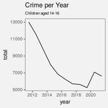

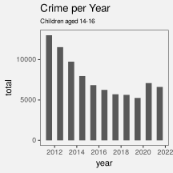

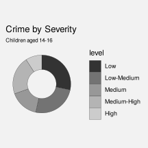

Three examples of data visualisations: a
line plot, a bar plot, and a donut chart.
:::

In this document, we will reduce that complexity in two ways.
First of all, we will not distinguish between different forms
of data visualisation;  scatter plots, bar plots, line plots, and
histograms are all just **data visualisations**.
Secondly, we will distinguish
between only three 
core components of a data visualisation: **data symbols**,
**guides**, and **labels**.[^terminology]

[^terminology]:  
  Gathering axes and legends together under the 
  generic label of "guides" is from the Grammar of Graphics [@wilkinson2005].

Data symbols
: Data symbols are the geometric shapes that represent data values,
for example, the lines in a line plot, the bars in a bar plot, and the
segments of an annulus in a donut plot (see @fig-data-symbols).
We will spend a lot of time looking at how data symbols work.

```{r}
#| echo: false
#| results: hide
#| message: false
scatterGeom <- scatter +
    geom_line(aes(yearDate, total), linewidth=1, colour=highlight) +
    theme(panel.border=element_rect(colour="grey"),
          plot.title=element_text(colour="grey"),
          plot.subtitle=element_text(colour="grey"),
          axis.ticks=element_line(colour="grey"),
          axis.text=element_text(colour="grey"),
          axis.title=element_text(colour="grey"))
barGeom <- bar + 
    geom_col(aes(yearDate, total), fill=highlight, width=250) +
    theme(panel.border=element_rect(colour="grey", fill=NA),
          plot.title=element_text(colour="grey"),
          plot.subtitle=element_text(colour="grey"),
          panel.grid.major.y=element_line(colour="grey80"),
          axis.ticks=element_line(colour="grey"),
          axis.text=element_text(colour="grey"),
          axis.title=element_text(colour="grey"))
pieGeom <- pie + 
    geom_rect(aes(xmin=xmin, ymin=ymin, xmax=xmax, ymax=ymax), 
              fill=highlight, colour="black", linewidth=.1) +
    scale_fill_manual(values=grey(.6 + .4*1:n/(n + 1))) +
    theme(plot.title=element_text(colour="grey"),
          plot.subtitle=element_text(colour="grey"),
          axis.ticks=element_line(colour="grey"),
          axis.text=element_text(colour="grey"),
          axis.title=element_text(colour="grey"),
          axis.ticks.y=element_blank(),
          axis.text.y=element_blank(),
          legend.text=element_text(colour="grey"),
          legend.title=element_text(colour="grey"))
```
```{r}
#| echo: false
#| results: hide
svg("Figures/line-plot-geom.svg", bg=figbg, width=3, height=3)
print(scatterGeom, newpage=FALSE)
dev.off()
svg("Figures/bar-plot-geom.svg", bg=figbg, width=3, height=3)
print(barGeom, newpage=FALSE)
dev.off()
svg("Figures/donut-plot-geom.svg", bg=figbg, width=3, height=3)
print(pieGeom, newpage=FALSE)
dev.off()
```

::: {#fig-data-symbols layout-ncol=3}

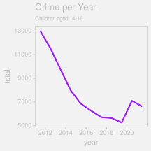

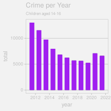

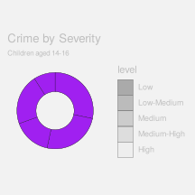

Three examples of data symbols: a line, some bars, and segments of an annulus.
:::

Guides
: Guides are the elements of a data visualisation that explain
how data values are represented, for examples the axes on a line plot
or bar plot and the legend on a donut plot (see @fig-guides).
We will see later that **guides have a lot in common with data symbols**.

```{r}
#| echo: false
#| results: hide
#| message: false
scatterGuide <- scatter +
    geom_line(aes(yearDate, total), linewidth=1, colour="grey90") +
    theme(panel.border=element_rect(colour="grey"),
          plot.title=element_text(colour="grey"),
          plot.subtitle=element_text(colour="grey"),
          axis.line=element_line(colour=highlight),
          axis.ticks=element_line(colour=highlight),
          axis.text=element_text(colour=highlight),          
          axis.title=element_text(colour="grey"))
barGuide <- bar + 
    geom_col(aes(yearDate, total), fill="grey90", col="grey90", width=200) +
    theme(panel.border=element_rect(colour="grey", fill=NA),
          plot.title=element_text(colour="grey"),
          plot.subtitle=element_text(colour="grey"),
          panel.grid.major.y=element_line(colour=highlight),
          axis.line=element_line(colour=highlight),
          axis.ticks=element_line(colour=highlight),
          axis.text=element_text(colour=highlight),          
          axis.title=element_text(colour="grey"))
pieGuide <- pie + 
    geom_rect(aes(xmin=xmin, ymin=ymin, xmax=xmax, ymax=ymax), 
              fill="grey90", colour="grey", linewidth=.1) +
    scale_fill_manual(values=colorRampPalette(c(highlight, lighten(highlight, .5)))(n)) +
    theme(plot.title=element_text(colour="grey"),
          plot.subtitle=element_text(colour="grey"),
          axis.ticks=element_line(colour="grey"),
          axis.text=element_text(colour="grey"),
          axis.title=element_text(colour="grey"),
          axis.ticks.y=element_blank(),
          axis.text.y=element_blank(),
          legend.text=element_text(colour=highlight),
          legend.title=element_text(colour="grey"))
```
```{r}
#| echo: false
#| results: hide
svg("Figures/line-plot-guide.svg", bg=figbg, width=3, height=3)
print(scatterGuide, newpage=FALSE)
dev.off()
svg("Figures/bar-plot-guide.svg", bg=figbg, width=3, height=3)
print(barGuide, newpage=FALSE)
dev.off()
svg("Figures/donut-plot-guide.svg", bg=figbg, width=3, height=3)
print(pieGuide, newpage=FALSE)
dev.off()
```

::: {#fig-guides layout-ncol=3}

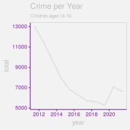

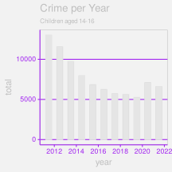

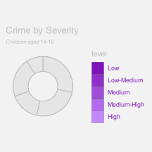

Three examples of guides: axes, grid lines, and a legend.
:::

Labels
: Labels are the 
text elements that provide context and background information
about a data visualisation (e.g., titles and captions).
Labels may also guide the viewer to the important properties of 
the data.
Notice that **not all text elements are labels**.

```{r}
#| echo: false
#| results: hide
#| message: false
scatterLabel <- scatter +
    geom_line(aes(yearDate, total), linewidth=1, colour="grey90") +
    theme(panel.border=element_rect(colour="grey"),
          plot.title=element_text(colour=highlight, face="bold"),
          plot.subtitle=element_text(colour=highlight, face="bold"),
          axis.ticks=element_line(colour="grey"),
          axis.text=element_text(colour="grey"),          
          axis.title=element_text(colour=highlight, face="bold"))
barLabel <- bar + 
    geom_col(aes(yearDate, total), fill="grey90", col="grey90", width=200) +
    theme(panel.border=element_rect(colour="grey", fill=NA),
          plot.title=element_text(colour=highlight, face="bold"),
          plot.subtitle=element_text(colour=highlight, face="bold"),
          panel.grid.major.y=element_line(colour="grey80"),
          axis.ticks=element_line(colour="grey"),
          axis.text=element_text(colour="grey"),          
          axis.title=element_text(colour=highlight, face="bold"))
pieLabel <- pie + 
    geom_rect(aes(xmin=xmin, ymin=ymin, xmax=xmax, ymax=ymax), 
              fill="grey90", colour="grey", linewidth=.1) +
    scale_fill_manual(values=grey(.6 + .4*1:n/(n + 1))) +
    theme(plot.title=element_text(colour=highlight, face="bold"),
          plot.subtitle=element_text(colour=highlight, face="bold"),
          axis.ticks=element_line(colour="grey"),
          axis.text=element_text(colour="grey"),
          axis.title=element_text(colour="grey"),
          axis.ticks.y=element_blank(),
          axis.text.y=element_blank(),
          legend.text=element_text(colour="grey"),
          legend.title=element_text(colour=highlight, face="bold"))
```
```{r}
#| echo: false
#| results: hide
svg("Figures/line-plot-label.svg", bg=figbg, width=3, height=3)
print(scatterLabel, newpage=FALSE)
dev.off()
svg("Figures/bar-plot-label.svg", bg=figbg, width=3, height=3)
print(barLabel, newpage=FALSE)
dev.off()
svg("Figures/donut-plot-label.svg", bg=figbg, width=3, height=3)
print(pieLabel, newpage=FALSE)
dev.off()
```

::: {#fig-labels layout-ncol=3}

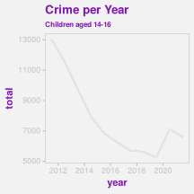

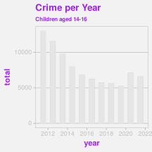

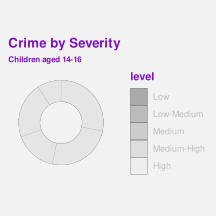

Examples of labels: the titles and sub-titles on all three plots;
the axis titles on the line plot and the bar plot; and the legend
title on the donut plot.
:::

## Mappings

Although we have reduced a data visualisation to just three components,
data symbols, 
guides, and labels, there are still many possible variations.
Which data symbols are being used?  How are
the axes labelled?  What colours are being used?
As much as possible, we are going to further reduce the design
of a data visualisation to a single question:
What **mappings** are being used?[^mappings]

For example, in the line plot of crime rates for
different ages in New Zealand in @fig-crime,
the data values are `year`, crime `rate`, and `age` 
(see @tbl-crime) and
the visual representation is a set of coloured lines.

[^mappings]: 
  The idea of "mapping" data values to visual representations is
  also from the Grammar of Graphics [@wilkinson2005].

We can describe this data visualisation in terms of a set of mappings
(see @fig-mappings-1):

* The `year` and `rate` values are mapped to the **position** of the
  lines (the x/y locations that the lines pass through).
  For example, the `year` 2011 and the `rate` 810 map to a position
  near the top-left corner of the plot, which provides the starting
  point for the green line.

* The `age` values are mapped to the **colour** of the lines.
  For example, the `age` 16 maps to the colour green.

::: {#fig-mappings-1 layout="[[1, -1], [1]]"}

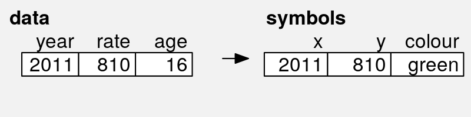


The data visualisation in @fig-crime can be described as a mapping
of `year`, `rate`, and `age` to `x` and `y` positions and `colour`.
The bottom image is an animation;  try refreshing the page or
viewing the image it in its own tab to rerun the
animation.
:::

The heatmap of the same data (see @fig-crime-heatmap) provides a different
visual representation because it involves a different
set of mappings (see @fig-mappings-2):

* The `year` and `age` values are mapped to the **position** of the rectangles.
  For example, the `year` 2011 and the `age` 16 map to a position
  in the top-left corner of the plot, which provides the location
  of the white rectangle.

* The `rate` values are mapped to the **colour** of the rectangles.
  For example, the `rate` 810 maps to white, while lower `rate` values
  map to progressively darker shades of purple.

::: {#fig-mappings-2 layout="[[1, -1], [1]]"}

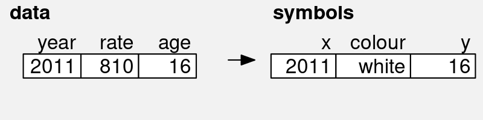


The data visualisation in @fig-crime-heatmap can be described as a mapping
of `year`, `rate`, and `age` to `x` position, `colour`, and `y` position.
The bottom image is an animation;  try refreshing the page or
viewing the image it in its own tab to rerun the
animation.
:::

We will spend a lot of time looking at different mappings from data values
to data symbols (@fig-mappings).  Understanding why some
mappings work better than others will help us to understand why
some data visualisations are more effective than others.

::: {#fig-mappings}


A data visualisation is largely defined by the **mappings** that it uses
to transform **data values** into **data symbols**.
:::

## Summary 

Data visualisations can be incredibly effective for presenting
important properties of data values.  However, any one data visualisation
can only be effective for certain data values and for certain data 
properties.

The goal of this document is to explain why some data visualisations
are more effective than others;  how data visualisation works. 

The important elements of a data visualisation are **data symbols**,
which are visual representations of the data values, **guides**, 
which explain how data values
are transformed to data symbols, and **labels**, which provide
context and guidance.

We can characterise a data visualisation in terms of the **mappings**
that it uses to transform data values into data symbols.

# The visual system {#sec-visual-system}

Understanding why some mappings are more effective than others will
depend upon an understanding of how the human visual system works.
The effectiveness of a mapping from data values to data symbols
will depend on how well we can map *back* from the data symbols
to the properties of the data (@fig-decode).

::: {#fig-decode}


The effectiveness of a data visualisation will depend on how
well our visual system can map from data symbols back to
properties of the data.
:::

In this section we will establish a very simple model of the visual system 
that we can refer to as we discuss different mappings.[^simple-visual-models]
We will add some more detail about the visual system as we
need to in later sections.

[^simple-visual-models]:
  Simple models the human visual system can be found in many books on
  data visualisation, for example, @cairo2012functional.
  See @ware2021information for a more in-depth,
  but still very accessible description.

## The eye

In order for us to perceive a data visualisation, light from the
data visualisation must enter the eye.  Light passes through the pupil, 
is focused by the lens, and is projected onto the retina at the back of
the eye.  The retina contains around 100 million light-sensitive
nerve cells and signals from those are combined into about 1 million
nerve fibres in the optic nerve, which passes signals on to the brain
(see @fig-eye).
A very large amount of visual information is gathered by the 
eye and passed on to the brain.

```{r}
#| echo: false
#| eval: false
#| label: eye-basic
## grid.newpage()
eyeball <- circleGrob(r=.3, gp=gpar(lwd=3, fill="grey90"))
eyeballNot <- as.path(grobTree(eyeball, rectGrob(width=1.5)), rule="evenodd")
pushViewport(viewport(width=unit(1, "snpc"), height=unit(1, "snpc"),
                      gp=gpar(lineheight=.9, fill=NA)))
grid.text("light", x=unit(0, "npc") - unit(2, "mm"), just="right")
grid.segments(0, .5,
              unit(.17, "npc") - unit(2, "mm"), .5,
              gp=gpar(lwd=3, fill="black"), 
              arrow=arrow(type="closed", length=unit(3, "mm")))
grid.draw(eyeball)
grid.define(circleGrob(r=.1), name="cornea", gp=gpar(lwd=3))
grid.define(circleGrob(r=.07), name="lens", gp=gpar(lwd=3, fill="white"))
pushViewport(viewport(clip=eyeballNot))
pushViewport(viewport(x=.22, width=.5))
grid.use("cornea")
popViewport(2)
pushViewport(viewport(x=.22, width=.5))
grid.use("lens")
popViewport()
grid.text("lens", x=unit(.25, "npc") + unit(2, "mm"), just="left")
pushViewport(viewport(clip=rectGrob(x=.5, height=.1, just="left")))
grid.circle(r=.28, gp=gpar(lwd=3))
popViewport()
grid.text("retina", x=.75, just="right")
pushViewport(viewport(clip=polygonGrob(c(.5, 1, 1), c(.5, -.2, 1.2))))
grid.circle(r=.28, gp=gpar(lwd=3))
popViewport()
pushViewport(viewport(clip=eyeballNot))
grid.segments(.5, .5, 1, .35, 
              gp=gpar(lwd=3, fill="black"),
              arrow=arrow(type="closed", length=unit(3, "mm")))
popViewport()
grid.text("optic\nnerve", y=.35, 
          x=unit(1, "npc") + unit(2, "mm"), just="left")
```

```{r}
#| echo: false
#| eval: false
#| label: eye-basic-2
## grid.newpage()
eyeball <- circleGrob(r=.3, gp=gpar(lwd=3, fill="grey90"))
eyeballNot <- as.path(grobTree(eyeball, rectGrob(width=1.5)), rule="evenodd")
pushViewport(viewport(width=unit(1, "snpc"), height=unit(1, "snpc"),
                      gp=gpar(lineheight=.9, fill=NA)))
grid.text("light", x=unit(0, "npc") - unit(2, "mm"), just="right")
grid.segments(0, .5,
              unit(.17, "npc") - unit(2, "mm"), .5,
              gp=gpar(lwd=3, fill="black"), 
              arrow=arrow(type="closed", length=unit(3, "mm")))
grid.draw(eyeball)
grid.define(circleGrob(r=.1), name="cornea", gp=gpar(lwd=3))
grid.define(circleGrob(r=.07), name="lens", gp=gpar(lwd=3, fill="white"))
pushViewport(viewport(clip=eyeballNot))
pushViewport(viewport(x=.22, width=.5))
grid.use("cornea")
popViewport(2)
pushViewport(viewport(x=.22, width=.5))
grid.use("lens")
popViewport()
pushViewport(viewport(clip=rectGrob(x=.5, height=.1, just="left")))
grid.circle(r=.28, gp=gpar(lwd=3))
popViewport()
grid.text("cones", x=.75, just="right")
pushViewport(viewport(clip=polygonGrob(c(.5, 1, 1), c(.5, .65, 1.2))))
grid.circle(r=.28, gp=gpar(lwd=3))
popViewport()
grid.text("rods", x=.7, y=.65, just="right")
pushViewport(viewport(clip=polygonGrob(c(.5, 1, 1), c(.5, .3, -.2))))
grid.circle(r=.28, gp=gpar(lwd=3))
popViewport()
grid.text("rods", x=.7, y=.35, just="right")
pushViewport(viewport(clip=eyeballNot))
grid.segments(.5, .5, 1, .35, 
              gp=gpar(lwd=3, fill="black"),
              arrow=arrow(type="closed", length=unit(3, "mm")))
popViewport()
grid.text("brain\nthis\nway", y=.35, 
          x=unit(1, "npc") + unit(2, "mm"), just="left")
```

```{r}
#| echo: false
#| results: hide
svg("Figures/eye-basic.svg", bg=figbg, width=4, height=3)
<<eye-basic>>
dev.off()
svg("Figures/eye-basic-2.svg", bg=figbg, width=4, height=3)
<<eye-basic-2>>
dev.off()
```

::: {#fig-eye}


A very simple diagram of the human eye.  Light enters via the pupil and
is focused by the lens onto retina.  Light-sensitive neurons pass 
signals via the optic nerve to the brain.
:::

## Visual processing

The processing of the 
signals from the optic nerve occurs in several areas of the brain.
Very basic **visual features** are extracted first, such as 
**position** (spatial arrangements), **angle** (orientations), **colour**,
and simple **patterns** (spatial frequencies).
This low-level information is passed on and built upon
to produce higher-level representations, such as regions and **shapes**.
Information is then also integrated from prior knowledge to assist with
the identification of **objects**---things like trees, animals, and faces.

::: {#fig-visual-processing}


A very simple model of visual processing. 
:::

Lower-level processing occurs subconsciously and more rapidly than higher-level
processing, which can require cognitive effort
(see @fig-visual-model).  Furthermore, lower-level
processing occurs in parallel and can involve many instances of visual 
features at once, whereas higher-level processing will only focus on one
or a few items.  On the other hand, lower-level visual features are rapidly
discarded as our attention shifts, while higher-level visual objects are more
persistent and may become part of long-term memories.  

::: {#fig-visual-model}


Some of the properties of visual processing. 
:::

## Summary

The human visual system captures a large amount of information from the
visual field.  Large numbers of simple features are rapidly extracted,
while more complex visual elements take longer and require more 
congnitive effort, but persist for longer.

# Mapping to Visual Features

We have established that the mappings from data values to data symbols
are fundamental to a data visualisation.  However, there are many 
possible mappings to choose from.
In this section, we begin with
the simplest sort of mapping:
each data value is mapped to a basic **visual feature** of a data symbol
and the interesting properties of the data are the raw data values
themselves
(@fig-visual-feature).  

::: {#fig-visual-feature layout-ncol=2}

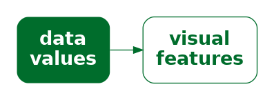

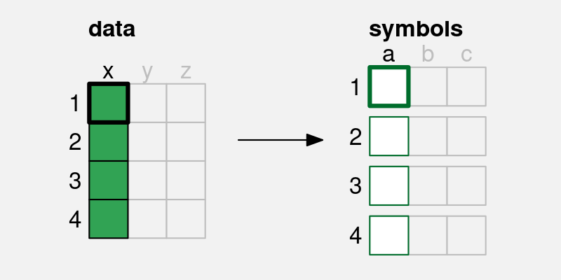

A simple data visualisation maps each data value to a **visual feature**
of a data symbol.  Each data value (`a`) is mapped to a visual
feature (`x`) of a single data symbol.
:::

## Visual features

In order to demonstrate this sort of mapping,
we will work with a data visualisation of
the `total` number of
crimes for different ethnic `group`s.  The data values are shown
in @tbl-crime-group-total.

```{r}
#| echo: false
#| message: false
#| label: tbl-crime-group-total
#| tbl-colwidths: [20,20]
#| tbl-cap: A table of the total number of offenders aged 14 to 16 from 2011 to 2021 for different ethnic groups.  
crimeGroupTotalTable <- subset(crimeGroupTotal, select=c("group", "total"))
kable_styling(kable(crimeGroupTotalTable, 
                    table.attr='data-quarto-disable-processing="true"'),
              bootstrap_options=c("basic", "hover"), 
              full_width=FALSE)
```

A bar plot of these data is shown in @fig-bar.
This is a very effective way to visualise the total values,
particularly if we are interested in comparing the raw totals.
With this data visualisation, it is very easy to answer 
questions like the following:

* Which ethnic group has the largest total number of offenders?
* Is the total number of offenders higher for `Māori` or `Pasifika`?
* Is the total number of offenders for `European/Other` more or less
  than half the total for `Māori`?

```{r}
#| echo: false
#| label: fig-bar
#| fig-cap: A bar plot of number of crimes for different ethnic groups. The data symbols in this plot are the horizontal bars.
ggplot(crimeGroupTotal) + 
    geom_col(aes(x=total, y=group)) +
    scale_x_continuous(expand=expansion(c(0, .05))) +
    theme(aspect.ratio=1)
```

Why is the data visualisation in @fig-bar so effective?

> One reason why a bar plot is an effective data visualisation is 
  that is involves a **mapping** from **data values** 
  to basic **visual features**,
  which are processed rapidly and subconsciously by our visual system.
  
The data symbols in @fig-bar 
are a set of rectangles or bars.
However, the important visual feature of the rectangles is their
**length**;  the thickness of the bars does not relate to the data 
values at all (see @fig-length).
The `total` number of crimes for each ethnic group 
is represented by the length of a rectangle.  Each data value
is mapped to the length of one rectangle.

```{r}
#| echo: false
#| label: fig-length
#| fig-cap: A bar plot of number of crimes for different ethnic groups. The data values, the `total` number of crimes, have been mapped to the **lengths** of the bars (the purple lines).
ggplot(crimeGroupTotal) + 
    geom_col(aes(x=total, y=group), fill="grey") +
    scale_x_continuous(expand=expansion(c(0, .05))) +
    geom_segment(aes(xend=total, y=group, yend=group), x=0, 
                 color=highlight, linewidth=1,
                 arrow=arrow(angle=15, length=unit(3, "mm"), ends="both")) +
    theme(panel.border=element_rect(colour="grey", fill=NA),
          plot.title=element_text(colour="grey"),
          plot.subtitle=element_text(colour="grey"),
          axis.ticks=element_line(colour="grey"),
          axis.text=element_text(colour="grey"),
          axis.title=element_text(colour="grey"),
          aspect.ratio=1)
```

There is another mapping being used in @fig-bar:
The crime `group` is mapped to the vertical **positions** of the bars
(see @fig-position).  Each `group` value is mapped to the 
vertical position of one rectangle.

```{r}
#| echo: false
#| label: fig-position
#| fig-cap: A bar plot of number of crimes for different ethnic groups. The data values, the ethnic `group`s, have been mapped to the **positions** of the bars (the purple dots).
ggplot(crimeGroupTotal) + 
    geom_col(aes(x=total, y=group), fill="grey") +
    scale_x_continuous(expand=expansion(c(0, .05))) +
    geom_point(aes(y=group), x=0, color=highlight, size=3) +
    coord_cartesian(clip="off") +
    theme(panel.border=element_rect(colour="grey", fill=NA),
          plot.title=element_text(colour="grey"),
          plot.subtitle=element_text(colour="grey"),
          axis.ticks=element_line(colour="grey"),
          axis.text=element_text(colour="grey"),
          axis.title=element_text(colour="grey"),
          aspect.ratio=1)
```

**Length** and **position** are examples of basic visual features.
@fig-visual-features shows some other examples of basic visual features.
Part of the reason why a
bar plot is effective is because basic visual features are 
identified rapidly and without conscious effort by our visual system.

```{r}
#| echo: false
#| label: fig-visual-features
#| fig-cap: Some examples of basic visual features are **position**, **length**, **angle**, **area**, **colour**, and **shape**.
grid.newpage()
pushViewport(viewport(layout=grid.layout(6, 2, widths=1:2), gp=gpar(cex=1.5)))
pushViewport(viewport(layout.pos.row=1, layout.pos.col=2))
grid.text("position", x=0, just="right")
grid.segments(.2, .5, .8, .5, gp=gpar(lwd=2))
grid.segments(.2, .4, .2, .6, gp=gpar(lwd=2))
grid.segments(.8, .4, .8, .6, gp=gpar(lwd=2))
grid.circle(c(.3, .6), .7, r=unit(1, "mm"), gp=gpar(fill="black"))
popViewport()
pushViewport(viewport(layout.pos.row=2))
grid.rect(gp=gpar(col=NA, fill="grey90"))
popViewport()
pushViewport(viewport(layout.pos.row=2, layout.pos.col=2))
grid.text("length", x=0, just="right")
grid.rect(.2, c(.3, .7), c(.1, .4), .2, just="left", gp=gpar(fill="black"))
popViewport()
pushViewport(viewport(layout.pos.row=3, layout.pos.col=2))
grid.text("angle", x=0, just="right")
grid.lines(c(.55, .45, .55) - .2, c(.6, .4, .4), gp=gpar(lwd=2))
grid.lines(c(.55, .45, .55) + .2, c(.8, .4, .4), gp=gpar(lwd=2))
popViewport()
pushViewport(viewport(layout.pos.row=4))
grid.rect(gp=gpar(col=NA, fill="grey90"))
popViewport()
pushViewport(viewport(layout.pos.row=4, layout.pos.col=2))
grid.text("area", x=0, just="right")
grid.circle(c(.3, .7), .5, r=unit(c(1, 3), "mm"), gp=gpar(fill="black"))
popViewport()
pushViewport(viewport(layout.pos.row=5, layout.pos.col=2))
grid.text("colour", x=0, just="right")
grid.circle(c(.3, .7), .5, r=unit(2, "mm"), gp=gpar(fill=2:3))
popViewport()
pushViewport(viewport(layout.pos.row=6))
grid.rect(gp=gpar(col=NA, fill="grey90"))
popViewport()
pushViewport(viewport(layout.pos.row=6, layout.pos.col=2))
grid.text("shape", x=0, just="right")
grid.points(c(.3, .7), c(.5, .5), size=unit(4, "mm"), pch=3:4, gp=gpar(lwd=2))
popViewport()
```

## Quantitative features

As we discussed in @sec-visual-system, the real purpose of mapping
data values to data symbols is to make use of the visual system
to map *back* to the data values.  In this section, we are considering
mappings from data values to basic visual features, so we
need to consider how well we are able to map back **from 
visual features** to **data values** (@fig-visual-feature-decode).

::: {#fig-visual-feature-decode}

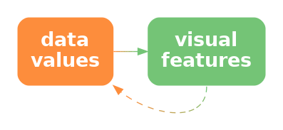

When we map data values to visual features, we want to map 
to a visual feature that allows us to map back to the data values.
:::

One issue to consider is whether a visual feature is able to
represent all of the information in the data values.[^matching-data-type]
Some types of data contain more information than others:

[^matching-data-type]:
  The idea of matching the type of data---nominal, ordinal, interval, or
  ratio---as well as the categorisation of visual feature types
  is from @zhang1996representational.

* **Quantitative** data consists of numeric values, which naturally
  possess not only an ordering, but information about the size
  of differences between values.  For example, 
  the `year` 2020 comes after the year 2010 and there is a gap
  of 10 years in between.  **Ratio** data also contains a 
  "zero" reference value, so there is also information
  about absolute size and ratios of differences.
  For example, 200 offenders is twice as many as 100 offenders.

* **Qualitative** data consists of categorical values that are typically
  character values.  **Ordinal** data consists of categories that
  are ordered, but there is no information about the size of differences.
  For example, a "high" crime level is more severe than a "medium"
  crime level, which is more severe than a "low" crime level, but 
  we cannot measure the size of the differences.
  **Nominal** data consists of just group labels,
  e.g., ethnic groups, and the only information we have is that the
  categories are different from each other.

@fig-quant-features shows that **position**, **length**, **angle**,
and **area** are visual features that are capable of representing
**quantitative** data values.
For example, a bar that is twice as high as another bar 
comfortably represents a data value that is twice as much as another
data value.
All but **position** also possess
a natural representation of zero.  

```{r}
#| echo: false
#| label: fig-quant-features
#| fig-height: 3
#| fig-cap: The visual features position, length, area, and angle are all appropriate visual features for visualising quantitative data values.
## grid.newpage()
vp2 <- viewport(width=.9, y=unit(3, "lines"), 
                height=unit(1, "npc") - unit(6, "lines"), 
                just="bottom")
pushViewport(viewport(layout=grid.layout(1, 5)))
pushViewport(viewport(layout.pos.col=1),
             vp2)
## grid.segments(1, 0, 1, 1)
grid.segments(unit(1, "npc") - unit(2, "mm"), c(0, .5, 1), 
              unit(1, "npc") + unit(2, "mm"), c(0, .5, 1),
              arrow=arrow(type="closed", angle=15, length=unit(2, "mm")), 
              gp=gpar(fill="black"))
grid.text(c("(zero) 0", "(amount) 10", "(twice) 20"),
          unit(1, "npc") - unit(4, "mm"), c(0, .5, 1),
          just="right")
popViewport(2)
pushViewport(viewport(layout.pos.col=2),
             vp2)
grid.segments(.5, 0, .5, 1, gp=gpar(lty="dotted"))
grid.points(rep(.5, 3), c(0, .5, 1), pch=16, size=unit(4, "mm"))
grid.text("position", y=unit(-1, "lines"))
popViewport(2)
pushViewport(viewport(layout.pos.col=3),
             vp2)
grid.rect(1:3/4, 0, .2, c(0, .5, 1), gp=gpar(fill="black"), just="bottom")
grid.text("length", y=unit(-1, "lines"))
popViewport(2)
pushViewport(viewport(layout.pos.col=4),
             vp2)
grid.circle(.5, c(0, .5, 1), r=unit(sqrt(.5*c(0.001, .5, 1)), "cm"),
            gp=gpar(fill="black"))
grid.text("area", y=unit(-1, "lines"))
popViewport(2)
pushViewport(viewport(layout.pos.col=5),
             vp2)
grid.lines(unit(.5, "npc") + unit(c(-4, -4, 4), "mm"),
           unit(1, "npc") + unit(c(4, -4, -4), "mm"),
           gp=gpar(lwd=3))
grid.lines(unit(.5, "npc") + unit(c(2, -4, 4), "mm"),
           unit(.5, "npc") + unit(c(2, -4, -4), "mm"),
           gp=gpar(lwd=3))
grid.segments(unit(.5, "npc") + unit(-4, "mm"), 0,
              unit(.5, "npc") + unit(4, "mm"), 0,
              gp=gpar(lwd=3))
grid.text("angle", y=unit(-1, "lines"))
popViewport(2)
```

By contrast, @fig-not-quant shows that **colour** and **shape** are
*not* capable of representing quantitative values.  For example,
the colour blue is not twice the colour green and
a plus sign is not 10 more than a triangle.
In effect, the visual representation *loses* information.

```{r}
#| echo: false
#| label: fig-not-quant
#| fig-height: 3
#| fig-cap: The visual features **colour** and **shape** are not capable of visualising quantitative data values.
vp2 <- viewport(width=.9, y=unit(3, "lines"), 
                height=unit(1, "npc") - unit(6, "lines"), 
                just="bottom")
pushViewport(viewport(layout=grid.layout(1, 5)))
pushViewport(viewport(layout.pos.col=1),
             vp2)
## grid.segments(1, 0, 1, 1)
grid.segments(unit(1, "npc") - unit(2, "mm"), c(0, .5, 1), 
              unit(1, "npc") + unit(2, "mm"), c(0, .5, 1),
              arrow=arrow(type="closed", angle=15, length=unit(2, "mm")), 
              gp=gpar(fill="black"))
grid.text(c("(zero) 0", "(amount) 10", "(twice) 20"),
          unit(1, "npc") - unit(4, "mm"), c(0, .5, 1),
          just="right")
popViewport(2)
pushViewport(viewport(layout.pos.col=2),
             vp2)
cols <- hcl.colors(3, "harmonic")
grid.points(rep(.5, 3), c(0, .5, 1), pch=21, size=unit(7, "mm"),
            gp=gpar(col="black", fill=cols))
grid.text("colour", y=unit(-1, "lines"))
popViewport(2)
pushViewport(viewport(layout.pos.col=3),
             vp2)
grid.points(rep(.5, 3), c(0, .5, 1), pch=2:4, size=unit(5, "mm"),
            gp=gpar(lwd=2))
grid.text("shape", y=unit(-1, "lines"))
popViewport(2)
```

The bar plot in @fig-bar uses maps the `total` number of offenders,
which are quantitative data values, to the
**length** of bars, which is a quantitative visual feature.

> One reason why a bar plot is effective for visualising
  **quantitative data values** is because the quantitative data values,
  the counts,
  are mapped to a **quantitative visual feature**, the lengths of the bars.

## Qualitative features

If we have **qualitative** data, 
@fig-qual-features shows that **position**, **colour**, and **shape**
are capable of representing categorical data values.

```{r}
#| echo: false
#| label: fig-qual-features
#| fig-height: 3
#| fig-cap: The visual features **colour**, **shape**, and **position** are capable of representing different groups.
vp2 <- viewport(width=.9, y=unit(3, "lines"), 
                height=unit(1, "npc") - unit(6, "lines"), 
                just="bottom")
pushViewport(viewport(layout=grid.layout(1, 5)))
pushViewport(viewport(layout.pos.col=1),
             vp2)
## grid.segments(1, 0, 1, 1)
grid.segments(unit(1, "npc") - unit(2, "mm"), c(.2, .5, .8), 
              unit(1, "npc") + unit(2, "mm"), c(.2, .5, .8),
              arrow=arrow(type="closed", angle=15, length=unit(2, "mm")), 
              gp=gpar(fill="black"))
grid.text(c("Group A", "Group B", "Group C"),
          unit(1, "npc") - unit(4, "mm"), c(.2, .5, .8),
          just="right")
popViewport(2)
pushViewport(viewport(layout.pos.col=2),
             vp2)
cols <- hcl.colors(3, "harmonic")
grid.points(rep(.5, 3), c(.2, .5, .8), pch=21, size=unit(5, "mm"),
            gp=gpar(col="black", fill=cols))
grid.text("colour", y=unit(-1, "lines"))
popViewport(2)
pushViewport(viewport(layout.pos.col=3),
             vp2)
grid.points(rep(.5, 3), c(.2, .5, .8), pch=2:4, size=unit(5, "mm"),
            gp=gpar(lwd=2))
grid.text("shape", y=unit(-1, "lines"))
popViewport(2)
pushViewport(viewport(layout.pos.col=4),
             vp2)
grid.rect(rep(.2, 3), c(.2, .5, .8), width=c(.6, .6, .6), height=.1,
          just="left", gp=gpar(fill="black"))
grid.text("position", y=unit(-1, "lines"))
popViewport(2)
```

By contrast, @fig-not-qual shows that **length**, **area**, and **angle**
are not appropriate for representing qualitative data values.  In this
case, the visual features imply an inherent order, which is misleading
because that *adds* information that is not present in the data values.

```{r}
#| echo: false
#| label: fig-not-qual
#| fig-height: 3
#| fig-cap: The visual features **length**, **area**, and **angle** are not appropriate for representing qualitative data values because they imply an ordering of data values that have no inherent order.
vp2 <- viewport(width=.9, y=unit(3, "lines"), 
                height=unit(1, "npc") - unit(6, "lines"), 
                just="bottom")
pushViewport(viewport(layout=grid.layout(1, 5)))
pushViewport(viewport(layout.pos.col=1),
             vp2)
## grid.segments(1, 0, 1, 1)
grid.segments(unit(1, "npc") - unit(2, "mm"), c(.2, .5, .8), 
              unit(1, "npc") + unit(2, "mm"), c(.2, .5, .8),
              arrow=arrow(type="closed", angle=15, length=unit(2, "mm")), 
              gp=gpar(fill="black"))
grid.text(c("Group A", "Group B", "Group C"),
          unit(1, "npc") - unit(4, "mm"), c(.2, .5, .8),
          just="right")
popViewport(2)
pushViewport(viewport(layout.pos.col=2),
             vp2)
grid.rect(1:3/4, 0, .2, c(.2, .5, .8), just="bottom", gp=gpar(fill="black")) 
grid.text("length", y=unit(-1, "lines"))
popViewport(2)
pushViewport(viewport(layout.pos.col=3),
             vp2)
grid.circle(.5, c(.2, .5, .8), r=unit(sqrt(.5*c(.2, .5, .8)), "cm"),
            gp=gpar(fill="black"))
grid.text("area", y=unit(-1, "lines"))
popViewport(2)
pushViewport(viewport(layout.pos.col=4),
             vp2)
grid.lines(unit(.5, "npc") + unit(c(0, 0), "mm"),
           unit(.8, "npc") + unit(c(4, -4), "mm"),
           gp=gpar(lwd=3))
grid.lines(unit(.5, "npc") + unit(c(-4, 4), "mm"),
           unit(.5, "npc") + unit(c(-4, 4), "mm"),
           gp=gpar(lwd=3))
grid.segments(unit(.5, "npc") + unit(-4, "mm"), .2,
              unit(.5, "npc") + unit(4, "mm"), .2,
              gp=gpar(lwd=3))
grid.text("angle", y=unit(-1, "lines"))
popViewport(2)
```

The bar plot in @fig-bar maps the ethnic `group`s, which are
qualitative data values, to the **position** of bars, which is
a qualitative visual feature.

> One reason why a bar plot is effective for visualising
  **qualitative data values** is because the qualitative data values,
  the groups, 
  are mapped to a **qualitative visual feature**, the positions of the bars.

## Accuracy

Another issue that impacts on how well we can map *back* from
a visual feature to the data values (@fig-visual-feature-decode)
is the **accuracy** with which we can perceive quantitative values
from visual features.  For example, how well can we perceive the size of the
difference between the length of two bars?[^accuracy-research]

[^accuracy-research]:
  The pioneering work on the accuracy of different visual features
  for statistical graphics was carried out by @cleveland1984graphical.
  Their results have been supported several times in subsequent 
  studies, including @heer2010crowdsourcing.

@fig-accuracy shows the established ordering of the accuracy
of basic visual features,
with more accurate visual features at the top.

```{r}
#| echo: false
#| label: fig-accuracy
#| fig-cap: An ordering of basic visual features in terms of their accuracy, with more accurate at the top.
grid.newpage()
pushViewport(viewport(layout=grid.layout(6, 2, widths=1:2), gp=gpar(cex=1.5)))
pushViewport(viewport(layout.pos.row=1, layout.pos.col=2))
grid.text("position", x=0, just="right")
grid.segments(.2, .5, .8, .5, gp=gpar(lwd=2))
grid.segments(.2, .4, .2, .6, gp=gpar(lwd=2))
grid.segments(.8, .4, .8, .6, gp=gpar(lwd=2))
grid.circle(c(.3, .6), .7, r=unit(1, "mm"), gp=gpar(fill="black"))
popViewport()
pushViewport(viewport(layout.pos.row=2))
grid.rect(gp=gpar(col=NA, fill="grey90"))
popViewport()
pushViewport(viewport(layout.pos.row=2, layout.pos.col=2))
grid.text("length", x=0, just="right")
grid.rect(.2, c(.3, .7), c(.1, .4), .2, just="left", gp=gpar(fill="black"))
popViewport()
pushViewport(viewport(layout.pos.row=3, layout.pos.col=2))
grid.text("angle", x=0, just="right")
grid.lines(c(.55, .45, .55) - .2, c(.6, .4, .4), gp=gpar(lwd=2))
grid.lines(c(.55, .45, .55) + .2, c(.8, .4, .4), gp=gpar(lwd=2))
popViewport()
pushViewport(viewport(layout.pos.row=4))
grid.rect(gp=gpar(col=NA, fill="grey90"))
popViewport()
pushViewport(viewport(layout.pos.row=4, layout.pos.col=2))
grid.text("area", x=0, just="right")
grid.circle(c(.3, .7), .5, r=unit(c(1, 3), "mm"), gp=gpar(fill="black"))
popViewport()
pushViewport(viewport(layout.pos.row=5, layout.pos.col=2))
grid.text("colour", x=0, just="right")
grid.circle(c(.3, .7), .5, r=unit(2, "mm"), 
            gp=gpar(fill=hcl(240, c(40, 70), c(40, 70))))
popViewport()
pushViewport(viewport(layout.pos.row=6))
grid.rect(gp=gpar(col=NA, fill="grey90"))
popViewport()
pushViewport(viewport(layout.pos.row=6, layout.pos.col=2))
grid.text("shape", x=0, just="right")
grid.points(c(.3, .7), c(.5, .5), size=unit(4, "mm"), 
            pch=c(4, 8), gp=gpar(lwd=2))
popViewport()
```

The bar plot in @fig-bar maps the `total` number of offenders,
quantitative values, to the **length** of bars, which is an
**accurate** visual feature.  This means that viewers can make
accurate comparisons between
the lengths of the bars.

> One reason why a bar plot is effective for visualising
  **quantitative data values** is because the quantitative data values,
  the counts,
  are mapped to a very **accurate visual feature**, the lengths of the bars.

## Capacity

When we are visualising **qualitative** data values, we are no longer
concerned with accurately perceiving the size of differences or ratios;
all we are concerned with is perceiving whether two values are 
different.  For example, can we perceive a difference between two colours?

The issue in this scenario is the **capacity** of a visual feature:
how many different categories can be represented (and still perceived
as clearly different from each other).

@fig-colour-cap shows that **colour** has a limited capacity.
A small number of different colours are very easy to differentiate,
but the differences become harder to perceive with a greater number
of colours.

```{r}
#| echo: false
#| label: fig-colour-cap
#| fig-height: 3
#| fig-cap: Mapping qualitative data values to colour works well for a small number of colours, but less well for a large number of colours.
pie <- function(n) {
    t <- rev(seq(0, 2*pi, length.out=100*n) + pi/2)
    cols <- scales::hue_pal()(n)
    for (i in 1:n) {
        index <- 1:100 + (i-1)*100
        x <- cos(t[index])
        y <- sin(t[index])
        grid.polygon(c(.5, .5 + .3*x), c(.5, .5 + .3*y), 
                     gp=gpar(col=figbg, lwd=4, fill=cols[i]))
        grid.text(letters[i], .5 + mean(.25*x), .5 + mean(.25*y),
                  gp=gpar(cex=1))
    }
}
pushViewport(viewport(layout=grid.layout(1, 3, respect=TRUE)))
pushViewport(viewport(layout.pos.col=1))
pie(3)
popViewport()
pushViewport(viewport(layout.pos.col=2))
pie(7)
popViewport()
pushViewport(viewport(layout.pos.col=3))
pie(11)
popViewport()
```

By contrast, @fig-pos-cap shows that **position** has a very large
capacity.  We can easily differentiate between locations even as the
number of locations becomes large.

```{r}
#| echo: false
#| label: fig-pos-cap
#| fig-height: 3
#| fig-cap: Mapping qualitative data values to position works well for both a small number of positions and for a large number of positions.
bars <- function(n) {
    h <- 3
    y <- unit(.5, "npc") + unit((h + 3)*(seq(1:n) - n/2), "mm")
    grid.rect(.5, y, .3, unit(h, "mm"), gp=gpar(fill="grey"))
    grid.text(rev(letters[1:n]), unit(.35, "npc") - unit(.5, "lines"), y)
}
pushViewport(viewport(layout=grid.layout(1, 3, respect=TRUE)))
pushViewport(viewport(layout.pos.col=1))
bars(3)
popViewport()
pushViewport(viewport(layout.pos.col=2))
bars(7)
popViewport()
pushViewport(viewport(layout.pos.col=3))
bars(11)
popViewport()
```

The bar plot in @fig-bar maps the ethnic `group` to the
**position** of bars, which makes it easy to differentiate between
the different ethnic groups.

> One reason why a bar plot is effective for visualising
  **qualitative data values** is because the qualitative data values,
  the groups,
  are mapped to a visual feature that has excellent **capacity**, 
  the positions of the bars.

## Case study: Dot plots

```{r}
#| echo: false
#| label: fig-dot
#| fig-cap: A dot plot of the number of crimes for different ethnic groups. The data symbols in this plot are the data points.
ggplot(crimeGroupTotal) + 
    geom_segment(aes(x=-Inf, xend=Inf, y=group, yend=group), 
                 linetype="dotted") +
    geom_point(aes(x=total, y=group)) +
    theme(aspect.ratio=1)
```

## Case study: Pie charts

```{r}
#| echo: false
#| label: fig-pie
#| fig-cap: A pie chart of the number of crimes for different ethnic groups. The data symbols in this plot are the pie wedges.
ggplot(crimeGroupTotal) + 
    geom_col(aes(x=total, y="", fill=group), colour="black") +
    coord_polar() +
    theme(aspect.ratio=1,
          axis.title.y=element_blank(),
          axis.ticks.y=element_blank())
```

## Summary

A bar plot is a very common data visualisation for representing 
numeric values, particularly counts,
for several different groups.
There are several reasons why bar plots work so well:

* A bar plot maps data values 
  to basic visual features, which are perceived rapidly and
  without cognitive effort.
* A bar plot maps the quantitative counts to a quantitative visual feature
  (length) and the qualitative groups to a qualitative visual feature
  (position).
* A bar plot maps the counts to a visual feature that is perceived
  very accurately (length) and the groups to a visual feature
  that has a high capacity (position).

Dot plots are also very effective for the same scenario for the same
reasons, except that a dot plot uses **position** instead of length
to represent the numeric values.

Pie charts by comparison have some weaknesses:

* A pie chart maps quantitative counts to **angle** and/or **area**, 
  which is less accurate.
* A pie chart maps qualitative groups to **colour**, which has a lower capacity.

# TODO

* colour (hue, chroma, luminance)
* ordinal visual features (chroma and luminance)
* CVD
* distance effect
* visual illusions

&nbsp;
