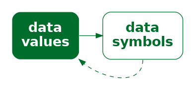

```{r}
#| echo: false
#| message: false
source("common.R")
```

# Introduction {#sec-intro}

::: {.actual-quote}

*Visualization is essentially a mapping process from computer representations
to perceptual representations, choosing encoding techniques to maximize human
understanding and communication.*[^definition]
:::

[^definition]:
    This quote is from an early web resource on data visualisation
    that was produced by the ACM SIGGRAPH Education Committee [@owen1999].

A data visualisation presents data values in a visual
format.  In an effective data visualisation, this allows
properties of the data to be perceived very rapidly and without 
conscious effort.
For example, @tbl-crime shows data on the crime rate for
youth offenders in New Zealand, for the ages 14 to 16, for 
each year from 2011 to 2021.  With this purely text-based, tabular
presentation of the data, it requires considerable time and effort
to determine any trends in the crime rates.

```{r}
#| echo: false
#| message: false
#| label: tbl-crime
#| tbl-cap: A table of the number of distinct youth offenders, per 10,000 of popuplation, aged 14 to 16 from 2011 to 2021.  It is difficult to perceive trends in the crime rates from this purely text-based, tabular presentation of the data.

crimeTable <- dcast(crimeAgeSimple[c("age", "year", "rate")],
                    age ~ year)
kable(crimeTable, digits=0)
```

By contrast, with a simple line 
plot data visualisation like @fig-crime we can perceive the trends like
the decrease in crime rates easily and immediately.
It is also easy to perceive more detailed properties like the fact that
the trend in crime rates for 16-year-olds is not completely monotonic
and the fact that
the crime rate for 15-year-olds (the blue line) is always greater than
the crime rate for 14-year-olds (the red line) 
and less than the crime rate for 16-year-olds (the green line).

```{r}
#| echo: false
#| label: crime-age-line
#| output: false
gg <- ggplot(crimeAgeSimple) +
    geom_line(aes(x=year, y=rate, colour=ageFactor))
```

```{r}
#| echo: false
#| label: fig-crime
#| fig-cap: A line plot of the crime rate amongst youth offenders aged 14 to 16 from 2011 to 2021.  Detecting trends in the crime rates is very fast and easy with this data visualisation.
gg <- 
<<crime-age-line>>
ggCrimeAge <- gg +
    scale_x_continuous(breaks=seq(2012, 2020, 2)) +    
    scale_colour_discrete(name="age") +
    crimeAgeLineTitle +
    crimeAgeLineXlab +
    crimeAgeLineYlab +
    theme(panel.grid.major.y=element_line(colour="black", linewidth=.1),
          aspect.ratio=1)
pushViewport(viewport(width=.9, height=.9))
print(ggCrimeAge, newpage=FALSE)
popViewport()
```

@fig-crime-heatmap shows a different data visualisation of the same data,
this time a heatmap.
If we use a data visualisation
like @fig-crime-heatmap, 
while very basic trends are apparent, like an overall decrease in crime rate,
perceiving detailed changes in the crime rates is very much harder
compared to @fig-crime.
In other words,
not all data visualisations are equally effective.

```{r}
#| echo: false
crimeAgeHeatTitle <- ggtitle("Youth Crime in New Zealand",
                             "Distinct offenders per 10,000 pop.")
crimeAgeHeatXlab <- xlab(NULL)
```

```{r}
#| echo: false
#| label: fig-crime-heatmap
#| fig-cap: A heatmap of the crime rate amongst youth offenders aged 14 to 16 from 2011 to 2021.  Some basic trends are visible, but details are harder to perceive compared to @fig-crime.
gg <- ggplot(crimeAgeSimple) +
    geom_tile(aes(year, age, fill=rate), colour=NA) +
    crimeAgeHeatTitle +
    crimeAgeHeatXlab +
    scale_x_continuous(expand=expansion(0), breaks=seq(2012, 2020, 2)) +    
    scale_y_continuous(expand=expansion(0), breaks=14:16) +
    theme(aspect.ratio=1)
pushViewport(viewport(width=.9, height=.9))
print(gg, newpage=FALSE)
popViewport()
```

Although @fig-crime is very effective for perceiving 
trends in crime rates for each age group, 
it may be less effective if we are interested
in a different question, for example, whether the *total* crime
rate is completely monotonic.  Does the *sum* of the red, blue, and green
lines always decrease year on year?
In other words,
a single data visualisation cannot be effective for all possible questions.

Suppose that we are interested in what the *exact* crime rate was 
for 16-year-olds in 2011.  Neither @fig-crime nor @fig-crime-heatmap is
the best option for answering this quesion.  The best option in this
case is actually @tbl-crime. 

What makes a data visualisation effective?
Why are some data visualisations more effective than others?
The purpose of this book is to provide explanations for
why, when, and how data visualisation works.  

## Two big ideas: Encoding and decoding {#sec-encodings}

@fig-crime and @fig-crime-heatmap are examples of different
types of data visualisation, a line plot and a heatmap respectively.
We will explore many different types of data visualisations
throughout the book, but rather than address each type of 
data visualisation on its own, we want to identify underlying 
concepts that will help to explain how all data visualisations work.

One concept that we will lean on very heavily is
the idea of **encodings**:
how is information being converted 
into a visual representation?[^encodings]

[^encodings]: 
    The idea of characterising a data visualisation as a set
    of *encodings* from data values to visual representations aligns
    with the idea of *mappings* from @layered-grammar.

The most obvious encoding in a data visualisation involves the
encoding of **data values** to **data symbols** (@fig-encodings).
For example, in @fig-crime, all of the data values for 14-year-olds,
the number of offenders for each year, have been encoded to an orange 
line.  The data values for 15-year-olds have been encoded to 
a blue line and the data values for 16-year-olds have been encoded 
to a green line. 
In other words, each row of @tbl-crime is encoded to a 
separate coloured line.

::: {#fig-encodings}
::: {.content-visible when-format=pdf}
\includegraphics[scale=0.5]{Diagrams/data-sym.png}
:::

::: {.content-visible when-format=html}

:::

A data visualisation can be described by the encodings that it employs
to represent data values as data symbols.
:::

The heatmap of the same data (@fig-crime-heatmap) provides a different
visual representation because it employs a different encoding.
In this case, the data symbol is a rectangle, with one data symbol
for each combination of age and year, and with the colour of the rectangle
reflecting the number of offenders of that age for that year.
In other words, each cell of @tbl-crime is encoded to its own coloured 
rectangle.

The second concept that we will lean on heavily is the idea
of **decoding**:  how is a visual representation converted
back into information?

The purpose of encoding data values to a particular
visual representation is to enable the viewer to 
extract properties of the data very rapidly and very easily.
For example, if we want the viewer to be able to perceive a decrease in
crime, it is more effective to 
encode the data values as lines (@fig-crime),
rather than a table of numbers (@tbl-crime),
because the viewer is able to **decode** the decrease in crime
much more easily from the lines.

In order to produce an effective data visualisation, 
we need to **encode** data values to data symbols in a way
that facilitates **decoding** data values from the
data symbols (@fig-decode).

::: {#fig-decode}
::: {.content-visible when-format=pdf}
\includegraphics[scale=0.5]{Diagrams/data-sym-decode.png}
:::

::: {.content-visible when-format=html}

:::

The effectiveness of a data visualisation will depend on how
well our visual system can **decode** from the data symbols to the
properties of the data.
:::

The journey that we take throughout this book will involve
exploring a variety of different ways that information can
be **encoded** to a visual representation. 
We will attempt to reduce any data visualisation
to a set of encodings from different pieces of information 
to visual representations of that information.

The effectiveness of a data visualisation will depend on
how well information can be **decoded** from the visual representation.
By understanding the different encodings that we can use,
and how well those encodings can be decoded,
we will come to understand why
some data visualisations are more effective than others.

## How will it help?

You may have heard that statisticians hate pie charts.[^pie-chart-hate]
But do you know why?  Do pie charts have any redeeming features?

[^pie-chart-hate]:
    In fact, pie charts have received a lot of hate from all quarters
    for over a century:  

    "In a sense, it might be construed as an insult to a man's intelligence 
    to show him a pie chart"
    @karstenChartsAndGraphs [p98].
    
    "the only worse design than a pie chart is several of them ... pie charts
    should never be used." 
    @tufte1983visual [p178].

    For some counter-arguments, see @sec-part-to-whole.

Conversely, bar plots are extremely popular, but why are they so good?
Knowing more about why different plots work for different situations
will help us to make better decisions about when to use what sort of
data visualisation.

There is a lot of useful information and understanding about how data
visualisations work, but it is distributed throughout and embedded within a very
broad, deep, and detailed data visualisation literature.  This book aims to
produce a
simple, coherent explanation that is accessible to a less expert
audience.[^need-for-simple]

[^need-for-simple]:
    Besides scratching the author's itch, this book addresses an
    identified need.  For example, @sönning_2022 
    deconstructs how a line plot works in great detail, 
    but there is a market for something that is more accessible to
    and applicable by a less-expert audience.

    "Going forward, we must do a better job of translating the academic research
    into practice, making it easier for academics and nonacademics alike to
    create useful, well-designed graphics."
    [@annurev-statistics-031219-041252]

    The aim is to provide an overview that is similar in scope to more expert
    frameworks like [@kosslyn1989understanding], but more consumable by a less
    expert audience.  The goal of this document is to provide a description that
    is sufficiently straightforward for the non-expert to consume, hopefully
    without making too many experts roll in their graves or send them to an
    early one.  In most cases, it will be easy to see for ourselves that a
    visual effect is real through a simple diagram or data visualisation, but
    references to the relevant theories and experimental results
    in the literature will
    be provided in footnotes like this one.

Understanding how data visualisation works will enable us to:

* Critically analyse data visualisations created by others.
* Decide which data visualisations we should use.
* Justify our own choice of data visualisation.
* Reason about how to improve the effectiveness of a data visualisation.
* Reason about whether a novel visualisation will be effective.

## Scope {#sec-scope}

The focus of this document is **static** data visualisations for
**presentation**.  The assumption is that our data values have 
an interesting property and we want to produce a display
that makes it easy and efficient for viewers to perceive that property.
Some of the information that we cover will also
apply to interactive graphics and to exploratory graphics, but the
specific requirements of those types of data visualisation will not be 
addressed.[^interactive]

[^interactive]:
    Some examples of books that include a discussion of 
    interactive graphics
    are @cookSwayne2007, @theus_urbanek_2008_interactive, and 
    @unwinTheusHofmann2006.

There is also an emphasis on **statistical graphics** in this book,
which is characterised by the use of abstract geometric symbols, such as circles
and rectangles, to represent data values,
as opposed to scientific graphics, which is focused more on realistic
representations of physical objects,
or cartography, which is focused on the geographic context of data values.

This document is also focused on what **vision science**
has to tell us about effective data visualisation.
We will consider factors that influence how rapidly and how
accurately information can be extracted from a data visualisation.
This will include findings from a broad range of research, encompassing
Statistics, Computer Science, Psychology, and Cartography.

However, this document does not cover all fields of research
that impact on data visualisation.
We will not, for example, address the ethical use of data visualisation,
beyond a basic assumption that we want to faithfully represent
the properties of the data.[^ethics]

[^ethics]:
    Alberto Cairo's writing often includes the ethical dimensions
    of data visualisation, e.g., @CairoAlberto2014Eiid and
    @cairo2016truthful.

    The *Data by Design* project is a 
    striking example of work with a focus on ethical data visualisation
    [@data_by_design_emory2021].

This document is also aimed at a numerate audience,
so we assume an appreciation of the importance of collecting
the right data in the right way for the questions that we
hope to answer.[^bertini]

[^bertini]:
    We are assuming that the data
    we have is sufficient for the question(s) of interest and contains
    no *substantive* problems, in the sense of @healy2018data.

    Examples of books that provide a
    more comprehensive treatment of the entire data visualisation
    process are @cairo2019howchartslie
    and @munzner2014visualization.

    An example of a much shorter, but still broader view
    of the data visualisation process is
    @bertini-how-not-to-lie.

It is also important to acknowledge that vision science cannot yet tell us
everything about how data visualisation works.
However, what is known will help us to have some understanding of 
why some data visualisations are so effective and others are less 
effective.

As well as being a synthesis of a large range of data visualisation
research, this document is also a simplification of that research.
Some details are smoothed over and some details are just left out.
The goal is to provide a framework that is easy to understand 
by non-experts and
easy to apply to a broad range of data visualisations.
References to the relevant literature are provided in footnotes so
that the interested, or sceptical, reader can dig deeper.

## Software

This book is about the choices that go into *designing* a 
data visualisation.  It does not cover how to use software to
implement those design choices and *create* a data visualisation.

All data visualisations in this book were created with 
R.[^R]
The code for all data visualisations is available in 
the github repository for this book.

[^R]:
    Many of the diagrams in this book were also created with R [@Rlang],
    but some of diagrams were created using graphviz [@ellson2002graphviz].

## Summary 

Data visualisations can be incredibly effective for presenting
important properties of data values.  However, any one data visualisation
may only be effective for certain data values and for certain data 
properties.

The goal of this document is to explain why some data visualisations
are more effective than others;  how data visualisation works. 

We will focus on how information is **encoded** to a visual representation.
We can characterise a data visualisation in terms of the encodings
that it uses to represent data values as data symbols.

The effectiveness of an encoding depends on how well we can
**decode** information from a visual representation.
We will judge a data visualisation in terms of how well
data values can be recovered from the data symbols.

---

```{=latex}
\theendnotes
```
