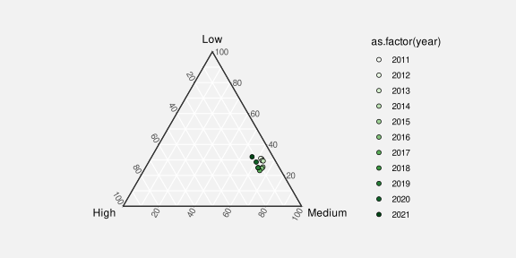

```{r}
#| echo: false
#| message: false
source("common.R")
```

# Position {#sec-position}

We saw in @sec-encoding-visual-features that **position** is a very effective
visual feature.  It is appropriate for encoding quantitative data values
(@fig-quant-features) and it is appropriate for encoding qualitative
data values (@fig-qual-features).
**Position** is a visual feature with high accuracy (@fig-accuracy) and 
with high capacity (@fig-pos-cap).[^pos-fundamental]

[^pos-fundamental]:
    It can be argued that position is a visual feature that is 
    fundamental to our perception of any image.

    @bertin1967semiologie separates the *planar dimensions*
    (horizontal and vertical position)
    from the *retinal variables* (colour, area, angle, etc).

    "There is fairly widespread philosophical agreement, which certainly accords
    with commonsense, that the spatial aspects of all existence are
    fundamental. Before an awareness of time, there is an awareness of relations
    in space." 
    [@RobinsonPetchenik1976, p. 14]

    "The concept of spatial relatedness ... is a quality without which it is
    difficult or impossible for the human mind to apprehend anything."
    [@RobinsonPetchenik1976, p. 123]

    "According to Kubovy (1981), position in space and time have a dominant role
    in perceptual organization. In relation to visual information displays, the
    contention for space as an indispensable variable seems indisputable. For
    centuries, humans in all cultures have “mapped” the nonvisible to space in
    order to facilitate understanding."
    [@maceachren1995how; citing @kubovy1981concurrent]

    "We process spatial properties (position and size) separately from object 
    properties (such as shape, color, texture, etc).  Furthermore, position 
    in space and time has a dominant role in perceptual organization, 
    as well as in memory."
    [@meirelles2013design]

This means that, 
if we do not encode data values as the **position** of data symbols, 
it can be more difficult
to decode data values from the data symbols.[^position-best]
For example, @fig-no-pos shows another data visualisation of the total number of
offenders in New Zealand for different ethnic groups (@tbl-crime-group-total).
We have previously seen a bar plot (@fig-bar), a dot plot (@fig-dot),
and a pie chart (@fig-pie) of these data.
In @fig-no-pos, the data symbols are circles, 
the number of offenders is encoded as the **area** of the circles,
and the ethnic groups are encoded as the **colour** of the circles.
One reason why it is more 
difficult to decode data values from @fig-no-pos, compared
to, for example, @fig-bar, is because
none of the data values are encoded using **position**.

[^position-best]:
    Decoding individual data values from individual data symbols
    is not the only visual task that we need to perform, so
    it is not *always* true that we should encode data values as
    **position**.  As we explore other sorts of encodings in later
    chapters, we will see reasons why **position** is not 
    always best.

```{r}
#| echo: false
#| label: fig-no-pos
#| fig-cap: A data visualisation that does not make use of position.
concData <- crimeGroupTotal
concData <- concData[order(concData$total, decreasing=TRUE), ]
sqrtTotal <- sqrt(concData$total)
maxTotal <- max(concData$total)
sqrtMax <- sqrt(maxTotal)
cols <- pal_npg()(4)
grid.newpage()
pushViewport(viewport(width=unit(.6, "snpc"), 
                      height=unit(.6, "snpc"), 
                      xscale=c(-sqrtMax, sqrtMax), 
                      yscale=c(-sqrtMax, sqrtMax),
                      gp=gpar(col="grey")))
ticks <- axisTicks(c(0, sqrtMax), log=FALSE)
pushViewport(viewport(unit(-10, "mm"), just="left",
                      xscale=c(-sqrtMax, sqrtMax), 
                      yscale=c(-sqrtMax, sqrtMax),
                      gp=gpar(col="grey")))
grid.segments(0, .5, 0, unit(max(ticks), "native"))
grid.segments(0, unit(ticks, "native"), 
              unit(1, "mm"), unit(ticks, "native"))
grid.text(ticks^2, unit(2, "mm"), unit(ticks, "native"), just="left",
          gp=gpar(fontsize=8))
popViewport()
angles <- seq(pi/10, -pi/10, length.out=4)
disc <- function(i) {
    x1 <- .5
    y1 <- .5
    x2 <- .5 + .55*cos(angles[i])
    y2 <- .5 + .55*sin(angles[i])
    ## grid.segments(x1, y1, x2, y2, gp=gpar(col=figbg, lwd=10))
    grid.circle(r=unit(sqrtTotal[i], "native"), 
                gp=gpar(col=cols[i], fill=cols[i]))
    grid.segments(x1, y1, x2, y2, gp=gpar(col=cols[i], lwd=2))
    pushViewport(viewport(x2, y2, just="left", angle=180*angles[i]/pi))
    grid.text(concData$group[i], unit(1, "mm"), just="left",
              gp=gpar(col=cols[i], fontface="bold"))
    popViewport()
}
for (i in 1:4) disc(i)
```

However, we have already seen several data visualisations that do 
not encode *all* data values to position (e.g., @fig-crime and 
@fig-crime-heatmap), so there must be more to learn
about encoding data values to basic visual features.[^not-all-scatter]
In this chapter, we look more closely at the encoding
of data values to the **position** of data symbols.

[^not-all-scatter]:
    As @all-scatterplots put it:
    "Why Shouldn't All Charts Be Scatter Plots?"

## Perception is relative {#sec-rel-pos}

In @sec-accuracy, we saw that **position** was the most
accurate visual feature for decoding quantitative values (@fig-accuracy).
However, that accuracy is for *relative* judgements rather than 
absolute judgements.
In other words, we are good at *comparisons* between positions,[^comparison]
which is one of the most important decoding tasks in
data visualisation.[^comparisons]

[^comparison]:
    In the experiments described in @cleveland1984graphical,
    which are the basis of the accuracy ranking in @fig-accuracy,
    "subjects were asked to judge what percent the smaller is of the larger".

[^comparisons]:
    @amar-taxonomy, in their taxonomy of visual tasks,
    consider a "low-level comparison
    as being a fundamental cognitive action" for reading 
    a data visualisation.

    "The fundamental task in data analysis is to make smart comparisons - we're
    always trying to answer the question 'Compared with what?' [...] It always
    comes down to making and showing smart comparisons."
    [@tufte2006beautiful, p. 127]

    "Almost everything we do with data involves comparison"
    [@tukey-1990, p. 329]

    "The lesson is that visualization is not good for representing
    precise absolute numerical values, but rather for displaying
    patterns of differences or changes over time, to which the eye and
    brain are extremely sensitive."  
    [@ware2021information, p. 70]

For example, the box on the left of @fig-rel-pos shows a dot
at a vertical positon along a dotted line.
We can decode an amount from the position of the dot, but only
relative to the ends of the dotted line;  the dot is three-quarters
of the way from the bottom to the top of the line.
We cannot decode an absolute data value from the dot.[^rel-propn]

[^rel-propn]:
    Even if we have encoded a *proportion* data value to the position
    of the dot, we would need to know that the bottom of the line
    represents 0 and the top of the line represents 1 to be
    able to correctly decode the proportion from the position of the dot.

The box in the middle of @fig-rel-pos shows two dots at vertical positions
along two dotted lines.
Again, we can only compare the positions of the two dots---the dot 
on the left is three times as far up its dotted line as the dot on the right.

The box on the right of @fig-rel-pos shows two dots again, but this time
adds an axis on the right edge of the box.
It is now possible to decode an absolute value for each dot
(75 and 25), but that is still only possible by making comparisons.
We decode the positions of the
dots relative to the positions of the tick marks on the axis.

```{r}
#| echo: false
#| label: fig-rel-pos
#| fig-height: 3
#| fig-cap: Perception of position is relative rather than absolute.
grid.newpage()
pushViewport(viewport(layout=grid.layout(1, 3, respect=TRUE)))
pushViewport(viewport(layout.pos.col=1),
             viewport(width=.6, height=.6))
grid.rect()
grid.segments(1/3, 0, 1/3, 1, gp=gpar(lty="dotted"))
grid.circle(1/3, 3/4, unit(1, "mm"), gp=gpar(fill="black"))
popViewport(2)
pushViewport(viewport(layout.pos.col=2),
             viewport(width=.6, height=.6))
grid.rect()
grid.segments(1/3, 0, 1/3, 1, gp=gpar(lty="dotted"))
grid.segments(2/3, 0, 2/3, 1, gp=gpar(lty="dotted"))
grid.circle(1/3, 3/4, unit(1, "mm"), gp=gpar(fill="black"))
grid.circle(2/3, 1/4, unit(1, "mm"), gp=gpar(fill="black"))
popViewport(2)
pushViewport(viewport(layout.pos.col=3),
             viewport(width=.6, height=.6))
grid.rect()
grid.segments(1/3, 0, 1/3, 1, gp=gpar(lty="dotted"))
grid.segments(2/3, 0, 2/3, 1, gp=gpar(lty="dotted"))
grid.circle(1/3, 3/4, unit(1, "mm"), gp=gpar(fill="black"))
grid.circle(2/3, 1/4, unit(1, "mm"), gp=gpar(fill="black"))
y <- seq(.25, .75, .25)
grid.segments(1, y, unit(1, "npc") + unit(2, "mm"), y)
grid.text(y*100, unit(1, "npc") + unit(4, "mm"), y,
          just="left", gp=gpar(fontsize=10))
popViewport(2)
```

> A data visualisation that encodes a data value as the position
  of a data symbol is effective because we can decode
  the *comparisons* between the positions accurately.

## Unaligned position {#sec-unaligned-pos}

We have established that **position** is a very 
accurate visual feature (@fig-accuracy), although that
accuracy is for comparisons rather than for decoding individual values.
Another limitation on the accuracy of **position** is that it works
best when the comparison is between positions with a common baseline.
For example, it is easier to compare the two positions on the left
of @fig-unaligned-pos compared to the two positions on the right.

```{r}
#| echo: false
#| label: fig-unaligned-pos
#| fig-height: 2
#| fig-cap: It is easier to compare two positions on the left because they are **aligned**;  they share a common baseline.  The two positions on the right are harder to compare because they are **unaligned**.
grid.newpage()
pushViewport(viewport(x=0, width=.5, just="left"))
pushViewport(viewport(width=unit(.8, "npc")))
grid.segments(.2, .25, .2, .35, gp=gpar(col="grey"))
grid.segments(.7, .25, .7, .35, gp=gpar(col="grey"))
grid.segments(.2, .65, .2, .75, gp=gpar(col="grey"))
grid.segments(.7, .65, .7, .75, gp=gpar(col="grey"))
grid.segments(.2, c(.3, .7), .7, c(.3, .7), gp=gpar(lty="dotted"))
grid.circle(c(.45, .55), c(.3, .7), r=unit(2, "mm"), gp=gpar(fill="black"))
popViewport(2)
pushViewport(viewport(x=.5, width=.5, just="left"))
pushViewport(viewport(x=.4, width=unit(.8, "npc")))
grid.segments(.2, .25, .2, .35, gp=gpar(col="grey"))
grid.segments(.7, .25, .7, .35, gp=gpar(col="grey"))
grid.segments(.3, .65, .3, .75, gp=gpar(col="grey"))
grid.segments(.8, .65, .8, .75, gp=gpar(col="grey"))
grid.segments(c(.2, .3), c(.3, .7), c(.7, .8), c(.3, .7), gp=gpar(lty="dotted"))
grid.circle(c(.45, .65), c(.3, .7), r=unit(2, "mm"), gp=gpar(fill="black"))
popViewport(2)
```

@fig-radial-pos shows yet another data visualisation 
of the total number of
offenders in New Zealand for different ethnic groups (@tbl-crime-group-total).
This data visualisation is similar to 
@fig-dot because it encodes the number of offenders to **position**
along a line.
However, it is harder to compare the number of offenders between
different ethnic groups in @fig-radial-pos because the 
positions are not aligned.

```{r}
#| echo: false
#| label: fig-radial-pos
#| fig-cap: A data visualisation that makes use of *unaligned* position.
grid.newpage()
ticks <- seq(5000, 45000, 10000) ## pretty(range(concData$total), log=FALSE)
pushViewport(viewport(width=unit(.6, "snpc"), 
                      height=unit(.6, "snpc"), 
                      xscale=c(-maxTotal, maxTotal), 
                      yscale=c(-maxTotal, maxTotal),
                      gp=gpar(col="grey")))
t <- c(pi/2, seq(pi/4, 7*pi/4, length.out=4))
grid.segments(.5 + .5*min(ticks)/maxTotal*cos(t), 
              .5 + .5*min(ticks)/maxTotal*sin(t), 
              .5 + .5*max(ticks)/maxTotal*cos(t), 
              .5 + .5*max(ticks)/maxTotal*sin(t),
              gp=gpar(col="grey", lwd=2))
for (i in 1:5) {
    grid.points(ticks*cos(t[i]), 
                ticks*sin(t[i]),
                pch=16, size=unit(2, "mm"),
                gp=gpar(col="grey"))
}
grid.text(ticks[-1], unit(.5, "npc") + unit(1, "mm"),
          unit(ticks[-1], "native"), just="left",
          gp=gpar(fontsize=8, col="grey"))
grid.points(concData$total*cos(t[-1]),
            concData$total*sin(t[-1]),
            pch=16, 
            gp=gpar(col=cols))
lab <- function(i) {
    pushViewport(viewport(concData$total[i]*cos(t[i + 1]), 
                          concData$total[i]*sin(t[i + 1]), just="left",
                          default.units="native", angle=180*t[i + 1]/pi - 90))
    grid.text(concData$group[i], unit(2, "mm"), just="left",
              gp=gpar(col=cols[i]))
    popViewport()
}
lab <- function(i) {
    x <- concData$total[i]*cos(t[i + 1])
    if (x < 0) {
        just <- "right"
        adj <- unit(-2, "mm")
    } else {
        just <- "left"
        adj <- unit(2, "mm")
    }
    grid.text(concData$group[i],
              unit(x, "native") + adj, 
              concData$total[i]*sin(t[i + 1]), just=just,
              default.units="native", 
              gp=gpar(col=cols[i], fontface="bold"))
}
for (i in 1:4) lab(i)
```

> Decoding data values from
  positions is most effective when the positions share a
  common baseline.

## Position is a scarce resource {#sec-pos-scarce}

In @sec-capacity we saw that **position** has a higher capacity for 
decoding qualitative data values compared to colour or pattern (@fig-pos-cap).
However, position has a limitation that does not affect colour
or pattern:  if we use the same position for more than one data value,
we end up drawing data symbols on top of each other.

For example, in @fig-no-pos, we use the same position for all four
circles that represent different ethnic groups, so the circles
are drawn on top of each other.
The total number of youth offenders for each 
ethnic group is encoded as the **area** of a circle.
The largest number of offenders is for the Māori ethnic group (the orange
circle) with European/Other the next largest (the light blue circle).
However, because the light blue circle is drawn on top of
the orange circle, all that we can actually see is
the part of the orange circle that extends beyond the light blue circle.

This represents a serious problem.
It is difficult for our visual system to decode from a data symbol
to a data value if we cannot see all of the data symbol.[^prop-ink]

[^prop-ink]:
    @wilke2019fundamentals refers to this problem as the
    *principle of proportional ink*.  The amount of ink used
    to represent a data value should be proportional to the 
    magnitude of the data value.

    Another way to decode @fig-no-pos is that there is a thin orange disc
    outside a light blue disk (which is outside a thin green disk, which is
    outside a dark blue circle).  In this interpretation, we can at least see
    all of the data symbol, so decoding is possible, but the problem now is that
    the viewer is using a decoding that is different from the encoding.

    The concentric-circles interpretation is perhaps the most parsimonious
    (@sec-simplicity), but just the existence of an alternative
    interpretation is a potential 
    source of confusion and so a cause for concern.
    
One way to express this limitation is that 
position is very effective for encoding *different* data values,
but it is not very effective for encoding the *same* data value.

> Decoding more than one data value from two data symbols that
  share the same position is, at best, compromised because we
  cannot see all of both data symbols.

## Case study: Overplotting {#sec-overplot}

The Rugby World Cup is a competition that is held every four years, with the
first event taking place in 1987.
We have data on the 
the number of points that were scored in every World Cup match
by Tier One nations (the top 10 rugby-playing nations).
@tbl-rwc-all shows a sample of these data.[^rwc]

[^rwc]:
    These data were obtained from [kaggle](https://www.kaggle.com/datasets/lylebegbie/international-rugby-union-results-from-18712022/data)
    [@Begbie2022_irugby_results_1871_2022].

```{r}
#| echo: false
#| message: false
#| label: tbl-rwc-all
#| tbl-cap: A table of the number of points scored by Tier One nations in Rugby World Cup matches, along with the global hemisphere of origin.  Each row represents the points scored by one team in one match.  There are 294 rows in total, with just the first 6 rows shown here.
kable(head(rwcAll[,c("team", "hemisphere", "scored")]), digits=0)
```

@fig-overplot shows a dot plot of the points scored in a match for all
teams and all matches.  This data visualisation has encoded the number
of points scored as the horizontal **position** of data points.
In theory, that allows us to decode from data points to
a number of points scored.
For example, we can see that one team from the southern hemisphere
scored just over 100 points in one match.

```{r}
#| echo: false
#| label: fig-overplot
#| fig-cap: The number of points scored in Rugby World Cup games by teams from the northern and southern hemispheres.
ggplot(rwcAll) +
    geom_point(aes(x=scored, y=hemisphere), size=4) +
    geom_segment(aes(x=-Inf, xend=Inf, y=hemisphere, yend=hemisphere), 
                 linetype="dotted", 
                 data=data.frame(hemisphere=unique(rwcAll$hemisphere))) +
    scale_x_continuous(name="points scored")
```

However, as @tbl-rwc-all-dup shows,
exactly the same number of points were scored by more than
one team (from the same hemisphere) and/or in more than one match.
This means that there are multiple data points at exactly the same 
position, which means that there are multiple data points drawn on top
of each other, which in effect means that there are data points
that we cannot see.

```{r}
#| echo: false
#| message: false
#| label: tbl-rwc-all-dup
#| tbl-cap: A table of the number of points scored by Tier One nations in Rugby World Cup matches, along with the global hemisphere of origin.  Each row represents the points scored by one team in one match.  There are 294 rows in total, with just the first 6 rows shown here, ordered by the number of points scored.
kable(head(rwcAll[order(rwcAll$scored),c("team", "hemisphere", "scored")]), digits=0, row.names=FALSE)
```

Although it is still possible to decode that, for example, 
at least one team from the northern hemisphere
scored zero points in at least one match,
it is not possible to decode whether that was just one team or just one 
match.
We cannot decode an individual data value from each data symbol.[^surjective-over]

[^surjective-over]:
    In effect, more than one data value is encoded as the same data symbol,
    which means that we cannot decode back to individual data values.
    This is called a *surjective* encoding [@Ziemkiewicz2009].

@fig-semitrans shows the same data as @fig-overplot, but
with the data points semi-transparent
so that we can see that many of the points overlap.
The same number of points was scored by multiple teams in multiple matches.
This demonstrates one approach to resolving the problem of overplotting;
we will see several other approaches in later chapters.

```{r}
#| echo: false
#| label: fig-semitrans
#| fig-cap: The number of points scored in Rugby World Cup games by teams from the northern and southern hemispheres.
ggplot(rwcAll) +
    geom_point(aes(x=scored, y=hemisphere), size=4, alpha=.2) +
    geom_segment(aes(x=-Inf, xend=Inf, y=hemisphere, yend=hemisphere), 
                 linetype="dotted", 
                 data=data.frame(hemisphere=unique(rwcAll$hemisphere))) +
    scale_x_continuous(name="points scored")
```

## Cartesian coordinates {#sec-cartesian}

In @fig-overplot, we have encoded *two* sets of data values using
**position**.
The number of points is encoded as the horizontal position of the data
points and the hemisphere of origin for each team is encoded as the
vertical position of the data points.
This *cartesian coordinate system* 
is effective because 
the visual system is better at decoding horizontal and vertical
positions compared to oblique orientations like in
@fig-radial-pos.[^oblique-effect]

[^oblique-effect]:
    This preference for horizontal and vertical orientations 
    is known as the *oblique effect* 
    [@Appelle1972; @oblique-effect-neural]

Because the horizontal and vertical positions are perpendicular,
Cartesian coordinates also mean that we can make use of 
**position** twice without the position encodings interfering with each 
other.[^orthogonality]
For example, in @fig-overplot, we can 
decode which hemisphere that a data symbol is from separately
from decoding how many points were scored.
The fact that 
a team is from the northern hemisphere does not *by itself* imply
anything about the number of points scored.
Put another way, any difference between the data symbols for northern
hemisphere teams and the data symbols for southern hemisphere teams
must reflect something about the data.

[^orthogonality]:
    Put mathematically, horizontal and vertical positions are
    [*orthogonal*](https://en.wikipedia.org/wiki/Orthogonality), 
    which means that they are 
    [*independent*](https://en.wikipedia.org/wiki/Independence_(probability_theory)).

A good example of a data visualisation that does not employ 
Cartesian coordinates is a pie chart, like @fig-pie, though
that is also a case where data values are *not* encoded as **position**.

> Cartesian (perpendicular) coordinates are effective because we can
  encode data values using position
  *twice*; we can decode data values from
  horizontal positions and we can separately decode data values from vertical
  positions.

## Case study: Ternary plots {#sec-ternary}

@tbl-crime-level-tern shows data on the severity of crimes committed by youth
in New Zealand.  For each year, we have the proportion of
criminal offences that were low, medium, or high severity.[^compositional]

[^compositional]:
    This form of data is called *compositional* data;  it shows how
    a total is composed of its different parts.

```{r}
#| echo: false
#| message: false
#| label: tbl-crime-level-tern
#| tbl-cap: A table of the proportion of crimes at different levels of severity for each year.
crimeLevel3 <- crimeLevel
crimeLevel3$lev <- ifelse(crimeLevel$level %in% c("Low", "High"),
                          as.character(crimeLevel$level),
                          "Medium")
crimeLevel3$lev <- factor(crimeLevel3$lev, levels=c("Low", "Medium", "High"))
crimeLevel3 <- 
do.call(rbind, lapply(split(crimeLevel3, 
                            list(crimeLevel3$lev, crimeLevel3$year)), 
                      function(x) {
                          if (all(x$lev %in% c("Low", "High"))) {
                              x[c("year", "count", "lev")]
                          } else {
                              x$count[1] <- sum(x$count)
                              x[1, c("year", "count", "lev")]
                          }
                      }))
crimeLevel3 <- 
do.call(rbind, lapply(split(crimeLevel3, crimeLevel3$year),
                      function(x) {
                          x$prop <- x$count / sum(x$count)
                          x
                      }))
crimeLevel3 <- dcast(crimeLevel3[-2], year ~ ...)
kable(head(crimeLevel3), digits=3)
```

@fig-ternary shows a ternary plot of these data.[^ternary-plots]
In this data visualisation, there are three variables (three proportions
that sum to 1), and the data values from each variable has been 
encoded as position.  However, the positions are along axes that
are not perpendicular.
This means that it is not as easy to decode individual data values
or compare data values
because we are poorer at decoding positions that are not horizontal or
vertical.
Furthermore, because the three proportions sum to 1, a change in
one proportion necessitates a change in at least one of the others.
In other words, we cannot easily decode the difference between two data values
from the difference between two data symbols.

[^ternary-plots]:
    Ternary plots, also known as barycentric plots,
    are common in specific areas of science, for example,
    Earth science where the composition of rocks or soils is studied.
    [@ternary-history] provides a history of the development of 
    ternary diagrams.

```{r}
#| eval: false
#| echo: false
#| message: false
ggplot(crimeLevel3, aes(High, Low, Medium)) + 
    geom_point(aes(fill=as.factor(year)), colour="black", shape=21, size=2) +
    scale_fill_discrete_sequential(palette="Greens") + ## manual(values=grey(.8 - 1:11/14), name="") +
    coord_tern() +
    theme(plot.background=element_rect(colour=NA, fill=figbg),
          panel.background=element_rect(colour=NA, fill=figbg),
          tern.panel.expand=.3,
          tern.panel.background=element_rect(fill=figbg),
          tern.panel.grid.major=element_line(colour="white"),
          tern.panel.grid.minor=element_line(colour="white"))
```

::: {#fig-ternary}

::: {.content-visible when-format=pdf}
\includegraphics[scale=0.7]{ggtern/fig-ternary.pdf}
:::

::: {.content-visible when-format=html}

:::

A ternary plot of the data in @tbl-crime-level-tern.  We can see that for the entire decade around 60% of crimes have been of medium severity, with around 30% of low severity, and only 10% of high severity.
:::

## Non-linear encodings {#sec-non-linear-pos}

@tbl-crime-type shows the total number of youth offenders broken down
by type of crime.  We have one qualitative variable, crime type, and
one quantitative variable, total nunber of offenders.

```{r}
#| echo: false
#| message: false
#| label: tbl-crime-type
#| tbl-cap: A table of the total number of youth offenders in New Zealand (2011 to 2021) broken down by type of crime.  There are 16 different crime types in toral, with only the first 6 shown here.
kable(head(crimeTypeTotal[c("type", "total")]), digits=3)
```

@fig-linear shows of dot plot of these data, with the total number of offenders
encoded as the horizontal position of circles, one per type of crime.
This plot is effective for comparing the total number of offenders 
between types of crime, both in terms of
which crimes are more common than others and
how much more common some crimes are than others.
For example, we can see that theft is about twice as common as the next
most common crime type.

```{r}
#| echo: false
#| label: fig-linear
#| fig-cap: A dot plot of the number of crimes for different regions of New Zealand.
ct2 <- crimeTypeTotal
ct2$type <- reorder(ct2$type, ct2$total)
ggplot(ct2) + 
    geom_segment(aes(x=-Inf, xend=Inf, y=type, yend=type), 
                 linetype="dotted") +
    geom_point(aes(x=total, y=type), size=3) +
    scale_x_continuous(name="total") +
    theme(aspect.ratio=1)
```

The effectiveness of @fig-linear comes not only 
from the fact that data values are encoded as the **position**
of data symbols, but also from the fact that the encoding
is *linear*.  In @fig-linear, the horizontal difference between 0 offenders
and 5,000 offenders is exactly the same horizontal distance
as the difference between 5,000 offenders and 10,000 offenders.
The effective decoding of position is dependent on 
this sort of linear encoding.[^tufte-prop]

[^tufte-prop]:
    "The representation of numbers
    should be directly proportional to the quantities represented."
    [@tufte1983visual]

When a small number of data values are considerably larger than the
majority of data values, as in @fig-linear, a non-linear
scale is sometimes employed in order to see the differences
between the smaller values more easily.  For example, @fig-log shows the same
data and the same encodings, but with a *log scale*.
Rather than encoding the total number of offenders as the position
of the circles, 
the log (base 10) of the total number of offenders is encoded as
the position of the circles.[^log]

[^log]:
    The log (base 10) of the data values is the power to which we 
    must raise 10 in order to get the data value.
    For example, if the data value is 100, the logged data value is 2.
    
    $10^2 = 100 \iff log_{10}(100) = 2$

```{r}
#| echo: false
#| label: fig-log
#| warning: false
#| fig-cap: A dot plot of the number of crimes for different regions of New Zealand, with a non-linear (log) scale on the x-axis.
ggplot(ct2) + 
    geom_segment(aes(x=0, xend=Inf, y=type, yend=type), 
                 linetype="dotted") +
    geom_point(aes(x=total, y=type), size=3) +
    scale_x_continuous(name="total", transform="log10") +
    theme(aspect.ratio=1)
```

Unfortunately, as a result of the non-linear horizontal scale,
we lose the accuracy of the position encoding.
We can no longer accurately decode from position to data values
because the same horizontal distance means different things
in terms of data values at different locations along the x-axis.
For example, it is difficult to decode the number of offenders
for Miscellaneous crimes;  the position of the circle data symbol
is visually roughly half-way between 100 and 1000, but the data value is not 
half-way between 100 and 1000.  It is even more difficult
to decode the size of the difference between the number of offenders
for Miscellaneous crimes versus Homicides.
Worse still, the difference between Miscellaneous and Homicide is visually
very similar to the difference between Miscellaneous and crimes Against justice,
but the differences between those data values are very different.

We can still decode simple ordinal information from @fig-log---which 
type of crimes
are more common than others---but we have lost the ability to 
decode quantitative information from the positions of the data symbols.
We have essentially lost information.

@fig-log-data shows the logged data again, but this time with
labels on the x-axis that show logged values rather than the original 
data values.  This shows that, in terms of logged data values,
the positions of the data symbols are linear.
We can accurately decode from the positions of the circles in @fig-log-data,
but only
to recover logged data values.
If we want to compare logged data values, this is fine, but usually
what we want is to compare the original data values---we need to decode
to a logged value and then raise 10 to that power.
For example, the log of the 
number of offenders for Deceptions is approximately 3, so the number
of offenders is approximately 1000.
However, this mental transformation 
requires much more conscious effort for most people,
so we effectively lose the benefit of using a data visualisation,
at least for the purpose of decoding quantitative information
(@sec-tasks).

```{r}
#| echo: false
#| label: fig-log-data
#| warning: false
#| fig-cap: A dot plot of the number of crimes for different regions of New Zealand, with a non-linear (log) scale on the x-axis.
ggplot(ct2) + 
    geom_segment(aes(x=-Inf, xend=Inf, y=type, yend=type), 
                 linetype="dotted") +
    geom_point(aes(x=log10(total), y=type), size=3) +
    scale_x_continuous(name=expression(log[10](total))) +
    theme(aspect.ratio=1)
```

Although a non-linear encoding from data values to the positions
of data symbols presents problems for decoding quantitative
information, there are still situations where non-linear scales can be useful.
For example, if we are only interested in ordinal comparisons, then
non-linear positions may still be effective.
We will see more examples in later sections
(@sec-col-non-linear, @sec-shape-non-linear).

> The encoding of quantitative data as the position of data symbols
  is only effective for decoding quantitative data if the
  encoding is linear.

## Summary

Encoding data values to the position of data symbols allows
for effective decoding for both quantitative and qualitative information,
with the following caveats:

* For quantitative values, 
  what we can accurately decode are *comparisons* between quantitative 
  values, not absolute quantitative values.

* The decoding is most accurate for positions that share a common baseline.

* Encoding identical data values as the positions of data symbols
  means that the data symbols overlap, which compromises our 
  ability to decode data values from the data symbols.

* We can encode one set of data values as horizontal positions and
  another set of data values as vertical positions because
  we can decode horizontal
  and vertical positions separately.

* Decoding quantitative data values from the positions of data symbols
  is only effective if the encoding is linear.

---

```{=latex}
\theendnotes
```
