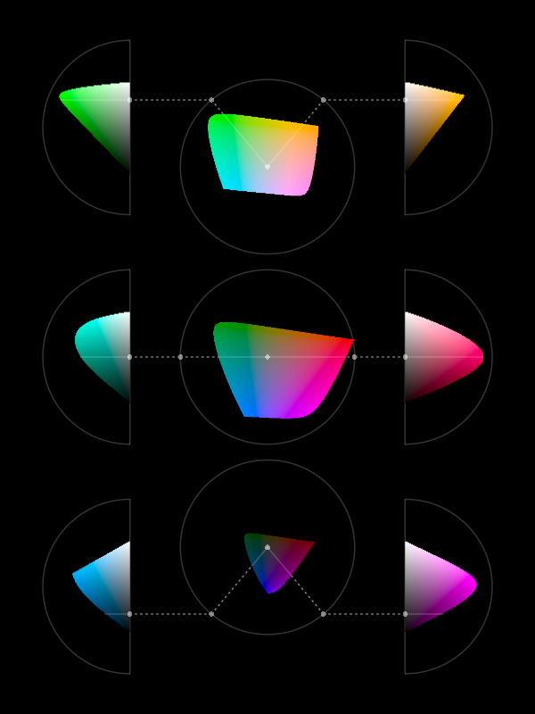
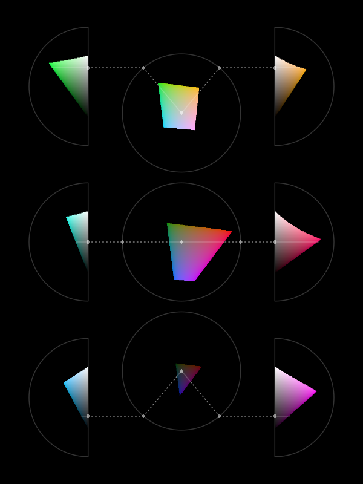
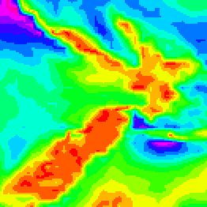
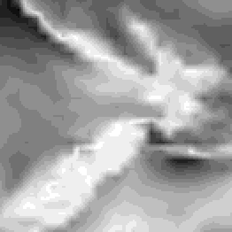
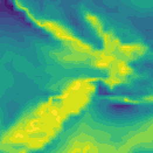

```{r}
#| echo: false
#| message: false
source("common.R")
```

# Colour

@fig-pie-hue shows a pie chart of the number of offenders for different
levels of crime seriousness in 2021.
In this data visualisation, the crime level, 
which is a **qualitative** variable,
is encoded as **colour**, which is appropriate for representing
qualitative values (@sec-qual-features).  It is easy to decode
the crime levels because it is easy to identify the colour
for a particular crime level amongst the set of colours used.

```{r}
#| echo: false
#| label: fig-pie-hue
#| fig-cap: A data visualisation of the number of offenders for different levels of crime seriousness.
ggplot(crimeLevel2021) +
    geom_col(aes(x=count, y="", fill=level)) +
    coord_polar() +
    scale_fill_npg(guide=guide_legend(reverse=TRUE)) +
    theme(axis.title=element_blank(),
          axis.ticks=element_blank())
```

@fig-pie-ordinal shows another pie chart of the same data, again encoding
the **qualitative** level as **colour**.
It is again easy to identify each crime level because we
can easily identify each separate wedge colour.
However, @fig-pie-ordinal has an advantage over @fig-pie-hue because
we can *also* decode an ordering of the wedges from more serious crimes,
which are darker wedges, to less serious crimes, which are lighter wedges.

```{r}
#| echo: false
#| label: fig-pie-ordinal
#| fig-cap: A data visualisation of the number of offenders for different levels of crime seriousness.
ggplot(crimeLevel2021) +
    geom_col(aes(x=count, y="", fill=level), colour="black") +
    coord_polar() +
    scale_fill_ordinal(guide=guide_legend(reverse=TRUE)) +
    theme(axis.title=element_blank(),
          axis.ticks=element_blank())
```

The fact that there can be two data visualisations,
@fig-pie-hue and @fig-pie-ordinal,
with the same encoding---the **qualitative**
level of crime is encoded as the **colour** of the wedges---but 
the two data visualisations 
have different effectiveness suggests that there is still
more to learn about the encoding of data values as colour.

This chapter covers some more details about how the **colour** visual
feature works.

## Hue, chroma, and luminance {#sec-colour}

We have so far taken a very simplistic approach to **colour**,
treating it as if it is a single **qualitative** visual feature
(@sec-qual-features).
However, the perception of colour can be divided into 
three separate visual features:  **hue**, **chroma**, and **luminance**
(@fig-hcl).[^tricolour]
Hue describes what we normally refer to as the colour name: reds, oranges,
yellows, greens, blues, purples, and so on.
Chroma describes the colourfulness, from bright (very colourful) to dull
(grey),
and luminance describes the lightness, from dark to light.
Our visual system is capable of perceiving changes in hue and changes in
chroma and changes in luminance.

[^tricolour]:
  The three-dimensional experience of colour arises from the fact that there
  are three different sorts of cones in the retina (see @sec-eye),
  each sensitive to a different range of light wavelengths:
  The L cones respond to long wavelengths (reds); the M cones respond
  to medium wavelengths (greens); and the S cones respond to short
  wavelengths (blues).
  The neural connections that combine the messages from the retina are also 
  divided into three pathways: light-dark, which represents the sum of L, M, 
  and S cones;
  red-green, which represents the difference between L and M cones;
  and blue-yellow, which represents the difference between S cones and the
  sum of L and M cones.
  For a more detailed description, see @ware2021information.

In @sec-qual-features, we treated colour as a **nominal** visual feature, 
but that 
really strictly only applies to **hue**.  For example, in
@fig-stacked-bar, we encoded different ethnic groups as 
different hues.
We are very good at decoding nominal data values, or different groups,
from different hues,
subject to the capacity limits described in @sec-capacity.

```{r}
#| echo: false
#| label: fig-hcl
#| fig-cap: "The perception of colour can be divided into three components: differences in **hue**, the colours of the rainbow; differences in **chroma**, from bright and colourful to dull and grey; and differences in **luminance**, from light to dark."
vp2 <- viewport(width=.9, y=unit(3, "lines"),
                height=unit(1, "npc") - unit(6, "lines"),
                just="bottom")
n <- 7
t <- seq(0, 2*pi, length.out=n+1)[-(n+1)]
hue <- t/pi*180
chroma <- 100*1:5/8
lum <- 100*3:7/10
x <- .2 + .3*cos(t + 2*pi/n)
y <- .5 + .3*sin(t + 2*pi/n)
grid.newpage()
grid.rect(width=unit(1, "npc") - unit(0/96, "in"),
          height=unit(1, "npc") - unit(0/96, "in"),
          gp=gpar(col=NA, fill="grey20"))
pushViewport(viewport(x=.55, width=.8, height=.8, layout=grid.layout(1, 3)))
pushViewport(viewport(layout.pos.col=1),
             vp2)
grid.move.to(.5, .5)
popViewport(2)
pushViewport(viewport(layout.pos.col=2),
             vp2)
grid.line.to(.5, .5, gp=gpar(col=hcl(hue[7], chroma[3], lum[3]), ## "grey40", 
                             lwd=2))
popViewport(2)
pushViewport(viewport(layout.pos.col=3),
             vp2)
grid.line.to(.5, .5, gp=gpar(col=hcl(hue[7], chroma[3], lum[3]), ## "grey40", 
                             lwd=2))
popViewport(2)
pushViewport(viewport(layout.pos.col=1),
             vp2)
pushViewport(viewport(width=unit(1, "snpc"), height=unit(1, "snpc")))
grid.circle(x, y, r=.1, gp=gpar(col="grey20", lwd=10))
grid.circle(x, y, r=.1,
            gp=gpar(col=hcl(hue, chroma[3], lum[3]), 
                    fill=hcl(hue, chroma[3], lum[3]), 
                    lwd=c(rep(0, n - 1), 0)))
popViewport()
grid.text("hue", x=.2, y=unit(-2, "lines"), gp=gpar(col=figbg, fontface="bold"))
popViewport(2)
pushViewport(viewport(layout.pos.col=2),
             vp2)
grid.circle(.5, 0:4/4, r=.1, gp=gpar(col="grey20", lwd=10))
grid.circle(.5, 0:4/4, r=.1, 
            gp=gpar(col=hcl(hue[7], chroma, lum[3]), 
                    fill=hcl(hue[7], chroma, lum[3]),
                    lwd=c(0,0,0,0,0)))
grid.text("chroma", y=unit(-2, "lines"), gp=gpar(col=figbg, fontface="bold"))
popViewport(2)
pushViewport(viewport(layout.pos.col=3),
             vp2)
grid.circle(.5, 0:4/4, r=.1, gp=gpar(col="grey20", lwd=10))
grid.circle(.5, 0:4/4, r=.1, 
            gp=gpar(col=hcl(hue[7], chroma[3], rev(lum)), 
                    fill=hcl(hue[7], chroma[3], rev(lum)), 
                    lwd=c(0,0,0,0,0)))
grid.text("luminance", y=unit(-2, "lines"), gp=gpar(col=figbg, fontface="bold"))
popViewport(2)
```

## Ordinal visual features {#sec-ordinal}

**Chroma** and **luminance** are both **nominal** visual features
in that they can be used to encode different groups, but they
are also **ordinal** visual features because we can decode
an ordering from a set of colours that differ in terms of either chroma
or luminance (or both).  A set of colours that transitions from darker
to lighter and/or brighter to duller conveys an ordering from larger
to smaller.[^dark-is-more]

[^dark-is-more]:
    @semantic-discrim and @Schloss2023MoreOfWhat 
    are examples of studies that have demonstrated that
    viewers naturally decode darker colours to larger values.

This helps to explain the advantage of @fig-pie-ordinal over
@fig-pie-hue.  In @fig-pie-ordinal, the colours differ
mostly in terms of luminance and chroma so we are able to perceive
changes from larger values to smaller values because the
colours transition from darker to lighter.

In this sense, **chroma** and **luminance** are able to convey
more information than **hue** because they can represent **nominal**
differences *and* **ordinal** differences, whereas hue can only
represent nominal differences.[^lum-chroma-quant]

[^lum-chroma-quant]:
    The stance taken in this book, that chroma and luminance are only
    appropriate for qualitative (including ordinal) data,
    is more rigid than in many other places.
    Chroma and luminance are often 
    included as an
    appropriate choice for encoding *quantitative* data values as well,
    albeit a poor one.
    For example, @cleveland1984graphical includes chroma (as *saturation*)
    and @munzner2014visualization includes both 
    luminance and chroma (as saturation) 
    in their rankings of the accuracy of different visual features.

On the other hand, @fig-lum-cap shows that chroma and luminance are
even more limited than hue in terms of **capacity**.  We can only use
chroma and/or luminance to represent **nominal** data when there
are very few different groups to represent.

```{r}
#| echo: false
#| label: fig-lum-cap
#| fig-height: 3
#| fig-cap: Encoding qualitative values to luminance and chroma works well for representing nominal data values, but only for a very small number of values. It is possible to identify which shade of purple the single dot corresponds to amongst the three shades on the left, but it is much harder with the seven shades in the middle, and harder still for the eleven shades on the right. This figure can be compared with @fig-colour-cap, which demonstrates the capacity of hue for representing nominal data values.
clpie <- function(n) {
    t <- rev(seq(0, 2*pi, length.out=100*n) + pi/2)
    cols <- hcl.colors(n+1, "Purples")[-(n+1)]
    grid.rect(.2, .7, .2, .2, gp=gpar(col="grey40", lwd=1))
    grid.circle(.2, .7, r=unit(2, "mm"), 
                gp=gpar(col=cols[median(1:n)], fill=cols[median(1:n)]))
    pushViewport(viewport(.6, .5, .6, .6))
    if (n < 5) {
        cols <- sample(cols, 25, replace=TRUE)
    } else {
        cols <- rep(sample(cols), length.out=25)
    }
    x <- rep(1:5/6, 5)
    y <- rep(1:5/6, each=5)
    grid.rect(gp=gpar(col="grey40", lwd=1))
    grid.circle(x, y, r=unit(2, "mm"),
                gp=gpar(col=cols, fill=cols))
    popViewport()
}
pushViewport(viewport(layout=grid.layout(1, 3, respect=TRUE)))
pushViewport(viewport(layout.pos.col=1))
clpie(3)
popViewport()
pushViewport(viewport(layout.pos.col=2))
clpie(7)
popViewport()
pushViewport(viewport(layout.pos.col=3))
clpie(11)
popViewport()
```

> If we encode data values to the **hue** of data symbols,
  then we can only decode **nominal** information from
  the data symbols;  do the data symbols represent 
  *different* groups or the *same* group.

> If we encode data values to the **chroma** and/or
  **luminance** of data symbols, 
  it is also possible to decode **ordinal** information
  form the data symbols.

## Perception is relative {#sec-colour-relative}

We saw in @sec-perception-relative that perception of **lengths** is 
relative.  For example, small differences in length are easier
to see when the lengths themselves are short (@fig-relative).

There is a similar rule for the perception of **colours**. 
Our perception of luminance and chroma is affected by neighbouring 
colours.[^contrast-effect]
This effect is demonstrated in @fig-contrast-effect:
the same colour when surrounded by a darker background appears lighter
than it does when surrounded by a lighter background.

[^contrast-effect]:
  This relative perception of colours is useful for being able
  to adapt to a wide range of lighting conditions.
  See @ware2021information for a more detailed discussion.

```{r}
#| echo: false
#| label: fig-contrast-effect
#| fig-height: 3
#| fig-cap: The perception of colours is relative. In the top row, the inner rectangles are exactly the same shade of grey on the left and exactly the same shade of purple on the right.  The perception of the inner rectangles is affected by the surrounding colour, so the same shade appears darker against a light background and lighter against a dark background.  The bottom row draws a line connecting the two inner rectangles to show that they really are the same shade.
pushViewport(viewport(layout=grid.layout(2, 2, widths=2, respect=TRUE)))
pushViewport(viewport(layout.pos.col=1, layout.pos.row=1),
             viewport(width=.8, height=.8))
grid.rect(x=.25, width=.5, gp=gpar(col=NA, fill="grey20"))
grid.rect(x=.25, width=.25, height=.5, gp=gpar(col=NA, fill="grey60"))
grid.rect(x=.75, width=.5, gp=gpar(col=NA, fill="grey80"))
grid.rect(x=.75, width=.25, height=.5, gp=gpar(col=NA, fill="grey60"))
popViewport(2)
pushViewport(viewport(layout.pos.col=1, layout.pos.row=2),
             viewport(width=.8, height=.8))
grid.rect(x=.25, width=.5, gp=gpar(col=NA, fill="grey20"))
grid.rect(x=.25, width=.25, height=.5, gp=gpar(col=NA, fill="grey60"))
grid.rect(x=.75, width=.5, gp=gpar(col=NA, fill="grey80"))
grid.rect(x=.75, width=.25, height=.5, gp=gpar(col=NA, fill="grey60"))
grid.segments(.25, .5, .75, .5, gp=gpar(col="grey60", lwd=20))
popViewport(2)
purples <- pal_brewer(palette="Purples")(4)[-1]
pushViewport(viewport(layout.pos.col=2, layout.pos.row=1),
             viewport(width=.8, height=.8))
grid.rect(x=.25, width=.5, gp=gpar(col=NA, fill=purples[1]))
grid.rect(x=.25, width=.25, height=.5, gp=gpar(col=NA, fill=purples[2]))
grid.rect(x=.75, width=.5, gp=gpar(col=NA, fill=purples[3]))
grid.rect(x=.75, width=.25, height=.5, gp=gpar(col=NA, fill=purples[2]))
popViewport(2)
pushViewport(viewport(layout.pos.col=2, layout.pos.row=2),
             viewport(width=.8, height=.8))
grid.rect(x=.25, width=.5, gp=gpar(col=NA, fill=purples[1]))
grid.rect(x=.25, width=.25, height=.5, gp=gpar(col=NA, fill=purples[2]))
grid.rect(x=.75, width=.5, gp=gpar(col=NA, fill=purples[3]))
grid.rect(x=.75, width=.25, height=.5, gp=gpar(col=NA, fill=purples[2]))
grid.segments(.25, .5, .75, .5, gp=gpar(col=purples[2], lwd=20))
popViewport(2)
popViewport()
```

This effect also applies to the perception of hue.
@fig-pie-contrast shows a pie chart of the number of offenders in each
police district, with the police district encoded to the **colour** of the
wedges.  There are two issues with the perception of the wedge colours:
each wedge is affected by its neighbour so that, for example, some of 
the blue wedges look more green at the boundary with their more blue 
neighbour and more blue at the boundary with their more green neighbour;
furthermore, the colours in the legend are perceived differently from
the corresponding colours in the wedges because the legend colours are
surrounded by a light grey, rather than sharing a boundary with
a neighbouring colour.

```{r}
#| echo: false
#| label: fig-pie-contrast
#| fig-cap: This pie chart demonstrates that the perception of hues is relative. The colours within each wedge appear to have a subtle gradient within the wedge because the perception of the wedge colour is affected differently by the neighbouring wedge colours.
ggplot(crimeDistrict2021) + 
    geom_col(aes(x=count, y="", fill=district)) +
    coord_polar() +
    scale_fill_hue() +
    theme(aspect.ratio=1,
          axis.title.y=element_blank(),
          axis.ticks.y=element_blank(),
          legend.key.size=unit(5, "mm"),
          legend.key.spacing.y=unit(2, "mm"))
```

The pie chart in @fig-pie-contrast is *not* an effective data visualisation
because it encodes qualitative data values with many different groups
as colour hue.  This exceeds the **capacity** of the **hue** visual feature;
it is difficult to clearly identify which wedge corresponds to which district
(@sec-capacity).
We have just used it here to demonstrate the relative perception of colours.

Although it does not make the use of hue any more appropriate,
for the purposes of demonstration,
we can solve the colour perception problems in @fig-pie-contrast
by adding a white border to all of the wedges
(@fig-pie-contrast-solved).
Now all of the wedges and all of the squares in the legend are
perceived relative to a surrounding white border.
This means that, not only is each wedge perceived as a solid block of 
constant colour, but it is easier to match the colours within the wedges with
the colours in the legend.

```{r}
#| echo: false
#| label: fig-pie-contrast-solved
#| fig-cap: The hues in this pie chart are perceived more accurately than those in @fig-pie-contrast because each wedge is surrounded by a white border.
ggplot(crimeDistrict2021) + 
    geom_col(aes(x=count, y="", fill=district), colour="white", linewidth=1) +
    coord_polar() +
    scale_fill_hue() +
    theme(aspect.ratio=1,
          axis.title.y=element_blank(),
          axis.ticks.y=element_blank())
```

> If we encode data values as the colour of data symbols,
  we may have difficulty decoding the colours if the same colour
  is presented with different colours adjacent to it.

## Size matters

The perception of colours is also affected by the size of the
coloured region.  In particular, small regions of colour 
may blend together with neighbouring colours.[^stone]
For example, on the left of @fig-colour-size, the yellow and blue
stripes are, in reality, the same colours both in the top set of wide bars 
and in the bottom set of narrow bars, but the blue bars appear
greener in the bottom set.
The right side of @fig-colour-size shows that the same colours
may appear different when they are used as fill colours for larger regions,
like bars, compared to when they are used for thin lines.
In this case, the blue line appears darker than the blue bars.

[^stone]:
    @size-matters describes "spreading", 
    which means a blending or averaging
    of colours over small areas *by the visual system*:
    "In designing colors for digital visualization systems, one of the most
    critical factors is the interaction between size and color appearance."

```{r}
#| echo: false
#| label: fig-colour-size
#| fig-height: 3
#| fig-cap: The perception of colours varies based on the size of the coloured regions.
grid.newpage()
grid.rect(width=unit(1, "npc") - unit(0/96, "in"),
          height=unit(1, "npc") - unit(0/96, "in"),
          gp=gpar(col=NA, fill="grey20"))
cols <- c("#FFF200", "#00ADEF")
pushViewport(viewport(layout=grid.layout(2, 2)))
pushViewport(viewport(layout.pos.col=1, layout.pos.row=1),
             viewport(width=.8, height=.6, y=.4))
grid.rect(x=0:8/9, width=1/9, just="left", gp=gpar(col=NA, fill=cols))
popViewport(2)
pushViewport(viewport(layout.pos.col=1, layout.pos.row=2),
             viewport(width=.8, height=.6))
grid.rect(x=0:58/59, width=1/59, just="left", gp=gpar(col=NA, fill=cols))
popViewport(2)
x <- rep(1:5/6, each=2)
y <- c(1, 2, 4, 3, 3, 4, 3, 3, 5, 2)/6
pushViewport(viewport(layout.pos.col=2, layout.pos.row=1),
             viewport(width=.8, height=.8))
grid.rect(x=unit(x, "npc") + unit(c(-5, 0), "mm"), width=unit(5, "mm"),
          y=0, height=y, hjust=0, vjust=0,
          gp=gpar(col=NA, fill=cols))
popViewport(2)
pushViewport(viewport(layout.pos.col=2, layout.pos.row=2),
             viewport(width=.8, height=.8))
grid.lines(x[c(TRUE, FALSE)], y[c(TRUE, FALSE)], gp=gpar(col=cols[1]))
grid.lines(x[c(FALSE, TRUE)], y[c(FALSE, TRUE)], gp=gpar(col=cols[2]))
popViewport()
```

> If we encode data values as the colour of data symbols, 
  we may have difficulty decoding the colours if there are
  large differences in the sizes of data symbols.

## Colours in space {#sec-colour-spaces}

@fig-colour-spaces shows two-dimensional 
slices of the set of visible colours arranged 
in three dimensions.[^cie-luv]
The central column of three coloured regions (surrounded by white circles)
show slices of colours with constant luminance. 
Chroma increases outwards from the centre (indicated by a white dot)
and hue changes with angle.
In each slice,
we can see the familiar rainbow of colours from red, through orange, yellow,
green, blue, indigo, and violet, back around to red.
The top slice is for high luminance (light) colours and the bottom slice
is for low luminance (dark) colours.

The coloured regions to the left and to the right (surrounded by 
white semicircles)
show slices of constant hue. 
In these slices,
Luminance increases from bottom to top and chroma increases
away from the flat side of the semicircle.
For example, the top-left slice shows the same green hue at
different levels of luminance and chroma.

[^cie-luv]:
    @fig-colour-spaces shows the extent of the *optimal colour solid*,
    which is essentially the colours that it is possible to produce
    by reflecting a light source off a surface that has perfect reflectance.
    This colour solid was determined assuming
    specific illumination conditions (D65), and assuming
    a standard human observer.

    The colours are shown in CIE $L^*u^*v^*$ space (*aka* HCL space), which is
    (roughly) *perceptually uniform* so that perceptual differences
    between pairs of colours that are the same distance apart within the
    space are perceived as having the same visual difference.

    The colours shown are produced using sRGB specifications, so many
    of the colours, especially at high chroma, are not realistic.

::: {#fig-colour-spaces}
::: {.content-visible when-format=pdf}
\includegraphics[scale=0.5]{HCL/hcl.png}
:::

::: {.content-visible when-format=html}

:::

Slices through the set of colours that are visible to humans.  The central images show colours that differ in terms of chroma and hue, but share a common luminance (from lighter at the top to darker at the bottom).  The images to the left and right show colours that differ in terms of chroma and luminance, but share a common hue.
:::

@fig-colour-spaces provides insight into what sorts of colours are possible
and what sorts
of differences between colours are possible.
For example, from the bottom central slice 
we can see that it is not possible to produce colours that
have a high chroma *and* are very dark.
In other words, there is no such thing as a very colourful black.
This is also true for colours that are very light.

We can also see that the range of possible chroma values depends on both the
hue and the luminance of colours.
For example, the top-right slice shows that
it is possible to produce a light yellow with either a
low chroma or a high chroma,
but we can only produce a dark yellow with a low chroma.
Equivalently, the range of possible luminance values depends on both
the hue and the chroma of colours.
For example, we can produce both dark and light low-chroma yellows, but
we can only produce light high-chroma yellows.

This means that, 
if we want to encode data values as the chroma
of a data symbol, we can get a wider range of colours---we can 
get a higher decoding **capacity**---through 
careful selection of hue and luminance.
For example, we can generate a wider range of light greens than dark greens
(the top-left slice)
and a wider range of reds that are neither too light nor too dark
(the centre-right slice).

@fig-colour-spaces-srgb is similar to @fig-colour-spaces except that,
instead of showing the range of colours that it is possible to perceive,
it shows the range of colours that it is possible to *produce*
using standard technology.[^srgb]
The simple message here is that the limits on the range
of colours that we can use to encode data values is much 
smaller than the range of possible colours.
On the positive side, 
the range of colours that we can produce is still very large.

[^srgb]:
    @fig-colour-spaces-srgb shows the gamut of sRGB colours 
    in CIE $L^*u^*v^*$ space (*aka* HCL space).

A more important message is that the general points about
differences between colours still apply.
For example, the range of possible chroma values is dependent
on the hue and luminance of colours.

::: {#fig-colour-spaces-srgb}
::: {.content-visible when-format=pdf}
\includegraphics[scale=0.5]{HCL/hcl-srgb.png}
:::

::: {.content-visible when-format=html}

:::

Slices through the set of colours that it is possible to produce on a typical computer monitor.
:::

> If we encode data values as the colour of data symbols, 
  the choice of hue, luminance, and chroma affects 
  the capacity of decoding---how many different colours
  can be effectively decoded.

## Colour harmony {#sec-harmony}

We have seen that **hue** is an appropriate visual feature
for encoding **nominal** data values because
we can decode differences between hues without any implied
ordering between hues.  For example, blue is not larger than red.

However, it is not entirely true that there is no sense of *distance*
between different hues.
The left image in @fig-colour-wheel shows a colour wheel of hues for a constant
luminance and chroma.
Hues that are close together on this colour wheel are decoded
as more similar than hues that are on opposite sides of the wheel.
For example, the top two circles on the right of @fig-colour-wheel have
hues that are from the left side of the colour wheel so they appear similar,
but the bottom two circles have hues from the left and the right side of the 
colour wheel so they have a greater contrast.[^colour-theory]

[^colour-theory]:
    In colour theory, 
    hues that are close together on a colour wheel are referred
    to as *analogous* and hues that are opposite each other are
    *complementary*.

```{r}
#| echo: false
#| label: fig-colour-wheel
#| dev: png
#| fig-cap: On the left, a colour wheel that shows differet hues for a constant chroma and luminance.  At top-right is a pair of hues from the left side of the colour wheel and bottom-right is a pair of hues from opposite sides of the colour wheel.  There is greater contrast between the bottom pair of colours and less contrast between the top pair of colours.
grid.newpage()
pushViewport(viewport(layout=grid.layout(1, 2, respect=TRUE)))
pushViewport(viewport(layout.pos.col=1))
grid.rect(width=unit(.9, "snpc"), height=.9, gp=gpar(fill="grey20"))
mask <- circleGrob(r=.3, gp=gpar(fill=NA, lwd=20))
pushViewport(viewport(mask=mask))
n <- 1000
t <- seq(0, 2*pi, length.out=n)[-n]
chrom <- 50
lum <- 70
grid.segments(.5, .5, .5 + .5*cos(t), .5 + .5*sin(t),
              gp=gpar(col=hcl(180*t/pi, chrom, lum), lwd=2))
popViewport(2)
pushViewport(viewport(layout.pos.col=2))
grid.rect(width=unit(.9, "snpc"), height=.9, gp=gpar(fill="grey20"))
anal <- c(180, 240)
grid.circle(c(.4, .6), 3/4, unit(3, "mm"), 
            gp=gpar(col=hcl(anal, chrom, lum), fill=hcl(anal, chrom, lum)))
opp <- c(180, 0)
grid.circle(c(.4, .6), 1/4, unit(3, "mm"), 
            gp=gpar(col=hcl(opp, chrom, lum), fill=hcl(opp, chrom, lum)))
grid.rect(height=.1, gp=gpar(col=NA, fill=figbg))
popViewport()
```

> If we encode data values as hue, it is possible to
  decode some hues as quite similar and other hues as very different.

## Colour vision deficiency {#sec-CVD}

Roughly 10% of the population, primarily men, suffer from a form of
colour vision deficiency (CVD).
In the most common case, the viewer will have difficulty distinguishing 
between red and green hues.[^cvd]
@fig-pie-hue-cvd simulates how the colours in @fig-pie-contrast would appear
to a person with severe CVD.

[^cvd]:
    This is more commonly known as *red-green colour blindness*.
    Blue-yellow colour blindness is also possible, but much rarer.
    There are also four distinct categories of red-green colour blindness,
    though the effect on the colour perceived is similar in all cases.
    The images used in this book simulate deuteranomaly (the most
    common form of CVD).

    The approximate figure of 10% is from @ware2021information.

```{r}
#| echo: false
#| label: fig-pie-hue-cvd
#| fig-cap: A data visualisation of the number of offenders for different police districts.  This is how a person with severe deuteranopia might perceive the colours in @fig-pie-contrast.
ggplot(crimeDistrict2021) + 
    geom_col(aes(x=count, y="", fill=district)) +
    coord_polar() +
    scale_fill_manual(values=deutan(pal_hue()(12)),
                      guide=guide_legend(reverse=TRUE)) +
    theme(aspect.ratio=1,
          axis.title.y=element_blank(),
          axis.ticks.y=element_blank(),
          legend.key.size=unit(5, "mm"),
          legend.key.spacing.y=unit(2, "mm"))
```

In order to avoid confusion for viewers with CVD, 
it may be necessary to vary luminance and/or chroma in addition
to or instead of hue.  For example, @fig-pie-ordinal-cvd 
shows how the shades of purple in @fig-pie-ordinal would appear
to a viewer with severe deuteranopia.
It is not important that a viewer with CVD perceives a different
hue in this case because the more important difference is in the
luminance and chroma of the colours.

```{r}
#| echo: false
#| label: fig-pie-ordinal-cvd
#| fig-cap: A data visualisation of the number of offenders for different levels of crime seriousness.  This is how a person with severe deuteranopia might perceive the colours in @fig-pie-ordinal.
ggplot(crimeLevel2021) +
    geom_col(aes(x=count, y="", fill=level), colour="black") +
    coord_polar() +
    scale_fill_manual(values=deutan(pal_brewer(palette="Purples")(5)),
                      guide=guide_legend(reverse=TRUE)) +
    theme(axis.title=element_blank(),
          axis.ticks=element_blank())
```

> When we encode data values as the colour of data symbols,
  some viewers will have difficulty decoding the colours
  if we do not take into account common forms of 
  colour vision deficiency.

## Non-linear encodings {#sec-col-non-linear}

The top row of @fig-non-linear-lum shows a linear luminance encoding;
we have a set of rectangles
that change luminance in equal steps.  The 
two rectangles on the left of this row appear very similar, while
the two rectangles on the right of this row appear quite different.
The darker rectangles appear to change more slowly and 
the lighter rectangles appear to change more rapidly.
In other words, the *decoding* of luminance is *not* linear.

```{r}
#| echo: false
#| label: fig-non-linear-lum
#| fig-height: 2
#| fig-cap: The two rows of purple values begin and end at the same level of luminance.  The top row encodes luminance linearly, but the bottom row uses a cube-root encoding.
grid.newpage()
## Same start and end, but even steps vs cubed root steps
pushViewport(viewport(width=.8, layout=grid.layout(2, 1)))
pushViewport(viewport(layout.pos.row=1))
grid.rect(1:7/8, width=unit(.5, "snpc"), height=unit(.5, "snpc"),
          gp=gpar(col="black", lwd=1,
                  fill=hcl(highhcl[3], 20,
                           100*seq((1/100)^(1/3), (6/8)^(1/3), length.out=7))))
popViewport()
pushViewport(viewport(layout.pos.row=2))
grid.rect(y=1, width=2, height=.25/2, gp=gpar(col=NA, fill="white"))
grid.rect(1:7/8, width=unit(.5, "snpc"), height=unit(.5, "snpc"),
          gp=gpar(col="black", lwd=1,
                  fill=hcl(highhcl[3], 20,
                           100*c(1/100, 1:6/8)^(1/3))))
popViewport()
```

We saw in @sec-non-linear-pos that accurate decoding of data values
from **position** relies
on using a linear encoding. That was because the decoding of position
is linear.  A linear encoding from data values to position, followed
by a linear decoding from position to data values, leads to an
accurate encoding.  And that is particularly important for 
encoding quantitative data values.

Part of the reason why it is not appropriate to encode quantitative
data values to luminance is that the decoding of luminance is *not*
linear.  This makes it difficult to accurately decode quantitative 
data values from the luminance of a data symbol, even if the
encoding of the data values to luminance was linear. 

However, we can use luminance to encode ordinal data values 
(@sec-ordinal).
For this purpose, all that we need is to be able to identify 
that a data symbol is lighter or darker than another data symbol.

> The decoding of luminance is non-linear, 
  which means that luminance is not accurate for
  decoding quantitative data values.
  However, luminance 
  is still effective for decoding ordinal data values.

The bottom row of @fig-non-linear-lum shows a luminance encoding
that takes larger steps for darker colours and smaller steps
for lighter colours.  In this row, the purples appear to 
change more evenly.  We can see differences between the darker
rectangles as well as between the lighter rectangles.

In other words, a *non-linear* encoding from data values to
luminance can be used 
to generate a larger set of luminance levels that can be differentiated
from each other.  A non-linear luminance encoding leads to increased
**capacity** for decoding data values from luminance.

> The decoding of luminance is non-linear, 
  which means that the capacity of luminance is worse for darker colours
  than it is for lighter colours.
  However, a non-linear encoding of data values to luminance 
  can increase the capacity for darker colours.

## Escape capacity {#sec-escape}

We have previously identified that colour has a limited capacity 
(@sec-capacity and @sec-ordinal).
In general, 
we cannot use colour to encode more than around 7 different categories.
@sec-colour-spaces also demonstrated that this capacity varies
for different combinations of hue, chroma, and luminance.

One way to increase the decoding capacity of a colour encoding is to vary
more than one of hue, chroma, and luminance at once.
For example, the top row of @fig-escape-lum shows a set of colours
that only vary in terms of luminance---hue and chroma are held constant
(this is the bottom row from @fig-non-linear-lum).
In the second row of @fig-escape-lum, in addition to increasing luminance, 
we have increasing *chroma*, so there are larger differences between colours,
but still a clear ordering.
Similarly, in the bottom row of @fig-non-linear-lum, the *hue* changes slightly
as the luminance increases so that the differences are more obvious.

In effect, this is another example of a non-linear encoding.
We take a non-linear path 
through colour space (@sec-colour-spaces). 

```{r}
#| echo: false
#| label: fig-escape-lum
#| fig-height: 3
#| fig-cap: The top row holds hue and chroma constant and just varies luminance. It is limited to a very low chroma.  The middle row varies chroma as well as luminance, which provides a wider range of colours compared to the top row by allowing a more colourful starting point.  The bottom row varies hue and luminance, which provides a wider range of colours compared to the top row by allowing a different-hued starting point.
grid.newpage()
pushViewport(viewport(width=.8, layout=grid.layout(3, 1)))
pushViewport(viewport(layout.pos.row=1))
grid.rect(1:7/8, width=unit(.5, "snpc"), height=unit(.5, "snpc"),
          gp=gpar(col="black", lwd=1,
                  fill=hcl(highhcl[3], 20,
                           100*c(1/100, 1:6/8)^(1/3))))
popViewport()
pushViewport(viewport(layout.pos.row=2))
grid.rect(y=1, width=2, height=.25/3, gp=gpar(col=NA, fill="white"))
grid.rect(1:7/8, width=unit(.5, "snpc"), height=unit(.5, "snpc"),
          gp=gpar(col="black", lwd=1,
                  fill=hcl(highhcl[3], seq(50, 20, length.out=7),
                           100*c(1/100, 1:6/8)^(1/3))))
popViewport()
pushViewport(viewport(layout.pos.row=3))
grid.rect(y=1, width=2, height=.25/3, gp=gpar(col=NA, fill="white"))
grid.rect(1:7/8, width=unit(.5, "snpc"), height=unit(.5, "snpc"),
          gp=gpar(col="black", lwd=1,
                  fill=hcl(seq(highhcl[3] - 50, highhcl[3], length.out=7), 20,
                           100*c(1/100, 1:6/8)^(1/3))))
popViewport()
```

> When encoding ordinal data values as colour, the capacity can
  be increased by varying more than one of hue, chroma, and luminance.

Another way to expand the decoding capacity of a colour encoding
is to reduce the number of colours that need to be directly compared.
For example, if data symbols are arranged in a very regular pattern,
like in a bar plot, 
comparisons between neighbouring data symbols are most important.
This means that we can order the colours to maximise neighbour differences
rather than maximising all pairwise differences.[^bartolomeo]
@fig-pie-order demonstrates this idea with a bar plot of the crime
rate in different districts for both 2011 and 2021.
This bar plot uses the same set of
hues as @fig-pie-contrast-solved, just in a different order
so that adjacent bars have very different colours.
It is very easy to distringuish between adjacent colours.
 

[^bartolomeo]:
    This idea is described and demonstrated in @ivapp25.

```{r}
#| echo: false
#| label: fig-pie-order
#| fig-cap: The hues in this pie chart are ordered so that adjacent hues are distant from each other.
escape1 <- subset(crimeDistrict, year %in% c(2011, 2021))
escape1$district <- reorder(escape1$district, escape1$rate, min,
                            decreasing=TRUE)
gg <- ggplot(escape1) + 
    geom_col(aes(x=year, y=rate, fill=district), position="dodge",
             colour=figbg) +
    
    scale_fill_manual(values=pal_hue()(12)[t(matrix(1:12, 
                                                    ncol=2))],
                      guide=guide_legend(reverse=TRUE)) +
    scale_x_continuous(breaks=c(2011, 2021)) +
    scale_y_continuous(expand=expansion(c(0, .05))) +
    coord_flip(clip="off") +
    theme(axis.title.x=element_blank(),
          axis.title.y=element_blank(),
          legend.position="none",
          aspect.ratio=1)
grid.newpage()
pushViewport(viewport(x=0, width=.8, just="left"))
print(gg, newpage=FALSE)
upViewport()
grid.force()
barPath <- grid.grep("geom_rect", grep=TRUE, viewports=TRUE)
bars <- grid.get(barPath)
downViewport(attr(barPath, "vpPath"))
grid.rect(unit(1, "npc") + unit(0, "mm"), 
          y=bars$y[13:24], 
          width=convertUnit(unit(bars$height[1], "npc"), "npc", 
                            axisFrom="y", typeFrom="dimension",
                            axisTo="x", typeTo="dimension"),
          height=bars$height[1],
          just=c("left", "top"),
          gp=gpar(col=figbg, fill=bars$gp$fill[13:24]))
grid.segments(1, .01, 1, .99)
grid.text(escape1$district,
          unit(1, "npc") + unit(1, "mm") + 
          convertUnit(unit(bars$height[1], "npc"), "npc", 
                      axisFrom="y", typeFrom="dimension",
                      axisTo="x", typeTo="location"), 
          y=bars$y[13:24], gp=gpar(fontsize=8),
          hjust=0, vjust=1.2)
```

A similar idea is to just reuse a smaller set of hues, which means
larger differences between adjacent colours, but repeat
the set.   The
regular arrangement of the data symbols means that we can
still differentiate between repeated colours because of the bar positions
(@fig-pie-repeat).  For example, we can differentiate the pink for 
the Wellington district
from the pink for the Eastern district because Wellington is at the end and
Eastern is in the middle.

```{r}
#| echo: false
#| label: fig-pie-repeat
#| fig-cap: The hues in this pie chart are repeated so that adjacent hues are more distant from each other.
gg <- ggplot(subset(crimeDistrict, year %in% c(2011, 2021))) + 
    geom_col(aes(x=year, y=rate, fill=district), position="dodge",
             colour=figbg) +
    scale_fill_manual(values=rep(pal_hue()(6), 2)) +
    scale_x_continuous(breaks=c(2011, 2021)) +
    scale_y_continuous(expand=expansion(c(0, .05))) +
    coord_flip(clip="off") +
    theme(axis.title.x=element_blank(),
          axis.title.y=element_blank(),
          legend.position="none",
          aspect.ratio=1)
grid.newpage()
pushViewport(viewport(x=0, width=.8, just="left"))
print(gg, newpage=FALSE)
upViewport()
grid.force()
barPath <- grid.grep("geom_rect", grep=TRUE, viewports=TRUE)
bars <- grid.get(barPath)
downViewport(attr(barPath, "vpPath"))
grid.rect(unit(1, "npc") + unit(0, "mm"), 
          y=bars$y[13:24], 
          width=convertUnit(unit(bars$height[1], "npc"), "npc", 
                            axisFrom="y", typeFrom="dimension",
                            axisTo="x", typeTo="dimension"),
          height=bars$height[1],
          just=c("left", "top"),
          gp=gpar(col=figbg, fill=bars$gp$fill[13:24]))
grid.segments(1, .01, 1, .99)
grid.text(escape1$district,
          unit(1, "npc") + unit(1, "mm") + 
          convertUnit(unit(bars$height[1], "npc"), "npc", 
                      axisFrom="y", typeFrom="dimension",
                      axisTo="x", typeTo="location"), 
          y=bars$y[13:24], gp=gpar(fontsize=8),
          hjust=0, vjust=1.5)
```

> When encoding nominal data values as colour, the capacity can
  be increased by focusing on adjacent colours rather than
  all pairs of colours.

## Colour palettes {#sec-palettes}

When we encode nominal or ordinal data values as colours,
we have to choose a set of colours, or a **colour palette**.
For example, in @fig-pie-hue we have to choose a different colour
to represent each level of crime.

This choice is difficult because there are many different colours 
to choose from and often there is no obvious encoding 
from a data value to a particular
colour.  For example, what specific hue, chroma, and luminance
should we choose to represent a "high crime level"?
As we have seen in the preceding sections, 
there are also many, sometimes competing, criteria involved in selecting 
effective colours.

As an example, we can consider the problem of selecting a
set of 5 different hues to represent 5 different categorical
data values, like the palette that is required to represent
the difference levels of crime in @fig-pie-hue.

We know that it is effective to encode qualitative data values
as the hue of a data symbol (@sec-qual-features and @sec-colour).
In order to make the individual hues easy to identify, we can
place them evenly around the colour circle.
If we do not want the viewer to decode any ordering of the 
data values from the data symbols, 
then we should also hold the chroma and luminance of the data symbols
constant.
The top row of @fig-col-naive-cvd shows a palette that follows that
simple approach.

The bottom row of @fig-col-naive-cvd shows
one big problem with this attempt:  the hues are very hard to
identify for viewers with CVD (@sec-CVD).

```{r}
#| echo: false
#| label: fig-col-naive-cvd
#| fig-height: 2
#| fig-cap: The top row shows a colour palette that attempts to vary hue evenly, in order to allow decoding of nominal data values, while holding chroma and luminance constant, in order to avoid decoding of ordinal data values.  The bottom row shows how the palette appears to a viewer with red-green CVD.
hues <- seq(0, 360, length.out=6)[-1]
chroma <- 100
naive <- hcl(hues, chroma, 50, fixup=TRUE)
grid.newpage()
pushViewport(viewport(width=.8, layout=grid.layout(2, 1)))
pushViewport(viewport(layout.pos.row=1))
grid.rect(2:6/8, width=unit(.5, "snpc"), height=unit(.5, "snpc"),
          gp=gpar(col="black", lwd=1,
                  fill=naive))
popViewport()
pushViewport(viewport(layout.pos.row=2))
grid.rect(y=1, width=2, height=.25/2, gp=gpar(col=NA, fill="white"))
grid.rect(2:6/8, width=unit(.5, "snpc"), height=unit(.5, "snpc"),
          gp=gpar(col="black", lwd=1,
                  fill=deutan(naive)))
popViewport()
```

@fig-col-naive-chroma shows another big problem with the palette in
the top row of @fig-col-naive-cvd.
An attempt to hold chroma constant for a range of hues will fail
on most standard computer displays because they cannot produce 
high chroma for all hues (@sec-colour-spaces).

```{r}
#| echo: false
#| label: fig-col-naive-chroma
#| fig-cap: A view of the colour palette from @fig-col-naive-cvd relative to the range of colours that are possible on a standard computer monitor.  The palette attempts to produce the same chroma for different hues, but only a much lower chroma can actually be achieved for some hues.  The result is that the brown, green, and blue in the colour palette are less colourful than the purple and red.
grid.newpage()
pushViewport(viewport(width=unit(1, "snpc")))
grid.rect(gp=gpar(fill="black"))
img <- readPNG("HCL/uv-L-050-srgb.png")
grid.raster(img)
uRange <- -200:200
vRange <- -200:200
t <- hues/180*pi
naiveHCL <- coords(as(sRGB(t(col2rgb(naive)/255)), "polarLUV"))
shiftedChroma <- round(naiveHCL[,2]) < 100
cols <- t(matrix(scan("HCL/uv-L-050-srgb.txt", what="character"),
                 nrow=length(uRange), ncol=length(vRange), byrow=TRUE))
findEdge <- function(angle, cols) {
    if (angle > 90 & angle < 270) {
        left <- TRUE
    } else {
        left <- FALSE
    }
    if (left) {
        x <- median(1:ncol(cols)):1
    } else {
        x <- median(1:ncol(cols)):ncol(cols)
    }
    y <- median(1:nrow(cols)) +
         round((1:length(x) - 1)*tan(angle/180*pi))
    while (!is.na(cols[y[1], x[1]])) {
        x <- x[-1]
        y <- y[-1]
    }
    c(uRange[x[1]], rev(vRange)[y[1]])
}
## Aligning the orientation of raster with viewport scales was doing
## my head in, so I got this close and then use magic-numbers to index
edges <- do.call(rbind, lapply(hues, findEdge, cols))[c(4, 2, 3, 1, 5), ]
pushViewport(viewport(xscale=range(uRange), yscale=range(vRange)))
dotsize <- unit(2, "mm")
dots <- circleGrob(unit(.5, "npc") + 
                   cos(t)*
                   convertUnit(unit(chroma, "native"), "in",
                               "x", "dimension", "x", "location"),
                   unit(.5, "npc") + 
                   sin(t)*
                   convertUnit(unit(chroma, "native"), "in",
                               "x", "dimension", "x", "location"),
                   dotsize, gp=gpar(col="white", fill=NA, lwd=3))
realDots <- circleGrob(unit(edges[shiftedChroma, 1], "native"),
                       unit(edges[shiftedChroma, 2], "native"),
                       dotsize, gp=gpar(col="white", fill=NA, lwd=3))
mask <- fillGrob(grobTree(rectGrob(), dots, realDots),
                 gp=gpar(fill="black"))
pushViewport(viewport(xscale=range(uRange), yscale=range(vRange),
                      mask=mask))
grid.circle(r=unit(chroma, "native"), gp=gpar(col="white", fill=NA, lwd=3))
grid.segments(unit(.5, "npc") + 
              cos(t[shiftedChroma])*
              convertUnit(unit(chroma, "native"), "in",
                          "x", "dimension", "x", "location"),
              unit(.5, "npc") + 
              sin(t[shiftedChroma])*
              convertUnit(unit(chroma, "native"), "in",
                          "x", "dimension", "x", "location"),
              unit(edges[shiftedChroma, 1], "native"),
              unit(edges[shiftedChroma, 2], "native"),
              gp=gpar(col="white", lwd=3))
popViewport()
grid.draw(dots)
grid.draw(realDots)
```

Given the difficulty of selecting an effective colour palette,
there is a good argument for making use of pre-existing colour palettes that
have been designed by experts.
For example, the [ColorBrewer](https://colorbrewer2.org/) 
web site provides tools for choosing colour palettes for
nominal and ordinal encodings.
Another example is the Okabe-Ito palette, 
which is specifically designed for
encoding nominal
data (up to 9 categories) using colours that 
allow effective decoding by viewers with 
all types of CVD (@fig-palettes).[^palettes]

[^palettes]:
    The ColorBrewer tools are described in @Harrower2003ColorBrewerorg.

    Okabe and Ito established the Color Universal Design organization,
    but the associated web site is no longer available.
    @Okabe+Ito:2008 provides a general discussion of colour-blindness,
    including the palette used in @fig-palettes.
    An earlier piece of work that produced a palette of just 4 colours
    is described in @CUD.

    @RJ-2023-071 provides an overview of a large number of different
    palettes, within the context of producing data visualisations in R.

```{r}
#| echo: false
#| label: fig-palettes
#| fig-height: 2
#| fig-cap: The top row shows the first 7 colours from Okabe-Ito.  The bottom row is 7 sequential "Greens" from ColorBrewer.
grid.newpage()
pushViewport(viewport(width=.8, layout=grid.layout(2, 1)))
pushViewport(viewport(layout.pos.row=1))
grid.rect(1:7/8, width=unit(.5, "snpc"), height=unit(.5, "snpc"),
          gp=gpar(col="black", lwd=1,
                  fill=palette.colors(7, palette="Okabe-Ito")))
popViewport()
pushViewport(viewport(layout.pos.row=2))
grid.rect(y=1, width=2, height=.25/2, gp=gpar(col=NA, fill="white"))
grid.rect(1:7/8, width=unit(.5, "snpc"), height=unit(.5, "snpc"),
          gp=gpar(col="black", lwd=1,
                  fill=rev(scales::pal_brewer(palette="Greens")(7))))
popViewport()
```

> Selecting a colour palette is a complex task so it is a good idea
  to make use of an existing colour palette that has been
  designed by an expert.

## Case study: Diverging colour palettes {#sec-divergent}

We have data on the total number of points that were scored and conceded
in World Cup matches
for Tier One nations at each World Cup.
@tbl-rwc-all-year shows a sample of these data.
This an aggregated version of the data set that we saw in @tbl-rwc-all.

```{r}
#| echo: false
#| message: false
#| label: tbl-rwc-all-year
#| tbl-cap: A table of the total number of points scored and conceded by Tier One nations in Rugby World Cup matches at each World Cup.  Each row represents the total points scored by one team in one World Cup.  There are 100 rows in total, with just the first 6 rows shown here.
kable(head(rwcAllyear[,c("team", "year", "scored", "conceded", "diff")]), digits=0)
```

@fig-neg-tile shows a heatmap of the points differential 
(points scored for minus points scored against) for Tier One
nations at each Rugby World Cup.  The data symbols are rectangles,
the teams are encoded as the vertical **positions** of the rectangles, and
the years are encoded as the horizontal **positions** of the rectangles.
These are both effective encodings and we can easily **decode** to
teams or years.
The points differentials are encoded as the **colour** of the rectangles,
but in a slightly complicated way.  Positive data values encode to a shade
of green, while negative values encode to a shade of brown.
In both cases, we have a constant **hue**, with increasing **chroma** and
decreasing **luminance** as the data values get further away from 
zero.[^green-brown]

[^green-brown]:
    This colour palette is based on the *BrBG* diverging palette from
    ColorBrewer.

The use of two **hues** creates two different groups (positive and negative
values), while the changes in **chroma** and **luminance** convey
changes in absolute magnitude (if only for ordinal comparisons).[^diverging]
This means that we can easily identify positive versus negative
points differentials *and* we can easily decode larger or smaller 
points differentials (within each of those groups).

[^diverging]:
    In contrast to a *diverging* colour palette,
    a colour palette for nominal data is often called a *qualitative* palette
    and a palette for ordinal or qualitative data is called a 
    *sequential* palette.

```{r}
#| echo: false
#| label: fig-neg-tile
#| fig-cap: A heatmap of the total points differentials for Tier One nations at individual Rugby World Cups.  South Africa was excluded from the 1987 and 1991 tournament due to its apartheid policies.
edge <- function(data, coords) {
    polygonGrob(c(0, 0,
                  coords$x[data$absent][2] + .05, 
                  coords$x[data$absent][2] + .05, 
                  0, 0, 1, 1),
                c(1, 
                  coords$y[data$absent][1] + .05, 
                  coords$y[data$absent][1] + .05, 
                  coords$y[data$absent][1] - .05, 
                  coords$y[data$absent][1] - .05,
                  0, 0, 1),
                gp=gpar(fill=NA))
}
ggplot(rwcAllyear) +
    geom_tile(aes(x=year, y=team, fill=diff)) +
    scale_fill_continuous_diverging(palette="Green-Brown", rev=TRUE,
                                    na.value="transparent") +
    scale_x_continuous(breaks=unique(rwcAllyear$year), expand=expansion(0)) +
    scale_y_discrete(expand=expansion(0)) +
    grid_panel(edge, aes(x=year, y=team, absent=absent)) +
    theme(panel.border=element_blank(),
          aspect.ratio=1)
```

> A diverging colour palette is effective because it creates two distinct
  visual features:  a nominal hue to differentiate between two groups and 
  changes in chroma and/or luminance to encode ordinal values within each group.

## Case study: The rainbow {#sec-rainbow}

In some fields of research, for example medical imaging and geographic
imaging, a common task is to visualise numeric data values on a regular
spatial grid.
@fig-nomads-rainbow shows an example, where the grid is a set
of longitudes and latitudes in the vicinity of New
Zealand and the data values are measures of wind strength.

A common approach is to encode the numeric data values using 
colour[^pseudo-color]
and it is also common to
use a rainbow colour palette for that encoding (the image on the
right of @fig-nomads-rainbow).
However, there are several problems with this approach.[^rainbow]

[^pseudo-color]:
    The resulting image is often referred to as a *pseudo-colour* image.

[^rainbow]:
    The problems with rainbow palettes have been well-known for decades
    and attempts have been made to stamp out the use of rainbow colour
    palettes, but they remain popular in some fields of research
    [@rainbow-harmful; @wrong-rainbow].

::: {#fig-nomads-rainbow}

::: {.content-visible when-format=pdf}
\includegraphics[width=.5\textwidth]{Data/Weather/NOMADS-rainbow.png}
:::

::: {.content-visible when-format=html}

:::

A snapshot of wind strength in the vicinity of New Zealand on September 14 2024.
This uses the same data as 
@fig-visual-model-demo, but does not show wind direction.
The image uses a rainbow colour
palette (from red through green and blue to violet;  see @fig-rainbow).
:::

@fig-rainbow shows the spectrum of colours for rainbow 
palettes.[^rainbow-spectrum]
This shows that the colours within a
rainbow palette differ mostly in terms of
hue and 
we have already established that hue is not a good visual feature
for encoding quantitative data values (@sec-qual-features and @sec-colour).

[^rainbow-spectrum]:
    The rainbow palette is typically a fully-*saturated*, maximum-*value*
    spectrum of hues---the most colourful and brightest colours that
    a typical computer monitor can produce.

    Saturation and value are essentially less accurate 
    versions of chroma and luminance.
    For example, a fully-saturated, maximum-value yellow has a higher
    chroma and luminance than a fully-saturated, maximum-value blue.

    The rainbow spectrum is basically a path along the boundary of the
    colours in @fig-colour-spaces-srgb, visiting the most extreme
    points for different hues.  This path clearly is
    not going to have a simple monotonic 
    change in either luminance or chroma.

```{r}
#| echo: false
#| label: fig-rainbow
#| fig-height: 3
#| fig-cap: The top row shows the spectrum of colours from which a classic *rainbow* colour palette is taken.  The middle row shows the changing luminance of the colours in the rainbow spectrum.  The luminance of the blue colours is considerably less than the luminance of the yellows and greens and even the reds.  The bottom row shows an example rainbow palette of 6 colours taken from the rainbow spectrum.
cols <- rainbow(999)
colsRGB <- col2rgb(cols)/255
lums <- coords(as(RGB(colsRGB[1,], colsRGB[2,], colsRGB[3,]), "polarLUV"))[,1]
grid.newpage()
pushViewport(viewport(width=.6, layout=grid.layout(3, 1)))
pushViewport(viewport(layout.pos.row=1:2))
grid.rect(1:999/1000, y=.7, width=.002, height=.25,
          gp=gpar(col=NA, 
                  fill=cols))
profile <- lums/100
clip <- polygonGrob(c(1/1000, 1:999/1000, 999/1000),
                    c(0, profile, 0))
pushViewport(viewport(y=.3, height=.25))
pushViewport(viewport(clip=clip))
grid.rect(1:999/1000, width=.002, gp=gpar(col=NA, fill=grey(lums/100)))
popViewport()
grid.lines(1:999/1000, profile)
popViewport(2)
pushViewport(viewport(layout.pos.row=3))
grid.rect(y=1, width=2, height=.25/3, gp=gpar(col=NA, fill="white"))
grid.rect(1:6/7, width=unit(.5, "snpc"), height=unit(.5, "snpc"),
          gp=gpar(col="black", lwd=1,
                  fill=rainbow(6)))
popViewport()
```

At the same time,
The middle row of @fig-rainbow shows that the rainbow palette also
varies in terms of luminance.
We know that luminance can be an effective encoding for 
ordinal data values (@sec-ordinal), but the luminance changes in a 
rainbow palette are not monotonic.  There are regions of almost constant
luminance plus regions where luminance decreases followed by regions
where luminance increases.[^rainbow-non-linear]
This makes a rainbow palette a poor encoding even for showing
the order of numeric data values.

[^rainbow-non-linear]:
    A rainbow palette is a colour encoding that is non-linear in
    an unhelpful way (@sec-col-non-linear).

    The representation of luminance in @fig-rainbow also shows an example
    of a 3d illusion (@sec-illusion).  The curved line combined 
    with the gradients of grey tempt us to see a curved wall of constant
    height that is receding from us.

Finally, the changes in luminance and chroma within the rainbow spectrum
produce bands of colours (red, yellow, green, cyan, blue, magenta).
In other words, the spectrum appears discrete rather than continuous.
This can result in a decoding that *adds* structure (discrete levels)
to numeric data values that are in reality continuous.[^color-naming]
For example, @fig-nomads-rainbow suggests three main regions--red-yellow,
green-cyan, and blue-magenta---but the underlying data values
vary more smoothly than that.

[^color-naming]:
    @color-naming discuss that viewers tend to group colours
    by discrete colour names
    and that those colour groups help to explain how colour palettes
    are decoded.

## Case study: Viridis {#sec-viridis}

One of the arguments for using a rainbow colour palette is that
viewers like that it is colourful.
We also saw in @sec-escape that varying hue in addition to luminance
can help to increase the capacity of an ordinal colour scale.[^multi-hue]

[^multi-hue]:
    @over-the-rainbow provide evidence that colour palettes that 
    vary in hue as well as luminance and/or chroma (multi-hue palettes) lead 
    to faster and more accurate decoding than palettes with a constant
    hue (single-hue palettes).  @rainbow-not-all-bad make a similar argument.

The **viridis** colour palette, shown in @fig-nomads-viridis (on the right), 
is an attempt to fix the problems of the rainbow palette, 
while still retaining a 
significant range of hues.
Compared to @fig-nomads-rainbow,
it is much easier to decode regions of stronger winds and regions
of weaker winds.  This is because the regions of stronger winds
are darker than the regions of weaker winds in
@fig-nomads-viridis, rather than just being different hues in
@fig-nomads-rainbow.

At the same time,
the image on the left of @fig-nomads-viridis shows a colour palette that
only varies in terms of luminance and we can see that it is easier to see
some details in the more colourful viridis map, such as the variations
in low wind strength (the yellows) over New Zealand.

::: {#fig-nomads-viridis}

::: {.content-visible when-format=pdf layout-ncol=2}
\includegraphics[width=\textwidth]{Data/Weather/NOMADS-grey.png}

\includegraphics[width=\textwidth]{Data/Weather/NOMADS-viridis.png}
:::

::: {.content-visible when-format=html layout-ncol=2}



:::

A snapshot of wind strength in the vicinity of New Zealand on September 14 2024.
This uses the same data as 
@fig-visual-model-demo, but does not show wind direction.
The image on the left encodes wind strength as shades of grey 
(darker is stronger) and the image on the right uses a viridis colour
palette (@fig-viridis).
:::

@fig-viridis shows the spectrum for viridis colour palettes.[^viridis]
We can see that there is still a large range of hues, but the 
change in luminance is now monotonic, which at least allows
decoding of ordinal data values.
In addition, the range of hues has been selected to be appropriate
for viewers with red-green colour blindness (@sec-CVD).[^cividis]

[^viridis]:
    There is no official publication that explains the development of 
    the viridis colour spectrum, but there is a 
    [video on YouTube](https://www.youtube.com/watch?v=xAoljeRJ3lU)
    that is very good [@smith2015bettercolormap].

[^cividis]:
    @cividis take things a step further with a *cividis* colour palette
    that provides a CVD-safe version
    of viridis that also has a wider and *linear* variation in luminance
    (in @fig-viridis, we can see that the changes in luminance are
    non-linear and do not span the full range of luminance).

```{r}
#| echo: false
#| label: fig-viridis
#| fig-height: 3
#| fig-cap: The top row shows the spectrum of colours from which a viridis colour palette is taken.  The middle row shows the changing luminance of the colours in the viridis spectrum.  The luminance change is monotonic.  The bottom row shows an example viridis palette of 6 colours taken from the viridis spectrum.
cols <- scales::pal_viridis()(999)
colsRGB <- col2rgb(cols)/255
lums <- coords(as(RGB(colsRGB[1,], colsRGB[2,], colsRGB[3,]), "polarLUV"))[,1]
grid.newpage()
pushViewport(viewport(width=.6, layout=grid.layout(3, 1)))
pushViewport(viewport(layout.pos.row=1:2))
grid.rect(1:999/1000, y=.7, width=.002, height=.25,
          gp=gpar(col=NA, 
                  fill=cols))
profile <- lums/100
clip <- polygonGrob(c(1/1000, 1:999/1000, 999/1000),
                    c(0, profile, 0))
pushViewport(viewport(y=.3, height=.25))
pushViewport(viewport(clip=clip))
grid.rect(1:999/1000, width=.002, gp=gpar(col=NA, fill=grey(lums/100)))
popViewport()
grid.lines(1:999/1000, profile)
popViewport(2)
pushViewport(viewport(layout.pos.row=3))
grid.rect(y=1, width=2, height=.25/3, gp=gpar(col=NA, fill="white"))
grid.rect(1:6/7, width=unit(.5, "snpc"), height=unit(.5, "snpc"),
          gp=gpar(col="black", lwd=1,
                  fill=scales::pal_viridis()(6)))
popViewport()
```

## Summary

::: {.oldsummary}
 










:::



---

```{=latex}
\theendnotes
```
