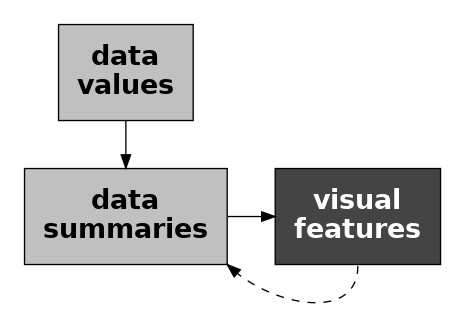
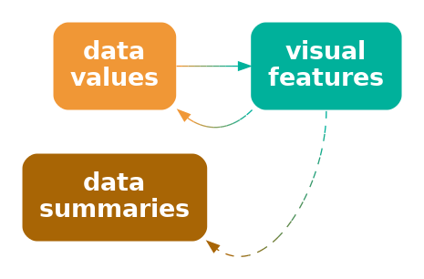

# Data Summaries {#sec-summaries}

In @sec-mapping-visual-features we described a data visualisation as
a mapping from data values to the visual features of a data symbol
(@fig-visual-feature).
For example, a bar plot,
like @fig-bar, maps the total number of youth offenders to the **lengths**
of bars.

We also emphasised the importance of the mapping *back* from the visual 
features to the data values.  For example, the effectiveness of the bar plot
in @fig-bar relies on our ability to accurately perceive the lengths
of the bars, particularly relative to each other.

In the simple scenario of a bar plot, the data values are total counts
(@tbl-crime-group-total), which are mapped to the lengths of bars, which
allow us to map back to the total counts (@fig-visual-feature-decode).

In this section, we explore some data visualisations that are effective 
because they rely on **data summaries** instead of raw data values.

## Box Plots

@fig-boxplot shows box plots of the number of 
points scored by all teams at Rugby World Cup matches
(@tbl-rwc-all),
with a separate
box plot for teams from different hemispheres.
This is an effective data visualisation for
comparing the distributions of points scored between hemispheres
because
we are able to easily see differences between the median values
of the countries (the thick vertical lines)
and differences between the interquartile ranges
of the countries (the horizontal rectangles).
For example, we can see that the median points scored
by southern hemisphere teams is larger than the median for northern
hemisphere teams and the interquartile range of points scored 
is also wider for southern hemisphere teams.

```{r}
#| echo: false
#| label: fig-boxplot
#| fig-cap: Box plots of the number of points scored in all Rugby World Cup games by Tier One nations.
gg <- ggplot(rwcAll) +
    geom_boxplot(aes(scored, hemisphere)) +
    scale_x_continuous(name="points scored") +
    theme(axis.title.y=element_blank())
pushViewport(viewport(width=.8, height=.8))
print(gg, newpage=FALSE)
popViewport()
```

Box plots are quite different from bar plots and dot plots because
the data symbol is a much more complicated shape:
there is a vertical line to represent the median, a
rectangle to represent the interquartile range (lower quartile
to upper quartile), and horizontal lines to represent the extremes of
the data values, from the the quartiles to the minimum and maximum 
values.  Points are also included for "outliers" if data values
lie further than 1.5 times the interquartile range beyond the 
quartiles.  

Another important difference with a box plot is that it maps
**data summaries** to visual features of the data symbol
(@fig-stat-vis-decode).
For example, the median values are mapped to the horizontal **positions** of 
thick vertical lines and the interquartile ranges are mapped to the
**lengths** of horizontal rectangles.

::: {#fig-stat-vis-decode}



A data visualisation may map data summaries, 
rather than the raw data, to visual features.
This is effective for mapping back to the data summaries, but it
is not effective for mapping back to the raw data.
:::


To be explicit, the data values that are being mapped to visual features in 
@fig-boxplot are *not* the raw data values in @tbl-rwc-all;
the values that are being mapped to visual features in @fig-boxplot 
are the **data summaries** shown in @tbl-rwc-all-stats.
These are the values that we can map *back* to from the boxplots
in @fig-boxplot.

```{r}
#| echo: false
#| message: false
#| label: tbl-rwc-all-stats
#| tbl-cap: A table of the five-number summaries for the number of points scored by Tier One nations in Rugby World Cup matches, along with the country name.  These data summaries are the values that are mapped to visual features to produce the box plots in @fig-boxplot.
rwcStats <- do.call(rbind, 
                    lapply(split(rwcAll, rwcAll$hemisphere), 
                           function(x) fivenum(x$scored)))
colnames(rwcStats) <- c("minimum", "lower quartile", "median", 
                        "upper quartile", "maximum")
kable(rwcStats, digits=1)
```

@fig-boxplot is effective for allowing us to compare summaries like the 
medians between different hemispheres because, although the box plot data
symbol is relatively complicated, a box plot still just maps the data
summaries to visual features. 
We know from 
@sec-mapping-visual-features that
**position** and **length** 
are effective for mapping *back* to the data summaries
(@fig-stat-vis-decode).

Notice how, even though @tbl-rwc-all-stats contains very few values,
the data visualisation in @fig-boxplot makes it *much* easier to
perceive the differences between the two rows of values in @tbl-rwc-all-stats.
Once again, we can see the power of mapping values to basic visual features.
The only differences from previous sections
is that we are mapping **data summaries** rather than raw data values
and we are mapping 
to the visual features of a more complicated data symbol.

> A box plot is effective at conveying information about the
  distribution of data values because it maps **data summaries**
  about the distribution, like the median
  and interquartile range, to basic visual features.

## Visual summaries {#sec-visual-summaries}

@fig-rwc-dotplot shows stacked dot plots of the number of points scored by 
countries from the different hemispheres in Rugby World Cup matches.
This data visualisation uses the same data as @fig-boxplot, but it
maps raw data values rather than data summaries and it uses much simpler
data symbols (data points).
This data visualisation maps the
number of points scored maps to the horizontal **position** of
a data point and it maps the hemisphere to the vertical
**position** of a data point.

Because this data visualisation maps raw data values to visual features, 
it is possible to map *back* to raw data values (@fig-visual-feature-decode).
For example, it is possible to see that the lowest score (zero points)
for a northern
hemisphere team ocurred twice.  It is also possible to see that
there are scores that have never occurred in any matches:
1, 2, 4, and 5.
These features are not visible in the boxplots
in @fig-boxplot.

```{r}
#| echo: false
#| label: fig-rwc-dotplot
#| fig-cap: Stacked dotplots of the number of points scored by Tier One nations at Rugby World Cup matches.
gg <- ggplot(rwcAll) +
    geom_segment(aes(x=-Inf, xend=Inf, y=hemisphere, yend=hemisphere),
                 colour="grey", linewidth=.1) +
    geom_dotplot(aes(scored, hemisphere), binwidth=1, dotsize=.8, fill=NA) +
    scale_x_continuous(name="points scored") +
    theme(axis.title.y=element_blank())
pushViewport(viewport(width=.8, height=.8))
print(gg, newpage=FALSE)
popViewport()
```

The fact that we can map *back* to raw data values from a dot plot is
not news.  That is easy because we have mapped
raw data values to accurate visual features
(see @sec-dot-plots).
However, @fig-rwc-dotplot also demonstrates that, in addition to mapping
*back* from visual features to raw data values, 
our visual system allows us to map *back* from visual features 
to **data summaries**.

For example, we can see that the southern hemisphere teams score slightly
more points on average than the northern hemisphere teams;
the data symbols for southern-hemisphere teams appear shifted to the right
of the data symbols for northern-hemisphere teams.
In other words, we can perform **visual summaries** that
map back to **data summaries**.
For example, we can visually average the **positions** of the data points.

In @fig-rwc-dotplot, we have mapped raw data values to visual
features, which has enabled us to map *back* to raw data values.
In addition, **visual summaries** of the visual features
enable us to map *back* to **data summaries**
(@fig-data-vis-stat-decode).[^ensembles]

[^ensembles]:
  Need some references to articles about ensembles in data vis lit
  (ideally NOT the scatter plot one cos want to use that later for 
   scatter plots).
  ALSO must relate this to Gestalt section in visual model ?

::: {#fig-data-vis-stat-decode}



A data visualisation that maps data values to visual features allows us
to map *back* to data values, but it may *also* allow us to map back to
summaries of the data, such as measures of central tendency or variability.
:::

> A dot plot is effective not just for perceiving raw data values, but
  also for perceving 
  data summaries like clusters and outliers, and central tendency
  and spread.

## Case study: Histograms

@fig-hist shows a histogram of the number of points scored by Tier One
nations at the Rugby World Cups (@tbl-rwc-all).
A histogram is similar to a box plot in two ways:
a histogram is a data visualisation that can be used to convey the
distribution of a variable; and
a histogram is a data visualisation that maps data summaries,
rather than raw values, to visual features (@fig-stat-vis-decode).

However, a histogram differs from a box plot in two main ways:
the data symbol for a histogram is simpler than a box plot
(just rectangles or bars);
and the data summaries for a histogram are more complicated than
those for a box plot.

The raw data values for the histogram in @fig-hist
are the points scored in each game
by each country (@tbl-rwc-all).
To get the data summaries for the histogram, the raw data values are
binned;  we break the range of the data into equal-sized intervals
and count how many data values lie in each interval.
The centre of each interval is then mapped to the horizontal **position**
of a bar
and the count of data values in each interval is mapped to the **length**
of a bar.

```{r}
#| echo: false
#| label: fig-hist
#| fig-cap: A histogram of the points scored per game by Tier One nations at Rugby World Cups.
breaks <- seq(0, 105, by=5)
gg <- ggplot(rwcAll) +
    geom_histogram(aes(scored), colour="black", fill="grey", breaks=breaks) +
    scale_x_continuous(name="points scored") 
pushViewport(viewport(height=.8, width=.8))
print(gg, newpage=FALSE)
popViewport()
```

To be explicit, the values that are being mapped to visual features
in @fig-hist
are not raw data values, but data summaries---intervals and counts---as
shown in @tbl-hist-stats.

```{r}
#| echo: false
#| message: false
#| label: tbl-hist-stats
#| tbl-cap: A table of intervals the cover the range of the number of points scored by Tier One nations in Rugby World Cup matches, along with the count of the number of points scored that fall within each interval.  These data summaries are the values that are mapped to visual features to produce the histogram in @fig-boxplot.
hist <- hist(rwcAll$scored, breaks=breaks, plot=FALSE)
histStats <- rbind(interval=paste0(hist$breaks[-length(hist$breaks)], "-",
                                   hist$breaks[-1]),
                   count=hist$counts)
kable(histStats, align="r")
```

As with a box plot, mapping data summaries to accurate
visual features means that we can easily map *back* to
the data summaries.
For a histogram, this means that
we can easily compare the lengths of the bars,
which means we can easily compare the relative counts of data values
within each interval.
For example, the longest bars represent the intervals that contain a
relatively large count of data values, which tells us about
the mode of the data (or the number of modes in the data).
In @fig-hist we can see that the 
largest number of data values occur around 15 to 20 points
and we can see that the number
of data values in each interval drops more rapidly above the highest bar
than below the highest bar.  The latter tells us about
the spread and/or skewness of the data.

> A histogram is effective at conveying information about the distribution
  of data values because it maps data summaries to basic visual features
  and those data summaries can be compared to provide information about
  the distribution of the data.

## Caveats {#sec-summary-caveats}

The benefit of a data visualisation that maps
**data summaries** to visual features is that it allows us to perceive
data summaries very easily.  For example, although we can perceive
a general idea of central tendency from the dots in @fig-rwc-dotplot
(see @sec-visual-summaries),
it is much easier and more accurate to perceive
median values from the thick vertical lines in @fig-boxplot.

The flipside is that a data visualisation that maps
**data summaries** to visual features
is *not* effective for mapping *back* to raw data values.
For example, we cannot see from the box plot in
@fig-boxplot that the scores 1, 2, 4, and 5 never occurred, while
this is clear from @fig-rwc-dotplot because the dot plot does map
the raw data values to data symbols.

> Box plots and 
  histograms are *not* effective at conveying raw data values because they
  do not map raw data values to data symbols.

Another point to consider with a data visualisation that is based on
data summaries is
whether the data summaries provide reasonable summaries of the data.
For example, @fig-boxplot-concede shows box plots of the number of 
points *conceded* by each team in Rugby World Cup games.
The box plot for southern hemisphere teams suggest a unimodal 
distribution with a slight right skew.

```{r}
#| echo: false
#| label: fig-boxplot-concede
#| fig-cap: Box plots of the number of points conceded in all Rugby World Cup games by Tier One nations.
gg <- ggplot(rwcAll) +
    geom_boxplot(aes(conceded, hemisphere)) +
    scale_x_continuous(name="points conceded") +
    theme(axis.title.y=element_blank())
pushViewport(viewport(width=.8, height=.8))
print(gg, newpage=FALSE)
popViewport()
```

However, the dot plots in @fig-rwc-dotplot-concede tell a different story.
This data visualisation shows some evidence that the number of points
conceded by southern-hemisphere teams
may be bimodal, with some teams only conceding very few points
(0, 3, or 6)
in a number of games.
The data summaries for a box plot assume a unimodal distribution,
so a box plot will only ever tell a unimodal story, and that
is only reasonable if the data are unimodal.

```{r}
#| echo: false
#| label: fig-rwc-dotplot-concede
#| fig-cap: Stacked dotplots of the number of points conceded by Tier One nations at Rugby World Cup matches.
gg <- ggplot(rwcAll) +
    geom_segment(aes(x=-Inf, xend=Inf, y=hemisphere, yend=hemisphere),
                 colour="grey", linewidth=.1) +
    geom_dotplot(aes(conceded, hemisphere), binwidth=1, dotsize=.8, fill=NA) +
    scale_x_continuous(name="points conceded") +
    theme(axis.title.y=element_blank())
pushViewport(viewport(width=.8, height=.8))
print(gg, newpage=FALSE)
popViewport()
```

> A box plot is *not* effective if a five-number summary is not a 
  sensible summary of the data values.

> A data visualisation that is based on data summaries
  can only be effective if the data summaries are sensible
  summaries of the data.

A further complication arises with histograms because we have to
*choose* the intervals that are used to calculate the data summaries
and that choice can have a large influence on the data summaries.
For example, @fig-hist-thin shows a histogram of the same data that
we used for @fig-hist, but with a greater number of narrower intervals.
This visualisation tells a slightly different story than @fig-hist.
The most common score is now 6 points and we see features
like gaps at 1, 2, 4, and 5 points and a stronger suggestion of 
bimodality.

Unlike a box plot, where the data summaries are essentially fixed
calculations, for a histogram we get to choose the data summaries
to some extent, which means that we get to choose the story that
the data visualisation tells.  @fig-hist tells a simpler story,
but @fig-hist-thin tells a story that includes some important details.

When using a histogram for exploring a data set, it is a good idea
to try out more than one choice of intervals in order to avoid missing
an important story.
When using a histogram to present a story about a data set,
there is a responsibility to present a story that does not 
exclude important details.

```{r}
#| echo: false
#| label: fig-hist-thin
#| fig-cap: A histogram of the points scored per game by Tier One nations at Rugby World Cups.  This histogram uses the same data as @fig-hist, but bins the data using narrower intervals.
gg <- ggplot(rwcAll) +
    geom_histogram(aes(scored), colour="black", fill="grey", 
                   binwidth=1, boundary=.5) +
    scale_x_continuous(name="points scored") 
pushViewport(viewport(height=.8, width=.8))
print(gg, newpage=FALSE)
popViewport()
```

## Summary

Data summaries, such as measures of central tendency, measures of
variability, and tables of counts, provide information about
the distribution of a set of data values.

Some data visualisations, like box plots and histograms,
are effective because they map **data summaries** to visual features.
This makes it easy to perceive and compare data summaries.

Care must be taken to use data summaries that appropriately summarise
the data values.

When we map raw data values to visual features, like in a dot plot,
the perception of individual visual features allows us to 
perceive and compare raw data values, but, in addition,
**visual summaries** of *collections* of
visual features allow us to perceive and compare data summaries.

A box plot that maps data summaries to visual features is more effective
for perceiving data summaries 
than a dot plot that relies on visual summaries.
However, a dot plot is more effective for perceiving raw data values.
