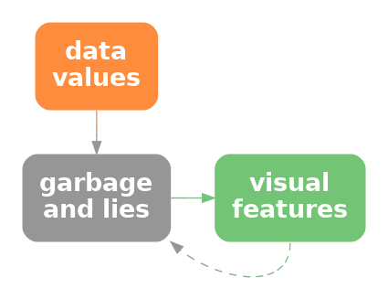
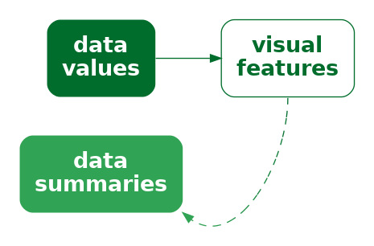

```{r}
#| echo: false
#| message: false
source("common.R")
```

# Mapping Summaries {#sec-summaries}

In @sec-mapping-visual-features we described a data visualisation as
a mapping that **encodes** data values as the visual features of a data symbol
(@fig-visual-feature).
For example, a bar plot,
like @fig-bar, maps the total number of youth offenders to the **lengths**
of bars.

We also emphasised the importance of the **decoding** from visual 
features to data values.  For example, the effectiveness of the bar plot
in @fig-bar relies on our ability to accurately decode the lengths
of the bars, particularly relative to each other.

In the simple scenario of a bar plot, the data values are counts
(@tbl-crime-group-total), which are encoded as the lengths of bars, which
in turn allows us to decode lengths to retrieve 
the counts (@fig-visual-feature-decode).
Each **raw data value** (count) is mapped to the length of a bar.

In this chapter, we explore some data visualisations that are effective 
because they encode **data summaries** instead of 
raw data values.[^info-vis-ref-model]

[^info-vis-ref-model]:
    In this book, we use *data summary* to cover a broad range
    of transformations of the data.
    These are transformations that occur prior to the 
    mapping of data values to visual features.

    There are several more sophisticated break downs of the pipeline
    from data values to visual representations.
    For example, the Information Visualization Reference Model 
    [@card1999readings] includes the transformation of data into a 
    standard format (*data transformations*) prior to mapping data values
    to visual features 
    and also includes the subsequent transformation and scaling 
    of visual features to
    positions and shapes on the screen or page (*view transformations*).

    @wu2024designspecifictransformationsvisualization differentiates
    between *data transformations* and
    *design-specific transformations*, such as the calculation
    of summaries for a box plot. 

    The idea of a *data summary* corresponds well with 
    the idea of a *statistic* in the *Grammar of Graphics* [@wilkinson2005],
    although in this book, because we only consider static data
    visualisations, the connection with the raw data is lost.
    The *Grammar of Graphics* also includes transformations
    in the form of *scales* and *coordinates*, which roughly correspond 
    to the *view transformations* of the Information Visualization
    Reference Model.

## Box plots

@fig-boxplot shows box plots of the number of 
points scored by Tier One nations at Rugby World Cup matches
(@tbl-rwc-all),
with a separate
box plot for teams from different hemispheres.[^box-plot]
This is an effective data visualisation for
comparing the distributions of points scored between hemispheres
because
we are able to easily see differences between the median values
of the countries (the thick vertical lines)
and differences between the interquartile ranges
of the countries (the horizontal rectangles).
For example, we can see that the median points scored
by southern hemisphere teams is larger than the median for northern
hemisphere teams and the interquartile range of points scored 
is also wider for southern hemisphere teams.

[^box-plot]:
    John W. Tukey is credited as the inventor of the box plot
    [@tukey1977eda].

```{r}
#| echo: false
#| label: fig-boxplot
#| fig-keep: last
#| fig-cap: Box plots of the number of points scored in all Rugby World Cup games by Tier One nations.
gg <- ggplot(rwcAll) +
    geom_boxplot(aes(scored, hemisphere)) +
    scale_x_continuous(name="points scored") +
    theme(axis.title.y=element_blank())
pushViewport(viewport(width=.8, height=.8))
print(gg, newpage=FALSE)
popViewport()
grid.force()
grid.edit("crossbar::segment", grep=TRUE, global=TRUE, gp=gpar(lwd=4))
```

Box plots are quite different from bar plots and dot plots because
the data symbol is a much more complicated shape:
there is a vertical line to represent the median, a
rectangle to represent the interquartile range (lower quartile
to upper quartile), and horizontal lines to represent the extremes of
the data values, from the the quartiles to the minimum and maximum 
values.  Points are also included for "outliers" if data values
lie further than 1.5 times the interquartile range beyond the 
quartiles.

Another important difference with a box plot is that it maps
**data summaries**, rather than raw data values,
to visual features of the data symbol
(@fig-stat-vis-decode).
For example, the median values are mapped to the horizontal **positions** of 
thick vertical lines and the interquartile ranges are mapped to the
**lengths** of horizontal rectangles.

::: {#fig-stat-vis-decode}
::: {.content-visible when-format=pdf}
\includegraphics[scale=0.5]{Diagrams/stat-vis-decode.png}
:::

::: {.content-visible when-format=html}

:::

A data visualisation may encode data summaries, 
rather than the raw data, as visual features.
This is effective for decoding the data summaries, but it
is not effective for decoding the raw data.
:::

To be explicit, the data values that are being **encoded** 
as visual features in 
@fig-boxplot are *not* the raw data values in @tbl-rwc-all;
the values that are being encoded to visual features in @fig-boxplot 
are the **data summaries** shown in @tbl-rwc-all-stats.
The data summaries in @tbl-rwc-all-stats
are the values that we can **decode** from the boxplots
in @fig-boxplot.[^readable]

[^readable]:
    @Ziemkiewicz2009 refer to this as the *readability* of *aggregations*.

```{r}
#| echo: false
#| message: false
#| label: tbl-rwc-all-stats
#| tbl-cap: A table of the five-number summaries for the number of points scored by Tier One nations in Rugby World Cup matches, along with the country name.  These data summaries are the values that are mapped to visual features to produce the box plots in @fig-boxplot.
rwcStats <- do.call(rbind, 
                    lapply(split(rwcAll, rwcAll$hemisphere), 
                           function(x) fivenum(x$scored)))
colnames(rwcStats) <- c("minimum", "lower quartile", "median", 
                        "upper quartile", "maximum")
kable(rwcStats, digits=1)
```

@fig-boxplot is effective for allowing us to compare summaries like the 
medians between different hemispheres because, although the box plot data
symbol is relatively complicated, a box plot still just encodes the data
summaries to simple visual features. 
We know from 
@sec-mapping-visual-features that
**position** and **length** 
are effective for **decoding** the data summaries from the visual features
(@fig-stat-vis-decode).

Notice how, even though @tbl-rwc-all-stats contains very few values,
it is much easier to perceive the differences between the two rows of values
using the data visualisation in @fig-boxplot rather than the table of
values in @tbl-rwc-all-stats.
Once again, we can see the power of mapping values to basic visual features.
The only differences from previous sections
is that we are mapping **data summaries** rather than raw data values
and we are mapping 
to the visual features of a more complicated data symbol.

> A box plot is effective at conveying information about the
  distribution of data values because it maps **data summaries**
  about the distribution, like the median
  and interquartile range, to basic visual features.

## Visual summaries {#sec-visual-summaries}

@fig-rwc-dotplot shows a dot plot of the number of points scored by 
countries from the different hemispheres in Rugby World Cup matches.[^dotplot]
This data visualisation uses the same data as @fig-boxplot, but it
maps raw data values rather than data summaries and it uses much simpler
data symbols (data points).
This data visualisation encodes the
number of points scored maps as the horizontal **position** of
a data point and it encodes the hemisphere as the vertical
**position** of a data point.
There is an overplotting problem (@sec-overplot), which is solved in this
case by offsetting data symbols vertically for repeated data values.

[^dotplot]:
    The general idea of arranging
    overlapping dots so that they are all visible, not just
    jittering them (@sec-jitter), goes back to 
    @Wilkinson01081999 and @tukey1977eda.
    The vertically-centred arrangement used here is also
    known as a *beeswarm plot* [@rosanbalm2014beeswarm].

Because this data visualisation encodes raw data values as visual features, 
it is possible to decode raw data values from the visual features
(@fig-visual-feature-decode).
For example, it is possible to see that the lowest score (zero points)
for a northern
hemisphere team ocurred twice.  It is also possible to see that
there are scores that have never occurred in any matches:
1, 2, 4, and 5.
These features are not visible in the boxplots
in @fig-boxplot.

```{r}
#| echo: false
#| label: fig-rwc-dotplot
#| fig-cap: Stacked dotplots of the number of points scored by Tier One nations at Rugby World Cup matches.
gg <- ggplot(rwcAll) +
    geom_segment(aes(x=-Inf, xend=Inf, y=hemisphere, yend=hemisphere),
                 colour="grey", linewidth=.1) +
    geom_dotplot(aes(scored, hemisphere), binwidth=1, dotsize=.8, fill=NA,
                 stackdir="center") +
    scale_x_continuous(name="points scored", breaks=seq(0, 100, 10)) +
    theme(axis.title.y=element_blank())
grid.newpage()
pushViewport(viewport(width=.8, height=.8))
print(gg, newpage=FALSE)
popViewport()
```

The fact that we can decode raw data values from a dot plot is
not news.  That is easy because we have encoded
raw data values as accurate visual features
(see @sec-dot-plots).
However, @fig-rwc-dotplot also demonstrates that, in addition to decoding
raw data values from visual features, 
our visual system allows us to decode
**data summaries** from visual features.

For example, we can see that the southern hemisphere teams score slightly
more points on average than the northern hemisphere teams;
the data symbols for southern-hemisphere teams appear shifted to the right
of the data symbols for northern-hemisphere teams.
In other words, we can perceive **visual summaries**;
we can perceive **data summaries** from collections of visual features.
For example, we can visually average the **positions** of the data 
points.[^ensembles]

[^ensembles]:
    The ability to decode summary statistics from multiple visual
    objects is known as *ensemble perception*.
    @cui2021synergy and @ensemble-perception provide modern overviews.

    A related concept is *subitizing*, which is the ability to
    rapidly identify the number of visual objects, though that
    only works for very small numbers of objects
    [@ware2021information].

In @fig-rwc-dotplot, we have encoded raw data values as visual
features, which has enabled us to decode raw data values from individual
visual features.
In addition, **visual summaries** of the visual features
enable us to decode **data summaries** from collections of visual features
(@fig-data-vis-stat-decode).

::: {#fig-data-vis-stat-decode}
::: {.content-visible when-format=pdf}
\includegraphics[scale=0.5]{Diagrams/data-vis-stat-decode.png}
:::

::: {.content-visible when-format=html}

:::

A data visualisation that encodes data values as visual features allows us
to decode data values, but it may *also* allow us to decode
summaries of the data, such as measures of central tendency or variability.
:::

> A dot plot is effective not just for perceiving raw data values, but
  also for perceving 
  data summaries like clusters and outliers, and central tendency
  and spread.

## Case study: Histograms

@fig-hist shows a histogram of the number of points scored by Tier One
nations at the Rugby World Cups (@tbl-rwc-all).
A histogram is similar to a box plot in two ways:
a histogram is a data visualisation that can be used to convey the
distribution of a variable; and
a histogram is a data visualisation that maps **data summaries**,
rather than raw values, to visual features (@fig-stat-vis-decode).

However, a histogram differs from a box plot in two main ways:
the data symbol for a histogram is simpler than a box plot,
because it consists of just rectangles or bars;
and the data summaries for a histogram are more complicated than
those for a box plot.

The raw data values for the histogram in @fig-hist
are the points scored in each game
by each country (@tbl-rwc-all).
To get the data summaries for the histogram, the raw data values are
binned;  we break the range of the data into equal-sized intervals
and count how many data values lie in each interval.
The centre of each interval is then encoded as the horizontal **position**
of a bar
and the count of data values in each interval is encoded as the **length**
of a bar.

```{r}
#| echo: false
#| label: fig-hist
#| fig-cap: A histogram of the points scored per game by Tier One nations at Rugby World Cups.
breaks <- seq(0, 105, by=5)
gg <- ggplot(rwcAll) +
    geom_histogram(aes(scored), colour="black", fill="grey", breaks=breaks) +
    scale_x_continuous(name="points scored") +
    scale_y_continuous(expand=expansion(c(0, .05)))
pushViewport(viewport(height=.8, width=.8))
print(gg, newpage=FALSE)
popViewport()
```

To be explicit, the values that are being mapped to visual features
in @fig-hist
are not raw data values, but data summaries---intervals and counts---as
shown in @tbl-hist-stats.[^bar-summary]

[^bar-summary]:
    A bar plot can also be thought of in terms of mapping data
    summaries rather than raw data.  The data values that are
    encoded as the lengths of bars in a bar plot are tables of
    counts of raw data values; the raw data values are individual 
    observations of a single qualitative variable, such as the
    ethnicity of a single youth offender.

    See this way, there are raw data values that cannot be decoded from
    a bar plot.
    For example,
    information about an individual offender cannot be decoded from a bar plot
    because all similar individuals are represented together by a single
    bar data symbol.

```{r}
#| echo: false
#| message: false
#| label: tbl-hist-stats
#| tbl-cap: A table of intervals that cover the range of the number of points scored by Tier One nations in Rugby World Cup matches, along with the count of the number of points scored that fall within each interval.  These data summaries are the values that are mapped to visual features to produce the histogram in @fig-boxplot.  Not all intervals are shown for reasons of space.
hist <- hist(rwcAll$scored, breaks=breaks, plot=FALSE)
histStats <- rbind(interval=paste0(hist$breaks[-length(hist$breaks)], "-",
                                   hist$breaks[-1]),
                   count=hist$counts)
kable_styling(kable(histStats[,1:13], align="r"), font_size=8)
```

As with a box plot, encoding data summaries as accurate
visual features, in this case **position** and **length**,
means that we can easily decode
data summaries from the visual features.
For a histogram, this means that
we can easily compare the lengths of the bars,
which means we can easily compare the counts of data values
within each interval.
For example, the longest bars represent the intervals that contain a
relatively large count of data values, which tells us about
the mode of the data (or the number of modes in the data).
In @fig-hist we can see that the 
largest number of data values occur around 15 to 20 points
and we can see that the number
of data values in each interval drops more rapidly above the highest bar
than below the highest bar.  The latter tells us about
the spread and/or skewness of the data.

> A histogram is effective at conveying information about the distribution
  of data values because it maps data summaries to basic visual features
  and those data summaries can be compared to provide information about
  the distribution of the data.

## Decoding summaries

When we encode a data summary as a visual feature, like the position
of the median line of a boxplot (@fig-boxplot), we know from
previous chapters how effective the decoding is going to be.
For example, because the median is encoded as position, we should be
able to decode the median very accurately (@sec-accuracy).

However, if we rely on a visual summary to decode a data summary, for example,
comparing the 
average points scored by teams from different hemispheres based on
a collection of data points for each hemisphere (@fig-rwc-dotplot),
we are no longer dealing with just the decoding of a single visual feature.
How well can we decode the average from the positions of several data symbols
compared to decoding a single data value from a single data symbol?
How effective is the decoding from visual features to
a data summary (@fig-data-vis-stat-decode)?

One issue that arises is that there are many possible visual summaries.
For example, we might be interested in the average data value, or the
variability of data values, whether there are unusual data values (outliers),
or whether there are groups of data values (clusters).[^strict-ensemble]

[^strict-ensemble]:
    In the visual perception literature, the strict definition of 
    *ensemble* encoding is limited to *statistical moments*
    (means and variances) [@ensemble-perception],
    but the data visualisation literature takes a more relaxed
    approach [@ensemble-scatter].

Furthermore, we can produce each sort of visual summary for each
possible visual feature.
For example, we can decode the average position of data symbols, or
the average luminance of data symbols, or the average area of data symbols.
We can decode unusual positions, unusual colours, or unusual angles.

Although it is well-established that our visual system is capable of
generating visual summaries, less is known about the accuracy of those
summaries, partly because the range of possible visual summaries
is so large.
However, we know that
estimating averages from the positions of multiple data symbols
is quite accurate
and estimating averages from the luminance and/or chroma
of multiple data symbols can also be effective.[^visual-average]

[^visual-average]:
    @visual-average show that the average position of data points
    in a scatterplot can be accurately determined and that this is robust
    to a number of variations in context, such as the number of data points
    and the presence of distractors.

    @time-series-ensemble show that the average luminance of rectangles
    in a colour field can be determined reasonably well.  This study
    is also a good demonstration of both the multitude of visual
    summaries that can be studied and the variability of 
    performance across different combinations of visual summaries
    and visual features.

## Dangers of summaries {#sec-summary-caveats}

The benefit of a data visualisation that encodes
**data summaries** as visual features is that it allows us to decode
data summaries very easily.  For example, although we can perceive
a general idea of central tendency from the dots in @fig-rwc-dotplot
(see @sec-visual-summaries),
it is much easier and more accurate to perceive
median values from the thick vertical lines in @fig-boxplot.

The flipside is that a data visualisation that encodes
**data summaries** as visual features
is *not* effective for decoding raw data values.
For example, we cannot see from the box plot in
@fig-boxplot that the scores 1, 2, 4, and 5 never occurred, while
this is clear from @fig-rwc-dotplot because the dot plot does map
the raw data values to data symbols.

> Box plots and 
  histograms are *not* effective at conveying raw data values because they
  do not map raw data values to data symbols.

Another point to consider with a data visualisation that is based on
data summaries is
whether the data summaries provide reasonable summaries of the data.[^Anscombe]
For example, @fig-boxplot-concede shows box plots of the number of 
points *conceded* by each team in Rugby World Cup games.
The box plot for southern hemisphere teams suggests a unimodal 
distribution with a slight right skew.

[^Anscombe]:
    The classic demonstration of the idea that numerical summaries
    may not satisfactorily summarise the raw data is
    Anscombe's quartet [@Anscombe1973].
    @MatejkaFitzmaurice2017 provide a more modern update,
    including Alberto Cairo's *datasaurus* [@datasaurus].

```{r}
#| echo: false
#| label: fig-boxplot-concede
#| fig-cap: Box plots of the number of points conceded in all Rugby World Cup games by Tier One nations.
gg <- ggplot(rwcAll) +
    geom_boxplot(aes(conceded, hemisphere)) +
    scale_x_continuous(name="points conceded") +
    theme(axis.title.y=element_blank())
pushViewport(viewport(width=.8, height=.8))
print(gg, newpage=FALSE)
popViewport()
```

However, the dot plots in @fig-rwc-dotplot-concede tell a different story.
This data visualisation shows some evidence that the number of points
conceded by southern-hemisphere teams
may be bimodal, with some teams only conceding very few points
(0, 3, or 6)
in a number of games.
The data summaries for a box plot assume a unimodal distribution,
so a box plot will only ever tell a unimodal story, and that
is only reasonable if the data are unimodal.

```{r}
#| echo: false
#| label: fig-rwc-dotplot-concede
#| fig-cap: Stacked dotplots of the number of points conceded by Tier One nations at Rugby World Cup matches.
gg <- ggplot(rwcAll) +
    geom_segment(aes(x=-Inf, xend=Inf, y=hemisphere, yend=hemisphere),
                 colour="grey", linewidth=.1) +
    geom_dotplot(aes(conceded, hemisphere), binwidth=1, dotsize=.8, fill=NA,
                 stackdir="center") +
    scale_x_continuous(name="points conceded", breaks=seq(0, 100, 10)) +
    theme(axis.title.y=element_blank())
pushViewport(viewport(width=.8, height=.8))
print(gg, newpage=FALSE)
popViewport()
```

> A data visualisation that is based on data summaries
  can only be effective if the data summaries are sensible
  summaries of the data.

> A box plot is *not* effective if a five-number summary is not a 
  sensible summary of the data values.

A further complication arises with histograms because we have to
*choose* the intervals that are used to calculate the data summaries
and that choice can have a large influence on the data summaries.
For example, @fig-hist-thin shows a histogram of the same data that
we used for @fig-hist, but with a greater number of narrower intervals.
This visualisation tells a slightly different story than @fig-hist.
The most common score is now 6 points (rather than between 15 and 20 points)
and we see features
like gaps at 1, 2, 4, and 5 points and a stronger suggestion of 
bimodality.  There are also point totals that appear strangely low,
like 11 and 14.

Unlike a box plot, where the data summaries are essentially fixed
calculations,[^box-stats] for a histogram we get to choose the data summaries
to some extent, which means that we get to choose the story that
the data visualisation tells.  @fig-hist tells a simpler story,
but @fig-hist-thin tells a story that includes some important details.

[^box-stats]:
    It is not true that there is only one way to generate the data
    summaries for a box plot.
    @boxplot-variations describe several early variants and
    *letter-value plots* are an example of a more modern adaptation
    [@letter-value].

When using a histogram for exploring a data set, it is a good idea
to try out more than one choice of intervals in order to avoid missing
an important story.
When using a histogram to present a story about a data set,
there is a responsibility to present a story that does not 
exclude important details.

```{r}
#| echo: false
#| label: fig-hist-thin
#| fig-cap: A histogram of the points scored per game by Tier One nations at Rugby World Cups.  This histogram uses the same data as @fig-hist, but bins the data using narrower intervals.
gg <- ggplot(rwcAll) +
    geom_histogram(aes(scored), colour="black", fill="grey", 
                   binwidth=1, boundary=.5) +
    scale_x_continuous(name="points scored", breaks=seq(0, 100, 10)) 
pushViewport(viewport(height=.8, width=.8))
print(gg, newpage=FALSE)
popViewport()
```

## Case study: How charts lie

In this book, we assume that the purpose of a data visualisation
is to faithfully and honestly encode data values and the goal
is to produce a data visualisation that provides the most effective decoding 
(@sec-scope).
Nevertheless, even 
less honest representations of data can also be 
thought of in terms of mappings, particularly mappings of data
summaries.

For example, @fig-bars-at-zero shows a bar plot
of the predicted impact on the top tax rate in the United States
from President George W. Bush to President Barack Obama.[^bars-at-zero]
One problem with this data visualisation is that it does not
encode raw data values---the 
actual predicted top tax rates are 35 and 39.6.
Instead, a "data summary" of the tax rate *minus 34* (the values
1 and 5.6) are encoded as the lengths of the two bars.
We are unable to decode the raw data from this bar plot---we 
can only decode the data values that have been encoded---and this
leads to an extreme exaggeration of the difference between the two
top tax rates.

[^bars-at-zero]: 
    This is a reproduction of a chart from Alberto Cairo's "How Charts Lie"
    (p12-13), which itself was a reproduction of a chart shown by Fox News.

```{r}
#| echo: false
#| warning: false
#| label: fig-bars-at-zero
#| fig-cap: A bar plot of the increase in the top tax rate in the United States of America from President George W. Bush to President Barack Obama.
years <- c("Now", "Jan. 2013")
tax <- data.frame(year=factor(years, levels=years),
                  rate=c(35, 39.6))
barlabs <- function(data, coords) {
    grobTree(textGrob(paste0(data$y[1], "%"), x=coords$x[1],
                      y=unit(coords$y, "npc") + unit(1, "lines")),
             textGrob("?", x=coords$x[2],
                      gp=gpar(col=figbg, fontsize=100, fontface="bold")))
}
ggplot(tax) +
    geom_col(aes(year, rate, fill=year)) +
    scale_fill_manual(values=c("black", highlight)) +
    grid_panel(segmentsGrob(0, 0, 1, 0, gp=gpar(lwd=3),
               vp=viewport(clip=FALSE))) +
    grid_panel(textGrob("If Bush\ntax cuts\nexpire",
               x=0, y=1, just=c(0, 1),
               gp=gpar(fontsize=30, fontface="bold", lineheight=.8))) +
    grid_panel(textGrob("Top tax rate:",
               x=0, y=.5, just="left",
               gp=gpar(fontsize=20, fontface="bold"))) +
    grid_panel(barlabs, aes(year, rate)) +
    coord_cartesian(ylim=c(34, NA)) +
    scale_y_continuous(expand=expansion(0)) +
    theme_minimal() +
    theme(plot.margin=unit(c(2, 0, 1, 0), "lines"),
          panel.grid=element_blank(),
          title=element_blank(),
          axis.text.y=element_blank(),
          axis.text.x=element_text(size=20, face="bold", 
                                   colour=c("black", highlight)),
          legend.position="none",
          aspect.ratio=.8)
```

A data visualisation that encodes a
data summary that is a distortion of the data or an 
inappropriate subset of the data
is encoding unhelpful information to visual features.
It is only then possible to decode 
unhelpful information from the data visualisation (@fig-lie-vis-decode).

::: {#fig-lie-vis-decode}
::: {.content-visible when-format=pdf}
\includegraphics[scale=0.5]{Diagrams/lie-vis-decode.png}
:::

::: {.content-visible when-format=html}

:::

A data visualisation may map an unrepresentative or "cooked" version
of the data, 
rather than the raw data, to visual features.
Visual decoding leads back to the lies rather than the real data.
:::

## Visual downgrades {#sec-downgrade}

We have seen that a downside to mapping data summaries,
rather than raw data values, is that we lose the ability to decode
raw data values from data symbols.
However, we pay this price in order to improve our ability to 
decode data summaries from the data symbols.
For example, a boxplot makes it easier to decode the median
of a set of data values.

By mapping data summaries, we deliberately lose the ability to
decode raw data values in order to gain the ability to decode
data summaries.

Another way that we may
deliberately lose information 
is by selecting a visual feature that does not
allow complete decoding of the original data values.

For example, @fig-downgrade shows the 
crime rate for 2021
in each police district of New Zealand.
The data values for this map are shown in @tbl-map-data.

```{r}
#| echo: false
#| label: tbl-map-data
#| tbl-cap: The average crime rate over the period 2011 to 2021 for each police district of New Zealand.
kable(crimeDistrictTotal[c("district", "rate")], digits=2)
```

The data symbols in @fig-downgrade are circles with the 
geographic location of the (centre of the) police district
mapped to the position of the circles and the crime rate
mapped to the (fill) colour, particularly the luminance, of the circles.
Darker circles represent higher crime rates.

```{r}
#| echo: false
#| warning: false
#| label: fig-downgrade
#| fig-cap: A map of New Zealand with .
districts <- 
    st_read("Data/YouthCrime/SHP/nz-police-district-boundaries-29-april-2021.shp",
            quiet=TRUE)
centroids <- st_coordinates(st_centroid(st_geometry(districts)))
districts$X <- centroids[,1]
districts$Y <- centroids[,2]
districts <- inner_join(districts, subset(crimeDistrict, year == 2021),
                        by=join_by(D_MACRON == district))
ggplot(districts) +
    geom_sf(fill="white", colour=figbg, linewidth=1) +
    geom_point(aes(X, Y, fill=rate), size=4, shape=21, colour="black") +
    scale_size_area() +
    theme(axis.ticks=element_blank(),
          axis.text=element_blank(),
          axis.title=element_blank())
```

We know that encoding the crime rate as luminance
is not an appropriate encoding for quantitative data values
(@sec-quant-features).
The best we can decode is ordinal data values from the luminance
of the circles (@sec-qual-features).

However, we may accept this loss of information in order to gain
the ability to decode the geographic position of the police
districts.
For example, although we cannot decode exact crime rates,
we are able to see that the higher crime rates correspond to
more rural areas;  the lighter circles appear in 
the urban regions that include New Zealand's
largest  cities: Auckland, Wellington,
and Christchurch.

In @fig-downgrade,
we can only decode to **data summaries** of the crime rate because
we an only decode the **ranking** of the crime rates, not individual
numeric crime rates and not numeric differences between crime rates
(@fig-data-vis-stat).

::: {#fig-data-vis-stat}
::: {.content-visible when-format=pdf}
\includegraphics[scale=0.5]{Diagrams/data-vis-stat.png}
:::

::: {.content-visible when-format=html}

:::

A data visualisation may encode data values as a visual feature that does not allow decoding back to the original data values.  Instead, it is only possible to decode summaries of the data.
:::

On the other hand, this loss of information is acceptable if
the decoding still allows us to 
make useful comparisons.
Put more strongly, the numeric comparisons that we lose
access to may not be the most important decodings, so the loss
may not be that important.[^ordinal-comparison]

[^ordinal-comparison]:
    @all-scatterplots argue that ordinal comparisons are 
    more commonly useful in practice than quantitative comparisons.

    "1. Graphics are for the qualitative/descriptive---conceivably the
    semiquantitative---never for the carefully quantitative."

    "2. Graphics are for comparison-comparison of one kind or another - not for
    access to individual amounts."

    @graphic-comparisons

For comparison, @fig-no-downgrade shows a simple bar plot of the same
crime rates.  In this data visualisation, although we can decode
and compare the numeric crime rates much more accurately, the
rural/urban comparison is much more difficult.

```{r}
#| echo: false
#| warning: false
#| label: fig-no-downgrade
#| fig-cap: A bar plot of the crime rate for 2021 in each police district of New Zealand.
district2021 <- subset(crimeDistrict, year == 2021)
district2021$district <- reorder(district2021$district, district2021$rate)
ggplot(district2021) +
    geom_col(aes(x=rate, y=district)) +
    scale_x_continuous(expand=expansion(c(0, .05))) +
    ggtitle("Crime Rate per Police District (2021)") +
    theme(axis.title=element_blank(),
          aspect.ratio=1)
```

## Case study:  Heatmaps

Heatmaps
are a common way of representing three-dimensional data where 
two of the data variables are either qualitative 
or have been measured on a regular grid and the third
variable is **quantitative**.
The first two variables naturally map to horizontal and vertical
**position** to produce an array of
rectangles, while the third variable maps to **colour**.

We saw an example of a heatmap in @fig-crime-heatmap and
@fig-nomads-purple shows another example that is a variation on 
@fig-nomads-rainbow and @fig-nomads-viridis.

::: {#fig-nomads-purple}

::: {.content-visible when-format=pdf}
\includegraphics[width=.5\textwidth]{Data/Weather/NOMADS-purple.png}
:::

::: {.content-visible when-format=html}

:::

A snapshot of wind strength in the vicinity of New Zealand on September 14 2024.
This uses the same data as 
@fig-visual-model-demo, but does not show wind direction.
:::

The use of colour to encode quantitative data values
is not optimal for accuracy (@sec-quant-features).
However, as we saw in @sec-downgrade, as long as the colour
scheme has monotonic luminance and/or chroma changes,
it is still possible to decode ordinal values.

Furthermore, we are able to decode useful visual summaries from
the multiple rectangle data symbols on a heat map
(@sec-visual-summaries).
For example, we can identify regions of darker or lighter colours,
not just individual dark or light rectangles.[^heatmap-ensemble]

[^heatmap-ensemble]:
    @correll-heatmap-ensemble provide evidence for superior ensemble perception
    of "high" regions within a time series from "colour fields"
    (heatmaps) compared to traditional time series line plots.

On the downside, because each rectangle in a heatmap is surrounded by
other rectangles of differing colours, it is difficult to accurately
decode the colours of individual rectangles (@sec-colour-relative).

In the case of a heatmap, ordinal comparisons are typically what
is of most importance.  The aim is *not* to be able to decode
individual quantitative data values
and this moderates the damage that is done by relative perception
of the heatmap rectangles.

## Cognitive load

Consider the following sentence about changes in global malnutrition 
rates:[^vaclav-smil]

[^vaclav-smil]:
    [@smil2022how, p. 46]

::: {.actual-quote}
"rising food production reduced the malnutrition rate from 2 in 3 people
in 1950 to 1 in 11 by 2019"
:::

In order to comprehend the change in malnutrition rate, we are required
to compare "2 in 3" to "1 in 11".  This requires mental effort to calculate
the ratios or fractions and then compare them.
It is easier to compare the rates if we 
hold the denominator constant, comparing "2 in 3" to "2 in 22".
It is easier still if we calculate the fractions, comparing 0.667 to 0.091.
And it is easier still to compare those fractions visually
(@fig-cog-load).

```{r}
#| echo: false
#| label: fig-cog-load
#| fig-cap: A bar plot comparing two fractions.
fractions <- data.frame(year=factor(c(1950, 2019)), frac=c(2/3, 1/11))
ggplot(fractions) +
    geom_col(aes(year, frac)) +
    scale_y_continuous(expand=expansion(c(0, .05))) +
    xlab(NULL) +
    ylab(NULL) +
    labs(title="Proportion of Population\nSuffering from Malnutrition") +
    theme(aspect.ratio=1)
```

The point is that we can reduce the cognitive load that is
required of the viewer if we make the mental
calculations that are required easier.  We can reduce
the cognitive load further if we present the results of
the calculation directly and even further
if we encode the results of the calculation
as simple visual features.

In other words, we can calculate **data summaries** or we can 
force the viewer to perform **visual summaries**.

Conversely, we can add to the cognitive load if we make the visual
calculations harder.
For example, @fig-cog-load-hi shows a bar plot of the original 
"2 in 3" versus "1 in 11" data values.
We now need to perceive the proportion of blue bars relative to red bars
and compare those proportions, which is clearly more work than just 
comparing the two bars in @fig-cog-load.

```{r}
#| echo: false
#| label: fig-cog-load-hi
#| fig-cap: A bar plot comparing two fractions.
counts <- data.frame(year=factor(c(1950, 1950, 2019, 2019)), 
                     group=factor(c("yes", "out of", "yes", "out of"),
                                  levels=c("out of", "yes")),
                     count=c(2, 3, 1, 11))
fills <- pal_npg()(2)
ggplot(counts) +
    geom_col(aes(year, count, fill=group), position="dodge") +
    scale_y_continuous(expand=expansion(c(0, .05))) +
    xlab(NULL) +
    ylab(NULL) +
    labs(title=paste0('<span style="color: ', fills[2], '">X</span> ',
                      'people out of ',
                      '<span style="color: ', fills[1], '">Y</span><br>',
                      'suffer from Malnutrition')) +
    theme(legend.position="none",
          aspect.ratio=1,
          plot.title=element_markdown())
```

We ideally want to present data in a way that
imposes the least cognitive load on the viewer.
In terms of @sec-tasks, we want to present the viewer
with simple **visual tasks**.[^task-taxonomy]

[^task-taxonomy]:
    The 10 data visualisation tasks in @amar-taxonomy all correspond
    to some sort of numerical summary of the data.
    We can choose to perform the numerical summary and then
    visualise the result, or we can choose to present the raw data
    and ask the viewer to perform a visual summary.
    We should choose whichever will be easier for the viewer.

The best data visualisation will be different for different questions
of interest, but 
if the question of interest involves comparing data summaries, then
one way that we 
can make the viewer's life easier is by calculating summaries
of the data and encoding data summaries as visual features,
rather than encoding raw data values and asking the viewer
to perform visual summaries.

> It is possible in some cases to rely on visual summaries, but 
  we need to be careful
  not to set a visual task that requires too much mental effort.

## Summary

Data summaries, such as measures of central tendency, measures of
variability, and tables of counts, provide information about
the distribution of a set of data values.

Some data visualisations, like box plots and histograms,
are effective because they map **data summaries** to visual features.
This makes it easy to decode and compare data summaries.

Care must be taken to use data summaries that appropriately summarise
the data values.

When we map raw data values to visual features, like in a dot plot,
the encoding to individual visual features allows us to 
decode and compare raw data values, but, in addition,
**visual summaries** of *collections* of
visual features allow us to decode and compare data summaries.

A box plot that maps data summaries to visual features is more effective
for perceiving data summaries 
than a dot plot that relies on visual summaries.
However, a dot plot is more effective for perceiving raw data values.

---

```{=latex}
\theendnotes
```
