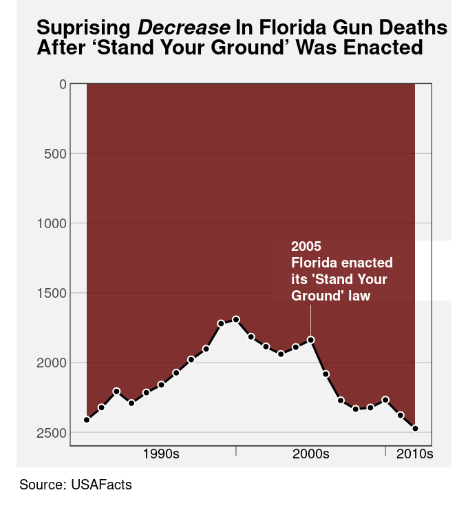

```{r}
#| echo: false
#| message: false
source("common.R")
```

# Text

**TODO**
Need to add a Decoding Text section.
Need to shift evaluation of text decoding out of @sec-data-symbols?
Can it wait until just before Dangers of Text?
Once we have covered labels as well?

@fig-no-text is a version of @fig-crime with all of the text
removed.  Although we can see that some values, or rather three sets of values,
haved decreased, we cannot tell what the values are or by how much they
have decreased.  If there was ever any doubt, @fig-no-text makes it 
clear that text
is doing a lot of important work in a data visualisation.

**TODO** 
Refer back to @sec-rel-pos.
Text is one way
to decode to absolute data values (rather than just relative)

```{r}
#| echo: false
#| label: fig-no-text
#| fig-cap:  A line plot with all text removed.  Without text, it is impossible to know what data values are represented in this plot.
ggNoText <- ggplot(crimeAgeSimple) +
    geom_line(aes(x=year, y=rate, colour=ageFactor)) +
    scale_x_continuous(breaks=seq(2012, 2020, 2)) +    
    crimeAgeLineTitle +
    crimeAgeLineXlab +
    crimeAgeLineYlab +
    theme(text=element_text(colour="transparent"),
          axis.text=element_text(colour="transparent"),
          panel.grid.major.y=element_line(colour="black", linewidth=.1),
          aspect.ratio=1)
pushViewport(viewport(width=.9, height=.9))
print(ggNoText, newpage=FALSE)
popViewport()
```

Eye-tracking studies also show that people spend a lot of time looking
at the text within a data visualisation.  For example, in @fig-fixations-text,
there are more fixations in the regions that
contain text than anywhere else.
There is also evidence that text elements are more memorable than
the other elements of a data visualisation.[^memorability]

[^memorability]:
  "a memorable visualization is often also an effective one."
  ("Beyond Memorability: Visualization Recognition and Recall"
  Borkin et al (2016))
  Only a thumbnail version of the original image is shown in 
  @fig-fixations-text in order to comply
  with terms of use of the MASSVIS data set.

 
::: {#fig-fixations-text layout-ncol=2 layout-valign="bottom"}  

{#fig-fixations-text-1 fig-align="left"}

{#fig-fixations-text-2 fig-align="left"}

Eye tracking data from the MASSVIS project that shows fixations (circles) and 
saccades (lines between circles) for one person viewing an image for 
10 seconds.
:::

This chapter looks at the role that 
text plays in making data visualisations work.[^brath]

[^brath]:
  Provide citation to Brath book at least.
  Perhaps cite my text article, however that gets to see the light of day.

## Data symbols {#sec-data-symbols}

@fig-bar-text is a version of @fig-bar with white text added to each bar
showing the exact number of offenders in each ethnic group.
This is an example of using text as a **data symbol**.

```{r}
#| echo: false
#| label: fig-bar-text
#| fig-cap: A bar plot of the total number of offenders for different ethnic groups. The data symbols in this plot are the horizontal bars *and* the text values at the end of each bar.
ggplot(crimeGroupTotal) + 
    geom_col(aes(x=total, y=group)) +
    geom_text(aes(label=paste0(total, " "), x=total, y=group), 
              hjust=1, colour="white", fontface="bold") +
    scale_x_continuous(expand=expansion(c(0, .05))) +
    theme(aspect.ratio=1,
          axis.title.y=element_blank())
```

Just as data values are mapped to the visual features of the
bar data symbols in @fig-bar-text, 
data values are also mapped to the
visual features of the text data symbols.
For example, 
the ethnic groups are encoded as the vertical **position** of the bars
*and* as the vertical **position** of the text.
The data values for the number of offenders in each ethnic group
are encoded as the **length** of the bars *and*
as the horizontal **position**
of the text.
Furthermore, the data values for the number of offenders in each ethnic group
are encoded as the **shape** of the text---the letters and digits 
that make up the text.

Just as we can decode data values from the visual features of the bars
in @fig-bar-text,
we can decode data values from the visual features of the text.
For example, we can see just from the horizontal position of the text,
without reading the text values, 
that some counts are (much) larger than others.

> Encoding data values as the position, colour, and size of 
  text data symbols is effective for the same reasons that these
  visual features are effective for other types of data symbols.

We see examples of the use of simple visual features in text
in almost any piece of writing.  For example,
section headings are typically larger and bolder than the main text
in a report and 
the [Executive Summary](exec.html) in this book 
makes use of colour and angle to create visual connections
between associated terms within a bullet-point list.

However, the unique power of text comes from **decoding** the
**shape** of the text.
Text is the ultimate example of a **learned mapping** (@sec-learned).
We all learn to read text (and numbers), which means that, 
when we are presented with
a text shape, there is a pre-existing decoding to the semantic content
of the text (@fig-learned-decode).
For example, in @fig-bar-text, we are able to decode the data
value `41787` (the count for Māori) from the text "41787".
Furthermore, this decoding is extremely accurate and very flexible.

@fig-scatter-text shows another example of text data symbols

```{r}
#| echo: false
#| label: fig-scatter-text
#| fig-cap: A scatter plot of the number of times a team breaks through the opposition defence and the number of tries that a team scores (both are per-game averages) for teams at the 2023 Rugby World Cup.
gg <- ggplot(RWCperGame) +
    geom_point(aes(breaks, tries)) +
    geom_text(aes(breaks, tries, label=country), 
              hjust=c(1, 1, 0, 0), vjust=c(0, 0, 1, 1),
              data=subset(RWCperGame, 
                          country %in% c("New Zealand", "South Africa",
                                         "England", "Wales"))) +
    scale_x_continuous(name="clean breaks", expand=expansion(c(.05, .3))) +
    scale_y_continuous(name="tries scored") +
    theme(aspect.ratio=.5)
pushViewport(viewport(height=.8))
print(gg, newpage=FALSE)
popViewport()
```

In terms of the criteria that we discussed in @sec-mapping-visual-features,
the value of text data symbols is that they allow us to decode
data values very **accurately** (@fig-decode).
Text is also very flexible because it is
appropriate for both **quantitative** and **qualitative** data values.
Finally, text has a very large **capacity**;  we are able to distinguish
between many different words and numbers.

> Text data symbols are effective because they can be used to represent
  any sort of data and they allow a very accurate
  decoding of data values.

Compared to the bar data symbols in @fig-bar-text, the text data symbols
are much more complex shapes.
In terms of the simple visual processing model from @sec-visual-processing,
the text data symbols are similar to **visual objects**.
This means that text can convey more sophisticated information,
at the expense of more cognitive effort, and with a limit on how many
shapes we can process simultaneously
(see @fig-visual-model).[^verbal-processing]

[^verbal-processing]:
  Talk about there being separate verbal processing areas in the brain.
  Text has to come in as visual, so undergoes visual processing,
  but text is also processed separately for its language value.
  Cite Ware p315-316


One weakness of text data symbols
is that comparing values (rather than just decoding a single value)
requires more cognitive
effort compared to comparing simple visual features (like the
lengths of bars).
For example, in @fig-bar, it is quick and easy to approximate 
the ratio of Pasifika to Māori or European/Other to Māori from
the lengths of the bars,
but those comparisons are slower and take more conscious effort
using the text data symbols in @fig-bar-text.

> It is harder to compare data values that are mapped to 
  text because it requires more effort to decode data 
  values and to perform mental calculations.

In addition, our visual system cannot generate
**visual summaries** of large amounts of text (@sec-visual-summaries).
This is why a table of numbers, like @tbl-crime,
is ineffective for perceiving groups of values or trends in values.

> Large numbers of text data symbols are *not* effective because
  the visual system cannot decode visual summaries from the text.

Why is a picture is worth a thousand words?
Because 1000 words is 1000 fixations, identifying 1000 visual objects,
and then interpreting their combined meaning.

## Guides {#sec-guides}

@fig-crime-guides is a version of @fig-crime with the guides highlighted
in purple.  There are tick marks and tick labels on the x-axis and y-axis,
there are horizontal grid lines, and there are legend elements to show the
mapping from the different ages to different colours.

```{r}
#| echo: false
#| label: fig-crime-guides
#| fig-cap: A line plot of the crime rate amongst youth offenders aged 14 to 16 from 2011 to 2021. The guides in this plot have been highlighted in purple.
#| fig-keep: last
ggCrimeGuides <- ggplot(crimeAgeSimple) +
    geom_line(aes(x=year, y=rate, colour=ageFactor), linewidth=.1) +
    crimeAgeLineTitle +
    crimeAgeLineXlab +
    crimeAgeLineYlab +
    geom_line(aes(x=year, y=rate, group=ageFactor), colour="grey90") +
    scale_x_continuous(breaks=seq(2012, 2020, 2)) +    
    scale_colour_manual(name="age",
                        values=pal_brewer(palette="Purples")(5)[-(1:2)]) +
    theme(panel.border=element_rect(colour="grey"),
          plot.title=element_text(colour="grey"),
          plot.subtitle=element_text(colour="grey"),
          panel.grid.major.y=element_line(colour=highlight),
          axis.line=element_line(colour="grey"),
          axis.ticks=element_line(colour=highlight),
          axis.text=element_text(colour=highlight, face="bold"),          
          axis.title=element_text(colour="grey"),
          legend.text=element_text(colour=highlight, face="bold"),
          legend.title=element_text(colour="grey"),
          aspect.ratio=1)
pushViewport(viewport(width=.9, height=.9))
print(ggCrimeGuides, newpage=FALSE)
popViewport()
grid.force()
grid.edit("key::segments", grep=TRUE, global=TRUE,
          gp=gpar(lwd=2))
```

The first thing to note about the guides in @fig-crime-guides is that they
are all composed of **data symbols**, with **data values** mapped to
**visual features** of the data symbols (@sec-mapping-visual-features).
This is perhaps easiest to see with
the grid lines.  Each grid line is a data symbol where a data value,
a rate of offending, 
has been encoded as the vertical **position** of the line.
Similarly, each tick mark on the y-axis
is a line data symbol where a rate of offending
has been encoded as the vertical **position** of the line
and each tick mark on the x-axis is a line data symbol where a 
year has been encoded as the horizontal **position** of the line.
Finally, each of the tick labels on the y-axis is a text data symbol
where a rate of offending has been encoded as the vertical **position**
of the text *and* as the **shape** of the text.  Similar mappings
apply to the
x-axis tick labels.
The legend is also made up of line data symbols and text data symbols,
this time with age data values encoded as the **colour** of lines
and the **shape** of text.

The **decoding** of the **shape** of the **text** data symbols 
within the guides shows the
critical role that text plays within guides.
If we look again at @fig-no-text, there are coloured lines on the plot
and there are coloured lines on the legend.
The fact that these lines have different colours indicates that
there are three different groups, but the colours alone
do not tell us what the groups are.  We can decode different values
from the colours of the lines, but we cannot decode exact data values.
In the original @fig-crime, the shapes of the text labels on the legend
allow us to decode the original data values---the three ages 14, 15, and 16.

**TODO** text is typically the **only** data symbol within a data visualisation
that can be decoded to an **individual**, **absolute** data value.  
Most other decoding is 
relative (e.g., @sec-rel-pos, @sec-perception-relative, @sec-colour-relative)
or to a data summary (e.g., @sec-line-plots)

The proximity of the text labels in the legend to the coloured lines
in the legend means that we associate each label with each
coloured line (@sec-visual-model-groups).
So the text labels in the legend are the essential data symbols
in @fig-crime because only they allow us to decode from the colours of the lines
to the three age groups.

The text labels on axes perform a similar service.
For example, the numbers on the axes in @fig-crime
are the only data symbols that provide exact decoding from
positions to data values (years or rates).
The lines within the plot, by themselves, only show that values 
are decreasing.
It is only the relative position of the lines within the plot
to the tick labels on the axes
(and the grid lines)
that allows us to decode from the lines within the plot
to (approximate) data values.

Text data symbols within guides are effective because 
guides contain only a few data values that need to be decoded 
precisely.
This is the situation where text excels.   

> Guides are effective because they encode known data values 
  as text data symbols as well as the data symbols used in the main plot.
  
## Labels {#sec-labels}

**TODO**
Refer back to @fig-log from text.
The labels are the confusing part on the log plot

@fig-crime-labels shows a version of @fig-crime with the labels 
highlighted in purple.  In this data visualisation, the only
labels are the overall plot title and the legend title.  It is
also common to see axis titles.

```{r}
#| echo: false
#| label: fig-crime-labels
#| fig-cap: A line plot of the crime rate amongst youth offenders aged 14 to 16 from 2011 to 2021. The labels in this plot have been highlighted in purple.
ggCrimeLabels <- ggplot(crimeAgeSimple) +
    geom_line(aes(x=year, y=rate, colour=ageFactor), linewidth=.1) +
    crimeAgeLineTitle +
    crimeAgeLineXlab +
    crimeAgeLineYlab +
    geom_line(aes(x=year, y=rate, group=ageFactor), colour="grey90") +
    scale_x_continuous(breaks=seq(2012, 2020, 2)) +    
    scale_colour_manual(name="age",
                        values=grey(0:2/4)) +
    theme(plot.title=element_text(colour=highlight, face="bold"),
          plot.subtitle=element_text(colour=highlight, face="bold"),
          panel.border=element_rect(colour="grey"),
          panel.grid.major.y=element_line(colour="grey", linewidth=.2),
          axis.ticks=element_line(colour="grey"),
          axis.text=element_text(colour="grey"),
          axis.title=element_text(colour=highlight, face="bold"),
          legend.text=element_text(colour="grey"),
          legend.title=element_text(colour=highlight, face="bold"),
          aspect.ratio=1)
pushViewport(viewport(width=.9, height=.9))
print(ggCrimeLabels, newpage=FALSE)
popViewport()
```

The difference between labels and the other components of a data visualisation,
the data symbols and the guides, is that labels relate to **metadata** 
rather than raw data values.  We can still
consider this a mapping, just one that involves encoding metadata
rather than data values (@fig-label-mapping).

::: {#fig-label-mapping}
::: {.content-visible when-format=pdf layout-ncol=2}
\includegraphics[scale=0.5]{Diagrams/meta-label.png}
:::

::: {.content-visible when-format=html layout-ncol=2}

:::

Labels can be viewed as an encoding of metadata as text.
We can encode complex information using text and
we can decode text with extremely high fidelity.
:::

Labels contain information like
descriptions of variables and 
units of measurement and references to data sources.
These are all important pieces of information, but they are more complex,
more abstract, and far fewer in number than data values.
Fortunately, text is very capable of expressing complex information
and works very well in small amounts, so it is ideal
for this role.

To emphasise that point, imagine how impossible it would be
to encode the
information in the title of @fig-crime-labels, or just
the legend title, only using simple geometric data symbols
like bars and points.
Using pictograms, which have learned decodings like
text, would also be very difficult because it is much harder to compose
pictograms in the way that text can be composed into phrases
and sentences.

> Text is the only way to encode the type of complex and abstract information
  that is required for titles and axis labels.

Another use of text in a data visualisation is to label specific
points of interest.
For example, 
@fig-ann shows a variation of @fig-scatter, with
text added to help explain the result of the Rugby World Cup final to
disillusioned New Zealanders.
This demonstrates further the value of text as the only way to encode
complex and nuanced information.[^Ackoff]

[^Ackoff]:
  Russell Ackoff's "From Data to Wisdom"
  Text is very flexible - it can convey data, information,
  knowledge, understanding, and wisdom. 
  Most other graphical elements are much more limited.


```{r}
#| echo: false
#| message: false
library(xdvir)
markStr <- r"(
\begin{minipage}{1.4in}
Despite recording the most clean breaks and
tries in the tournament,
\zsavepos{leftNZ}\mbox{New Zealand}\zsavepos{rightNZ},
came second to a much more defensive 
\zsavepos{leftSA}\mbox{South Africa}\zsavepos{rightSA}.
\Rzmark{leftNZ}\Rzmark{rightNZ}
\Rzmark{leftSA}\Rzmark{rightSA}
\end{minipage})"
markTeX <- function(data, coords) {
    latexGrob(markStr, packages="zref",
              x=unit(0, "npc") + unit(2, "mm"),
              y=unit(1, "npc") - unit(2, "mm"),
              hjust="left", vjust="top",
              gp=gpar(fontsize=10))
}
makeContent.markCurve <- function(x) {
    ## Delay this calculation until drawing time so that we
    ## are in the correct viewport
    devLoc <- deviceLoc(x$x, x$y)
    addMark(x$name, devLoc$x, devLoc$y)
    x
}
markCurve <- function(data, coords) {
    grobTree(gTree(x=unit(coords$x[data$name == "New Zealand"], "npc"),
                   y=unit(coords$y[data$name == "New Zealand"], "npc"),
                   name="NZ", cl="markCurve"),
             gTree(x=unit(coords$x[data$name == "South Africa"], "npc"),
                   y=unit(coords$y[data$name == "South Africa"], "npc"),
                   name="SA", cl="markCurve"))
}
ggTeX <- ggplot(RWCperGame) +
    geom_point(aes(breaks, tries), colour="grey") +
    geom_point(aes(breaks, tries), colour="black", 
               data=subset(RWCperGame, 
                           country %in% c("New Zealand", "South Africa"))) +
    grid_panel(markTeX) +
    grid_panel(markCurve, aes(breaks, tries, name=country)) +
    scale_x_continuous(name="clean breaks") +
    scale_y_continuous(name="tries scored") +
    theme(aspect.ratio=1)
```

```{r}
#| echo: false
#| label: fig-ann
#| fig-cap: The number of times a team breaks through the opposition defence and the number of tries that a team scores (both are per-game averages) for teams in the 2023 Rugby World Cup.
library(gridGeometry)
pushViewport(viewport(width=.9, height=.9))
print(ggTeX, newpage=FALSE)
popViewport()
leftNZ <- getMark("leftNZ")
rightNZ <- getMark("rightNZ")
ptNZ <- getMark("NZ")
grid.segments(leftNZ$devx, leftNZ$devy - unit(1, "mm"), 
              rightNZ$devx, rightNZ$devy - unit(1, "mm"))
grid.bezier(unit.c(rightNZ$devx, ptNZ$devx, ptNZ$devx, ptNZ$devx),
            unit.c(rightNZ$devy - unit(1, "mm"),
                   rightNZ$devy - unit(1, "mm"),
                   rightNZ$devy - unit(1, "mm"),
                   ptNZ$devy))
leftSA <- getMark("leftSA")
rightSA <- getMark("rightSA")
ptSA <- getMark("SA")
grid.segments(leftSA$devx, leftSA$devy - unit(1, "mm"), 
              rightSA$devx, rightSA$devy - unit(1, "mm"))
grid.bezier(unit.c(rightSA$devx, 
                   rightSA$devx + unit(3, "mm"),
                   rightSA$devx + unit(3, "mm"),
                   ptSA$devx),
            unit.c(rightSA$devy - unit(1, "mm"),
                   rightSA$devy - unit(1, "mm"),
                   rightSA$devy - unit(1, "mm"),
                   ptSA$devy))
```

@fig-ann also demonstrates that text is an effective way of directing
attention (@sec-attention).  
Text labels can explicitly describe data values or,
more usefully, 
data summaries that the data visualisation is designed to show.

**REFER** to @sec-attention.

## Case study:  Word clouds {#sec-word-cloud}

@fig-wordcloud shows a word cloud data visualisation based on the
text of the Wikipedia page on the Rugby World Cup.[^wiki-rwc]
This visualisation shows the frequency with which different words
appear on the Wikipedia page.  The data values that are being visualised
are shown in @tbl-wiki-rwc.

[^wiki-rwc]:
  [](https://en.wikipedia.org/wiki/Rugby_World_Cup) [@wiki-rwc]

::: {#fig-wordcloud}


A word cloud of the frequency of words in the Wikipedia page for the Rugby World Cup.
:::

This data visualisation is unusual because it consists entirely of text
**data symbols**.
The mappings in @fig-wordcloud include encoding each word as the **shape** of 
a text data symbol and encoding frequency as the **size**
of a text data symbol.
There is no need for a guide for the mapping from words to text shape because
there is a learned decoding (@fig-learned-decode);
we can decode each text data symbol
into a word data value because that decoding has already been learned.

There is no guide for the mapping from word frequency to text size,
so we cannot decode exact word frequencies.
@tbl-wiki-rwc shows the six most frequent words.
However, the visualisation is still effective at conveying the *relative* 
frequencies.  The larger words occurred more frequently.
For example, we can see the names of the teams that were most successful
at the tournament, like New Zealand and South Africa, 
are much larger than less successful teams.

```{r}
#| echo: false
#| message: false
#| label: tbl-wiki-rwc
#| tbl-cap: A table of the number of times different words occur in the Wikipedia page for the Rugby World Cup (for words that appear more than once).  There are 287 different words, but only the first 6 are shown here.
kable(head(wikiRWC), row.names=FALSE)
```

The encoding of frequencies as the **size** of the words
does not provide the best **accuracy**
for decoding frequencies (@sec-accuracy)
and this made worse by the fact that longer words become even
larger. This means that
we cannot identify the exact frequency
of any one word, we cannot identify the quantitative difference in frequency 
between pairs of words, and we cannot easily perceive the distribution
of frequencies across words.
A word cloud is only effective
for approximate 
ordinal comparisons of word frequencies (@sec-mapping-visual-features).

Frequency is also mapped to **position in space**, with more frequent
words placed towards the centre of the word cloud.
This is an example of redundant mapping; more frequent words are both
larger *and* more central (@sec-redundant).

> A word cloud is effective for conveying words 
  because it maps words to text data symbols.
  It is also partially effective for conveying relative frequencies of words
  because it maps word frequency
  to both size and position in space.

Another benefit of encoding frequency as position in space
is the efficient use of space.
For example, @fig-wordcloud-bar shows 
the same data presented as a bar plot with 
the frequency of each word mapped to a separate bar.  Although 
the accuracy is improved for comparing frequencies, the bar plot
does not have as much room for the words themselves.

```{r}
#| echo: false
#| label: fig-wordcloud-bar
#| fig-cap: A bar plot of the frequency of different words in the Wikipedia page for the Rugby World Cup.
temp <- subset(wikiRWC, freq > 1)
padding <- 300 - nrow(temp)
maxlen <- max(nchar(temp$word))
temp$word <- sprintf(paste0("%", maxlen, "s"), temp$word)
temp <- rbind(temp, 
              data.frame(word=sapply(1:padding, 
                                     function(i) 
                                         paste(rep(" ", i), collapse="")),
                         freq=rep(0, padding)))
temp$word <- reorder(temp$word, temp$freq)
temp$group <- rep(1:6, each=50)
ggplot(temp) + 
    geom_col(aes(freq, word)) + 
    scale_x_continuous(breaks=c(0, 4, 8, 20, 40, 60),
                       expand=expansion(add=c(0, 5))) +
    facet_row(vars(group), scales="free", space="free") +
    theme(axis.text.y=element_text(size=7),
          axis.title=element_blank(),
          axis.ticks.y=element_blank(),
          strip.background=element_blank(),
          strip.text=element_blank())
```

One weakness of the word cloud is that the **angle** of words changes
with no corresponding change in the data values.
This is an example of a **dissonant** mapping, which can cause confusion
(@sec-dissonance).  The viewer will notice the differences in angle
and attempt to decode that difference to a difference in data values
that does not exist.

> The different angles of text in a word cloud is not effective
  because it does not encode any differences in the data.

## Case study:  Tables

@tbl-rwc-table shows a subset of the 2023 Rugby World Cup data set
(@tbl-rwc-2023), just including the top eight nations in the 
tournament.  We established in @sec-data-symbols that
visualising data values in a table provides an excellent 
basis for accurately decoding individual data values, 
but imposes a larger cognitive burden
for comparing values, and is a very poor for extracting visual
summaries, such as trends.

For example, it is very difficult to determine from @tbl-rwc-table
whether there is any relationship between the values in the 
four numeric columns.

```{r}
#| echo: false
#| message: false
#| label: tbl-rwc-table
#| tbl-cap: Performance measures for the top 8 teams at the 2023 Rugby World Cup. Each measure is a per-game average because some teams played more games than others.
rwc8 <- subset(RWCperGame, country %in% topNations,
               select=c("country", "sphere", 
                        "runs", "breaks", "tries", "points"))
rwc8mess <- data.frame(lapply(rwc8, function(x) sapply(x, format, digits=4)))
kable(rwc8mess, row.names=FALSE)
```

However, there are standard guidelines for
formatting tables of values that can improve the readability of
a table.[^table-guidelines]
@tbl-rwc-table-tidy shows the same data as @tbl-rwc-table, but with
all of the numeric columns right-aligned, a consistent number of decimal 
places in each column, fewer decimal places than the data 
actually possess, and the rows have been ordered from the highest number of
points per game to the lowest.

[^table-guidelines]:
    For example, @schwabish.
 
    Ehrenberg (1977) advice on tables 

    "UNDERSTANDING GRAPHS AND TABLES"
    Wainer (1992)
    [@graphs-and-tables]

It is easier to see some structure in @tbl-rwc-table.
For example, the number of tries appears to decrease as well as the 
number of points.
We can also see some evidence of the number of breaks decreasing as 
well, though it is weaker.

There are some familiar explanations for the improvement in the
table display. 
The reduction in detail, with fewer decimal places, means that
there is less complexity in the visual field.
The consistent number of decimal places means that less is
changing, so differences are easier to detect
(@sec-differences).
Also, the consistent baseline provided by right-alignment
means that the text **length** of the numbers (the number of digits
in each number) provides a crude encoding of the size of the number,
particularly in the column showing the number of clean breaks.
However, it is worth noting that some of the **accuracy** of the text
has been sacrificed in order to make some of these gains.

```{r}
#| echo: false
#| message: false
#| label: tbl-rwc-table-tidy
#| tbl-cap: Performance measures for the top 8 teams at the 2023 Rugby World Cup. This is a version of @tbl-rwc-table with some standard table design guidelines applied.
rwc8tidy <- rwc8
rwc8tidy$runs <- round(rwc8tidy$runs)
rwc8tidy <- rwc8tidy[order(rwc8tidy$points, decreasing=TRUE),]
kable(rwc8tidy, digits=1, row.names=FALSE)
```

For comparison, @fig-rwc-table shows a scatter plot of the data from 
@tbl-rwc-table.  The data symbol is a circle,
with the number of tries mapped to horizontal **position**,
the number of points mapped to vertical **position**,
the number of clean breaks mapped to **size**,
and the number of runs mapped to **colour** (shade).
The relationships between tries and points and between
breaks and both tries and points are still easier to perceive
in this plot than in @tbl-rwc-table-tidy, but @tbl-rwc-table-tidy,
even with its rounding,
still provides better accuracy, particularly for breaks and runs.

```{r}
#| echo: false
#| label: fig-rwc-table
#| fig-cap:  A scatter plot of the performance measures for the top 8 teams at the 2023 Rugby World Cup.
ggplot(rwc8) +
    geom_point(aes(tries, points, size=breaks, colour=runs)) +
    scale_colour_gradient(low="grey80", high="black") +
    theme(aspect.ratio=1)
```

## Case study: Stem-and-leaf plots

Figure @fig-tries-hist shows a histogram of the
number of tries scored by teams in the 2023 Rugby World Cup.
The data symbols in @fig-tries-hist are bars.
The raw data values are the average number of tries per game for each team,
but the lengths of the bars encode **data summaries**:  the
number of teams with an average number of tries within each
range: 0 to 1, 1 to 2, and so on.

Because the borders of the bars are not drawn, we get an emergent
shape from the combined bars (similar to a density plot;  @sec-density).

This histogram allows us to see features of the data summaries, 
such as a suggestion that there is a small subset of teams that score a higher
number of tries than the other teams (a bimodal distribution; though
in this case we have a very small amount of data).
However, there is no way to decode the raw data values from this
histogram.

```{r}
#| echo: false
#| label: fig-tries-hist
#| fig-cap: A histogram of the number of tries scored. The bars are horizontal for easy comparison with the stem-and-leaf plot.
#| fig.keep: last
ggplot(RWCperGame) +
    geom_histogram(aes(y=round(tries, 1), colour=sphere, fill=sphere), 
                   breaks=0:8, closed="left") +
    labs(title="Rugby World Cup 2023") +
    ylab("tries scored") +
    scale_x_continuous(expand=expansion(c(0, .05))) +
    scale_y_continuous(breaks=0:8) +
    scale_colour_manual(values=c("grey40", "grey40")) +
    scale_fill_manual(values=c("grey40", "grey40")) +
    theme(plot.background=element_rect(colour=NA, fill="grey95"),
          legend.background=element_rect(colour=NA, fill="grey95"),
          legend.title=element_text(colour=NA),
          legend.text=element_text(colour=NA),
          aspect.ratio=1,
          axis.title.x=element_blank(),
          panel.background=element_blank(),
          panel.border=element_rect(colour="black", fill=NA),
          panel.grid=element_blank())
grid.force()
keyRect <- grid.grep("key::rect", grep=TRUE, global=TRUE)
grid.edit(keyRect[[1]], gp=gpar(col=NA, fill=NA))
grid.edit(keyRect[[2]], gp=gpar(col=NA, fill=NA))
ggTriesHist <- grid.grab()
grid.newpage()
pushViewport(viewport(height=.8))
grid.draw(ggTriesHist)
popViewport()
```

Figure @fig-tries-stem shows a stem-and-leaf 
diagram of the same data (with tries scored rounded to one decimal place).
The data symbol in this case is a text digit.
Every team is encoded as a digit from 0 to 9, which represents the
first decimal place for the average number of tries scored by
each team.  For example, New Zealand scored 7.0 tries per game on average
and that is encoded as a `0` beside the `7` on the y-axis.
The number of tries is also encoded as a combination of vertical
position (the whole number of tries) and
horizontal position (teams with the same whole number of tries are
stacked horizontally, but also ordered by the first decimal place value).

The number of teams within each range (0 to 1, 1 to 2, etc)
is encoded by the number of digits.
Another way to look at it is that the data symbol is a piece of text
consisting of several digits and the number of teams is encoded as
the **length** of the piece of text.

As with the histogram in @fig-tries-hist, there are emergent shapes
with two distinct humps visible, one taller than the other.
However, in @fig-tries-stem we are able to decode the raw data values as well.
Furthermore, because the data symbols are text digits, we are able to
decode individual data values very accurately.

In summary, @fig-tries-stem combines standard decodings (**length**)
with **learned decodings** (text shape) to provide access to both
high-level features of data summaries *and* raw data values.

```{r echo=FALSE}
stemAndLeaf <- 
    gsub("^  ", "",
         capture.output(stem(RWCperGame$tries, scale=2))[-c(1:3, 12)])
```

```{r}
#| echo: false
#| label: fig-tries-stem
#| fig-cap: A stem-and-leaf plot of the number of tries scored.
## Try to get stem background same size as ggplot background
pushViewport(viewport(height=.8))
grid.rect(width=.912, gp=gpar(col=NA, fill="grey95"))
grid.text("Rugby World Cup 2023", x=.3, just="left",
          y=unit(1, "npc") - unit(1, "line"), gp=gpar(cex=1.5))
stemAndLeafTeX <- paste("\\begin{verbatim}",
                        paste(rev(stemAndLeaf), collapse="\n"),
                        "\\end{verbatim}", sep="\n")
grid.latex(stemAndLeafTeX,
           x=.3, hjust="left", gp=gpar(fontsize=16))
grid.text("tries scored", 
          x=.3, just="left", 
          y=unit(2, "lines"))
popViewport()
```

@fig-tries-stem-colour shows a variation on @fig-tries-stem
with the hemisphere encoded as the colours of the digits.
This provides another demonstration that we can use simple visual features
like colour to encode data values with text data symbols.

```{r}
#| echo: false
nc <- nchar(stemAndLeaf) - 4
lengths <- cumsum(nc)
stemAndLeafBold <- character(length(stemAndLeaf))
stemSphere <- RWCperGame$sphere[order(RWCperGame$tries)]
maxLen <- max(nc)
index <- 1
for (i in 1:length(stemAndLeaf)) {
    l <- lengths[i]
    index <- index:l
    hemi <- stemSphere[index]
    north <- hemi == "North"
    stem <- substring(stemAndLeaf[i], 1, 4)
    if (nchar(stem) < nchar(stemAndLeaf[i])) {
        char <- strsplit(substring(stemAndLeaf[i], 5), "")[[1]]
        char[north] <- paste0("\\textbf{", char[north], "}")
    } else {
        char <- ""
    }
    stemAndLeafBold[i] <- paste0(stem, paste(char, collapse=""))
    index <- l + 1
}
```

```{r}
#| echo: false
stemBold <- function() {
    grid.rect(width=.912, gp=gpar(col=NA, fill="grey95"))
    grid.text("Rugby World Cup 2023", x=.3, just="left",
              y=unit(1, "npc") - unit(1, "line"), gp=gpar(cex=1.5))
    alltt <- LaTeXpackage("alltt", "\\usepackage{alltt}")
    stemAndLeafBoldTeX <- paste("\\setmonofont{Latin Modern Mono Light}",
                            "\\begin{alltt}",
                            paste(rev(stemAndLeafBold), collapse="\n"),
                            "\\end{alltt}", sep="\n")
    grid.latex(stemAndLeafBoldTeX, packages=alltt,
               x=.3, hjust="left", gp=gpar(fontsize=16))
    grid.text("tries scored", 
              x=.3, just="left", 
              y=unit(2, "lines"))
    grid.text(expression("South versus "*bold("North")), 
              x=.3, just="left",
              y=unit(1, "line"))
}
```

```{r}
#| echo: false
nc <- nchar(stemAndLeaf) - 4
lengths <- cumsum(nc)
stemAndLeafColour <- character(length(stemAndLeaf))
maxLen <- max(nc)
index <- 1
for (i in 1:length(stemAndLeaf)) {
    l <- lengths[i]
    index <- index:l
    hemi <- stemSphere[index]
    north <- hemi == "North"
    stem <- substring(stemAndLeaf[i], 1, 4)
    if (nchar(stem) < nchar(stemAndLeaf[i])) {
        char <- strsplit(substring(stemAndLeaf[i], 5), "")[[1]]
        char[north] <- paste0("\\textcolor{salmon}{", char[north], "}")
        char[!north] <- paste0("\\textcolor{teal}{", char[!north], "}")
    } else {
        char <- ""
    }
    stemAndLeafColour[i] <- paste0(stem, paste(char, collapse=""))
    index <- l + 1
}
```

```{r}
#| echo: false
library(gridtext)
NScols <- pal_npg()(2)
colsTeX <- paste0("\\definecolor{", c("salmon", "teal"), "}",
               apply(col2rgb(NScols), 2,
               function(x) {
                   paste0("{RGB}{", paste(x, collapse=", "), "}")
               }), collapse="\n")
stemColour <- function() {
    grid.rect(width=.912, gp=gpar(col=NA, fill="grey95"))
    grid.text("Rugby World Cup 2023", x=.3, just="left",
              y=unit(1, "npc") - unit(1, "line"), gp=gpar(cex=1.5))
    alltt <- LaTeXpackage("alltt", "\\usepackage{alltt}")
    stemAndLeafColourTeX <- paste(colsTeX,
                            "\\begin{alltt}",
                            paste(rev(stemAndLeafColour), collapse="\n"),
                            "\\end{alltt}", sep="\n")
    grid.latex(stemAndLeafColourTeX, packages=list(alltt, "xcolor"),
               x=.3, hjust="left", gp=gpar(fontsize=16))
    grid.text("tries scored", 
              x=.3, just="left", 
              y=unit(2, "lines"))
    grid.draw(richtext_grob(paste0('<span style="color: ', NScols[2], 
                                   '">South</span> versus ',
                                   '<span style="color: ', NScols[1], 
                                   '">North</span>'), 
                            x=.3, hjust=0,
                            y=unit(1, "line")))
}
```

```{r}
#| echo: false
#| label: fig-tries-stem-colour
#| fig-cap: A stem-and-leaf plot of the number of tries scored with hemisphere encoded as colour.
grid.newpage()
pushViewport(viewport(height=.8))
stemColour()
popViewport()
```

@fig-tries-stem-weight shows another variation on @fig-tries-stem,
this time with the hemisphere encoded as the **weight** of the 
digits.  This demonstrates the idea that there are text-specific
visual features that can be used to encode data values.
Other examples are font family (e.g., Arial versus Roman)
and font slant (italic versus upright).[^text-specific]

[^text-specific]:
  [@brath2014design] at least


```{r}
#| echo: false
#| label: fig-tries-stem-weight
#| fig-cap: A stem-and-leaf plot of the number of tries scored with hemisphere encoded as font weight.
grid.newpage()
pushViewport(viewport(height=.8))
stemBold()
popViewport()
```

Stem-and-leaf plots might be seen as an archaic form of data visualisation,
but we can see that they are effective in many ways.[^tukey-stem]

[^tukey-stem]:  
    Quote from John Tukey about stem-and-leaf plots:

    ::: {.actual-quote}
    If we are going to make a mark, it may as well be a meaningful one.
    The simplest - and most useful - meaningful mark is a digit.
    :::

    Attributed to "Some Graphic and Semigraphic Displays" in 
    T. A. Bancroft, ed. Statistical Papers in Honor of George W. Snedecor
    (Ames, Iowa, 1972), p. 296.

Unfortunately, despite all of their advantages, stem-and-leaf plots
have a limited usefulness because they can only accommodate very
small data sets.
There is a similarity between a stem-and-leaf plot and the stacked icon
plot in @fig-pic-icon-1. However, whereas an icon can easily be used to
represent some multiple of objects, that option is not available 
for text digits.

## Case study: Direct Labelling

some sort of ggrepel version of the flags example in visual-objects?

relate visual objects (other than text) to direct labelling?

"Review of Graph Comprehension Research: Implications for Instruction"
Shah and Hoeffner (2002)
[p 56]
Some quotes from discussion of usefulness of colour, but in relation
to the use of legends:
"reduce the difficulty viewers
face in keeping track of graphic referents because of the demands imposed
on working memory"
[p 57]
Cites Kosslyn (1994) for "label graph features directly 
with their referents"

"A Model of the Perceptual and Conceptual Processes in Graph Comprehension"
Carpenter and Shah (1998)
Eye tracking study
"viewers must continuously
reexamine the labels to refresh their memory"

## Dangers of text

@fig-text-danger shows a data visualisation of the number of gun deaths
in Florida between 1990 and 2012, covering the enactment of Florida's
"stand your ground" law that loosened the constrainst on
an individual's rights to use deadly force.[^florida-deaths]
The title of the plot points out that gun deaths *decreased*
after the law was enacted, which is perhaps surprising given that
use of deadly force was less constrained after the introduction of the law.

[^florida-deaths]:
  Based on a [Business Insider](https://www.businessinsider.com/gun-deaths-in-florida-increased-with-stand-your-ground-2014-2) data visualisation;  data from [USA Facts](https://usafacts.org/data/topics/security-safety/crime-and-justice/firearms/firearm-deaths/).

```{r}
#| echo: false
#| results: hide
deaths <- read.csv("Data/florida-deaths.csv")
bloodRed <- "#660000"
xaxis <- function(data, coords) {
    ticks <- coords$x[match(c(2000, 2010), data$x)]
    labels <- coords$x[match(c(1995, 2005, 2012), data$x)]
    grobTree(segmentsGrob(0, 1, 1, 1, gp=gpar(lwd=2)),
             segmentsGrob(0, 0, 1, 0, gp=gpar(lwd=2)),
             segmentsGrob(ticks, 0, ticks, unit(-5, "mm")),
             textGrob(c("1990s", "2000s", "2010s"),
                      labels, unit(-1, "mm"), just="top",
                      gp=gpar(fontsize=20)))
}
labelbg <- function(data, coords) {
    x <- coords$x[data$x == 2005]
    y <- coords$y[data$x == 2005]
    lab <- textGrob("2005\nFlorida enacted\nits 'Stand Your\nGround' law",
                    unit(x, "npc") - unit(1, "cm"),
                    unit(y, "npc") + unit(2, "cm"),
                    just=c("left", "bottom"),
                    gp=gpar(fontsize=20, fontface="bold", col="white",
                            lineheight=1))
    rectGrob(grobX(lab, "west") - unit(1, "cm"),
             grobY(lab, "south"),
             1,
             grobHeight(lab),
             just=c("left", "bottom"),
             gp=gpar(col=NA, fill="white"))
}
label <- function(data, coords) {
    x <- coords$x[data$x == 2005]
    y <- coords$y[data$x == 2005]
    lab <- textGrob("2005\nFlorida enacted\nits 'Stand Your\nGround' law",
                    unit(x, "npc") - unit(1, "cm"),
                    unit(y, "npc") + unit(2, "cm"),
                    just=c("left", "bottom"),
                    gp=gpar(fontsize=20, fontface="bold", col="white",
                            lineheight=1))
    grobTree(lab,
             segmentsGrob(x, y, x,
                          unit(y, "npc") + unit(18, "mm"),
                          gp=gpar(lwd=1, col="white")))
}
gg <- ggplot(deaths) +
    grid_panel(labelbg, aes(x=year, y=count)) +
    geom_polygon(data=rbind(data.frame(year=2012, count=0),
                            deaths,
                            data.frame(year=1990, count=0)),
                 aes(year, y=count, group=1),
                 fill=adjustcolor(bloodRed, alpha=.8)) +
    grid_panel(label, aes(x=year, y=count)) +
    geom_line(aes(year, count, group=1), linewidth=1.5) +
    geom_point(aes(year, count),
               colour="white", size=5) +
    geom_point(aes(year, count),
               colour="black", size=3) +
    scale_y_continuous(limits=c(1.05*max(deaths$count), 0), trans="reverse",
                       expand=expansion(0)) +
    coord_cartesian(clip="off") +
    labs(title="Alarming Rise In Florida Gun Deaths\nAfter 'Stand Your Ground' Was Enacted\n") +
    ## subtitle="All deaths involving guns\n") +
    theme(plot.title=element_text(size=30, face="bold"),
          plot.subtitle=element_text(size=20),
          plot.title.position="plot",
          panel.background=element_blank(),
          panel.grid.minor=element_blank(),
          panel.grid.major.x=element_blank(),
          panel.grid.major.y=element_line(color="grey"),
          aspect.ratio=1,
          axis.ticks=element_blank(),
          axis.text.x=element_blank(),
          axis.text.y=element_text(size=20),
          axis.title.y=element_blank(),
          axis.title.x=element_blank(),
          plot.margin=unit(rep(10, 4), "mm")) +
    grid_panel(xaxis, aes(x=year, y=count)) 
## Deliberately misleading title to show power of text labels
png("Images/deaths-florida-contra.png", height=750, width=680)
pushViewport(viewport(y=1, height=unit(1, "npc") - unit(1, "in"), just="top"))
ggcontra <- gg +
    labs(title="Suprising *Decrease* In Florida Gun Deaths<br>After 'Stand Your Ground' Was Enacted<br>") +
    theme(plot.title=element_markdown())
print(ggcontra, newpage=FALSE)
popViewport()
grid.text("Source: USAFacts", x=unit(10, "mm"), just="left",
          y=unit(2, "lines"),
          gp=gpar(fontsize=20))
dev.off()
```

::: {#fig-text-danger}

{width=50%}

The title influences our perception;  the message from the data symbols
is actually quite different.
:::

However, if we look closely at the plot itself, we can see that
the y-axis scale is inverted.  A downward trend is actually an 
*increase* in gun deaths, so the data shows that
gun deaths actually increased after the law was enacted.

This example demonstrates that the text within a data visualisation
is not only given a lot
of attention, but it can have a dominant effect on the message that
the viewer takes away.[^text-danger]

[^text-danger]:
  "Trust and Recall of Information across Varying Degrees of 
  Title-Visualization Misalignment"
  Kong et al (2019)
  Greater impact that can even override message in data.
  "Towards Understanding How Readers Integrate Charts and Captions: A Case Study with Line Charts"
  Kim et al (2021)
  Studied what happens when caption and text are incoherent;
  viewer goes with the prominent visual feature.
  Main message is to make the text and chart coherent.
  
@fig-text-danger is an example of a deliberately misleading
data visualisation, which we obviously want to avoid.
However, the broader point is that we need to be at least as careful with
our choice of text content as we are with our selection of mappings
from data values to visual features and we have a responsibility to
work hard to make
sure that the message from data symbols and from text labels
is completely consistent.

## Alt text

Is a data visualisation effective if we cannot see it?
We saw in @sec-CVD that a data visualisation may not be effective
if a colour encoding does not take into account red-green colour blindness.
But what about a low-vision or blind audience?

Although data visualisation is based on the visual system,
it is still possible to make a data visualisation effective 
for a low-vision or blind audience by providing a text description
of the data visualisation.
Alt text is a text description of a data visualisation
that will be recognised and read out by a screen reader.

The alt text for a data visualisation will ideally describe what variables
are being displayed and how they are encoded (what sort of plot is it),
data summaries like trends, clusters, outliers, and correlations,
and include the main message of the visualisation, including
causal explanations and wider implications.[^alt-text]

[^alt-text]:
  "Accessible Visualization via Natural Language Descriptions: 
   A Four-Level Model of Semantic Content"
  Lundgard and Satyanarayan (2022)

Another option sometimes employed is to provide tables of data in addition to
the data visualisation, though this will not always be possible or
practical.

All of the images in this document have alt text (or at least they should!).

## Summary

Data values can be encoded as the visual features of text, such as
position and colour, just like for other data symbols.

The shape of text---the characters used in text---is particularly 
important because we have a learned decoding
of text.  We can read data values from text.

We can use text to encode any type of data,
we can represent a very large number of different categories,
and we can decode individual data values from text extremely accurately.

On the other hand, decoding a large number of data values
from text is very slow and we cannot generate visual summaries from text.

Guides are really just collections of data symbols, with specific
data values encoded as the visual features to demonstrate
how data values have been encoded.

The text elements within guides are essential because they provide the
only precise decoding of exact data values.  This is what allows the
decoding of the main data symbols within a data visualisation.

Overall, text is very valuable in a data visualisation for accurately
encoding a small number of data values, or to express complex information.
But text is not appropriate for representing a large number of raw
data values.[^ware-text]

[^ware-text]:
  Acknowledge Ware 4th Ed:
  G8.18 (p327)
  "When a large number of data points must be represented in a visualization,
  use sybmols instead of words or pictorial icons."
  G8.19 (p327)
  "Use words directly on the chart where the number of symbolic objects
  in each category is relatively few and where space is available."

---

```{=latex}
\theendnotes
```
