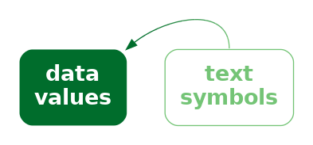

```{r}
#| echo: false
#| message: false
source("common.R")
```

# Text

@fig-no-text is a version of @fig-crime with one significant
modification:  all of the text has been
removed.  Although we can see that some values, or rather three sets of values,
haved decreased, we cannot tell what the values are or by how much they
have decreased.  If there was ever any doubt, @fig-no-text makes it 
clear that text
is doing a lot of important work in a data visualisation.

```{r}
#| echo: false
#| label: fig-no-text
#| fig-cap:  A line plot with all text removed.  Without text, it is impossible to know what data values are represented in this plot.
ggNoText <- ggplot(crimeAgeSimple) +
    geom_line(aes(x=year, y=rate, colour=ageFactor)) +
    scale_x_continuous(breaks=seq(2012, 2020, 2)) +    
    crimeAgeLineTitle +
    crimeAgeLineXlab +
    crimeAgeLineYlab +
    theme(text=element_text(colour="transparent"),
          axis.text=element_text(colour="transparent"),
          panel.grid.major.y=element_line(colour="black", linewidth=.1),
          aspect.ratio=1)
pushViewport(viewport(width=.9, height=.9))
print(ggNoText, newpage=FALSE)
popViewport()
```

Eye-tracking studies also show that people spend a lot of time looking
at the text within a data visualisation.  For example, in @fig-fixations-text,
there are more fixations in the regions that
contain text than anywhere else.
There is also evidence that text elements are more memorable than
the other elements of a data visualisation.[^memorability]

[^memorability]:
    And how well a data visualisation can be recalled is 
    another way to measure its effectiveness:
    "a memorable visualization is often also an effective one."
    @beyond-memorability.

    Only a thumbnail version of the original image is shown in 
    @fig-fixations-text in order to comply
    with terms of use of the MASSVIS data set.
 
::: {#fig-fixations-text layout-ncol=2 layout-valign="bottom"}  

{#fig-fixations-text-1 fig-align="left"}

{#fig-fixations-text-2 fig-align="left"}

Eye tracking data from the MASSVIS project that shows fixations (circles) and 
saccades (lines between circles) for one person viewing an image for 
10 seconds.
:::

This chapter looks at the role that 
text plays in making data visualisations work.[^brath]

[^brath]:
    @brath2020visualizing provides a very thorough 
    treatment of the use of text in data visualisation
    and is the source of many ideas in this chapter.

    @murrell2025dataverbalisationtextdoing provides an more
    in-depth version of much of this chapter.

## Visual features of text {#sec-features-text}

One role that text serves within a data visualisation is 
as a standard data symbol.
For example, 
@fig-bar-text is a version of the bar plot @fig-bar with white text 
added to each bar to
show the exact number of offenders in each ethnic group.
In @fig-bar-text, there are bar data symbols and there are
text data symbols (the white text).

```{r}
#| echo: false
#| label: fig-bar-text
#| fig-cap: A bar plot of the total number of offenders for different ethnic groups. The data symbols in this plot are the horizontal bars *and* the text values at the end of each bar.
gg <- ggplot(crimeGroup2021) + 
    geom_col(aes(x=count, y=group)) +
    geom_text(aes(label=paste0(count, " "), x=count, y=group), 
              hjust=1, colour="white", fontface="bold") +
    scale_x_continuous(expand=expansion(c(0, .05))) +
    xlab(NULL) +
    theme(aspect.ratio=1,
          axis.title.y=element_blank(),
          axis.text.x=element_blank(),
          axis.ticks.x=element_blank())
grid.newpage()
pushViewport(viewport(width=.9, height=.9))
print(gg, newpage=FALSE)
popViewport()
```

Just as data values are encoded to the visual features of the
bar data symbols in @fig-bar-text, 
data values are also encoded to the
visual features of the white text data symbols.
For example, 
the ethnic groups are encoded as the vertical **position** of the bars
*and* as the vertical **position** of the white text.
The data values for the number of offenders in each ethnic group
are encoded as the **length** of the bars *and*
as the horizontal **position**
of (the right edge of) the white text.

There is also a very important encoding of data values to the 
**pattern** visual feature of the white text.
The data values for the number of offenders in each ethnic group
are encoded as the **pattern** of the white text---the letters and digits 
that make up the text.
Each white text data symbol has a different pattern because it is 
composed of a different set of digits.

Just as we can decode data values from the visual features of the bars
in @fig-bar-text,
we can decode data values from the visual features of the text.
For example, we can see just from the vertical positions of the white text,
without reading the text values, 
that each text symbol corresponds to a different ethnic group.
We can also see, just from the horizontal position of the text,
without reading the text values, 
that some counts are (much) larger than others.[^text-shape-object-features]
We can also see, just from the text pattern, without reading the text
values, that the counts are different.
Every white text label has a different pattern.

[^text-shape-object-features]:
    This is similar to the way that data values can be encoded and decoded
    using the visual features of
    visual shapes and visual objects 
    (@sec-vis-shape-feature and @sec-vis-object-feature).

> Encoding data values as the position, colour, and pattern of 
  text data symbols is effective for the same reasons that these
  visual features are effective for other types of data symbols.

However, the unique power of text comes from **decoding** the
**pattern** of the text.
Text is the ultimate example of a **learned encoding** (@sec-learned).
We all learn to read text (and numbers), which means that, 
when we are presented with
a text pattern, there is a pre-existing decoding to the semantic content
of the text (@fig-text-decode).
For example, in @fig-bar-text, we are able to decode the data
value two thousand, eight hundred and sixty-nine
(the count for Māori) from the text "2869".

::: {#fig-text-decode}
::: {.content-visible when-format=pdf}
\includegraphics[scale=0.5]{Diagrams/text-decode.png}
:::

::: {.content-visible when-format=html}

:::

Some visual objects have learned decodings, which means that we
can decode values from the visual objects without having explicitly
encoded values as visual features.  This is similar to the 
idea of implicit encoding (@fig-implicit-decode).
:::

> Encoding data values as the pattern of text is uniquely 
  effective thanks to the learned decoding of information
  from specific combinations of digits and letters.

@fig-scatter-text shows another example of text being used as 
data symbols.
This scatter plot includes both data point data symbols,
one for each country in the 2023 Rugby World Cup, and text data symbols,
the names of the countries that finished the tournament in the 
top four places.

```{r}
#| echo: false
#| label: fig-scatter-text
#| fig-cap: A scatter plot of the number of times a team breaks through the opposition defence and the number of tries that a team scores (both are per-game averages) for teams at the 2023 Rugby World Cup.
gg <- ggplot(RWCperGame) +
    geom_point(aes(breaks, tries)) +
    geom_text(aes(breaks, tries, label=country), 
              hjust=c(1, 1, 0, 0), vjust=c(0, 0, 1, 1),
              data=subset(RWCperGame, 
                          country %in% c("New Zealand", "South Africa",
                                         "England", "Wales"))) +
    scale_x_continuous(name="clean breaks", expand=expansion(c(.05, .3))) +
    scale_y_continuous(name="tries scored") +
    theme(aspect.ratio=.5)
pushViewport(viewport(height=.8))
print(gg, newpage=FALSE)
popViewport()
```

We can again see several encodings of data values as the basic visual
features of text data symbols.
The horizontal positions of the country names encode the number of clean
breaks for each country, just like the data points.
The vertical positions of the country names encode the number of 
tries scored by each country, just like the data points.
Again, there is also an encoding that just involves the text:
the country name is encoded as the pattern of the text
(the letters used for each text symbol).

There are simple decodings from the positions of the text symbols
to data values.
For example, we can decode 
the number of tries scored by each of the top-four teams
from the vertical positions of the text and see that
New Zealand scored more tries (on average) than the other three teams.

However, the most important decoding is from the patterns of the text
symbols.  These learned decodings allow us to identify each top-four country
by name.

## Text-specific visual features {#sec-text-features}

In addition to the standard visual features like position
and colour, there are some visual features that are specific to 
text data symbols.
For example, @fig-text-feature shows a variation on @fig-scatter-text
where the hemisphere for each of the top-four teams is encoded
as the weight and style of the text symbol:
teams from the southern hemisphere are bold and italic.
Another examples of a text-specific visual feature is the font family,
for example, Arial versus Times Roman.[^text-specific]

[^text-specific]:
    @BRATH201659 provides a much longer list of text-specific visual features.

```{r}
#| echo: false
#| label: fig-text-feature
#| fig-cap: A scatter plot of the number of times a team breaks through the opposition defence and the number of tries that a team scores (both are per-game averages) for teams at the 2023 Rugby World Cup.
temp <- RWCperGame
temp$face <- ifelse(temp$sphere == "South", "bold.italic", "plain")
gg <- ggplot(temp) +
    geom_point(aes(breaks, tries)) +
    geom_text(aes(breaks, tries, label=country, fontface=face), 
              hjust=c(1, 1, 0, 0), vjust=c(0, 0, 1, 1),
              data=subset(temp, 
                          country %in% c("New Zealand", "South Africa",
                                         "England", "Wales"))) +
    scale_x_continuous(name="clean breaks", expand=expansion(c(.05, .3))) +
    scale_y_continuous(name="tries scored") +
    theme(aspect.ratio=.5)
pushViewport(viewport(height=.8))
print(gg, newpage=FALSE)
popViewport()
```

We see uses of basic visual features and text-specific visual features
in almost any piece of writing.  For example,
section headings are typically larger and bolder than the main text
in a report.
The [Executive Summary](exec.html) in this book 
makes use of colour and angle to create visual connections
between associated terms within a bullet-point list.
These are examples of encoding qualitative groups,
such as headings versus normal text, using just
the visual features of text.

## Decoding text {#sec-learned-text}

As we have seen already, data values can be encoded
as the visual features of text, like position and colour,
and data values can be decoded from the visual features
of text just like for any other data symbol.

There are 
text-specific visual features, like font weight, font style, and font family
and these 
are most useful for encoding and 
decoding qualitative information.
Font family is a nominal feature, like hue,
and it has a similarly limited capacity.
Font weight and font style (or slope) in theory allows for the
encoding of numerical values, but similar to area and angle, 
the relatively low accuracy means that we can only really
decode ordinal data values.[^text-specific-capacity]

[^text-specific-capacity]:
    These assessments, and more, can also be found in Figure 14 of @BRATH201659,
    though the information there is largely speculative and by analogy,
    rather than being based on experimental evidence.

However, the most important decoding of text symbols
is the learned decoding of text patterns---reading numbers and words
from text symbols.
How effective is this decoding?

In terms of the criteria that we discussed in @sec-encoding-visual-features,
the value of a text pattern is that it allows us to decode
data values very **accurately**.
Text patterns are also very flexible because they are
capable of encoding both **quantitative** and **qualitative** data values.
Finally, text patterns have 
a very large **capacity**;  we are able to distinguish
between many different words and numbers.

> Encoding data values as 
  the pattern of text is very effective because text patterns
  can be used to represent
  any sort of data and text patterns allow a very accurate
  decoding of data values.

The pattern of text is also almost unique in permitting decoding of *absolute* 
data values.
In @sec-rel-pos, we saw that we can decode positions very accurately,
but only *relative* to other positions.
It is not possible to decode an exact numeric value
from a position.  However, it is possible to decode an exact numeric
value from a text pattern.
Visual objects can also sometimes allow
decoding of absolute data values (@sec-learned), but to a much more limited
extent than text (@sec-object-danger).
We will talk more about this important decoding of text in @sec-guides.

> We can decode absolute data values from a text pattern
  because there is a pre-existing, learned decoding of words and numbers.

Compared to much simpler data symbols
like the bars in a bar plot, text data symbols
are much more complex shapes.
In terms of the visual processing model from @sec-visual-processing,
the text data symbols are similar to **visual objects**.
This means that text can convey more sophisticated information,
at the expense of more cognitive effort, and with a limit on how many
shapes we can process simultaneously
(@fig-visual-model).[^verbal-processing]

[^verbal-processing]:
    Although text initially arrives as visual input
    and therefore follows the visual processing pathways
    discussed in @sec-visual-processing,
    there are also separate verbal processing pathways in the brain
    that are involved in the learned decoding of text as language
    [@ware2021information, p. 315-316]

One consequence of this flexibility is that, as well as being
able to encode any data value as text, we can encode 
any sort of **data summary** as a text pattern.
For example, we can use text to describe the size of the difference
between two groups or the degree of correlation between
two variables.

> We can decode complex information from text patterns.

On the other hand, one weakness of text data symbols
is that it requires more cognitive effort to 
compare data values from text patterns
than it does to compare data values
from the simple visual features
of simple geometric shapes.
For example, in @fig-bar, it is quick and easy to approximate 
the ratio of Pasifika to Māori or European/Other to Māori from
the lengths of the bars.
Those comparisons are slower and take more conscious effort
if we try to use the white text data symbols in @fig-bar-text.

> It is harder to compare data values that are encoded as
  text patterns because it requires more effort to decode data 
  values and to perform mental calculations.

Another point is that encoding data values as
a text pattern is *not* **congruent**.
Although there is a learned decoding of text,
there is no **implicit decoding** of text.
For example, @fig-text-not-congruent shows a bar plot of just two
numbers, with the numbers encoded as the lengths of the bars.
The bar lengths are congruent with the amounts (@sec-more-is-more),
so it is easier to decode the two numbers from
the bars than it is from a text pattern like this: 

```
"The crime rate for females in New Zealand is less than half the 
crime rate for males."
```

The text above does not have the same instant impact as the bars
in @fig-text-not-congruent.

```{r}
#| echo: false
#| label: fig-text-not-congruent
#| fig-cap: A bar plot of the crime rate in New Zealand in 2021 for males and female offenders.
gg <- ggplot(crimeGender2021) +
    geom_col(aes(gender, rate)) +
    scale_y_continuous(expand=expansion(c(0, .05))) +
    crimeAgeLineTitle +
    xlab(NULL) +
    ylab(NULL) +
    theme(aspect.ratio=1)
grid.newpage()
pushViewport(viewport(width=.9, height=.9))
print(gg, newpage=FALSE)
popViewport()
```

This is not to say that encoding data values as
a text pattern is a *dissonant* encoding, it is just *not*
a *congruent* encoding.

In addition, our visual system cannot generate
**visual summaries** of large amounts of text (@sec-visual-summaries).
This is why a table of numbers, like @tbl-crime,
is ineffective for perceiving groups of values or trends in values.[^ware-text]

[^ware-text]:
    @ware2021information neatly summarises when to use text 
    and when not to use text:

    "When a large number of data points must be represented in a visualization,
    use symbols instead of words or pictorial icons."
    (Guideline G8.18)
    
    "Use words directly on the chart where the number of symbolic objects
    in each category is relatively few and where space is available."
    (Guideline G8.19)

    Why is a picture is worth a thousand words?
    Because 1000 words is 1000 fixations, identifying 1000 visual objects,
    and then interpreting their combined meaning.

> Large numbers of text data symbols are *not* effective because
  the visual system cannot decode visual summaries from the text.

It is possible to encode a **data summary** as a text pattern, but again
we encounter a lack of congruence.
For example, @fig-text-not-summary shows a line plot of the crime rate
in New Zealand over time for males and females.
The downward slopes of the 
lines in @fig-text-not-summary are congruent with the 
decreases in crime rate
(@sec-line-plots),
so it is easier to decode these data summaries than it is from
a text pattern like this:

```
"The youth crime rate in New Zealand has decreased for both males and females
from 2011 to 2021, though that decrease slowed from around 2018."
``` 

The text above does not have the same instant impact as the lines
in @fig-text-not-summary.

```{r}
#| echo: false
#| label: fig-text-not-summary
#| fig-cap: A scatter plot of the youth crime rate in New Zealand from 2011 to 2021.
gg <- ggplot(crimeGender) +
    geom_line(aes(year, rate, colour=gender)) +
    scale_x_continuous(breaks=seq(2012, 2020, 2)) +
    scale_colour_discrete(guide=guide_legend(reverse=TRUE), name=NULL) +
    crimeAgeLineTitle +
    xlab(NULL) +
    ylab(NULL) +
    theme(aspect.ratio=1)
grid.newpage()
pushViewport(viewport(width=.9, height=.9))
print(gg, newpage=FALSE)
popViewport()
```

## Case study:  Word clouds {#sec-word-cloud}

@fig-wordcloud shows a word cloud data visualisation based on the
text of the Wikipedia page on the Rugby World Cup.[^wiki-rwc]
This visualisation shows the frequency with which different words
appear on the Wikipedia page.  The data values that are being visualised
are shown in @tbl-wiki-rwc.

[^wiki-rwc]:
    The [Rugby World Cup](https://en.wikipedia.org/wiki/Rugby_World_Cup) 
    page of @wiki-rwc.

::: {#fig-wordcloud}


A word cloud of the frequency of words in the Wikipedia page for the Rugby World Cup.
:::

This data visualisation is unusual because it consists entirely of text
**data symbols**.
The encodings in @fig-wordcloud include encoding each word as the **pattern** of 
a text data symbol and encoding frequency as the **size**
of a text data symbol.
There is no need for a guide for the encoding from words to text pattern because
there is a learned decoding (@fig-learned-decode);
we can decode each text data symbol
into a word data value because that decoding has already been learned.

There is no guide for the encoding from word frequency to text size,
so we cannot decode exact word frequencies.
@tbl-wiki-rwc shows the six most frequent words.
However, the visualisation is still effective at conveying the *relative* 
frequencies.  The larger words occurred more frequently.
For example, we can see the names of the teams that were most successful
at the tournament, like New Zealand and South Africa, 
are much larger than less successful teams.

```{r}
#| echo: false
#| message: false
#| label: tbl-wiki-rwc
#| tbl-cap: A table of the number of times different words occur in the Wikipedia page for the Rugby World Cup (for words that appear more than once).  There are 287 different words, but only the first 6 are shown here.
kable(head(wikiRWC), row.names=FALSE)
```

The encoding of frequencies as the **size** of the words
does not provide the best **accuracy**
for decoding frequencies (@sec-accuracy)
and this made worse by the fact that longer words become even
larger. This means that
we cannot identify the exact frequency
of any one word, we cannot identify the quantitative difference in frequency 
between pairs of words, and we cannot easily perceive the distribution
of frequencies across words.
A word cloud is only effective
for approximate 
ordinal comparisons of word frequencies (@sec-encoding-visual-features).

Frequency is also encoded to **position in space**, with more frequent
words placed towards the centre of the word cloud.
This is an example of redundant encoding; more frequent words are both
larger *and* more central (@sec-redundant).

> A word cloud is effective for conveying words 
  because it encodes words to text data symbols.
  It is also partially effective for conveying relative frequencies of words
  because it encodes word frequency
  to both size and position in space.

Another benefit of encoding frequency as position in space
is the efficient use of space.
For example, @fig-wordcloud-bar shows 
the same data presented as a bar plot with 
the frequency of each word encoded to a separate bar.  Although 
the accuracy is improved for comparing frequencies, the bar plot
does not have as much room for the words themselves.

```{r}
#| echo: false
#| label: fig-wordcloud-bar
#| fig-cap: A bar plot of the frequency of different words in the Wikipedia page for the Rugby World Cup.
temp <- subset(wikiRWC, freq > 1)
padding <- 300 - nrow(temp)
maxlen <- max(nchar(temp$word))
temp$word <- sprintf(paste0("%", maxlen, "s"), temp$word)
temp <- rbind(temp, 
              data.frame(word=sapply(1:padding, 
                                     function(i) 
                                         paste(rep(" ", i), collapse="")),
                         freq=rep(0, padding)))
temp$word <- reorder(temp$word, temp$freq)
temp$group <- rep(1:6, each=50)
ggplot(temp) + 
    geom_col(aes(freq, word)) + 
    scale_x_continuous(breaks=c(0, 4, 8, 20, 40, 60),
                       expand=expansion(add=c(0, 5))) +
    facet_row(vars(group), scales="free", space="free") +
    theme(axis.text.y=element_text(size=7),
          axis.title=element_blank(),
          axis.ticks.y=element_blank(),
          strip.background=element_blank(),
          strip.text=element_blank())
```

One weakness of the word cloud is that the **angle** of words changes
with no corresponding change in the data values.
This is an example of a **dissonant** encoding, which can cause confusion
(@sec-dissonance).  The viewer will notice the differences in angle
and attempt to decode that difference to a difference in data values
that does not exist.

> The different angles of text in a word cloud is not effective
  because it does not encode any differences in the data.

## Case study:  Tables  {#sec-tables}

@tbl-rwc-table shows a subset of the 2023 Rugby World Cup data set
(@tbl-rwc-2023), just including the top eight nations in the 
tournament.  We established in @sec-learned-text that
visualising data values in a table provides an excellent 
basis for accurately decoding individual data values, 
but imposes a larger cognitive burden
for comparing values, and is a very poor for extracting visual
summaries, such as trends.

For example, it is very difficult to determine from @tbl-rwc-table
whether there is any relationship between the values in the 
four numeric columns.

```{r}
#| echo: false
#| message: false
#| label: tbl-rwc-table
#| tbl-cap: Performance measures for the top 8 teams at the 2023 Rugby World Cup. Each measure is a per-game average because some teams played more games than others.
rwc8 <- subset(RWCperGame, country %in% topNations,
               select=c("country", "sphere", 
                        "runs", "breaks", "tries", "points"))
rwc8mess <- data.frame(lapply(rwc8, function(x) sapply(x, format, digits=4)))
kable(rwc8mess, row.names=FALSE)
```

However, there are standard guidelines for
formatting tables of values that can improve the readability of
a table.[^table-guidelines]
@tbl-rwc-table-tidy shows the same data as @tbl-rwc-table, but with
all of the numeric columns right-aligned, a consistent number of decimal 
places in each column, fewer decimal places than the data 
actually possess, and the rows have been ordered from the highest number of
points per game to the lowest.

[^table-guidelines]:
    Examples of guidelines for tables include @ehrenberg, 
    [@graphs-and-tables],
    and @schwabish.

It is easier to see some structure in @tbl-rwc-table.
For example, the number of tries appears to decrease as well as the 
number of points.
We can also see some evidence of the number of breaks decreasing as 
well, though it is weaker.

There are some familiar explanations for the improvement in the
table display. 
The reduction in detail, with fewer decimal places, means that
there is less complexity in the visual field.
The consistent number of decimal places means that less is
changing, so differences are easier to detect
(@sec-differences).
Also, the consistent baseline provided by right-alignment
means that the text **length** of the numbers (the number of digits
in each number) provides a crude encoding of the size of the number,
particularly in the column showing the number of clean breaks.
However, it is worth noting that some of the **accuracy** of the text
has been sacrificed in order to make some of these gains.

```{r}
#| echo: false
#| message: false
#| label: tbl-rwc-table-tidy
#| tbl-cap: Performance measures for the top 8 teams at the 2023 Rugby World Cup. This is a version of @tbl-rwc-table with some standard table design guidelines applied.
rwc8tidy <- rwc8
rwc8tidy$runs <- round(rwc8tidy$runs)
rwc8tidy <- rwc8tidy[order(rwc8tidy$points, decreasing=TRUE),]
kable(rwc8tidy, digits=1, row.names=FALSE)
```

For comparison, @fig-rwc-table shows a scatter plot of the data from 
@tbl-rwc-table.  The data symbol is a circle,
with the number of tries encoded to horizontal **position**,
the number of points encoded to vertical **position**,
the number of clean breaks encoded to **size**,
and the number of runs encoded to **colour** (shade).
The relationships between tries and points and between
breaks and both tries and points are still easier to perceive
in this plot than in @tbl-rwc-table-tidy, but @tbl-rwc-table-tidy,
even with its rounding,
still provides better accuracy, particularly for breaks and runs.

```{r}
#| echo: false
#| label: fig-rwc-table
#| fig-cap:  A scatter plot of the performance measures for the top 8 teams at the 2023 Rugby World Cup.
ggplot(rwc8) +
    geom_point(aes(tries, points, size=breaks, colour=runs)) +
    scale_colour_gradient(low="grey80", high="black") +
    theme(aspect.ratio=1)
```

## Case study: Stem-and-leaf plots

Figure @fig-tries-hist shows a histogram of the
number of tries scored by teams in the 2023 Rugby World Cup.
The data symbols in @fig-tries-hist are bars.
The raw data values are the average number of tries per game for each team,
but the lengths of the bars encode **data summaries**:  the
number of teams with an average number of tries within each
range: 0 to 1, 1 to 2, and so on.

Because the borders of the bars are not drawn, we get an emergent
shape from the combined bars (similar to a density plot;  @sec-density).

This histogram allows us to see features of the data summaries, 
such as a suggestion that there is a small subset of teams that score a higher
number of tries than the other teams (a bimodal distribution; though
in this case we have a very small amount of data).
However, there is no way to decode the raw data values from this
histogram.

```{r}
#| echo: false
#| label: fig-tries-hist
#| fig-cap: A histogram of the number of tries scored. The bars are horizontal for easy comparison with the stem-and-leaf plot.
#| fig.keep: last
ggplot(RWCperGame) +
    geom_histogram(aes(y=round(tries, 1), colour=sphere, fill=sphere), 
                   breaks=0:8, closed="left") +
    labs(title="Rugby World Cup 2023") +
    ylab("tries scored") +
    scale_x_continuous(expand=expansion(c(0, .05))) +
    scale_y_continuous(breaks=0:8) +
    scale_colour_manual(values=c("grey40", "grey40")) +
    scale_fill_manual(values=c("grey40", "grey40")) +
    theme(plot.background=element_rect(colour=NA, fill="grey95"),
          legend.background=element_rect(colour=NA, fill="grey95"),
          legend.title=element_text(colour=NA),
          legend.text=element_text(colour=NA),
          aspect.ratio=1,
          axis.title.x=element_blank(),
          panel.background=element_blank(),
          panel.border=element_rect(colour="black", fill=NA),
          panel.grid=element_blank())
grid.force()
keyRect <- grid.grep("key::gTree::rect", grep=TRUE, global=TRUE)
grid.edit(keyRect[[1]], gp=gpar(col=NA, fill=NA))
grid.edit(keyRect[[2]], gp=gpar(col=NA, fill=NA))
ggTriesHist <- grid.grab()
grid.newpage()
pushViewport(viewport(height=.8))
grid.draw(ggTriesHist)
popViewport()
```

Figure @fig-tries-stem shows a stem-and-leaf 
diagram of the same data (with tries scored rounded to one decimal 
place).[^stem-and-leaf]
The data symbol in this case is a text digit.
Every team is encoded as a digit from 0 to 7, which represents the
first decimal place for the average number of tries scored by
each team.  For example, New Zealand scored 7.0 tries per game on average
and that is encoded as a `0` beside the `7` on the y-axis.
The number of tries is also encoded as a combination of vertical
position (the whole number of tries) and
horizontal position (teams with the same whole number of tries are
stacked horizontally, but also ordered by the first decimal place value).

[^stem-and-leaf]:
    The invention of stem-and-leaf plots is attributed to @tukey1977eda.

The number of teams within each range (0 to 1, 1 to 2, etc)
is encoded by the number of digits.
Another way to look at it is that the data symbol is a piece of text
consisting of several digits and the number of teams is encoded as
the **length** of the piece of text.

As with the histogram in @fig-tries-hist, there are emergent shapes
with two distinct humps visible, one taller than the other.
However, in @fig-tries-stem we are *also* 
able to decode the raw data values as well.
Furthermore, because the data symbols are text digits, we are able to
decode individual data values very accurately.

In summary, @fig-tries-stem combines standard decodings (**length**)
with **learned decodings** (text pattern) to provide access to both
high-level features of data summaries *and* raw data values.

```{r echo=FALSE}
stemAndLeaf <- 
    gsub("^  ", "",
         capture.output(stem(RWCperGame$tries, scale=2))[-c(1:3, 12)])
```

```{r}
#| echo: false
#| label: fig-tries-stem
#| fig-cap: A stem-and-leaf plot of the number of tries scored.
## Try to get stem background same size as ggplot background
pushViewport(viewport(height=.8))
grid.rect(width=.912, gp=gpar(col=NA, fill="grey95"))
grid.text("Rugby World Cup 2023", x=.3, just="left",
          y=unit(1, "npc") - unit(1, "line"), gp=gpar(cex=1.5))
stemAndLeafTeX <- paste("\\begin{verbatim}",
                        paste(rev(stemAndLeaf), collapse="\n"),
                        "\\end{verbatim}", sep="\n")
grid.latex(stemAndLeafTeX,
           x=.3, hjust="left", gp=gpar(fontsize=16))
grid.text("tries scored", 
          x=.3, just="left", 
          y=unit(2, "lines"))
popViewport()
```

@fig-tries-stem-colour shows a variation on @fig-tries-stem
with the hemisphere encoded as the colours of the digits.
This provides another demonstration that we can use simple visual features
like colour to encode data values with text data symbols.

```{r}
#| echo: false
nc <- nchar(stemAndLeaf) - 4
lengths <- cumsum(nc)
stemAndLeafBold <- character(length(stemAndLeaf))
stemSphere <- RWCperGame$sphere[order(RWCperGame$tries)]
maxLen <- max(nc)
index <- 1
for (i in 1:length(stemAndLeaf)) {
    l <- lengths[i]
    index <- index:l
    hemi <- stemSphere[index]
    north <- hemi == "North"
    stem <- substring(stemAndLeaf[i], 1, 4)
    if (nchar(stem) < nchar(stemAndLeaf[i])) {
        char <- strsplit(substring(stemAndLeaf[i], 5), "")[[1]]
        char[north] <- paste0("\\textbf{", char[north], "}")
    } else {
        char <- ""
    }
    stemAndLeafBold[i] <- paste0(stem, paste(char, collapse=""))
    index <- l + 1
}
```

```{r}
#| echo: false
stemBold <- function() {
    grid.rect(width=.912, gp=gpar(col=NA, fill="grey95"))
    grid.text("Rugby World Cup 2023", x=.3, just="left",
              y=unit(1, "npc") - unit(1, "line"), gp=gpar(cex=1.5))
    alltt <- LaTeXpackage("alltt", "\\usepackage{alltt}")
    stemAndLeafBoldTeX <- paste("\\setmonofont{Latin Modern Mono Light}",
                            "\\begin{alltt}",
                            paste(rev(stemAndLeafBold), collapse="\n"),
                            "\\end{alltt}", sep="\n")
    grid.latex(stemAndLeafBoldTeX, packages=alltt,
               x=.3, hjust="left", gp=gpar(fontsize=16))
    grid.text("tries scored", 
              x=.3, just="left", 
              y=unit(2, "lines"))
    grid.text(expression("South versus "*bold("North")), 
              x=.3, just="left",
              y=unit(1, "line"))
}
```

```{r}
#| echo: false
nc <- nchar(stemAndLeaf) - 4
lengths <- cumsum(nc)
stemAndLeafColour <- character(length(stemAndLeaf))
maxLen <- max(nc)
index <- 1
for (i in 1:length(stemAndLeaf)) {
    l <- lengths[i]
    index <- index:l
    hemi <- stemSphere[index]
    north <- hemi == "North"
    stem <- substring(stemAndLeaf[i], 1, 4)
    if (nchar(stem) < nchar(stemAndLeaf[i])) {
        char <- strsplit(substring(stemAndLeaf[i], 5), "")[[1]]
        char[north] <- paste0("\\textcolor{salmon}{", char[north], "}")
        char[!north] <- paste0("\\textcolor{teal}{", char[!north], "}")
    } else {
        char <- ""
    }
    stemAndLeafColour[i] <- paste0(stem, paste(char, collapse=""))
    index <- l + 1
}
```

```{r}
#| echo: false
library(gridtext)
NScols <- pal_npg()(2)
colsTeX <- paste0("\\definecolor{", c("salmon", "teal"), "}",
               apply(col2rgb(NScols), 2,
               function(x) {
                   paste0("{RGB}{", paste(x, collapse=", "), "}")
               }), collapse="\n")
stemColour <- function() {
    grid.rect(width=.912, gp=gpar(col=NA, fill="grey95"))
    grid.text("Rugby World Cup 2023", x=.3, just="left",
              y=unit(1, "npc") - unit(1, "line"), gp=gpar(cex=1.5))
    alltt <- LaTeXpackage("alltt", "\\usepackage{alltt}")
    stemAndLeafColourTeX <- paste(colsTeX,
                            "\\begin{alltt}",
                            paste(rev(stemAndLeafColour), collapse="\n"),
                            "\\end{alltt}", sep="\n")
    grid.latex(stemAndLeafColourTeX, packages=list(alltt, "xcolor"),
               x=.3, hjust="left", gp=gpar(fontsize=16))
    grid.text("tries scored", 
              x=.3, just="left", 
              y=unit(2, "lines"))
    grid.draw(richtext_grob(paste0('<span style="color: ', NScols[2], 
                                   '">South</span> versus ',
                                   '<span style="color: ', NScols[1], 
                                   '">North</span>'), 
                            x=.3, hjust=0,
                            y=unit(1, "line")))
}
```

```{r}
#| echo: false
#| label: fig-tries-stem-colour
#| fig-cap: A stem-and-leaf plot of the number of tries scored with hemisphere encoded as colour.
grid.newpage()
pushViewport(viewport(height=.8))
stemColour()
popViewport()
```

@fig-tries-stem-weight shows another variation on @fig-tries-stem,
this time with the hemisphere encoded as the **weight** of the 
digits.  This demonstrates the idea that there are text-specific
visual features that can be used to encode data values 
(@sec-text-features).

```{r}
#| echo: false
#| label: fig-tries-stem-weight
#| fig-cap: A stem-and-leaf plot of the number of tries scored with hemisphere encoded as font weight.
grid.newpage()
pushViewport(viewport(height=.8))
stemBold()
popViewport()
```

Stem-and-leaf plots might be seen as an archaic form of data visualisation,
but we can see that they are effective in many ways.[^tukey-stem]

[^tukey-stem]:  
    "If we are going to make a mark, it may as well be a meaningful one.
    The simplest - and most useful - meaningful mark is a digit"
    [@tufte1983visual].

Unfortunately, despite all of their advantages, stem-and-leaf plots
have a limited usefulness because they can only accommodate very
small data sets.
There is a similarity between a stem-and-leaf plot and the stacked icon
plot in @fig-pic-icon-1. However, whereas an icon can easily be used to
represent some multiple of objects, that option is not available 
for text digits.

## Encoding encodings {#sec-guides}

@fig-legend shows a dot plot of the total number of points scored
by Tier One nations at Rugby World Cups.
This data visualisation contains no text data symbols.
The only data symbols, in the traditional sense, are the 
coloured circles.

However, there are text elements within @fig-legend, on both axes 
and in the legend.
Most of the data visualisations that we have seen so far have
contained axes and legends, but we have largely ignored them and 
concentrated just on the data symbols within a data visualisation.
In this section, we look at the work that axes and legends,
particularly the text elements of axes and legends,
are doing within a data visualisation.

```{r}
#| echo: false
#| label: fig-legend
#| fig-cap: A dot plot of the total number of points scored by Tier One nations at Rugby World Cup matches.
temp <- rwcAlltime
temp$team <- reorder(temp$team, temp$scored)
gg <- ggplot(temp) + 
    annotate("rect", xmin=400, xmax=800, ymin=-Inf, ymax=Inf, fill="grey90") +
    annotate("rect", xmin=1200, xmax=1600, ymin=-Inf, ymax=Inf, fill="grey90") +
    geom_segment(aes(x=-Inf, y=team, xend=Inf, yend=team),
                 linetype="dotted") +
    geom_point(aes(x=scored, y=team, fill=hemisphere), size=3,
               shape=21, colour=figbg, stroke=1) +
    scale_x_continuous(limits=c(0, NA), breaks=seq(0, 1600, 400),
                       expand=expansion(c(0, .05))) +
    scale_colour_discrete(guide=guide_legend(reverse=TRUE)) +
    xlab(NULL) +
    ylab(NULL) +
    theme(aspect.ratio=1,
          legend.title=element_blank(),
          legend.key.size=unit(4, "mm"),
          legend.key.spacing.y=unit(5, "mm"))
grid.newpage()
pushViewport(viewport(width=.9, height=.9))
print(gg, newpage=FALSE)
popViewport()
```

There are very familiar encodings of data values to data symbols in @fig-legend.
The number of points is encoded as the horizontal position of the circles,
The different teams are encoded as the vertical position of the circles,
and the hemisphere of each team is encoded as the colour of the circles.

Although we have seen these encodings many times, we have not previously
addressed the fact that, in addition to producing the location and colour
of the circles, all of those encodings are represented 
within the data visualisation as either an axis or a legend.
For example, the encoding of the number of points as horizontal position
is represented in @fig-legend by the x-axis.
We will now look more closely at those axes and legends.[^guides]

[^guides]:
    Another name for a *legend* is a *key*.

    @wilkinson2005 collects all axes and legends within the single
    concept of a *guide*.
    However, axes, legends, and labels are typically treated as 
    very distinct from the data symbols within a data visualisation.
    For example, @cognitive-affordance distinguish *contextualizing
    visual elements*, which "do *not* encode data directly",
    from *marks* (data symbols).

The x-axis in @fig-legend 
consists of five text labels, typically referred to as tick labels, 
plus five small line segments, typically referred to as tick marks.
For example, there is a tick label "400" with a corresponding tick mark.

A key insight is that, although the tick labels and the tick marks
are not usually considered to be data symbols, and the 
values that they represent, in this case 
zero to sixteen hundred
in steps of four hundred, are not usually considered to be data values,
both the tick labels and the tick marks are just
**encodings** of information.
For example, the tick label "400" on the x-axis is an encoding
of the number four hundred:  the horizontal 
position of the text encodes the number
four hundred and the text pattern encodes the number four hundred.
Similarly, the number four hundred is encoded as the
horizontal position of the corresponding tick mark.

In other words, the x-axis in @fig-legend is an **encoding** of 
the information that the number of points is **encoded** as 
horizontal position.

Furthermore, because the tick labels and tick marks are encodings
of information, it is possible to **decode** information from 
the tick marks and tick labels.
In particular, as we discussed in @sec-learned-text, 
it is possible to decode the number 400 very accurately from the tick
label "400".
The proximity of the tick mark to the tick label means that we group
the tick label, and the decoded value four hundred, with the tick mark.
(@sec-visual-model-groups).

> Text on axes and legends are similar to data symbols
  because we use them to encode and decode information.

The tick label "400" on the x-axis is even more important because it is
the *only* way to decode the number 400 from @fig-legend
(@sec-learned-text).
The tick label
is what establishes an absolute value of four hundred as a horizontal
position.
The horizontal position of the circle data symbols are decoded 
relative to that absolute position (@sec-rel-pos).
For example, we can decode that Ireland has scored a little over four hundred
points in Rugby World Cup games based on the position of the
circle for Ireland *relative* to the position of the tick label "400".
There is no way to decode the number four hundred
from the horizontal position of the circle for Ireland *on its own*.

> Text on axes and legends are essential because they are often the only
  way to decode absolute data values from a data visualisation.

Similarly, although with a little more work, we can establish that New Zealand
has scored approximately eight hundred more points than Australia,
by comparing the horizontal positions of the relevant circles with the
tick labels that decode to sixteen hundred and eight hundred (and then
performing the required mental arithmetic).

We can use similar reasoning to establish the role of the tick labels
on the y-axis.
In this case, the values that are being encoded are actually data values---the
names of the teams.
The tick labels might not usually be called data symbols,
but they are encodings of the team names.
Furthermore, the tick labels are the *only* way to decode the actual
team names.
All that we can decode from the vertical position of the circles
is that there are different teams.
It is the fact that each tick labels shares the same vertical position
as a circle that allows us to decode the team names from the circles,
*via* the tick labels.[^dot-plot-lines]

[^dot-plot-lines]:
    In the case of a dot plot, like @fig-legend, the dotted lines
    are also a big help in associating each tick label with a circle.
    The dotted lines are an example of using *connection* to create
    a visual group (@sec-visual-model-groups).

The legend in @fig-legend also works in a similar way.
The legend consists of circles and text labels,
arranged in rows so that each circle forms a visual group with
one of the text labels.
The text labels encode the hemisphere of the teams and they
are the *only* way to decode the hemisphere values.
The colours of the circles, and the proximity of the circles
to the text labels, allow us to decode a hemisphere from 
a colour and the fact that the same colour encoding is used
for the circle data symbols in the plot allow us to decode 
a hemisphere from a data symbol.

Although the circles in the legend are not usually considered
data symbols, they do look a lot like the data symbols in the plot.
This makes it even clearer that axes and legends are just another
example of encoding and decoding information.

Another point to note about the text on axes and legends
is that there tends to be a small number of tick labels and legend labels,
whereas the number of data symbols can be quite large.
This makes sense from what we know about how well decoding works
from text (@sec-learned-text).
The purpose of tick labels and legend labels is to allow the decoding
of absolute values with great accuracy.
This is the situation where text excels.   

A further point is that tick labels tend to be regularly spaced
and they tend to encode "nice" numbers, for example, multiples of ten.
As we saw earlier, if we want to decode the difference between tick labels,
in addition to decoding individual tick labels, we are also required
to perform mental to obtain the difference between the decoded values.
The regular sequence of "nice" values makes that mental
arithmetic much easier.

## Case study: Direct Labelling

@fig-direct-label shows a line plot of the number of offenders
for different ethnic groups from 2011 to 2021.
The ethnic groups are encoded as the colours of the lines,
but instead of a legend to explain this encoding,
we have drawn labels directly on the plot, a technique sometimes
described as *direct labelling*.

```{r}
#| echo: false
#| label: fig-direct-label
#| fig-cap:  A line plot with ...
temp <- crimeGroup2021
temp$groupLabel <- paste0(" ", temp$group)
gg <- ggplot(crimeGroup) +
    geom_line(aes(x=year, y=count, colour=group)) +
    geom_text(aes(x=year, y=count, colour=group, label=groupLabel),
              data=temp, hjust=0) +
    scale_x_continuous(breaks=seq(2012, 2020, 2),
                       expand=expansion(c(.05, .4))) +
    scale_y_continuous(limits=c(0, NA),
                       expand=expansion(c(0, .05))) +
    xlab(NULL) +
    ylab(NULL) +
    theme(aspect.ratio=.75,
          legend.position="none")
grid.newpage()
pushViewport(viewport(width=.9, height=.9))
print(gg, newpage=FALSE)
popViewport()
```

As we saw in @sec-guides, the decoding of a legend requires several steps
of indirection:  from text label in the legend
to coloured data symbol in the legend to coloured data symbol in the plot.
The direct labelling in @fig-direct-label reduces the number of steps.
The text label can be decoded to give the ethnic group, then the
proximity of the label to a line, plus the common colour encoding,
visually groups the line with the label (@sec-visual-model-groups).

This technique reduces the amount of cognition required and also
reduces the memory load because information has to be 
rembered between each step.
Furthermore, the proximity of labels to data symbols
reduces the number of fixations required to perform the decoding
(@sec-visual-focus),
which again reduces the memory load.[^direct-label-load]

[^direct-label-load]:
    @Shah2002 include the following advice for legends:
    "reduce the difficulty viewers
    face in keeping track of graphic referents because of the demands imposed
    on working memory."
    
    @carpenter1998graph give evidence from eye tracking that
    there is a memory load from switching between legend
    and plot: "viewers must continuously
    reexamine the labels to refresh their memory."

## Encoding information {#sec-labels}

@fig-labels shows a very simple bar plot of the youth crime rate in
New Zealand for 2021, broken down by ethnic group.
There are no text data symbols in this plot, but in addition
to the text on the axes, there is text in the overall plot title and 
there is text in the x-axis title.

Many of the data visualisations that we have seen previously have
contained titles like these, but, as with the axes and legends,
we have largely ignored their role.
This section looks at the important work that titles and other larger
pieces of text are performing within a data visualisation.

```{r}
#| echo: false
#| label: fig-labels
#| fig-cap: A bar plot of the crime rate for different ethnic groups. 
temp <- subset(crimeGroup2021, group != "Unknown")
temp$group <- reorder(temp$group, temp$rate)
gg <- ggplot(temp) + 
    geom_col(aes(x=rate, y=group)) +
    scale_x_continuous(expand=expansion(c(0, .05))) +
    ggtitle("Youth Crime in New Zealand", "2021") +
    xlab("Distinct offenders per 10,000 pop.") +
    theme(aspect.ratio=1,
          axis.title.y=element_blank(),
          axis.title.x=element_text(hjust=0))
grid.newpage()
pushViewport(viewport(width=.9, height=.9))
print(gg, newpage=FALSE)
popViewport()
```

The first important point is that,
although we are no longer 
encoding data values as data symbols, 
there is still an encoding happening.
For example, the x-axis title encodes information about the data values
that are being encoded as horizontal position, in this case the crime rate.
The x-axis title does not encode any particular crime rate
data value, but it does encoded a description of what those data values mean.

In other words, the x-axis title encodes **metadata** rather
than raw data values (@fig-label-encoding).

::: {#fig-label-encoding}
::: {.content-visible when-format=pdf layout-ncol=2}
\includegraphics[scale=0.5]{Diagrams/meta-label.png}
:::

::: {.content-visible when-format=html layout-ncol=2}

:::

Titles can be viewed as an encoding of metadata as text.
We can encode complex information using text and
we can decode text with extremely high fidelity.
:::

The overall plot title is similar, though more general again.
This is not an encoding of 
specific data values, or a description of the data values, 
but a description of the overall topic of the data visualisation.
A title may also summarise the overall message that should be
drawn from the data visualisation.[^title-guides]

[^title-guides]:
    Suggestions for what to include in a plot title
    (and exhortations that we must always
    include a title!) are a popular inclusion in data visualisation
    guidelines.  For example, from @cleveland1985elements:

    1. Describe everything that is graphed.
    2. Draw attention to the important features of the data.
    3. Describe the conclusions that are drawn from the data on the graph.

The titles on a data visualisation contain information like
descriptions of variables and 
units of measurement and references to data sources.
These are all important pieces of information, but they are more complex,
more abstract, and far fewer in number than data values.
Fortunately, text is very capable of expressing complex information
and works very well in small amounts, so it is ideal
for this role.

To emphasise the unique ability of text to encode
complex information, @fig-labels-icons 
shows a variation on @fig-labels that uses small icons to
express the plot title.[^icon-attrib]
Icons like
text, have learned decodings, so that we can decode "youth", "crime",
and "New Zealand" from the icons in the title.
However, the decodings of icons are far less precise, for example, we could
also decode "child" or just "person" from the first icon and
we could decode "prison" or "police" from the second icon.
Furthermore, it is much harder to compose
pictograms in the way that text can be composed into phrases
and sentences.

[^icon-attrib]:
    Child image by Creative Stall from 
    [Noun Project](https://thenounproject.com/browse/icons/term/child/)
    (CC BY 3.0)

    Handcuffs image by Uswa KDT from
    [Noun Project](https://thenounproject.com/browse/icons/term/handcuffs/)
    (CC BY 3.0)

    New Zealand image by Sharon Faria from 
    [Noun Project](https://thenounproject.com/browse/icons/term/new-zealand/)
    (CC BY 3.0)

```{r}
#| echo: false
#| label: fig-labels-icons
#| warning: false
#| fig-cap: A bar plot of the crime rate for different ethnic groups. 
temp <- subset(crimeGroup2021, group != "Unknown")
temp$group <- reorder(temp$group, temp$rate)
rsvg_svg("Images/noun-child-383189.svg", "Images/noun-child-383189-cairo.svg")
child <- readPicture("Images/noun-child-383189-cairo.svg")
rsvg_svg("Images/noun-handcuffs-3649350.svg", 
         "Images/noun-handcuffs-3649350-cairo.svg")
cuffs <- readPicture("Images/noun-handcuffs-3649350-cairo.svg")
rsvg_svg("Images/noun-new-zealand-608359.svg",
         "Images/noun-new-zealand-608359-cairo.svg")
nz <- readPicture("Images/noun-new-zealand-608359-cairo.svg")
iconTitle <- function(data, coords) {
    step <- 15
    vp <- viewport(y=unit(1, "npc") - unit(.2*step, "mm"), 
                   just="bottom", height=unit(1.2*step, "mm"))
    grobTree(pictureGrob(child, x=0, y=0, width=unit(step, "mm"), 
                         just=c("left", "bottom")),
             pictureGrob(cuffs, x=unit(step, "mm"), y=0, 
                         width=unit(step, "mm"), 
                         just=c("left", "bottom")),
             pictureGrob(nz, x=unit(2*step, "mm"), y=0, 
                         width=unit(step, "mm"), 
                         just=c("left", "bottom")),
             vp=vp)
}
gg <- ggplot(temp) + 
    geom_col(aes(x=rate, y=group)) +
    scale_x_continuous(expand=expansion(c(0, .05))) +
    xlab("Distinct offenders per 10,000 pop.") +
    grid_panel(iconTitle) +
    coord_cartesian(clip="off") +
    theme(aspect.ratio=1,
          axis.title.y=element_blank(),
          axis.title.x=element_text(hjust=0))
grid.newpage()
pushViewport(viewport(y=.05, width=.9, height=.8, just="bottom"))
print(gg, newpage=FALSE)
popViewport()
```

> Text is the only way to encode the type of complex and abstract information
  that is required for titles and axis labels.

Another use of text in a data visualisation is to label specific
points of interest.[^annotations]
For example, 
@fig-ann shows a variation of @fig-scatter, with
text added to help explain the result of the Rugby World Cup final to
disillusioned New Zealanders.
This demonstrates further the value of text as the only way to encode
complex and nuanced information.[^Ackoff]

[^annotations]:
    These sorts of text labels are often referred to as *annotations*.

[^Ackoff]:
    We have described data visualisations mostly in terms
    of encoding *data values* because that is what is encoded in
    data symbols.
    We have mostly only considered the encoding and decoding 
    of very simple forms of information:  data values or 
    data summaries.
    In this chapter, the addition of text vastly expands
    the range of information that we can encode and decode.
    Text is very powerful because it can convey not just data values, 
    but information, knowledge, understanding, and wisdom
    [@ackoff1989].

```{r}
#| echo: false
#| message: false
library(xdvir)
markStr <- r"(
\begin{minipage}{1.4in}
Despite recording the most clean breaks and
tries in the tournament,
\zsavepos{leftNZ}\mbox{New Zealand}\zsavepos{rightNZ},
came second to a much more defensive 
\zsavepos{leftSA}\mbox{South Africa}\zsavepos{rightSA}.
\Rzmark{leftNZ}\Rzmark{rightNZ}
\Rzmark{leftSA}\Rzmark{rightSA}
\end{minipage})"
markTeX <- function(data, coords) {
    latexGrob(markStr, packages="zref",
              x=unit(0, "npc") + unit(2, "mm"),
              y=unit(1, "npc") - unit(2, "mm"),
              hjust="left", vjust="top",
              gp=gpar(fontsize=10))
}
makeContent.markCurve <- function(x) {
    ## Delay this calculation until drawing time so that we
    ## are in the correct viewport
    devLoc <- deviceLoc(x$x, x$y)
    addMark(x$name, devLoc$x, devLoc$y)
    x
}
markCurve <- function(data, coords) {
    grobTree(gTree(x=unit(coords$x[data$name == "New Zealand"], "npc"),
                   y=unit(coords$y[data$name == "New Zealand"], "npc"),
                   name="NZ", cl="markCurve"),
             gTree(x=unit(coords$x[data$name == "South Africa"], "npc"),
                   y=unit(coords$y[data$name == "South Africa"], "npc"),
                   name="SA", cl="markCurve"))
}
ggTeX <- ggplot(RWCperGame) +
    geom_point(aes(breaks, tries), colour="grey") +
    geom_point(aes(breaks, tries), colour="black", 
               data=subset(RWCperGame, 
                           country %in% c("New Zealand", "South Africa"))) +
    grid_panel(markTeX) +
    grid_panel(markCurve, aes(breaks, tries, name=country)) +
    scale_x_continuous(name="clean breaks") +
    scale_y_continuous(name="tries scored") +
    theme(aspect.ratio=1)
```

```{r}
#| echo: false
#| label: fig-ann
#| fig-cap: The number of times a team breaks through the opposition defence and the number of tries that a team scores (both are per-game averages) for teams in the 2023 Rugby World Cup.
library(gridGeometry)
pushViewport(viewport(width=.9, height=.9))
print(ggTeX, newpage=FALSE)
popViewport()
leftNZ <- getMark("leftNZ")
rightNZ <- getMark("rightNZ")
ptNZ <- getMark("NZ")
grid.segments(leftNZ$devx, leftNZ$devy - unit(1, "mm"), 
              rightNZ$devx, rightNZ$devy - unit(1, "mm"))
grid.bezier(unit.c(rightNZ$devx, ptNZ$devx, ptNZ$devx, ptNZ$devx),
            unit.c(rightNZ$devy - unit(1, "mm"),
                   rightNZ$devy - unit(1, "mm"),
                   rightNZ$devy - unit(1, "mm"),
                   ptNZ$devy))
leftSA <- getMark("leftSA")
rightSA <- getMark("rightSA")
ptSA <- getMark("SA")
grid.segments(leftSA$devx, leftSA$devy - unit(1, "mm"), 
              rightSA$devx, rightSA$devy - unit(1, "mm"))
grid.bezier(unit.c(rightSA$devx, 
                   rightSA$devx + unit(3, "mm"),
                   rightSA$devx + unit(3, "mm"),
                   ptSA$devx),
            unit.c(rightSA$devy - unit(1, "mm"),
                   rightSA$devy - unit(1, "mm"),
                   rightSA$devy - unit(1, "mm"),
                   ptSA$devy))
```

@fig-ann also demonstrates that text is an effective way of directing
attention (@sec-attention).
Text labels can explicitly describe important 
areas of the data visualisation or 
even important information to extract from the data visualisation.

## Dangers of text

@fig-text-danger shows a data visualisation of the number of gun deaths
in Florida between 1990 and 2012, covering the enactment of Florida's
"stand your ground" law that loosened the constraints on
an individual's rights to use deadly force.[^florida-deaths]
The title of the plot points out that gun deaths *decreased*
after the law was enacted, which is perhaps surprising given that
use of deadly force was less constrained after the introduction of the law.

[^florida-deaths]:
    @fig-text-danger is based on a 
    [Business Insider](https://www.businessinsider.com/gun-deaths-in-florida-increased-with-stand-your-ground-2014-2) data visualisation, using data from
    [USA Facts](https://usafacts.org/data/topics/security-safety/crime-and-justice/firearms/firearm-deaths/).

```{r}
#| echo: false
#| results: hide
deaths <- read.csv("Data/florida-deaths.csv")
bloodRed <- "#660000"
xaxis <- function(data, coords) {
    ticks <- coords$x[match(c(2000, 2010), data$x)]
    labels <- coords$x[match(c(1995, 2005, 2012), data$x)]
    grobTree(segmentsGrob(0, 1, 1, 1, gp=gpar(lwd=2)),
             segmentsGrob(0, 0, 1, 0, gp=gpar(lwd=2)),
             segmentsGrob(ticks, 0, ticks, unit(-5, "mm")),
             textGrob(c("1990s", "2000s", "2010s"),
                      labels, unit(-1, "mm"), just="top",
                      gp=gpar(fontsize=20)))
}
labelbg <- function(data, coords) {
    x <- coords$x[data$x == 2005]
    y <- coords$y[data$x == 2005]
    lab <- textGrob("2005\nFlorida enacted\nits 'Stand Your\nGround' law",
                    unit(x, "npc") - unit(1, "cm"),
                    unit(y, "npc") + unit(2, "cm"),
                    just=c("left", "bottom"),
                    gp=gpar(fontsize=20, fontface="bold", col="white",
                            lineheight=1))
    rectGrob(grobX(lab, "west") - unit(1, "cm"),
             grobY(lab, "south"),
             1,
             grobHeight(lab),
             just=c("left", "bottom"),
             gp=gpar(col=NA, fill=figbg))
}
label <- function(data, coords) {
    x <- coords$x[data$x == 2005]
    y <- coords$y[data$x == 2005]
    lab <- textGrob("2005\nFlorida enacted\nits 'Stand Your\nGround' law",
                    unit(x, "npc") - unit(1, "cm"),
                    unit(y, "npc") + unit(2, "cm"),
                    just=c("left", "bottom"),
                    gp=gpar(fontsize=20, fontface="bold", col="white",
                            lineheight=1))
    grobTree(lab,
             segmentsGrob(x, y, x,
                          unit(y, "npc") + unit(18, "mm"),
                          gp=gpar(lwd=1, col="white")))
}
gg <- ggplot(deaths) +
    grid_panel(labelbg, aes(x=year, y=count)) +
    geom_polygon(data=rbind(data.frame(year=2012, count=0),
                            deaths,
                            data.frame(year=1990, count=0)),
                 aes(year, y=count, group=1),
                 fill=adjustcolor(bloodRed, alpha=.8)) +
    grid_panel(label, aes(x=year, y=count)) +
    geom_line(aes(year, count, group=1), linewidth=1.5) +
    geom_point(aes(year, count),
               colour="white", size=5) +
    geom_point(aes(year, count),
               colour="black", size=3) +
    scale_y_continuous(limits=c(1.05*max(deaths$count), 0), trans="reverse",
                       expand=expansion(0)) +
    coord_cartesian(clip="off") +
    labs(title="Alarming Rise In Florida Gun Deaths\nAfter 'Stand Your Ground' Was Enacted\n") +
    ## subtitle="All deaths involving guns\n") +
    theme(plot.title=element_text(size=30, face="bold"),
          plot.subtitle=element_text(size=20),
          plot.title.position="plot",
          panel.background=element_blank(),
          panel.grid.minor=element_blank(),
          panel.grid.major.x=element_blank(),
          panel.grid.major.y=element_line(color="grey"),
          aspect.ratio=1,
          axis.ticks=element_blank(),
          axis.text.x=element_blank(),
          axis.text.y=element_text(size=20),
          axis.title.y=element_blank(),
          axis.title.x=element_blank(),
          plot.margin=unit(rep(10, 4), "mm")) +
    grid_panel(xaxis, aes(x=year, y=count)) 
## Deliberately misleading title to show power of text labels
png("Images/deaths-florida-contra.png", height=750, width=680)
pushViewport(viewport(y=1, height=unit(1, "npc") - unit(1, "in"), just="top"))
ggcontra <- gg +
    labs(title="Suprising *Decrease* In Florida Gun Deaths<br>After 'Stand Your Ground' Was Enacted<br>") +
    theme(plot.title=element_markdown())
print(ggcontra, newpage=FALSE)
popViewport()
grid.text("Source: USAFacts", x=unit(10, "mm"), just="left",
          y=unit(2, "lines"),
          gp=gpar(fontsize=20))
dev.off()
```

::: {#fig-text-danger}

{width=50%}

The title influences our perception;  the message from the data symbols
is actually quite different.
:::

However, if we look closely at the plot itself, we can see that
the y-axis scale is inverted.  A downward trend is actually an 
*increase* in gun deaths, so the data shows that
gun deaths actually increased after the law was enacted.

The point of this example is to
demonstrate that the text within a data visualisation
is not only given a lot
of attention, but it can have a dominant effect on the message that
the viewer takes away.[^text-danger]

[^text-danger]:
    @kong-trust found that titles that are inconsistent with the
    data symbols bias the decoded information, even more so 
    when recalling the message of the data visualisation later on.

    @consistent-captions found that captions (another form of text
    label) that are consistent with the message in the data symbols
    make the decoding of the message more effective.

@fig-text-danger is an example of a deliberately misleading
data visualisation, which we obviously want to avoid.
However, the broader point is that we need to be at least as careful with our
encoding of information in text labels as we are with our encoding
of data values to visual features.
We have a responsibility to make sure 
that there is a consistent message from both data symbols and text labels.

@fig-unclear shows that we are also responsible at a more fundamental
level for making sure that text labels are legible and 
easy to understand.[^listener-title]
@fig-unclear shows data on the fortunes of New Zealand political parties
since the 2023 election.
The title is not misleading in this case, but it is not easy to
understand.
The main data values that are encoded in the bars of @fig-unclear
are the difference between the percentage of votes that each 
party gained at the election and the percentage of respondents who
would vote for each party according to the most recent 30-day rolling average 
of poll results since the election.
It is not clear what the best title for this plot would be, 
but it is also clear that the current title is not the best.

In addition, the text labels at the end of each bar in @fig-unclear
are complicated, quite small
and congested, and they are not 
regularly formatted.
For example, the numbers in the labels on the bars to the right
do not line up, so they are not easy to read and compare (@sec-tables).

[^listener-title]:
    This plot is based on a plot in the November 15-21 edition of 
    the New Zealand Listener.

```{r}
#| echo: false
#| label: fig-unclear
#| fig-cap: The changing fortunes of New Zealand political parties since the 2023 election.
parties <- data.frame(party=c("Labour", "NZ First", "Te Pāti Māori", 
                              "Green", "ACT", "National"),
                      election=c(26.9, 6.1, 3.1, 11.6, 8.6, 38.1),
                      latest=c(32.5, 9.9, 4, 11.1, 8, 31.1),
                      change=c(5.6, 3.8, .9, -.5, -.7, -6.8))
parties$party <- reorder(parties$party, parties$change)
barlabs <- function(data, coords) {
    x <- unit(coords$x, "npc") + unit(rep(c(2, -2), each=3), "mm")
    y <- unit(coords$y, "npc")
    just <- rep(0:1, each=3)
    grobTree(textGrob(paste0(sprintf("Election %.1f", data$e), "%"),
                      x, y + unit(.8, "lines"),
                      hjust=just),
             textGrob(paste0(sprintf("Latest avg %.1f", data$l), "%"),
                      x, y,
                      hjust=just),
             textGrob(paste0(rep(c("+", "-"), each=3),
                             sprintf(" %.1f", abs(data$c)), "pp"),
                      x, y - unit(.8, "lines"),
                      hjust=just),
             gp=gpar(fontsize=8))
}
ggplot(parties) +
    geom_col(aes(change, party, fill=party)) +
    geom_vline(xintercept=0) +
    grid_panel(segmentsGrob(-1, 0:1, 2, 0:1)) +
    grid_panel(segmentsGrob(0, 0, 0, 1)) +
    grid_panel(barlabs, 
               aes(x=change, y=party, e=election, l=latest, c=change)) +
    ggtitle("\n 30-day rolling average: gains/losses since 2023 election\n") +
    xlab("Change vs 2023 election (percentage points)") +
    scale_x_continuous(expand=expansion(.3), breaks=seq(-10, 10, 2)) +
    scale_fill_manual(values=rev(c("#b92b2e", "#151515", "#97702c", 
                                   "#1a5e31", "#d99800", "#1e3764")),
                      guide="none") +
    coord_cartesian(clip="off") +
    theme(plot.margin=margin_part(r=0),
          plot.title=element_text(size=14, face="bold"),
          plot.title.position="plot",
          panel.border=element_blank(),
          axis.text=element_text(colour="black"),
          axis.title.y=element_blank())
```

Although text is extremely flexible and expressive,
it is also complex and it is quite easy to generate
a garbled or confusing piece of text.[^self-hate]
Just because it is *possible* to encode complex information as
text labels does not mean that it will always be easy to decode
complex information from a text label.

[^self-hate]:
    The text of this book no doubt provides multiple 
    examples in support of this claim.

## Case study: Linear pairwise plots

@fig-corr-mat shows a correlation matrix 
of seven performance measures
for teams in the 2023 Rugby World Cup (@tbl-rwc-2023).
We can see that many measures have quite a strong positive correlation
(dark red circles), but one measure (the number of tackles per game)
is negatively correlated with all other measures (though often only very
weakly).

```{r}
#| echo: false
#| label: fig-corr-mat
#| fig-keep: last
#| fig-cap: Correlations between pairs of measures of performance for teams in the 2023 Rugby World Cup.
corr <- pair_cor(RWCperGame[-(1:4)])
plot(corr) + 
    theme(panel.background=element_blank())
grid.force()
grid.edit("polygon", gp=gpar(col="black"), grep=TRUE, global=TRUE)
## Clean up circles
polygons <- grid.grep("polygon", grep=TRUE, global=TRUE)
for (i in seq_along(polygons)) {
        temp <- grid.get(polygons[[i]])
        remove <- which(as.numeric(temp$x) == .5)
        grid.edit(polygons[[i]],
                  x=temp$x[-remove],
                  y=temp$y[-remove],
                  id=NULL, redraw=FALSE)
}
grid.refresh()
```

When the number of variables becomes large, a correlation matrix
becomes an inefficient use of space.[^bullseye]
An alternative is to produce a *linear* plot of pairwise correlations,
as shown in @fig-corr-linear.

[^bullseye]:
    The plots in this case study, and the idea of *linear* pairwise plots,
    come from version 1.0.1 of 
    the {bullseye} package for R [@pkg:bullseye].

```{r}
#| echo: false
#| label: fig-corr-linear
#| fig-keep: last
#| fig-cap: Correlations between pairs of measures of performance for teams in the 2023 Rugby World Cup.
plot_pairwise_linear(corr) +
    theme(aspect.ratio=1)
grid.force()
grid.edit("points", grep=TRUE, gp=gpar(col="black"))
grid.edit("xlab::title::text", grep=TRUE,
          label="Pearson correlation")
```

The data symbols in @fig-corr-linear are circular data points.
The correlation between a pair of measures is encoded
as the horizontal position of the circles
and the vertical position encodes for different pairs of measures.

The different pairs of measures are also encoded as the pattern of the
tick labels on the y-axis.
This encoding of the tick labels
is an essential encoding because we cannot decode the pairs of measures
from the vertical position of the
circles alone.

However, the encoding of the pairs of measures is an example 
of a poor text encoding because it is difficult to decode
the variable names from the text pattern.  Each tick label
consists of two measure names separated by a colon.
That makes a piece of text that is not a recognisable word,
or a recognisable expression,
so it is more difficult for our learned decoding to extract
the information about the measures.

@fig-corr-linear-fix shows improved tick labels.
The formatting in these labels makes it easier to decode individual
measure names for each pair of measures.

```{r}
#| echo: false
#| label: fig-corr-linear-fix
#| fig-keep: last
#| fig-cap: Correlations between pairs of measures of performance for teams in the 2023 Rugby World Cup.
plot_pairwise_linear(corr) +
    theme(aspect.ratio=1)
grid.force()
grid.edit("points", grep=TRUE, gp=gpar(col="black"))
grid.edit("xlab::title::text", grep=TRUE,
          label="Pearson correlation")
tickLabels <- grid.grep("axis-l::.::axis::axis::titleGrob::text", grep=TRUE)
yticks <- grid.get(tickLabels)
labels <- yticks$label
vars <- strsplit(labels, ":")
newlabels <- sapply(vars, function(x) paste(x, collapse="\u2022"))
width <- 0.5*max(stringWidth(newlabels)) + unit(.5, "mm")
newgrob <- grobTree(textGrob(sapply(vars, "[", 1),
                             x=yticks$x - width - unit(1, "mm"),
                             y=yticks$y,
                             just="right"),
                    textGrob("\u2022",
                             x=yticks$x - width,
                             y=yticks$y,
                             just="centre"),
                    textGrob(sapply(vars, "[", 2),
                             x=yticks$x - width + unit(1, "mm"),
                             y=yticks$y,
                             just="left"),
                    gp=gpar(fontsize=yticks$gp$fontsize),
                    name=yticks$name)
grid.set(tickLabels, newgrob, grep=TRUE)
```

## Case study: Alt text

A data visualisation as
a conversion of information 
into a visual representation (@sec-encodings).
We saw in @sec-CVD that a data visualisation that makes use of 
a colour encoding can
take into account red-green colour blindness,
but what about a low-vision or blind audience?

The standard approach to provide support for making visual content
accessible is to provide some form of **alt text**,
which consists of a purely text-based description of the image.
A text description of a data visualisation is accessible because it
can be recognised and read out by a screen reader.

Ideally, any image will be accompanied by alt text
and accessibility is even mandated in many
public service organisations.[^accessibility]
The alt text for a data visualisation will ideally describe what variables
are being displayed and how they are encoded (what sort of plot is it),
data summaries like trends, clusters, outliers, and correlations,
and include the main message of the visualisation, including
causal explanations and wider implications.[^alt-text]

[^accessibility]:
    For example, the New Zealand Government Web Accessibility Standard 
    [@nzgov_web_accessibility_standard_1_2]
    mandates conformance with the
    W3C Web Content Accessibility Guidelines [@w3c_wcag21].
   
[^alt-text]:
    There are many guidelines to assist with generating useful alt text,
    from the very practical [@w3c_wai_complex_images]
    to the more theoretical [@2022-vis-text-model].

In terms of the framework of this book, alt text is a purely text-based
encoding.  However, more important than that is the fact that
alt text is *not* a visual decoding.  The alt text for a data visualisation
will be decoded by listening to a screen reader rather than by any
visual pathway.
The early processing of auditory signals
occurs in a different part of the brain than visual input.

On the other hand, 
because text is language, the higher-level processing
of auditory alt text involves the same learned decodings as
visual text.
This means that alt text is capable of communicating both simple and 
complex information, but only in relatively small amounts.
Unsurprisingly, 
alt text is not effective for communicating large amounts of individual
data values.

## Summary

::: {.content-visible when-format=html}

::: {.oldsummary .callout-note title='Précis *(click to expand/contract)*' icon=false collapse=true}
  
























:::

:::



---

```{=latex}
\theendnotes
```
