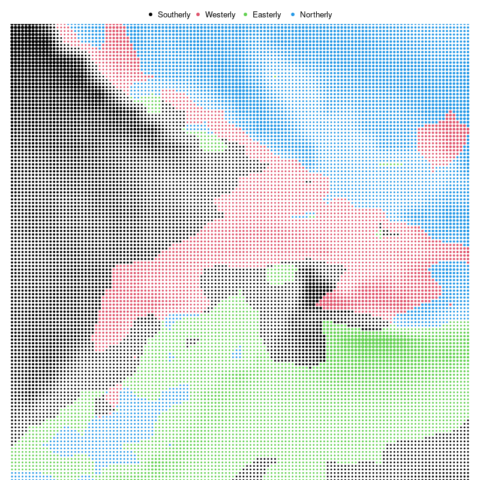
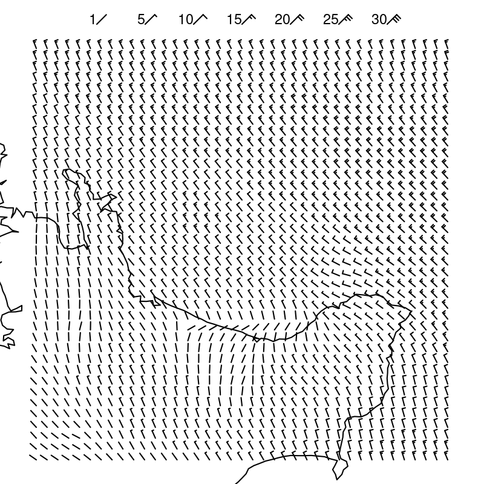

```{r}
#| echo: false
#| message: false
source("common.R")
```

# The Visual System {#sec-visual-system}

In later chapters, we are going to explore a range of ways that
information can be **encoded** to create different data visualisations.
For example, we can encode data values as different-coloured lines 
to create a line plot (@fig-crime)
and we can encode data values as different-coloured rectangles to
create a heatmap (@fig-crime-heatmap).

The choice of a good encoding will depend on how well information can be
**decoded** from the data visualisation (@fig-decode).
For example, if we want to communicate trends then encoding data
values as lines will be more effective than encoding data values
as rectangles because it is easier to decode trends from lines.

Understanding why some encodings are more effective than others will
require an understanding of how the human visual system works.
In order to understand the effectiveness of an encoding
from information to a visual representation,
we need to know how well the visual system decodes information from 
the visual representation.

In this chapter, we focus on the **decoding** of information from
a visual representation.
In this chapter we will establish a very simple model of the visual system, 
which will help us to understand the effectiveness of the
different encodings that we consider throughout the book.[^simple-visual-models]

[^simple-visual-models]:
  Simple descriptions of the human visual system can be found in many articles
  and books on
  data visualisation, for example, @cairo2012functional, 
  @franconeri2021, and @Sönning2023.
  See @ware2021information for a more in-depth,
  but still very accessible description.
  Wikipedia also has some very helpful content
  [@wikipedia-visual-system].

## The eye {#sec-eye}

In order for us to decode a data visualisation, we first have to see it.
Light must emit from 
a computer screen or reflect off a page
and enter the eye.  Light passes through the pupil, 
is focused by the lens, and is projected onto the retina at the back of
the eye.  The retina contains around 100 million light-sensitive
nerve cells and signals from those are combined into about 1 million
nerve fibres in the optic nerve, which passes signals on to the brain
(see @fig-eye).
A very large amount of visual information is gathered by the 
eye and passed on to the brain.

```{r}
#| echo: false
#| eval: false
#| label: eye-basic
## grid.newpage()
eyeball <- circleGrob(r=.3, gp=gpar(lwd=3, fill="grey90"))
eyeballNot <- as.path(grobTree(eyeball, rectGrob(width=1.5)), rule="evenodd")
pushViewport(viewport(width=unit(1, "snpc"), height=unit(1, "snpc"),
                      gp=gpar(lineheight=.9, fill=NA)))
grid.text("light", x=unit(0, "npc") - unit(2, "mm"), just="right")
grid.segments(0, .5,
              unit(.17, "npc") - unit(2, "mm"), .5,
              gp=gpar(lwd=3, fill="black"), 
              arrow=arrow(type="closed", length=unit(3, "mm")))
grid.draw(eyeball)
grid.define(circleGrob(r=.1), name="cornea", gp=gpar(lwd=3))
grid.define(circleGrob(r=.07), name="lens", gp=gpar(lwd=3, fill="white"))
pushViewport(viewport(clip=eyeballNot))
pushViewport(viewport(x=.22, width=.5))
grid.use("cornea")
popViewport(2)
pushViewport(viewport(x=.22, width=.5))
grid.use("lens")
popViewport()
grid.text("lens", x=unit(.25, "npc") + unit(2, "mm"), just="left")
pushViewport(viewport(clip=rectGrob(x=.5, height=.1, just="left")))
grid.circle(r=.28, gp=gpar(lwd=3))
popViewport()
grid.text("retina", x=.75, just="right")
pushViewport(viewport(clip=polygonGrob(c(.5, 1, 1), c(.5, -.2, 1.2))))
grid.circle(r=.28, gp=gpar(lwd=3))
popViewport()
pushViewport(viewport(clip=eyeballNot))
grid.segments(.5, .5, 1, .35, 
              gp=gpar(lwd=3, fill="black"),
              arrow=arrow(type="closed", length=unit(3, "mm")))
popViewport()
grid.text("optic\nnerve", y=.35, 
          x=unit(1, "npc") + unit(2, "mm"), just="left")
```

```{r}
#| echo: false
#| eval: false
#| label: eye-basic-2
## grid.newpage()
eyeball <- circleGrob(r=.3, gp=gpar(lwd=3, fill="grey90"))
eyeballNot <- as.path(grobTree(eyeball, rectGrob(width=1.5)), rule="evenodd")
pushViewport(viewport(width=unit(1, "snpc"), height=unit(1, "snpc"),
                      gp=gpar(lineheight=.9, fill=NA)))
grid.text("light", x=unit(0, "npc") - unit(2, "mm"), just="right")
grid.segments(0, .5,
              unit(.17, "npc") - unit(2, "mm"), .5,
              gp=gpar(lwd=3, fill="black"), 
              arrow=arrow(type="closed", length=unit(3, "mm")))
grid.draw(eyeball)
grid.define(circleGrob(r=.1), name="cornea", gp=gpar(lwd=3))
grid.define(circleGrob(r=.07), name="lens", gp=gpar(lwd=3, fill="white"))
pushViewport(viewport(clip=eyeballNot))
pushViewport(viewport(x=.22, width=.5))
grid.use("cornea")
popViewport(2)
pushViewport(viewport(x=.22, width=.5))
grid.use("lens")
popViewport()
pushViewport(viewport(clip=rectGrob(x=.5, height=.1, just="left")))
grid.circle(r=.28, gp=gpar(lwd=3))
popViewport()
grid.text("cones", x=.75, just="right")
pushViewport(viewport(clip=polygonGrob(c(.5, 1, 1), c(.5, .65, 1.2))))
grid.circle(r=.28, gp=gpar(lwd=3))
popViewport()
grid.text("rods", x=.7, y=.65, just="right")
pushViewport(viewport(clip=polygonGrob(c(.5, 1, 1), c(.5, .3, -.2))))
grid.circle(r=.28, gp=gpar(lwd=3))
popViewport()
grid.text("rods", x=.7, y=.35, just="right")
pushViewport(viewport(clip=eyeballNot))
grid.segments(.5, .5, 1, .35, 
              gp=gpar(lwd=3, fill="black"),
              arrow=arrow(type="closed", length=unit(3, "mm")))
popViewport()
grid.text("brain\nthis\nway", y=.35, 
          x=unit(1, "npc") + unit(2, "mm"), just="left")
```

```{r}
#| echo: false
#| results: hide
svg("Figures/eye-basic.svg", bg=figbg, width=4, height=3)
<<eye-basic>>
dev.off()
svg("Figures/eye-basic-2.svg", bg=figbg, width=4, height=3)
<<eye-basic-2>>
dev.off()
```

::: {#fig-eye}


A very simple diagram of the human eye.  Light enters via the pupil and
is focused by the lens onto retina.  Light-sensitive neurons in the retina pass 
signals via the optic nerve to the brain.
:::

> One reason why data visualisation is effective is
  because our visual system gathers
  an enormous amount of information.

## Visual processing {#sec-visual-processing}

Processing of the 
signals from the optic nerve occurs in several areas of the brain.[^essen]
Very basic **visual features** are extracted first, such as 
**position**, **length**, **angle**, **colour**, and **pattern**.[^feature-maps]
This low-level information is passed on and built upon 
to produce higher-level visual elements, such as regions and **shapes**.
Information is then also integrated from prior knowledge to assist with
the identification of **objects**---things like trees, animals, and 
faces.[^ware-model]

[^essen]:
    A rough estimate is that more than 50% of the brain is involved
    in visual processing [@vanessen1992information].

[^feature-maps]:
    Low-level visual processing involves the creation of *feature maps*
    that identify colours, edges, and orientations, 
    along with the spatial arrangement of those basic features
    within the field of view [@ware2021information, p. 146].

    Patterns, or *textures*, are perceived at a slightly higher level,
    based on low-level perception of spatial frequencies (fine detail
    versus coarse detail).

[^ware-model]:
    A slightly more detailed overview is provided in
    @ware2021information [-@ware2021information, p. 20].

::: {#fig-visual-processing}
::: {.content-visible when-format=pdf}
\includegraphics[scale=0.5]{Diagrams/visual-processing.png}
:::

::: {.content-visible when-format=html}

:::

A very simple model of visual processing. Basic visual features like position,
angle, and colour are identified first, then collections of those features are 
combined into visual shapes, and, finally, some shapes are recognised as 
familiar visual objects.
:::

Lower-level processing occurs subconsciously and more rapidly than higher-level
processing, which can require conscious effort.  Furthermore, lower-level
processing occurs in parallel and can involve many instances of visual 
features at once, whereas higher-level processing will only focus on 
a small number of
items or a single item at once.
On the other hand, lower-level visual features are rapidly
discarded as our attention shifts, while higher-level visual objects are more
persistent and may even become part of long-term memory
(@fig-visual-model).

::: {#fig-visual-model}


Early visual processing identifies large numbers of simple
visual features very rapidly and without conscious effort.
Subsequent processing takes longer, involves fewer, more complex visual shapes
and visual objects, and may involve conscious mental effort, but
the result can represent more complex information that is more
memorable.
:::

This means that, if we **encode** data values as simple **visual features**,
like length, angle, and colour,
then it will be possible to rapidly **decode** large amounts of 
simple information.
In addition, a smaller amount of 
more complex information will be decoded from
higher-level processing of those low-level visual features.

For example,
@fig-visual-model-demo shows an image that is made up of
many small items:  tiny triangles with different **positions**, **lengths**,
**angles**, and **colours**.
The angle of the triangles represents wind direction and the 
length of the triangles represents wind strength. Blue triangles
are over the sea and green triangles are over land.[^NOMADS]
We can
effortlessly decode the basic **visual features**---angle, 
size, and colour---of individual triangles.

The visual system can also very quickly
process the visual features of many triangles at once.
There is no need to consciously focus 
on every individual triangle in the image and,
at a higher level of processing, darker and lighter **visual shapes** are
identified as regions of different colours.
For example, a band of lighter wind forms a line from the top-left
corner down and to the right at a roughly 45-degree angle.
At a higher level of processing again, at least for the denizens of Oceania,
the green regions are recognised as a very familiar **visual object**: the
outline of New Zealand.

[^NOMADS]:
    @fig-visual-model-demo is based on wind data from the
    National Oceanic and Atmospheric Administration's Operational Model Archive 
    and Distribution System ([NOMADS](https://nomads.ncep.noaa.gov/)).
    The data were accessed on September 14 2024 and processed using 
    the {rNOMADS} package [@rNOMADS], with raw data interpolated to a finer
    grid.

::: {#fig-visual-model-demo}
::: {.content-visible when-format=pdf}
\includegraphics[width=\textwidth]{Data/Weather/NOMADS.png}
:::

::: {.content-visible when-format=html}

:::

A visualisation of wind strength and wind direction 
that is made up of lots of small triangles of different
lengths and different angles and different colours.
:::

::: {#fig-visual-model-demo}
::: {.content-visible when-format=pdf}
\includegraphics[width=\textwidth]{Data/Weather/NOMADS-dots.png}
:::

::: {.content-visible when-format=html}

:::

A visualisation of wind strength and wind direction 
that is made up of lots of small dots of different sizes
and different colours.
:::

::: {#fig-visual-model-demo}
::: {.content-visible when-format=pdf}
\includegraphics[width=\textwidth]{Data/Weather/NOMADS-barb.png}
:::

::: {.content-visible when-format=html}

:::

A visualisation of wind strength and wind direction 
that is made up of lots of small wind barbs.
:::


> Encoding data values as simple visual features is effective
  at conveying simple information
  because the visual system decodes 
  visual features rapidly and subconsciously.
>
> The visual system also processes many visual features at once, producing
  more complex visual shapes or visual objects, which allow
  more complex information to be decoded.

## Visual focus {#sec-visual-focus}

@fig-eye-2 shows a slightly more detailed view of the structure of the eye
(compared to @fig-eye).  The retina contains two types of light-sensitive
cells:  **cones** and **rods**.  The cones are sensitive to colour and are 
concentrated very densely at the centre of the retina, in an area called
the **fovea**.  Rods only detect the amount of light (monochrome vision) and 
are spread more sparsely towards the periphery of the retina.

This arrangement means that, despite the experience of a complete, detailed
field of view, we only get detailed and colourful information from
a small foveal region (less than 5 degrees of visual angle).
The information from our peripheral vision is less
colourful and lower-resolution.[^periphery]

[^periphery]:
    This is not to say that peripheral vision is useless.
    Peripheral vision contributes significantly to our field of view
    [@10.1167/jov.20.12.2; @annurev:/content/journals/10.1146/annurev-vision-082114-035733],
    and is as capable as foveal vision at detecting motion
    [@MCKEE198425].
    However, our ability to perceive fine details is limited to a relatively
    small area of focus.

::: {#fig-eye-2}


A slightly less simple diagram of the human eye.  There are two kinds
of light-sensitive cells in the
retina.  Cones are colour-sensitive and focused very densely at the
centre of the retina.  Rods are only light-sensitive and are spread
less densely towards the periphery of the retina.
:::

Furthermore, when we view an image, we do not simply stare at the centre
and see everything. Instead, we perform a series of **fixations**, which are
brief periods of focus on one area of the image, with **saccades** in between,
which are rapid changes in the location of our focus.
@fig-extinction demonstrates that where we look within an image
makes a difference.[^extinction]

[^extinction]:
    This image is a demonstration of the extinction illusion, which
    is related to the better-known Hermann grid illusion
    [@doi:10.1068/p2985].

    This illusion is not explained simply by differences in foveal
    versus peripheral perception---there is
    currently no complete explanation for the effect---but it 
    serves to show that we are getting different information from different
    regions of the field of view.

```{r}
#| echo: false
#| label: fig-extinction
#| fig-cap: The extinction illusion. Look at one corner of the image and then switch focus to a different corner of the image.  At a certain viewing distance, the white dots should disappear when we are not focused on them.  We may also see black dots within the white dots in our peripheral vision.
tile <- grobTree(rectGrob(gp=gpar(col=NA, fill="black")),
                 segmentsGrob(0, 0, 1, 1, gp=gpar(col="grey50", lwd=8)),
                 segmentsGrob(0, 1, 1, 0, gp=gpar(col="grey50", lwd=8)),
                 circleGrob(c(0, 0, .5, 1, 1), c(0, 1, .5, 1, 0),
                            r=unit(2, "mm"),
                            gp=gpar(col="black", lwd=2, fill="white")),
                 vp=viewport(width=unit(2, "cm"), height=unit(2, "cm")))
pat <- pattern(tile,
               width=unit(2, "cm"),
               height=unit(2, "cm"),
               extend="repeat")
grid.newpage()
grid.rect(gp=gpar(col=NA, fill=pat))
## grid.segments(0, .5, 1, .5, gp=gpar(col="white", lwd=170))
grid.rect(width=unit(2, "cm") - unit(2, "mm"), height=1.1,
          gp=gpar(col=NA, fill="white"))
## grid.segments(.5, 0, .5, 1, gp=gpar(col="white", lwd=170))
grid.rect(height=unit(2, "cm") - unit(2, "mm"), width=1.1, 
          gp=gpar(col=NA, fill="white"))
```

This means that, in order to decode detailed information from a 
data visualisation,
we will need to switch focus between different areas of detail.
For example, @fig-fixations shows eye-tracking data from one person viewing
an image for 10 seconds.[^MASSVIS]
The original image is shown on the left and eye-tracking data is shown
on the right, with hollow
black circles showing the position of the coloured circles
in the original image.
In the eye-tracking image, 
the fixations are shown as purple circles and the saccades  are shown as lines
between the circles.  We can see, for example, that the viewer has 
fixated multiple times upon the large, colourful circles in the
original image and has also fixated on the 
text at the top and bottom of the image.

[^MASSVIS]:
  The plot was originally from The Economist, but this image was taken
  from the resources provided on the 
  [MASSVIS project web site](http://massvis.mit.edu/).
  The eye tracking data were taken from the same web site.
  Cite MASSVIS article.
  Only a thumbnail version of the original image is shown in
  @fig-fixations in order to comply
  with terms of use of the MASSVIS data set.

::: {#fig-fixations layout-ncol=2 layout-valign="bottom"} 

{#fig-fixations-1 fig-align="left"}

{#fig-fixations-2 fig-align="left"}

Eye tracking data (on the right) 
from the MASSVIS project that shows fixations (circles) and 
saccades (lines between circles) for one person viewing an image for 
10 seconds.  A thumbnail of 
the original image is shown on the left.
:::

This feature of our visual system provides
an argument for keeping things simple.
If we can only decode information from an image in a piecemeal fashion,
then the fewer locations that we are required to focus on the better.

> A data visualisation will be slower to decode and require more effort
  to decode if it requires the viewer
  to constantly switch focus.

## Visual memory {#sec-memory}

When we switch focus between different areas of an image, 
we need to remember information from a previous area of focus.
How well can we hold visual information in memory?

The most important feature of visual memory is that it is 
very limited.  We can only hold in memory a small amount of information
at once.[^memory-limits]

::: {.content-visible when-format=pdf}
Figures \ref{fig-memory-static-1} and \ref{fig-memory-static-2}
provide a simple demonstration of the 
limitations of visual memory.
:::

::: {.content-visible when-format=html}
@fig-memory provides a simple demonstration of the 
limitations of visual memory.
:::

[^memory-limits]:
    Some limitations of visual memory are briefly mentioned in
    @ware2021information (pages 397-405 and pages 423-425).

    @Schurgin2020 mentions a limit of only "three or four items"!

    The limitations of visual memory are also more complex than
    just a number of visual items [@MAROIS2005296]:

    "The first limitation concerns the time it takes to consciously identify and
    consolidate a visual stimulus in visual short-term memory (VSTM), as
    revealed by the attentional blink paradigm.  This process can take more than
    half a second before it is free to identify a second stimulus. A second,
    severely limited capacity is the restricted number of stimuli that can be
    held in VSTM, as exemplified by the change detection paradigm. Finally, a
    third bottleneck arises when one must choose an appropriate response to each
    stimulus. Selecting an appropriate response for one stimulus delays by
    several hundred milliseconds the ability to select a response for a second
    stimulus (the 'psychological refractory period')"

::: {.content-visible when-format=pdf}
\afterpage{
\begin{figure}[t]
\includegraphics{Memory/static-1.pdf}

\caption{\label{fig-memory-static-1}
A memory task.  Focus on the circles in one of the three squares
then turn the page and try to tell how many of the circles have
changed colour in the corresponding square in \ref{fig-memory-static-2}.
The task should be obviously harder when there are more circles
to remember, which reflects the limits on visual memory.}
\end{figure}
}

\afterpage{
\begin{figure}[t]
\includegraphics{Memory/static-2.pdf}

\caption{\label{fig-memory-static-2}
A memory task.  Look at the circles in one of the squares
in \ref{fig-memory-static-1} on the previous page and then come
back here and try to tell how many circles have changed colour
in the corresponding square.
The task should be obviously harder when there are more circles
to remember, which reflects the limits on visual memory.}
\end{figure}
}
:::

::: {.content-visible when-format=html}
::: {#fig-memory}
```{r}
#| echo: false
#| output: asis
cat(readLines("Memory/memory-1.svg", warn=FALSE), sep="\n")
cat(readLines("Memory/memory-3.svg", warn=FALSE), sep="\n")
cat(readLines("Memory/memory-5.svg", warn=FALSE), sep="\n")
```

Three memory tasks.  The task is to remember the colours of the circles.  Within
each box, click on each of the coloured circles.  This will produce a colour
wheel.  Click (in the same order) on the colour wheel where it matches the
colours of the original circles.  This will present the results as small black
dots representing the original circle colours and open dots representing the
matching clicks, plus a (maximum) error (in degrees).  The task should be harder
(and less accurate) with more circles, which reflects the limits on visual
memory.
:::
:::

It is easier and faster to decode information from visual elements 
if they lie within the scope of a single visual focus.
If we have to switch focus, it not only takes longer to decode information,
but we may hit limits on our ability to remember visual elements
from previous areas of focus.[^at-a-glance]

[^at-a-glance]:
    Tufte refers to this as drawing "within the eyespan"
    [@tufte1990envisioning, p. 67]

    "In understanding human visual perception, an important component consists
    of what people can perceive at a glance. If that glance provides the
    observer with sufficient task-relevant information, this affords efficient
    processing. If not, one must move one’s eyes and integrate information
    across glances and over time, which is necessarily slower and limited by
    both working memory and the ability to integrate that information."
    [@PeripheralVisionACriticalComponentofManyVisualTasks].

The limits on visual memory reflect well-known limits on working memory
and those limits can also be worked around via familiar mechanisms such
as chunking.[^miller]
For example, we may only be able to hold in memory a small number of basic
visual features such as the colours of circles,
but we can effectively hold many more basic visual features
if we memorise more complex visual elements that are composed of 
many basic visual features.
In other words, we can remember several **visual shapes** or 
**visual objects** even if we cannot remember all of the individual
**visual features** within those visual shapes or visual objects
(@sec-visual-processing).
For example, we can hold in memory multiple country flags even though
we cannot necessarily hold in memory all of the invidual colours 
on those flags.

[^miller]:
    Miller's famous paper 
    "The Magical Number Seven, Plus or Minus Two: 
    Some Limits on Our Capacity for Processing Information"
    [@miller1956magical]
    talks about limits on working memory, but also how to 
    "escape" those limits, for example, by chunking information.

Once again, the obvious conclusion is to keep things simple,
so that there is less to remember during decoding, though this
is tempered by the fact that more complex visual shapes
may allow more to be remembered, especially if they are recognisable
visual objects.

> A data visualisation will require more effort to decode 
  if the viewer is required to switch focus and remember
  visual information
  across multiple areas of visual focus.

## Visual differences {#sec-differences}

The ability to gather a large amount of basic features from an image
very quickly (@sec-visual-processing)
is supplemented by rapid visual processing that combines and 
summarises the information.  These subconscious
processes extract some properties from an image without any mental effort.

For example, in @fig-pop-colour-1 we can detect the one teal dot amongst the
24 orange dots without effort. @fig-pop-colour-2 shows that this task remains
effortless even if the number of dots is much larger.[^pre-attentive]
This ability to identify an item that is different from all other items
within an image
also
applies to other basic features like size, as shown
in @fig-diff-size.

[^pre-attentive]:
    The ability to detect features without conscious effort
    is called *pre-attentive* processing or *pop out*
    [@TREISMAN1985156].

```{r}
#| echo: false
spread <- function(n, shift=1/n, seed=12345678) {
    set.seed(seed)
    xy <- grid(n)
    xd <- runif(n^2)
    yd <- runif(n^2)
    list(x=xy$x + shift*xd, y=xy$y + shift*yd)
}

grid <- function(n) {
    x <- rep(seq(0, 1, length.out=n), n)
    y <- rep(seq(0, 1, length.out=n), each=n)
    list(x=x, y=y)
}

resample <- function(x, ...) x[sample.int(length(x), ...)]

dots <- function(n, different=1, cols2=colsnpg, spread=FALSE, mix=FALSE, r2) {
    n2 <- n^2
    if (missing(r2)) {
        if (n < 10) {
            r2 <- c(3, 3)
        } else {
            r2 <- c(1.5, 1.5)
        }
    }
    if (spread) {
        xy <- spread(n)
        wh <- .9
    } else {
        xy <-grid(n)
        wh <- .8
    }
    draw <- function(xy, cols2, r2) {
        N <- length(xy$x)
        cols <- rep(cols2[1], N)
        r <- rep(r2[1], N)
        sub <- TRUE ## xy$x < xy$y
        i <- resample((1:N)[sub], different)
        cols[i] <- cols2[2]
        r[i] <- r2[2]
        grid.circle(xy$x, xy$y, default.units="native", r=unit(r, "mm"), 
                    gp=gpar(col=cols, fill=cols))
    }
    pushViewport(viewport(width=unit(.8, "snpc"), height=unit(.8, "snpc")))
    grid.rect()
    pushViewport(viewport(width=wh, height=wh,
                          xscale=range(xy$x), yscale=range(xy$y)))
    if (mix) {
        split <- sample(1:n2, round(n2/2))
        draw(lapply(xy, function(x) x[split]), rep(cols2[2], 2), r2)
        draw(lapply(xy, function(x) x[-split]), rep(cols2[1], 2), rev(r2))
    } else {
        draw(xy, cols2, r2)
    }
    popViewport(2)
}

mult2 <- c(1, -1)
pch2 <- c(4, 3)
lwd2 <- c(3, 3)
size2 <- c(4, 4)
len <- 1
lines <- function(n, col=FALSE, diffm=1, diffc=1, cols2=colsnpg, spread=FALSE) {
    n2 <- n^2
    if (n < 10) {
        size2 <- c(6, 6)
    } else {
        size2 <- c(4, 4)
    }
    if (spread) {
        xy <- spread(n)
        wh <- .9
    } else {
        xy <-grid(n)
        wh <- .8
    }
    mult <- rep(mult2[1], n2)
    pch <- rep(pch2[1], n2)
    lwd <- rep(lwd2[1], n2)
    size <- rep(size2[1], n2)
    sub <- TRUE ## xy$x < xy$y
    i <- resample((1:n2)[sub], diffm)
    mult[i] <- mult2[2]
    pch[i] <- pch2[2]
    lwd[i] <- lwd2[2]
    size[i] <- size2[2]
    pushViewport(viewport(width=unit(.8, "snpc"), height=unit(.8, "snpc")))
    grid.rect()
    pushViewport(viewport(width=wh, height=wh,
                          xscale=range(xy$x), yscale=range(xy$y)))
    if (col) {
        cols <- rep(cols2[1], n2)
        i <- c(resample(i, 1), resample((1:n2)[-i], diffc))
        cols[i] <- cols2[2]
    } else {
        cols <- "black"
    }
    if (FALSE) {
        grid.segments(unit(xy$x, "native") + unit(len, "mm"), 
                      unit(xy$y, "native") + mult*unit(len, "mm"), 
                      unit(xy$x, "native") - unit(len, "mm"), 
                      unit(xy$y, "native") - mult*unit(len, "mm"),
                      gp=gpar(col=cols, lwd=2))
    } else {
        grid.points(unit(xy$x, "native"), unit(xy$y, "native"),
                    pch=pch, gp=gpar(col=cols, lwd=lwd),
                    size=unit(size, "mm"))
    }
    popViewport(2)
}
```

```{r}
#| echo: false
#| label: fig-pop-colour
#| layout-ncol: 2
#| fig.height: 6
#| fig-cap: Amongst a collection of dots, we effortlessly perceive one dot that has a different colour.
#| fig-subcap:
#|   - One teal dot amongst 24 orange dots.
#|   - One teal dot amongst 99 orange dots.
colsnpg <- pal_npg()(2)

grid.newpage()
dots(5)

grid.newpage()
dots(10)
```

```{r}
#| echo: false
#| label: fig-diff-size
#| layout-ncol: 2
#| fig.height: 6
#| fig-cap: Amongst a collection of dots, we effortlessly perceive one dot that differs only by size.
#| fig-subcap:
#|   - One larger dot amongst 24 smaller dots.
#|   - One larger dot amongst 99 smaller dots.
colssame <- rep("black", 2)

grid.newpage()
dots(5, cols2=colssame, r2=c(3, 5))

grid.newpage()
dots(10, cols2=colssame, r2=c(1.5, 3))
```

If an item differs on more than one visual feature, the effect is 
even stronger (@fig-diff-salience).
This means that
the visual system is very sensitive to items that are **different** in terms
of basic **visual features**.

```{r}
#| echo: false
#| label: fig-diff-salience
#| layout-ncol: 2
#| fig.height: 6
#| fig-cap: Amongst a collection of dots, we effortlessly perceive one dot that differs by both colour and size.
#| fig-subcap:
#|   - One larger teal dot amongst 24 smaller orange dots.
#|   - One larger teal dot amongst 99 smaller orange dots.
#col1 <- coords(as(sRGB(t(col2rgb(colsnpg[1])/255)), "polarLUV"))
#colssimilar <- hcl(c(col1[3], col1[3] + 10), col1[2], c(col1[1], col1[1] - 10))
colssimilar <- c(colsnpg[1], darken(colsnpg[1]))

grid.newpage()
dots(5, cols2=colsnpg, r2=c(3, 5))

grid.newpage()
dots(10, cols2=colsnpg, r2=c(1.5, 3))
```

On the other hand, if the distractor items are similar on one
visual feature, but different on another, and if the arrangement
of the items is less structured, then finding a particular item of interest
becomes much harder.  For example, if we look for the
single larger 
teal dot in @fig-diff-serial,
it is much harder to find than it is in @fig-diff-salience.
The visual system's sensitivity to **different** items is much
greater when all other items are the **same**.[^same-diff]

[^same-diff]:
    For example, from @Wolfe2017FiveFactors:
    "Salience of a target increases with difference from the distractors
    (target–distractor heterogeneity) and with the homogeneity of the
    distractors (distractor–distractor homogeneity) along basic feature 
    dimensions."


```{r}
#| echo: false
#| label: fig-diff-serial
#| layout-ncol: 2
#| fig.height: 6
#| fig-cap: We have to work much harder to identify a unique item when multiple other visual features are changing within the image.
#| fig-subcap:
#|   - One larger teal dot amongst 24 dots that differ by colour and/or size.
#|   - One larger teal dot amongst 99 dots that differ by colour and/or size.
grid.newpage()
dots(5, cols2=colsnpg, r2=c(3, 5), spread=TRUE, mix=TRUE)

grid.newpage()
dots(10, cols2=colsnpg, r2=c(1.5, 3), spread=TRUE, mix=TRUE)
```

This means that encoding data values as data symbols
that differ only in terms of basic visual features 
will be effective for decoding unusual data values.

> A data visualisation will be effective for decoding
  unusual data values if the data are encoded using differences
  in basic visual features,
  especially if everything else remains the same.

## Visual attention {#sec-attention}

Where we focus within an image
is not random.
The figures from @sec-differences show that
our attention is automatically drawn to the **larger**, **brighter**, and
more **colourful** items within an image.
This happens due to very early visual processing and without
conscious thought.[^attention]

[^attention]:
    Saliency maps [e.g., @itti-koch-niebur; @DVS],
    which attempt to predict where the viewer will focus attention,
    are based on the idea that attention is drawn to basic visual features 
    like colour, angle, and size.

> A data visualisation will be effective for decoding
  important data values if it uses basic visual
  features like colour to draw the viewer's attention.

Where we focus within an image, and what information we extract,
is also affected by conscious goals---what are we looking for?[^filtering]
For example, when you were looking for the larger teal dot in @fig-diff-serial,
did you notice that there was also a single small orange dot?
Now that your attention has been drawn to that task, it will
be easier to find the smaller orange dot.[^top-down]

[^filtering]:
    Having a conscious target to search for not only 
    directs our visual focus (@sec-visual-focus), but
    also filters the processing of visual input
    to exclude visual features that are not of interest
    [@Knudsen2020EvolutionOfNeuralProcessing].
    In other words, to some extent, we see what we are looking for!

[^top-down]:
    @Wolfe2017FiveFactors describe "Bottom-up, stimulus-driven guidance"
    versus "Top-down, user-driven guidance".

> A data visualisation will be effective for decoding
  important data values if it includes instructions
  that direct the reader's attention.

## Visual similarities {#sec-visual-model-groups}

In @fig-diff-serial, we can see several groups of items:
orange dots, teal dots, large dots, and small dots.
These separate groups of items are identified based on their 
**similarity**---each group of items has the same size and the same colour.
The flip side of being able to easily identify items that are different 
(@sec-differences) is that we can 
also easily identify items that are the same.

The grouping of similar items within an image also happens automatically and
without conscious effort.
@fig-gestalt-group shows pairs of dot matrices that are very similar,
but in one matrix of each pair we see rows and in the other matrix we see
columns.  For example, in the middle pair, items that are the same colour
produce groups that are either rows or columns.

There are other visual properties 
that mean we automatically perceive items as groups:
items that are close together (items that have similar
**positions**) are seen as a group so we see either rows of black dots
or columns of black dots on the left of @fig-gestalt-group;
items that are connected by lines
are also seen as a group so we see either connected rows or connected columns 
on the right of @fig-gestalt-group.[^gestalt]

[^gestalt]:
    These visual effects are known as the Gestalt Grouping 
    Principles (@wagemans2012gestalt).
    The Proximity Principle says that items that are close to 
    each other form a group.  The Similarity Principle says that items
    that have the same colour or size form a group.
    The Connectedness Principle says that items that are connected to each
    other form a group.
    The Common Region Principle says that items within the same bounded
    region form a group.
    @Todorovic:2008 provides a very accessible description
    of these principles and several others.

```{r}
#| echo: false
#| label: fig-gestalt-group
#| fig.height: 2
#| fig-cap: In each matrix of dots, we clearly see either rows or columns. In the pair of matrices on the left, making the dots slightly closer together horizontally produces rows, and making the dots slightly closer vertically produces columns.  In the middle pair of matrices, using the same colour on each row produces rows, and using the same colour on each column produces columns.  In the pair of matrices on the right, drawing vertical lines produces columns and drawing horizontal lines produces rows.
vp2 <- viewport(width=.9, y=unit(3, "lines"), 
                height=unit(1, "npc") - unit(6, "lines"), 
                just="bottom")
pushViewport(viewport(width=.8, 
                      layout=grid.layout(1, 5, widths=c(1, .5), 
                                         respect=TRUE),
                      gp=gpar(cex=1.5)))
pushViewport(viewport(layout.pos.col=1),
             vp2)
grid.circle(unit(.15, "npc") + rep(3.5*unit(-2:2, "mm"), 5), 
            unit(.5, "npc") + rep(5*unit(-2:2, "mm"), each=5), 
            r=unit(1, "mm"), gp=gpar(fill="black"))
grid.circle(unit(.85, "npc") + rep(5*unit(-2:2, "mm"), 7), 
            unit(.5, "npc") + rep(3.5*unit(-2:2, "mm"), each=7), 
            r=unit(1, "mm"), gp=gpar(fill="black"))
grid.text("proximity", y=unit(-2, "lines"), just="top")
popViewport(2)
pushViewport(viewport(layout.pos.col=3),
             vp2)
grid.circle(unit(.2, "npc") + rep(4*unit(-2:2, "mm"), 5), 
            unit(.5, "npc") + rep(4*unit(-2:2, "mm"), each=5), 
            r=unit(1, "mm"), 
            gp=gpar(col=rep(colsnpg, each=5), fill=rep(colsnpg, each=5)))
grid.circle(unit(.8, "npc") + rep(4*unit(-2:2, "mm"), 5), 
            unit(.5, "npc") + rep(4*unit(-2:2, "mm"), each=5), 
            r=unit(1, "mm"), 
            gp=gpar(col=rep(colsnpg, length.out=5), 
                    fill=rep(colsnpg, length.out=5)))
grid.text("similarity", y=unit(-2, "lines"), just="top")
popViewport(2)
pushViewport(viewport(layout.pos.col=5),
             vp2)
grid.circle(unit(.2, "npc") + rep(4*unit(-2:2, "mm"), 5), 
            unit(.5, "npc") + rep(4*unit(-2:2, "mm"), each=5), 
            r=unit(1, "mm"), 
            gp=gpar(fill="black"))
grid.segments(unit(.8, "npc") + 4*unit(-2:2, "mm"),
              unit(.5, "npc") + 4*unit(-2, "mm"), 
              unit(.8, "npc") + 4*unit(-2:2, "mm"),
              unit(.5, "npc") + 4*unit(2, "mm"),
              gp=gpar(lwd=1.5))
grid.circle(unit(.8, "npc") + rep(4*unit(-2:2, "mm"), 5), 
            unit(.5, "npc") + rep(4*unit(-2:2, "mm"), each=5), 
            r=unit(1, "mm"), 
            gp=gpar(fill="black"))
grid.segments(unit(.2, "npc") + 4*unit(-2, "mm"),
              unit(.5, "npc") + 4*unit(-2:2, "mm"), 
              unit(.2, "npc") + 4*unit(2, "mm"),
              unit(.5, "npc") + 4*unit(-2:2, "mm"),
              gp=gpar(lwd=2))
grid.text("connection", y=unit(-2, "lines"), just="top")
popViewport(2)
```

These grouping effects are very powerful and can even be used to override
each other in some combinations.  @fig-gestalt-order shows that an enclosing
border can be stronger than a connecting line, connecting lines can be 
stronger than proximity, and proximity can be stronger than similarity.

```{r}
#| echo: false
#| label: fig-gestalt-order
#| fig-cap: For each set of four dots, we automatically perceive two pairs of dots.  On the left, the enclosing grey rectangles produce an upper pair and a lower pair, despite the fact that the left and right pair of dots are connected by lines.  Second from left, the connecting lines produce a left pair and a right pair, despite the fact that the top pair and the bottom pair are closer to each other.  Second from right, the positions of the dots (their proximity) produces an upper pair and a lower pair, despite the fact that the left and right pairs are coloured the same.  On the right, the same colours produce a left pair and a right pair.
#| fig.height: 2
cols <- rep(colsnpg, each=2)
vp2 <- viewport(width=.9, y=unit(2, "lines"), 
                height=unit(1, "npc") - unit(4, "lines"), 
                just="bottom")
pushViewport(viewport(layout=grid.layout(16, 4)))
pushViewport(viewport(layout.pos.col=1),
             vp2, viewport(width=unit(1, "snpc"), height=unit(1, "snpc")))
grid.roundrect(.5, .2, .6, .3, 
               gp=gpar(col=NA, fill="grey"))
grid.roundrect(.5, .8, .6, .3, 
               gp=gpar(col=NA, fill="grey"))
grid.segments(c(.4, .6), .2, c(.4, .6), .8,
              gp=gpar(lwd=3))
grid.circle(c(.4, .4, .6, .6), c(.2, .8, .2, .8),
            r=unit(2, "mm"), gp=gpar(fill="black"))
grid.text("enclosure", y=0, just="top")
popViewport()
grid.text(">", x=1, y=0, just="top")
popViewport(2)
pushViewport(viewport(layout.pos.col=2),
             vp2, viewport(width=unit(1, "snpc"), height=unit(1, "snpc")))
grid.segments(c(.4, .6), .2, c(.4, .6), .8,
              gp=gpar(lwd=3))
grid.circle(c(.4, .4, .6, .6), c(.2, .8, .2, .8),
            r=unit(2, "mm"), gp=gpar(fill="black"))
grid.text("connection", y=0, just="top")
popViewport()
grid.text(">", x=1, y=0, just="top")
popViewport(2)
pushViewport(viewport(layout.pos.col=3),
             vp2, viewport(width=unit(1, "snpc"), height=unit(1, "snpc")))
grid.circle(c(.4, .4, .6, .6), c(.2, .8, .2, .8),
            r=unit(2, "mm"), gp=gpar(col=cols, fill=cols))
grid.text("proximity", y=0, just="top")
popViewport()
grid.text(">", x=1, y=0, just="top")
popViewport(2)
pushViewport(viewport(layout.pos.col=4),
             vp2, viewport(width=unit(1, "snpc"), height=unit(1, "snpc")))
grid.circle(c(.4, .4, .6, .6), c(.4, .6, .4, .6),
            r=unit(2, "mm"), gp=gpar(col=cols, fill=cols))
grid.text("similarity", y=0, just="top")
popViewport(3)
```

Another type of automatic grouping is demonstrated in 
@fig-continuity.  On the left is a collection of dots.
We naturally perceive a horizontal line 
and a circle from these dots, as shown in the centre of @fig-continuity.
We automatically complete lines, particularly smooth curves,
even when the curve is broken, as in the central set of dots.
We do not tend to complete lines with sharp corners, as indicated
on the right of @fig-continuity.[^continuity]

[^continuity]:
    This is the Gestalt Continuity Principle [@Todorovic:2008]:
    Items that lie along a smooth curve form a group.

```{r}
#| echo: false
#| label: fig-continuity
#| fig-cap: What shapes emerge from the collection of points on the left?  We have a preference for completing curves and straight lines (in the middle) rather than shapes with sharp corners (on the right).
#| fig.height: 2
library(vwline)
curves <- function(col1="black", col2=col1, col3=col1, 
                   col4=col1, col5=col1, col6=col1, col7=col1) {
    r <- .3
    n1 <- 6
    n2 <- 1.5*n1
    step1 <- convertWidth(unit(2*r/n1, "npc"), "mm")
    step2 <- convertWidth(unit(pi*r/n2, "npc"), "mm")
    grid.brushXspline(circleBrush(), c(.5 - r, .5 - r - .2), c(.5, .5), 
                      w=unit(2, "mm"), spacing=step1, 
                      gp=gpar(col=col1, fill=col1))
    grid.brushXspline(circleBrush(), c(.5 - r, .5 + r), c(.5, .5), 
                      w=unit(2, "mm"), spacing=step1, 
                      gp=gpar(col=col2, fill=col2))
    grid.brushXspline(circleBrush(), c(.5 + r, .5 + r + .2), c(.5, .5), 
                      w=unit(2, "mm"), spacing=step1, 
                      gp=gpar(col=col3, fill=col3))
    t <- seq(0, pi, length.out=50)
    grid.draw(editGrob(brushXsplineGrob(circleBrush(), 
                                        .5 + r*cos(t), .5 + r*sin(t), 
                                        w=unit(2, "mm"), spacing=step2, 
                                        gp=gpar(col=col4, fill=col4)), 
                       tol=1e-8))
    grid.draw(editGrob(brushXsplineGrob(circleBrush(), 
                                        .5 + r*cos(t + pi), .5 + r*sin(t + pi), 
                                        w=unit(2, "mm"), spacing=step2, 
                                        gp=gpar(col=col5, fill=col5)), 
                       tol=1e-8))
    grid.circle(.5 - r, .5, r=unit(1, "mm"), 
                gp=gpar(col=col6, fill=col6))
    grid.circle(.5 + r, .5, r=unit(1, "mm"), 
                gp=gpar(col=col7, fill=col7))
}
grid.newpage()
pushViewport(viewport(layout=grid.layout(1, 7, 
                                         widths=unit(c(2, 1), c("cm", "null")), 
                                         respect=TRUE)))
pushViewport(viewport(layout.pos.col=2))
curves("grey")
popViewport()
pushViewport(viewport(layout.pos.col=4))
curves(col1=colsnpg[1], col4=colsnpg[2], col5=colsnpg[2])
popViewport()
pushViewport(viewport(layout.pos.col=6))
curves(col1=colsnpg[1], col2="grey", col3=colsnpg[1], 
       col4=colsnpg[1], col5="grey")
popViewport()
```

All of this means that
if we encode data values from the same group using the same
position or colour, or if we connect them with lines, or if we
enclose them within a border, then  
the visual system will automatically decode the group
information.

> One way that a data visualisation can be effective is by relying on
  on the automatic decoding of visual groups
  (proximity, similarity, etc).

## Visual simplicity {#sec-simplicity}

@fig-simplicity shows an arrangement of dots, similar to @fig-continuity.
The collection of dots on the left has an ambiguous interpretation.
Is this a single shape, or two overlapping shapes (as indicated in the
centre of @fig-simplicity), or some complex combination of multiple shapes
(as indicated on the right of @fig-simplicity)?

Our visual system has a preference for the simple interpretation.
Given an ambiguous arrangement of visual elements, we will tend to perceive
whatever is most orderly, regular, and coherent.[^good-gestalt]

[^good-gestalt]:
    This is the Gestalt Prägnanz Principle [@Todorovic:2008]:
    The tendency to seek simplifying structure and to find order
    within the chaos of an image.

```{r}
#| echo: false
#| label: fig-simplicity
#| fig-cap: What shapes emerge from the collection of points on the left?  We have a preference for simpler shapes (in the middle) over more complex shapes (on the right).
#| fig.height: 2
grid.newpage()
pushViewport(viewport(layout=grid.layout(1, 7, 
                                         widths=unit(c(2, 1), c("cm", "null")), 
                                         respect=TRUE)))
pushViewport(viewport(layout.pos.col=2))
curves("grey")
popViewport()
pushViewport(viewport(layout.pos.col=4))
curves(col1=colsnpg[1], col4=colsnpg[2], col5=colsnpg[2])
popViewport()
pushViewport(viewport(layout.pos.col=6))
curves(col1=colsnpg[1], col2="grey", col3=colsnpg[2], 
       col4=colsnpg[1], col5=colsnpg[2], col7=colsnpg[2])
popViewport()
```

@fig-symmetry shows that we also perceive groups when
items have a symmetric arrangement.[^symmetry]

[^symmetry]:
    This is the Gestalt Symmetry Principle [@Todorovic:2008]:
    Items that exhibit symmetry will form a group
    (in preference to items that do not exhibit symmetry).

```{r}
#| echo: false
#| label: fig-symmetry
#| fig-cap: We automatically perceive groups from symmetric arrangements.  The pair of symmetric curves on the left naturally form a group, much more so than the pairs of curves in the middle and to the right.
#| fig.height: 2
library(vwline)
arc <- function(angle, offset, x=.5) {
    r <- .3
    n1 <- 6
    n2 <- 1.5*n1
    step2 <- convertWidth(unit(pi*r/n2, "npc"), "mm")
    t <- seq(-angle + offset, angle + offset, length.out=50)
    grid.draw(editGrob(brushXsplineGrob(circleBrush(), 
                                        x + r*cos(t), .5 + r*sin(t), 
                                        w=unit(2, "mm"), spacing=step2, 
                                        gp=gpar(fill="black")), 
                       tol=1e-8))
}
grid.newpage()
pushViewport(viewport(layout=grid.layout(1, 7, 
                                         widths=unit(c(2, 1), c("cm", "null")), 
                                         respect=TRUE)))
pushViewport(viewport(layout.pos.col=2))
arc(pi/2, 0, .55)
arc(pi/2, pi, .45)
## grid.segments(.5, 0, .5, 1)
popViewport()
pushViewport(viewport(layout.pos.col=4))
arc(pi/2, pi, .5)
arc(pi/2, pi, 1)
## grid.segments(.5, 0, .5, 1)
popViewport()
pushViewport(viewport(layout.pos.col=6))
arc(pi/5, 0, .5)
arc(pi/2, pi, .5)
## grid.segments(.5, 0, .5, 1)
popViewport()
```

This is another argument for simplicity in a data visualisation,
but also for regularity and orderliness.
These results suggest that we should design a data visualisation
so that it leads the viewer where
they already want to go rather than trying to force them
to decode a more complex interpretation.

> A data visualisation may be easier to decode if it is orderly and
  lends itself to a simple interpretation.

## Visual tasks {#sec-tasks}

Identifying whether visual elements are the same or different
(@sec-differences) is an example of a very simple visual task.
@fig-visual-task (on the left) shows another simple visual task:
judging the ratio of two different lengths.
These tasks are rapid and require very little effort.

```{r}
#| echo: false
#| label: fig-visual-task
#| fig-cap: On the left is a simple visual task, to estimate the relative length of the two lines.  On the right is a more complicated visual task, to decide which of the four bottom shapes is *not* a rotated version of the top shape.
#| fig.height: 2
grid.newpage()
grid.segments(.1, .2, .1, .4, gp=gpar(lwd=20, lineend="butt"))
grid.segments(.2, .2, .2, .7, gp=gpar(lwd=20, lineend="butt"))
x <- c(.2, .2, .4, .4, .6, .6, .8)
y <- c(.2, .7, .7, .4, .4, .5, .5)
pushViewport(viewport(x=1/3, width=2/3, just="left"))
grid.rect(gp=gpar(col=NA, fill="grey"))
pushViewport(viewport(x=.5, y=.75, 
                      width=unit(.3, "snpc"), height=unit(.3, "snpc")))
grid.polyline(x, y, gp=gpar(lwd=3))
popViewport()
pushViewport(viewport(x=.2, y=.3, angle=70,
                      width=unit(.3, "snpc"), height=unit(.3, "snpc")))
grid.polyline(x, y, gp=gpar(lwd=3))
popViewport()
pushViewport(viewport(x=.4, y=.3, angle=-70,
                      width=unit(.3, "snpc"), height=unit(.3, "snpc")))
grid.polyline(x, y, gp=gpar(lwd=3))
popViewport()
pushViewport(viewport(x=.6, y=.3, angle=-30,
                      width=unit(.3, "snpc"), height=unit(.3, "snpc")))
grid.polyline(1 - x, y, gp=gpar(lwd=3))
popViewport()
pushViewport(viewport(x=.8, y=.3, angle=200,
                      width=unit(.3, "snpc"), height=unit(.3, "snpc")))
grid.polyline(x, y, gp=gpar(lwd=3))
popViewport()
popViewport()
```

However, on the right of @fig-visual-task is an example of a
task that is much more difficult.
In this task, we have to identify which of the four shapes in the
bottom row is *not* a rotated version of the shape at the top.
This task requires much more deliberate effort 
and time to perform.[^cog-effort]

[^cog-effort]:
    "the comprehension of visual displays tends to be easiest when
    simple pattern identification processes are substituted for complex
    cognitive processes"
    [@carpenter1998graph, p. 98]

The point here is that we should create data visualisations that
can be decoded using simple visual tasks. 
That is how we can fulfil the promise of data visualisation.
It is far less useful to create a data visualisation 
that forces us to expend
significant mental effort in order to decode useful information.

> A data visualisation will be effective if it relies on 
  automatic and rapid visual processing rather than requiring
  conscious mental effort.

## Dangers of the visual system {#sec-illusion}

The value of data visualisation comes from the visual system's 
ability to rapidly gather and process a large amount of 
visual information.
However, while data visualisations usually consist of 
artificial and simple images presented on a two-dimensional
page or screen, the visual system has evolved for the unstructured, 
messy, and three-dimensional natural environment.
This means that the visual system will sometimes generate 
a more sophisticated, but erroneous interpretation of an image
from a very simple arrangement of basic shapes.
In other words, we are vulnerable to visual illusions.

For example, @fig-illusion shows the Muller-Lyer Illusion and the
Ebbinghaus Illusion.  In the former, two horizontal lines
of the same length appear to have different lengths and, in the latter, 
two orange circles of the same size appear to have different sizes.[^illusion]

```{r}
#| echo: false
#| results: hide
png("Images/muller-lyer.png", width=50, height=20)
grid.newpage()
grid.segments(.2, .5, .8, .5)
grid.segments(.1, .7, .2, .5)
grid.segments(.1, .3, .2, .5)
grid.segments(.6, .7, .5, .5)
grid.segments(.6, .3, .5, .5)
grid.segments(.7, .7, .8, .5)
grid.segments(.7, .3, .8, .5)
dev.off()
```

[^illusion]:
    The original publication of the Muller-Lyer illusion
    (in German) is @muller1889optische, though
    in that, the stimulus described is a single line with three sets
    of arrows, as shown below.

    

    The Ebbinghaus Illusion is also known as the Titchener Illusion
    after its English-language populariser [@titchener1901experimental].

    Various evolutionary explanations of these illusions have been
    proposed, e.g., [@gregory1963distortion] and [@howe2005muller].

```{r}
#| echo: false
#| label: fig-illusion
#| fig-cap: The two horizonal lines in the Muller-Lyer illusion on the left have exactly the same physical length, but the top line appears longer.  The two orange circles in the Ebbinghaus illusion on the right have exactly the same physical radius, but they appear to be different sizes.
#| fig.height: 2
grid.newpage()
pushViewport(viewport(layout=grid.layout(1, 5, widths=c(.2, 1, .2, 1, 1),
                                         respect=TRUE),
                      gp=gpar(lwd=3)))
pushViewport(viewport(layout.pos.col=2))
grid.segments(.3, .7, .7, .7)
grid.segments(.2, .6, .3, .7)
grid.segments(.2, .8, .3, .7)
grid.segments(.8, .6, .7, .7)
grid.segments(.8, .8, .7, .7)
grid.segments(.3, .3, .7, .3)
grid.segments(.4, .2, .3, .3)
grid.segments(.4, .4, .3, .3)
grid.segments(.6, .2, .7, .3)
grid.segments(.6, .4, .7, .3)
popViewport()
pushViewport(viewport(layout.pos.col=4))
t <- seq(0, 2*pi, length.out=7)[-7]
grid.circle(.5, .5, r=unit(4, "mm"), gp=gpar(col="orange", fill="orange"))
grid.circle(.5 + .3*cos(t), .5 + .3*sin(t), r=unit(7, "mm"), 
            gp=gpar(col="grey", fill="grey"))
popViewport()
pushViewport(viewport(layout.pos.col=5))
t <- seq(0, 2*pi, length.out=9)[-9]
grid.circle(.5, .5, r=unit(4, "mm"), gp=gpar(col="orange", fill="orange"))
grid.circle(.5 + .13*cos(t), .5 + .13*sin(t), r=unit(1.5, "mm"), 
            gp=gpar(col="grey", fill="grey"))
popViewport()
```

@fig-vert-horiz shows another set of illusions involving simple lines.
Every line segment in this image is the same physical length,
but we perceive some segments as longer than others.[^vert-horiz]

[^vert-horiz]:
    @KUNNAPASTM1955AAOT provides an in-depth exploration of this
    sort of illusion.

    @Coren1978 points out that the figures on the left and the right
    are actually combinations of the horizontal-vertical illusion
    and the Oppel-Kundt illusion (dividing lines influence the 
    perception of extent to either side), which is similar to
    the Baldwin illusion (the size/extent of surrounding objects or lines
    influences the perception of the extent of a target line or gap).
    All of these have obvious parallels in the standard construction
    of popular data visualisations.

```{r}
#| echo: false
#| label: fig-vert-horiz
#| fig-cap: All of the horizontal and vertical line segments in this image are exactly the same physical length, but our visual system perceives some segments as longer than others.
#| fig.height: 2
pushViewport(viewport(layout=grid.layout(1, 3, respect=TRUE),
                      gp=gpar(lwd=3, lineend="square", linejoin="mitre")))
pushViewport(viewport(layout.pos.col=1))
grid.segments(.3, .3, .3, .7)
grid.segments(.3, .5, .7, .5)
popViewport()
pushViewport(viewport(layout.pos.col=2))
grid.lines(c(.3, .3, .7), c(.7, .3, .3))
popViewport()
pushViewport(viewport(layout.pos.col=3))
grid.segments(.5, .3, .5, .7)
grid.segments(.3, .3, .7, .3)
popViewport()
```

@fig-3d shows two images that are composed of three 
simple parallelograms.  The three parallelograms are arranged separately
on the left, which means that we decode them as three simple shapes.
However, for the arrangement of the parallelograms on the right, 
the natural decoding is a 3-dimensional box, even though the image
is clearly 2-dimensional.

```{r}
#| echo: false
#| label: fig-3d
#| fig-height: 3
#| fig-cap: The image on the right is made up from the three simple parallelograms shown on the left.  Because of their arrangement and their shading, we are tempted to decode the three parallelograms on the right as a 3-dimensional object.
#| fig.height: 2
grid.newpage()
pushViewport(viewport(layout=grid.layout(1, 3, 
                                         widths=unit(c(1, 1, 1),
                                                     c("null", "in", "null")),
                                         respect=TRUE)))
pushViewport(viewport(layout.pos.col=1, angle=18,
                      xscale=c(-.1, 1.1), yscale=c(-.1, 1.1)))
grid.polygon(c(.2, .2, .6, .6) + .5, c(.3, .7, .6, .2) - .1,
             gp=gpar(col="grey", fill="grey"))
popViewport()
pushViewport(viewport(layout.pos.col=1, angle=-5,
                      xscale=c(-.1, 1.1), yscale=c(-.1, 1.1)))
grid.polygon(c(.6, .6, .8, .8) - .5, c(.2, .6, .7, .3) + .1,
             gp=gpar(col="grey40", fill="grey40"))
popViewport()
pushViewport(viewport(layout.pos.col=1, angle=5,
                      xscale=c(-.1, 1.1), yscale=c(-.1, 1.1)))
grid.polygon(c(.2, .6, .8, .4) + .2, c(.7, .6, .7, .8) - .6,
             gp=gpar(col="grey90", fill="grey90"))
popViewport()
pushViewport(viewport(layout.pos.col=3,
                      xscale=c(-.1, 1.1), yscale=c(-.1, 1.1)))
grid.polygon(c(.2, .2, .6, .6), c(.3, .7, .6, .2),
             gp=gpar(col=NA, fill="grey"))
grid.polygon(c(.6, .6, .8, .8), c(.2, .6, .7, .3),
             gp=gpar(col=NA, fill="grey40"))
grid.polygon(c(.2, .6, .8, .4), c(.7, .6, .7, .8),
             gp=gpar(col=NA, fill="grey90"))
popViewport()
```

These examples demonstrate that the visual system 
can produce incorrect or unintended results for 
even very simple visual tasks based on very simple visual elements.
If we encode data values in such a way that we produce a visual illusion
then the decoding will be wrong and will not lead back to the 
orginal data values.

> Visual illusions can destroy the effectiveness of a 
  data visualisation because they lead to an incorrect decoding
  of information.

## Summary

::: {.content-visible when-format=html}

::: {.oldsummary .callout-note title='Précis *(click to expand/contract)*' icon=false collapse=true}
  


:::

:::



---

```{=latex}
\theendnotes
```

