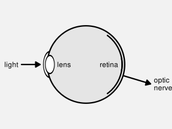
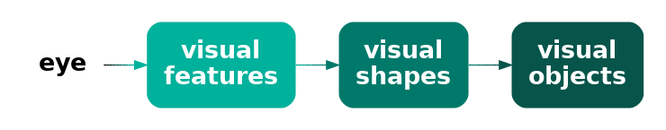
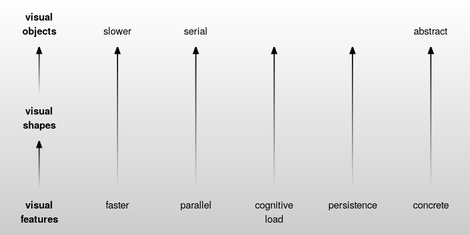
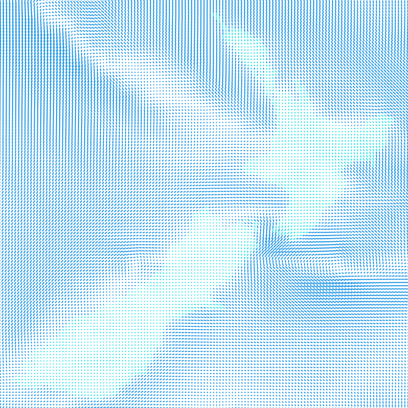
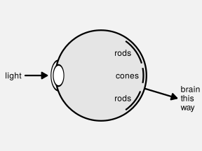
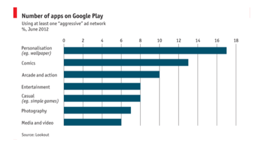
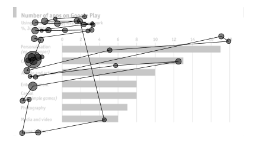

# The Visual System {#sec-visual-system}

Understanding why some mappings are more effective than others will
depend upon an understanding of how the human visual system works.
The effectiveness of a mapping from data values to data symbols
will depend on how well we can map *back* from the data symbols
to the properties of the data (@fig-decode).

::: {#fig-decode}


The effectiveness of a data visualisation will depend on how
well our visual system can map from data symbols back to
properties of the data.
:::

In this section we will establish a very simple model of the visual system 
that we can refer to as we discuss different mappings.[^simple-visual-models]
We will add some more detail about the visual system as we
need to in later sections.

[^simple-visual-models]:
  Simple descriptions of the human visual system can be found in many books on
  data visualisation, for example, @cairo2012functional.
  See @ware2021information for a more in-depth,
  but still very accessible description.

## The eye {#sec-eye}

In order for us to perceive a data visualisation, light from the
data visualisation must enter the eye.  Light passes through the pupil, 
is focused by the lens, and is projected onto the retina at the back of
the eye.  The retina contains around 100 million light-sensitive
nerve cells and signals from those are combined into about 1 million
nerve fibres in the optic nerve, which passes signals on to the brain
(see @fig-eye).
A very large amount of visual information is gathered by the 
eye and passed on to the brain.

```{r}
#| echo: false
#| eval: false
#| label: eye-basic
## grid.newpage()
eyeball <- circleGrob(r=.3, gp=gpar(lwd=3, fill="grey90"))
eyeballNot <- as.path(grobTree(eyeball, rectGrob(width=1.5)), rule="evenodd")
pushViewport(viewport(width=unit(1, "snpc"), height=unit(1, "snpc"),
                      gp=gpar(lineheight=.9, fill=NA)))
grid.text("light", x=unit(0, "npc") - unit(2, "mm"), just="right")
grid.segments(0, .5,
              unit(.17, "npc") - unit(2, "mm"), .5,
              gp=gpar(lwd=3, fill="black"), 
              arrow=arrow(type="closed", length=unit(3, "mm")))
grid.draw(eyeball)
grid.define(circleGrob(r=.1), name="cornea", gp=gpar(lwd=3))
grid.define(circleGrob(r=.07), name="lens", gp=gpar(lwd=3, fill="white"))
pushViewport(viewport(clip=eyeballNot))
pushViewport(viewport(x=.22, width=.5))
grid.use("cornea")
popViewport(2)
pushViewport(viewport(x=.22, width=.5))
grid.use("lens")
popViewport()
grid.text("lens", x=unit(.25, "npc") + unit(2, "mm"), just="left")
pushViewport(viewport(clip=rectGrob(x=.5, height=.1, just="left")))
grid.circle(r=.28, gp=gpar(lwd=3))
popViewport()
grid.text("retina", x=.75, just="right")
pushViewport(viewport(clip=polygonGrob(c(.5, 1, 1), c(.5, -.2, 1.2))))
grid.circle(r=.28, gp=gpar(lwd=3))
popViewport()
pushViewport(viewport(clip=eyeballNot))
grid.segments(.5, .5, 1, .35, 
              gp=gpar(lwd=3, fill="black"),
              arrow=arrow(type="closed", length=unit(3, "mm")))
popViewport()
grid.text("optic\nnerve", y=.35, 
          x=unit(1, "npc") + unit(2, "mm"), just="left")
```

```{r}
#| echo: false
#| eval: false
#| label: eye-basic-2
## grid.newpage()
eyeball <- circleGrob(r=.3, gp=gpar(lwd=3, fill="grey90"))
eyeballNot <- as.path(grobTree(eyeball, rectGrob(width=1.5)), rule="evenodd")
pushViewport(viewport(width=unit(1, "snpc"), height=unit(1, "snpc"),
                      gp=gpar(lineheight=.9, fill=NA)))
grid.text("light", x=unit(0, "npc") - unit(2, "mm"), just="right")
grid.segments(0, .5,
              unit(.17, "npc") - unit(2, "mm"), .5,
              gp=gpar(lwd=3, fill="black"), 
              arrow=arrow(type="closed", length=unit(3, "mm")))
grid.draw(eyeball)
grid.define(circleGrob(r=.1), name="cornea", gp=gpar(lwd=3))
grid.define(circleGrob(r=.07), name="lens", gp=gpar(lwd=3, fill="white"))
pushViewport(viewport(clip=eyeballNot))
pushViewport(viewport(x=.22, width=.5))
grid.use("cornea")
popViewport(2)
pushViewport(viewport(x=.22, width=.5))
grid.use("lens")
popViewport()
pushViewport(viewport(clip=rectGrob(x=.5, height=.1, just="left")))
grid.circle(r=.28, gp=gpar(lwd=3))
popViewport()
grid.text("cones", x=.75, just="right")
pushViewport(viewport(clip=polygonGrob(c(.5, 1, 1), c(.5, .65, 1.2))))
grid.circle(r=.28, gp=gpar(lwd=3))
popViewport()
grid.text("rods", x=.7, y=.65, just="right")
pushViewport(viewport(clip=polygonGrob(c(.5, 1, 1), c(.5, .3, -.2))))
grid.circle(r=.28, gp=gpar(lwd=3))
popViewport()
grid.text("rods", x=.7, y=.35, just="right")
pushViewport(viewport(clip=eyeballNot))
grid.segments(.5, .5, 1, .35, 
              gp=gpar(lwd=3, fill="black"),
              arrow=arrow(type="closed", length=unit(3, "mm")))
popViewport()
grid.text("brain\nthis\nway", y=.35, 
          x=unit(1, "npc") + unit(2, "mm"), just="left")
```

```{r}
#| echo: false
#| results: hide
svg("Figures/eye-basic.svg", bg=figbg, width=4, height=3)
<<eye-basic>>
dev.off()
svg("Figures/eye-basic-2.svg", bg=figbg, width=4, height=3)
<<eye-basic-2>>
dev.off()
```

::: {#fig-eye}



A very simple diagram of the human eye.  Light enters via the pupil and
is focused by the lens onto retina.  Light-sensitive neurons pass 
signals via the optic nerve to the brain.
:::

## Visual processing {#sec-visual-processing}

The processing of the 
signals from the optic nerve occurs in several areas of the brain.
Very basic **visual features** are extracted first, such as 
**position** (spatial arrangements), **angle** (orientations), **colour**,
and simple **patterns** (spatial frequencies).
This low-level information is passed on and built upon
to produce higher-level representations, such as regions and **shapes**.
Information is then also integrated from prior knowledge to assist with
the identification of **objects**---things like trees, animals, and faces.

::: {#fig-visual-processing}



A very simple model of visual processing. 
:::

Lower-level processing occurs subconsciously and more rapidly than higher-level
processing, which can require cognitive effort
(see @fig-visual-model).  Furthermore, lower-level
processing occurs in parallel and can involve many instances of visual 
features at once, whereas higher-level processing will only focus on one
or a few items.  On the other hand, lower-level visual features are rapidly
discarded as our attention shifts, while higher-level visual objects are more
persistent and may become part of long-term memories.  

::: {#fig-visual-model}



Some of the properties of visual processing. 
:::

@fig-visual-model-demo shows an image that is made up of
many small elements:  tiny triangles with different **lengths**,
orientations (**angles**), and **colours**.
The orientations of the triangles represents wind direction and the 
length of the triangles represents wind strength;  blue triangles
are over the sea and green triangles are over land.[^NOMADS]
The visual system can very quickly
perceive many small elements like this at once.
There is no need to concentrate separately
on every individual triangle in the image.
At a higher level of processing, darker and lighter **regions** are
identified as well as regions of different colours.
For example, a band of lighter wind forms a line from the top-left
corner at a roughly 45-degree angle.
At a higher level of processing again, at least for the denizens of Oceania,
the green regions are recognised as a very familiar **object**: the
outline of New Zealand.

The small lines convey a lot of simple pieces of information;
what is the wind strength and direction at each location.
The darker and lighter regions convey several more complex ideas like
regions of stronger and lighter winds.
The green regions combine to convey the single complex and abstract
concept of New Zealand.

[^NOMADS]:
  @fig-visual-model-demo is based on wind data from the
  National Oceanic and Atmospheric Administration's Operational Model Archive 
  and Distribution System ([NOMADS](https://nomads.ncep.noaa.gov/)).
  The data were accessed and processed using 
  the {rNOMADS} package [@rNOMADS], with raw data interpolated to a finer
  grid.

::: {#fig-visual-model-demo}



A visualisation of wind strength and wind direction 
that is made up of lots of small lines of different
lengths and different angles and different colours.
:::

## Gestalt[^gestalt]

[^gestalt]:
  Mention the Gestalt "school" or whatever.  This section could also cover
  ensembles, though not by that name ... yet ?

The ability to gather large amounts of basic information from an image
very quickly
is further supplemented by rapid visual processing that combines and 
summarises the information.  These subconscious, or **pre-attentive**,
processes extract properties from an image without any mental effort.

For example, in @fig-pop-colour-1 we can detect the one teal dot amongst the
19 orange dots without effort. @fig-pop-colour-2 shows that this task remains
effortless even if the number of distractors is much larger.

```{r}
#| echo: false
#| label: fig-pop-colour
#| layout-ncol: 2
#| fig-cap: Some properties pop out.  Find the teal dot.
#| fig-subcap:
#|   - low n
#|   - high n
spread <- function(n, shift=1/n, seed=1234567) {
    set.seed(seed)
    x <- rep(seq(0, 1, length.out=n), n)
    y <- rep(seq(0, 1, length.out=n), each=n)
    xd <- runif(n^2)
    yd <- runif(n^2)
    list(x=x + shift*xd, y=y + shift*yd)
}
cols2 <- pal_npg()(2)
resample <- function(x, ...) x[sample.int(length(x), ...)]
dots <- function(n, different=1) {
    n2 <- n^2
    xy <- spread(n)
    cols <- rep(cols2[1], n2)
    sub <- TRUE ## xy$x < xy$y
    i <- resample((1:n2)[sub], different)
    cols[i] <- cols2[2]
    pushViewport(viewport(width=unit(.8, "snpc"), height=unit(.8, "snpc")))
    grid.rect()
    pushViewport(viewport(width=.9, height=.9,
                          xscale=range(xy$x), yscale=range(xy$y)))
    grid.circle(xy$x, xy$y, default.units="native", r=unit(1, "mm"), 
                gp=gpar(col=cols, fill=cols))
    popViewport(2)
}

grid.newpage()
dots(5)

grid.newpage()
dots(10)
```

This ability to detect an odd-one-out in a field of distractors also
applies to other basic features like angle.

```{r}
#| echo: false
#| label: fig-pop-angle
#| layout-ncol: 2
#| fig-cap: Some properties pop out.
#| fig-subcap:
#|   - low n
#|   - high n
mult2 <- c(1, -1)
lines <- function(n, col=FALSE, diffm=1, diffc=1) {
    n2 <- n^2
    xy <- spread(n)
    mult <- rep(mult2[1], n2)
    sub <- TRUE ## xy$x < xy$y
    i <- resample((1:n2)[sub], diffm)
    mult[i] <- mult2[2]
    pushViewport(viewport(width=unit(.8, "snpc"), height=unit(.8, "snpc")))
    grid.rect()
    pushViewport(viewport(width=.9, height=.9,
                          xscale=range(xy$x), yscale=range(xy$y)))
    if (col) {
        cols <- rep(cols2[1], n2)
        i <- c(resample(i, 1), resample((1:n2)[-i], diffc))
        cols[i] <- cols2[2]
    } else {
        cols <- "black"
    }
    grid.segments(unit(xy$x, "native") + unit(2, "mm"), 
                  unit(xy$y, "native") + mult*unit(2, "mm"), 
                  unit(xy$x, "native") - unit(2, "mm"), 
                  unit(xy$y, "native") - mult*unit(2, "mm"),
                  gp=gpar(col=cols, lwd=2))
    popViewport(2)
}

grid.newpage()
lines(5)

grid.newpage()
lines(10)
```

A feature of @fig-pop-colour is that only one basic feature is changing: 
**colour**.
Differences are very obvious, even impossible to ignore,
if everything else remains the same.


mention same-same terminology so can refer to it later in 
congruence ?

If multiple items are different, we automatically perceive groups of items.
The teal dots are a separate group from the orange dots.

```{r}
#| echo: false
#| label: fig-group-colour
#| layout-ncol: 2
#| fig-cap: Some groups appear automatically.
#| fig-subcap:
#|   - low n
#|   - high n
grid.newpage()
dots(5, 5)

grid.newpage()
dots(10, 25)
```

This also works for angle, though less strongly.

```{r}
#| echo: false
#| label: fig-group-angle
#| layout-ncol: 2
#| fig-cap: Some groups appear automatically 
#| fig-subcap:
#|   - low n
#|   - high n
grid.newpage()
lines(5, diffm=5)

grid.newpage()
lines(10, diffm=50)
```

If we change more than one feature, the ability to spot the odd one
out disappears.

```{r}
#| echo: false
#| label: fig-group-colour-angle
#| layout-ncol: 2
#| fig-cap: If more than one thing changes at once, pop out stops. Find the blue line that slopes to the left.
#| fig-subcap:
#|   - low n
#|   - high n
grid.newpage()
lines(5, col=TRUE, diffm=5, diffc=5)

grid.newpage()
lines(10, col=TRUE, diffm=50, diffc=20)
```

The ability to identify groups is based on other things besides 
having the same feature.  That is called similarity, but 
groups also formed based on proximity and connectivity.

```{r}
#| echo: false
#| label: fig-gestalt-group
#| fig.height: 2
#| fig-cap: Gestalt grouping
vp2 <- viewport(width=.9, y=unit(3, "lines"), 
                height=unit(1, "npc") - unit(6, "lines"), 
                just="bottom")
pushViewport(viewport(width=.8, 
                      layout=grid.layout(1, 5, widths=c(1, .5), 
                                         respect=TRUE),
                      gp=gpar(cex=1.5)))
pushViewport(viewport(layout.pos.col=1),
             vp2)
grid.circle(unit(.15, "npc") + rep(3.5*unit(-2:2, "mm"), 5), 
            unit(.5, "npc") + rep(5*unit(-2:2, "mm"), each=5), 
            r=unit(1, "mm"), gp=gpar(fill="black"))
grid.circle(unit(.85, "npc") + rep(5*unit(-2:2, "mm"), 7), 
            unit(.5, "npc") + rep(3.5*unit(-2:2, "mm"), each=7), 
            r=unit(1, "mm"), gp=gpar(fill="black"))
grid.text("proximity", y=unit(-2, "lines"), just="top")
popViewport(2)
pushViewport(viewport(layout.pos.col=3),
             vp2)
grid.circle(unit(.2, "npc") + rep(4*unit(-2:2, "mm"), 5), 
            unit(.5, "npc") + rep(4*unit(-2:2, "mm"), each=5), 
            r=unit(1, "mm"), 
            gp=gpar(col=rep(cols2, each=5), fill=rep(cols2, each=5)))
grid.circle(unit(.8, "npc") + rep(4*unit(-2:2, "mm"), 5), 
            unit(.5, "npc") + rep(4*unit(-2:2, "mm"), each=5), 
            r=unit(1, "mm"), 
            gp=gpar(col=rep(cols2, length.out=5), 
                    fill=rep(cols2, length.out=5)))
grid.text("similarity", y=unit(-2, "lines"), just="top")
popViewport(2)
pushViewport(viewport(layout.pos.col=5),
             vp2)
grid.circle(unit(.2, "npc") + rep(4*unit(-2:2, "mm"), 5), 
            unit(.5, "npc") + rep(4*unit(-2:2, "mm"), each=5), 
            r=unit(1, "mm"), 
            gp=gpar(fill="black"))
grid.segments(unit(.2, "npc") + 4*unit(-2:2, "mm"),
              unit(.5, "npc") + 4*unit(-2, "mm"), 
              unit(.2, "npc") + 4*unit(-2:2, "mm"),
              unit(.5, "npc") + 4*unit(2, "mm"))
grid.circle(unit(.8, "npc") + rep(4*unit(-2:2, "mm"), 5), 
            unit(.5, "npc") + rep(4*unit(-2:2, "mm"), each=5), 
            r=unit(1, "mm"), 
            gp=gpar(fill="black"))
grid.segments(unit(.8, "npc") + 4*unit(-2, "mm"),
              unit(.5, "npc") + 4*unit(-2:2, "mm"), 
              unit(.8, "npc") + 4*unit(2, "mm"),
              unit(.5, "npc") + 4*unit(-2:2, "mm"))
grid.text("connectivity", y=unit(-2, "lines"), just="top")
popViewport(2)
```

Some features are stronger than others.

```{r}
#| echo: false
#| label: fig-gestalt-order
#| fig-cap: Gestalt order
#| fig.height: 2
cols <- rep(cols2, each=2)
vp2 <- viewport(width=.9, y=unit(2, "lines"), 
                height=unit(1, "npc") - unit(4, "lines"), 
                just="bottom")
pushViewport(viewport(layout=grid.layout(16, 4)))
pushViewport(viewport(layout.pos.col=1),
             vp2, viewport(width=unit(1, "snpc"), height=unit(1, "snpc")))
grid.roundrect(.5, .2, .6, .3, 
               gp=gpar(col=NA, fill="grey"))
grid.roundrect(.5, .8, .6, .3, 
               gp=gpar(col=NA, fill="grey"))
grid.segments(c(.4, .6), .2, c(.4, .6), .8,
              gp=gpar(lwd=3))
grid.circle(c(.4, .4, .6, .6), c(.2, .8, .2, .8),
            r=unit(2, "mm"), gp=gpar(fill="black"))
grid.text("enclosure", y=0, just="top")
popViewport()
grid.text(">", x=1, y=0, just="top")
popViewport(2)
pushViewport(viewport(layout.pos.col=2),
             vp2, viewport(width=unit(1, "snpc"), height=unit(1, "snpc")))
grid.segments(c(.4, .6), .2, c(.4, .6), .8,
              gp=gpar(lwd=3))
grid.circle(c(.4, .4, .6, .6), c(.2, .8, .2, .8),
            r=unit(2, "mm"), gp=gpar(fill="black"))
grid.text("connection", y=0, just="top")
popViewport()
grid.text(">", x=1, y=0, just="top")
popViewport(2)
pushViewport(viewport(layout.pos.col=3),
             vp2, viewport(width=unit(1, "snpc"), height=unit(1, "snpc")))
grid.circle(c(.4, .4, .6, .6), c(.2, .8, .2, .8),
            r=unit(2, "mm"), gp=gpar(col=cols, fill=cols))
grid.text("proximity", y=0, just="top")
popViewport()
grid.text(">", x=1, y=0, just="top")
popViewport(2)
pushViewport(viewport(layout.pos.col=4),
             vp2, viewport(width=unit(1, "snpc"), height=unit(1, "snpc")))
grid.circle(c(.4, .4, .6, .6), c(.4, .6, .4, .6),
            r=unit(2, "mm"), gp=gpar(col=cols, fill=cols))
grid.text("similarity", y=0, just="top")
popViewport(3)
```

Ensembles (but only with reference to @fig-visual-model-demo at this point) ?

The main point is that the visual system is *very* good at some tasks.
An effective data visualisation will make use of the things that
the visual system is good at.

## Visual focus

@fig-eye-2 show a slightly more detailed view of the structure of the eye
(compared to @fig-eye).  The retina contains two types of light-sensitive
cells:  **cones** and **rods**.  The cones are sensitive to colour and are 
concentrated very densely at the centre of the retina, an area called
the **fovea**.  Rods only detect the amount of light and 
are spread more sparsely towards the periphery of the retina.

This arrangement means that, despite the experience of a complete, detailed
field of view, we only get detailed and colourful information from
a small foveal region.  The information from our peripheral vision is
colourless and low-resolution.

::: {#fig-eye-2}



A slightly less simple diagram of the human eye.  There are two kinds
of light-sensitive cells in the
retina.  Cones are colour-sensitive and focused very densely at the
centre of the retina.  Rods are only light-sensitive and are spread
less densely towards the periphery of the retina.
:::

Furthermore, when we view an image, we do not simply stare at the centre
and see everything. Instead, we perform a series of **fixations**, which are
brief periods of focus on one area of the image, with **saccades** in between,
which are rapid changes in the location of our focus.
@fig-extinction demonstrates that where we look within an image
makes a difference.[^extinction]

[^extinction]:
  Explain that this is NOT just a fovea vs periphery illusion---there is
  currently no complete explanation for this effect---but it 
  serves to show that we are getting different information from different
  regions of the field of view.

```{r}
#| echo: false
#| label: fig-extinction
#| fig-cap: The extinction illusion. Look at one corner of the image and then switch focus to a different corner of the image.  What happens to the white dots?
tile <- grobTree(rectGrob(gp=gpar(col=NA, fill="black")),
                 segmentsGrob(0, 0, 1, 1, gp=gpar(col="grey50", lwd=8)),
                 segmentsGrob(0, 1, 1, 0, gp=gpar(col="grey50", lwd=8)),
                 circleGrob(c(0, 0, .5, 1, 1), c(0, 1, .5, 1, 0),
                            r=unit(2, "mm"),
                            gp=gpar(col="black", lwd=2, fill="white")),
                 vp=viewport(width=unit(2, "cm"), height=unit(2, "cm")))
pat <- pattern(tile,
               width=unit(2, "cm"),
               height=unit(2, "cm"),
               extend="repeat")
grid.newpage()
grid.rect(gp=gpar(col=NA, fill=pat))
## grid.segments(0, .5, 1, .5, gp=gpar(col="white", lwd=170))
## grid.segments(.5, 0, .5, 1, gp=gpar(col="white", lwd=170))
```

The implications for data visualisation are that, in order to 
perform comparisons of individual values, we need to perform multiple
fixations in order to get detailed information from multiple
locations within an image.
For example, @fig-fixations shows a data visualisation from the MASSIVIS
project.[^MASSVIS]  The image on the left is the original plot and the
image on the right shows the fixations (as points) and saccades (as lines
between points), from one person viewing the plot for 10 seconds. 

[^MASSVIS]:
  The plot was originally from The Economist, but this image was taken
  from the resources provided on the 
  [MASSVIS project web site](http://massvis.mit.edu/).  
  The eye tracking data were taken from the same web site.

::: {#fig-fixations layout-ncol=2}





Eye tracking data from the MASSVIS project that shows fixations (points) and 
saccades (lines between points) for one person viewing an image for 10 seconds.
:::


## Summary

The human visual system captures a large amount of information from the
visual field.  Large numbers of simple features are rapidly extracted,
while more complex visual elements take longer and require more 
congnitive effort, but persist for longer.

