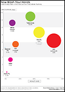
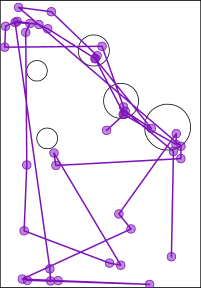

# The Visual System {#sec-visual-system}

Understanding why some mappings are more effective than others will
depend upon an understanding of how the human visual system works.
The effectiveness of an **encoding** from data values to data symbols
will depend on how well we can **decode** from the data symbols
to the properties of the data (@fig-decode).

::: {#fig-decode}


The effectiveness of a data visualisation will depend on how
well our visual system can **decode** from the data symbols to the
properties of the data.
:::

In this section we will establish a very simple model of the visual system 
that we can refer to as we discuss different mappings.[^simple-visual-models]

[^simple-visual-models]:
  Simple descriptions of the human visual system can be found in many articles
  and books on
  data visualisation, for example, @Sönning2023, 
  @franconeri2021, and @cairo2012functional.
  See @ware2021information for a more in-depth,
  but still very accessible description.
  The @wikipedia-visual-system is also good.

## The eye {#sec-eye}

In order for us to perceive a data visualisation, light must emit from the
data visualisation (on screen) or reflect off the 
data visualisation (in print) 
and enter the eye.  Light passes through the pupil, 
is focused by the lens, and is projected onto the retina at the back of
the eye.  The retina contains around 100 million light-sensitive
nerve cells and signals from those are combined into about 1 million
nerve fibres in the optic nerve, which passes signals on to the brain
(see @fig-eye).
A very large amount of visual information is gathered by the 
eye and passed on to the brain.

```{r}
#| echo: false
#| eval: false
#| label: eye-basic
## grid.newpage()
eyeball <- circleGrob(r=.3, gp=gpar(lwd=3, fill="grey90"))
eyeballNot <- as.path(grobTree(eyeball, rectGrob(width=1.5)), rule="evenodd")
pushViewport(viewport(width=unit(1, "snpc"), height=unit(1, "snpc"),
                      gp=gpar(lineheight=.9, fill=NA)))
grid.text("light", x=unit(0, "npc") - unit(2, "mm"), just="right")
grid.segments(0, .5,
              unit(.17, "npc") - unit(2, "mm"), .5,
              gp=gpar(lwd=3, fill="black"), 
              arrow=arrow(type="closed", length=unit(3, "mm")))
grid.draw(eyeball)
grid.define(circleGrob(r=.1), name="cornea", gp=gpar(lwd=3))
grid.define(circleGrob(r=.07), name="lens", gp=gpar(lwd=3, fill="white"))
pushViewport(viewport(clip=eyeballNot))
pushViewport(viewport(x=.22, width=.5))
grid.use("cornea")
popViewport(2)
pushViewport(viewport(x=.22, width=.5))
grid.use("lens")
popViewport()
grid.text("lens", x=unit(.25, "npc") + unit(2, "mm"), just="left")
pushViewport(viewport(clip=rectGrob(x=.5, height=.1, just="left")))
grid.circle(r=.28, gp=gpar(lwd=3))
popViewport()
grid.text("retina", x=.75, just="right")
pushViewport(viewport(clip=polygonGrob(c(.5, 1, 1), c(.5, -.2, 1.2))))
grid.circle(r=.28, gp=gpar(lwd=3))
popViewport()
pushViewport(viewport(clip=eyeballNot))
grid.segments(.5, .5, 1, .35, 
              gp=gpar(lwd=3, fill="black"),
              arrow=arrow(type="closed", length=unit(3, "mm")))
popViewport()
grid.text("optic\nnerve", y=.35, 
          x=unit(1, "npc") + unit(2, "mm"), just="left")
```

```{r}
#| echo: false
#| eval: false
#| label: eye-basic-2
## grid.newpage()
eyeball <- circleGrob(r=.3, gp=gpar(lwd=3, fill="grey90"))
eyeballNot <- as.path(grobTree(eyeball, rectGrob(width=1.5)), rule="evenodd")
pushViewport(viewport(width=unit(1, "snpc"), height=unit(1, "snpc"),
                      gp=gpar(lineheight=.9, fill=NA)))
grid.text("light", x=unit(0, "npc") - unit(2, "mm"), just="right")
grid.segments(0, .5,
              unit(.17, "npc") - unit(2, "mm"), .5,
              gp=gpar(lwd=3, fill="black"), 
              arrow=arrow(type="closed", length=unit(3, "mm")))
grid.draw(eyeball)
grid.define(circleGrob(r=.1), name="cornea", gp=gpar(lwd=3))
grid.define(circleGrob(r=.07), name="lens", gp=gpar(lwd=3, fill="white"))
pushViewport(viewport(clip=eyeballNot))
pushViewport(viewport(x=.22, width=.5))
grid.use("cornea")
popViewport(2)
pushViewport(viewport(x=.22, width=.5))
grid.use("lens")
popViewport()
pushViewport(viewport(clip=rectGrob(x=.5, height=.1, just="left")))
grid.circle(r=.28, gp=gpar(lwd=3))
popViewport()
grid.text("cones", x=.75, just="right")
pushViewport(viewport(clip=polygonGrob(c(.5, 1, 1), c(.5, .65, 1.2))))
grid.circle(r=.28, gp=gpar(lwd=3))
popViewport()
grid.text("rods", x=.7, y=.65, just="right")
pushViewport(viewport(clip=polygonGrob(c(.5, 1, 1), c(.5, .3, -.2))))
grid.circle(r=.28, gp=gpar(lwd=3))
popViewport()
grid.text("rods", x=.7, y=.35, just="right")
pushViewport(viewport(clip=eyeballNot))
grid.segments(.5, .5, 1, .35, 
              gp=gpar(lwd=3, fill="black"),
              arrow=arrow(type="closed", length=unit(3, "mm")))
popViewport()
grid.text("brain\nthis\nway", y=.35, 
          x=unit(1, "npc") + unit(2, "mm"), just="left")
```

```{r}
#| echo: false
#| results: hide
svg("Figures/eye-basic.svg", bg=figbg, width=4, height=3)
<<eye-basic>>
dev.off()
svg("Figures/eye-basic-2.svg", bg=figbg, width=4, height=3)
<<eye-basic-2>>
dev.off()
```

::: {#fig-eye}


A very simple diagram of the human eye.  Light enters via the pupil and
is focused by the lens onto retina.  Light-sensitive neurons pass 
signals via the optic nerve to the brain.
:::

## Visual focus

@fig-eye-2 shows a slightly more detailed view of the structure of the eye
(compared to @fig-eye).  The retina contains two types of light-sensitive
cells:  **cones** and **rods**.  The cones are sensitive to colour and are 
concentrated very densely at the centre of the retina, in an area called
the **fovea**.  Rods only detect the amount of light (monochrome vision) and 
are spread more sparsely towards the periphery of the retina.

This arrangement means that, despite the experience of a complete, detailed
field of view, we only get detailed and colourful information from
a small foveal region (less than 5 degrees of visual angle).  
The information from our peripheral vision is
colourless and low-resolution.

::: {#fig-eye-2}


A slightly less simple diagram of the human eye.  There are two kinds
of light-sensitive cells in the
retina.  Cones are colour-sensitive and focused very densely at the
centre of the retina.  Rods are only light-sensitive and are spread
less densely towards the periphery of the retina.
:::

Furthermore, when we view an image, we do not simply stare at the centre
and see everything. Instead, we perform a series of **fixations**, which are
brief periods of focus on one area of the image, with **saccades** in between,
which are rapid changes in the location of our focus.
@fig-extinction demonstrates that where we look within an image
makes a difference.[^extinction]

[^extinction]:
  Explain that this is NOT just a fovea vs periphery illusion---there is
  currently no complete explanation for this effect---but it 
  serves to show that we are getting different information from different
  regions of the field of view.

```{r}
#| echo: false
#| label: fig-extinction
#| fig-cap: The extinction illusion. Look at one corner of the image and then switch focus to a different corner of the image.  What happens to the white dots?
tile <- grobTree(rectGrob(gp=gpar(col=NA, fill="black")),
                 segmentsGrob(0, 0, 1, 1, gp=gpar(col="grey50", lwd=8)),
                 segmentsGrob(0, 1, 1, 0, gp=gpar(col="grey50", lwd=8)),
                 circleGrob(c(0, 0, .5, 1, 1), c(0, 1, .5, 1, 0),
                            r=unit(2, "mm"),
                            gp=gpar(col="black", lwd=2, fill="white")),
                 vp=viewport(width=unit(2, "cm"), height=unit(2, "cm")))
pat <- pattern(tile,
               width=unit(2, "cm"),
               height=unit(2, "cm"),
               extend="repeat")
grid.newpage()
grid.rect(gp=gpar(col=NA, fill=pat))
## grid.segments(0, .5, 1, .5, gp=gpar(col="white", lwd=170))
## grid.segments(.5, 0, .5, 1, gp=gpar(col="white", lwd=170))
```

@fig-fixations shows eye-tracking data from one person viewing
an image for 10 seconds.[^MASSVIS]
The original image is shown on the left and eye-tracking data is shown
on the right, with hollow
black circles showing the position of the coloured circles
in the original image.
In the eye-tracking image, 
the fixations are shown as purple circles and the saccades  are shown as lines
between the circles.  For example, we can see that the viewer has 
fixated multiple times upon the large, colourful circles in the
original image.

[^MASSVIS]:
  The plot was originally from The Economist, but this image was taken
  from the resources provided on the 
  [MASSVIS project web site](http://massvis.mit.edu/).  
  The eye tracking data were taken from the same web site.

::: {#fig-fixations layout-ncol=2 layout-valign="bottom"} 

{#fig-fixations-1 fig-align="left"}

{#fig-fixations-2 fig-align="left"}

Eye tracking data (on the right) 
from the MASSVIS project that shows fixations (circles) and 
saccades (lines between circles) for one person viewing an image for 
10 seconds.  A thumbnail of 
the original image is shown on the left.[^MASSVIS-permissions]
:::

**ADD**
footnote that refers to Tufte's "within the eyespan"
page 67 of "Envisioning Information"
(talking about small multiples):
"Information slices are positioned within the eyespan, so that viewers
make comparisons at a glance - uninterrupted visual reasoning."

## Visual memory

When we switch focus to different areas of an image, 
we may need to remember information from a previous area of focus.
The most important feature of this visual memory is that it is 
very limited.  We can only hold in memory a small number of 
items at once.

::: {#fig-memory}

```{r}
#| echo: false
#| output: asis
cat(readLines("Memory/memory-1.svg", warn=FALSE), sep="\n")
cat(readLines("Memory/memory-3.svg", warn=FALSE), sep="\n")
cat(readLines("Memory/memory-5.svg", warn=FALSE), sep="\n")
```

Three memory tasks.  The task is to remember the colours of the circles.  Within each box, click on each of the coloured circles, which will produce a colour wheel.  Click (in the same order) on the colour wheel where it matches the colour of the original circles.  This will present the results as small black dots representing the original circle colours and open dots representing the matching clicks, plus a (maximum) error (in degrees).  The task should be harder (and less accurate) with more circles.
:::

**ADD** footnotes to cite Ware 4th ed p397-405 and p423-425

## Visual processing {#sec-visual-processing}

Processing of the 
signals from the optic nerve occurs in several areas of the brain.
Very basic **visual features** are extracted first, such as 
**position** (spatial arrangements), **angle** (orientations), **colour**,
and simple **patterns** (spatial frequencies).
This low-level information is passed on and built upon 
to produce higher-level representations, such as regions and **shapes**.
Information is then also integrated from prior knowledge to assist with
the identification of **objects**---things like trees, animals, and 
faces.[^ware-model]

[^ware-model]:
  cite Ware (4th) p229-330

::: {#fig-visual-processing}


A very simple model of visual processing. 
:::

Lower-level processing occurs subconsciously and more rapidly than higher-level
processing, which can require conscious effort.  Furthermore, lower-level
processing occurs in parallel and can involve many instances of visual 
features at once, whereas higher-level processing will only focus on 
a small number of
items or a single item at once.
On the other hand, lower-level visual features are rapidly
discarded as our attention shifts, while higher-level visual objects are more
persistent and may become part of long-term memories
(see @fig-visual-model).

::: {#fig-visual-model}


Some of the properties of visual processing. 
:::

@fig-visual-model-demo shows an image that is made up of
many small items:  tiny triangles with different **lengths**,
orientations (**angles**), and **colours**.
The orientations of the triangles represents wind direction and the 
length of the triangles represents wind strength;  blue triangles
are over the sea and green triangles are over land.[^NOMADS]
The visual system can very quickly
perceive many small **visual features** at once.
There is no need to concentrate separately
on every individual triangle in the image..
At a higher level of processing, darker and lighter **regions** are
identified as well as regions of different colours.
For example, a band of lighter wind forms a line from the top-left
corner at a roughly 45-degree angle.
At a higher level of processing again, at least for the denizens of Oceania,
the green regions are recognised as a very familiar **object**: the
outline of New Zealand.

The small lines convey a lot of simple pieces of information---what
is the wind strength and direction at each location---though
we have to focus on a particular spot in order to extract that information.
The darker and lighter regions convey several more complex ideas like
regions of stronger and lighter winds.
The green regions combine to convey the single complex and abstract
concept of New Zealand.

[^NOMADS]:
  @fig-visual-model-demo is based on wind data from the
  National Oceanic and Atmospheric Administration's Operational Model Archive 
  and Distribution System ([NOMADS](https://nomads.ncep.noaa.gov/)).
  The data were accessed and processed using 
  the {rNOMADS} package [@rNOMADS], with raw data interpolated to a finer
  grid.

::: {#fig-visual-model-demo}


A visualisation of wind strength and wind direction 
that is made up of lots of small lines of different
lengths and different angles and different colours.
:::

## Visual differences {#sec-differences}

The ability to gather a large amount of basic features from an image
very quickly
is supplemented by rapid visual processing that combines and 
summarises the information.  These subconscious
processes extract some properties from an image without any mental effort.

For example, in @fig-pop-colour-1 we can detect the one teal dot amongst the
24 orange dots without effort. @fig-pop-colour-2 shows that this task remains
effortless even if the number of distractors is much larger.[^pre-attentive]

[^pre-attentive]:
  Mention "pre-attentive" 
  plus citations.

```{r}
#| echo: false
spread <- function(n, shift=1/n, seed=12345678) {
    set.seed(seed)
    xy <- grid(n)
    xd <- runif(n^2)
    yd <- runif(n^2)
    list(x=xy$x + shift*xd, y=xy$y + shift*yd)
}

grid <- function(n) {
    x <- rep(seq(0, 1, length.out=n), n)
    y <- rep(seq(0, 1, length.out=n), each=n)
    list(x=x, y=y)
}

resample <- function(x, ...) x[sample.int(length(x), ...)]

dots <- function(n, different=1, cols2=colsnpg, spread=FALSE, mix=FALSE, r2) {
    n2 <- n^2
    if (missing(r2)) {
        if (n < 10) {
            r2 <- c(3, 3)
        } else {
            r2 <- c(1.5, 1.5)
        }
    }
    if (spread) {
        xy <- spread(n)
        wh <- .9
    } else {
        xy <-grid(n)
        wh <- .8
    }
    draw <- function(xy, cols2, r2) {
        N <- length(xy$x)
        cols <- rep(cols2[1], N)
        r <- rep(r2[1], N)
        sub <- TRUE ## xy$x < xy$y
        i <- resample((1:N)[sub], different)
        cols[i] <- cols2[2]
        r[i] <- r2[2]
        grid.circle(xy$x, xy$y, default.units="native", r=unit(r, "mm"), 
                    gp=gpar(col=cols, fill=cols))
    }
    pushViewport(viewport(width=unit(.8, "snpc"), height=unit(.8, "snpc")))
    grid.rect()
    pushViewport(viewport(width=wh, height=wh,
                          xscale=range(xy$x), yscale=range(xy$y)))
    if (mix) {
        split <- sample(1:n2, round(n2/2))
        draw(lapply(xy, function(x) x[split]), rep(cols2[2], 2), r2)
        draw(lapply(xy, function(x) x[-split]), rep(cols2[1], 2), rev(r2))
    } else {
        draw(xy, cols2, r2)
    }
    popViewport(2)
}

mult2 <- c(1, -1)
pch2 <- c(4, 3)
lwd2 <- c(3, 3)
size2 <- c(4, 4)
len <- 1
lines <- function(n, col=FALSE, diffm=1, diffc=1, cols2=colsnpg, spread=FALSE) {
    n2 <- n^2
    if (n < 10) {
        size2 <- c(6, 6)
    } else {
        size2 <- c(4, 4)
    }
    if (spread) {
        xy <- spread(n)
        wh <- .9
    } else {
        xy <-grid(n)
        wh <- .8
    }
    mult <- rep(mult2[1], n2)
    pch <- rep(pch2[1], n2)
    lwd <- rep(lwd2[1], n2)
    size <- rep(size2[1], n2)
    sub <- TRUE ## xy$x < xy$y
    i <- resample((1:n2)[sub], diffm)
    mult[i] <- mult2[2]
    pch[i] <- pch2[2]
    lwd[i] <- lwd2[2]
    size[i] <- size2[2]
    pushViewport(viewport(width=unit(.8, "snpc"), height=unit(.8, "snpc")))
    grid.rect()
    pushViewport(viewport(width=wh, height=wh,
                          xscale=range(xy$x), yscale=range(xy$y)))
    if (col) {
        cols <- rep(cols2[1], n2)
        i <- c(resample(i, 1), resample((1:n2)[-i], diffc))
        cols[i] <- cols2[2]
    } else {
        cols <- "black"
    }
    if (FALSE) {
        grid.segments(unit(xy$x, "native") + unit(len, "mm"), 
                      unit(xy$y, "native") + mult*unit(len, "mm"), 
                      unit(xy$x, "native") - unit(len, "mm"), 
                      unit(xy$y, "native") - mult*unit(len, "mm"),
                      gp=gpar(col=cols, lwd=2))
    } else {
        grid.points(unit(xy$x, "native"), unit(xy$y, "native"),
                    pch=pch, gp=gpar(col=cols, lwd=lwd),
                    size=unit(size, "mm"))
    }
    popViewport(2)
}
```

```{r}
#| echo: false
#| label: fig-pop-colour
#| layout-ncol: 2
#| fig.height: 6
#| fig-cap: Amongst a collection of dots, we effortlessly perceive one dot that has a different colour.
#| fig-subcap:
#|   - One teal dot amongst 24 orange dots.
#|   - One teal dot amongst 99 orange dots.
colsnpg <- pal_npg()(2)

grid.newpage()
dots(5)

grid.newpage()
dots(10)
```

This ability to identify an item that is different from all other items
within an image
also
applies to other basic features like size, as shown
in @fig-diff-size.

```{r}
#| echo: false
#| label: fig-diff-size
#| layout-ncol: 2
#| fig.height: 6
#| fig-cap: Amongst a collection of dots, we effortlessly perceive one dot that differs only by size.
#| fig-subcap:
#|   - One larger dot amongst 24 smaller dots.
#|   - One larger dot amongst 99 smaller dots.
colssame <- rep("black", 2)

grid.newpage()
dots(5, cols2=colssame, r2=c(3, 5))

grid.newpage()
dots(10, cols2=colssame, r2=c(1.5, 3))
```

If an item differs on more than one visual feature, the effect is 
even stronger (@fig-diff-salience).
The visual system is very sensitive to items that are **different** in terms
of basic **visual features**.

```{r}
#| echo: false
#| label: fig-diff-salience
#| layout-ncol: 2
#| fig.height: 6
#| fig-cap: Amongst a collection of dots, we effortlessly perceive one dot that differs by both colour and size.
#| fig-subcap:
#|   - One larger teal dot amongst 24 smaller orange dots.
#|   - One larger teal dot amongst 99 smaller orange dots.
#col1 <- coords(as(sRGB(t(col2rgb(colsnpg[1])/255)), "polarLUV"))
#colssimilar <- hcl(c(col1[3], col1[3] + 10), col1[2], c(col1[1], col1[1] - 10))
colssimilar <- c(colsnpg[1], darken(colsnpg[1]))

grid.newpage()
dots(5, cols2=colsnpg, r2=c(3, 5))

grid.newpage()
dots(10, cols2=colsnpg, r2=c(1.5, 3))
```

On the other hand, if the distractor items are both similar on one
visual feature, but different on another, and if the arrangement
of the items is less structured, then finding a particular item of interest
becomes much harder.  For example, if we look for the
single larger 
teal dot in @fig-diff-serial,
it is much harder to find than it is in @fig-diff-salience.
The visual system's sensitivity to **different** items is much
greater when all other items are the **same**.

```{r}
#| echo: false
#| label: fig-diff-serial
#| layout-ncol: 2
#| fig.height: 6
#| fig-cap: We have to work much harder when there is more going on.
#| fig-subcap:
#|   - One larger teal dot amongst 24 dots that differ by colour and/or size.
#|   - One larger teal dot amongst 99 dots that differ by colour and/or size.
grid.newpage()
dots(5, cols2=colsnpg, r2=c(3, 5), spread=TRUE, mix=TRUE)

grid.newpage()
dots(10, cols2=colsnpg, r2=c(1.5, 3), spread=TRUE, mix=TRUE)
```

## Visual attention {#sec-attention}

Where we focus within an image
is not random.[^attention]
The figures from @sec-differences show that
our attention is automatically drawn to the **larger**, **brighter**, and
more **colourful** items within an image.
This happens due to very early visual processing and without
conscious thought.

[^attention]:
  Citation to bottom-up vs top-down.

Where we focus within an image, and what information we extract,
is also affected by conscious goals---what are we looking for?[^filtering]
For example, when you were looking for the larger teal dot in @fig-diff-serial,
did you notice that there was also a single small orange dot?
Now that your attention has been drawn to that task, it will
be easier to find the smaller orange dot.

[^filtering]:
  Citation to mentions of attention
  filtering visual input differently

## Visual similarities {#sec-visual-model-groups}

In @fig-diff-serial, we can see several groups of items:
orange dots, teal dots, large dots, and small dots.
These separate groups of items are identified based on their 
**similarity**---each group of items have the same size and the same colour.

As with the detection of differences that we saw in @sec-differences,
the grouping of similar items within an image happens automatically and
without conscious effort.
Furthermore, there are other visual properties 
that mean we automatically perceive items as groups:
items that are close together (items that have similar
**positions**) are seen as a group;
items that are connected by lines
are seen as a group;
and items that are enclosed by a border or background 
are seen as a group.[^gestalt]

[^gestalt]:
  mention Gestalt "school" or whatever, plus citations.
  enclosure == common region
  "Gestalt principles"
  Todorovic (2008)
  Summaries of the main Gestalt principles.
  Like a peer-reviewed Wikipedia ?
  Possible link to alignment ... ?
  "good Gestalt principle: elements tend to be grouped together if they are
   parts of a pattern which is a good Gestalt, meaning as simple, orderly,
   balanced, unified, coherent, regular, etc as possible"

For example, in @fig-gestalt-group there are several matrices of dots.
In each matrix, we can see either rows of dots or columns of dots 
by manipulating visual features that affect our perception of groups:
dots that are closer together for a group;
dots that are the same colour form a group;
dots that are connected by lines form a group.

```{r}
#| echo: false
#| label: fig-gestalt-group
#| fig.height: 2
#| fig-cap: In each matrix of dots, we clearly see either rows or columns. In the pair of matrices on the left, making the dots slightly closer together horizontally produces rows, and making the dots slightly closer vertically produces columns.  In the middle pair of matrices, using the same colour on each row produces rows, and using the same colour on each column produces columns.  In the pair of matrices on the right, drawing vertical lines produces columns and drawing horizontal lines produces rows.
vp2 <- viewport(width=.9, y=unit(3, "lines"), 
                height=unit(1, "npc") - unit(6, "lines"), 
                just="bottom")
pushViewport(viewport(width=.8, 
                      layout=grid.layout(1, 5, widths=c(1, .5), 
                                         respect=TRUE),
                      gp=gpar(cex=1.5)))
pushViewport(viewport(layout.pos.col=1),
             vp2)
grid.circle(unit(.15, "npc") + rep(3.5*unit(-2:2, "mm"), 5), 
            unit(.5, "npc") + rep(5*unit(-2:2, "mm"), each=5), 
            r=unit(1, "mm"), gp=gpar(fill="black"))
grid.circle(unit(.85, "npc") + rep(5*unit(-2:2, "mm"), 7), 
            unit(.5, "npc") + rep(3.5*unit(-2:2, "mm"), each=7), 
            r=unit(1, "mm"), gp=gpar(fill="black"))
grid.text("proximity", y=unit(-2, "lines"), just="top")
popViewport(2)
pushViewport(viewport(layout.pos.col=3),
             vp2)
grid.circle(unit(.2, "npc") + rep(4*unit(-2:2, "mm"), 5), 
            unit(.5, "npc") + rep(4*unit(-2:2, "mm"), each=5), 
            r=unit(1, "mm"), 
            gp=gpar(col=rep(colsnpg, each=5), fill=rep(colsnpg, each=5)))
grid.circle(unit(.8, "npc") + rep(4*unit(-2:2, "mm"), 5), 
            unit(.5, "npc") + rep(4*unit(-2:2, "mm"), each=5), 
            r=unit(1, "mm"), 
            gp=gpar(col=rep(colsnpg, length.out=5), 
                    fill=rep(colsnpg, length.out=5)))
grid.text("similarity", y=unit(-2, "lines"), just="top")
popViewport(2)
pushViewport(viewport(layout.pos.col=5),
             vp2)
grid.circle(unit(.2, "npc") + rep(4*unit(-2:2, "mm"), 5), 
            unit(.5, "npc") + rep(4*unit(-2:2, "mm"), each=5), 
            r=unit(1, "mm"), 
            gp=gpar(fill="black"))
grid.segments(unit(.2, "npc") + 4*unit(-2:2, "mm"),
              unit(.5, "npc") + 4*unit(-2, "mm"), 
              unit(.2, "npc") + 4*unit(-2:2, "mm"),
              unit(.5, "npc") + 4*unit(2, "mm"),
              gp=gpar(lwd=1.5))
grid.circle(unit(.8, "npc") + rep(4*unit(-2:2, "mm"), 5), 
            unit(.5, "npc") + rep(4*unit(-2:2, "mm"), each=5), 
            r=unit(1, "mm"), 
            gp=gpar(fill="black"))
grid.segments(unit(.8, "npc") + 4*unit(-2, "mm"),
              unit(.5, "npc") + 4*unit(-2:2, "mm"), 
              unit(.8, "npc") + 4*unit(2, "mm"),
              unit(.5, "npc") + 4*unit(-2:2, "mm"),
              gp=gpar(lwd=2))
grid.text("connection", y=unit(-2, "lines"), just="top")
popViewport(2)
```

These grouping effects are very powerful and can even be used to override
each other in some combinations.  @fig-gestalt-group shows that an enclosing
border can be stronger than a connecting line, connecting lines can be 
stronger than closeness, and closeness can be stronger than similar colours.

```{r}
#| echo: false
#| label: fig-gestalt-order
#| fig-cap: For each set of four dots, we automatically perceive two pairs of dots.  On the left, the enclosing grey rectangles produce an upper pair and a lower pair.  Second from left, the lines produce a left pair and a right pair.  Second from right, closeness produces an upper pair and a lower pair.  On the right, colour produces a left pair and a right pair.
#| fig.height: 2
cols <- rep(colsnpg, each=2)
vp2 <- viewport(width=.9, y=unit(2, "lines"), 
                height=unit(1, "npc") - unit(4, "lines"), 
                just="bottom")
pushViewport(viewport(layout=grid.layout(16, 4)))
pushViewport(viewport(layout.pos.col=1),
             vp2, viewport(width=unit(1, "snpc"), height=unit(1, "snpc")))
grid.roundrect(.5, .2, .6, .3, 
               gp=gpar(col=NA, fill="grey"))
grid.roundrect(.5, .8, .6, .3, 
               gp=gpar(col=NA, fill="grey"))
grid.segments(c(.4, .6), .2, c(.4, .6), .8,
              gp=gpar(lwd=3))
grid.circle(c(.4, .4, .6, .6), c(.2, .8, .2, .8),
            r=unit(2, "mm"), gp=gpar(fill="black"))
grid.text("enclosure", y=0, just="top")
popViewport()
grid.text(">", x=1, y=0, just="top")
popViewport(2)
pushViewport(viewport(layout.pos.col=2),
             vp2, viewport(width=unit(1, "snpc"), height=unit(1, "snpc")))
grid.segments(c(.4, .6), .2, c(.4, .6), .8,
              gp=gpar(lwd=3))
grid.circle(c(.4, .4, .6, .6), c(.2, .8, .2, .8),
            r=unit(2, "mm"), gp=gpar(fill="black"))
grid.text("connection", y=0, just="top")
popViewport()
grid.text(">", x=1, y=0, just="top")
popViewport(2)
pushViewport(viewport(layout.pos.col=3),
             vp2, viewport(width=unit(1, "snpc"), height=unit(1, "snpc")))
grid.circle(c(.4, .4, .6, .6), c(.2, .8, .2, .8),
            r=unit(2, "mm"), gp=gpar(col=cols, fill=cols))
grid.text("proximity", y=0, just="top")
popViewport()
grid.text(">", x=1, y=0, just="top")
popViewport(2)
pushViewport(viewport(layout.pos.col=4),
             vp2, viewport(width=unit(1, "snpc"), height=unit(1, "snpc")))
grid.circle(c(.4, .4, .6, .6), c(.4, .6, .4, .6),
            r=unit(2, "mm"), gp=gpar(col=cols, fill=cols))
grid.text("similarity", y=0, just="top")
popViewport(3)
```

Another type of automatic grouping is demonstrated in 
@fig-continuity.  On the left is a collection of dots.
We naturally perceive a horizontal line 
and a circle from these dots, as shown in the centre of @fig-continuity.
We automatically complete lines, particularly smooth curves,
even when the curve is broken, as in the central set of dots.
We do not tend to complete lines with sharp corners, as indicated
on the right of @fig-continuity.[^continuity]

[^continuity]:
  Gestalt continuity cite.

```{r}
#| echo: false
#| label: fig-continuity
#| fig-cap: We automatically complete curves.
#| fig.height: 2
library(vwline)
curves <- function(col1="black", col2=col1, col3=col1, 
                   col4=col1, col5=col1, col6=col1, col7=col1) {
    r <- .3
    n1 <- 6
    n2 <- 1.5*n1
    step1 <- convertWidth(unit(2*r/n1, "npc"), "mm")
    step2 <- convertWidth(unit(pi*r/n2, "npc"), "mm")
    grid.brushXspline(circleBrush(), c(.5 - r, .5 - r - .2), c(.5, .5), 
                      w=unit(2, "mm"), spacing=step1, 
                      gp=gpar(col=col1, fill=col1))
    grid.brushXspline(circleBrush(), c(.5 - r, .5 + r), c(.5, .5), 
                      w=unit(2, "mm"), spacing=step1, 
                      gp=gpar(col=col2, fill=col2))
    grid.brushXspline(circleBrush(), c(.5 + r, .5 + r + .2), c(.5, .5), 
                      w=unit(2, "mm"), spacing=step1, 
                      gp=gpar(col=col3, fill=col3))
    t <- seq(0, pi, length.out=50)
    grid.draw(editGrob(brushXsplineGrob(circleBrush(), 
                                        .5 + r*cos(t), .5 + r*sin(t), 
                                        w=unit(2, "mm"), spacing=step2, 
                                        gp=gpar(col=col4, fill=col4)), 
                       tol=1e-8))
    grid.draw(editGrob(brushXsplineGrob(circleBrush(), 
                                        .5 + r*cos(t + pi), .5 + r*sin(t + pi), 
                                        w=unit(2, "mm"), spacing=step2, 
                                        gp=gpar(col=col5, fill=col5)), 
                       tol=1e-8))
    grid.circle(.5 - r, .5, r=unit(1, "mm"), 
                gp=gpar(col=col6, fill=col6))
    grid.circle(.5 + r, .5, r=unit(1, "mm"), 
                gp=gpar(col=col7, fill=col7))
}
grid.newpage()
pushViewport(viewport(layout=grid.layout(1, 7, 
                                         widths=unit(c(2, 1), c("cm", "null")), 
                                         respect=TRUE)))
pushViewport(viewport(layout.pos.col=2))
curves("grey")
popViewport()
pushViewport(viewport(layout.pos.col=4))
curves(col1=colsnpg[1], col4=colsnpg[2], col5=colsnpg[2])
popViewport()
pushViewport(viewport(layout.pos.col=6))
curves(col1=colsnpg[1], col2="grey", col3=colsnpg[1], 
       col4=colsnpg[1], col5="grey")
popViewport()
```

When we visualise quantitative data, we will be able to rely
on the automatic identification of different groups of data
symbols based on visual similarities.

## Visual simplicity {#sec-simplicity}

@fig-simplicity shows an arrangement of dots, similar to @fig-continuity.
The collection of dots on the left has an ambiguous interpretation.
Is this a single shape, or two overlapping shapes (as indicated in the
centre of @fig-simplicity), or some complex combination of multiple shapes
(as indicated on the right)?

Our visual system has a preference for the simple interpretation.
Given an ambiguous arrangement of visual elements, we will tend to perceive
whatever is most orderly, regular, and coherent.[^good-gestalt]

[^good-gestalt]:
  Good gestalt and prägnanz cite

```{r}
#| echo: false
#| label: fig-simplicity
#| fig-cap: We automatically perceive simple shapes over more complex interpretations.
#| fig.height: 2
grid.newpage()
pushViewport(viewport(layout=grid.layout(1, 7, 
                                         widths=unit(c(2, 1), c("cm", "null")), 
                                         respect=TRUE)))
pushViewport(viewport(layout.pos.col=2))
curves("grey")
popViewport()
pushViewport(viewport(layout.pos.col=4))
curves(col1=colsnpg[1], col4=colsnpg[2], col5=colsnpg[2])
popViewport()
pushViewport(viewport(layout.pos.col=6))
curves(col1=colsnpg[1], col2="grey", col3=colsnpg[2], 
       col4=colsnpg[1], col5=colsnpg[2], col7=colsnpg[2])
popViewport()
```

This suggests that a data visualisations will be more effective
if it is simple and orderly.  We should lead the viewer where
they already want to go rather than fight for their attention.

## Visual tasks {#sec-tasks}

Identifying whether visual elements are the same or different
is an example of a very simple visual task.
@fig-visual-task (on the left) shows another simple visual task:
judging the ratio of different lengths.
However, on the right of @fig-visual-task is an example of a
task that is much more difficult.
In this task, we have to identify which of the four shapes in the
bottom row is *not* a rotated version of the shape at the top.

```{r}
#| echo: false
#| label: fig-visual-task
#| fig-cap: On the left is a simple visual task, to estimate the relative length of the two lines.  On the right is a more complicated visual task, to decide which of the four bottom shapes is *not* a rotated version of the top shape.
#| fig.height: 2
grid.newpage()
grid.segments(.1, .2, .1, .4, gp=gpar(lwd=20, lineend="butt"))
grid.segments(.2, .2, .2, .7, gp=gpar(lwd=20, lineend="butt"))
x <- c(.2, .2, .4, .4, .6, .6, .8)
y <- c(.2, .7, .7, .4, .4, .5, .5)
pushViewport(viewport(x=1/3, width=2/3, just="left"))
grid.rect(gp=gpar(col=NA, fill="grey"))
pushViewport(viewport(x=.5, y=.75, 
                      width=unit(.3, "snpc"), height=unit(.3, "snpc")))
grid.polyline(x, y, gp=gpar(lwd=3))
popViewport()
pushViewport(viewport(x=.2, y=.3, angle=70,
                      width=unit(.3, "snpc"), height=unit(.3, "snpc")))
grid.polyline(x, y, gp=gpar(lwd=3))
popViewport()
pushViewport(viewport(x=.4, y=.3, angle=-70,
                      width=unit(.3, "snpc"), height=unit(.3, "snpc")))
grid.polyline(x, y, gp=gpar(lwd=3))
popViewport()
pushViewport(viewport(x=.6, y=.3, angle=-30,
                      width=unit(.3, "snpc"), height=unit(.3, "snpc")))
grid.polyline(1 - x, y, gp=gpar(lwd=3))
popViewport()
pushViewport(viewport(x=.8, y=.3, angle=200,
                      width=unit(.3, "snpc"), height=unit(.3, "snpc")))
grid.polyline(x, y, gp=gpar(lwd=3))
popViewport()
popViewport()
```

The left-hand task in @fig-visual-task is effortless and can
be performed immediately.
The right-hand task in @fig-visual-task requires much more deliberate effort 
and time to perform.

One way to create an effective data visualisation is to rely on
visual tasks that are rapid and require little effort.

## Summary

The human visual system captures a very large amount of information from the
visual field.  

Detailed information is only available at the centre of the visual field
so multiple fixations are required to capture detailed information
from multiple locations within an image.

Large numbers of simple features are rapidly extracted,
while more complex visual items take longer and require more 
congnitive effort, but persist for longer.

Large, bright, colourful items automatically stand out.

Items are automatically grouped in terms of similarity 
(of basic visual features), proximity, connection, and enclosure.

The main point is that the visual system is *very* good at 
perceiving certain visual features.

An effective data visualisation will make use of the things that
the visual system is good at.


