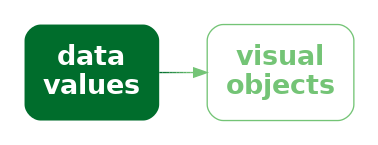
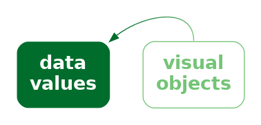
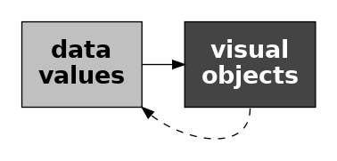
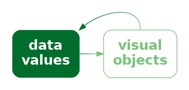
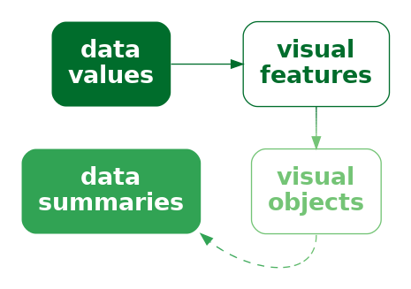
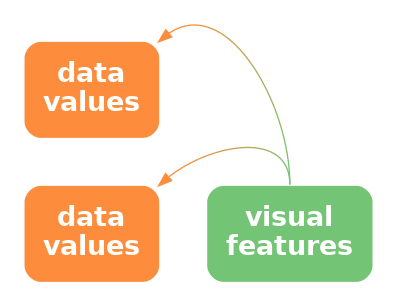
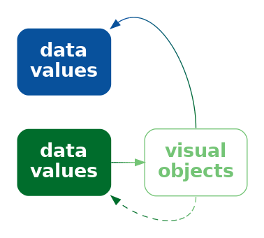

```{r}
#| echo: false
#| message: false
source("common.R")
```

# Visual Objects {#sec-visual-objects}

@fig-scatter-country shows a scatter plot of the number of clean breaks and the
number of tries for countries
at the 2023 Rugby World Cup (@tbl-rwc-2023).
This data visualisation is similar to @fig-scatter, but it adds an
extra encoding.  Country names are encoded as the **pattern** 
of the data symbols.
This is a reasonable encoding, despite the large number of different
countries, because each different shape only appears once.
We are able to distinguish all countries from each other and,
thanks to the legend, we can identify individual countries.

```{r}
#| echo: false
#| label: fig-scatter-country
#| fig-cap: A scatter plot with a different shape per country
ggplot(RWCperGame) +
    geom_point(aes(breaks, tries, shape=country), fill="grey", size=3) +
    scale_shape_manual(values=(1:25)[-c(15:18, 20)], 
                       guide=guide_legend(ncol=2), name=NULL) +
    theme(aspect.ratio=2/3)
```
@fig-flags shows another scatter plot of the number of clean breaks and the
number of tries for countries
at the 2023 Rugby World Cup, but this time with flags as the data symbols.
In one sense, this is just a variation on @fig-scatter-country
because the country
names are encoded as the **pattern** of a data symbol. 
We can decode from the pattern of each data symbol to the relevant country.

```{r}
#| echo: false
#| label: fig-flags
#| fig-cap: A scatter plot with flags as data symbols
size <- 10
flagGroup <- function(data, coords) {
    width <- unit(size, "mm")
    height <- data$ar * width
    grobTree(rectGrob(coords$x, coords$y, 
                      width, height, 
                      gp=gpar(col=figbg, fill=NA, lwd=3)),
             rectGrob(coords$x, coords$y, 
                      width, height, 
                      gp=gpar(col="black", fill="white")),
             rasterGrob(readPNG(data$path), 
                        coords$x, coords$y, width))
}
flag_key <- function(data, ...) {
    i <- data$shape
    data <- rwcFlags[i, ]
    width <- unit(size, "mm")
    height <- data$ar * width
    grobTree(rectGrob(.5, .5,
                      width, height, 
                      gp=gpar(fill="white")),
             rasterGrob(readPNG(data$path), 
                        .5, .5, width))
}
ggplot(rwcFlags) +
    grid_group(flagGroup, 
               aes(breaks, tries, path=path, ar=ar, 
                   shape=country),
               inherit.aes=FALSE,
               show.legend=TRUE, key_glyph=flag_key) +
    scale_shape_manual(values=1:nrow(rwcFlags), guide=guide_legend(ncol=2),
                       name=NULL) +
    theme(legend.key.width=unit(size, "mm"),
          legend.key.height=unit(max(rwcFlags$ar)*size + 1, "mm"),
          aspect.ratio=2/3)
```

The difference between the data symbols in @fig-scatter-country and 
the data symbols on @fig-flags is that the flags are not only more
complicated data symbols, but they are familiar symbols.
We can decode that the flags are different, but 
we can also decode country names from the flags.
In the terms of @sec-visual-processing, 
the flags are **visual objects** because they represent visual information
that is combined with prior knowledge at a higher level of visual processing.

Rather than encoding the country name as the **pattern** of a simple data
symbol (@fig-scatter-country), in @fig-flags
we have encoded each country name as a
different **visual object** (@fig-data-obj).

::: {#fig-data-obj}
::: {.content-visible when-format=pdf}
\includegraphics[scale=0.5]{Diagrams/data-obj.png}
:::

::: {.content-visible when-format=html}

:::

We can encode data values using data symbols that are complex visual objects.
:::

## Learned decodings {#sec-learned}

We **encode** data values
as visual features so that the viewers of a data visualisation can
**decode** the data values from the visual features 
(@fig-visual-feature-decode).

In @sec-implicit, we saw that some encodings are effective because
there are **implicit decodings**.  For example, a longer bar in a bar
plot naturally corresponds to a larger quantity.
Basic visual features, like length, are effective thanks
to *pre-existing* decodings that are built-in features
of our visual system (@fig-implicit-decode).

Part of the power of **visual objects** also comes from pre-existing decodings.
However, these decodings are *learned* rather than being built-in.
In some cases, we are able to **decode**
values from a visual feature based on prior experience and learning---via
a **learned decoding**---rather than 
due to an implicit encoding (@fig-learned-decode).[^inferred]

[^inferred]:
    @inferred-mappings refer to *inferred mappings*, in particular
    from colours to quantities, though this relates more to 
    *implicit decodings* (@sec-implicit) than learned decodings.

    @affective-congruence explore the affective, or emotional, response
    to colours.  It is unclear whether the decoding of 
    colours to emotions is implicit or learned or some combination.

    The idea of *cognitive affordance* (@cognitive-affordance) also
    relates to learned encodings because it takes into account an
    individual's knowledge and experience in determining how well
    information is communicated.


::: {#fig-learned-decode}
::: {.content-visible when-format=pdf}
\includegraphics[scale=0.5]{Diagrams/learned-decode.png}
:::

::: {.content-visible when-format=html}

:::

Some visual objects have learned decodings, which means that we
can decode values from the visual objects without having explicitly
encoded values as visual features.  This is similar to the 
idea of implicit encoding (@fig-implicit-decode).
:::

For example, @fig-learned shows three coloured circles.
Without any explicit encoding, we can decode the red circle as "stop",
the orange circle as "slow", and the green circle as "go".
This is not a decoding that we are born with; it is a 
decoding that we learn through experience.

```{r}
#| echo: false
#| label: fig-learned
#| fig.width: 4
#| fig.height: 1
#| fig-cap: An example of visual symbols that have pre-existing, learned decodings.  
## https://www.color-hex.com/color-palette/35021
traffic <- c("#cc3232", "#e7b416", "#2dc937")
grid.newpage()
grid.roundrect(width=unit(10, "mm"), height=.9, gp=gpar(fill="black"))
grid.circle(y=c(.75, .5, .25), r=unit(2, "mm"),
            gp=gpar(col=traffic, fill=traffic))
```

The flags in @fig-flags provide examples of learned decodings.
We associate each flag with a particular country because we have
seen these flags before and we have learned the decoding from flag
to country (@fig-learned-decode).

In terms of visual congruence (@sec-congruence), 
a learned decoding strengthens the effectiveness of the 
explicit encoding because the learned decoding leads back to the
same data values that we explicitly encoded (@fig-data-obj-decode).
This is similar to having a congruent *implicit* decoding 
(@fig-congruent-decode).

::: {#fig-data-obj-decode}

::: {.content-visible when-format=pdf}
\includegraphics[scale=0.5]{Diagrams/data-obj-decode.png}
:::

::: {.content-visible when-format=html}

:::

If we explicitly encode data values as visual objects in a way
that is consistent with a learned decoding, we can more effectively
decode data values from the visual objects.
:::

@fig-flags-direct demonstrates this point by repeating the scatter plot,
but removing the legend.  We are still able to identify not only 
that the data symbols represent different countries, but we can identify
(at least some of) the country names as well because of the
learned decoding of the flags (@fig-obj-decode).

```{r}
#| echo: false
#| label: fig-flags-direct
#| fig-cap: A scatter plot with flags as data symbols
flagPanel <- function(data, coords) {
    width <- unit(size, "mm")
    height <- data$ar * width
    flags <- lapply(1:nrow(data),
                    function(i) {
                        grobTree(rectGrob(coords$x[i], coords$y[i], 
                                          width, height[i], 
                                          gp=gpar(col=figbg, lwd=3)),
                                 rectGrob(coords$x[i], coords$y[i], 
                                          width, height[i], 
                                          gp=gpar(fill="white")),
                                 rasterGrob(readPNG(data$path[i]), 
                                            coords$x[i], coords$y[i], width))
                    })
    do.call(grobTree, flags)
}
ggplot(rwcFlags) +
    grid_panel(flagPanel, 
               aes(breaks, tries, path=path, ar=ar)) +
    theme(aspect.ratio=2/3)
```

::: {#fig-obj-decode}
::: {.content-visible when-format=pdf}
\includegraphics[scale=0.5]{Diagrams/obj-decode.png}
:::

::: {.content-visible when-format=html}

:::

Some visual objects have learned decodings, which means that 
if we encode data values as the visual objects, decoding will be automatic.
:::

Just to make the point completely clear, @fig-scatter-country-no-legend
shows @fig-scatter-country without a legend.
Although we can still perceive that the data symbols are different
from each other,
there is no learned decoding for the shape of the data symbols in 
@fig-scatter-country-no-legend, so they do not, by themselves
 decode to the country names.
We can clearly see that @fig-flags-direct contains more information
than @fig-scatter-country-no-legend.

```{r}
#| echo: false
#| label: fig-scatter-country-no-legend
#| fig-cap: A scatter plot with a different data symbol pattern per country
ggplot(RWCperGame) +
    geom_point(aes(breaks, tries, shape=country), fill="grey", size=3) +
    scale_shape_manual(values=(1:25)[-c(15:18, 20)], 
                       guide="none") +
    theme(aspect.ratio=2/3)
```

> A plot that uses visual objects as data symbols can be effective
  because the visual objects can convey information based on learned
  decodings.

@fig-flags-direct also demonstrates a weakness of **visual objects**.
The flags work well for identifying the country names *only if*
we are familiar with all of the different flags.
For example, it may only be Australians and New Zealanders who can 
reliably identify the difference between their two flags.

> A plot that uses visual objects as data symbols may *not* be effective
  if the learned decodings have not been learned by the viewer.

Another significant problem is that the data symbols in 
@fig-flags-direct are relatively complex.
One of the reasons why data visualisations that use 
simple data symbols are effective,
like bars in a bar plot
or data points in a scatter plot,
is because changes in the data are encoded as simple changes to
visual features in the data symbols, like a change in the length of a bar
(@sec-differences).
The flags in @fig-flags-direct contain many different visual features,
like different colours, 
within the data symbol itself *and*
differ from each other on many visual features at once, like
differences in colours, patterns, and so on.

> A plot that uses visual objects as data symbols may *not* be 
  effective if the data symbols contain many different visual features
  that all change at once.

## Case study: Chernoff faces

@fig-chernoff visualises the 2023 Rugby World Cup data (@tbl-rwc-2023) using
Chernoff faces.[^chernoff]
The data symbol in this visualisation is a little unusual; each
country is represented by a combination of circles, curves, and lines
that together produce a **visual object** that resembles a face
(@fig-data-vis-obj-stat-decode).
The encodings in this visualisation are also a little unusual.
The number of points scored is encoded as the **curvature** of the
smile, the number of tries is encoded as the **angle** of the eye brows,
and the number of clean breaks is encoded as the horizontal **position** of 
the eyes.

[^chernoff]:
    Chernoff faces were invented by Herman Chernoff as a way to visualise 
    high-dimensional data [@chernoff1973faces].

```{r}
#| echo: false
#| label: fig-chernoff
#| warning: false
#| fig-cap: A Chernoff faces plot of the ...
rwcChernoff <- RWCperGame
rwcChernoff$country <- reorder(rwcChernoff$country, rwcChernoff$points)
ggplot(rwcChernoff) +
    geom_chernoff(aes(x="", y="", smile=points, brow=tries, 
                      eyes=breaks),
                  size=20, fill="white") +
    facet_wrap(vars(country), strip.position="bottom") +
    coord_cartesian(clip="off") +
    theme(panel.border=element_blank(),
          strip.background=element_blank(),
          axis.title=element_blank(),
          axis.text=element_blank(),
          axis.ticks=element_blank(),
          legend.position="none",
          aspect.ratio=1)
```

::: {#fig-data-vis-obj-stat-decode}
::: {.content-visible when-format=pdf}
\includegraphics[scale=0.5]{Diagrams/data-vis-obj-stat-decode.png}
:::

::: {.content-visible when-format=html}

:::

We can encode data values as the visual features of a complex data symbols that 
produces a complex visual objects.
:::

The encodings in a Chernoff face are *not* very accurate (see @sec-accuracy;
**curvature** is ranked *below* colour in terms of accuracy),[^curvature] so
Cheroff faces are *not* very effective for 
decoding raw data values.

[^curvature]:
    @cleveland1984graphical ranked curvature below area, but above colour 
    in terms of accuracy for decoding quantitative data values
    (@fig-accuracy).

However, the familiarity of Chernoff faces means that we are easily
able to decode common combinations of the facial features.
For example, we can see several sad, worried
faces at the top-left of @fig-chernoff
and several happy, perhaps even smug, faces at the bottom-right.
We can decode clusters of countries that share similar combinations
of performance measures.
In other words, we can decode multivariate correlations
and multi-dimensional groupings in the data.

In this case, the happier faces have been arranged to
correspond to the more successful teams and the 
teams have been ordered from least points scored to most points scored
(@sec-distance-effect).
The resulting proximity helps with perceiving groups of similar faces.

> A Chernoff face is effective at conveying multi-dimensional relationships
  because the data symbol is a familiar visual object from which we can
  easily decode simple human emotions.

On the downside, Chernoff faces suffer from the same problem as 
profile plots (@fig-profile):  they are only effective
for a small amount of data.  Furthermore, the faces that
result is highly dependent on which variables are encoded as which features.
This is similar to the problem that we saw with selecting the order
and direction of axes in parallel coordinate plots
(@sec-parallel).

## Visual features of visual objects {#sec-vis-object-feature}

@fig-chernoff-colour shows a variation of @fig-chernoff.
In this plot, the hemisphere of each country is encoded
as the **colour** of the flag (large or small).
@fig-chernoff-colour shows that
visual objects, although they are complex data symbols, can still have
basic visual features, like **colour**.


```{r}
#| echo: false
#| label: fig-chernoff-colour
#| warning: false
#| fig-cap: A Chernoff faces plot of the ...
rwcChernoff <- RWCperGame
rwcChernoff$country <- reorder(rwcChernoff$country, rwcChernoff$points)
cols <- pal_npg()(2)
ggplot(rwcChernoff) +
    geom_chernoff(aes(x="", y="", smile=points, brow=tries, 
                      eyes=breaks, colour=sphere),
                  size=20, fill="white") +
    facet_wrap(vars(country), strip.position="bottom") +
    ggtitle(paste0('<span style="color: ', cols[1], '">South</span> versus ',
                   '<span style="color: ', cols[2], '">North</span>')) +
    coord_cartesian(clip="off") +
    theme(plot.title=element_markdown(),
          panel.border=element_blank(),
          strip.background=element_blank(),
          axis.title=element_blank(),
          axis.text=element_blank(),
          axis.ticks=element_blank(),
          legend.position="none",
          aspect.ratio=.8)
```

This means that it is still possible to encode data values as
basic visual features of visual objects, just as we can with
much simpler data symbols, like data points.
We saw in @sec-vis-shape-feature 
that we can do this with other complex data symbols, 
visual shapes, as well.

@fig-flags-size shows another example, this time with a variation
of @fig-flags-direct.  In @fig-flags-size,
the hemisphere of each country is encoded as the **area**
of the flag (large versus small).
We can decode the hemisphere for each country just from this basic
visual feature, separately from decoding the country name
from the visual object.

```{r}
#| echo: false
#| label: fig-flags-size
#| fig-cap: A scatter plot with flags as data symbols
flagSize <- function(data, coords) {
    width <- unit(ifelse(data$sphere == "North", size*.5, size), "mm")
    height <- data$ar * width
    angle <- rep(0, nrow(data)) ## ifelse(data$sphere == "North", 30, -30)
    flags <- lapply(1:nrow(data),
                    function(i) {
                        grobTree(rectGrob(gp=gpar(col=figbg, lwd=3)),
                                 rectGrob(gp=gpar(fill="white")),
                                 rasterGrob(readPNG(data$path[i]), width=1),
                                 vp=viewport(coords$x[i], coords$y[i], 
                                             width[i], height[i],
                                             angle=angle[i]))
                    })
    do.call(grobTree, flags)
}
flagLegend <- function(data, coords) {
    grobTree(grobTree(rectGrob(gp=gpar(fill="white")),
                      textGrob("North", gp=gpar(fontsize=6)),
                      vp=viewport(unit(5, "mm"), just="left",
                                  unit(.5, "npc") + unit(5, "mm"),
                                  width=unit(6, "mm"), height=unit(3, "mm"))),
             grobTree(rectGrob(gp=gpar(fill="white")),
                      textGrob("South"),
                      vp=viewport(unit(5, "mm"), just="left",
                                  unit(.5, "npc") - unit(5, "mm"),
                                  width=unit(12, "mm"), height=unit(6, "mm"))),
             vp=viewport(x=1, just="left"))
}
gg <- ggplot(rwcFlags) +
    coord_cartesian(clip="off") +
    grid_panel(flagSize, 
               aes(breaks, tries, path=path, ar=ar, sphere=sphere)) +
    grid_panel(flagLegend) +
    theme(aspect.ratio=2/3)
grid.newpage()
pushViewport(viewport(x=0, width=.9, just="left"))
print(gg, newpage=FALSE)
popViewport()
```

## Decoding visual objects

If data values have been encoded as a single consistent feature
of a visual object, such as the colour or area of a visual
object (@sec-vis-object-feature), 
then decoding proceeds as for simpler data symbols like bars.

In @fig-flags, we saw an example of encoding individual data values
to visual objects:  each country name is encoded as a separate flag.
In this case, it is possible to decode an individual data value
from each visual object.
Assessing the accuracy of the decoding of quantitative data values from
visual objects is
difficult because there are very many possible visual objects.
[^evaluating]
On the other hand, the decoding of qualitative data values from visual objects,
thanks to the very large range of possible objects,
clearly has a very large capacity (@sec-capacity).
For example, there is no confusion between 
the large number of different flags in @fig-flags-direct
(apart from those silly Australian and New Zealand flags).

[^evaluating]:
    @annurev-statistics-031219-041252 allude to the difficulty of experimentally
    testing "rich, complex graphics that may require domain expertise in
    addition to the ability to read information from a visual display."

@fig-chernoff showed a different situation, where multiple data values
are encoded within a single visual object.
The result in this case is similar to when we encode
multiple data values within a visual shape (@sec-vis-shape-decode).
We are less able to decode individual data values, but
we gain the ability to decode multivariate data summaries,
such as multivariate clusters and multivariate correlations.

In some cases, it is also possible to obtain **visual summaries**
of visual objects, similar to what is possible for much simpler
data symbols, like data points in a scatter plot (@sec-visual-summaries).
For example, in @fig-chernoff, we can decode a trend of 
emotions from the rows of Chernoff faces, from more sad at the top
to more happy at the bottom.[^vis-obj-summary]

[^vis-obj-summary]:
    @ensemble-perception point to a study that demonstrates
    the ability to summarise crowds of faces for 
    "average emotional expression and gender."

## Case study: Choropleth maps {#sec-choropleth}

@fig-map shows a choropleth map of the
crime rate for 2021
in each police district of New Zealand.[^choropleth]
The crime rate data values for this map are shown in @tbl-map-data.

[^choropleth]:
    Choropleth maps are a very old form of data visualisation.  There are
    examples from more than 200 years ago! [@dupin1826carte]

The data symbol in @fig-map is a polygon representing the geographic
boundary of each police district.  This implicitly entails an encoding of
a police district as the **position** of a polygon.
Crime rate is encoded as the fill colour of each polygon.

The use of polygons as data symbols is effective because
the polygons form familiar shapes with familiar spatial arrangements
(familiar to a New Zealand audience at least).
The polygons are **visual objects** that have a learned decoding to 
districts within New Zealand.
The spatial arrangements are also a form of visual **congruence**;
the arrangements mirror the real-world spatial relationships 
between the regions
(@sec-congruence).

```{r}
#| echo: false
#| label: fig-map
#| fig-cap: A choropleth map of the crime rate for each police district for 2021.
ggplot(districts) +
    geom_sf(aes(fill=rate), colour=figbg, linewidth=.6) +
    scale_fill_continuous(name="crime rate") +
    theme(axis.ticks=element_blank(),
          axis.text=element_blank())
```

> A choropleth map is effective because it encodes geographic regions to
  familiar visual objects that resemble the real world regions.

A weakness of @fig-map is that it encodes the **quantitative** crime rate
as colour (chroma and/or luminance).
This means that we can only decode ordinal comparisons
between regions (@sec-ordinal).  For example, we can
see that the highest crime rate occurs in the Bay of Plenty (the darkest
region), but it is difficult to decode how much higher
that crime rate is compared to the next highest crime rate.

> A choropleth map is *only* effective for making ordinal comparisons
  between geographic regions because it encodes quantitative values as
  colour.

@fig-district-bar shows a bar plot of the same data,
which demonstrates the advantages and disadvantages of
the choropleth map in @fig-map.
In @fig-district-bar, it is much easier to compare the crime rate
values because crime rates are encoded as bar **length**. However,
it is much harder to associate the different regions with their
spatial arrangements because all we have are the region names.
Each police district is encoded as the vertical position of a bar,
with no correspondence to the spatial
arrangement of the regions in the real world.

```{r}
#| echo: false
#| label: fig-district-bar
#| fig-cap: A bar plot of the data from @fig-map
crimeDistrictBar <- subset(crimeDistrict, year == 2021)
crimeDistrictBar$district <- 
    reorder(crimeDistrictBar$district, crimeDistrictBar$rate)
ggplot(crimeDistrictBar) +
    geom_col(aes(rate, district)) +
    scale_x_continuous(name="crime rate", expand=expansion(c(0, .05))) +
    scale_y_discrete(name=NULL) + 
    theme(aspect.ratio=1)
```

Another potential weakness with choropleth maps is the fact that
regions differ in terms of **area**.
We know from @sec-more-is-more that larger data symbols are
associated with larger data values.
The larger polygons accurately
reflect the fact that some 
police districts are geographically larger than others, 
but there is potential for larger polygons
to be erroneously decoded as larger crime rates.

Two alternative approaches are shown in @fig-map-alt.
These both retain the region shapes of the map, but encode
crime rates to the **area** of circles or the **length** of bars.
These data symbols have a spatial arrangement that corresponds 
to the real-world arrangement of police districts
and they provide a better decoding of crime rates from data symbols
compared to
the colours in the choropleth map
(although area is still not the most accurate visual feature and the lengths
are unaligned; @sec-accuracy).


```{r}
#| echo: false
#| label: fig-map-alt
#| layout-ncol: 2
#| fig-cap: Alternative map-based representations of the crime rate in each police district for 2021.
#| fig.width: 4
#| fig-subcap:
#|   - Dots as data symbols.
#|   - Bars as data symbols.
ggplot(districts) +
    geom_sf(fill="grey", colour=figbg, linewidth=.6) +
    geom_point(aes(X, Y, size=rate)) +
    scale_fill_continuous(name="crime rate") +
    theme(axis.title=element_blank(),
          axis.ticks=element_blank(),
          axis.text=element_blank())

w <- 2
h <- 4
therm <- function(data, coords) {
    grobTree(rectGrob(coords$x, coords$y, 
                      width=unit(w, "mm"), height=unit(h, "mm"),
                      just="bottom",
                      gp=gpar(fill="white")),
             rectGrob(coords$x, coords$y, 
                      width=unit(w, "mm"), 
                      height=unit(h*data$height/max(data$height), "mm"),
                      just="bottom",
                      gp=gpar(fill="black")))
}
thermKey <- function(data, coords) {
    vp <- vpTree(viewport(.8, .2,
                          layout=grid.layout(5, 1, 
                                             widths=unit(1, "cm"),
                                             heights=unit(h, "mm")),
                          gp=gpar(fontsize=9),
                          name="layout"),
                 vpList(vpStack(viewport(layout.pos.row=5, name="c1"),
                                viewport(x=0, width=unit(w, "mm"), name="k1")),
                        vpStack(viewport(layout.pos.row=3, name="c2"),
                                viewport(x=0, width=unit(w, "mm"), name="k2")),
                        vpStack(viewport(layout.pos.row=1, name="c3"),
                                viewport(x=0, width=unit(w, "mm"), name="k3"))))
    grobTree(rectGrob(gp=gpar(fill="white"), 
                      vp="layout::c1::k1"),
             textGrob(0, unit(1, "npc") + unit(1, "mm"), hjust=0,
                      vp="layout::c1::k1"),
             rectGrob(gp=gpar(fill="white"), 
                      vp="layout::c2::k2"),
             rectGrob(y=0, height=.5, just="bottom",
                      gp=gpar(fill="black"), 
                      vp="layout::c2::k2"),
             textGrob(signif(max(districts$rate)/2, 1), 
                      unit(1, "npc") + unit(1, "mm"), hjust=0,
                      vp="layout::c2::k2"),
             rectGrob(gp=gpar(fill="black"), 
                      vp="layout::c3::k3"),
             textGrob(signif(max(districts$rate), 1), 
                      unit(1, "npc") + unit(1, "mm"), hjust=0,
                      vp="layout::c3::k3"),
             textGrob("rate", 
                      y=unit(1, "lines") + unit(2, "mm"), vjust=0,
                      gp=gpar(fontsize=10),
                      vp="layout::c3::k3"),
             childrenvp=vp)
}
ggplot(districts) +
    geom_sf(fill="grey", colour=figbg, linewidth=.6) +
    grid_panel(therm, aes(X, Y, height=rate)) +
    grid_panel(thermKey) +
    scale_fill_continuous(name="crime rate") +
    theme(axis.title=element_blank(),
          axis.ticks=element_blank(),
          axis.text=element_blank())
```

## Chart junk and clutter {#sec-junk}

@fig-junk shows a version of @fig-map with two cartoon villians
added in the top-left and bottom-right corners.[^crims]
These sorts of annotations are often, derisively, referred to as **chart junk**,
with the suggestion that they add no value and make it harder to 
extract the important information.[^chart-junk]

[^crims]:
    Image by [rawpixel.com](https://www.rawpixel.com/image/10104122/vector-person-cartoon-illustrations).  Free for Personal and Business use.

[^chart-junk]:
    There have been quite passionate arguments against the use 
    of visual embellishments in data visualisation.
    Tufte's exhortation to minimise the *data-ink ratio* 
    (the proportion of ink that represents data values)
    is the prime example [@tufte1983visual, Chapter 4].

    Stephen Few has also had quite a bit to say on the matter
    [e.g., @Few2011ChartjunkDebate].

    @Ajani2022DeclutterFocus summarise the general mood:
    "The visualization practitioner community prescribes two 
    popular guidelines for creating clear and efficient visualizations: 
    declutter and focus."

```{r}
#| echo: false
#| label: fig-junk
#| fig-cap: A choropleth map of the crime rate for each police district in 2021 (like @fig-map), with cartoon villian images added.
#| fig.keep: last
runonce <- function() {
    PostScriptTrace("Images/criminal.eps", "Images/criminal.xml")
}
bbox <- st_bbox(districts$geometry)
bboxDF <- data.frame(t(as.numeric(bbox)))
names(bboxDF) <- names(bbox)
## [-1] to remove the background
crimPic <- grImport::readPicture("Images/criminal.xml")[-1]
dx <- diff(crimPic@summary@xscale)
dy <- diff(crimPic@summary@yscale)
ar <- dy/dx
crim <- function(data, coords) {
    vp <- viewport(x=coords$xmin + .2, y=.7, width=.4, 
                   height=unit(ar*.4, "snpc"))
    crimDef <- defineGrob(grImport::pictureGrob(crimPic, exp=0), 
                          vp=vp,
                          name="crim")
    crimTL <- useGrob("crim", vp=vp)
    crimBR <- useGrob("crim",
                      transform=function(group, ...) {
                          viewportTransform(group, flip=groupFlip(flipX=TRUE))
                      },
                      vp=viewport(x=coords$xmax - .2, 
                                  y=unit(coords$ymin, "npc") + 
                                    unit(ar*.2, "snpc"),
                                  width=.4, height=unit(ar*.4, "snpc")))
    grobTree(crimDef, crimTL, crimBR)
}
ggplot(districts) +
    geom_sf(aes(fill=rate), colour=figbg, linewidth=.6) +
    grid_panel(crim, aes(xmin=xmin, xmax=xmax, ymin=ymin), data=bboxDF) +
    scale_y_continuous(expand=expansion(0)) +
    scale_fill_continuous(name="crime rate", 
                          guide=guide_colourbar(display="gradient")) +
    theme(panel.border=element_blank(),
          axis.ticks=element_blank(),
          axis.text=element_blank(),
          legend.margin=margin(0, 0, 0, 0),
          legend.justification="bottom")
## grid.force()
## grid.edit("bar::rect", grep=TRUE, gp=gpar(col="black"))
```

The cartoon villians are another example of **visual objects**.
They (crudely) convey the concepts of crime and criminals.
However, they are *not* **data symbols** because there is no encoding 
from the raw data to the cartoon villians.  Their position is
unrelated to the data, their colour is unrelated to the data, and
their size is unrelated to the data.
No information has been encoded in the visual objects,
so no useful information can be decoded (@fig-vis-clutter).
The best that can be said is that they relate to the **metadata**,
the general topic of the data visualisation.

::: {#fig-vis-clutter}
::: {.content-visible when-format=pdf}
\includegraphics[scale=0.5]{Diagrams/vis-clutter.png}
:::

::: {.content-visible when-format=html}

:::

Chart junk is a visual object that is *not* the result of encoding data values.
It cannot provide any decoding to data values.
:::

In @sec-differences we learned that we should keep things simple and only
present visual changes that correspond to changes in the data.
In @sec-attention we learned that our attention is drawn to the larger
and brighter items within an image.
The cartoon villians are relatively large, complex, and colourful
and bear no connection to the raw data, so there is a good chance
that they will distract from the visual features that do convey data values.

> Chart junk is *not* effective because it is impossible to decode
  data values from chart junk (no data values have been encoded)
  and because chart junk distracts from the visual
  elements that do represent data values.

However, 
it is important to point out that not all **visual objects** are chart junk.
For example, the data symbols in @fig-junk, the map regions, are also
**visual objects**, but they differ from the cartoon villians because 
they are related to the data values.

Furthermore, **visual objects** that have no connection to the raw
data may still have some positive effects.
For example, the cartoon villians are not devoid of information;
they convey the concept of crime 
more dramatically than the simple text label "crime rate".
The more complex and interesting images may attract attention to
the data visualisation as a whole and there is some evidence
that such annotations improve the memorability of a data 
visualisation.[^junk-pro]

[^junk-pro]:
    The arguments in favour of visual embellishments mostly
    relate to assessing the effectiveness of data visualisation
    by measures *other than* accuracy and efficiency.

    For example,
    @visual-embellishments found evidence that *visual embellishments*
    improved memorability
    and a survey by @Rahman2025AnnotationsSurvey concluded that
    *annotations* could lead to improved 
    comprehension, memorability, and recall.
  
    Even arch-enemies of chart junk make some
    concessions:
    "Graphical embellishments can support the effectiveness of a data
    visualization in three potential ways: 
    1) by engaging the interest of the reader (i.e., getting them to read 
    the content), 
    2) by drawing the reader’s attention to particular items that merit 
    emphasis, and 
    3) by making the message more memorable. 
    Embellishments only enhance effectiveness, however, if they refrain
    from undermining the message by significantly distracting from it or
    misrepresenting it" [@Few2011ChartjunkDebate].

    There is also some evidence that visual objects may perform
    better on standard measures under some circumstances.
    For example, 
    @ISOTYPE found evidence that encoding data values as pictographs
    rather than simple shapes produced *better* accuracy when cognitive
    load was higher (when the task was
    recall of a plot *prior* to the last observed plot).

> Visual objects that are not directly related to the data
  can still be effective because they can have a greater
  emotional impact and they can be more memorable.

Overall, visual objects that are not related to data values
are *not* effective for decoding data values,
so any other benefits have to be weighed against that cost.

## Case study: Icons

@fig-pic shows a data visualisation of the number of pet dogs and pet cats 
globally.[^statista]
The data symbols in this plot are images, or **icons**, of a cat and a dog,
with the number of pets encoded as the height of each icon.[^pictograms]
Icons are an example of **visual objects**;  they 
are effective for decoding categories because they
visually resemble physical objects, in this case, cats and dogs.

[^statista]:
    These counts were obtained from [Statista](https://www.statista.com/statistics/1044386/dog-and-cat-pet-population-worldwide/).

[^pictograms]:  
    We use the term *icon* to describe a small recognisable image.
    These are also also known as 
    *pictograms* [@ISOTYPE; @Brewer_Campbell_1998].
    @borgo-2013-gly make further fine distinctions between *icons*, *indices*, 
    *symbols*, *pictograms*, and *ideograms*.

Unfortunately, because the cat and dog images are not simple shapes, it
is harder to accurately decode the heights of the images, so it is
harder to decode the number of cats and dogs.
Even worse, we are likely to decode the the size, or **area**, of the images.
The dog image is wider than the cat image so the number of dogs is
visually over-emphasised.

```{r}
#| echo: false
## https://www.statista.com/statistics/1044386/dog-and-cat-pet-population-worldwide/
pets <- data.frame(pet=c("dog", "cat"), count=c(471, 373))
## https://openclipart.org/download/319840/cat-silhouette.svg
## https://openclipart.org/download/276049/Dog.svg
runonce <- function() {
    rsvg_svg("Images/cat.svg", "Images/cat-cairo.svg")
    rsvg_svg("Images/dog-crop-manual.svg", "Images/dog-cairo.svg")
}
## cat <- readPNG("Images/cat.png")
## dog <- readPNG("Images/dog.png")
cat <- grImport2::readPicture("Images/cat-cairo.svg")
dog <- grImport2::readPicture("Images/dog-cairo.svg")
```

```{r}
#| echo: false
#| label: fig-pic
#| fig-cap: A data visualisation of the number of pet cats and pet dogs worldwide.
petGlyph <- function(data, coords) {
    grobTree(grImport2::pictureGrob(cat, coords$x[2], 0, height=coords$y[2], 
                         just="bottom", expansion=0),
             grImport2::pictureGrob(dog, coords$x[1], 0, height=coords$y[1], 
                         just="bottom", expansion=0))
}
ggplot(pets) + 
    grid_panel(petGlyph, aes(x=pet, y=count)) +
    scale_y_continuous(limits=c(0, NA), expand=expansion(c(0, .05))) +
    scale_x_discrete(expand=expansion(c(.5, .7))) +
    coord_cartesian(clip="off") +
    xlab("") +
    ylab("millions") +
    theme(axis.text.x=element_blank(),
          axis.ticks.x=element_blank(),
          aspect.ratio=1/2)
```

@fig-pic-alt shows two alternative uses of icons that attempt to resolve
some of the problems in @fig-pic.  In @fig-pic-alt-1, the images are
distorted so that they have the same width and so that only the height
of the images changes.
While the fixed width helps with decoding the
number of pets from the heights of the icons,
this sort of distortion can remove the learned decoding
of the icons if they become unrecognisable.

@fig-pic-alt-2 uses a bar to represent the number of pets and just
has a small version of the icon at the base of each bar.
We know that the bar is effective for decoding the number
of pets and the small icons are effective for decoding the
categories of cat and dog.

```{r}
#| echo: false
#| layout-ncol: 2
#| fig.width: 4
#| label: fig-pic-alt
#| fig-cap: Two alternative uses of icons.
#| fig-subcap:
#|   - distorted icons
#|   - icon labels
petStretch <- function(data, coords) {
    grobTree(## rectGrob(coords$x[2], width=unit(3, "cm"),
             ##          0, height=coords$y[2], 
             ##          just="bottom", gp=gpar(col=NA, fill="grey80")),
             grImport2::pictureGrob(cat, coords$x[2], width=unit(3, "cm"),
                         0, height=coords$y[2], 
                         just="bottom", expansion=0, distort=TRUE),
             ## rectGrob(coords$x[1], width=unit(3, "cm"),
             ##          0, height=coords$y[1], 
             ##          just="bottom", gp=gpar(col=NA, fill="grey80")),
             grImport2::pictureGrob(dog, coords$x[1], width=unit(3, "cm"),
                         0, height=coords$y[1], 
                         just="bottom", expansion=0, distort=TRUE))
}
ggplot(pets) + 
    grid_panel(petStretch, aes(x=pet, y=count)) +
    scale_y_continuous(limits=c(0, NA), expand=expansion(c(0, .05))) +
    scale_x_discrete(expand=expansion(c(.5, .5))) +
    coord_cartesian(clip="off") +
    xlab("") +
    ylab("millions") +
    theme(axis.text.x=element_blank(),
          axis.ticks.x=element_blank(),
          aspect.ratio=1)

petKey <- function(data, coords) {
    grobTree(grImport2::pictureGrob(cat, coords$x[2], 0, height=.2, 
                         just="bottom", expansion=0),
             grImport2::pictureGrob(dog, coords$x[1], 0, height=.2, 
                         just="bottom", expansion=0))
}
ggplot(pets) + 
    geom_col(aes(x=pet, y=count), width=.5, fill="grey80") +
    grid_panel(petKey, aes(x=pet, y=count)) +
    scale_y_continuous(limits=c(0, NA), expand=expansion(c(0, .05))) +
    scale_x_discrete(expand=expansion(c(.5, .5))) +
    coord_cartesian(clip="off") +
    xlab("") +
    ylab("millions") +
    theme(axis.text.x=element_blank(),
          axis.ticks.x=element_blank(),
          aspect.ratio=1)
```

@fig-pic-icon shows two more alternatives to @fig-pic.
@fig-pic-icon-1 uses repetitions of the icons to represent
the number of pets, still within a bar.
In this case, each icon represents 100 million
pets.
The ability to count individual icons can improve the decoding
of the overall data totals.[^icon-plots]
@fig-pic-icon-2 is a standard bar plot, but with each bar broken
into chunks.  
We need the labels "cat" and "dog" to replace the icons, but it 
is possible to count the bar chunks in a similar way to counting the icons
in @fig-pic-icon-1,
as well as decode the overall bar height, which we know 
is effective for decoding the number of pets.

[^icon-plots]:
    @ISOTYPE refer to the ability to rapidly count small numbers of items
    (*subitizing*) and recommend breaking bars into (a small number of)
    countable chunks to improve the decoding of overall height
    (as in @fig-pic-icon-2).  This is similar to the use
    of grid lines, but appears to rely on a different visual effect.

```{r}
#| echo: false
#| layout-ncol: 2
#| fig.width: 4
#| label: fig-pic-icon
#| fig-cap: Two more alternative data visualisations of the pet data.
#| fig-subcap: 
#|   - Icons are repeated to represent the number of pets.
#|   - A basic bar plot, but with each bar broken into chunks.
forceGpar <- function(gp) gpar(col="black", fill=figbg, lwd=.5)
petIcon <- function(data, coords) {
    height <- .2
    ncat <- coords$y[2] %/% height + 1
    ndog <- coords$y[1] %/% height + 1
    cats <- do.call(grobTree, 
                    lapply(1:ncat,
                           function(i) {
                               grobTree(## rectGrob(coords$x[2], 
                                        ##          (i - 1)*height,
                                        ##          height + .05, height,
                                        ##          just="bottom",
                                        ##          gp=gpar(col=NA, 
                                        ##                 fill="grey80")),
                                        grImport2::pictureGrob(cat, 
                                                    coords$x[2], 
                                                    (i - 1)*height, 
                                                    height=height, 
                                                    just="bottom",
                                                    expansion=0,
                                                    gpFUN=forceGpar),
                                        grImport2::pictureGrob(cat, 
                                                    coords$x[2], 
                                                    (i - 1)*height, 
                                                    height=height, 
                                                    just="bottom",
                                                    expansion=0,
                                                    clip="inherit"))
                           }))
    catBg <- grobTree(cats)
    catPile <- grobTree(cats,
                        vp=viewport(clip=rectGrob(y=0, height=coords$y[2], 
                                    just="bottom")))
    dogs <- do.call(grobTree, 
                    lapply(1:ndog,
                           function(i) {
                               grobTree(## rectGrob(coords$x[1], 
                                        ##          (i - 1)*height,
                                        ##          height + .05, height,
                                        ##          just="bottom",
                                        ##          gp=gpar(col=NA, 
                                        ##                 fill="grey80")),
                                        grImport2::pictureGrob(dog, 
                                                    coords$x[1], 
                                                    (i - 1)*height,  
                                                    height=height, 
                                                    just="bottom",
                                                    expansion=0,
                                                    gpFUN=forceGpar),
                                        grImport2::pictureGrob(dog, 
                                                    coords$x[1], 
                                                    (i - 1)*height,  
                                                    height=height, 
                                                    just="bottom",
                                                    expansion=0,
                                                    clip="inherit"))
                           }))
    dogPile <- grobTree(dogs,
                        vp=viewport(clip=rectGrob(y=0, height=coords$y[1], 
                                    just="bottom")))
    grobTree(catBg, catPile, dogPile)
}
ggplot(pets) + 
    grid_panel(petIcon, aes(x=pet, y=count)) +
    scale_y_continuous(limits=c(0, NA), expand=expansion(c(0, .05))) +
    scale_x_discrete(expand=expansion(c(.5, .5))) +
    coord_cartesian(clip="off") +
    xlab("") +
    ylab("millions") +
    theme(axis.text.x=element_blank(),
          axis.ticks.x=element_blank(),
          aspect.ratio=1)
gridLines <- function(data, coords) {
    segmentsGrob(.05, coords$y, .95, coords$y, gp=gpar(col=figbg, lwd=2))
}
ggplot(pets) + 
    geom_col(aes(x=pet, y=count), width=.5, fill="grey80") +
    grid_panel(gridLines, aes(y=y), data=data.frame(y=seq(100, 400, 100))) +
    scale_y_continuous(limits=c(0, NA), expand=expansion(c(0, .05))) +
    scale_x_discrete(expand=expansion(c(.5, .5))) +
    coord_cartesian(clip="off") +
    xlab("") +
    ylab("millions") +
    theme(aspect.ratio=1)
```

## Dangers of learned decodings {#sec-learned-danger}

@fig-stroop provides a demonstration of the Stroop Effect.[^stroop]
The task is to name the colour of each word.
This task is difficult to do because there are two decodings involved and 
the two decodings are inconsistent.
Each set of letters has a learned decoding based on the
semantics of the letters---the word that the letters spell out---but 
there is also a learned decoding based on the 
actual **colour** of the letters---the colour names that we learn 
as children.

[^stroop]:
    The effect was demonstrated by @stroop1935studies.
    Interestingly, there was little effect on response time for
    reading words that named colours that were coloured 
    with conflicting colours, but a much larger
    effect for naming colours of words that had conflicting colour names.

```{r}
#| echo: false
#| label: fig-stroop
#| fig-cap:  The Stroop effect. Try to name the *colour* of each word.
#| fig-height: 1
grid.newpage()
pushViewport(viewport(width=.5))
grid.text(c("red", "green", "blue"), 1:3/4, 
          gp=gpar(col=c(3, 4, 2), fontsize=20, fontface="bold"))
```

One issue with relying on learned decodings is that we may
learn more than one association for the same visual feature.
For example, the colour red is commonly associated with hot
(versus blue for cold), but also with stop (versus green for go), plus also
passion, or even anger.[^Arcia]
Furthermore, many associations are specific to a particular
culture.  For example, red is associated with luck and 
prosperity in Chinese culture, among other things.[^red-china]

[^Arcia]:
    @brockmann-1991 gives the following examples of ambiguous colour 
    association (attributed to @ThorellSmith1990):

    green for process control engineers means "nominal or safe," for financial
    managers it means "profitable," and for health care workers it means
    "infected."
        
    @Arcia2016MoreIsMore report examples of viewers interpreting 
    icons too literally.  For example, a picture of an apple as "apple"
    rather than the intended general category of "fruit".

[^red-china]:
    @red-china describes multiple associations in Chinese culture
    with the colour red.

    @colours-across-cultures provides a much broader range of 
    associations with a much broader range of colours and a much
    broader range of cultures.

Relying on a learned decoding can cause confusion if there are multiple
possible decodings.  It may not be clear
which data value should be decoded from the visual feature
(@fig-ambiguous-decode).[^learned-conflict-example]

[^learned-conflict-example]:
    @cognitive-affordance Figure 10 provides a good example of
    conflicting learned encodings.  Should a line plot that encodes
    amount of pain as vertical position map higher values to more pain
    ("more is up") or high values to less pain ("better is up")?

::: {#fig-ambiguous-decode}
::: {.content-visible when-format=pdf}
\includegraphics[scale=0.5]{Diagrams/ambiguous-decode.png}
:::

::: {.content-visible when-format=html}

:::

A visual object may have more than one learned decoding, which means that we
may decode more than one value from the visual object.
:::

The problem is much worse if the learned decoding(s) conflict with
an explicit encoding of data values.  For example,
in @fig-flags, if we use the incorrect flag for a country---we could
swap the Australian and New Zealand flags---we not only 
introduce confusion, but a misleading decoding 
(@fig-obj-dissonant-decode).
This is similar to the problem of
dissonant encodings (@sec-dissonance and @fig-dissonant-decode).

::: {#fig-obj-dissonant-decode}
::: {.content-visible when-format=pdf}
\includegraphics[scale=0.5]{Diagrams/obj-dissonant-decode.png}
:::

::: {.content-visible when-format=html}

:::

An explicit encoding may conflict with a learned decoding.
This will lead to confusion and/or incorrect decoding of the visual object.
:::

Suppose that we made a similar change to @fig-scatter-country,
swapping the open triangle for Australia and the square-with-a-plus symbol
for New Zealand.
That would not cause any problem because there is no learned
decoding to conflict with.
We only get the problem if we swap flags in @fig-flags 
because of the conflict with
learned decodings.

> Employing a learned decoding incorrectly can at best weaken and
  at worst destroy the effectiveness of a data visualisation.

## Dangers of visual objects {#sec-object-danger}

One issue with more complex data visualisations 
is that their effectiveness depends on a larger amount of
learning and experience. 
If the viewer does not have the knowledge required to 
decode a visual object, then the data visualisation will fail
(@fig-not-learned-decode).
We saw an example of this in @fig-flags-direct, where the 
familiarity of different country
flags will vary with nationality and age, for example.

::: {#fig-not-learned-decode}
::: {.content-visible when-format=pdf}
\includegraphics[scale=0.5]{Diagrams/not-learned-decode.png}
:::

::: {.content-visible when-format=html}

:::

If we encode data values using data symbols that are complex visual objects,
but there is no learned decoding, the encoding will be ineffective
because there is no decoding back to the data value.
:::

An extreme version of this problem is the use of not just complex
or unusual
data symbols, but entirely novel
data visualisations.[^novel-plot]

[^novel-plot]:
    This relates to Kosslyn's *Principle of Appropriate Knowledge*
    [@eye-and-mind]: 
    "Readers can interpret a display only if it builds on appropriate
    information that they have already stored in memory."

    @Pinker1990GraphComprehension talks about the necessity of
    having a *graph schema* in order to be able to decode information
    from a graph.

    @Shah2002GraphComprehension provide multiple examples of 
    young students misinterpreting
    the message from line plots, which suggests that we need to *learn*
    how to make effective use of even basic data visualisation formats.

For example, @fig-andrews shows an Andrews curves plot.[^andrews-curves]
This data visualisation encodes each row of data to a line data symbol,
similar to a parallel coordinates plot.  However, the line
for an Andrews curve is a more complex data summary and one that
has no simple interpretation.  In other words, it is not possible
to decode even the individual data summaries from the data symbols
on an Andrews curve.
The x-axis and y-axis on an Andrews curve are of no real value,
which is why they have not been labelled on @fig-andrews.

The value of an Andrews curve lies in the visual shapes that are
produced by each line.
If two rows of data are similar, then they will produce an
Andrews curve with a similar visual shape.
This means that we can decode clusters from lines that
appear similar on an Andrews curve plot.

For example, there are four curves in @fig-andrews that form a much higher
peak than the other curves.  The horizontal position of the peak and 
the vertical height of the peak is of no value, but the fact that
the four lines all have a similar peak suggests that there are four countries
that are similar to each other and different from all other teams on
at least one performance measure.

[^andrews-curves]:
    Andrews curves were invented as a way to visualise high-dimensional
    data by David F. Andrews [@andrews-curves].
    The curve is a sum of sine and cosine waves with coefficients
    based on the data values.

```{r}
#| echo: false
#| label: fig-andrews
#| warning: false
#| results: hide
#| fig-cap: An Andrews plot of the performance measures for teams in the 2023 Rugby World Cup.
## remotes::install_github("gbasulto/drewcurves")
library(drewcurves)
drew <- drewcurves(RWCperGame[c(2, 11, 5, 10, 7)], # RWCperGame[-1]
                   group=1, # sphere
                   return_dataframe=TRUE)
andrewsLabel <- function(data, coords) {
    index <- data$x == unique(data$x)[length(unique(data$x)) %/% 2]
    which <- order(data$y[index], decreasing=TRUE)[1:4]
    x <- coords$x[index][1:4]
    y <- coords$y[index][which]
    col <- data$colour[index][which]
    ylab <- unit(.9, "npc") - unit(0:3, "lines")
    grobTree(segmentsGrob(x, y, unit(x, "npc") - unit(1, "cm"), ylab,
                          gp=gpar(col=col, lty="dotted")),
             textGrob(RWCperGame$country[which],
                      unit(x, "npc") - unit(1, "cm") - unit(2, "mm"), 
                      ylab,
                      just="right", gp=gpar(col=col)))
}
gg <- ggplot(drew) +
    geom_line(aes(t, value, colour=sphere, group=key), alpha=.5) +
    grid_panel(andrewsLabel, aes(t, value, colour=sphere, group=key)) +
    theme(axis.title=element_blank(),
          axis.text=element_blank(),
          axis.ticks=element_blank())
grid.newpage()
pushViewport(viewport(width=.8, height=.8))
print(gg, newpage=FALSE)
popViewport()
```

An andrews curve plot like @fig-andrews is an example of a data visualisation
that is difficult to decode without having learned how to decode the
plot.  Even if the decoding of similar lines as clusters of data rows
is fairly intuitive, ignoring the position and height of peaks and valleys
is not.

Parallel coordinates plots (@sec-parallel) are another example of a 
data visualisation that requires learning in order to decode
properly.  In particular, decoding a tight crossing of lines 
as a negative correlation between variables is not necessarily 
an intuitive decoding.
Ternary plots (@sec-ternary) is yet another example of this sort.
In this case, it is necessary to learn how to decode positions
relative to the oblique axes.

## Summary

::: {.content-visible when-format=html}

::: {.oldsummary .callout-note title='Précis *(click to expand/contract)*' icon=false collapse=true}
  






















:::

:::



---

```{=latex}
\theendnotes
```
