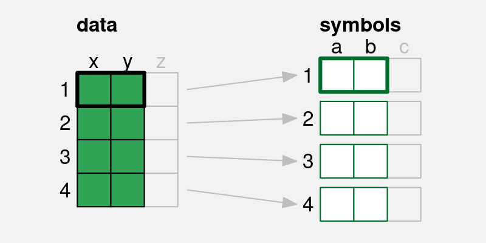
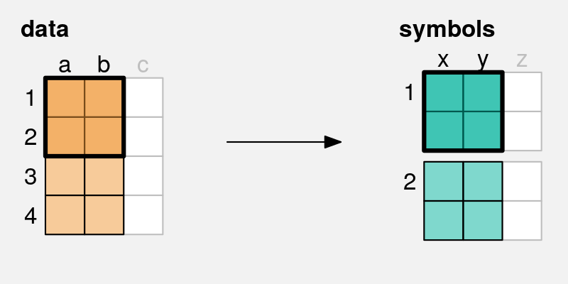
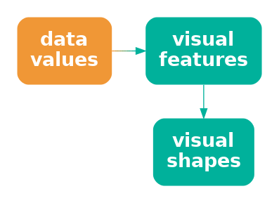
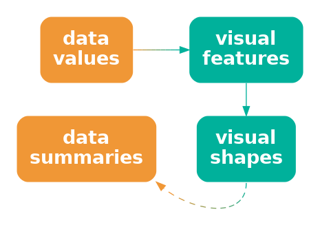
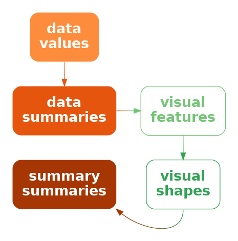

# Visual Shapes {#sec-visual-shapes}

All of the data visualisations that we have considered so far
have mapped a **single data value** from one or more variables
to a **single data symbol** (@fig-multivariate-symbol-a).
For example, a bar plot like @fig-bar maps one category and one count to one
bar.  A scatter plot like @fig-scatter maps one data value from a
quantitative variable and one data value from another quantitative variable
to one data point.

In this section, we consider data visualisations that map **multiple
data values** from one or more variables to a **single data symbol**
(@fig-multivariate-symbol-b), which results in more complex data symbols.

::: {#fig-multivariate-symbol layout-ncol=2}

{#fig-multivariate-symbol-a}

{#fig-multivariate-symbol-b}

\(a) A simple data symbol, like a bar in a bar plot or a data point in a
scatter plot involves mapping **one** data value from each of two variables 
to two visual features of 
**one** data symbol (this is a reproduction of the diagram in 
@fig-two-visual-features).
\(b) A more complex data symbol is produced if we map
**multiple** data values from each of two variables
to two visual features of a **single** data symbol.
Multiple data values from `a` and `b` are mapped to the visual
features, `x` and `y`, of a single data symbol.
:::

## Line plots

@fig-line shows a line plot of the number of offenders per year 
in different ethnic 
groups from 2011 to 2021 (see @tbl-crime-group-year).
This data visualisation is very effective for perceiving changes
over time in the number of offenders within each group as well as
comparing the changes over time between groups.

```{r}
#| echo: false
#| label: fig-line
#| fig-cap: A line plot of the number of offenders per year in different ethnic groups from 2011 to 2021.
gg <- ggplot(crimeGroup) +
    geom_line(aes(year, count, colour=group)) +
    scale_x_continuous(name=NULL) +
    scale_colour_npg(name="ethnic group") +
    theme(aspect.ratio=1)
pushViewport(viewport(width=.8, height=.8))
print(gg, newpage=FALSE)
popViewport()
```

There are some familiar mappings in this data visualisation: year
is mapped to horizontal **position**, the number of offenders
is mapped to vertical **position**, and the ethnic group is mapped
to **colour**.
However, the **data symbols** in this data visualisation, the coloured lines,
are different
from any previous examples that we have seen.
Although there are 44 rows of data, there are only 4 data symbols
because multiple rows of data are used to create each data symbol.
Each line in @fig-line represents 11 pairs of year and count values.

This contrasts with visualisations like bar plots that use simpler data symbols.
For example, the bar plot of the same data in @fig-side-bar-year has
44 bars.

@fig-line is effective at conveying changes over time because the
coloured lines create **visual shapes** (@fig-data-vis-shape)
and those visual shapes convey information about collections of data
values.
For example, we can perceive slopes and curves and peaks and valleys
in each of the coloured lines.

::: {#fig-data-vis-shape layout-ncol=2}



If we map multiple data values to multiple visual features of
a single data symbol, like in a line plot, 
we create a smaller number of more complex data symbols, **visual shapes**,
that contain a larger amount of information.
:::

In terms of the simple visual processing model from @sec-visual-processing,
these more complicated shapes can convey more sophisticated information,
at the expense of more cognitive effort, and with a limit on how many
shapes we can process simultaneously
(see @fig-visual-model).
In other words, the more complex data symbols allow us to 
map back to **data summaries** (@fig-data-vis-shape-decode).
For example, in @fig-line we are able to perceive overall trends in the number
of offenders, periods of more rapid change versus periods of slower
change, and local 
maxima and minima.

::: {#fig-data-vis-shape-decode layout-ncol=2}



If we map data values to a **visual shape**
that contains a large amount of information,
then we may be able to map back to more sophisticated **data summaries**.
:::

> One reason why line plots are effective is because they pack lots of
  data values into a complex data symbol that creates a visual shape,
  from which we are able to map back to data summaries.

On the other hand, the more complex data symbols in a line plot,
that contain multiple data values, are less effective at conveying
the *individual* raw data values. 
The coloured lines in @fig-line are not simple shapes
from which it is easy to perceive basic **visual features**.
This means that, although we may be able to map back to data summaries,
it is not easy to map back to the raw data values
(@fig-data-vis-shape-decode).
For example, compare the ease with which we can
determine the number of European/Other
offenders in 2013 from @fig-line versus @fig-side-bar-year.

This deficiency is significant because the main mappings in a line plot
are from **quantitative** data values to (horizontal and vertical) **position**.
We know from @sec-mapping-visual-features that these should be very
effective mappings that allow us to accurately map back to the raw data values.
However, in a line plot, we are not mapping a single data value to a
basic visual feature of a single, simple shape.  Instead, a single data value 
is being mapped, along with lots of other values,
to a basic visual feature of a complicated shape.  In effect, the
individual data values lose their individual identity.

> One reason why a line plot is *not* effective for mapping back to
  raw data values is because each raw data value is not mapped to its
  own data symbol.

The creation of complex data symbols from multiple data values
bears some similarity to the creation of emergent features by
combining visual features (@sec-integral).  In both cases,
we have *explicit* mappings from data values to basic visual features
and we produce an *implicit* additional visual effect.
The difference here is that with complex data symbols, we are collapsing
multiple data values into a data symbol, so we run a higher risk
of losing the ability to perceive individual data values.

There is also a similarity between complex data symbols and visual summaries 
(@sec-visual-summary).  In both cases, we gain the ability to perceive
data summaries from collections of data values.
Again, the difference is that with visual summaries, we are summarising
many simple data symbols that each represent individual data values, 
whereas with a complex data symbol we perceive the
data summary from a single data symbol that obscures the individual data values.

## Case study:  Scatter plots with lines

@fig-line-points shows a data visualisation of the number of offenders
per year in different ethnic groups (@tbl-crime-group-year).
This is very similar to @fig-line, but we have added a data point
at every horizontal and vertical **position**.

Like @fig-line, we can perceive overall trends from the line data symbols,
but we can also perceive individual data values more easily because
now every individual data value is mapped to its own data symbol.

```{r}
#| echo: false
#| label: fig-line-points
#| fig-cap: A plot of the number of offenders per year in different ethnic groups from 2011 to 2021 with both lines and points.
gg <- ggplot(crimeGroup) +
    geom_line(aes(year, count, colour=group)) +
    geom_point(aes(year, count, colour=group), 
               pch=21, fill=figbg, stroke=1) +
    scale_x_continuous(name=NULL) +
    scale_colour_npg(name="ethnic group") +
    theme(aspect.ratio=1)
pushViewport(viewport(width=.8, height=.8))
print(gg, newpage=FALSE)
popViewport()
```

## Case study: Density plots

@fig-density shows a density plot of the number of points scored by Tier One
nations at the Rugby World Cups (@tbl-rwc-all).
As with a histogram (@fig-hist), this data visualisation is effective
for conveying the distribution of data values.
For example, we can perceive that there is evidence of 
a single mode and right skew.

```{r}
#| echo: false
#| label: fig-density
#| fig-cap: A density plot of the points scored per game by Tier One nations at Rugby World Cups.
breaks <- seq(0, 105, by=5)
gg <- ggplot(rwcAll) +
    geom_density(aes(scored), colour="black", linewidth=1) +
    scale_x_continuous(name="points scored") +
    theme(axis.title.y=element_blank(),
          axis.text.y=element_blank(),
          axis.ticks.y=element_blank())
pushViewport(viewport(height=.8, width=.8))
print(gg, newpage=FALSE)
popViewport()
```

Also like a histogram, a density plot actually maps **data summaries**,
density estimates
rather than raw data values,
to visual features (see @tbl-density-stats).
However, rather than 
mapping each data summary to its own data symbol, a density plot
maps all of the data summaries to a single data symbol, a line, to create
a **visual shape**.
The density estimates are mapped to the horizontal and vertical **positions**
of a single line data symbol.
The visual shape allows us to perceive summaries of the density estimates.
For example, is there a single maximum density and how does the density
change to either side of that peak.

```{r}
#| echo: false
#| message: false
#| label: tbl-density-stats
#| tbl-cap: A table of density estimates at a sample of values over the range of the number of points scored by Tier One nations in Rugby World Cup matches.  These data summaries are the values that are mapped to visual features to produce the density plot in @fig-density.  There are 512 rows of values, but only the first 6 are shown here.
d <- density(rwcAll$scored, from=min(rwcAll$scored), to=max(rwcAll$scored))
dStats <- cbind(scored=d$x, density=d$y)
kable(head(dStats), digits=c(2, 4))
```

@fig-data-stat-vis-shape-stat shows the path from raw data values to
the visual shape in a density plot and
the summary information that we can map back to.
We cannot map back to the raw data values from a density plot, nor
can we map back very easily to the data summaries (the density estimates).
The only real purpose of the data symbol in a density plot is to 
map back to **summaries** of the data summaries, so that
we can perceive features of the density estimates.

::: {#fig-data-stat-vis-shape-stat layout-ncol=2}



A density plot maps data summaries to visual features to create a visual
shape from which we can map back to **summaries** of the data summaries.
:::

> A density plot is effective because it conveys high-level features of
  density estimates of the raw data.

A final commonality between density plots and histograms is that we get to
choose how the data summaries are calculated from the raw data values.
In the case of a density plot, we must choose a "kernel" and a "bandwidth",
both of which affect the smoothness of the density estimates.
This means that we may need to explore more than one kernel
and bandwidth (see the end of @sec-summary-caveats).

## Caveats

Need a caveat that more complex shapes does NOT necessarily mean 
useful mappings back to data summaries - could just end up with a mess.

## Summary

