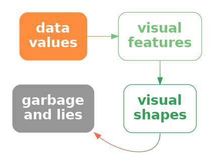

```{r}
#| echo: false
#| message: false
source("common.R")
```

# Visual Shapes {#sec-visual-shapes}

All of the data visualisations that we have considered so far
have mapped a **single data value** from one or more variables
to a **single data symbol** (@fig-multivariate-symbol-a).
For example, a bar plot like @fig-bar maps one category and one count to one
bar.  A scatter plot like @fig-scatter maps one data value from a
quantitative variable and one data value from another quantitative variable
to one data point.

In this section, we consider data visualisations that map **multiple
data values** from one or more variables to a **single data symbol**
(@fig-multivariate-symbol-b).
In this section, we begin to consider more complex data symbols.

::: {#fig-multivariate-symbol layout-ncol=2}

{#fig-multivariate-symbol-a}

{#fig-multivariate-symbol-b}

\(a) A simple data symbol, like a bar in a bar plot or a data point in a
scatter plot involves mapping **one** data value from each of two variables 
to two visual features of 
**one** data symbol;  a single pair of data values
produces a single data symbol (this is a reproduction of the diagram in 
@fig-two-visual-features).
\(b) A more complex data symbol is produced if we map
**multiple** data values from each of two variables
to two visual features of a **single** data symbol.
Multiple data values from `a` and `b` are mapped to the visual
features, `x` and `y`, of a single data symbol.
Multiple pairs of values produce a single data symbol.
:::

## Line plots {#sec-line-plots}

@fig-line shows a line plot of the number of offenders per year 
in different ethnic 
groups from 2011 to 2021 (see @tbl-crime-group-year).
This data visualisation is very effective for perceiving changes
over time in the number of offenders within each group as well as
comparing the changes over time between groups.

```{r}
#| echo: false
#| label: fig-line
#| fig-cap: A line plot of the number of offenders per year in different ethnic groups from 2011 to 2021.
gg <- ggplot(crimeGroup) +
    geom_line(aes(year, count, colour=group)) +
    scale_x_continuous(name=NULL, breaks=seq(2012, 2020, 2)) +    
    scale_colour_npg(name="ethnic group") +
    theme(aspect.ratio=1)
pushViewport(viewport(width=.8, height=.8))
print(gg, newpage=FALSE)
popViewport()
```

There are some familiar mappings in this data visualisation: year
is mapped to horizontal **position**, the number of offenders
is mapped to vertical **position**, and the ethnic group is mapped
to **colour**.
However, the **data symbols** in this data visualisation, the coloured lines,
are different
from any previous examples that we have seen.
Although there are 44 rows of data, there are only 4 data symbols.
Multiple rows of data are used to create each data symbol.
Each coloured line in @fig-line represents 11 pairs of year and count values.

This contrasts with visualisations like bar plots that use simpler data symbols.
For example, the bar plot of the same data in @fig-side-bar-year has
44 bars.

@fig-line is effective at conveying changes over time because the
coloured lines create **visual shapes** (@fig-data-vis-shape)
and those visual shapes convey information about collections of data
values.
For example, we can perceive slopes and curves and peaks and valleys
in each of the coloured lines.[^Visual_Pattern_Rec]

[^Visual_Pattern_Rec]:
    "VISUAL PATTERN RECOGNITION"
    Few (2006)
    Makes this same point
    [p 10]
    Demonstration of difference between density plot (mostly see a shape) and
    histogram (mostly see bar heights).

::: {#fig-data-vis-shape layout-ncol=2}


If we map multiple data values to multiple visual features of
a single data symbol, like in a line plot, 
we create a smaller number of more complex data symbols, **visual shapes**,
that contain a larger amount of information.
:::

In terms of the simple visual processing model from @sec-visual-processing,
these more complicated shapes can convey more sophisticated information,
at the expense of more cognitive effort, and with a limit on how many
shapes we can process simultaneously
(see @fig-visual-model).
In other words, the more complex data symbols allow us to decode
**data summaries** (@fig-data-vis-shape-decode).
For example, in @fig-line we are able to perceive overall trends in the number
of offenders, periods of more rapid change versus periods of slower
change, and local maxima and minima.[^lines-as-shapes]

[^lines-as-shapes]:
    "Understanding Charts and Graphs"
    Kosslyn (1989)
    [somewhere after p 205]
    Lines are objects
    "For example, if one wants a reader to see an interaction, a line graph is
     better than a bar graph: not only is a line a single perceptual unit, and
     hence there will be less to hold in short-term memory, but we are good at
     detecting slope differences-which convey the relevant information (see
     Pinker, 1988)."

::: {#fig-data-vis-shape-decode layout-ncol=2}


If we map data values to a **visual shape**
that contains a large amount of information,
then we may be able to decode more sophisticated **data summaries**.
:::

In terms of @sec-congruence, 
the use of lines for data symbols is also **congruent** with
trends in the data;  we naturally associate slopes with increases
and decreases in data values.[^line-trends]

[^line-trends]:
  According to Zacks and Tversky 1999
  people use "trend words" (increasing/decreasing) versus "discrete words"
  (higher/lower than) AND are faster to judge absolute values from bars
  but angle from line graphs.

> One reason why line plots are effective is because they encode multiple
  data values into a complex data symbol that creates a visual shape,
  from which we are able to decode data summaries.

On the other hand, the more complex data symbols in a line plot,
that contain multiple data values, are less effective at conveying
the *individual* raw data values. 
The coloured lines in @fig-line are not simple shapes
from which it is easy to perceive basic **visual features**.
This means that, although we may be able to decode data summaries,
it is not easy to decode the raw data values
(@fig-data-vis-shape-decode).
For example, compare the ease with which we can
determine the number of European/Other
offenders in 2013 from @fig-line versus @fig-side-bar-year.

This deficiency is significant because the main mappings in a line plot
are from **quantitative** data values to (horizontal and vertical) **position**.
We know from @sec-mapping-visual-features that these should be very
effective mappings that allow us to accurately decode the raw data values.
However, in a line plot, we are not mapping a single data value to a
basic visual feature of a single, simple shape.  Instead, a single data value 
is being mapped, along with many other values,
to a basic visual feature of a complicated shape.  In effect, the
individual data values lose their individual identity.[^bijective]

[^bijective]:
    citation for surjective, injective, bijective 

    Adam has a nice example in his thesis Figure 4.5, a simpler 
    version of which is a line or bar plot that contains a "total"
    line or bar - the visual objects do not map neatly, and disjointly
    to subsets of the data - there is overlap.  This makes mapping 
    back to the data harder or at least more ambiguous ?

> One reason why a line plot is *less* effective for decoding
  raw data values is because each raw data value is not mapped to its
  own data symbol.

The creation of complex data symbols from multiple data values
bears some similarity to the creation of emergent features by
combining visual features (@sec-integral).  In both cases,
we have *explicit* encodings from data values to basic visual features,
but we also produce an *implicit* additional visual effect.
The difference here is that with complex data symbols, we are collapsing
multiple data values into a data symbol, so we run a higher risk
of losing the ability to perceive individual data values.[^lines-configural]

[^lines-configural]:
    Also link to "configural displays" (David Peebles (2008)) and "display
    proximity" (Barnett & Wickens, 1988; Carswell & Wickens, 1987; Wickens &
    Andre, 1990) "According to the proximity compatibility principle (Wickens &
    Carswell, 1995), representations with high display proximity facilitate
    high mental proximity tasks requiring the integration of information from
    multiple sources. The relationship between display and mental proximity
    has been revealed in several studies (e.g., Barnett & Wickens, 1988; Bennett
    & Flach, 1992; Bennett, Toms, & Woods, 1993; Carswell & Wickens, 1987;
    Wickens & Andre, 1990; Wickens & Carswell, 1995) and it is argued that the
    advantage comes when emergent features (Pomerantz & Pristach, 1989) of the
    representation indicate additional information about the domain."  He also
    mentions line plots as being in between separable bar plots and configural
    radar plots.

There is also a similarity between complex data symbols and visual summaries 
(@sec-visual-summaries).  In both cases, we gain the ability to decode
data summaries from collections of data values.
Again, the difference is that with visual summaries, we are summarising
many simple data symbols that each represent individual data values, 
whereas with a complex data symbol we decode the
data summary from a single data symbol that obscures the individual data values.

## Case study:  Scatter plots with lines

@fig-line-points shows a data visualisation of the number of offenders
per year in different ethnic groups (@tbl-crime-group-year).
This is very similar to @fig-line, but we have added a data point
at every horizontal and vertical **position**.

Like @fig-line, we can decode overall trends from the line data symbols,
but we can also decode individual data values more easily because
now every individual data value is also mapped to its own data symbol.

```{r}
#| echo: false
#| label: fig-line-points
#| fig-cap: A plot of the number of offenders per year in different ethnic groups from 2011 to 2021 with both lines and points.
gg <- ggplot(crimeGroup) +
    geom_line(aes(year, count, colour=group)) +
    geom_point(aes(year, count, colour=group), 
               pch=21, fill=figbg, stroke=1) +
    scale_x_continuous(name=NULL, breaks=seq(2012, 2020, 2)) +    
    scale_colour_npg(name="ethnic group") +
    theme(aspect.ratio=1)
pushViewport(viewport(width=.8, height=.8))
print(gg, newpage=FALSE)
popViewport()
```

## Case study: Density plots {#sec-density}

@fig-density shows a density plot of the number of points scored by Tier One
nations at the Rugby World Cups (@tbl-rwc-all).
As with a histogram (@fig-hist), this data visualisation is effective
for conveying the distribution of data values.
For example, we can perceive that there is evidence of 
a single mode and right skew.

```{r}
#| echo: false
#| label: fig-density
#| fig-cap: A density plot of the points scored per game by Tier One nations at Rugby World Cups.
gg <- ggplot(rwcAll) +
    geom_density(aes(scored), colour="black", linewidth=1) +
    scale_x_continuous(name="points scored") +
    theme(axis.title.y=element_blank(),
          axis.text.y=element_blank(),
          axis.ticks.y=element_blank())
pushViewport(viewport(height=.8, width=.8))
print(gg, newpage=FALSE)
popViewport()
```

Also like a histogram, a density plot actually maps **data summaries**,
density estimates
rather than raw data values,
to visual features (see @tbl-density-stats).
In the case of a histogram, the data summary values are counts within bins
(see @tbl-hist-stats) and each data summary produces a separate bar.
However, a density plot encodes
all of the data summary values to a single data symbol, a line, to create
a **visual shape**.
The density estimates are mapped to the horizontal and vertical **positions**
of a single line data symbol.
The visual shape allows us to perceive summaries of the density estimates.
For example, whether there is a single maximum density and how the density
changes to either side of that peak.

```{r}
#| echo: false
#| message: false
#| label: tbl-density-stats
#| tbl-cap: A table of density estimates at a sample of values over the range of the number of points scored by Tier One nations in Rugby World Cup matches.  These data summaries are the values that are mapped to visual features to produce the density plot in @fig-density.  There are 512 rows of values, but only the first 6 are shown here.
d <- density(rwcAll$scored, from=min(rwcAll$scored), to=max(rwcAll$scored))
dStats <- cbind(scored=d$x, density=d$y)
kable(head(dStats), digits=c(2, 4))
```

@fig-data-stat-vis-shape-stat shows the path from raw data values to
data summaries (density estimates), which are encoded
as the visual features (horizontal
and vertical position) of a visual shape (a line)
in a density plot and
the summary information that we can decode from the visual shape.
We cannot decode the raw data values from a density plot, nor
can we very easily decode the data summaries (the density estimates).
The only real purpose of the data symbol in a density plot is to 
allow us to decode **summaries** of the data summaries, which are
visual features of the density estimates (like the number of peaks
and where the peaks occur).

::: {#fig-data-stat-vis-shape-stat layout-ncol=2}


A density plot maps data summaries to visual features to create a visual
shape from which we can decode **summaries** of the data summaries.
:::

> A density plot is effective because it conveys high-level features of
  density estimates of the raw data.

Another commonality between density plots and histograms is that we get to
choose how the data summaries are calculated from the raw data values.
In the case of a density plot, we must choose a "kernel" and a "bandwidth",
both of which affect the smoothness of the density estimates.
This means that we may need to explore more than one kernel
and bandwidth (see @sec-summary-caveats).

A final point about density plots, especially in comparison to histograms
is that it is more effective to present multiple density curves,
rather than multiple histograms.
This is demonstrated in @fig-multiple-density and @fig-multiple-hist.
Multiple histograms overlap each other, which makes it difficult
to perceive the separate histograms and this is not satisfactorily 
solved by adding semitransparency.
By comparison, multiple density curves create very little
overlap, and even though the orange curve passes "under" the blue curve,
we effortlessly perceive the orange curve as a single, coherent shape
(see @sec-visual-model-groups).

```{r}
#| echo: false
#| label: fig-multiple-density
#| fig-cap: Density plots of the points scored per game by Tier One nations at Rugby World Cups, broken down by hemisphere.
gg <- ggplot(rwcAll) +
    geom_density(aes(scored, colour=hemisphere), linewidth=1) +
    scale_x_continuous(name="points scored") +
    theme(axis.title.y=element_blank(),
          axis.text.y=element_blank(),
          axis.ticks.y=element_blank())
pushViewport(viewport(height=.8, width=.8))
print(gg, newpage=FALSE)
popViewport()
```
```{r}
#| echo: false
#| label: fig-multiple-hist
#| fig-cap: Histograms of the points scored per game by Tier One nations at Rugby World Cups, broken down by hemisphere.
breaks <- seq(0, 105, by=5)
gg <- ggplot(rwcAll) +
    geom_histogram(aes(scored, colour=hemisphere, fill=hemisphere), 
                   breaks=breaks, alpha=.2, position="identity") +
    scale_x_continuous(name="points scored") +
    scale_y_continuous(expand=expansion(c(0, .05)))
pushViewport(viewport(height=.8, width=.8))
print(gg, newpage=FALSE)
popViewport()
```

## Aspect ratio

How aspect ratio affects ability to detect features in lines

Also use of white space around points in scatter plot ?

Cite Cleveland (1994) for white space margin affecting strength of relation?

## The dangers of visual shapes

Need a caveat that more complex shapes does NOT necessarily mean 
useful mappings back to data summaries - could just end up with a mess
(@fig-data-vis-shape-lie).

::: {#fig-data-vis-shape-lie layout-ncol=2}



Mapping data values to the visual features of a complex shape 
may not be effective if the complex shape decodes to unhelpful
or misleading information.
:::

Lines imply continuity (at least) if not linear interpolation
so do example where connecting with lines not such a great idea.

## Case study: Violin plots

And other variations on boxplots

* Case study: SinaPlots

A SinaPlot is a nice combination of decode for raw data and for data summary.
[^sina]
@fig-sina is actually a combination of a SinaPlot and a violin plot.

[^sina]:
  @Sidiropoulos03072018

```{r}
#| echo: false
#| label: fig-sina
#| fig-cap: A SinaPlot of the points scored per game by Tier One nations at Rugby World Cups.
gg <- ggplot(rwcAll, aes(scored, y="")) +
    geom_violin() +
    geom_sina() +
    scale_x_continuous(name="points scored")
pushViewport(viewport(height=.8, width=.8))
print(gg, newpage=FALSE)
popViewport()
```

## Case study: loess curves

Another example of data -> summary -> features -> shapes -> summaries

## Case study: Line of best fit

Nice example of a complex calculation, the results of which are what gets
visualised.  Also example of performing the calculation numerically rather
than asking the viewer to perform it visually.  This was in summaries.qmd,
but it cannot be there because it requires scatter plots, which come in
the next section.
Add this after mention of visualising models?

Add footnote to Hadley's more complex model visualisation paper
https://vita.had.co.nz/papers/model-vis.pdf
https://dl.acm.org/doi/10.1002/sam.11271

model fits like lm straight line and ref Hadley's data-space vs model-space
"data models" to mirror "data statistics"
(revisit box plots as VERY simple models? also talk about failing
assumptions of these models, like unimodal for boxplot)

footnote cite to Tukey for visualising phenomena rather than raw data?
"Data-Based Graphics: Visual Display in the Decades to Come"
Tukey (1990)

## Summary

Mapping multiple data values to a single data symbol produces
a **visual shape**, like a line on a line plot.

Data summaries, such as trends over time, can can be decoded 
from a visual shape.
However, decoding raw data values from a visual shape may be harder, cmopared
to decoding raw data values from a simple data symbol like a bar.

---

```{=latex}
\theendnotes
```
